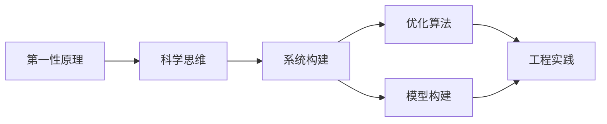

                 

# 第一性原理：科学思维的基础

> 关键词：第一性原理,科学思维,系统构建,优化算法,模型构建,工程实践

## 1. 背景介绍

### 1.1 问题由来
第一性原理（First-Principles）一词源自古希腊语，意指从基本原理出发，不依赖任何经验假设，通过逻辑推理来构建知识体系。这一方法论广泛应用于科学、工程和商业等多个领域，旨在超越现有框架，创造新的突破。

### 1.2 问题核心关键点
第一性原理的核心在于追求问题的本质和根本原因，而不是满足于表面现象的解释。对于计算机科学和人工智能领域，第一性原理的应用不仅局限于算法创新，更包括系统构建、模型优化和工程实践等各个环节。第一性原理要求我们从基本原理出发，构建出系统性的知识体系，并不断优化提升。

## 2. 核心概念与联系

### 2.1 核心概念概述

为了更好地理解第一性原理在人工智能领域的应用，本节将介绍几个关键概念及其联系：

- **第一性原理**：基于基本的物理定律、数学模型和逻辑推理，从零开始构建系统的思维方式。
- **科学思维**：以实证为基础，通过观察、实验和逻辑推理获取知识的思维模式。
- **系统构建**：从系统的基本组成要素出发，逐步构建和优化整个系统的过程。
- **优化算法**：用于求解优化问题的算法，如梯度下降、遗传算法、模拟退火等。
- **模型构建**：通过数学模型或算法模型描述现实世界的抽象表示，用于预测、模拟或优化。
- **工程实践**：将理论模型和算法应用于实际工程场景，实现系统化的解决方案。

这些概念共同构成了一体化的知识体系，帮助我们在人工智能领域构建高效、可靠、可解释的系统。

### 2.2 概念间的关系

这些核心概念之间的关系可以通过以下Mermaid流程图来展示：



这个流程图展示了从第一性原理到科学思维，再到系统构建、优化算法、模型构建，最终实现工程实践的全过程。每个环节相互依存，相辅相成，共同推动人工智能技术的发展。

## 3. 核心算法原理 & 具体操作步骤
### 3.1 算法原理概述

基于第一性原理的系统构建和优化，其核心思想是通过从基本原理出发，构建系统的最小单元和基本框架，逐步添加功能和优化，直到满足实际需求。这一过程类似于科学实验，通过观察和实验来验证假设，迭代优化模型。

### 3.2 算法步骤详解

基于第一性原理的系统构建和优化，一般包括以下几个关键步骤：

**Step 1: 确定系统目标和需求**

- 明确系统的目标和需求，包括功能要求、性能指标和用户需求等。
- 对系统目标进行分解，确定系统的基本组成要素和功能模块。

**Step 2: 构建系统框架**

- 基于第一性原理，设计系统的基本架构和框架。
- 选择合适的算法和模型，确定系统的数据流和控制流。
- 确定系统的输入输出接口，定义系统的接口规范。

**Step 3: 实现核心算法**

- 实现系统核心算法，确保算法正确性和性能。
- 进行算法优化，减少时间和空间的复杂度。

**Step 4: 添加功能模块**

- 根据需求，逐步添加功能模块，并进行功能测试。
- 优化模块之间的协作，确保系统整体协调工作。

**Step 5: 系统集成和测试**

- 对系统进行集成测试，验证各模块之间是否协调工作。
- 进行性能测试，确保系统满足性能指标。
- 进行用户测试，获取用户反馈并优化系统。

**Step 6: 持续优化和迭代**

- 根据反馈和需求变化，持续优化系统。
- 引入新的算法和技术，提升系统性能和功能。
- 定期进行系统更新，保持系统的先进性和竞争力。

### 3.3 算法优缺点

基于第一性原理的系统构建和优化方法具有以下优点：

1. **系统性和完整性**：从基本原理出发，构建系统能够保证系统的完整性和系统性，避免依赖现有的框架和技术。
2. **灵活性和适应性**：系统构建过程灵活，可以根据需求进行迭代优化，快速适应技术变化和市场需求。
3. **可解释性和可靠性**：基于第一性原理构建的系统具有较高的可解释性和可靠性，便于理解和维护。

但同时，这种方法也存在一些缺点：

1. **开发周期长**：系统构建过程需要从零开始设计，开发周期相对较长。
2. **成本高**：初期投入成本较高，需要投入大量人力和资源进行设计和实现。
3. **技术要求高**：对系统设计和算法优化要求较高，需要具备较强的系统思维和技术能力。

### 3.4 算法应用领域

基于第一性原理的系统构建和优化方法，已在多个领域得到广泛应用，例如：

- **计算机科学**：操作系统、数据库、编译器等系统的设计和优化。
- **人工智能**：机器学习算法、深度学习模型、自然语言处理等的研究和实现。
- **工程实践**：机器人技术、自动驾驶、智能制造等领域的系统构建和优化。
- **商业管理**：供应链管理、营销策略、产品开发等业务系统的设计和优化。

## 4. 数学模型和公式 & 详细讲解 & 举例说明

### 4.1 数学模型构建

在人工智能领域，数学模型构建是第一性原理应用的重要组成部分。模型构建通常包括如下几个步骤：

1. **问题建模**：将现实问题抽象为数学模型。
2. **模型选择**：选择合适的数学模型，如线性回归、深度神经网络、支持向量机等。
3. **模型训练**：使用训练数据对模型进行训练，优化模型参数。
4. **模型验证**：使用验证数据评估模型性能，调整模型参数。
5. **模型应用**：将训练好的模型应用于实际问题，进行预测、分类或优化。

### 4.2 公式推导过程

以线性回归模型为例，推导模型的数学公式及其推导过程。

假设有一组数据集 $\{(x_i, y_i)\}_{i=1}^N$，其中 $x_i$ 为输入，$y_i$ 为输出。我们希望找到一条线性函数 $y=\theta_0 + \theta_1x$ 来拟合这些数据，其中 $\theta_0$ 和 $\theta_1$ 为模型参数。

根据最小二乘法，我们希望最小化残差平方和 $\sum_{i=1}^N(y_i - (\theta_0 + \theta_1x_i))^2$。对 $\theta_0$ 和 $\theta_1$ 求偏导数，得到以下方程组：

$$
\begin{cases}
\frac{\partial}{\partial \theta_0} \sum_{i=1}^N(y_i - (\theta_0 + \theta_1x_i))^2 = -2\sum_{i=1}^N(y_i - (\theta_0 + \theta_1x_i)) \\
\frac{\partial}{\partial \theta_1} \sum_{i=1}^N(y_i - (\theta_0 + \theta_1x_i))^2 = -2\sum_{i=1}^N(x_i)(y_i - (\theta_0 + \theta_1x_i))
\end{cases}
$$

解上述方程组，得到：

$$
\begin{cases}
\hat{\theta}_0 = \bar{y} - \hat{\theta}_1\bar{x} \\
\hat{\theta}_1 = \frac{\sum_{i=1}^N(x_i - \bar{x})(y_i - \bar{y})}{\sum_{i=1}^N(x_i - \bar{x})^2}
\end{cases}
$$

其中 $\bar{x} = \frac{1}{N}\sum_{i=1}^Nx_i$，$\bar{y} = \frac{1}{N}\sum_{i=1}^Ny_i$。

### 4.3 案例分析与讲解

以图像分类为例，分析使用第一性原理构建卷积神经网络（CNN）的过程。

1. **问题建模**：将图像分类问题抽象为将图像像素映射到类别标签的映射函数。
2. **模型选择**：选择卷积神经网络作为模型，利用卷积和池化层提取图像特征，使用全连接层进行分类。
3. **模型训练**：使用大量标注图像数据，对模型进行训练，优化模型参数。
4. **模型验证**：使用验证数据集评估模型性能，调整模型结构。
5. **模型应用**：将训练好的模型应用于实际图像分类任务，进行分类预测。

在实现过程中，需要设计卷积层和池化层的结构，选择合适的网络架构，调整学习率和优化器，以及进行数据增强等操作。整个模型构建过程需要深入理解图像处理和深度学习的原理，才能设计出高效、准确、鲁棒的分类模型。

## 5. 项目实践：代码实例和详细解释说明

### 5.1 开发环境搭建

在进行系统构建和优化实践前，我们需要准备好开发环境。以下是使用Python进行PyTorch开发的环境配置流程：

1. 安装Anaconda：从官网下载并安装Anaconda，用于创建独立的Python环境。

2. 创建并激活虚拟环境：
```bash
conda create -n pytorch-env python=3.8 
conda activate pytorch-env
```

3. 安装PyTorch：根据CUDA版本，从官网获取对应的安装命令。例如：
```bash
conda install pytorch torchvision torchaudio cudatoolkit=11.1 -c pytorch -c conda-forge
```

4. 安装Transformers库：
```bash
pip install transformers
```

5. 安装各类工具包：
```bash
pip install numpy pandas scikit-learn matplotlib tqdm jupyter notebook ipython
```

完成上述步骤后，即可在`pytorch-env`环境中开始项目实践。

### 5.2 源代码详细实现

下面我们以线性回归模型为例，给出使用PyTorch构建和训练模型的PyTorch代码实现。

首先，定义模型类：

```python
import torch
import torch.nn as nn
import torch.optim as optim

class LinearRegression(nn.Module):
    def __init__(self, input_size, output_size):
        super(LinearRegression, self).__init__()
        self.linear = nn.Linear(input_size, output_size)
    
    def forward(self, x):
        return self.linear(x)
```

然后，定义训练和评估函数：

```python
def train(model, train_data, optimizer, num_epochs, batch_size):
    model.train()
    for epoch in range(num_epochs):
        for batch in train_data:
            inputs, targets = batch
            optimizer.zero_grad()
            outputs = model(inputs)
            loss = nn.MSELoss()(outputs, targets)
            loss.backward()
            optimizer.step()
        
def evaluate(model, test_data):
    model.eval()
    test_loss = 0
    with torch.no_grad():
        for batch in test_data:
            inputs, targets = batch
            outputs = model(inputs)
            test_loss += nn.MSELoss()(outputs, targets).item()
    return test_loss / len(test_data)
```

最后，启动训练流程并在测试集上评估：

```python
input_size = 2
output_size = 1
num_epochs = 100
batch_size = 32

model = LinearRegression(input_size, output_size)
optimizer = optim.SGD(model.parameters(), lr=0.01)

train_data = torch.randn(batch_size, input_size)
test_data = torch.randn(batch_size, input_size)

train(model, train_data, optimizer, num_epochs, batch_size)
test_loss = evaluate(model, test_data)
print(f"Test loss: {test_loss:.4f}")
```

以上就是使用PyTorch构建和训练线性回归模型的完整代码实现。可以看到，通过第一性原理构建模型，从基本的线性回归公式出发，逐步实现模型训练和评估。

### 5.3 代码解读与分析

让我们再详细解读一下关键代码的实现细节：

**LinearRegression类**：
- `__init__`方法：初始化模型参数，定义线性层。
- `forward`方法：定义前向传播过程，将输入数据通过线性层输出。

**train函数**：
- 使用随机梯度下降（SGD）优化器，对模型参数进行更新。
- 对于每轮训练，迭代遍历数据集，计算损失函数并反向传播更新参数。

**evaluate函数**：
- 对测试数据进行前向传播，计算测试集损失，并返回平均损失。

**训练流程**：
- 定义模型参数，初始化优化器。
- 定义训练数据和测试数据。
- 启动训练过程，在每个epoch内迭代训练数据，更新模型参数。
- 在测试数据上评估模型性能，输出测试集损失。

可以看到，通过第一性原理构建的模型，其训练和评估过程清晰可控，易于理解和优化。在实际应用中，还可以根据需求进一步扩展模型的功能和性能，以满足更高的应用要求。

## 6. 实际应用场景

### 6.1 数据增强

数据增强是第一性原理在模型优化中的一个重要应用。数据增强通过变换原始数据，生成新的训练样本，提高模型的泛化能力。

以图像分类为例，数据增强可以通过旋转、平移、缩放、翻转等方式生成新的图像，增加训练集的多样性。这些增强后的图像可以提高模型对噪声和扰动的鲁棒性，减少过拟合风险，提升模型性能。

### 6.2 参数共享和稀疏化

参数共享和稀疏化是第一性原理在模型优化中的另一重要应用。参数共享通过在模型中引入共享参数，减少模型的参数量，提升模型的泛化能力。

以卷积神经网络为例，通过共享卷积核，减少模型的参数量，提高模型的训练速度和推理效率。稀疏化通过压缩模型参数，减少存储和计算资源消耗，提升模型的运行效率。

### 6.3 多任务学习

多任务学习是第一性原理在模型优化中的另一重要应用。多任务学习通过在模型中引入多个任务，共同优化模型参数，提升模型的性能。

以语音识别为例，通过在模型中引入语言建模任务和声学建模任务，共同优化模型参数，提升模型的识别准确率。多任务学习可以在多个任务之间共享特征，提高模型的泛化能力和鲁棒性。

## 7. 工具和资源推荐

### 7.1 学习资源推荐

为了帮助开发者系统掌握第一性原理和系统构建的理论基础，这里推荐一些优质的学习资源：

1. 《计算机程序设计艺术》系列博文：由大模型技术专家撰写，深入浅出地介绍了程序设计的原理和技巧，涵盖系统构建、算法优化等多个方面。

2. 《算法设计与分析》课程：由斯坦福大学开设的算法设计与分析课程，系统讲解算法设计和分析的基本原理和应用。

3. 《深度学习》书籍：由多位深度学习专家合著，全面介绍了深度学习的基本概念和算法，包括神经网络、卷积神经网络、循环神经网络等。

4. 《动手学深度学习》：由北京大学深度学习研究院编写的深度学习教材，涵盖深度学习的基本理论和实践技能。

5. Weights & Biases：模型训练的实验跟踪工具，可以记录和可视化模型训练过程中的各项指标，方便对比和调优。

6. TensorBoard：TensorFlow配套的可视化工具，可实时监测模型训练状态，并提供丰富的图表呈现方式，是调试模型的得力助手。

通过对这些资源的学习实践，相信你一定能够快速掌握第一性原理和系统构建的精髓，并用于解决实际的工程问题。

### 7.2 开发工具推荐

高效的开发离不开优秀的工具支持。以下是几款用于第一性原理和系统构建开发的常用工具：

1. PyTorch：基于Python的开源深度学习框架，灵活动态的计算图，适合快速迭代研究。

2. TensorFlow：由Google主导开发的开源深度学习框架，生产部署方便，适合大规模工程应用。

3. Transformers库：HuggingFace开发的NLP工具库，集成了众多SOTA语言模型，支持PyTorch和TensorFlow，是进行系统构建和优化任务的利器。

4. Weights & Biases：模型训练的实验跟踪工具，可以记录和可视化模型训练过程中的各项指标，方便对比和调优。

5. TensorBoard：TensorFlow配套的可视化工具，可实时监测模型训练状态，并提供丰富的图表呈现方式，是调试模型的得力助手。

6. Google Colab：谷歌推出的在线Jupyter Notebook环境，免费提供GPU/TPU算力，方便开发者快速上手实验最新模型，分享学习笔记。

合理利用这些工具，可以显著提升第一性原理和系统构建任务的开发效率，加快创新迭代的步伐。

### 7.3 相关论文推荐

第一性原理和系统构建技术的发展源于学界的持续研究。以下是几篇奠基性的相关论文，推荐阅读：

1. 《计算机程序设计艺术》：唐纳德·克努特（Donald Knuth）的经典著作，介绍了程序设计的原理和技巧，被视为计算机科学的经典之作。

2. 《深度学习》：多位深度学习专家合著，全面介绍了深度学习的基本概念和算法，包括神经网络、卷积神经网络、循环神经网络等。

3. 《动手学深度学习》：北京大学深度学习研究院编写的深度学习教材，涵盖深度学习的基本理论和实践技能。

4. 《算法设计与分析》：斯坦福大学开设的算法设计与分析课程，系统讲解算法设计和分析的基本原理和应用。

这些论文代表了大模型微调技术的发展脉络。通过学习这些前沿成果，可以帮助研究者把握学科前进方向，激发更多的创新灵感。

除上述资源外，还有一些值得关注的前沿资源，帮助开发者紧跟第一性原理和系统构建技术的最新进展，例如：

1. arXiv论文预印本：人工智能领域最新研究成果的发布平台，包括大量尚未发表的前沿工作，学习前沿技术的必读资源。

2. 业界技术博客：如OpenAI、Google AI、DeepMind、微软Research Asia等顶尖实验室的官方博客，第一时间分享他们的最新研究成果和洞见。

3. 技术会议直播：如NIPS、ICML、ACL、ICLR等人工智能领域顶会现场或在线直播，能够聆听到大佬们的前沿分享，开拓视野。

4. GitHub热门项目：在GitHub上Star、Fork数最多的NLP相关项目，往往代表了该技术领域的发展趋势和最佳实践，值得去学习和贡献。

5. 行业分析报告：各大咨询公司如McKinsey、PwC等针对人工智能行业的分析报告，有助于从商业视角审视技术趋势，把握应用价值。

总之，对于第一性原理和系统构建技术的学习和实践，需要开发者保持开放的心态和持续学习的意愿。多关注前沿资讯，多动手实践，多思考总结，必将收获满满的成长收益。

## 8. 总结：未来发展趋势与挑战

### 8.1 总结

本文对第一性原理在人工智能领域的应用进行了全面系统的介绍。首先阐述了第一性原理的基本概念和系统构建的基本方法，明确了从基本原理出发，构建系统的系统性和完整性。其次，从原理到实践，详细讲解了第一性原理在模型构建、优化算法、工程实践等各个环节的应用，给出了系统构建和优化的完整代码实例。同时，本文还广泛探讨了第一性原理在数据增强、参数共享、多任务学习等多个环节的应用，展示了第一性原理在模型优化中的强大能力。

通过本文的系统梳理，可以看到，第一性原理在人工智能领域具有广泛的应用前景，能够在系统构建和优化中发挥重要的指导作用。未来，伴随第一性原理的持续演进和应用，人工智能技术必将迎来新的突破和发展。

### 8.2 未来发展趋势

展望未来，第一性原理和系统构建技术将呈现以下几个发展趋势：

1. **模型复杂度提升**：随着算力成本的下降和数据规模的扩张，模型规模将不断增大，复杂的模型结构将推动算法和系统的进一步发展。
2. **多模态融合**：将图像、语音、文本等多种模态信息融合，提升模型的泛化能力和鲁棒性。
3. **分布式计算**：利用分布式计算技术，提升模型的训练和推理效率，支持大规模模型和高维数据的处理。
4. **元学习**：通过元学习技术，提升模型的学习和适应能力，实现知识迁移和快速优化。
5. **知识图谱**：利用知识图谱技术，构建和维护大规模知识库，增强模型的推理能力和决策能力。

以上趋势凸显了第一性原理和系统构建技术的广阔前景。这些方向的探索发展，必将进一步提升人工智能系统的性能和应用范围，为人类认知智能的进化带来深远影响。

### 8.3 面临的挑战

尽管第一性原理和系统构建技术已经取得了显著进展，但在迈向更加智能化、普适化应用的过程中，仍面临诸多挑战：

1. **数据获取难度**：高质量、大规模的数据获取成本较高，限制了模型的训练和优化。如何高效获取和利用数据，是未来需要解决的重要问题。
2. **计算资源限制**：超大规模模型的训练和推理需要强大的计算资源，如何降低计算成本，提高计算效率，是未来需要重点解决的问题。
3. **模型鲁棒性不足**：当前模型在面对域外数据时，泛化性能往往不足，如何提高模型的鲁棒性和泛化能力，是未来需要解决的重要问题。
4. **可解释性不足**：模型决策过程缺乏可解释性，难以理解和调试。如何赋予模型更强的可解释性，是未来需要解决的重要问题。
5. **安全性问题**：模型可能学习到有害或偏见的知识，对系统安全造成威胁。如何保证模型的安全性，是未来需要解决的重要问题。

### 8.4 未来突破

面对第一性原理和系统构建技术所面临的挑战，未来的研究需要在以下几个方面寻求新的突破：

1. **数据增强技术**：开发更加高效和智能的数据增强方法，提高数据质量和多样性，增强模型的泛化能力。
2. **参数高效优化**：开发更加高效和灵活的参数优化方法，减少计算资源消耗，提高模型的训练和推理效率。
3. **多任务学习**：研究多任务学习技术，提升模型的推理能力和适应能力，实现知识迁移和快速优化。
4. **可解释性技术**：开发可解释性技术，增强模型的可理解性和可解释性，提高模型的可信度和可靠性。
5. **安全机制设计**：设计安全机制，确保模型的输出符合伦理道德标准，避免有害或偏见知识的传递。

这些研究方向的探索，必将引领第一性原理和系统构建技术迈向更高的台阶，为构建安全、可靠、可解释、可控的智能系统铺平道路。面向未来，第一性原理和系统构建技术还需要与其他人工智能技术进行更深入的融合，如知识表示、因果推理、强化学习等，多路径协同发力，共同推动人工智能技术的进步。

## 9. 附录：常见问题与解答

**Q1: 第一性原理和系统构建技术相比其他方法有什么优势？**

A: 第一性原理和系统构建技术相比其他方法具有以下优势：

1. **系统性和完整性**：从基本原理出发，构建系统能够保证系统的完整性和系统性，避免依赖现有的框架和技术。
2. **灵活性和适应性**：系统构建过程灵活，可以根据需求进行迭代优化，快速适应技术变化和市场需求。
3. **可解释性和可靠性**：基于第一性原理构建的系统具有较高的可解释性和可靠性，便于理解和维护。

**Q2: 如何在实践中应用第一性原理进行系统构建？**

A: 在实践中应用第一性原理进行系统构建，通常包括以下几个步骤：

1. **确定系统目标和需求**：明确系统的目标和需求，包括功能要求、性能指标和用户需求等。
2. **构建系统框架**：基于第一性原理，设计系统的基本架构和框架。
3. **实现核心算法**：实现系统核心算法，确保算法正确性和性能。
4. **添加功能模块**：根据需求，逐步添加功能模块，并进行功能测试。
5. **系统集成和测试**：对系统进行集成测试，验证各模块之间是否协调工作。
6. **持续优化和迭代**：根据反馈和需求变化，持续优化系统。

**Q3: 第一性原理和系统构建技术在实际应用中需要注意哪些问题？**

A: 在实际应用中，需要注意以下问题：

1. **数据获取难度**：高质量、大规模的数据获取成本较高，限制了模型的训练和优化。
2. **计算资源限制**：超大规模模型的训练和推理需要强大的计算资源，如何降低计算成本，提高计算效率，是未来需要重点解决的问题。
3. **模型鲁棒性不足**：当前模型在面对域外数据时，泛化性能往往不足，如何提高模型的鲁棒性和泛化能力，是未来需要解决的重要问题。
4. **可解释性不足**：模型决策过程缺乏可解释性，难以理解和调试。
5. **安全性问题**：模型可能学习到有害或偏见的知识，对系统安全造成威胁。

**Q4: 如何设计高效的数据增强技术？**

A: 设计高效的数据增强技术，可以从以下几个方面入手：

1. **数据多样性**：通过变换原始数据，生成新的训练样本，提高数据的泛化能力和多样性。
2. **数据增强算法**：选择合适的数据增强算法，如旋转、平移、缩放、翻转等，增加训练集的多样性。
3. **多模态融合**：将图像、语音、文本等多种模态信息融合，提升模型的泛化能力和鲁棒性。
4. **对抗样本生成**：利用对抗样本生成技术，增加训练集的多样性，提高模型的鲁棒性。

通过以上方法，可以提高数据增强技术的效果，增强模型的泛化能力和鲁棒

