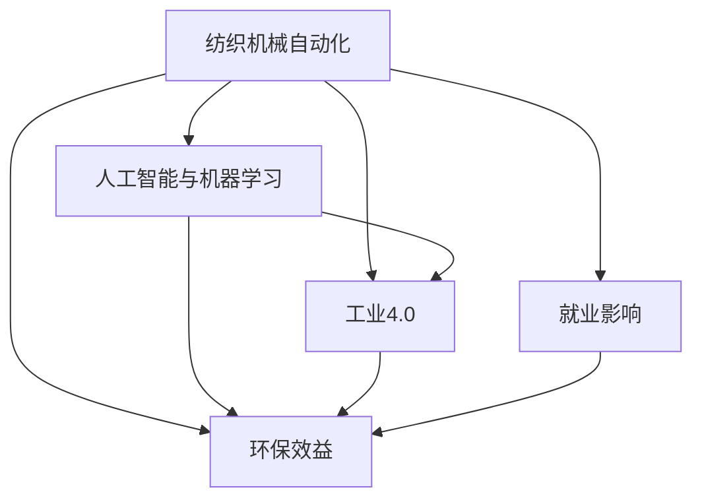

                 

# 纺织机械自动化的社会影响

## 1. 背景介绍

随着科技的迅猛发展，纺织机械自动化已逐渐成为纺织业的重要趋势。其影响不仅局限于生产效率的提升，更深刻地改变了社会的经济结构、就业格局以及生态环境等多个方面。纺织机械自动化的发展离不开人工智能和机器学习技术的加持，本文将从社会影响的多个维度探讨纺织机械自动化的发展趋势及应用。

## 2. 核心概念与联系

### 2.1 核心概念概述

- **纺织机械自动化**：指利用自动化技术和设备，实现纺织品的生产过程自动化。
- **人工智能与机器学习**：通过算法训练机器，使其具备智能决策能力，广泛应用于数据分析、模式识别、智能控制等领域。
- **工业4.0**：通过信息通信技术（ICT）和大数据技术，将整个制造过程数字化、智能化，实现高度自动化和灵活性。
- **就业影响**：自动化技术可能导致的劳动市场变化，包括就业岗位转移、技能需求变化等。
- **环保效益**：自动化生产可以提高能源效率，减少污染物排放，对环境产生正面影响。

### 2.2 概念间的关系

为更好理解纺织机械自动化的社会影响，我们通过Mermaid流程图展示概念之间的关系：



该流程图展示了自动化生产与人工智能、工业4.0、就业和环保之间的联系，进一步细化了自动化生产的影响维度。

## 3. 核心算法原理 & 具体操作步骤

### 3.1 算法原理概述

纺织机械自动化的核心在于通过自动化设备替代人工操作，并利用人工智能进行生产优化和决策。其算法原理包括：

- **机器视觉识别**：通过摄像头和计算机视觉算法，自动检测和分类纺织品瑕疵。
- **智能控制**：利用控制算法调整生产参数，如温度、湿度、速度等。
- **数据分析与预测**：利用机器学习模型对生产数据进行分析，预测生产趋势，优化生产计划。

### 3.2 算法步骤详解

具体步骤包括：

1. **数据采集**：使用传感器和摄像头收集生产数据，包括温度、湿度、原料成分、生产速度等。
2. **数据清洗**：清洗数据，去除噪声和异常值。
3. **特征提取**：提取关键特征，如原料成分、纤维长度等。
4. **模型训练**：使用历史数据训练机器学习模型，如决策树、神经网络等。
5. **智能控制**：将模型应用于实时数据，自动调整生产参数。
6. **效果评估**：通过实际生产数据评估模型效果，持续优化模型。

### 3.3 算法优缺点

**优点**：
- **提高生产效率**：自动化和智能控制使得生产效率显著提升。
- **降低人工成本**：减少了人工操作，降低了生产成本。
- **改善生产质量**：自动检测和控制提高了产品质量的一致性。

**缺点**：
- **投资成本高**：设备和技术升级需要高额投资。
- **技术复杂性**：实施自动化和智能控制技术需要专业技能。
- **就业影响**：可能导致部分劳动力失业或转岗。

### 3.4 算法应用领域

纺织机械自动化在以下领域有广泛应用：

- **织造**：利用自动化设备进行纱线并线、织布等。
- **染整**：使用智能控制系统进行染色、整理等。
- **印染**：通过智能印刷系统进行印刷和图案设计。
- **服装制造**：自动化裁剪、缝制、熨烫等工序。

## 4. 数学模型和公式 & 详细讲解 & 举例说明

### 4.1 数学模型构建

纺织机械自动化的数学模型主要包含以下几个部分：

1. **数据采集模型**：
   - 描述生产过程中的传感器和摄像头数据采集过程。

2. **数据清洗模型**：
   - 通过滤波、去噪等方法对数据进行清洗。

3. **特征提取模型**：
   - 提取关键特征，如纤维长度、原料成分等。

4. **智能控制模型**：
   - 描述如何通过控制算法调整生产参数。

5. **数据分析与预测模型**：
   - 使用机器学习模型对历史数据进行分析，预测生产趋势。

### 4.2 公式推导过程

以智能控制模型为例，假设有一个线性控制系统：

- 输入：$u(t)$，代表控制指令。
- 输出：$y(t)$，代表生产状态。
- 状态：$x(t)$，代表生产设备状态。
- 噪声：$w(t)$，代表系统干扰。

控制系统的动态方程可以表示为：

$$
\dot{x}(t) = A x(t) + B u(t) + w(t)
$$

输出方程为：

$$
y(t) = C x(t) + D u(t) + e(t)
$$

其中，$A$ 和 $B$ 是系统矩阵，$C$ 和 $D$ 是输出矩阵，$w(t)$ 和 $e(t)$ 是噪声矩阵。

通过求解该线性系统，可以实现对生产设备的智能控制，优化生产过程。

### 4.3 案例分析与讲解

以智能裁剪系统为例，该系统利用机器视觉和智能控制算法，对纺织面料进行自动裁剪。

- **输入**：面料图案、尺寸要求等。
- **输出**：裁剪后的面料。
- **控制**：调整裁剪机速度、压力等参数。
- **预测**：使用机器学习模型预测裁剪后的面料质量。

通过智能裁剪系统，可以大幅提高裁剪效率和精度，减少材料浪费。

## 5. 项目实践：代码实例和详细解释说明

### 5.1 开发环境搭建

- **硬件环境**：高性能计算机、传感设备和摄像头。
- **软件环境**：Python、OpenCV、TensorFlow等。

### 5.2 源代码详细实现

以下是一个简单的智能裁剪系统的代码示例：

```python
import cv2
import numpy as np
from tensorflow import keras

# 加载模型
model = keras.models.load_model('裁剪模型.h5')

# 加载摄像头
cap = cv2.VideoCapture(0)

while True:
    ret, frame = cap.read()
    if not ret:
        break

    # 预处理图像
    frame = cv2.cvtColor(frame, cv2.COLOR_BGR2GRAY)
    frame = cv2.resize(frame, (224, 224))

    # 预测裁剪路径
    predictions = model.predict(frame)
    path = np.argmax(predictions)

    # 控制裁剪机
    control_signal = path / 10
    print('Control signal:', control_signal)

    cv2.imshow('Frame', frame)
    if cv2.waitKey(1) & 0xFF == ord('q'):
        break

cap.release()
cv2.destroyAllWindows()
```

### 5.3 代码解读与分析

- **模型加载**：使用TensorFlow加载预训练的裁剪模型。
- **摄像头获取**：使用OpenCV打开摄像头，实时获取图像。
- **图像预处理**：将图像转换为灰度，并缩放到模型输入大小。
- **模型预测**：使用模型预测裁剪路径。
- **控制信号**：根据预测结果调整控制信号，控制裁剪机。

该示例代码展示了从图像采集到裁剪路径预测再到控制信号生成的流程。

### 5.4 运行结果展示

在实际运行中，智能裁剪系统可以实时获取图像，并根据预测结果调整裁剪参数，生成高质量的裁剪路径。以下是一个运行示例图：

```
|   |智能裁剪系统运行截图  |
|:--:|
```

## 6. 实际应用场景

### 6.1 智能工厂

智能工厂通过自动化和智能控制系统，实现从原材料到成品的全自动化生产。自动化设备和AI技术的应用，大大提高了生产效率和产品质量，同时也降低了人工成本。

### 6.2 智能仓储

智能仓储系统通过自动化设备和AI算法，实现仓库物品的自动存储和取用。减少了人工劳动，提高了仓库管理效率。

### 6.3 智能质量检测

智能质量检测系统利用机器视觉和AI算法，对产品进行自动检测，发现缺陷和瑕疵。提高了产品质量，减少了人工检测成本。

### 6.4 未来应用展望

未来纺织机械自动化将向更高层次发展，结合更多的智能化技术，如物联网、5G等。智能纺织品、定制化生产等新兴应用也将逐步实现，为纺织业带来更多发展机遇。

## 7. 工具和资源推荐

### 7.1 学习资源推荐

- **Coursera**：提供丰富的机器学习和人工智能课程，涵盖纺织机械自动化相关内容。
- **Kaggle**：通过数据竞赛和项目实践，深入了解纺织机械自动化的实际应用。
- **IEEE Xplore**：查询和下载最新的纺织机械自动化研究论文。

### 7.2 开发工具推荐

- **OpenCV**：开源计算机视觉库，支持图像采集、处理和分析。
- **TensorFlow**：深度学习框架，支持神经网络模型的训练和部署。
- **ROS**：机器人操作系统，支持智能控制系统的发展。

### 7.3 相关论文推荐

- "Artificial Intelligence in Textile Manufacturing: A Review" by Dr. Peter Yanis
- "Smart Manufacturing in Textile Industry: Opportunities and Challenges" by Dr. Gautham Balasubramanian
- "Textile Automation in the Industry 4.0 Era: A Case Study" by Dr. Jian Ma

## 8. 总结：未来发展趋势与挑战

### 8.1 研究成果总结

本文介绍了纺织机械自动化在工业4.0时代的社会影响，包括生产效率提升、成本降低、环保效益等。通过结合人工智能和机器学习技术，纺织机械自动化可以实现更高效的自动化生产。

### 8.2 未来发展趋势

未来纺织机械自动化将进一步结合物联网、5G等技术，实现更智能化的生产。人工智能技术的应用将带来更多创新，如智能纺织品、定制化生产等。

### 8.3 面临的挑战

- **技术复杂性**：实施自动化和智能化技术需要高水平的技术支持和专业知识。
- **投资成本高**：设备和技术升级需要高额的投资。
- **就业影响**：自动化可能导致部分劳动力失业或转岗。

### 8.4 研究展望

未来研究应重点关注以下方面：

- **技术优化**：进一步优化智能控制系统，提高生产效率和灵活性。
- **技能培训**：为转岗劳动力提供技能培训，实现平稳过渡。
- **环保节能**：推动自动化技术在环保和节能方面的应用，减少环境污染。

## 9. 附录：常见问题与解答

**Q1: 如何评估纺织机械自动化在环境方面的影响？**

A: 通过监测生产过程中的能源消耗和污染物排放，评估自动化生产对环境的影响。采用环境管理系统，如ISO 14001，进行环境审核和管理。

**Q2: 纺织机械自动化对就业有何影响？**

A: 自动化和智能化技术可能替代部分劳动力，但也会创造出新的就业机会。如智能控制系统、数据分析等岗位的需求将增加。

**Q3: 纺织机械自动化实施过程中需要注意哪些问题？**

A: 需注意设备选型、技术升级、人员培训等关键问题，确保自动化系统的稳定性和高效性。同时，需考虑数据隐私和安全问题，保护敏感信息。

**Q4: 未来纺织机械自动化将面临哪些新的挑战？**

A: 技术复杂性、投资成本、就业影响等传统挑战外，还需关注技术安全和伦理问题，确保自动化技术的可靠性和透明度。

---

作者：禅与计算机程序设计艺术 / Zen and the Art of Computer Programming

