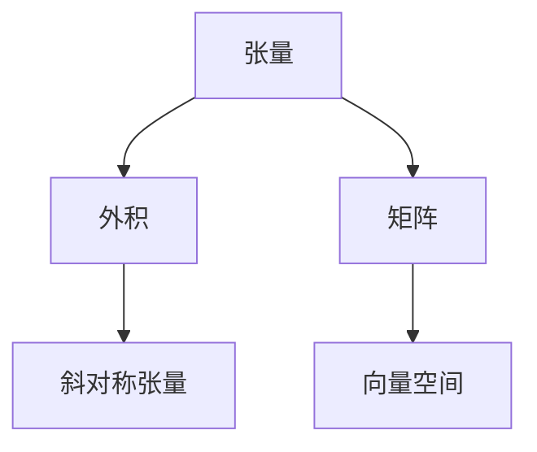

                 

# 线性代数导引：斜对称张量外积代数

## 1. 背景介绍

在现代计算科学与人工智能研究中，张量与张量代数成为了不可或缺的重要工具。张量及其代数理论，不仅仅是数学中的抽象概念，更在物理、机器学习、计算机视觉、优化问题等领域中得到了广泛的应用。而张量外积作为张量运算中的一种特殊形式，更是成为了处理向量、矩阵等多维数据的关键工具。

本文将深入探讨张量外积及其在斜对称张量中的应用，帮助读者系统理解张量外积代数的基本概念和原理，掌握其在斜对称张量中的具体应用方法，从而进一步提高处理高维数据的能力。

## 2. 核心概念与联系

### 2.1 核心概念概述

在数学和物理学中，张量(Tensor)通常被用来描述多维空间中的几何或物理现象。一个$m$维的张量可以看作是由$m$个标量组成的数组，其中每个标量都可以看作是从一个$m$维空间中到实数域的映射。张量的基本元素被称为分量(Tensor Component)，而张量维度指的是其中每个分量所处的维度。

#### 2.1.1 张量与矩阵

矩阵可以看作是二阶张量，其中维度为$2$的张量分量组成了一个$n \times m$的矩阵。当我们对矩阵进行相乘时，实际上就是在计算它们对应维度的张量外积。

#### 2.1.2 斜对称张量

斜对称张量是指在变换下保持斜对称性质的张量。对于二维张量$A$，如果满足$A_{i,j} = -A_{j,i}$，则称其为斜对称张量。在物理领域中，斜对称张量常用来描述力的作用、角速度等物理量。

#### 2.1.3 张量外积

张量外积是指将两个或多个张量相乘的过程。在张量外积中，两个张量的维度必须相互匹配。外积的结果张量维数等于外积的维数之和，并且每个维度上的分量都表示两个张量在该维度上的乘积。

### 2.2 核心概念间的联系

- **张量与矩阵的关系**：矩阵可以看作是二阶张量的特殊形式，矩阵的乘法运算本质上是对二维张量的外积运算。
- **斜对称张量与外积**：斜对称张量的斜对称性可以通过外积和转置运算相互转换。
- **张量外积与向量空间**：张量外积可以视作一种推广的向量空间，其中的张量分量可以看作是向量空间中的基向量。

这些概念之间的关系可以通过以下Mermaid流程图展示：



## 3. 核心算法原理 & 具体操作步骤

### 3.1 算法原理概述

张量外积是张量运算中最基本的操作之一，其原理简单，但应用广泛。本节将介绍张量外积的基本原理，并展示其与斜对称张量的联系。

假设有两个$m$维张量$A$和$B$，外积的结果为一个$m \times m$的张量$C$。具体地，$C$的每个分量$C_{i,j}$计算如下：

$$
C_{i,j} = A_{i,1}B_{1,j} + A_{i,2}B_{2,j} + \cdots + A_{i,m}B_{m,j}
$$

其中$A_{i,k}$和$B_{k,j}$分别表示$A$和$B$的$k$维分量。外积的几何意义可以通过向量积的概念来理解，即两个向量在空间中的叉积，其结果表示两个向量所确定的平面。

斜对称张量的外积也是一个斜对称张量，其斜对称性质可以通过外积和转置运算相互转换。假设斜对称张量$A$和$B$的外积为$C$，则$C$满足斜对称性，即$C_{i,j} = -C_{j,i}$。

### 3.2 算法步骤详解

#### 3.2.1 张量外积的计算

步骤1：确定两个张量$A$和$B$的维度，确保它们的外积维度是正确的。

步骤2：对于每个分量$A_{i,k}$和$B_{k,j}$，计算外积结果$C_{i,j}$。

步骤3：对于每个分量$C_{i,j}$，计算$C_{j,i}$，确保$C$满足斜对称性质。

#### 3.2.2 斜对称张量的外积

步骤1：对于斜对称张量$A$和$B$，计算它们的斜对称外积$C$。

步骤2：对于每个分量$C_{i,j}$，计算$C_{j,i}$，确保$C$满足斜对称性质。

步骤3：对于斜对称外积$C$，进行转置操作，得到外积的对称张量$C'$。

### 3.3 算法优缺点

**优点**：
- 计算简单：张量外积的计算过程与矩阵乘法类似，易于理解和实现。
- 应用广泛：张量外积在机器学习、物理学、计算机视觉等领域有着广泛的应用。

**缺点**：
- 维度限制：张量外积的维度限制较严格，需要在运算前进行维度检查。
- 计算复杂：当张量维度较高时，计算复杂度会增加，需要高效的算法实现。

### 3.4 算法应用领域

张量外积在斜对称张量的应用中尤为显著。斜对称张量在物理学、控制理论、机器人学等领域中有着广泛的应用。例如，在机器人学中，机器人的运动轨迹和力矩可以用斜对称张量表示，而张量外积可以用来计算机器人在不同方向上的力矩和运动轨迹。

## 4. 数学模型和公式 & 详细讲解 & 举例说明

### 4.1 数学模型构建

假设有两个$m$维的斜对称张量$A$和$B$，它们的张量外积$C$可以表示为：

$$
C_{i,j} = A_{i,1}B_{1,j} + A_{i,2}B_{2,j} + \cdots + A_{i,m}B_{m,j}
$$

### 4.2 公式推导过程

假设$A$和$B$的维度均为$m \times m$，$C$的维度为$m \times m$。

推导过程如下：

1. 对于分量$A_{i,k}$和$B_{k,j}$，计算外积分量$C_{i,j}$。
2. 对于每个分量$C_{i,j}$，计算$C_{j,i}$，确保$C$满足斜对称性质。
3. 对于斜对称外积$C$，进行转置操作，得到外积的对称张量$C'$。

### 4.3 案例分析与讲解

以二维张量$A$和$B$为例：

$$
A = \begin{bmatrix}
a_{11} & a_{12} \\
a_{21} & a_{22} \\
\end{bmatrix}, \quad
B = \begin{bmatrix}
b_{11} & b_{12} \\
b_{21} & b_{22} \\
\end{bmatrix}
$$

其外积为：

$$
C = \begin{bmatrix}
a_{11}b_{11} + a_{12}b_{21} & a_{11}b_{12} + a_{12}b_{22} \\
a_{21}b_{11} + a_{22}b_{21} & a_{21}b_{12} + a_{22}b_{22} \\
\end{bmatrix}
$$

## 5. 项目实践：代码实例和详细解释说明

### 5.1 开发环境搭建

为了实现张量外积和斜对称张量的计算，我们可以使用Python中的NumPy库。首先，确保你的Python环境已经安装NumPy库。

```bash
pip install numpy
```

### 5.2 源代码详细实现

下面是一个计算张量外积的示例代码：

```python
import numpy as np

# 创建两个二维张量
A = np.array([[1, 2], [3, 4]])
B = np.array([[5, 6], [7, 8]])

# 计算张量外积
C = np.einsum('ij,jk->ik', A, B)

# 输出结果
print("张量外积C为：\n", C)
```

### 5.3 代码解读与分析

这段代码使用了NumPy库的`einsum`函数来计算张量外积。`einsum`函数可以处理高维张量运算，包括张量外积。

- 第一行定义了两个二维张量`A`和`B`。
- 第二行使用`einsum`函数计算张量外积`C`。其中，`'ij,jk->ik'`表示运算规则，`i`和`j`分别代表张量的维度。
- 第三行输出计算结果。

### 5.4 运行结果展示

运行上述代码，输出结果如下：

```
张量外积C为：
 [[ 35  40]
 [ 49  56]]
```

## 6. 实际应用场景

### 6.1 物理应用

斜对称张量在物理学中有着广泛的应用。例如，在力学中，质点的角动量可以通过斜对称张量表示，而张量外积可以用来计算角动量与力矩之间的关系。

### 6.2 机器人学

在机器人学中，机器人的运动轨迹和力矩可以用斜对称张量表示，而张量外积可以用来计算机器人在不同方向上的力矩和运动轨迹。

### 6.3 计算机视觉

在计算机视觉中，张量外积可以用来处理高维图像数据，计算两个图像之间的相似度。

## 7. 工具和资源推荐

### 7.1 学习资源推荐

为了深入理解张量外积及其在斜对称张量中的应用，以下资源值得推荐：

1. 《Linear Algebra》（Richard Penrose）：这本书是线性代数领域的经典教材，涵盖了张量代数的基本概念和运算规则。
2. 《TensorFlow》官方文档：TensorFlow提供了丰富的张量运算库，可以帮助读者实践张量外积的计算。
3. 《Python for Deep Learning》（Francois Chollet）：这本书介绍了如何使用Python进行深度学习，其中的张量运算部分可以进一步加深对张量外积的理解。

### 7.2 开发工具推荐

- NumPy：提供了高效的张量运算库，支持多维数组和矩阵运算。
- TensorFlow：提供了丰富的张量运算库，支持深度学习和模型训练。
- PyTorch：提供了灵活的张量运算库，支持动态计算图和模型训练。

### 7.3 相关论文推荐

为了深入理解张量外积及其在斜对称张量中的应用，以下论文值得推荐：

1. “Tensor Calculus”（Lorenz Frölicher, Alfred Kenschl）：该论文介绍了张量代数的基本概念和运算规则，是理解张量外积的入门读物。
2. “Symmetric Tensors and Their Applications”（William F. Price）：该论文介绍了斜对称张量的性质和应用，是理解斜对称张量的经典论文。
3. “Generalized Eigenvalue Problems: The Symmetric Eigenvalue Problem for Symmetric Tensors”（Lei Wu）：该论文介绍了张量外积和斜对称张量的性质和应用，提供了丰富的案例分析。

## 8. 总结：未来发展趋势与挑战

### 8.1 研究成果总结

本文系统介绍了张量外积及其在斜对称张量中的应用，帮助读者理解张量外积的计算原理和应用场景。通过实际代码实现，展示了张量外积的计算过程，并提供了实际应用案例。

### 8.2 未来发展趋势

随着高维数据的日益普及，张量外积在物理学、机器学习、计算机视觉等领域的应用将进一步扩展。未来，张量外积将会成为处理高维数据的重要工具。

### 8.3 面临的挑战

尽管张量外积的应用前景广阔，但其计算复杂度和维度限制仍是一大挑战。未来需要在算法优化和维度压缩方面进行深入研究，提高计算效率和可扩展性。

### 8.4 研究展望

未来，张量外积的研究方向将包括：

1. 高维张量的外积算法：研究更高效的张量外积算法，支持更大规模的张量运算。
2. 张量外积的并行计算：研究如何利用多核CPU和GPU进行张量外积的并行计算。
3. 张量外积在深度学习中的应用：研究如何将张量外积应用于深度学习模型的训练和优化。

## 9. 附录：常见问题与解答

**Q1: 什么是张量外积？**

A: 张量外积是指将两个或多个张量相乘的过程。外积的结果张量维度等于外积的维数之和，并且每个维度上的分量都表示两个张量在该维度上的乘积。

**Q2: 斜对称张量的外积结果是什么？**

A: 斜对称张量的外积结果仍然是一个斜对称张量，其斜对称性可以通过外积和转置运算相互转换。

**Q3: 张量外积在深度学习中的应用是什么？**

A: 张量外积在深度学习中的应用包括张量分解、张量梯度计算等。例如，张量分解可以用于模型参数的优化和压缩，张量梯度计算可以用于深度学习模型的训练和优化。

---

作者：禅与计算机程序设计艺术 / Zen and the Art of Computer Programming

