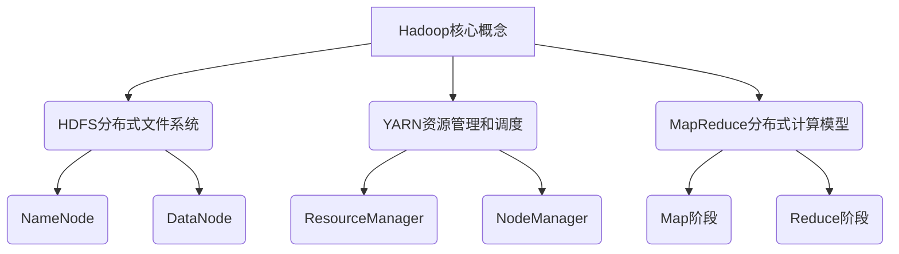

# Hadoop原理与代码实例讲解

## 1. 背景介绍

### 1.1 问题的由来

在大数据时代,传统的数据处理系统已经无法满足日益增长的数据量和计算需求。随着互联网、物联网、社交媒体等领域的快速发展,海量的结构化和非结构化数据不断涌现,对存储和计算能力提出了更高的要求。传统的集中式系统在处理大规模数据时,存在诸多bottleneck,如单点故障、扩展性差、计算能力有限等问题。

为了解决这些挑战,Google于2004年提出了GFS(Google File System)和MapReduce分布式计算模型,为大数据处理奠定了基础。Apache Hadoop正是在Google的这些理念和思想的基础上发展而来的开源分布式系统,旨在可靠、高效地处理大规模数据。

### 1.2 研究现状

Apache Hadoop作为开源的大数据处理平台,已经被广泛应用于各个领域,如网络日志分析、基因组学研究、金融风险分析等。目前,Hadoop生态圈已经发展成为一个庞大的体系,包括HDFS、YARN、MapReduce、Hive、HBase、Spark等多个子项目,能够满足不同场景下的大数据需求。

然而,Hadoop也面临着一些挑战,如学习曲线陡峭、性能优化困难、安全性和隐私保护等问题。因此,持续优化和改进Hadoop,以提高其易用性、性能和安全性,是当前研究的重点方向之一。

### 1.3 研究意义

深入理解Hadoop的原理和实现细节,对于高效利用这一大数据处理平台至关重要。本文将从底层原理到实际应用,全面讲解Hadoop的核心概念、算法、数学模型、代码实现和实践案例,旨在帮助读者掌握Hadoop的本质,提高大数据处理能力。

### 1.4 本文结构

本文共分为9个部分:

1. 背景介绍
2. 核心概念与联系
3. 核心算法原理与具体操作步骤
4. 数学模型和公式详细讲解与举例说明
5. 项目实践:代码实例和详细解释说明
6. 实际应用场景
7. 工具和资源推荐
8. 总结:未来发展趋势与挑战
9. 附录:常见问题与解答

## 2. 核心概念与联系



Hadoop的核心概念主要包括以下几个方面:

1. **HDFS**(Hadoop Distributed File System)是Hadoop的分布式文件系统,用于存储大规模数据。它由NameNode(名称节点)和多个DataNode(数据节点)组成,提供高容错性和高吞吐量的数据访问。

2. **YARN**(Yet Another Resource Negotiator)是Hadoop的资源管理和调度系统,负责集群资源的分配和作业调度。它由ResourceManager(资源管理器)、ApplicationMaster和NodeManager(节点管理器)等组件构成。

3. **MapReduce**是Hadoop的分布式计算模型,用于并行处理大规模数据集。它将计算过程分为两个阶段:Map阶段和Reduce阶段,通过键值对的方式进行数据转换和汇总。

这三个核心概念紧密相连,共同构建了Hadoop的分布式存储和计算架构。HDFS为MapReduce作业提供数据存储和访问,而YARN则负责为MapReduce作业分配和管理计算资源。

## 3. 核心算法原理与具体操作步骤

### 3.1 算法原理概述

MapReduce算法的核心思想是将大规模数据集拆分为独立的子问题,并行处理这些子问题,最后将结果合并得到最终解。它包括以下两个主要阶段:

1. **Map阶段**: 输入数据被拆分为多个数据块,每个数据块由一个Map任务处理。Map任务将输入的键值对转换为一系列中间键值对,并将这些中间结果写入本地磁盘。

2. **Reduce阶段**: Reduce任务从Map任务生成的中间结果中获取数据,对具有相同键的值进行合并和处理,最终生成最终输出结果。

### 3.2 算法步骤详解

1. **输入拆分(Input Split)**: 输入数据集被拆分为多个数据块(通常为64MB或128MB),每个数据块由一个Map任务处理。

2. **Map阶段**:
   - **记录读取(Record Reader)**: 从输入数据块中读取记录,将其转换为键值对。
   - **Map函数(Mapper)**: 对每个键值对执行用户定义的Map函数,生成中间键值对。
   - **分区(Partitioner)**: 根据分区函数对中间键值对进行分区,确定它们应该发送到哪个Reduce任务。
   - **排序和组合(Combiner)**: 可选地对每个分区内的中间键值对进行局部合并,减少传输量。

3. **Shuffle阶段**:
   - **HTTP获取(HTTP Fetch)**: Reduce任务通过HTTP请求从Map任务所在节点获取相应分区的数据。
   - **合并(Merge)**: 对从多个Map任务获取的相同分区数据进行合并和排序。

4. **Reduce阶段**:
   - **Reduce函数(Reducer)**: 对每个键及其关联的值集进行用户定义的Reduce函数处理,生成最终输出结果。
   - **输出写入(Output Writer)**: 将Reduce函数的输出结果写入HDFS或其他输出目标。

### 3.3 算法优缺点

**优点**:

- **高度并行**: MapReduce可以在大量计算节点上并行执行,从而提高处理效率。
- **容错性强**: 任务失败时可以自动重新执行,确保作业完成。
- **可扩展性好**: 通过添加更多节点,可以线性扩展计算能力。

**缺点**:

- **延迟高**: MapReduce作业需要多个阶段,存在较高的延迟。
- **不适合迭代计算**: 每次迭代都需要从HDFS读写数据,效率低下。
- **编程模型限制**: MapReduce编程模型相对低级,难以表达复杂的数据处理逻辑。

### 3.4 算法应用领域

MapReduce算法广泛应用于以下领域:

- **网络日志分析**: 分析网站访问日志,提取有价值的信息。
- **大数据分析**: 处理来自社交媒体、物联网等领域的海量数据。
- **机器学习**: 并行处理大规模训练数据,构建机器学习模型。
- **生物信息学**: 处理基因组序列数据,进行基因组分析。
- **文本处理**: 对大量文本数据进行索引、统计和挖掘。

## 4. 数学模型和公式详细讲解与举例说明

### 4.1 数学模型构建

在MapReduce中,我们可以将计算过程建模为一个数据转换函数 $F$,它将输入数据集 $D$ 转换为输出结果 $R$:

$$R = F(D)$$

其中,函数 $F$ 可以分解为两个子函数 $Map$ 和 $Reduce$:

$$F(D) = Reduce(Map(D))$$

$Map$ 函数将输入数据集 $D$ 转换为一系列中间键值对:

$$Map(D) = \{(k_1, v_1), (k_2, v_2), \ldots, (k_n, v_n)\}$$

$Reduce$ 函数对具有相同键的值进行合并和处理,生成最终输出结果:

$$Reduce(Map(D)) = \{(k_1, f(v_1, v_2, \ldots)), (k_2, f(v_3, v_4, \ldots)), \ldots\}$$

其中,函数 $f$ 是用户定义的Reduce函数,用于合并和处理相同键对应的值集合。

### 4.2 公式推导过程

在MapReduce中,我们可以将输入数据集 $D$ 看作是一个键值对集合:

$$D = \{(k_1, v_1), (k_2, v_2), \ldots, (k_m, v_m)\}$$

$Map$ 函数将每个键值对 $(k_i, v_i)$ 转换为一个中间键值对列表:

$$Map(k_i, v_i) = \{(k_{i1}, v_{i1}), (k_{i2}, v_{i2}), \ldots, (k_{ij}, v_{ij})\}$$

所有中间键值对的集合就是 $Map(D)$:

$$Map(D) = \bigcup_{i=1}^m Map(k_i, v_i)$$

$Reduce$ 函数对具有相同键的值进行合并和处理。对于每个不同的键 $k$,我们可以将其对应的值集合表示为:

$$Values(k) = \{v | (k, v) \in Map(D)\}$$

然后,对于每个键 $k$,我们应用 $Reduce$ 函数:

$$Reduce(k, Values(k)) = (k, f(Values(k)))$$

最终的输出结果 $R$ 就是所有 $Reduce$ 函数的输出的集合:

$$R = \bigcup_k Reduce(k, Values(k))$$

### 4.3 案例分析与讲解

假设我们有一个文本文件,包含了一些单词及其出现次数,格式如下:

```
apple 5
banana 3
apple 7
orange 2
banana 4
```

我们希望统计每个单词的总出现次数。这个问题可以用MapReduce来解决。

**Map阶段**:

$Map$ 函数将每一行输入转换为一个键值对,其中键是单词,值是出现次数:

```python
def map(key, value):
    word, count = value.split()
    yield word, int(count)
```

输出的中间键值对为:

```
(apple, 5)
(banana, 3)
(apple, 7)
(orange, 2)
(banana, 4)
```

**Reduce阶段**:

$Reduce$ 函数将具有相同键(单词)的值(出现次数)相加:

```python
def reduce(key, values):
    total = sum(values)
    yield key, total
```

对于键 `apple`,其值集合为 `{5, 7}`,$Reduce$ 函数的输出为 `(apple, 12)`。
对于键 `banana`,其值集合为 `{3, 4}`,$Reduce$ 函数的输出为 `(banana, 7)`。
对于键 `orange`,其值集合为 `{2}`,$Reduce$ 函数的输出为 `(orange, 2)`。

最终的输出结果为:

```
(apple, 12)
(banana, 7)
(orange, 2)
```

通过这个案例,我们可以看到MapReduce如何将复杂的计算任务分解为简单的Map和Reduce函数,并行处理大规模数据集。

### 4.4 常见问题解答

**Q: MapReduce是否适合所有类型的计算任务?**

A: 不是的。MapReduce更适合于一次性的批处理计算任务,对于需要多次迭代或者实时计算的任务,它可能效率较低。此外,MapReduce也不太适合处理需要随机访问数据的任务。

**Q: 如何确定Map任务和Reduce任务的数量?**

A: Map任务的数量通常取决于输入数据的大小和拆分方式。Reduce任务的数量可以根据集群资源和期望的并行度进行配置,通常设置为比集群节点数量略少的值。过多的Reduce任务会导致频繁的数据shuffle,而过少的Reduce任务则可能无法充分利用集群资源。

**Q: 如何优化MapReduce作业的性能?**

A: 优化MapReduce作业性能的一些技巧包括:合理设置输入拆分大小、使用压缩减少I/O开销、避免不必要的数据shuffle、充分利用Combiner进行局部合并、调整Map和Reduce任务数量等。此外,还可以通过优化HDFS和YARN的配置参数来提升整体性能。

## 5. 项目实践:代码实例和详细解释说明

### 5.1 开发环境搭建

要开发和运行Hadoop MapReduce程序,我们需要准备以下环境:

1. **Hadoop集群**: 可以在本地使用Pseudo-Distributed模式搭建单节点集群,也可以在云平台上创建多节点集群。

2. **Java开发环境**: Hadoop是用Java编写的,因此需要安装JDK并配置好环