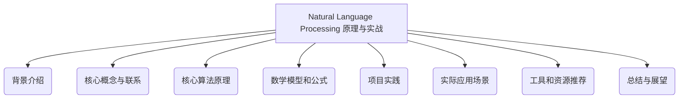
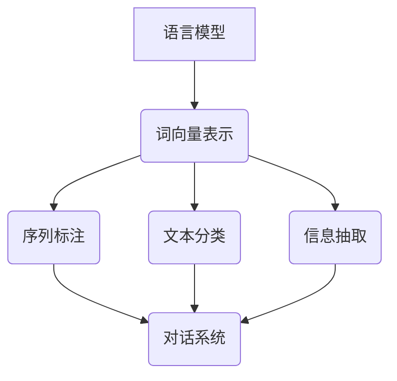

以下是根据您的要求撰写的技术博客文章正文内容：

# Natural Language Processing (NLP) 原理与代码实战案例讲解

## 1. 背景介绍

### 1.1 问题的由来

在当今信息时代,我们每天都会产生和接收大量的自然语言数据,例如网页、电子邮件、社交媒体帖子等。这些数据包含了宝贵的信息,但由于其非结构化和多样性的特点,很难直接被计算机理解和处理。因此,自然语言处理(Natural Language Processing, NLP)应运而生,旨在使计算机能够理解、操作和推理人类自然语言。

### 1.2 研究现状

自然语言处理是人工智能领域的一个重要分支,已经取得了长足的进步。传统的NLP方法主要基于规则和统计模型,但近年来,随着深度学习技术的兴起,NLP领域出现了一场范式革命。深度神经网络模型展现出了强大的语言理解和生成能力,推动了NLP技术的飞速发展。

### 1.3 研究意义

自然语言处理技术在多个领域都有广泛的应用,包括机器翻译、信息检索、问答系统、自动文摘、情感分析等。它能够帮助我们更好地理解和利用海量的自然语言数据,提高工作效率,优化决策过程。同时,NLP技术也是实现人机交互和智能助理的关键,对于推进人工智能的发展具有重要意义。

### 1.4 本文结构

本文将全面介绍自然语言处理的核心概念、算法原理、数学模型、代码实现和实际应用。我们将从基础知识出发,逐步深入探讨NLP的各个方面,并通过实战案例帮助读者掌握相关技术。文章结构如下:

## 2. 核心概念与联系

自然语言处理是一个复杂的系统工程,涉及多个层面的概念和技术。我们首先介绍NLP中的一些核心概念及其相互关系。

### 2.1 语言模型

语言模型是NLP的基础,旨在捕捉语言的统计规律。它通过计算一个语句或词序列的概率来评估其自然程度。语言模型广泛应用于机器翻译、语音识别、文本生成等任务中。常见的语言模型包括N-gram模型、神经网络语言模型等。

### 2.2 词向量表示

将单词映射为数值向量是NLP的一个关键步骤,这种向量表示被称为词向量(Word Embedding)。词向量能够捕捉单词的语义和句法信息,使得单词之间的相似性可以用向量空间中的距离来度量。常见的词向量表示方法有Word2Vec、GloVe等。

### 2.3 序列标注

序列标注是指对一个序列中的每个元素(通常是单词或字符)进行标注或赋予标签。这在命名实体识别、词性标注、生物医学实体识别等任务中非常重要。常见的序列标注模型包括隐马尔可夫模型(HMM)、条件随机场(CRF)、循环神经网络(RNN)等。

### 2.4 文本分类

文本分类是指根据文本的内容,将其归类到预定义的类别中。这在情感分析、垃圾邮件过滤、新闻分类等任务中有广泛应用。常用的文本分类模型有朴素贝叶斯、支持向量机(SVM)、深度神经网络等。

### 2.5 信息抽取

信息抽取旨在从非结构化文本中提取出结构化的信息,如实体、事件、关系等。这对于知识图谱构建、问答系统等应用至关重要。常见的信息抽取模型包括基于规则的系统、监督学习模型(如CRF)和无监督模型。

### 2.6 对话系统

对话系统是一种能够与人类进行自然语言交互的智能系统。它需要集成多种NLP技术,如语音识别、语义理解、对话管理、自然语言生成等。对话系统在智能助理、客户服务等领域有着广阔的应用前景。

### 2.7 概念关系总结

以上这些概念相互关联,共同构建了自然语言处理的理论和技术体系。下图展示了它们之间的关系:

## 3. 核心算法原理与具体操作步骤

### 3.1 算法原理概述

自然语言处理中有许多核心算法,它们来自不同的理论基础,适用于不同的任务。我们将介绍几种最常用和最具代表性的算法原理。

#### 3.1.1 N-gram语言模型

N-gram语言模型是基于马尔可夫假设的概率统计模型。它通过计算一个词序列的联合概率分布来评估该序列的自然程度。具体来说,一个长度为m的序列的概率可以用链式法则表示为:

$$P(w_1, w_2, \cdots, w_m) = \prod_{i=1}^m P(w_i|w_1, \cdots, w_{i-1})$$

由于计算完整历史的条件概率是不可行的,N-gram模型引入了马尔可夫假设,即一个词的概率只与前面的N-1个词相关。这样,上式可以简化为:

$$P(w_1, w_2, \cdots, w_m) \approx \prod_{i=1}^m P(w_i|w_{i-N+1}, \cdots, w_{i-1})$$

N-gram模型通过统计大量语料中的N-gram计数来估计条件概率。尽管简单,但它在机器翻译、语音识别等任务中表现出色。

#### 3.1.2 Word2Vec

Word2Vec是一种高效的词向量表示学习算法,由Google于2013年提出。它包含两个主要模型:连续词袋模型(CBOW)和Skip-gram模型。

CBOW模型的目标是根据上下文词预测目标词,而Skip-gram则是根据目标词预测上下文词。两个模型都使用神经网络进行训练,通过最大化目标函数来获得词向量表示。

以Skip-gram为例,给定一个词 $w_t$ 和它的上下文窗口 $C=\{w_{t-c}, \cdots, w_{t-1}, w_{t+1}, \cdots, w_{t+c}\}$,我们希望最大化:

$$\frac{1}{|C|} \sum_{w_c \in C} \log P(w_c|w_t)$$

其中 $P(w_c|w_t)$ 是 softmax 函数:

$$P(w_c|w_t) = \frac{\exp(v_{w_c}^{\top}v_{w_t})}{\sum_{w=1}^{V}\exp(v_w^{\top}v_{w_t})}$$

这里 $v_w$ 和 $v_{w_t}$ 分别是词 $w$ 和 $w_t$ 的向量表示。通过梯度下降优化该目标函数,可以得到词向量。

Word2Vec能够高效地学习词的语义和句法信息,是NLP中一种广泛使用的词向量表示方法。

#### 3.1.3 注意力机制

注意力机制最初被提出用于神经机器翻译任务。它允许模型在生成一个词时,关注输入序列中的不同部分,从而捕捉长距离依赖关系。

具体来说,假设我们有一个编码器输出的序列 $\boldsymbol{H} = [\boldsymbol{h}_1, \boldsymbol{h}_2, \cdots, \boldsymbol{h}_n]$,以及当前的解码器隐状态 $\boldsymbol{s}_t$。我们计算注意力权重向量 $\boldsymbol{\alpha}_t$ 如下:

$$\boldsymbol{\alpha}_t = \text{softmax}(\boldsymbol{v}_a^\top \tanh(\boldsymbol{W}_a\boldsymbol{s}_t + \boldsymbol{U}_a\boldsymbol{H}))$$

其中 $\boldsymbol{v}_a$、$\boldsymbol{W}_a$ 和 $\boldsymbol{U}_a$ 是可学习的参数。

然后,我们可以使用注意力权重向量 $\boldsymbol{\alpha}_t$ 对编码器输出进行加权求和,得到注意力向量 $\boldsymbol{c}_t$:

$$\boldsymbol{c}_t = \sum_{i=1}^n \alpha_{t,i}\boldsymbol{h}_i$$

最后,注意力向量 $\boldsymbol{c}_t$ 将被送入解码器,用于生成下一个输出词。

注意力机制赋予了模型动态关注输入的不同部分的能力,极大地提高了序列到序列模型的性能,在机器翻译、文本摘要等任务中表现出色。

#### 3.1.4 序列到序列模型

序列到序列(Seq2Seq)模型是一种通用的编码器-解码器框架,可以应用于机器翻译、文本摘要等需要将一个序列映射到另一个序列的任务。

该模型包含两个主要组件:编码器(Encoder)和解码器(Decoder)。编码器读取输入序列,并将其编码为一个向量表示;解码器则根据这个向量表示生成输出序列。

常见的编码器有循环神经网络(RNN)、长短期记忆网络(LSTM)、门控循环单元(GRU)等。解码器也通常采用RNN或其变体结构。此外,注意力机制通常也被整合到Seq2Seq模型中,以捕捉长距离依赖。

Seq2Seq模型的训练目标是最大化输出序列的条件概率:

$$\log P(Y|X) = \sum_{t=1}^{T_y} \log P(y_t|y_{<t}, X)$$

其中 $X$ 和 $Y$ 分别是输入和输出序列, $y_{<t}$ 表示输出序列的前 $t-1$ 个词。

通过端到端的训练,Seq2Seq模型能够直接从数据中学习序列到序列的映射,不需要人工设计复杂的特征工程。它在多个NLP任务中表现出色,是当前主流的模型框架之一。

### 3.2 算法步骤详解

接下来,我们将详细解释上述算法的具体实现步骤。

#### 3.2.1 N-gram语言模型

1. **语料预处理**:对训练语料进行分词、去除标点符号等预处理,将其转换为单词序列。
2. **构建词典**:统计语料中出现的所有词,构建词典,将每个词映射为一个整数索引。
3. **计算N-gram计数**:遍历语料,统计所有长度为N的词序列(N-gram)出现的次数。
4. **平滑处理**:由于数据的稀疏性,某些N-gram在训练集中可能从未出现,此时需要进行平滑处理,如加法平滑(Add-one smoothing)、Good-Turing平滑等。
5. **计算概率**:根据N-gram计数和平滑后的结果,利用上述公式计算每个N-gram序列的概率。
6. **解码**:对于一个给定的序列,计算并比较不同长度N的模型给出的概率,选择概率最大的那个作为最终结果。

N-gram语言模型实现起来相对简单,但由于马尔可夫假设的限制,它只能捕捉到有限的上下文信息,难以很好地解决长距离依赖问题。

#### 3.2.2 Word2Vec

1. **语料预处理**:与N-gram模型类似,需要对训练语料进行分词和预处理。
2. **构建词典**:统计语料中出现的所有词,构建词典,将每个词映射为一个整数索引。
3. **定义模型**:选择CBOW或Skip-gram模型,定义模型结构和参数。
4. **模型训练**:使用随机梯度下降或其他优化算法,最大化目标函数,学习词向量表示。可以采用负采样(Negative Sampling)或层序softmax等技巧来加速训练。
5. **