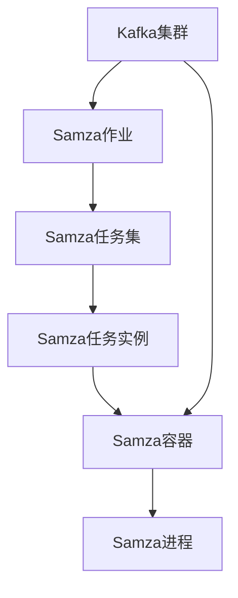

# Samza Task原理与代码实例讲解

## 1. 背景介绍

### 1.1 问题的由来

在现代大数据时代，实时数据处理已成为许多企业和组织的关键需求。传统的批处理系统无法满足对实时性和低延迟的要求。因此，流式处理应运而生,成为处理大规模实时数据流的有效方式。Apache Samza 作为一个分布式流处理系统,为解决这一挑战提供了强大的解决方案。

### 1.2 研究现状

Apache Samza 是一个由 Apache 软件基金会开源的分布式流处理系统,最初由 LinkedIn 公司开发。它建立在 Apache Kafka 之上,利用 Kafka 的日志和消息传递功能来实现容错、水平扩展和持久化等特性。Samza 支持使用各种编程语言(如 Java、Scala 和 Python)编写流处理应用程序,并提供了一种简单而强大的 API。

### 1.3 研究意义

理解 Samza 的核心概念和原理对于开发高性能、可扩展的流处理应用程序至关重要。本文将深入探讨 Samza Task 的工作原理,包括其设计理念、核心算法、数学模型以及实际代码实现。通过详细的分析和示例,读者可以更好地掌握 Samza 的内部工作机制,从而更有效地利用这一强大的流处理框架。

### 1.4 本文结构

本文将分为以下几个部分:

1. 背景介绍
2. Samza 核心概念与联系
3. Samza Task 核心算法原理与具体操作步骤
4. Samza Task 数学模型和公式详细讲解与举例说明
5. Samza Task 项目实践:代码实例和详细解释说明
6. Samza 实际应用场景
7. Samza 相关工具和资源推荐
8. 总结:Samza 未来发展趋势与挑战
9. 附录:常见问题与解答

## 2. 核心概念与联系

在深入探讨 Samza Task 之前,我们需要先了解 Samza 的一些核心概念及它们之间的关系。

- **Samza 作业 (Job)**: 一个 Samza 作业是一个独立的流处理应用程序,它由一个或多个任务组成。作业定义了输入和输出流,以及要执行的处理逻辑。

- **Samza 任务集 (TaskSet)**: 一个任务集是一组相关的任务,它们共享相同的代码和配置。任务集由作业定义,并在运行时由 Samza 框架实例化。

- **Samza 任务实例 (TaskInstance)**: 一个任务实例是任务集中的一个具体实例。每个任务实例都负责处理输入流的一部分数据。

- **Samza 容器 (Container)**: 一个容器是一个独立的进程,它承载并执行一组任务实例。容器负责管理任务实例的生命周期,并与 Kafka 集群进行交互以获取输入数据和发送输出数据。

- **Samza 进程 (Process)**: 一个进程是运行 Samza 容器的操作系统进程。每个 Samza 进程可以运行一个或多个容器。

- **Kafka 集群**: Kafka 集群是 Samza 的核心依赖,它提供了持久的输入和输出流。Samza 作业从 Kafka 主题读取数据,并将处理后的数据写回 Kafka 主题。

这些概念之间的关系是:一个 Samza 作业由一个或多个任务集组成,每个任务集包含多个任务实例。任务实例被分配到不同的 Samza 容器中执行,而容器则运行在 Samza 进程中。Samza 进程与 Kafka 集群交互,从 Kafka 主题读取输入数据,并将处理后的数据写回 Kafka 主题。

## 3. 核心算法原理 & 具体操作步骤

### 3.1 算法原理概述

Samza Task 的核心算法原理是基于流分区和键分区的思想。具体来说,Samza 将输入流分成多个分区,每个分区由一个任务实例处理。同时,Samza 还支持基于键的分区,即具有相同键的消息将被路由到同一个任务实例进行处理。这种设计确保了每个键的所有消息都由同一个任务实例处理,从而保证了处理的顺序性和一致性。

Samza Task 算法的主要步骤如下:

1. **分区分配**: Samza 根据输入流的分区数量和任务实例数量,将每个分区分配给一个任务实例。

2. **消息读取**: 每个任务实例从分配给它的输入流分区中读取消息。

3. **键分区**: 如果启用了基于键的分区,Samza 将根据消息的键将消息路由到相应的任务实例。

4. **消息处理**: 任务实例执行用户定义的处理逻辑,对消息进行转换或计算。

5. **状态管理**: 任务实例可以维护本地状态,用于存储中间计算结果或缓存数据。

6. **输出写入**: 处理后的消息被写入输出流,可能是 Kafka 主题或其他存储系统。

7. **容错和重新处理**: 如果任务实例失败,Samza 会自动重新启动该任务实例,并从上次提交的检查点继续处理。

### 3.2 算法步骤详解

1. **分区分配**

   Samza 将输入流的分区均匀分配给任务实例。每个任务实例负责处理一个或多个分区。分配策略可以是静态的(在作业启动时确定),也可以是动态的(在运行时根据负载情况进行重新分配)。

2. **消息读取**

   每个任务实例从分配给它的输入流分区中读取消息。Samza 使用 Kafka 的消费者 API 从 Kafka 主题读取消息。消息以批处理的方式读取,以提高效率。

3. **键分区**

   如果启用了基于键的分区,Samza 将根据消息的键将消息路由到相应的任务实例。这是通过对键应用哈希函数,然后根据哈希值将消息分配给特定的任务实例来实现的。这种设计确保了具有相同键的所有消息都由同一个任务实例处理,从而保证了处理的顺序性和一致性。

4. **消息处理**

   任务实例执行用户定义的处理逻辑,对消息进行转换或计算。处理逻辑可以是简单的过滤、映射或聚合操作,也可以是复杂的机器学习或数据挖掘算法。

5. **状态管理**

   任务实例可以维护本地状态,用于存储中间计算结果或缓存数据。Samza 提供了多种状态存储选项,如内存中的 RocksDB 或远程的 Kafka 流。状态由键值对组成,可以通过键进行访问和更新。

6. **输出写入**

   处理后的消息被写入输出流,通常是 Kafka 主题,但也可以是其他存储系统,如 HDFS 或数据库。Samza 使用 Kafka 的生产者 API 将消息写入 Kafka 主题。

7. **容错和重新处理**

   如果任务实例失败,Samza 会自动重新启动该任务实例,并从上次提交的检查点继续处理。检查点是任务实例的状态快照,它定期写入到持久存储(如 Kafka 主题)中。在重新启动时,任务实例从检查点中恢复状态,并重新处理自上次检查点以来的消息,从而确保了精确一次的处理语义。

### 3.3 算法优缺点

**优点**:

- **水平扩展**: 通过增加任务实例的数量,Samza 可以轻松地扩展处理能力,从而处理更大的数据量。

- **容错性**: 由于 Samza 基于 Kafka 的持久化日志,任务实例失败时可以从最后一个检查点重新启动,确保数据不会丢失。

- **有序处理**: 基于键的分区确保了具有相同键的所有消息都由同一个任务实例处理,从而保证了处理的顺序性和一致性。

- **状态管理**: Samza 提供了多种状态存储选项,允许任务实例维护本地状态,从而支持有状态的流处理。

**缺点**:

- **延迟**: 由于 Samza 依赖 Kafka 的日志,存在一定的延迟,无法实现真正的实时处理。

- **重新处理开销**: 当任务实例失败时,需要从上次检查点重新处理所有消息,这可能会带来一定的开销。

- **状态管理复杂性**: 维护和管理分布式状态可能会增加系统的复杂性,需要谨慎设计和实现。

### 3.4 算法应用领域

Samza Task 算法广泛应用于以下领域:

- **实时数据处理**: Samza 可以用于处理各种实时数据流,如日志数据、传感器数据、网络流量数据等。

- **事件驱动架构**: Samza 非常适合构建事件驱动的系统,例如实时推荐系统、实时风险检测系统等。

- **流式数据集成**: Samza 可以用于将来自不同源的数据流集成到一个统一的数据管道中。

- **物联网 (IoT)**: Samza 可以处理来自大量物联网设备的实时数据流,用于实时监控、预测维护等应用。

- **在线机器学习**: Samza 可以用于构建在线机器学习系统,实时训练和更新模型。

总的来说,Samza Task 算法适用于任何需要实时处理大规模数据流的场景,特别是那些需要保证处理顺序和一致性的应用程序。

## 4. 数学模型和公式 & 详细讲解 & 举例说明

在 Samza Task 的设计和实现中,涉及了一些数学模型和公式,用于优化性能和资源利用率。本节将详细介绍这些模型和公式,并通过具体示例进行说明。

### 4.1 数学模型构建

#### 4.1.1 分区分配模型

Samza 需要将输入流的分区均匀分配给任务实例,以实现负载均衡和高吞吐量。我们可以将这个问题建模为一个整数规划问题。

设:

- $n$ 为输入流的分区数量
- $m$ 为任务实例的数量
- $x_{ij}$ 是一个二元变量,表示第 $i$ 个分区是否分配给第 $j$ 个任务实例,如果分配则为 1,否则为 0

目标函数:

$$\min \sum_{j=1}^{m} \left(\sum_{i=1}^{n} x_{ij} - \frac{n}{m}\right)^2$$

约束条件:

$$\sum_{j=1}^{m} x_{ij} = 1, \quad \forall i \in \{1, 2, \ldots, n\}$$

$$x_{ij} \in \{0, 1\}, \quad \forall i \in \{1, 2, \ldots, n\}, \quad \forall j \in \{1, 2, \ldots, m\}$$

上述模型的目标是最小化每个任务实例分配的分区数与平均值之间的平方差之和,从而实现尽可能均匀的分区分配。约束条件确保每个分区只分配给一个任务实例。

#### 4.1.2 键分区模型

对于基于键的分区,Samza 需要将具有相同键的消息路由到同一个任务实例。我们可以将这个问题建模为一个哈希函数优化问题。

设:

- $K$ 为键的集合
- $m$ 为任务实例的数量
- $h: K \rightarrow \{1, 2, \ldots, m\}$ 是一个哈希函数,将键映射到任务实例编号

目标函数:

$$\min \sum_{k \in K} \left(\frac{1}{m} - \frac{|h^{-1}(h(k))|}{|K|}\right)^2$$

上述模型的目标是最小化每个任务实例处理的键的比例与理想值 $\frac{1}{m}$ 之间的平方差之和,从而实现尽可能均匀的键分布。

在实践中,Samza 使用了一种高