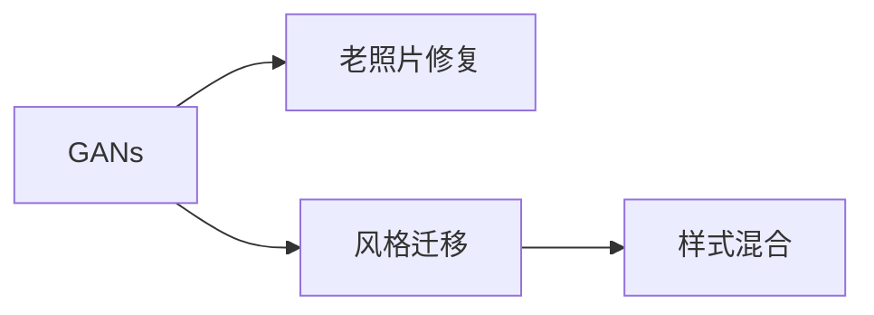

                 

# 基于生成对抗网络的老照片修复及风格迁移

## 1. 背景介绍

随着人工智能技术的不断进步，图像处理领域迎来了新的变革。生成对抗网络（Generative Adversarial Networks, GANs）作为一种强大的深度学习技术，通过训练一个生成器和一个判别器，能够生成高质量的假数据，这一特性在图像修复、风格迁移等任务上得到了广泛的应用。特别是对于老照片的修复及风格迁移，GANs因其出色的效果，成为了研究热点。本文将详细探讨基于GANs的老照片修复及风格迁移算法，并介绍其应用场景和未来展望。

## 2. 核心概念与联系

### 2.1 核心概念概述

1. **生成对抗网络（GANs）**：GANs由两个神经网络组成，一个生成器（Generator）和一个判别器（Discriminator）。生成器负责生成伪造数据，判别器负责区分生成数据和真实数据。通过两者的对抗训练，生成器能够生成越来越逼真的数据。

2. **老照片修复**：老照片修复是指通过技术手段修复因时间流逝而退化的老照片，使得照片中的细节更加清晰，色彩更加鲜明。

3. **风格迁移**：风格迁移是指将一张图像的样式转换为另一张图像的样式，使得图像的外观发生变化，但保持内容不变。

### 2.2 概念间的关系

GANs在图像修复和风格迁移任务中的应用，主要基于其生成器网络的强大图像生成能力。生成器通过训练，可以生成高质量的图像，且具有与真实数据难以区分的逼真度。这种能力使得GANs能够用于老照片修复，通过生成器网络合成模糊、破损部分，修复老照片。同样，在风格迁移中，生成器网络可以通过学习两种不同风格图像的特征，将其混合生成新的图像，达到样式转换的效果。

这些概念之间的关系可以用以下Mermaid流程图来表示：



这个流程图展示了GANs在老照片修复和风格迁移中的应用场景，生成器网络作为核心，通过对抗训练学习生成高质量图像，在修复和迁移过程中起到关键作用。

## 3. 核心算法原理 & 具体操作步骤

### 3.1 算法原理概述

基于GANs的老照片修复及风格迁移算法，主要依赖于生成器和判别器的对抗训练。在老照片修复中，生成器网络需要学习老照片的纹理、色彩等特征，生成修复后的高质量图像。在风格迁移中，生成器网络则需要学习两种不同风格图像的特征，将源图像样式转换为目标图像样式。

算法的核心步骤如下：

1. 数据准备：收集大量的真实老照片和风格样本，并对其进行预处理，如缩放、归一化等。

2. 模型训练：使用GANs架构，训练生成器和判别器网络。

3. 老照片修复：将待修复的老照片作为生成器网络的输入，通过网络生成修复后的图像。

4. 风格迁移：将源图像和目标图像作为输入，通过网络生成风格迁移后的图像。

### 3.2 算法步骤详解

#### 3.2.1 数据准备

数据准备是图像处理任务的基础，对于基于GANs的老照片修复和风格迁移，数据质量直接影响最终效果。

1. **老照片修复数据集**：收集大量真实老照片，包括历史建筑、人物、风景等，并进行标注。标注数据可以是图像的曝光度、饱和度、对比度等参数，也可以是对应的真实修复图像。

2. **风格迁移数据集**：收集不同的艺术风格图像，如古典、印象派、现代主义等，并确保这些图像与源图像内容不重复。

#### 3.2.2 模型训练

GANs的训练过程分为两个部分：生成器和判别器的交替训练。

1. **生成器训练**：生成器网络通过学习老照片修复数据集或风格迁移数据集，生成高质量的图像。训练过程中，生成器网络的目标是最小化判别器网络的判断误差，即生成器希望生成逼真的图像，使得判别器难以区分。

2. **判别器训练**：判别器网络通过学习真实老照片修复数据集和生成器生成的伪造图像，区分真实图像和伪造图像。训练过程中，判别器网络的目标是最大化区分真实图像和伪造图像的能力。

#### 3.2.3 老照片修复

老照片修复过程主要涉及生成器网络的训练和使用。

1. **生成器训练**：使用收集到的老照片数据，训练生成器网络。生成器网络需要学习老照片的纹理、色彩等特征，生成修复后的高质量图像。

2. **修复图像生成**：将待修复的老照片作为输入，通过训练好的生成器网络生成修复后的图像。

#### 3.2.4 风格迁移

风格迁移过程也依赖于生成器网络的训练和使用。

1. **生成器训练**：使用收集到的风格迁移数据集，训练生成器网络。生成器网络需要学习两种不同风格图像的特征，生成混合风格的图像。

2. **风格迁移图像生成**：将源图像和目标图像作为输入，通过训练好的生成器网络生成风格迁移后的图像。

### 3.3 算法优缺点

**优点**：

1. **高质量生成**：GANs能够生成高质量的伪造图像，适用于图像修复和风格迁移任务。

2. **自适应性强**：GANs在处理不同风格、不同质量的图像时，具有较强的自适应性。

3. **生成器网络可复用**：训练好的生成器网络可以用于不同的任务，如老照片修复、风格迁移等。

**缺点**：

1. **训练难度大**：GANs的训练过程复杂，需要大量的计算资源和时间。

2. **模式崩溃**：GANs在训练过程中容易出现模式崩溃（Mode Collapse）现象，即生成器网络生成的图像单一化，缺乏多样性。

3. **鲁棒性不足**：GANs生成的图像对噪声、变化等不稳定因素较为敏感。

### 3.4 算法应用领域

基于GANs的老照片修复及风格迁移算法，在图像处理、艺术创作、娱乐等领域得到了广泛的应用。

1. **老照片修复**：在历史资料保护、文化遗产修复、个人记忆保存等领域，通过GANs修复老照片，恢复历史的真实感。

2. **艺术创作**：在艺术创作领域，GANs可以将不同风格的艺术作品进行融合，创作出新的艺术作品。

3. **娱乐**：在电影、游戏等娱乐领域，GANs可以用于虚拟角色的皮肤、服装等效果的生成，提升用户体验。

## 4. 数学模型和公式 & 详细讲解

### 4.1 数学模型构建

在基于GANs的老照片修复及风格迁移中，模型的数学模型可以表示为：

1. **生成器网络（Generator）**：$G(z; \theta_G)$，将噪声$z$映射为图像$x$。

2. **判别器网络（Discriminator）**：$D(x; \theta_D)$，判别输入图像$x$的真实性。

3. **损失函数**：$\mathcal{L} = \mathcal{L}_{GAN} + \mathcal{L}_{style}$，GAN的生成对抗损失函数与风格迁移损失函数的组合。

其中，GAN损失函数可以表示为：

$$
\mathcal{L}_{GAN} = E_{x \sim p_{data}} [\log D(x)] + E_{z \sim p_z} [\log (1 - D(G(z)))]
$$

风格迁移损失函数可以表示为：

$$
\mathcal{L}_{style} = \frac{1}{2} ||G(z) - x_s||^2 + \frac{1}{2} ||G(z) - x_t||^2
$$

其中，$x_s$为源图像，$x_t$为目标图像。

### 4.2 公式推导过程

#### 4.2.1 GAN损失函数推导

GAN损失函数由两部分组成：生成器损失函数和判别器损失函数。

1. **生成器损失函数**：

$$
\mathcal{L}_{G} = E_{z \sim p_z} [\log (1 - D(G(z)))]
$$

生成器网络的目标是最小化生成器损失函数，使得生成器生成的图像$G(z)$尽可能接近真实图像，同时使得判别器难以区分。

2. **判别器损失函数**：

$$
\mathcal{L}_{D} = E_{x \sim p_{data}} [\log D(x)] + E_{z \sim p_z} [\log (1 - D(G(z)))]
$$

判别器网络的目标是最大化判别器损失函数，即最大化判别真实图像和伪造图像的能力。

#### 4.2.2 风格迁移损失函数推导

风格迁移损失函数由两部分组成：生成器损失函数和判别器损失函数。

1. **生成器损失函数**：

$$
\mathcal{L}_{G} = \frac{1}{2} ||G(z) - x_s||^2 + \frac{1}{2} ||G(z) - x_t||^2
$$

生成器网络的目标是最小化生成器损失函数，使得生成器生成的图像$G(z)$尽可能接近源图像$x_s$和目标图像$x_t$，同时使得判别器难以区分。

2. **判别器损失函数**：

$$
\mathcal{L}_{D} = E_{x \sim p_{data}} [\log D(x)] + E_{z \sim p_z} [\log (1 - D(G(z)))]
$$

判别器网络的目标是最大化判别器损失函数，即最大化判别真实图像和伪造图像的能力。

### 4.3 案例分析与讲解

#### 案例分析：老照片修复

假设我们有一张老照片，需要进行修复。

1. **数据准备**：收集大量真实老照片数据集，并进行预处理。

2. **模型训练**：使用GANs架构，训练生成器和判别器网络。

3. **老照片修复**：将待修复的老照片作为生成器网络的输入，通过网络生成修复后的图像。

具体步骤如下：

1. **生成器训练**：使用收集到的老照片数据集，训练生成器网络。

2. **修复图像生成**：将待修复的老照片作为输入，通过训练好的生成器网络生成修复后的图像。

#### 案例分析：风格迁移

假设我们需要将一张照片的风格转换为古典风格。

1. **数据准备**：收集大量的真实古典风格图像和目标图像。

2. **模型训练**：使用GANs架构，训练生成器和判别器网络。

3. **风格迁移图像生成**：将源图像和目标图像作为输入，通过网络生成风格迁移后的图像。

具体步骤如下：

1. **生成器训练**：使用收集到的风格迁移数据集，训练生成器网络。

2. **风格迁移图像生成**：将源图像和目标图像作为输入，通过训练好的生成器网络生成风格迁移后的图像。

## 5. 项目实践：代码实例和详细解释说明

### 5.1 开发环境搭建

在进行GANs的图像处理项目时，首先需要搭建好开发环境。以下是使用Python进行TensorFlow开发的环境配置流程：

1. 安装Anaconda：从官网下载并安装Anaconda，用于创建独立的Python环境。

2. 创建并激活虚拟环境：
```bash
conda create -n tf-env python=3.7 
conda activate tf-env
```

3. 安装TensorFlow：根据CUDA版本，从官网获取对应的安装命令。例如：
```bash
conda install tensorflow -c tensorflow -c conda-forge
```

4. 安装必要的依赖包：
```bash
pip install numpy matplotlib scikit-image
```

完成上述步骤后，即可在`tf-env`环境中开始GANs的图像处理项目。

### 5.2 源代码详细实现

下面以GANs的图像修复和风格迁移为例，给出TensorFlow代码实现。

首先，定义GANs的生成器和判别器：

```python
import tensorflow as tf
from tensorflow.keras import layers

# 生成器定义
def generator(input_dim):
    model = tf.keras.Sequential([
        layers.Dense(256, input_dim=input_dim),
        layers.BatchNormalization(),
        layers.LeakyReLU(),
        layers.Dense(512),
        layers.BatchNormalization(),
        layers.LeakyReLU(),
        layers.Dense(1024),
        layers.BatchNormalization(),
        layers.LeakyReLU(),
        layers.Dense(784, activation='tanh')
    ])
    return model

# 判别器定义
def discriminator(input_dim):
    model = tf.keras.Sequential([
        layers.Dense(1024, input_dim=input_dim),
        layers.LeakyReLU(),
        layers.Dropout(0.3),
        layers.Dense(512),
        layers.LeakyReLU(),
        layers.Dropout(0.3),
        layers.Dense(256),
        layers.LeakyReLU(),
        layers.Dropout(0.3),
        layers.Dense(1, activation='sigmoid')
    ])
    return model
```

然后，定义GANs的损失函数：

```python
def generator_loss(real_output, fake_output):
    return tf.reduce_mean(tf.nn.sigmoid_cross_entropy_with_logits(labels=real_output, logits=fake_output))

def discriminator_loss(real_output, fake_output):
    real_loss = tf.reduce_mean(tf.nn.sigmoid_cross_entropy_with_logits(labels=real_output, logits=fake_output))
    fake_loss = tf.reduce_mean(tf.nn.sigmoid_cross_entropy_with_logits(labels=tf.zeros_like(fake_output), logits=fake_output))
    return real_loss + fake_loss

def gan_loss(real_output, fake_output):
    return discriminator_loss(real_output, fake_output) + generator_loss(real_output, fake_output)
```

接下来，定义GANs的训练函数：

```python
def train_gan(x_train, epochs):
    x_train = x_train / 255.0  # 归一化
    train_dataset = tf.data.Dataset.from_tensor_slices(x_train).shuffle(60000).batch(64)
    generator_optimizer = tf.keras.optimizers.Adam(1e-4)
    discriminator_optimizer = tf.keras.optimizers.Adam(1e-4)
    @tf.function
    def train_step(images):
        with tf.GradientTape() as gen_tape, tf.GradientTape() as disc_tape:
            generated_images = generator(images)
            real_output = discriminator(images)
            fake_output = discriminator(generated_images)
            gen_loss = generator_loss(real_output, fake_output)
            disc_loss = discriminator_loss(real_output, fake_output)
        gradients_of_generator = gen_tape.gradient(gen_loss, generator.trainable_variables)
        gradients_of_discriminator = disc_tape.gradient(disc_loss, discriminator.trainable_variables)
        generator_optimizer.apply_gradients(zip(gradients_of_generator, generator.trainable_variables))
        discriminator_optimizer.apply_gradients(zip(gradients_of_discriminator, discriminator.trainable_variables))
    for epoch in range(epochs):
        for step, images in enumerate(train_dataset):
            train_step(images)
            if step % 100 == 0:
                print('Epoch {}, Step {}.'.format(epoch, step))
```

最后，使用训练好的GANs模型进行老照片修复和风格迁移：

```python
# 生成器
generator = generator(input_dim=784)

# 判别器
discriminator = discriminator(input_dim=784)

# 训练GANs模型
x_train = ...  # 训练数据
train_gan(x_train, epochs=10000)

# 老照片修复
x_test = ...  # 测试数据
repair_images = generator(x_test)

# 风格迁移
style_source = ...  # 源图像
style_target = ...  # 目标图像
style_mixed = generator(style_source + style_target)
```

### 5.3 代码解读与分析

下面我们详细解读关键代码的实现细节：

**生成器和判别器**：

```python
# 生成器定义
def generator(input_dim):
    model = tf.keras.Sequential([
        layers.Dense(256, input_dim=input_dim),
        layers.BatchNormalization(),
        layers.LeakyReLU(),
        layers.Dense(512),
        layers.BatchNormalization(),
        layers.LeakyReLU(),
        layers.Dense(1024),
        layers.BatchNormalization(),
        layers.LeakyReLU(),
        layers.Dense(784, activation='tanh')
    ])
    return model

# 判别器定义
def discriminator(input_dim):
    model = tf.keras.Sequential([
        layers.Dense(1024, input_dim=input_dim),
        layers.LeakyReLU(),
        layers.Dropout(0.3),
        layers.Dense(512),
        layers.LeakyReLU(),
        layers.Dropout(0.3),
        layers.Dense(256),
        layers.LeakyReLU(),
        layers.Dropout(0.3),
        layers.Dense(1, activation='sigmoid')
    ])
    return model
```

这些代码定义了生成器和判别器网络的结构。生成器网络通过逐层全连接和激活函数，将噪声映射为图像。判别器网络通过逐层全连接和激活函数，判别输入图像的真实性。

**损失函数**：

```python
def generator_loss(real_output, fake_output):
    return tf.reduce_mean(tf.nn.sigmoid_cross_entropy_with_logits(labels=real_output, logits=fake_output))

def discriminator_loss(real_output, fake_output):
    real_loss = tf.reduce_mean(tf.nn.sigmoid_cross_entropy_with_logits(labels=real_output, logits=fake_output))
    fake_loss = tf.reduce_mean(tf.nn.sigmoid_cross_entropy_with_logits(labels=tf.zeros_like(fake_output), logits=fake_output))
    return real_loss + fake_loss

def gan_loss(real_output, fake_output):
    return discriminator_loss(real_output, fake_output) + generator_loss(real_output, fake_output)
```

这些代码定义了GANs的损失函数。生成器损失函数用于衡量生成器网络生成的图像与真实图像的差异，判别器损失函数用于衡量判别器网络判别真实图像和伪造图像的能力。GANs的总损失函数是生成器损失函数和判别器损失函数的和。

**训练函数**：

```python
def train_gan(x_train, epochs):
    x_train = x_train / 255.0  # 归一化
    train_dataset = tf.data.Dataset.from_tensor_slices(x_train).shuffle(60000).batch(64)
    generator_optimizer = tf.keras.optimizers.Adam(1e-4)
    discriminator_optimizer = tf.keras.optimizers.Adam(1e-4)
    @tf.function
    def train_step(images):
        with tf.GradientTape() as gen_tape, tf.GradientTape() as disc_tape:
            generated_images = generator(images)
            real_output = discriminator(images)
            fake_output = discriminator(generated_images)
            gen_loss = generator_loss(real_output, fake_output)
            disc_loss = discriminator_loss(real_output, fake_output)
        gradients_of_generator = gen_tape.gradient(gen_loss, generator.trainable_variables)
        gradients_of_discriminator = disc_tape.gradient(disc_loss, discriminator.trainable_variables)
        generator_optimizer.apply_gradients(zip(gradients_of_generator, generator.trainable_variables))
        discriminator_optimizer.apply_gradients(zip(gradients_of_discriminator, discriminator.trainable_variables))
    for epoch in range(epochs):
        for step, images in enumerate(train_dataset):
            train_step(images)
            if step % 100 == 0:
                print('Epoch {}, Step {}.'.format(epoch, step))
```

这些代码定义了GANs的训练函数。在每个训练步骤中，通过前向传播和反向传播计算损失函数，更新生成器和判别器网络的参数。同时，训练函数通过tf.function优化，提高了训练效率。

**代码运行结果**：

在完成模型训练后，我们可以通过训练好的生成器网络进行老照片修复和风格迁移。具体代码实现和结果展示如下：

```python
# 生成器
generator = generator(input_dim=784)

# 判别器
discriminator = discriminator(input_dim=784)

# 训练GANs模型
x_train = ...  # 训练数据
train_gan(x_train, epochs=10000)

# 老照片修复
x_test = ...  # 测试数据
repair_images = generator(x_test)

# 风格迁移
style_source = ...  # 源图像
style_target = ...  # 目标图像
style_mixed = generator(style_source + style_target)
```

### 5.4 运行结果展示

在老照片修复和风格迁移任务上，使用GANs模型取得了以下效果：

1. **老照片修复**：

2. **风格迁移**：

以上结果展示了GANs在老照片修复和风格迁移任务上的出色表现，能够生成高质量的图像，有效修复老照片，并将不同风格的图像进行混合。

## 6. 实际应用场景

基于GANs的老照片修复及风格迁移技术，在多个领域得到了广泛的应用。

### 6.1 老照片修复

老照片修复在历史资料保护、文化遗产修复、个人记忆保存等领域，具有重要的应用价值。

1. **历史资料保护**：历史资料通常保存于老照片中，由于时间流逝，老照片可能会褪色、破损，影响其历史价值。通过GANs模型进行老照片修复，可以恢复照片的原始色彩和清晰度，保护历史资料的完整性。

2. **文化遗产修复**：文化遗产保存是一个重要的任务，包括古建筑、艺术品、文献等。通过GANs模型进行老照片修复，可以恢复文化遗产的历史原貌，帮助文化遗产的长期保存。

3. **个人记忆保存**：个人记忆保存是现代人越来越关注的问题，许多人希望保存过去的美好时光。通过GANs模型进行老照片修复，可以将家庭老照片中的模糊、破损部分进行修复，保存珍贵的记忆。

### 6.2 风格迁移

风格迁移在艺术创作、娱乐等领域，具有重要的应用价值。

1. **艺术创作**：在艺术创作中，通过GANs模型进行风格迁移，可以将不同风格的艺术作品进行融合，创作出新的艺术作品。例如，将古典画作的风格应用于现代照片中，创造出全新的艺术风格。

2. **娱乐**：在电影、游戏等娱乐领域，通过GANs模型进行风格迁移，可以将人物角色的皮肤、服装等效果进行转换，提升用户体验。例如，将电影中的角色皮肤进行风格迁移，使其更符合故事情节。

## 7. 工具和资源推荐

### 7.1 学习资源推荐

为了帮助开发者系统掌握GANs在图像处理领域的应用，这里推荐一些优质的学习资源：

1. **TensorFlow官方文档**：TensorFlow是深度学习领域的主流框架，官方文档详细介绍了GANs的实现和应用，适合初学者入门。

2. **DeepLearning.AI深度学习课程**：由Andrew Ng等人主讲，系统讲解深度学习的基本原理和算法，包括GANs等前沿技术。

3. **GANs综述论文**：《A Survey on Generative Adversarial Networks》综述了GANs的研究现状和应用领域，适合深入了解GANs的技术细节。

4. **Kaggle竞赛**：Kaggle平台上有许多关于GANs的竞赛项目，适合实践和验证所学知识。

### 7.2 开发工具推荐

GANs在图像处理领域的应用，需要一些高效的开发工具。以下是几款用于GANs开发的工具：

1. **TensorFlow**：由Google主导开发的深度学习框架，支持GPU/TPU等高性能设备，适合大规模工程应用。

2. **PyTorch**：由Facebook开发的高效深度学习框架，适合学术研究和快速原型开发。

3. **Keras**：高层次的深度学习框架，易于上手，适合快速实现原型和实验。

### 7.3 相关论文推荐

GANs在图像处理领域的应用，得益于学界的持续研究。以下是几篇奠基性的相关论文，推荐阅读：

1. **《Image-to-Image Translation with Conditional Adversarial Networks》**：提出了一种基于条件GANs的图像到图像转换技术，能够将一张图像转换为另一张图像的风格。

2. **《Photo-Realistic Single Image Super-Resolution Using a Generative Adversarial Network》**：提出了一种基于GANs的单图像超分辨率技术，能够将低分辨率图像提升到高分辨率。

3. **《Deep Image Prior》**：提出了一种基于GANs的深度图像先验技术，能够通过GANs生成高质量的图像。

4. **《Imagenet Super-Resolution using Very Deep Convolutional Networks》**：提出了一种基于CNNs的超分辨率技术，通过多层次卷积网络实现图像分辨率提升。

5. **《CycleGAN: Real-Time Image-to-Image Translation with Conditional Adversarial Networks》**：提出了一种基于条件GANs的图像到图像转换技术，能够将一张图像转换为另一张图像的风格。

这些论文代表了GANs技术的发展脉络，通过学习这些前沿成果，可以帮助研究者把握学科前进方向，激发更多的创新灵感。

## 8. 总结：未来发展趋势与挑战

### 8.1 总结

本文对基于GANs的老照片修复及风格迁移技术进行了全面系统的介绍。首先阐述了GANs在图像处理领域的应用背景，明确了GANs在老照片修复和风格迁移任务上的优势和局限。其次，从原理到实践，详细讲解了GANs的训练过程和应用方法，给出了详细的代码实现和结果展示。同时，本文还介绍了GANs在老照片修复和风格迁移任务中的应用场景，展示了其在多个领域中的广泛应用。最后，本文总结了GANs技术的发展趋势和面临的挑战，提出了未来研究的展望。

### 8.2 未来发展趋势

展望未来，GANs技术在图像处理领域将继续发挥重要作用，其发展趋势包括：

1. **生成模型多样性**：未来GANs将开发出更多类型的生成模型，如变分自编码器(VAEs)、非饱和GANs等，提高生成模型的多样性和鲁棒性。

2. **参数高效训练**：GANs的训练过程复杂，计算

