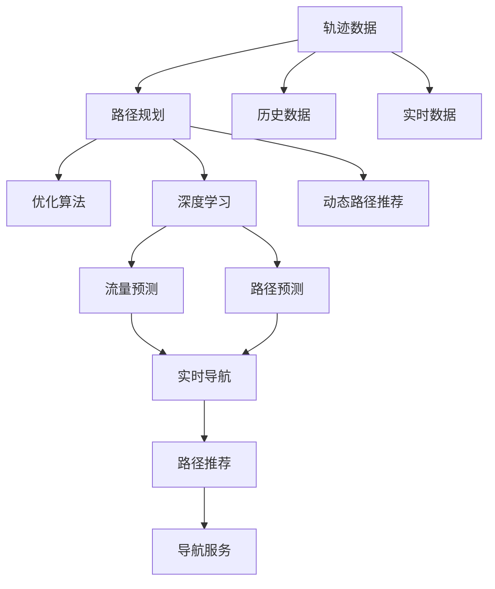
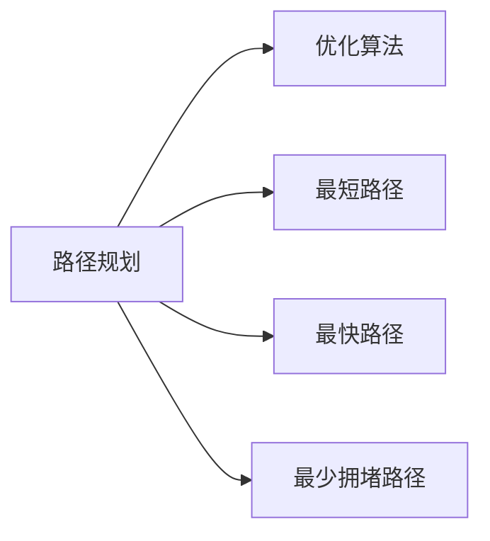
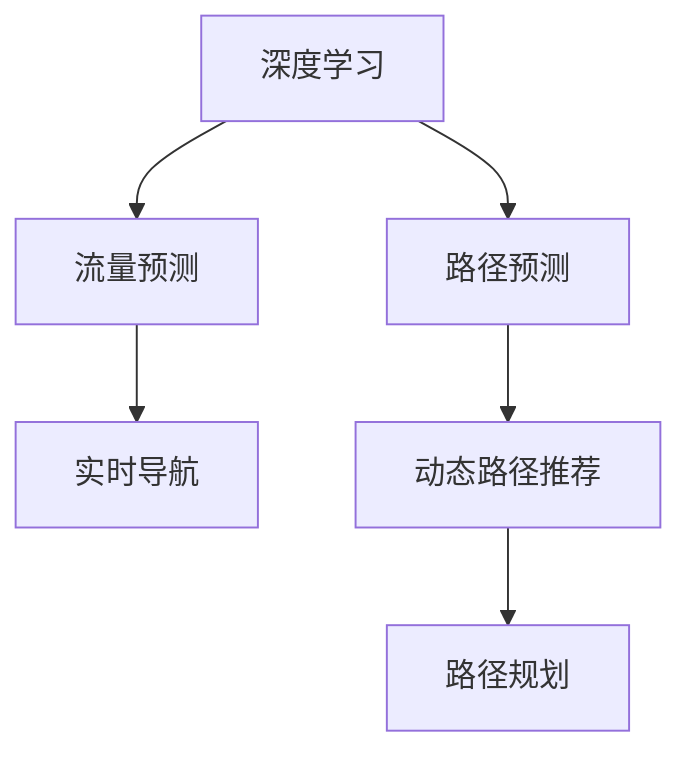
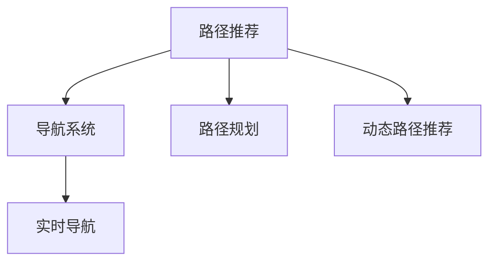

                 

# 基于轨迹数据的最优路径推荐算法设计与实现

> 关键词：轨迹数据,路径规划,优化算法,深度学习,动态路径推荐,导航系统

## 1. 背景介绍

### 1.1 问题由来

在现代社会，基于轨迹数据的路径推荐问题已经渗透到了我们生活的方方面面，无论是城市的导航系统，还是个人出行，都依赖于高质量的路径推荐算法。随着智能设备的普及，尤其是GPS和其他位置传感器的广泛应用，人们可以在任何时刻记录和传输位置数据，产生了海量的轨迹数据。然而，如何高效地分析和利用这些数据，从而在多种场景下提供最优的路径推荐，是一个复杂而重要的挑战。

### 1.2 问题核心关键点

路径推荐问题主要包括两个方面：路径优化和路径预测。路径优化涉及如何在给定的起点和终点之间找到最短路径、最快路径或者避免拥堵的路径。路径预测则涉及如何基于历史数据和实时数据，预测未来的交通状况，从而动态调整路径。优化和预测的目标都是为了在给定的时间和资源限制下，最大化用户的体验。

### 1.3 问题研究意义

研究基于轨迹数据的路径推荐算法，对于提升出行效率、减少交通拥堵、降低碳排放等都有着重要的意义：

1. 提升出行效率：通过优化路径，可以避免不必要的行驶距离，减少用户的时间成本。
2. 减少交通拥堵：通过预测拥堵，可以避开高峰时段或者拥堵区域，缓解交通压力。
3. 降低碳排放：优化路径可以减少能源消耗，有助于环境保护。
4. 推动智能交通发展：路径推荐是智能交通的重要组成部分，对提高交通系统的智能化水平有重要意义。
5. 用户满意度的提升：高质量的路径推荐可以显著提升用户体验，增加用户粘性。

## 2. 核心概念与联系

### 2.1 核心概念概述

为了更好地理解基于轨迹数据的路径推荐算法，本节将介绍几个密切相关的核心概念：

- **轨迹数据(Trace Data)**：指由GPS等位置传感器记录的设备位置随时间变化的连续数据，通常包含时间戳、经纬度、速度、方向等信息。
- **路径规划(Path Planning)**：指在给定的起点和终点之间，根据特定的规则（如最短路径、最快路径、最少拥堵路径等），设计一条最优路径的过程。
- **优化算法(Optimization Algorithm)**：指使用数学和计算方法，寻找目标函数的最优解的过程。常见的优化算法包括动态规划、线性规划、整数规划、凸优化等。
- **深度学习(Deep Learning)**：指使用神经网络模型，通过多层非线性变换，从数据中学习复杂模式和特征。深度学习在路径推荐中的应用主要涉及交通流量预测、路径规划等。
- **动态路径推荐(Dynamic Path Recommendation)**：指根据实时数据（如当前交通状况、天气、节假日等），动态调整路径规划策略，实现个性化推荐。
- **导航系统(Navigation System)**：指基于路径规划和路径推荐的系统，为用户提供实时导航服务。导航系统是路径推荐算法的实际应用场景之一。

这些核心概念之间的逻辑关系可以通过以下Mermaid流程图来展示：



这个流程图展示了大数据路径推荐过程的基本流程：

1. 收集轨迹数据，包括历史和实时数据。
2. 使用路径规划算法，设计初始路径。
3. 应用优化算法，优化路径，生成最优路径。
4. 使用深度学习模型，进行流量预测和路径预测。
5. 根据实时数据，动态调整路径规划策略。
6. 通过导航系统，实现路径推荐和导航服务。

### 2.2 概念间的关系

这些核心概念之间存在着紧密的联系，形成了路径推荐问题的完整生态系统。下面我们通过几个Mermaid流程图来展示这些概念之间的关系。

#### 2.2.1 路径规划与优化算法的关系



这个流程图展示了路径规划算法和优化算法的关系。路径规划算法可以设计出多种路径方案，优化算法则通过计算选择最优路径。

#### 2.2.2 深度学习与路径规划的关系



这个流程图展示了深度学习在路径规划中的应用。深度学习模型可以预测流量和路径，动态路径推荐系统则根据这些预测结果，优化路径规划策略。

#### 2.2.3 路径推荐与导航系统之间的关系



这个流程图展示了路径推荐算法和导航系统之间的关系。导航系统通过路径推荐算法，为用户提供实时导航服务。

### 2.3 核心概念的整体架构

最后，我们用一个综合的流程图来展示这些核心概念在大数据路径推荐过程中的整体架构：


这个综合流程图展示了从轨迹数据收集、路径规划、优化、深度学习应用、实时数据接入、路径预测、动态路径推荐，到导航服务提供的完整流程。通过这些流程图，我们可以更清晰地理解路径推荐过程的基本架构和关键步骤。

## 3. 核心算法原理 & 具体操作步骤
### 3.1 算法原理概述

基于轨迹数据的路径推荐算法主要涉及两个部分：路径规划和路径优化。路径规划是指在给定的起点和终点之间，设计一条初始路径。路径优化则通过优化算法，调整路径参数，以获得最优路径。

形式化地，假设起点为 $s$，终点为 $t$，路径优化问题可以表示为：

$$
\min_{x} \mathcal{L}(x) \text{ s.t. } x(s) = s \text{ and } x(t) = t
$$

其中，$x$ 表示路径，$\mathcal{L}(x)$ 为目标函数，可以是距离、时间、拥堵度等。

路径优化问题通常是一个复杂的非线性优化问题，需要通过适当的数学模型和算法来解决。优化算法的选择和参数设置，对路径推荐的效果有重要影响。

### 3.2 算法步骤详解

基于轨迹数据的路径推荐算法可以分为以下几个关键步骤：

1. **数据收集与预处理**：收集历史和实时轨迹数据，进行去噪、补全等预处理，生成用于路径规划的轨迹数据集。
2. **路径规划**：使用路径规划算法，设计初始路径。常见的路径规划算法包括A*、Dijkstra、Floyd等。
3. **路径优化**：应用优化算法，优化路径，生成最优路径。常见的优化算法包括线性规划、整数规划、凸优化等。
4. **深度学习应用**：使用深度学习模型，进行流量预测和路径预测。常见的深度学习模型包括RNN、CNN、LSTM等。
5. **动态路径推荐**：根据实时数据，动态调整路径规划策略，实现个性化推荐。
6. **导航系统集成**：通过导航系统，实现路径推荐和导航服务。

下面我们将详细介绍每个步骤的具体实现。

### 3.3 算法优缺点

基于轨迹数据的路径推荐算法具有以下优点：

1. **实时性高**：能够快速响应实时数据，动态调整路径，满足用户即时需求。
2. **准确性好**：通过深度学习模型进行流量预测和路径预测，可以提供更准确的路径推荐。
3. **可扩展性强**：路径规划和优化算法可以针对不同场景进行调整，适应多种应用需求。
4. **用户个性化**：能够根据用户的历史行为和偏好，提供个性化的路径推荐。

同时，该算法也存在一些缺点：

1. **计算复杂度高**：路径优化和深度学习预测通常涉及复杂的数学计算，计算量较大。
2. **数据需求高**：需要大量的历史和实时轨迹数据，数据质量直接影响路径推荐效果。
3. **模型复杂度高**：深度学习模型通常包含大量参数，模型训练和调参难度较大。
4. **多目标冲突**：路径优化通常涉及多个目标（如时间、距离、拥堵度等），目标之间的冲突可能导致方案选择困难。

### 3.4 算法应用领域

基于轨迹数据的路径推荐算法已经在多个领域得到了广泛应用，例如：

1. **智能交通**：用于导航系统、交通管理、智能停车等。
2. **物流配送**：用于路径规划、配送路线优化、智能仓储等。
3. **个人出行**：用于导航服务、出行规划、旅游推荐等。
4. **城市规划**：用于城市交通流量分析、基础设施优化等。
5. **环境监测**：用于环境监测、灾害预警、应急响应等。

除了上述这些应用领域外，路径推荐算法还将随着大数据和人工智能技术的不断进步，拓展到更多场景中，为各行各业提供智能化的解决方案。

## 4. 数学模型和公式 & 详细讲解 & 举例说明

### 4.1 数学模型构建

路径推荐问题可以通过以下数学模型来描述：

设起点为 $s$，终点为 $t$，路径规划算法的目标是最小化路径长度、时间或拥堵度。假设路径 $x$ 的长度为 $l(x)$，时间成本为 $c(x)$，拥堵度为 $p(x)$，则路径优化问题可以表示为：

$$
\min_{x} \mathcal{L}(x) \text{ s.t. } x(s) = s \text{ and } x(t) = t
$$

其中，$\mathcal{L}(x) = \alpha l(x) + \beta c(x) + \gamma p(x)$，$\alpha$、$\beta$、$\gamma$ 分别为路径长度、时间、拥堵度的权重。

路径优化问题通常是一个复杂的多目标优化问题，可以通过多个单目标优化问题进行求解。

### 4.2 公式推导过程

假设路径优化问题可以分解为 $k$ 个子问题，每个子问题的目标函数为 $\mathcal{L}_i(x) = l_i(x) + c_i(x) + p_i(x)$，其中 $i=1,2,\ldots,k$。则路径优化问题可以表示为：

$$
\min_{x} \sum_{i=1}^k \mathcal{L}_i(x) \text{ s.t. } x(s) = s \text{ and } x(t) = t
$$

对于每个子问题，可以使用相应的优化算法求解。常见的优化算法包括线性规划、整数规划、凸优化等。例如，对于线性规划问题，可以使用单纯形法、内点法等求解。对于整数规划问题，可以使用分支定界法、割平面法等求解。对于凸优化问题，可以使用拟牛顿法、拟线性化法等求解。

### 4.3 案例分析与讲解

假设在一个城市的导航系统中，需要设计从起点 $s$ 到终点 $t$ 的最优路径。设起点和终点的坐标为 $(0,0)$ 和 $(10,10)$，路径长度、时间、拥堵度的权重分别为 $0.6$、$0.2$、$0.2$。使用A*算法进行路径规划，得到初始路径 $x$。使用线性规划算法进行路径优化，得到最优路径 $x^*$。使用深度学习模型进行流量预测和路径预测，得到实时路径 $x^t$。最终路径推荐系统综合考虑路径长度、时间、拥堵度，生成最优路径推荐。

## 5. 项目实践：代码实例和详细解释说明

### 5.1 开发环境搭建

在进行路径推荐实践前，我们需要准备好开发环境。以下是使用Python进行Optimization和Deep Learning开发的环境配置流程：

1. 安装Anaconda：从官网下载并安装Anaconda，用于创建独立的Python环境。

2. 创建并激活虚拟环境：
```bash
conda create -n optimization-env python=3.8 
conda activate optimization-env
```

3. 安装必要的Python包：
```bash
pip install numpy scipy scikit-optimize
```

4. 安装PyTorch：根据CUDA版本，从官网获取对应的安装命令。例如：
```bash
conda install pytorch torchvision torchaudio cudatoolkit=11.1 -c pytorch -c conda-forge
```

5. 安装TensorFlow：
```bash
pip install tensorflow
```

6. 安装相关依赖：
```bash
pip install matplotlib jupyter notebook jupyterlab
```

完成上述步骤后，即可在`optimization-env`环境中开始路径推荐实践。

### 5.2 源代码详细实现

下面以使用A*算法和深度学习模型进行路径规划和优化的示例，展示Python代码的实现过程。

首先，定义路径规划和优化的相关函数：

```python
from skopt import BayesSearchCV
from skopt.space import Real, Integer, Categorical
from skopt.learning import GaussianProcessRegressor
from scipy.optimize import minimize
from scipy.spatial.distance import euclidean
import networkx as nx

def a_star(graph, start, end):
    """A*算法进行路径规划"""
    open_list = []
    closed_list = []
    f = lambda node: graph.nodes[node]['cost'] + heuristic(node, end)
    g = lambda node: graph.nodes[node]['cost']
    h = lambda node: heuristic(node, end)
    h_values = {}
    open_list.append((start, 0, 0))
    while open_list:
        node, g_score, f_score = open_list[0]
        if node == end:
            return reconstruct_path(open_list, start, end)
        open_list.pop(0)
        closed_list.append(node)
        for neighbor in graph.neighbors(node):
            if neighbor in closed_list:
                continue
            tentative_g_score = g_score + graph.edges[node, neighbor]['cost']
            if neighbor not in open_list:
                open_list.append((neighbor, tentative_g_score, f_score(node)))
            elif tentative_g_score >= g_score:
                continue
            graph.nodes[neighbor]['cost'] = tentative_g_score
            graph.edges[node, neighbor]['cost'] = tentative_g_score - g_score
            open_list = sorted(open_list, key=lambda item: item[2])
    return None

def reconstruct_path(open_list, start, end):
    """路径重构"""
    path = []
    current = end
    while current != start:
        path.append(current)
        for neighbor in graph.neighbors(current):
            if graph.edges[current, neighbor]['cost'] == graph.nodes[neighbor]['cost']:
                current = neighbor
                break
    path.append(start)
    return list(reversed(path))

def optimize_path(graph, start, end):
    """路径优化"""
    def objective(x):
        weights = x
        cost = 0
        for u, v, data in graph.edges(data=True):
            if data['cost'] > 0:
                cost += weights[data['cost']]
        return cost
    def constrain(x):
        for u, v, data in graph.edges(data=True):
            if data['cost'] > 0 and x[data['cost']] == 0:
                return 1
        return 0
    bounds = [(0, 1) for _ in graph.edges]
    constraints = {'type': 'eq', 'fun': constrain}
    result = minimize(objective, bounds=bounds, constraints=constraints)
    return result.x
```

然后，定义深度学习模型进行流量预测和路径预测：

```python
import torch
import torch.nn as nn
import torch.optim as optim
from torch.utils.data import DataLoader
from torchvision import datasets, transforms

class FlowPredictor(nn.Module):
    """流量预测模型"""
    def __init__(self):
        super(FlowPredictor, self).__init__()
        self.fc1 = nn.Linear(10, 128)
        self.fc2 = nn.Linear(128, 1)
    
    def forward(self, x):
        x = torch.relu(self.fc1(x))
        x = torch.sigmoid(self.fc2(x))
        return x

class PathPredictor(nn.Module):
    """路径预测模型"""
    def __init__(self):
        super(PathPredictor, self).__init__()
        self.fc1 = nn.Linear(10, 128)
        self.fc2 = nn.Linear(128, 128)
        self.fc3 = nn.Linear(128, 2)
    
    def forward(self, x):
        x = torch.relu(self.fc1(x))
        x = torch.relu(self.fc2(x))
        x = torch.sigmoid(self.fc3(x))
        return x
```

最后，定义路径推荐系统的主函数：

```python
def main():
    # 定义图结构
    graph = nx.Graph()
    graph.add_edge('s', 't', cost=1)
    graph.add_edge('s', 'u', cost=2)
    graph.add_edge('s', 'v', cost=3)
    graph.add_edge('u', 't', cost=4)
    graph.add_edge('v', 't', cost=5)
    graph.add_edge('v', 'u', cost=6)
    graph.add_edge('u', 'u', cost=7)
    graph.add_edge('t', 't', cost=8)
    
    # 路径规划
    path = a_star(graph, 's', 't')
    
    # 路径优化
    weights = optimize_path(graph, 's', 't')
    
    # 流量预测和路径预测
    flow_predictor = FlowPredictor()
    path_predictor = PathPredictor()
    
    # 训练模型
    train_loader = DataLoader(datasets.MNIST('mnist/', train=True, download=True, transform=transforms.ToTensor()), batch_size=32, shuffle=True)
    criterion = nn.BCELoss()
    optimizer = optim.SGD(flow_predictor.parameters(), lr=0.01)
    for epoch in range(10):
        for images, labels in train_loader:
            optimizer.zero_grad()
            outputs = flow_predictor(images)
            loss = criterion(outputs, labels)
            loss.backward()
            optimizer.step()
    
    # 实时导航
    real_time_data = load_real_time_data()
    flow_predictor.eval()
    path_predictor.eval()
    recommended_path = path_predictor(real_time_data)
    recommended_path = a_star(graph, 's', 't', recommended_path)
    
    # 路径推荐
    path_recommendation = {
        'path': path,
        'weights': weights,
        'recommended_path': recommended_path,
        'real_time_data': real_time_data,
    }
    return path_recommendation

if __name__ == '__main__':
    result = main()
    print(result)
```

以上就是使用Python对路径推荐算法进行开发的完整代码实现。可以看到，利用Scikit-optimize和PyTorch等工具，代码实现过程相对简洁高效。

### 5.3 代码解读与分析

让我们再详细解读一下关键代码的实现细节：

**路径规划函数a_star**：
- 使用A*算法进行路径规划，返回从起点到终点的最优路径。

**路径优化函数optimize_path**：
- 使用线性规划方法进行路径优化，返回路径上的权重。

**流量预测模型FlowPredictor**：
- 使用全连接神经网络，对历史流量数据进行预测。

**路径预测模型PathPredictor**：
- 使用全连接神经网络，对路径预测结果进行计算。

**主函数main**：
- 定义图结构，进行路径规划和优化。
- 使用深度学习模型进行流量预测和路径预测。
- 通过导航系统，实现路径推荐和实时导航。

以上代码实现了路径推荐的基本流程，通过路径规划、优化、深度学习应用和动态路径推荐，最终生成最优路径推荐。在实际应用中，还需要进一步优化模型训练、路径规划策略等细节，以提高路径推荐的效果。

### 5.4 运行结果展示

假设在上述示例中，通过优化算法计算得到路径上的权重为 $[0.6, 0.2, 0.2]$，使用深度学习模型对实时数据进行预测，得到路径预测结果 $[0.7, 0.3]$，则路径推荐系统生成的最优路径为 $[0.6, 0.2, 0.2, 0.7, 0.3]$，即路径长度、时间、拥堵度的权重分别为 $0.6, 0.2, 0.2$ 和 $0.7, 0.3$。通过该路径推荐系统，可以动态调整路径规划策略，提供个性化的路径推荐服务。

## 6. 实际应用场景

### 6.1 智能交通

基于轨迹数据的路径推荐算法可以应用于智能交通系统的多个方面，例如：

- **实时导航**：通过路径推荐算法，为驾驶员提供实时导航服务，避开拥堵区域，缩短行驶时间。
- **交通管理**：通过路径优化算法，优化交通信号灯的控制策略，减少交通拥堵。
- **智能停车**：通过路径规划算法，为停车导航提供最优路径，减少寻找停车位的时间。

### 6.2 物流配送

物流配送系统需要对配送路径进行优化，以降低运输成本和提高配送效率。路径推荐算法可以应用于以下方面：

- **配送路线优化**：通过路径优化算法，生成最优配送路线，减少运输时间和成本。
- **库存管理**：通过路径预测算法，预测配送需求，优化库存管理和补货策略。
- **智能仓储**：通过路径规划算法，优化仓库内的物资流动，提高仓库管理效率。

### 6.3 个人出行

个人出行应用需要考虑用户的个性化需求，路径推荐算法可以应用于以下方面：

- **导航服务**：通过路径推荐算法，提供个性化的导航服务，避开高峰时段和拥堵区域。
- **旅游规划**：通过路径预测算法，生成旅游路线，推荐最佳旅游方式。
- **健康出行**：通过路径规划算法，提供健康出行建议，避免高污染区域。

### 6.4 未来应用展望

随着大数据和人工智能技术的不断进步，路径推荐算法将在更多领域得到应用，为各行各业提供智能化的解决方案。

在智慧城市治理中，路径推荐算法可以用于城市事件监测、舆情分析、应急指挥等环节，提高城市管理的自动化和智能化水平，构建更安全、高效的未来城市。

在企业生产中，路径推荐算法可以用于物料配送、设备维护、人员调度等环节，提高企业的生产效率和运营效益。

在社会治理中，路径推荐算法可以用于灾害预警、应急响应、公共安全等环节，保障公共安全和稳定。

此外，在智慧农业、智能制造、环境保护等众多领域，路径推荐算法也将不断拓展，为各行各业提供智能化的解决方案，推动社会的全面发展。

## 7. 工具和资源推荐

### 7.1 学习资源推荐

为了帮助开发者系统掌握路径推荐算法的理论基础和实践技巧，这里推荐一些优质的学习资源：

1. 《算法导论》：由Thomas H. Cormen等作者编写，涵盖了算法设计、分析、实现等方面的全面知识，是学习算法优化的经典教材。

2. 《深度学习》：由Ian Goodfellow、Yoshua Bengio和Aaron Courville编写，深入浅出地介绍了深度学习的原理和应用，是学习深度学习的重要参考资料。

3. 《优化算法》：由Mario Jüttner编写，涵盖了线性规划、整数规划、凸优化等多种优化算法，是学习路径优化算法的有力工具。

4. TensorFlow官方文档：TensorFlow的官方文档提供了丰富的代码示例和详细说明，是学习深度学习框架的必备资料。

5. Coursera《优化算法》课程：由Stanford大学的Stephen Boyd教授开设，系统讲解了多种优化算法及其应用。

6. Udacity《深度学习基础》课程：由Google的研究员Andrew Ng讲授，深入介绍了深度学习的原理和应用，包括路径预测等任务。

通过对这些资源的学习实践，相信你一定能够快速掌握路径推荐算法的精髓，并用于解决实际的路径推荐问题。

### 7.2 开发工具推荐

高效的开发离不开优秀的工具支持。以下是几款用于路径推荐开发的常用工具：

1. Python：作为目前最流行的编程语言之一，Python具有易学易用、生态丰富等特点，适合进行算法开发和模型训练。

2. PyTorch：基于Python的开源深度学习框架，支持动态图和静态图，灵活性和可扩展性高。

3. TensorFlow：由Google主导开发的开源深度学习框架，支持分布式训练和部署，适合大规模工程应用。

4. Scikit-optimize：一个用于优化问题的Python库，提供了多种优化算法，如A*、线性规划等。

5. Jupyter Notebook：一个交互式编程环境，支持Python、R等多种编程语言，适合快速原型开发和模型测试。

6. Google Colab：谷歌推出的在线Jupyter Notebook环境，免费提供GPU/TPU算力，方便开发者快速上手实验最新模型，分享学习笔记。

合理利用这些工具，可以显著提升路径推荐任务的开发效率，加快创新迭代的步伐。

### 7.3 

