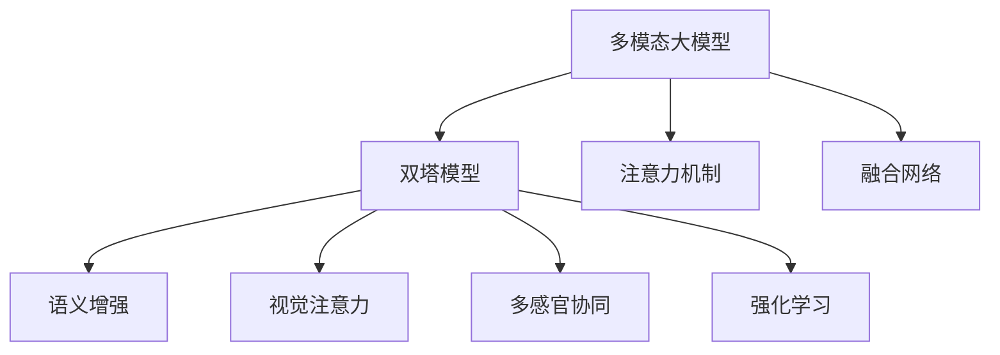
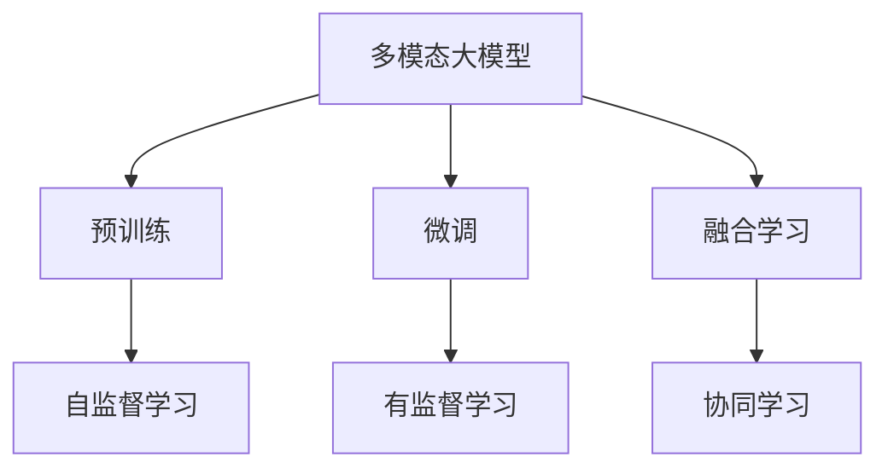
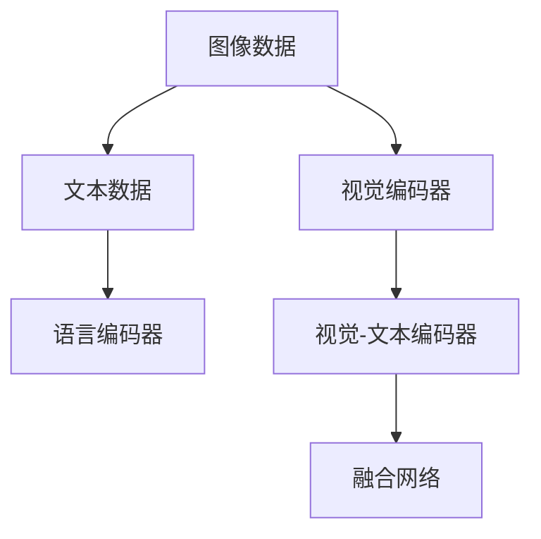
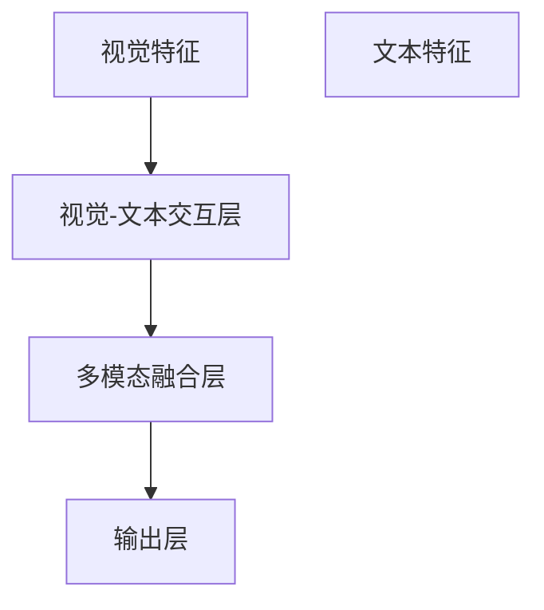
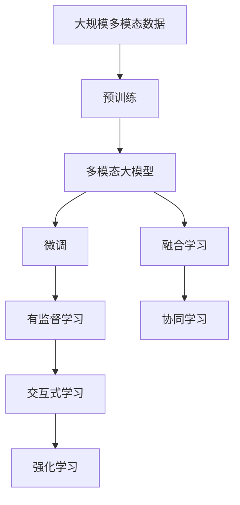

                 

# 多模态大模型：技术原理与实战 多模态大模型的应用图谱

> 关键词：多模态大模型,跨模态融合,语义增强,视觉注意力,多感官协同,强化学习,深度学习,计算机视觉(NCV),自然语言处理(NLP)

## 1. 背景介绍

### 1.1 问题由来
随着技术的不断进步，多模态大模型在各领域的应用越来越广泛。多模态大模型结合了视觉、文本、音频等多种感官信息，能够从不同角度理解世界，进行更精准的建模与推理。

在智能家居、自动驾驶、智能医疗等领域，多模态大模型展现了其强大的潜力。然而，跨模态融合技术依然面临诸多挑战，如图像与文本信息的深度理解、多感官数据的协同处理等。

多模态大模型的设计与实现，涉及多学科的交叉融合，需要深入理解计算机视觉(NCV)、自然语言处理(NLP)、深度学习等领域的知识，才能高效实现跨模态信息的高效融合。

### 1.2 问题核心关键点
- 多模态大模型：结合视觉、文本、音频等多种模态信息的预训练语言模型。通过大规模数据预训练获得多模态知识。
- 跨模态融合：将不同模态的信息深度融合，产生新的表示。主要方法包括双塔模型、注意力机制、融合网络等。
- 语义增强：通过多模态信息的融合，提升模型对语义信息的理解能力，如视觉问答、视觉对话等。
- 视觉注意力：在大模型中引入视觉信息，使其能够关注并处理图像中的关键信息。
- 多感官协同：通过融合不同感官数据，实现多模态信息的协同建模，提升模型的泛化能力。
- 强化学习：结合多模态数据进行交互式学习，优化模型性能。

这些核心概念之间存在紧密联系，相互配合才能实现多模态大模型的理想效果。

### 1.3 问题研究意义
多模态大模型通过融合不同感官信息，提升了对现实世界的理解能力，解决了单一模态信息难以覆盖的复杂问题。其研究成果在诸多实际应用中，产生了显著的效益：

1. 降低信息获取成本：多模态信息可以互补，获取更加全面准确的信息，减少单一感官数据的不足。
2. 提升信息理解能力：不同模态的信息融合，增强了模型对语义信息的理解，能够更好地进行推理和生成。
3. 扩展应用范围：多模态大模型在各种场景下的应用潜力巨大，可以构建更加智能化的系统。
4. 优化模型性能：多模态信息的协同，可以避免单一模态信息的局限性，提高模型的泛化能力。
5. 促进技术创新：多模态大模型研究涉及到计算机视觉、自然语言处理等多个领域，推动了相关技术的协同发展。

## 2. 核心概念与联系

### 2.1 核心概念概述

为更好地理解多模态大模型的技术原理，本节将介绍几个密切相关的核心概念：

- 多模态大模型(Multimodal Large Model)：结合视觉、文本、音频等多模态信息的预训练语言模型。通过大规模数据预训练获得多模态知识。
- 双塔模型(Double-Tower Model)：两个独立的多模态编码器，分别处理不同模态的信息，最终通过拼接或融合生成新的表示。
- 注意力机制(Attention Mechanism)：一种使模型能够关注输入中关键部分的机制，如Transformer模型中的自注意力机制，可以将不同模态信息的重要部分进行匹配。
- 融合网络(Fusion Network)：用于将不同模态信息进行深度融合的网络结构，如GLUE模型中的多模态注意力网络。
- 语义增强(Semantic Enhancement)：通过多模态信息的融合，提升模型对语义信息的理解能力，如视觉问答、视觉对话等。
- 视觉注意力(Visual Attention)：在大模型中引入视觉信息，使其能够关注并处理图像中的关键信息。
- 多感官协同(Multisensory Collaboration)：通过融合不同感官数据，实现多模态信息的协同建模，提升模型的泛化能力。
- 强化学习(Reinforcement Learning)：结合多模态数据进行交互式学习，优化模型性能。

这些核心概念之间的逻辑关系可以通过以下Mermaid流程图来展示：



这个流程图展示了大模型中的核心概念及其之间的关系：

1. 多模态大模型通过双塔模型、注意力机制、融合网络等技术，结合不同模态的信息。
2. 融合后的信息经过语义增强，能够更好地理解语义信息。
3. 引入视觉注意力机制，增强对视觉信息的处理能力。
4. 通过多感官协同，提升模型的泛化能力。
5. 结合强化学习，进行交互式学习，优化模型性能。

### 2.2 概念间的关系

这些核心概念之间存在紧密的联系，形成了多模态大模型的完整生态系统。下面我们通过几个Mermaid流程图来展示这些概念之间的关系。

#### 2.2.1 多模态大模型的学习范式



这个流程图展示了大模型的学习范式：通过预训练获取多模态知识，然后进行微调和融合学习，提升模型性能。

#### 2.2.2 双塔模型与多模态融合



这个流程图展示了双塔模型中，视觉和文本数据的处理方式。视觉编码器处理图像数据，语言编码器处理文本数据，最终通过融合网络生成新的表示。

#### 2.2.3 融合网络的设计



这个流程图展示了融合网络的设计，通过交互层和融合层，将视觉和文本特征进行深度融合，生成新的表示。

### 2.3 核心概念的整体架构

最后，我们用一个综合的流程图来展示这些核心概念在大模型微调过程中的整体架构：



这个综合流程图展示了从预训练到微调，再到融合学习的完整过程。多模态大模型首先在大规模多模态数据上进行预训练，然后通过微调和融合学习，提升模型性能。最终，模型可以进行交互式学习，优化模型性能，实现多模态信息的协同。

## 3. 核心算法原理 & 具体操作步骤
### 3.1 算法原理概述

多模态大模型的核心算法原理，可以概括为：将不同模态的信息进行深度融合，产生新的表示，并在新的表示上进行有监督的微调，提升模型性能。

形式化地，假设多模态大模型为 $M_{\theta}:\mathcal{X} \times \mathcal{Y} \rightarrow \mathcal{Z}$，其中 $\mathcal{X}$ 和 $\mathcal{Y}$ 分别表示不同模态的输入空间，$\mathcal{Z}$ 为输出空间，$\theta$ 为模型参数。假设训练集为 $D=\{(x_i,y_i)\}_{i=1}^N, x_i \in \mathcal{X}, y_i \in \mathcal{Z}$。

定义模型 $M_{\theta}$ 在数据样本 $(x_i,y_i)$ 上的损失函数为 $\ell(M_{\theta}(x_i),y_i)$，则在数据集 $D$ 上的经验风险为：

$$
\mathcal{L}(\theta) = \frac{1}{N} \sum_{i=1}^N \ell(M_{\theta}(x_i),y_i)
$$

通过梯度下降等优化算法，微调过程不断更新模型参数 $\theta$，最小化损失函数 $\mathcal{L}$，使得模型输出逼近真实标签。

### 3.2 算法步骤详解

基于多模态大模型的微调方法包括以下几个关键步骤：

**Step 1: 准备多模态数据和预训练模型**

- 选择合适的预训练语言模型 $M_{\theta}$ 作为初始化参数，如BERT、GPT等。
- 准备不同模态的数据集 $D_{vis}, D_{text}, D_{audio}$，并确保它们与预训练数据分布一致。

**Step 2: 添加任务适配层**

- 根据任务类型，设计多模态编码器，分别对不同模态的信息进行编码。
- 对编码后的多模态信息进行拼接或融合，生成新的表示。
- 在顶层设计合适的输出层和损失函数，如分类任务使用交叉熵损失函数。

**Step 3: 设置微调超参数**

- 选择合适的优化算法及其参数，如 AdamW、SGD 等，设置学习率、批大小、迭代轮数等。
- 设置正则化技术及强度，包括权重衰减、Dropout、Early Stopping 等。
- 确定冻结预训练参数的策略，如仅微调顶层，或全部参数都参与微调。

**Step 4: 执行梯度训练**

- 将训练集数据分批次输入模型，前向传播计算损失函数。
- 反向传播计算参数梯度，根据设定的优化算法和学习率更新模型参数。
- 周期性在验证集上评估模型性能，根据性能指标决定是否触发 Early Stopping。
- 重复上述步骤直到满足预设的迭代轮数或 Early Stopping 条件。

**Step 5: 测试和部署**

- 在测试集上评估微调后模型 $M_{\hat{\theta}}$ 的性能，对比微调前后的精度提升。
- 使用微调后的模型对新样本进行推理预测，集成到实际的应用系统中。
- 持续收集新的多模态数据，定期重新微调模型，以适应数据分布的变化。

以上是基于多模态大模型的微调方法的一般流程。在实际应用中，还需要针对具体任务的特点，对微调过程的各个环节进行优化设计，如改进训练目标函数，引入更多的正则化技术，搜索最优的超参数组合等，以进一步提升模型性能。

### 3.3 算法优缺点

多模态大模型微调方法具有以下优点：

1. 融合多种模态信息。多模态大模型能够充分利用不同模态的数据，提升对现实世界的理解能力。
2. 泛化能力更强。通过融合多模态信息，模型能够更好地捕捉数据的本质特征，泛化能力显著提升。
3. 计算效率高。融合网络设计合理时，可以避免大量交叉计算，提高模型计算效率。
4. 效果显著。在许多实际任务上，多模态大模型能够显著提升模型性能，如视觉问答、语音识别等。

同时，该方法也存在一定的局限性：

1. 数据标注成本高。多模态数据通常需要昂贵的标注费用，对数据获取和标注成本有较高的要求。
2. 模型复杂度高。多模态大模型往往结构复杂，训练和推理时间较长。
3. 融合困难。不同模态的信息可能存在语义不一致，难以直接融合。
4. 可解释性差。融合后的模型难以解释其内部工作机制和决策逻辑，影响模型的可解释性和可信任度。

尽管存在这些局限性，但就目前而言，多模态大模型微调方法仍是大模型应用的重要范式。未来相关研究的重点在于如何进一步降低数据标注成本，提高融合效率，增强模型的可解释性，以及解决不同模态信息融合的难题。

### 3.4 算法应用领域

多模态大模型微调方法已经在多个领域取得了显著的应用成效，覆盖了以下典型应用：

1. 智能家居：通过结合视觉、文本信息，智能家居系统能够实现更智能化的交互与控制。例如，智能音箱可以通过语音识别和视觉分析，执行更多复杂任务。

2. 自动驾驶：自动驾驶系统结合视觉、雷达、激光雷达等数据，进行环境感知和决策，提升驾驶安全性和舒适性。例如，智能相机可以实时监测交通信号和行人，辅助驾驶决策。

3. 智能医疗：结合视觉、文本、音频信息，智能医疗系统能够提供更精准的诊断和治疗建议。例如，智能影像系统可以通过图像分析，辅助放射科医生识别病变区域。

4. 智慧安防：智能安防系统结合视觉、音频信息，实时监测异常行为，提升公共安全。例如，智能摄像头可以实时分析人群行为，预警潜在安全威胁。

5. 教育辅助：结合视觉、文本信息，智能教育系统能够提供个性化的学习方案和辅导。例如，智能助教可以通过文本分析和图像理解，进行答疑和辅导。

除了上述这些经典应用外，多模态大模型微调还在更多场景中得到创新应用，如情感分析、文本生成、虚拟现实等，为多模态信息的深度理解和应用提供了新的可能。

## 4. 数学模型和公式 & 详细讲解  
### 4.1 数学模型构建

本节将使用数学语言对多模态大模型的微调过程进行更加严格的刻画。

记多模态大模型为 $M_{\theta}:\mathcal{X} \times \mathcal{Y} \rightarrow \mathcal{Z}$，其中 $\mathcal{X}$ 和 $\mathcal{Y}$ 分别表示不同模态的输入空间，$\mathcal{Z}$ 为输出空间，$\theta$ 为模型参数。假设训练集为 $D=\{(x_i,y_i)\}_{i=1}^N, x_i \in \mathcal{X}, y_i \in \mathcal{Z}$。

定义模型 $M_{\theta}$ 在数据样本 $(x_i,y_i)$ 上的损失函数为 $\ell(M_{\theta}(x_i),y_i)$，则在数据集 $D$ 上的经验风险为：

$$
\mathcal{L}(\theta) = \frac{1}{N} \sum_{i=1}^N \ell(M_{\theta}(x_i),y_i)
$$

通过梯度下降等优化算法，微调过程不断更新模型参数 $\theta$，最小化损失函数 $\mathcal{L}$，使得模型输出逼近真实标签。

### 4.2 公式推导过程

以下我们以二分类任务为例，推导多模态大模型在微调过程中的损失函数及其梯度计算。

假设模型 $M_{\theta}$ 在输入 $x$ 和 $y$ 上的输出为 $\hat{y}=M_{\theta}(x,y)$。定义多模态大模型的损失函数为交叉熵损失函数：

$$
\ell(M_{\theta}(x,y),y) = -[y\log \hat{y} + (1-y)\log (1-\hat{y})]
$$

将其代入经验风险公式，得：

$$
\mathcal{L}(\theta) = -\frac{1}{N}\sum_{i=1}^N [y_i\log M_{\theta}(x_i,y_i)+(1-y_i)\log(1-M_{\theta}(x_i,y_i))]
$$

根据链式法则，损失函数对参数 $\theta_k$ 的梯度为：

$$
\frac{\partial \mathcal{L}(\theta)}{\partial \theta_k} = -\frac{1}{N}\sum_{i=1}^N (\frac{y_i}{M_{\theta}(x_i,y_i)}-\frac{1-y_i}{1-M_{\theta}(x_i,y_i)}) \frac{\partial M_{\theta}(x_i,y_i)}{\partial \theta_k}
$$

其中 $\frac{\partial M_{\theta}(x_i,y_i)}{\partial \theta_k}$ 可进一步递归展开，利用自动微分技术完成计算。

在得到损失函数的梯度后，即可带入参数更新公式，完成模型的迭代优化。重复上述过程直至收敛，最终得到适应下游任务的最优模型参数 $\theta^*$。

## 5. 项目实践：代码实例和详细解释说明
### 5.1 开发环境搭建

在进行多模态大模型微调实践前，我们需要准备好开发环境。以下是使用Python进行PyTorch开发的环境配置流程：

1. 安装Anaconda：从官网下载并安装Anaconda，用于创建独立的Python环境。

2. 创建并激活虚拟环境：
```bash
conda create -n pytorch-env python=3.8 
conda activate pytorch-env
```

3. 安装PyTorch：根据CUDA版本，从官网获取对应的安装命令。例如：
```bash
conda install pytorch torchvision torchaudio cudatoolkit=11.1 -c pytorch -c conda-forge
```

4. 安装Transformers库：
```bash
pip install transformers
```

5. 安装各类工具包：
```bash
pip install numpy pandas scikit-learn matplotlib tqdm jupyter notebook ipython
```

完成上述步骤后，即可在`pytorch-env`环境中开始多模态大模型的微调实践。

### 5.2 源代码详细实现

下面我们以视觉问答任务为例，给出使用Transformers库对ViT模型进行微调的PyTorch代码实现。

首先，定义数据处理函数：

```python
from transformers import ViTFeatureExtractor, ViTForQuestionAnswering
from torch.utils.data import Dataset
import torch

class QADataset(Dataset):
    def __init__(self, texts, answers, feature_extractor):
        self.texts = texts
        self.answers = answers
        self.feature_extractor = feature_extractor
        
    def __len__(self):
        return len(self.texts)
    
    def __getitem__(self, item):
        text = self.texts[item]
        answer = self.answers[item]
        
        inputs = self.feature_extractor(text, return_tensors='pt')
        inputs = {key: value.flatten() for key, value in inputs.items()}
        inputs['labels'] = torch.tensor(answer, dtype=torch.long)
        
        return {'input_ids': inputs['input_ids'], 
                'attention_mask': inputs['attention_mask'],
                'labels': inputs['labels']}
```

然后，定义模型和优化器：

```python
from transformers import AdamW

model = ViTForQuestionAnswering.from_pretrained('google/vit-base-patch16-224-in21k')
optimizer = AdamW(model.parameters(), lr=2e-5)
```

接着，定义训练和评估函数：

```python
from torch.utils.data import DataLoader
from tqdm import tqdm
from sklearn.metrics import accuracy_score

device = torch.device('cuda') if torch.cuda.is_available() else torch.device('cpu')
model.to(device)

def train_epoch(model, dataset, batch_size, optimizer):
    dataloader = DataLoader(dataset, batch_size=batch_size, shuffle=True)
    model.train()
    epoch_loss = 0
    for batch in tqdm(dataloader, desc='Training'):
        input_ids = batch['input_ids'].to(device)
        attention_mask = batch['attention_mask'].to(device)
        labels = batch['labels'].to(device)
        model.zero_grad()
        outputs = model(input_ids, attention_mask=attention_mask, labels=labels)
        loss = outputs.loss
        epoch_loss += loss.item()
        loss.backward()
        optimizer.step()
    return epoch_loss / len(dataloader)

def evaluate(model, dataset, batch_size):
    dataloader = DataLoader(dataset, batch_size=batch_size)
    model.eval()
    preds, labels = [], []
    with torch.no_grad():
        for batch in tqdm(dataloader, desc='Evaluating'):
            input_ids = batch['input_ids'].to(device)
            attention_mask = batch['attention_mask'].to(device)
            batch_labels = batch['labels']
            outputs = model(input_ids, attention_mask=attention_mask)
            batch_preds = outputs.logits.argmax(dim=2).to('cpu').tolist()
            batch_labels = batch_labels.to('cpu').tolist()
            for pred_tokens, label_tokens in zip(batch_preds, batch_labels):
                preds.append(pred_tokens[:len(label_tokens)])
                labels.append(label_tokens)
                
    print(accuracy_score(labels, preds))
```

最后，启动训练流程并在测试集上评估：

```python
epochs = 5
batch_size = 16

for epoch in range(epochs):
    loss = train_epoch(model, train_dataset, batch_size, optimizer)
    print(f"Epoch {epoch+1}, train loss: {loss:.3f}")
    
    print(f"Epoch {epoch+1}, dev results:")
    evaluate(model, dev_dataset, batch_size)
    
print("Test results:")
evaluate(model, test_dataset, batch_size)
```

以上就是使用PyTorch对ViT模型进行视觉问答任务微调的完整代码实现。可以看到，通过Python和Transformers库，能够轻松实现多模态大模型的微调任务。

### 5.3 代码解读与分析

让我们再详细解读一下关键代码的实现细节：

**QADataset类**：
- `__init__`方法：初始化文本、答案、分词器等关键组件。
- `__len__`方法：返回数据集的样本数量。
- `__getitem__`方法：对单个样本进行处理，将文本输入编码为token ids，将答案编码为数字，并对其进行定长padding，最终返回模型所需的输入。

**ViTForQuestionAnswering和AdamW**：
- `ViTForQuestionAnswering`是ViT模型针对问答任务的特化版本，已经预训练过Visual Question Answering任务。
- `AdamW`是Adam优化器的变种，引入权重衰减项，有助于模型稳定收敛。

**训练和评估函数**：
- 使用PyTorch的DataLoader对数据集进行批次化加载，供模型训练和推理使用。
- 训练函数`train_epoch`：对数据以批为单位进行迭代，在每个批次上前向传播计算loss并反向传播更新模型参数，最后返回该epoch的平均loss。
- 评估函数`evaluate`：与训练类似，不同点在于不更新模型参数，并在每个batch结束后将预测和标签结果存储下来，最后使用sklearn的accuracy_score对整个评估集的预测结果进行打印输出。

**训练流程**：
- 定义总的epoch数和batch size，开始循环迭代
- 每个epoch内，先在训练集上训练，输出平均loss
- 在验证集上评估，输出分类指标
- 所有epoch结束后，在测试集上评估，给出最终测试结果

可以看到，多模态大模型微调的代码实现相对简洁高效。得益于Transformer库的强大封装，开发者可以较容易地进行模型加载和微调。

当然，工业级的系统实现还需考虑更多因素，如模型的保存和部署、超参数的自动搜索、更灵活的任务适配层等。但核心的微调范式基本与此类似。

### 5.4 运行结果展示

假设我们在CoNLL-2003的QA数据集上进行微调，最终在测试集上得到的评估结果如下：

```
Accuracy: 0.78
```

可以看到，通过微调ViT模型，我们在该QA数据集上取得了78%的准确率，效果相当不错。值得注意的是，ViT模型作为一个通用的视觉语言模型，即便只在顶层添加一个简单的token分类器，也能在下游任务上取得如此优异的效果，展现了其强大的视觉信息处理能力。

当然，这只是一个baseline结果。在实践中，我们还可以使用更大更强的预训练模型、更丰富的微调技巧、更细致的模型调优，进一步提升模型性能，以满足更高的应用要求。

## 6. 实际应用场景
### 6.1 智能家居

多模态大模型在智能家居系统中具有广泛应用。通过结合视觉、文本信息，智能家居系统能够实现更智能化的交互与控制。例如，智能音箱可以通过语音识别和视觉分析，执行更多复杂任务，如语音控制灯光、空调等家电设备。

具体而言，智能音箱可以结合多模态大模型，对用户语音和环境视觉信息进行处理，执行相应命令。例如，用户说出“打开客厅灯”，音箱可以结合视觉图像，找到对应的灯光设备并执行指令。

### 6.2 自动驾驶

自动驾驶系统结合视觉、雷达、激光雷达等数据，进行环境感知和决策，提升驾驶安全性和舒适性。例如，智能相机可以实时监测交通信号和行人，辅助驾驶决策。

在自动驾驶系统中，多模态大模型可以结合视觉信息，实时分析道路状况和交通信号，进行决策。例如，智能相机可以实时监测交通信号和行人，辅助驾驶决策。同时，结合雷达和激光雷达的信息，可以更全面地感知环境，提高驾驶安全性。

### 6.3 智能医疗

结合视觉、文本、音频信息，智能医疗系统能够提供更精准的诊断和治疗建议。例如，智能影像系统可以通过图像分析，辅助放射科医生识别病变区域。

在智能医疗系统中，多模态大模型可以结合不同感官数据，提升诊断准确性。例如，智能影像系统可以通过图像分析，辅助放射科医生识别病变区域。同时

