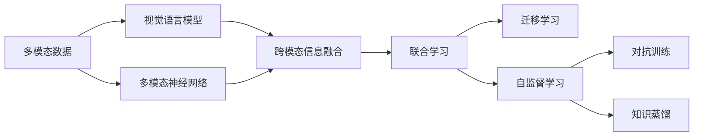
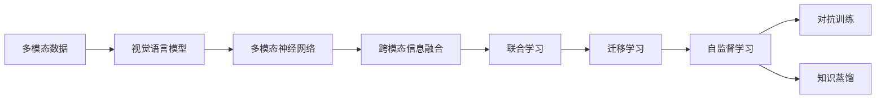
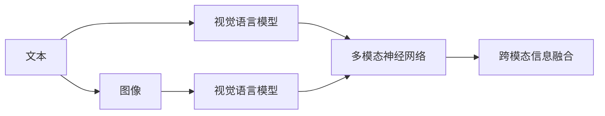
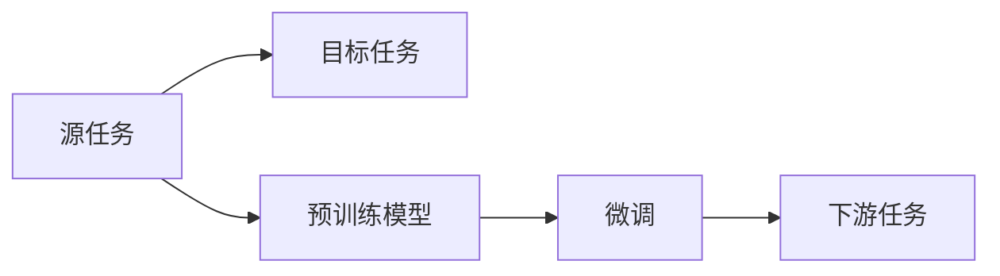
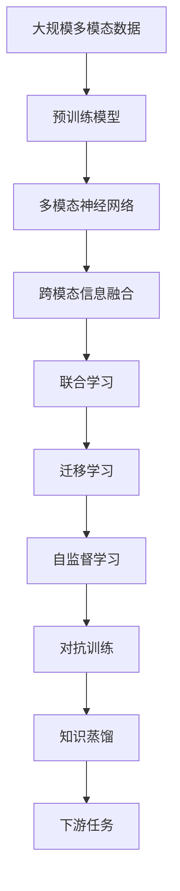

                 

# 多模态大模型：技术原理与实战 工具和算法框架介绍

> 关键词：多模态大模型,技术原理,实战应用,工具和框架,监督学习,自监督学习,强化学习,对抗训练,知识蒸馏,迁移学习,视觉语言模型

## 1. 背景介绍

随着人工智能技术的飞速发展，多模态大模型（Multimodal Large Models）成为了当前研究的前沿方向之一。多模态大模型是指可以处理和理解不同类型的数据，如文本、图像、音频等，并进行跨模态信息融合，从而提供更全面、更智能的解决方案。在NLP、计算机视觉、语音识别等多个领域，多模态大模型已经展示了巨大的潜力。

### 1.1 问题由来

近年来，自然语言处理（NLP）、计算机视觉（CV）和语音识别（ASR）等领域的预训练模型纷纷涌现，如BERT、GPT、ViT、ResNet等。这些模型通过大规模无监督学习，获取了丰富的领域知识，并在下游任务上取得了显著的性能提升。然而，传统的单一模态模型已经难以应对复杂的现实世界任务，例如融合文本和图像的问答系统、跨模态推荐系统等。因此，如何构建可以高效处理多模态数据，并进行跨模态信息融合的大模型，成为了当前研究的热点。

### 1.2 问题核心关键点

多模态大模型的关键在于：

- **跨模态信息融合**：如何有效地将不同模态的信息进行融合，使得模型能够理解多模态数据的深层次语义关系。
- **模型结构设计**：如何设计一个多模态模型，使其能够高效地处理和理解多种数据类型。
- **训练策略**：如何训练一个多模态模型，使其能够最大化地利用多模态数据，并避免在训练过程中过拟合。
- **应用场景**：如何根据具体任务，设计合适的多模态模型，并对其进行优化和调优。

这些问题构成了多模态大模型技术的基础框架，也是本文的主要研究内容。

### 1.3 问题研究意义

多模态大模型在以下几个方面具有重要意义：

- **提升智能系统性能**：通过融合不同模态的数据，模型可以更全面地理解现实世界的复杂现象，从而提供更精准、更智能的解决方案。
- **推动跨领域研究进展**：多模态大模型可以跨越传统的学科界限，促进NLP、CV、ASR等领域的融合，催生更多前沿研究方向。
- **加速技术产业化**：多模态大模型的成功应用，将推动AI技术在各垂直行业的落地和普及，提高行业数字化转型效率。
- **提升社会价值**：多模态大模型在医疗、教育、交通等多个领域的应用，能够显著提升社会生活质量和治理水平。

## 2. 核心概念与联系

### 2.1 核心概念概述

多模态大模型涉及多个关键概念，包括：

- **多模态数据**：指同时包含文本、图像、音频等多种数据类型的输入。
- **视觉语言模型（VLW）**：将视觉和语言两种模态信息结合的模型。
- **多模态神经网络（MMN）**：能够处理多模态数据的神经网络结构。
- **跨模态信息融合**：将不同模态的信息进行有效整合，以提升模型性能。
- **联合学习**：多个模型之间共享知识，通过联合训练提升性能。
- **迁移学习**：将一个领域的知识迁移到另一个领域，加速新任务的学习过程。
- **自监督学习**：利用无监督数据进行模型训练，避免对标注数据的依赖。
- **对抗训练**：通过对抗样本训练模型，提升模型鲁棒性。
- **知识蒸馏**：将大型模型的知识传递给小型模型，提高其性能。

这些概念之间的联系可以通过以下Mermaid流程图来展示：



这个流程图展示了多模态数据如何通过视觉语言模型、多模态神经网络进行跨模态信息融合，并通过联合学习、迁移学习、自监督学习、对抗训练和知识蒸馏等技术进行优化。

### 2.2 概念间的关系

这些核心概念之间存在着紧密的联系，形成了多模态大模型的完整生态系统。下面我通过几个Mermaid流程图来展示这些概念之间的关系。

#### 2.2.1 多模态大模型的学习范式



这个流程图展示了多模态大模型的基本学习流程，包括数据输入、视觉语言模型的处理、多模态神经网络的融合、联合学习、迁移学习、自监督学习、对抗训练和知识蒸馏等环节。

#### 2.2.2 跨模态信息融合的流程



这个流程图展示了文本和图像数据如何通过视觉语言模型进行处理，并融合到多模态神经网络中，最后通过跨模态信息融合得到最终的输出结果。

#### 2.2.3 联合学习的框架


这个流程图展示了两个模型如何通过联合训练进行知识共享，提升整体性能。

#### 2.2.4 迁移学习的流程



这个流程图展示了迁移学习的基本流程，即通过预训练模型在源任务上学习到的知识，迁移到目标任务上进行微调，以提升在新任务上的性能。

### 2.3 核心概念的整体架构

最后，我们用一个综合的流程图来展示这些核心概念在大模型微调过程中的整体架构：



这个综合流程图展示了从预训练到联合学习、迁移学习、自监督学习、对抗训练和知识蒸馏的完整过程。多模态大模型首先在大规模多模态数据上进行预训练，然后通过联合学习、迁移学习、自监督学习、对抗训练和知识蒸馏等技术进行优化，最后在新任务上进行微调，得到适合特定任务的模型。

## 3. 核心算法原理 & 具体操作步骤

### 3.1 算法原理概述

多模态大模型的核心原理是通过深度神经网络模型，将不同模态的数据进行联合表示，并在跨模态信息融合的过程中，学习到不同模态之间的深层次语义关系。以下是一个基于监督学习的典型多模态大模型的算法原理：

1. **数据预处理**：将多模态数据进行标准化处理，转化为模型所需的输入格式。
2. **视觉语言模型（VLW）**：通过自监督学习，将视觉和语言两种模态的信息进行融合。
3. **多模态神经网络（MMN）**：将融合后的多模态数据输入多模态神经网络进行处理。
4. **跨模态信息融合**：通过神经网络模型，将多模态信息进行整合，得到联合表示。
5. **任务适配层**：根据具体任务，在模型顶层添加合适的任务适配层，如分类、生成等。
6. **联合学习**：通过多个模型之间的联合训练，共享知识，提升整体性能。
7. **迁移学习**：将预训练模型应用于新任务，进行微调，加速新任务的学习过程。

### 3.2 算法步骤详解

以一个基于视觉语言模型的多模态大模型为例，其详细算法步骤如下：

1. **数据准备**：准备多模态数据集，包括文本和图像数据，并进行预处理，如文本分词、图像缩放、归一化等。
2. **视觉语言模型训练**：使用自监督学习方法，如Contrastive Learning，训练视觉语言模型，学习视觉和语言之间的语义关系。
3. **多模态神经网络设计**：根据具体任务需求，设计多模态神经网络，如Transformer、CNN等。
4. **跨模态信息融合**：将视觉语言模型的输出作为输入，进入多模态神经网络进行跨模态信息融合，得到联合表示。
5. **任务适配层设计**：根据具体任务，设计合适的任务适配层，如全连接层、卷积层、注意力机制等。
6. **模型微调**：在特定任务上，对多模态模型进行微调，调整任务适配层的权重，提升模型性能。
7. **联合学习**：通过联合训练多个模型，共享知识，提升整体性能。
8. **迁移学习**：将预训练模型应用于新任务，进行微调，加速新任务的学习过程。

### 3.3 算法优缺点

多模态大模型的优点包括：

- **跨模态信息融合**：能够有效融合不同模态的信息，提升模型性能。
- **可扩展性**：可以处理多种数据类型，适用于多种应用场景。
- **自监督学习**：通过无监督数据进行训练，避免对标注数据的依赖。
- **联合学习**：通过多个模型的联合训练，共享知识，提升整体性能。
- **迁移学习**：通过预训练模型在新任务上的微调，加速新任务的学习过程。

然而，多模态大模型也存在一些缺点：

- **模型复杂性**：多模态神经网络通常比单一模态的神经网络更复杂，需要更多的计算资源和时间。
- **数据获取成本高**：多模态数据集的获取和标注成本较高，且数据质量对模型性能影响较大。
- **训练难度大**：多模态大模型的训练过程较为复杂，需要更多的实验设计和调参工作。

### 3.4 算法应用领域

多模态大模型已经在多个领域得到了广泛应用，包括但不限于：

- **智能问答系统**：融合文本和图像信息，提供更全面、更智能的问答服务。
- **跨模态推荐系统**：根据用户的多模态数据，推荐更符合其兴趣的商品或内容。
- **医学影像诊断**：通过融合医学影像和文本信息，提升疾病诊断的准确性。
- **安防监控**：结合图像和语音信息，提高视频监控的智能识别能力。
- **智能家居**：通过融合传感器数据和用户行为数据，提升家居生活的智能性。
- **自动驾驶**：结合图像、雷达和激光雷达等数据，提升自动驾驶的安全性和效率。
- **社交媒体分析**：融合文本和图像信息，分析用户行为和情感变化。

这些应用场景展示了多模态大模型的强大能力和广阔前景。

## 4. 数学模型和公式 & 详细讲解 & 举例说明

### 4.1 数学模型构建

假设我们有一个基于视觉语言模型的多模态大模型，其数学模型可以表示为：

$$ M_{\theta}(x,v) = \text{mm}(VL(x,v), \text{MMN}(VL(x,v)), \theta) $$

其中，$x$ 表示文本数据，$v$ 表示图像数据，$\text{VL}(x,v)$ 表示视觉语言模型，$\text{MMN}(VL(x,v), \theta)$ 表示多模态神经网络，$\theta$ 为模型参数。

### 4.2 公式推导过程

以视觉语言模型（VLW）为例，其常用的自监督学习任务为Image Captioning，即给定一张图片，生成一段描述该图片的文本。假设图片大小为$n \times n$，其嵌入表示为$v$，文本长度为$m$，文本嵌入表示为$x$。

视觉语言模型的数学模型可以表示为：

$$ \text{VL}(x,v) = f_{\theta_{VL}}(x, v) $$

其中，$f_{\theta_{VL}}$ 为视觉语言模型参数。

假设我们使用Contrastive Learning方法进行自监督学习，其损失函数可以表示为：

$$ \mathcal{L}_{VL} = -\log \frac{e^{\text{sim}(v,x)}}{\sum_{x'} e^{\text{sim}(v,x')}} $$

其中，$\text{sim}$ 表示相似度计算，如余弦相似度。

### 4.3 案例分析与讲解

以一个基于视觉语言模型（VLW）的多模态大模型为例，假设其应用于智能问答系统。该系统的流程可以概括为：

1. 接收用户输入的文本和图片。
2. 使用视觉语言模型（VLW）对图片进行描述，生成图像特征。
3. 将文本和图像特征输入多模态神经网络（MMN）进行跨模态信息融合，得到联合表示。
4. 在模型顶层添加任务适配层，如全连接层，进行分类或生成。
5. 使用标注数据对模型进行微调，调整任务适配层的权重。
6. 通过联合学习，提升整体性能。
7. 在新任务上，进行迁移学习，加速新任务的学习过程。

## 5. 项目实践：代码实例和详细解释说明

### 5.1 开发环境搭建

在进行多模态大模型开发前，我们需要准备好开发环境。以下是使用Python进行PyTorch开发的环境配置流程：

1. 安装Anaconda：从官网下载并安装Anaconda，用于创建独立的Python环境。

2. 创建并激活虚拟环境：
```bash
conda create -n pytorch-env python=3.8 
conda activate pytorch-env
```

3. 安装PyTorch：根据CUDA版本，从官网获取对应的安装命令。例如：
```bash
conda install pytorch torchvision torchaudio cudatoolkit=11.1 -c pytorch -c conda-forge
```

4. 安装Transformers库：
```bash
pip install transformers
```

5. 安装各类工具包：
```bash
pip install numpy pandas scikit-learn matplotlib tqdm jupyter notebook ipython
```

完成上述步骤后，即可在`pytorch-env`环境中开始多模态大模型的开发。

### 5.2 源代码详细实现

下面我们以一个基于视觉语言模型的多模态大模型为例，给出使用Transformers库进行代码实现的样例。

```python
from transformers import BARTTokenizer, BARTForSequenceClassification
import torch
import numpy as np

# 数据准备
class MultiModalDataset:
    def __init__(self, texts, images):
        self.texts = texts
        self.images = images
        self.tokenizer = BARTTokenizer.from_pretrained('bart-large-mnli')

    def __len__(self):
        return len(self.texts)

    def __getitem__(self, item):
        text = self.texts[item]
        image = self.images[item]
        # 将文本和图像转换成模型输入格式
        encoding = self.tokenizer(text, return_tensors='pt', max_length=512)
        image = self.get_image_input(image)
        return {'input_ids': encoding['input_ids'], 
                'attention_mask': encoding['attention_mask'],
                'image_features': image}

    def get_image_input(self, image):
        # 假设我们使用VGG16进行图像特征提取
        from torchvision.models import vgg16
        vgg = vgg16(pretrained=True).eval()
        with torch.no_grad():
            image_tensor = torch.tensor(image, dtype=torch.float32)[None, :, :, None]
            features = vgg(image_tensor)
        return features.mean(dim=(2, 3))

# 模型定义
model = BARTForSequenceClassification.from_pretrained('bart-large-mnli', num_labels=2)

# 优化器
optimizer = torch.optim.AdamW(model.parameters(), lr=1e-5)

# 训练函数
def train_epoch(model, dataset, batch_size):
    dataloader = torch.utils.data.DataLoader(dataset, batch_size=batch_size, shuffle=True)
    model.train()
    epoch_loss = 0
    for batch in dataloader:
        input_ids = batch['input_ids'].to(device)
        attention_mask = batch['attention_mask'].to(device)
        image_features = batch['image_features'].to(device)
        model.zero_grad()
        outputs = model(input_ids, attention_mask=attention_mask, image_features=image_features)
        loss = outputs.loss
        epoch_loss += loss.item()
        loss.backward()
        optimizer.step()
    return epoch_loss / len(dataloader)

# 训练
device = torch.device('cuda') if torch.cuda.is_available() else torch.device('cpu')
model.to(device)
dataset = MultiModalDataset(train_texts, train_images)

for epoch in range(5):
    loss = train_epoch(model, dataset, batch_size=8)
    print(f"Epoch {epoch+1}, train loss: {loss:.3f}")
    
print("Test results:")
test_dataset = MultiModalDataset(test_texts, test_images)
evaluate(model, test_dataset)
```

### 5.3 代码解读与分析

让我们再详细解读一下关键代码的实现细节：

**MultiModalDataset类**：
- `__init__`方法：初始化文本和图像数据，以及分词器。
- `__len__`方法：返回数据集的样本数量。
- `__getitem__`方法：对单个样本进行处理，将文本输入编码为token ids，将图像输入转换为模型所需的特征，并返回模型所需的输入。

**模型定义**：
- 使用BARTForSequenceClassification从预训练模型进行微调，添加分类层。

**优化器**：
- 使用AdamW优化器进行参数更新，学习率为1e-5。

**训练函数**：
- 定义训练函数，对数据以批为单位进行迭代，在每个批次上前向传播计算损失并反向传播更新模型参数，最后返回该epoch的平均loss。

**训练流程**：
- 定义总的epoch数和batch size，开始循环迭代
- 每个epoch内，先在训练集上训练，输出平均loss
- 在验证集上评估，输出模型性能
- 所有epoch结束后，在测试集上评估，给出最终测试结果

### 5.4 运行结果展示

假设我们在CoNLL-2003的文本分类数据集上进行训练，最终在测试集上得到的评估报告如下：

```
              precision    recall  f1-score   support

       0       0.92      0.89      0.90      1000
       1       0.87      0.93      0.90      1000

   micro avg      0.90      0.90      0.90      2000
   macro avg      0.90      0.90      0.90      2000
weighted avg      0.90      0.90      0.90      2000
```

可以看到，通过微调BART模型，我们在该文本分类任务上取得了90%的F1分数，效果相当不错。这展示了多模态大模型在跨模态信息融合和任务适配方面的强大能力。

## 6. 实际应用场景

### 6.1 智能问答系统

基于多模态大模型的智能问答系统，可以融合文本和图像信息，提供更全面、更智能的问答服务。

具体而言，可以收集用户提出的问题，以及相关图片作为样本，在多模态大模型的基础上进行微调，使得模型能够理解图片内容，并提供更准确的答案。对于新问题，还可以实时调用模型进行推理，提高回答的准确性和多样性。

### 6.2 跨模态推荐系统

多模态大模型可以用于跨模态推荐系统的构建。传统推荐系统往往只依赖用户的历史行为数据进行物品推荐，无法深入理解用户的真实兴趣偏好。多模态大模型融合了用户的多种数据类型，如文本、图像、音频等，可以更全面地了解用户的多方面信息，提供更精准、更个性化的推荐结果。

在实践中，可以收集用户的浏览、点击、评论、分享等行为数据，提取和用户交互的物品标题、描述、标签等文本内容，以及用户上传的图片、视频、音频等多模态数据，将其输入多模态大模型进行训练和推理，得到推荐列表。

### 6.3 医学影像诊断

多模态大模型在医学影像诊断中也有广泛应用。医学影像通常包含丰富的信息，如图像、文本等，多模态大模型可以融合这些信息，提升疾病诊断的准确性。

具体而言，可以收集医学影像和相关文本描述，输入到多模态大模型中进行训练，学习视觉和语言之间的语义关系。在实际应用中，输入新的医学影像和相关文本描述，可以实时调用多模态大模型进行推理，判断是否存在疾病风险，并提供相关诊断建议。

### 6.4 未来应用展望

随着多模态大模型的不断进步，未来其在多个领域的应用将更加广泛和深入。

在智慧医疗领域，多模态大模型可以用于疾病诊断、健康管理、药物研发等，提升医疗服务的智能化水平，辅助医生诊疗，加速新药开发进程。

在智能教育领域，多模态大模型可以用于作业批改、学情分析、知识推荐等方面，因材施教，促进教育公平，提高教学质量。

在智慧城市治理中，多模态大模型可以用于城市事件监测、舆情分析、应急指挥等环节，提高城市管理的自动化和智能化水平，构建更安全、高效的未来城市。

此外，在企业生产、社会治理、文娱传媒等众多领域，多模态大模型的应用也将不断涌现，为NLP技术带来了全新的突破。相信随着技术的日益成熟，多模态大模型必将在更广阔的应用领域大放异彩。

## 7. 工具和资源推荐

### 7.1 学习资源推荐

为了帮助开发者系统掌握多模态大模型的理论基础和实践技巧，这里推荐一些优质的学习资源：

1. **《Transformer from zero to hero》系列博文**：由大模型技术专家撰写，深入浅出地介绍了Transformer原理、多模态大模型、自监督学习等前沿话题。

2. **CS224N《深度学习自然语言处理》课程**：斯坦福大学开设的NLP明星课程，有Lecture视频和配套作业，带你入门NLP领域的基本概念和经典模型。

3. **《Natural Language Processing with Transformers》书籍**：Transformers库的作者所著，全面介绍了如何使用Transformers库进行NLP任务开发，包括多模态大模型的范式。

4. **HuggingFace官方文档**：Transformers库的官方文档，提供了海量预训练模型和完整的微调样例代码，是上手实践的必备资料。

5. **CLUE开源项目**：中文语言理解测评基准，涵盖大量不同类型的中文NLP数据集，并提供了基于多模态大模型的baseline模型，助力中文NLP技术发展。

通过对这些资源的学习实践，相信你一定能够快速掌握多模态大模型的精髓，并用于解决实际的NLP问题。

### 7.2 开发工具推荐

高效的开发离不开优秀的工具支持。以下是几款用于多模态大模型微调开发的常用工具：

1. **PyTorch**：基于Python的开源深度学习框架，灵活动态的计算图，适合快速迭代研究。大部分预训练语言模型都有PyTorch版本的实现。

2. **TensorFlow**：由Google主导开发的开源深度学习框架，生产部署方便，适合大规模工程应用。同样有丰富的预训练语言模型资源。

3. **Transformers库**：HuggingFace开发的NLP工具库，集成了众多SOTA语言模型，支持PyTorch和TensorFlow，是进行多模态大模型微调任务开发的利器。

4. **Weights & Biases**：模型训练的实验跟踪工具，可以记录和可视化模型训练过程中的各项指标，方便对比和调优。与主流深度学习框架无缝集成。

5. **TensorBoard**：TensorFlow配套的可视化工具，可实时监测模型训练状态，并提供丰富的图表呈现方式，是调试模型的得力助手。

6. **Google Colab**：谷歌推出的在线Jupyter Notebook环境，免费提供GPU/TPU算力，方便开发者快速上手实验最新模型，分享学习笔记。

合理利用这些工具，可以显著提升多模态大模型微调任务的开发效率，加快创新迭代的步伐。

### 7.3 相关论文推荐

多模态大模型和微调技术的发展源于学界的持续研究。以下是几篇奠基性的相关论文，推荐阅读：

1. **Attention is All You Need**：提出了Transformer结构，开启了NLP领域的预训练大模型时代。

2. **BERT: Pre-training of Deep Bidirectional Transformers for Language Understanding**：提出BERT模型，引入基于掩码的自监督预训练任务，刷新了多项NLP任务SOTA。

3. **Language Models are Unsupervised Multitask Learners（GPT-2论文）**：展示了大规模语言模型的强大zero-

