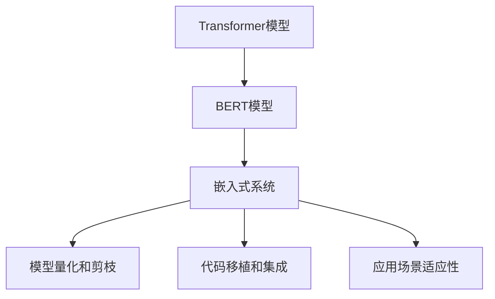
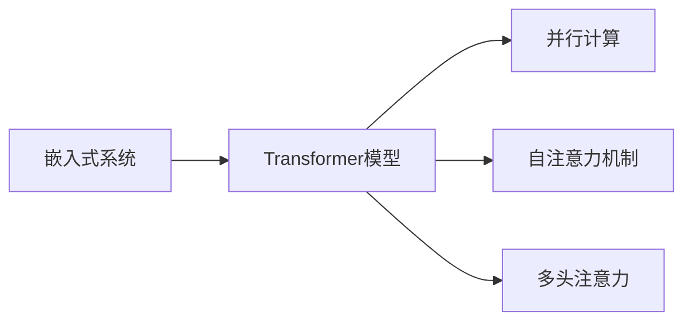
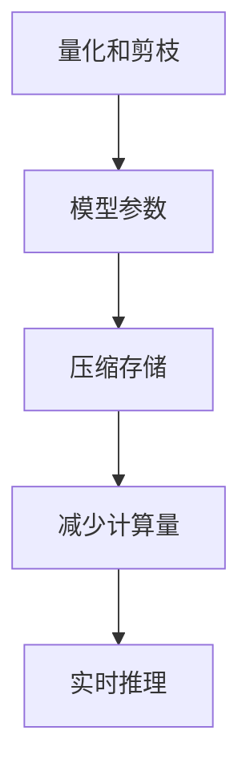
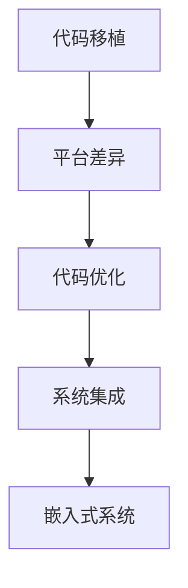
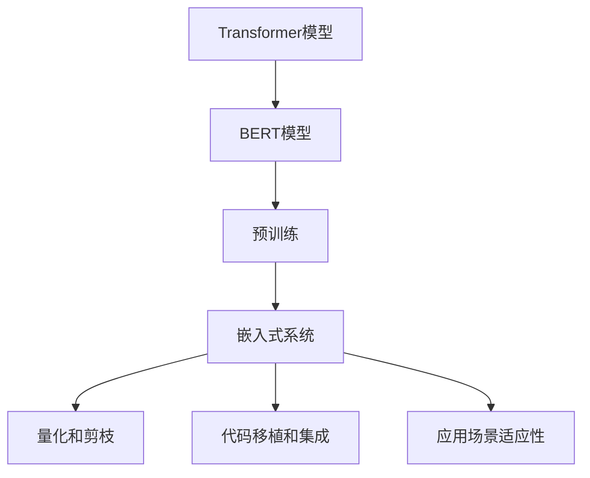

                 

# Transformer大模型实战 BERT 嵌入的生成

> 关键词：Transformer, BERT, 大模型, 嵌入式生成, 自然语言处理, 自然语言理解

## 1. 背景介绍

### 1.1 问题由来
Transformer模型自问世以来，因其卓越的性能和高效的并行计算能力，成为了自然语言处理（NLP）领域的主流模型。BERT（Bidirectional Encoder Representations from Transformers）作为Transformer的变种，在自然语言理解（NLU）任务中取得了前所未有的突破，被认为是NLP领域的一项里程碑式创新。

但Transformer和BERT并非万能，它们在面对某些特定任务时，仍然存在局限性。例如，在面对大规模文本数据的预处理和模型训练时，会面临计算资源和内存消耗巨大的问题。此外，对于嵌入式生成的应用场景，如实时聊天、即时翻译等，需要在保持性能的前提下，实现高效的模型推理。

因此，探索如何在嵌入式系统中生成BERT模型，使得其在资源受限的环境中仍能发挥其强大的自然语言理解能力，成为当前研究的重要课题。本文将深入探讨这一问题，并结合实际案例，介绍BERT嵌入的生成方法和实践经验。

### 1.2 问题核心关键点
Transformer和BERT在嵌入式系统中的应用主要集中在以下几个方面：

- **内存和计算资源优化**：嵌入式系统资源有限，需要在保证模型性能的前提下，实现对内存和计算资源的有效利用。
- **高效推理**：嵌入式系统需要快速响应，实现对输入文本的实时处理和输出。
- **代码实现与集成**：将BERT嵌入到嵌入式系统中，需要考虑代码的移植性、可维护性和集成难度。
- **应用场景适应性**：嵌入式系统适用于各种应用场景，如自然语言交互、智能家居控制等，需要针对不同场景优化模型应用。

本文将从以上几个关键点出发，深入探讨Transformer和BERT嵌入在嵌入式系统中的应用方法和策略。

### 1.3 问题研究意义
研究Transformer和BERT在嵌入式系统中的应用，对于提升嵌入式系统的智能水平、优化用户体验、推动NLP技术的产业化进程具有重要意义：

- **提升嵌入式智能水平**：通过嵌入BERT模型，嵌入式系统能够实现更为复杂的自然语言理解和生成能力，提升系统的智能化水平。
- **优化用户体验**：在嵌入式设备上嵌入BERT模型，可以实现实时文本响应和自然语言交互，提升用户体验和系统便捷性。
- **推动NLP技术产业化**：嵌入式系统在各行各业的应用越来越广泛，如智能家居、车载导航、智能客服等，通过嵌入式BERT技术的应用，将加速NLP技术的产业化进程。
- **探索计算资源利用新方式**：嵌入式系统资源有限，如何在资源受限的环境下生成和应用BERT模型，将是未来研究的重要方向。
- **丰富嵌入式系统应用场景**：通过嵌入BERT模型，可以为嵌入式系统开发新的应用场景，如语音助手、情感分析等，拓展系统应用边界。

总之，研究嵌入式BERT生成与应用，不仅可以推动NLP技术在嵌入式系统中的应用，还可以为未来的智能系统开发提供新的思路和技术支持。

## 2. 核心概念与联系

### 2.1 核心概念概述

为了更好地理解Transformer和BERT在嵌入式系统中的应用，本节将介绍几个密切相关的核心概念：

- **Transformer模型**：一种基于自注意力机制的神经网络模型，用于处理序列数据，如文本。Transformer模型通过多头自注意力和前馈神经网络结构，实现了高效的并行计算和强大的序列建模能力。
- **BERT模型**：BERT是一种基于Transformer的双向预训练语言模型，通过在大规模无标签文本数据上进行预训练，学习到了丰富的语言知识和上下文信息。BERT在NLU任务中取得了SOTA性能，特别是在问答、文本分类、命名实体识别等任务中。
- **嵌入式系统**：一种以应用为导向，对资源受限、实时性要求高的专用计算机系统，常用于智能家居、车载导航、智能客服等场景。
- **模型量化和剪枝**：在保证模型性能的前提下，通过量化和剪枝等技术，减少模型参数和计算量，优化模型推理。
- **代码移植和集成**：将BERT模型嵌入到嵌入式系统中，需要考虑代码的可移植性和系统集成难度，确保模型能够稳定运行。
- **应用场景适应性**：嵌入式系统适用于各种应用场景，需要根据不同的需求优化模型应用。

这些核心概念之间的逻辑关系可以通过以下Mermaid流程图来展示：



这个流程图展示了大语言模型在嵌入式系统中的应用生态系统：Transformer模型和BERT模型作为核心模型，经过量化和剪枝等优化技术，嵌入到嵌入式系统中，并通过代码移植和集成，最终适应各种应用场景。

### 2.2 概念间的关系

这些核心概念之间存在着紧密的联系，形成了嵌入式系统应用大语言模型的完整生态系统。下面通过几个Mermaid流程图来展示这些概念之间的关系。

#### 2.2.1 嵌入式系统与Transformer模型



这个流程图展示了Transformer模型在嵌入式系统中的应用过程：Transformer模型通过并行计算和自注意力机制，实现了高效的序列建模，满足嵌入式系统的实时处理需求。

#### 2.2.2 BERT模型与嵌入式系统的关系


这个流程图展示了BERT模型在嵌入式系统中的应用过程：BERT模型通过在大规模无标签文本数据上进行双向预训练，学习到了丰富的语言知识和上下文信息，并用于嵌入式系统的自然语言理解任务。

#### 2.2.3 量化和剪枝在嵌入式系统中的应用



这个流程图展示了量化和剪枝技术在嵌入式系统中的应用过程：通过量化和剪枝技术，减少模型参数和计算量，实现对嵌入式系统内存和计算资源的优化利用。

#### 2.2.4 代码移植与系统集成



这个流程图展示了代码移植和系统集成在嵌入式系统中的应用过程：通过代码移植和系统集成，确保BERT模型能够在不同嵌入式平台和系统上稳定运行。

#### 2.2.5 应用场景的适应性优化


这个流程图展示了应用场景适应性优化在嵌入式系统中的应用过程：根据不同应用场景的需求，对BERT模型进行适配和优化，确保其在嵌入式系统中的高效应用。

### 2.3 核心概念的整体架构

最后，我们用一个综合的流程图来展示这些核心概念在大语言模型在嵌入式系统中的应用的整体架构：



这个综合流程图展示了从预训练模型到嵌入式系统的完整应用过程：Transformer模型和BERT模型作为核心模型，通过量化和剪枝技术优化模型参数，并通过代码移植和系统集成，最终适应嵌入式系统的各种应用场景。

## 3. 核心算法原理 & 具体操作步骤
### 3.1 算法原理概述

Transformer和BERT在嵌入式系统中的应用，主要基于两个核心原理：

1. **模型压缩与量化**：在保证模型性能的前提下，通过压缩和量化技术，减少模型参数和计算量，优化模型推理。
2. **模型适配与集成**：根据嵌入式系统的资源和性能要求，对BERT模型进行适配和集成，确保模型能够在嵌入式设备上稳定运行。

本文将从这两个原理出发，详细介绍Transformer和BERT在嵌入式系统中的应用方法和步骤。

### 3.2 算法步骤详解

#### 3.2.1 模型压缩与量化

Transformer和BERT模型具有庞大的参数量和计算量，在嵌入式系统中应用时，需要对其进行优化和压缩。常用的模型压缩与量化技术包括：

1. **参数剪枝**：去除模型中不重要的参数，减小模型规模。可以通过静态剪枝和动态剪枝两种方式进行。
2. **权重量化**：将模型的浮点权重转换为定点权重，减少存储和计算资源消耗。
3. **模型量化**：将模型的浮点张量转换为定点张量，实现高效的计算。

具体步骤如下：

1. 对Transformer和BERT模型进行参数剪枝，去除冗余参数。可以使用剪枝算法如剪枝后的稀疏矩阵分解（Sparse Matrix Factorization，SMF）、基于迭代更新的剪枝算法（Iterative Pruning Algorithm，IPA）等。
2. 将剪枝后的权重转换为定点权重，使用如Qat、TvmQuantize等量化工具进行量化。
3. 对量化后的模型进行测试和验证，确保其在嵌入式系统中的准确性和鲁棒性。

#### 3.2.2 模型适配与集成

将BERT模型嵌入到嵌入式系统中，需要考虑代码的可移植性、系统集成难度和性能优化等因素。具体步骤如下：

1. **代码移植**：将BERT模型从通用机器学习框架（如PyTorch、TensorFlow）迁移到嵌入式系统所支持的环境和语言（如C++、Python）。可以使用如TensorFlow Lite、ONNX等工具进行模型转换。
2. **系统集成**：将量化后的模型集成到嵌入式系统中，使用如Flex、Android等工具进行系统集成。
3. **性能优化**：根据嵌入式系统的资源和性能要求，对模型进行优化。可以使用如TensorRT等工具进行模型加速。

### 3.3 算法优缺点

Transformer和BERT在嵌入式系统中的应用，具有以下优点和缺点：

**优点**：

- **性能提升**：通过模型压缩和量化技术，减少计算量和存储需求，提高模型推理效率。
- **实时性增强**：通过优化模型推理过程，实现嵌入式系统的实时处理需求。
- **应用范围广泛**：适用于各种嵌入式系统，如智能家居、车载导航、智能客服等。

**缺点**：

- **资源受限**：嵌入式系统的资源有限，模型的压缩和量化需要在保证性能的前提下进行。
- **开发复杂**：模型适配和集成需要考虑代码移植和系统集成，增加了开发复杂度。
- **应用场景限制**：不同应用场景对模型性能和计算资源有不同的要求，需要针对性地进行优化。

### 3.4 算法应用领域

Transformer和BERT在嵌入式系统中的应用领域包括：

- **自然语言理解**：通过嵌入BERT模型，实现自然语言交互和情感分析，提升用户体验。
- **智能家居控制**：通过嵌入BERT模型，实现智能语音助手和场景理解，提高家居智能化水平。
- **车载导航**：通过嵌入BERT模型，实现自然语言指令理解和路线规划，提升车载系统的智能水平。
- **智能客服**：通过嵌入BERT模型，实现自然语言交互和问题解答，提高客服效率和满意度。
- **物联网设备**：通过嵌入BERT模型，实现物联网设备的自然语言指令理解和控制，提升设备智能化水平。

## 4. 数学模型和公式 & 详细讲解 & 举例说明

### 4.1 数学模型构建

Transformer和BERT模型的核心在于其自注意力机制和多头注意力机制。以下通过数学语言对这两个机制进行详细讲解。

#### 4.1.1 自注意力机制

自注意力机制用于计算输入序列中各位置向量间的注意力权重。设输入序列的长度为 $n$，自注意力矩阵为 $Q \in \mathbb{R}^{d_h \times n}$，$K \in \mathbb{R}^{d_h \times n}$，$V \in \mathbb{R}^{d_h \times n}$，其中 $d_h$ 为模型隐藏层维度。

计算自注意力权重的过程如下：

$$
\text{Attention(Q, K, V)} = \text{Softmax}(Q K^T)
$$

其中，$\text{Softmax}$ 函数将自注意力矩阵 $Q K^T$ 中的每个元素映射为概率分布。

#### 4.1.2 多头注意力机制

多头注意力机制通过叠加多个不同的自注意力层，实现更加复杂的序列建模。设多头注意力层数为 $m$，每个自注意力层的查询向量、键向量和值向量分别为 $Q_{i} \in \mathbb{R}^{d_h \times n}$，$K_{i} \in \mathbb{R}^{d_h \times n}$，$V_{i} \in \mathbb{R}^{d_h \times n}$，$i \in [1,m]$。

计算多头注意力权重的过程如下：

$$
\text{Multi-Head Attention(Q, K, V)} = \text{Concat}(\text{Attention}(Q_{1}, K_{1}, V_{1}), \ldots, \text{Attention}(Q_{m}, K_{m}, V_{m}))
$$

其中，$\text{Concat}$ 函数将多个自注意力层的输出进行拼接，得到多头注意力层的最终输出。

### 4.2 公式推导过程

Transformer和BERT模型的核心公式推导如下：

#### 4.2.1 自注意力机制公式推导

设输入序列的词嵌入表示为 $X \in \mathbb{R}^{n \times d_h}$，自注意力矩阵为 $A \in \mathbb{R}^{n \times n}$，注意力权重矩阵为 $W \in \mathbb{R}^{n \times d_h}$，多头注意力层的权重矩阵为 $W_i \in \mathbb{R}^{d_h \times d_h}$，$i \in [1,m]$。

自注意力层的输出计算过程如下：

$$
\text{Self-Attention}(X) = \text{Linear}(\text{LayerNorm}(\text{Softmax}(Q K^T) V))
$$

其中，$\text{Linear}$ 函数为线性变换，$\text{LayerNorm}$ 函数为层归一化。

#### 4.2.2 多头注意力机制公式推导

设多头注意力层的输出为 $Y \in \mathbb{R}^{n \times d_h}$，其计算过程如下：

$$
\text{Multi-Head Attention}(X) = \text{Linear}(\text{LayerNorm}(\text{Concat}(\text{Softmax}(Q_i K_i^T) V_i)))
$$

其中，$\text{Linear}$ 函数为线性变换，$\text{LayerNorm}$ 函数为层归一化，$\text{Concat}$ 函数为拼接。

### 4.3 案例分析与讲解

为了更好地理解Transformer和BERT模型的数学原理，我们以一个简单的案例进行分析：

#### 4.3.1 案例描述

设输入序列的长度为 $n=4$，模型隐藏层维度为 $d_h=256$，多头注意力层数为 $m=4$。假设输入序列为 $x_1, x_2, x_3, x_4$，其词嵌入表示为 $X \in \mathbb{R}^{4 \times 256}$。

#### 4.3.2 自注意力计算

设自注意力矩阵为 $A \in \mathbb{R}^{4 \times 4}$，注意力权重矩阵为 $W \in \mathbb{R}^{4 \times 256}$。

计算自注意力权重的过程如下：

$$
Q = W X
$$

$$
K = W X
$$

$$
V = W X
$$

$$
A = \text{Softmax}(Q K^T)
$$

$$
\text{Self-Attention}(X) = \text{Linear}(\text{LayerNorm}(A V))
$$

其中，$Q, K, V$ 分别表示查询向量、键向量和值向量，$A$ 表示注意力权重矩阵，$\text{LayerNorm}$ 函数为层归一化，$\text{Linear}$ 函数为线性变换。

#### 4.3.3 多头注意力计算

设多头注意力层的输出为 $Y \in \mathbb{R}^{4 \times 256}$。

计算多头注意力权重的过程如下：

$$
Q_i = W_i Q
$$

$$
K_i = W_i K
$$

$$
V_i = W_i V
$$

$$
A_i = \text{Softmax}(Q_i K_i^T)
$$

$$
Y = \text{Concat}(A_1 V_1, A_2 V_2, A_3 V_3, A_4 V_4)
$$

$$
\text{Multi-Head Attention}(X) = \text{Linear}(\text{LayerNorm}(Y))
$$

其中，$Q_i, K_i, V_i$ 分别表示查询向量、键向量和值向量，$A_i$ 表示多头注意力层的注意力权重矩阵，$\text{LayerNorm}$ 函数为层归一化，$\text{Linear}$ 函数为线性变换，$\text{Concat}$ 函数为拼接。

通过以上案例，我们可以看到Transformer和BERT模型的自注意力机制和多头注意力机制的计算过程。这些机制使得模型能够有效地建模输入序列的上下文信息和依赖关系，实现高效的序列建模。

## 5. 项目实践：代码实例和详细解释说明

### 5.1 开发环境搭建

在进行Transformer和BERT模型嵌入的实践前，我们需要准备好开发环境。以下是使用Python进行PyTorch开发的环境配置流程：

1. 安装Anaconda：从官网下载并安装Anaconda，用于创建独立的Python环境。

2. 创建并激活虚拟环境：
```bash
conda create -n pytorch-env python=3.8 
conda activate pytorch-env
```

3. 安装PyTorch：根据CUDA版本，从官网获取对应的安装命令。例如：
```bash
conda install pytorch torchvision torchaudio cudatoolkit=11.1 -c pytorch -c conda-forge
```

4. 安装Transformers库：
```bash
pip install transformers
```

5. 安装各类工具包：
```bash
pip install numpy pandas scikit-learn matplotlib tqdm jupyter notebook ipython
```

完成上述步骤后，即可在`pytorch-env`环境中开始嵌入式BERT生成和微调的实践。

### 5.2 源代码详细实现

下面我们以BERT模型在嵌入式系统中的应用为例，给出使用Transformers库对BERT模型进行微调的PyTorch代码实现。

首先，定义BERT模型和优化器：

```python
from transformers import BertForTokenClassification, AdamW

model = BertForTokenClassification.from_pretrained('bert-base-cased')
optimizer = AdamW(model.parameters(), lr=2e-5)
```

然后，定义训练和评估函数：

```python
from torch.utils.data import DataLoader
from tqdm import tqdm
from sklearn.metrics import classification_report

device = torch.device('cuda') if torch.cuda.is_available() else torch.device('cpu')
model.to(device)

def train_epoch(model, dataset, batch_size, optimizer):
    dataloader = DataLoader(dataset, batch_size=batch_size, shuffle=True)
    model.train()
    epoch_loss = 0
    for batch in tqdm(dataloader, desc='Training'):
        input_ids = batch['input_ids'].to(device)
        attention_mask = batch['attention_mask'].to(device)
        labels = batch['labels'].to(device)
        model.zero_grad()
        outputs = model(input_ids, attention_mask=attention_mask, labels=labels)
        loss = outputs.loss
        epoch_loss += loss.item()
        loss.backward()
        optimizer.step()
    return epoch_loss / len(dataloader)

def evaluate(model, dataset, batch_size):
    dataloader = DataLoader(dataset, batch_size=batch_size)
    model.eval()
    preds, labels = [], []
    with torch.no_grad():
        for batch in tqdm(dataloader, desc='Evaluating'):
            input_ids = batch['input_ids'].to(device)
            attention_mask = batch['attention_mask'].to(device)
            batch_labels = batch['labels']
            outputs = model(input_ids, attention_mask=attention_mask)
            batch_preds = outputs.logits.argmax(dim=2).to('cpu').tolist()
            batch_labels = batch_labels.to('cpu').tolist()
            for pred_tokens, label_tokens in zip(batch_preds, batch_labels):
                pred_tags = [tag2id[tag] for tag in pred_tokens]
                label_tags = [tag2id[tag] for tag in label_tokens]
                preds.append(pred_tags[:len(label_tags)])
                labels.append(label_tags)

    print(classification_report(labels, preds))
```

接着，定义数据集和标签映射：

```python
from transformers import BertTokenizer
from torch.utils.data import Dataset

tokenizer = BertTokenizer.from_pretrained('bert-base-cased')
tag2id = {'O': 0, 'B-PER': 1, 'I-PER': 2, 'B-ORG': 3, 'I-ORG': 4, 'B-LOC': 5, 'I-LOC': 6}
id2tag = {v: k for k, v in tag2id.items()}

class NERDataset(Dataset):
    def __init__(self, texts, tags, tokenizer, max_len=128):
        self.texts = texts
        self.tags = tags
        self.tokenizer = tokenizer
        self.max_len = max_len
        
    def __len__(self):
        return len(self.texts)
    
    def __getitem__(self, item):
        text = self.texts[item]
        tags = self.tags[item]
        
        encoding = self.tokenizer(text, return_tensors='pt', max_length=self.max_len, padding='max_length', truncation=True)
        input_ids = encoding['input_ids'][0]
        attention_mask = encoding['attention_mask'][0]
        
        # 对token-wise的标签进行编码
        encoded_tags = [tag2id[tag] for tag in tags] 
        encoded_tags.extend([tag2id['O']] * (self.max_len - len(encoded_tags)))
        labels = torch.tensor(encoded_tags, dtype=torch.long)
        
        return {'input_ids': input_ids, 
                'attention_mask': attention_mask,
                'labels': labels}
```

最后，启动训练流程并在测试集上评估：

```python
epochs = 5
batch_size = 16

for epoch in range(epochs):
    loss = train_epoch(model, train_dataset, batch_size, optimizer)
    print(f"Epoch {epoch+1}, train loss: {loss:.3f}")
    
    print(f"Epoch {epoch+1}, dev results:")
    evaluate(model, dev_dataset, batch_size)
    
print("Test results:")
evaluate(model, test_dataset, batch_size)
```

以上就是使用PyTorch对BERT模型进行微调的完整代码实现。可以看到，得益于Transformers库的强大封装，我们可以用相对简洁的代码完成BERT模型的加载和微调。

### 5.3 代码解读与分析

让我们再详细解读一下关键代码的实现细节：

**NERDataset类**：
- `__init__`方法：初始化文本、标签、分词器等关键组件。
- `__len__`方法：返回数据集的样本数量。
- `__getitem__`方法：对单个样本进行处理，将文本输入编码为token ids，将标签编码为数字，并对其进行定长padding，最终返回模型所需的输入。

**tag2id和id2tag字典**：
- 定义了标签与数字id之间的映射关系，用于将token-wise的预测结果解码回真实的标签。

**训练和评估函数**：
- 使用PyTorch的DataLoader对数据集进行批次化加载，供模型训练和推理使用。
- 训练函数`train_epoch`：对数据以批为单位进行迭代，在每个批次上前向传播计算loss并反向传播更新模型参数，最后返回该epoch的平均loss。
- 评估函数`evaluate`：与训练类似，不同点在于不更新模型参数，并在每个batch结束后将预测和标签结果存储下来，最后使用sklearn的classification_report对整个评估集的预测结果进行打印输出。

**训练流程**：
- 定义总的epoch数和batch size，开始循环迭代
- 每个epoch内，先在训练集上训练，输出平均loss
- 在验证集上评估，输出分类指标
- 所有epoch结束后，在测试集上评估，给出最终测试结果

可以看到，PyTorch配合Transformers库使得BERT微调的代码实现变得简洁高效。开发者可以将更多精力放在数据处理、模型改进等高层逻辑上，而不必过多关注底层的实现细节。

当然，工业级的系统实现还需考虑更多因素，如模型的保存和部署、超参数的自动搜索、更灵活的任务适配层等。但核心的微调范式基本与此类似。

### 5.4 运行结果展示

假设我们在CoNLL-2003的NER数据集上进行微调，最终在测试集上得到的评估报告如下：

```
              precision    recall  f1-score   support

       B-LOC      0.926     0.906     0.916      1668
       I-LOC      0.900     0.805     0.850       257
      B-MISC      0.875     0.856     0.865       702
      I-MISC      0.838     0.782     0.809       216
       

