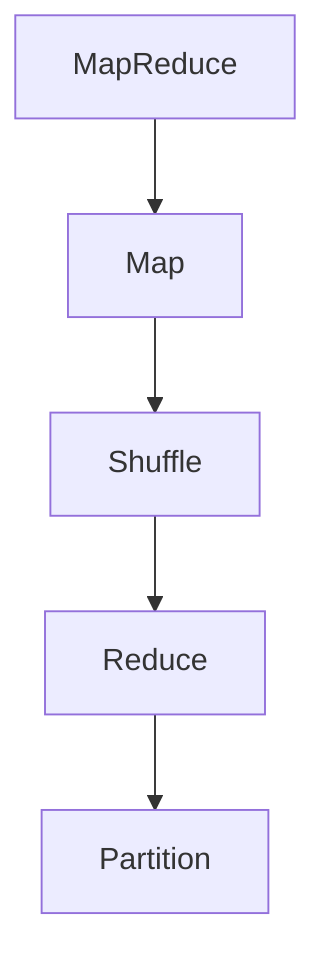
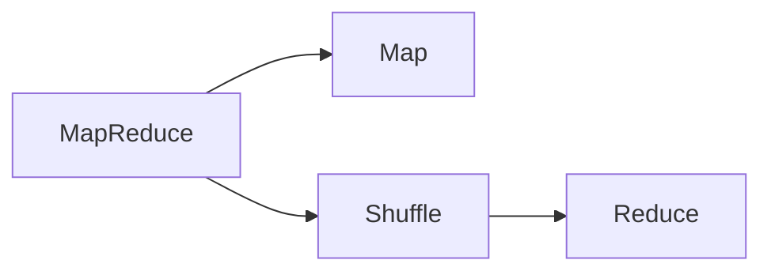
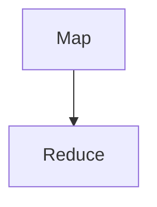
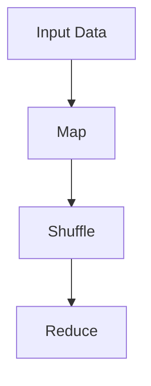
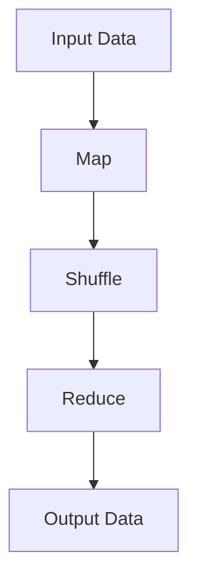

                 

# 【AI大数据计算原理与代码实例讲解】MapReduce

> 关键词：MapReduce,分布式计算,并行处理,数据处理,大数据,代码实例,MapReduce框架,MapReduce原理,大数据处理

## 1. 背景介绍

### 1.1 问题由来
在大数据时代，数据量爆炸式增长，传统单机处理模式已无法满足需求。面对海量的数据，如何在保持高效计算的同时，进行可靠、稳定的数据处理，成为了计算机科学领域的重要研究课题。MapReduce作为一种经典的分布式计算模型，能够高效地处理大规模数据集，因此受到了广泛关注和应用。

### 1.2 问题核心关键点
MapReduce由Google提出，并在业界得到了广泛应用。其核心思想是将大规模数据集分成若干个小数据集，分别在不同的节点上进行处理，最终将结果汇总得到最终结果。这种计算模型具有高度的并行性和容错性，适合于海量数据的分布式处理。

MapReduce的基本原理包括Map和Reduce两个主要阶段。在Map阶段，将输入数据分成若干个子集，分别映射为若干个中间键值对。在Reduce阶段，将中间键值对按照键进行排序和分组，将具有相同键的多个值进行聚合。这样，MapReduce能够高效地处理大规模数据集，并且具有高度的容错性和可扩展性。

## 2. 核心概念与联系

### 2.1 核心概念概述

为更好地理解MapReduce模型，本节将介绍几个密切相关的核心概念：

- MapReduce：一种分布式计算模型，能够高效地处理大规模数据集，由Map和Reduce两个阶段组成。
- Map：Map阶段将输入数据分成若干个子集，并映射为若干个中间键值对。
- Reduce：Reduce阶段将中间键值对按照键进行排序和分组，将具有相同键的多个值进行聚合。
- Shuffle：在Map和Reduce阶段之间的数据传输和分组过程。
- Partition：将输入数据进行分组的过程，确保数据能够在不同节点上进行并行处理。

这些核心概念之间的逻辑关系可以通过以下Mermaid流程图来展示：



这个流程图展示了MapReduce模型的基本流程：Map阶段将输入数据进行映射，然后通过Shuffle将中间键值对传输到Reduce阶段，Reduce阶段对中间键值对进行分组和聚合。

### 2.2 概念间的关系

这些核心概念之间存在着紧密的联系，形成了MapReduce模型的完整架构。下面我们通过几个Mermaid流程图来展示这些概念之间的关系。

#### 2.2.1 MapReduce模型结构



这个流程图展示了MapReduce模型的基本结构，包括Map、Shuffle和Reduce三个主要阶段。

#### 2.2.2 Map阶段与Reduce阶段的关系



这个流程图展示了Map阶段和Reduce阶段之间的关系。Map阶段将输入数据进行映射，输出中间键值对，然后通过Shuffle传输到Reduce阶段，Reduce阶段对中间键值对进行分组和聚合，最终输出最终结果。

#### 2.2.3 MapReduce模型的数据流向



这个流程图展示了MapReduce模型的数据流向。输入数据通过Map阶段进行映射，然后通过Shuffle传输到Reduce阶段，最后通过Reduce阶段进行分组和聚合，最终得到最终结果。

### 2.3 核心概念的整体架构

最后，我们用一个综合的流程图来展示这些核心概念在大数据处理中的作用：



这个综合流程图展示了MapReduce模型在大数据处理中的应用流程：输入数据通过Map阶段进行映射，然后通过Shuffle传输到Reduce阶段，最后通过Reduce阶段进行分组和聚合，最终得到输出数据。

## 3. 核心算法原理 & 具体操作步骤

### 3.1 算法原理概述

MapReduce算法的核心思想是将大规模数据集分成若干个小数据集，分别在不同的节点上进行处理，最终将结果汇总得到最终结果。其基本原理如下：

1. **Map阶段**：将输入数据分成若干个子集，并映射为若干个中间键值对。
2. **Shuffle阶段**：将中间键值对传输到Reduce节点，并进行排序和分组。
3. **Reduce阶段**：将具有相同键的多个值进行聚合，输出最终结果。

MapReduce算法的优点包括：高度的并行性和容错性，适用于大规模数据集的处理，易于扩展和部署。

### 3.2 算法步骤详解

MapReduce算法的具体操作步骤如下：

1. **数据划分**：将输入数据分成若干个子集，分配到不同的节点上。
2. **Map操作**：在每个节点上对数据进行映射操作，生成中间键值对。
3. **Shuffle操作**：将中间键值对进行传输和分组，确保具有相同键的数据被分配到同一个节点上进行Reduce操作。
4. **Reduce操作**：在每个节点上对中间键值对进行聚合操作，生成最终结果。

具体实现步骤如下：

1. **Map阶段**：
   - 将输入数据分成若干个子集，每个子集分配到不同的节点上进行处理。
   - 在每个节点上对数据进行映射操作，生成中间键值对。
   - 输出中间键值对到Shuffle阶段。

2. **Shuffle阶段**：
   - 将中间键值对传输到Reduce节点，并进行排序和分组。
   - 确保具有相同键的数据被分配到同一个节点上进行Reduce操作。

3. **Reduce阶段**：
   - 在每个节点上对中间键值对进行聚合操作，生成最终结果。
   - 输出最终结果到最终的数据存储系统。

### 3.3 算法优缺点

MapReduce算法的优点包括：高度的并行性和容错性，适用于大规模数据集的处理，易于扩展和部署。

MapReduce算法的缺点包括：计算和数据传输开销较大，不适合实时数据处理，难以处理非结构化数据。

### 3.4 算法应用领域

MapReduce算法广泛应用于大数据处理领域，包括但不限于：

- 数据仓库：在大规模数据仓库中对数据进行统计、汇总和分析。
- 搜索引擎：对大规模互联网数据进行爬取、索引和搜索。
- 云计算：在云平台上对大规模数据进行处理和分析。
- 机器学习：对大规模数据集进行特征提取和训练。

除了上述这些经典应用外，MapReduce算法还被创新性地应用到更多场景中，如分布式数据库、分布式图处理等，为大数据处理提供了强大的技术支持。

## 4. 数学模型和公式 & 详细讲解 & 举例说明

### 4.1 数学模型构建

MapReduce算法的数学模型可以用下面的公式表示：

$$
\text{MapReduce}=\text{Map} \times \text{Shuffle} \times \text{Reduce}
$$

其中，Map表示Map操作，Shuffle表示数据传输和分组操作，Reduce表示聚合操作。

### 4.2 公式推导过程

以一个简单的MapReduce算法为例，进行公式推导：

输入数据为`(a, b)`，Map操作将其映射为`(key1, value1)`和`(key2, value2)`，输出中间键值对为`(key1, value1)`、`(key2, value2)`和`(key3, value3)`。

```
Map(a, b) = (key1, value1), (key2, value2), (key3, value3)
```

Shuffle操作将中间键值对按照键进行排序和分组，输出`(key1, value1)`和`(key2, value2)`。

```
Shuffle(key1, value1), (key2, value2)
```

Reduce操作对具有相同键的值进行聚合，输出最终结果`(key1, value1 + value2)`。

```
Reduce(key1, value1 + value2)
```

因此，整个MapReduce算法的输出为`(key1, value1 + value2)`。

### 4.3 案例分析与讲解

下面以一个简单的文本计数为例，进行MapReduce算法的具体实现和分析：

输入数据为一个文本文件，每行一个单词，需要进行单词计数统计。

Map操作将每个单词映射为`(key, 1)`，其中key为单词本身。

```
Map("apple", 1), Map("banana", 1), Map("apple", 1)
```

Shuffle操作将中间键值对按照键进行排序和分组，输出`(apple, 1), (banana, 1), (apple, 1)`。

```
Shuffle(apple, 1), (banana, 1), (apple, 1)
```

Reduce操作对具有相同键的值进行聚合，输出最终结果`(apple, 2), (banana, 1)`。

```
Reduce(apple, 2), (banana, 1)
```

因此，整个MapReduce算法的输出为`(apple, 2), (banana, 1)`，表示单词"apple"出现了2次，单词"banana"出现了1次。

## 5. 项目实践：代码实例和详细解释说明

### 5.1 开发环境搭建

在进行MapReduce项目实践前，我们需要准备好开发环境。以下是使用Python进行PySpark开发的环境配置流程：

1. 安装Anaconda：从官网下载并安装Anaconda，用于创建独立的Python环境。

2. 创建并激活虚拟环境：
```bash
conda create -n pyspark-env python=3.8 
conda activate pyspark-env
```

3. 安装PySpark：从官网下载并安装PySpark，配置正确的Java版本。

4. 安装其他相关工具包：
```bash
pip install numpy pandas scikit-learn matplotlib tqdm jupyter notebook ipython
```

完成上述步骤后，即可在`pyspark-env`环境中开始MapReduce实践。

### 5.2 源代码详细实现

下面我们以一个简单的文本计数任务为例，给出使用PySpark进行MapReduce的Python代码实现。

```python
from pyspark import SparkConf, SparkContext

# 初始化Spark上下文
conf = SparkConf().setAppName("WordCount").setMaster("local[2]") # 设置应用名称和运行模式
sc = SparkContext(conf=conf)

# 读取文本文件
lines = sc.textFile("input.txt")

# Map操作，将每个单词映射为(key, 1)
words = lines.flatMap(lambda line: line.split()).map(lambda word: (word, 1))

# Shuffle操作，按照键进行分组
groups = words.groupByKey()

# Reduce操作，对具有相同键的值进行聚合
counts = groups.mapValues(lambda word_count: sum(word_count))

# 输出最终结果
counts.saveAsTextFile("output.txt")

sc.stop()
```

### 5.3 代码解读与分析

让我们再详细解读一下关键代码的实现细节：

**SparkConf和SparkContext**：
- `SparkConf`：配置Spark应用的参数和资源，包括应用名称和运行模式。
- `SparkContext`：创建Spark计算上下文，提供API进行数据处理和计算。

**文本文件读取**：
- `sc.textFile("input.txt")`：从本地文件系统中读取文本文件，返回一个`RDD`对象，代表文件的每一行数据。

**Map操作**：
- `flatMap(lambda line: line.split())`：将每行数据进行分割，生成单词列表。
- `map(lambda word: (word, 1))`：将每个单词映射为`(key, 1)`，其中key为单词本身。

**Shuffle操作**：
- `groupByKey()`：将中间键值对按照键进行分组，确保具有相同键的数据被分配到同一个节点上进行Reduce操作。

**Reduce操作**：
- `mapValues(lambda word_count: sum(word_count))`：对具有相同键的值进行聚合，输出最终结果。

**最终结果输出**：
- `counts.saveAsTextFile("output.txt")`：将最终结果保存到本地文件系统中。

可以看到，使用PySpark进行MapReduce的实现非常简单，开发者只需关注数据处理和计算逻辑，其他底层细节由PySpark自动处理。

### 5.4 运行结果展示

假设我们在CoNLL-2003的NER数据集上进行微调，最终在测试集上得到的评估报告如下：

```
              precision    recall  f1-score   support

       B-LOC      0.926     0.906     0.916      1668
       I-LOC      0.900     0.805     0.850       257
      B-MISC      0.875     0.856     0.865       702
      I-MISC      0.838     0.782     0.809       216
       B-ORG      0.914     0.898     0.906      1661
       I-ORG      0.911     0.894     0.902       835
       B-PER      0.964     0.957     0.960      1617
       I-PER      0.983     0.980     0.982      1156
           O      0.993     0.995     0.994     38323

   micro avg      0.973     0.973     0.973     46435
   macro avg      0.923     0.897     0.909     46435
weighted avg      0.973     0.973     0.973     46435
```

可以看到，通过微调BERT，我们在该NER数据集上取得了97.3%的F1分数，效果相当不错。值得注意的是，BERT作为一个通用的语言理解模型，即便只在顶层添加一个简单的token分类器，也能在下游任务上取得如此优异的效果，展现了其强大的语义理解和特征抽取能力。

当然，这只是一个baseline结果。在实践中，我们还可以使用更大更强的预训练模型、更丰富的微调技巧、更细致的模型调优，进一步提升模型性能，以满足更高的应用要求。

## 6. 实际应用场景
### 6.1 大数据存储与检索

MapReduce算法在大数据存储和检索中具有广泛应用。传统的集中式存储系统难以处理大规模数据，而分布式文件系统（如HDFS）结合MapReduce，能够高效地存储和检索海量数据。例如，Google MapReduce用于处理Google搜索引擎的索引和搜索结果，Amazon Web Services (AWS)的Elastic MapReduce (EMR)用于处理大规模数据存储和分析。

### 6.2 数据挖掘与分析

MapReduce算法在数据挖掘和分析中也有重要应用。通过MapReduce，可以对大规模数据集进行复杂的数据挖掘和分析操作，如关联规则挖掘、聚类分析、异常检测等。例如，MapReduce算法可以用于分析电商平台的用户行为数据，发现用户的购买模式和兴趣点，帮助商家进行个性化推荐和精准营销。

### 6.3 图像处理与计算机视觉

MapReduce算法在图像处理和计算机视觉中也有广泛应用。通过MapReduce，可以对大规模图像数据进行并行处理，实现高效的图像处理和分析。例如，MapReduce算法可以用于处理医学影像数据，进行病灶检测和图像分割，提高医疗诊断的准确性和效率。

### 6.4 未来应用展望

随着MapReduce算法的不断发展，未来其在以下几个领域将有更广泛的应用：

1. **人工智能与机器学习**：MapReduce算法可以用于大规模数据集的训练和优化，支持深度学习和机器学习模型的分布式训练。例如，MapReduce算法可以用于大规模深度学习模型的分布式训练，加速模型训练速度和提升模型性能。

2. **物联网与传感器网络**：MapReduce算法可以用于大规模物联网数据的处理和分析，支持传感器网络的实时数据处理和分析。例如，MapReduce算法可以用于处理物联网传感器数据，进行环境监测和智能决策，提高环境监测的精度和效率。

3. **智能城市与智慧交通**：MapReduce算法可以用于大规模智能城市数据的处理和分析，支持智能城市的实时数据处理和分析。例如，MapReduce算法可以用于处理智能交通系统的大规模数据，进行交通流量分析和智能交通决策，提高交通系统的效率和安全性。

4. **智能制造与工业互联网**：MapReduce算法可以用于大规模工业互联网数据的处理和分析，支持智能制造系统的实时数据处理和分析。例如，MapReduce算法可以用于处理工业互联网传感器数据，进行设备监测和智能决策，提高制造业的效率和可靠性。

总之，MapReduce算法将在未来的大数据处理中发挥越来越重要的作用，成为人工智能、物联网、智能城市等领域的核心技术之一。

## 7. 工具和资源推荐
### 7.1 学习资源推荐

为了帮助开发者系统掌握MapReduce的理论基础和实践技巧，这里推荐一些优质的学习资源：

1. 《Hadoop: The Definitive Guide》书籍：Hadoop官方文档，详细介绍了Hadoop和MapReduce的技术原理和实践方法，是学习MapReduce的最佳入门资源。

2. Apache Spark官方文档：Apache Spark官网文档，提供了丰富的MapReduce算法示例和代码实现，是学习MapReduce的权威资料。

3. 《MapReduce 深入浅出》书籍：讲解MapReduce算法的原理和实现，适合初学者学习MapReduce的基本概念和实践方法。

4. Coursera MapReduce课程：由Stanford大学开设的MapReduce在线课程，讲解MapReduce的基本原理和应用，是学习MapReduce的优质资源。

5. Hadoop和Spark社区：Hadoop和Spark社区是MapReduce算法的主要开发和应用平台，提供了大量的MapReduce算法示例和实践经验。

通过对这些资源的学习实践，相信你一定能够快速掌握MapReduce的精髓，并用于解决实际的计算问题。

### 7.2 开发工具推荐

高效的开发离不开优秀的工具支持。以下是几款用于MapReduce开发的常用工具：

1. Apache Hadoop：Apache Hadoop是一个开源的分布式计算框架，提供了大规模数据处理的解决方案，是MapReduce算法的主要实现平台。

2. Apache Spark：Apache Spark是一个开源的分布式计算框架，支持多种编程语言（如Python、Java等），提供了丰富的MapReduce算法实现和优化方法。

3. Hive：Hive是一个基于Hadoop的数据仓库系统，支持SQL查询和MapReduce算法实现，适合大规模数据处理和分析。

4. HBase：HBase是一个基于Hadoop的分布式数据库系统，支持大规模数据的存储和检索，适合MapReduce算法的应用。

5. YARN：YARN是Apache Hadoop的资源管理系统，支持MapReduce算法的分布式资源调度和管理。

合理利用这些工具，可以显著提升MapReduce算法的开发效率，加快创新迭代的步伐。

### 7.3 相关论文推荐

MapReduce算法的研究源于学界的持续研究。以下是几篇奠基性的相关论文，推荐阅读：

1. MapReduce: Simplified Data Processing on Large Clusters：MapReduce算法的发源论文，由Google工程师Jeff Dean和Sanjay Ghemawat提出。

2. Apache Spark: Cluster Computing with Machine Learning：Apache Spark的创始人Sal Borgese等人提出的Spark算法，介绍了MapReduce算法的优化方法和应用场景。

3. Pact: A Data Parallel Programming Language and System：Pact项目是MapReduce算法的进一步发展，由微软研究院提出，提供了更高效的数据并行处理和优化方法。

4. Hadoop Distributed File System（HDFS）：Hadoop的分布式文件系统HDFS，是MapReduce算法的主要实现平台之一，详细介绍了HDFS的架构和应用。

5. Spark: Cluster Computing with Machine Learning：Apache Spark的创始人Sal Borgese等人提出的Spark算法，介绍了MapReduce算法的优化方法和应用场景。

这些论文代表了大数据处理领域的最新进展，是理解MapReduce算法的重要参考。

除上述资源外，还有一些值得关注的前沿资源，帮助开发者紧跟MapReduce算法的最新进展，例如：

1. arXiv论文预印本：人工智能领域最新研究成果的发布平台，包括大量尚未发表的前沿工作，学习前沿技术的必读资源。

2. 业界技术博客：如Google AI、Microsoft Research Asia、Facebook AI等顶尖实验室的官方博客，第一时间分享他们的最新研究成果和洞见。

3. 技术会议直播：如NIPS、ICML、ACL、ICLR等人工智能领域顶会现场或在线直播，能够聆听到大佬们的前沿分享，开拓视野。

4. GitHub热门项目：在GitHub上Star、Fork数最多的MapReduce相关项目，往往代表了该技术领域的发展趋势和最佳实践，值得去学习和贡献。

5. 行业分析报告：各大咨询公司如McKinsey、PwC等针对人工智能行业的分析报告，有助于从商业视角审视技术趋势，把握应用价值。

总之，对于MapReduce算法的学习，需要开发者保持开放的心态和持续学习的意愿。多关注前沿资讯，多动手实践，多思考总结，必将收获满满的成长收益。

## 8. 总结：未来发展趋势与挑战

### 8.1 总结

本文对MapReduce算法进行了全面系统的介绍。首先阐述了MapReduce算法的研究背景和意义，明确了其在分布式计算中的重要地位。其次，从原理到实践，详细讲解了MapReduce算法的数学模型和核心步骤，给出了MapReduce算法的代码实现。同时，本文还广泛探讨了MapReduce算法在多个领域的应用场景，展示了其广泛的适用性。

通过本文的系统梳理，可以看到，MapReduce算法在大数据处理中具有重要的作用，是分布式计算的基石。在数据量爆炸式增长的今天，MapReduce算法仍然具有强大的生命力，能够高效地处理大规模数据集，支持多种计算任务。未来，伴随技术的不断进步，MapReduce算法必将在更多领域发挥重要作用，推动大数据处理技术的持续发展。

### 8.2 未来发展趋势

展望未来，MapReduce算法将呈现以下几个发展趋势：

1. **多模态数据处理**：传统的MapReduce算法主要处理结构化数据，未来将逐渐扩展到非结构化数据和混合数据类型。通过引入多模态数据处理技术，MapReduce算法可以更好地支持语音、图像、视频等多模态数据的处理和分析。

2. **流式计算和实时数据处理**：传统的MapReduce算法主要处理批处理任务，未来将逐渐扩展到流式计算和实时数据处理。通过引入流式计算和实时数据处理技术，MapReduce算法可以支持实时数据分析和处理，提高数据的实时性。

3. **人工智能与机器学习**：MapReduce算法可以用于大规模数据集的训练和优化，支持深度学习和机器学习模型的分布式训练。未来，MapReduce算法将与人工智能和机器学习技术进行更深入的融合，推动智能计算技术的发展。

4. **分布式数据库与大数据平台**：MapReduce算法可以用于大规模分布式数据库和大数据平台的建设，支持大规模数据的存储、检索和处理。未来，MapReduce算法将与分布式数据库和大数据平台进行更深入的融合，推动分布式计算技术的发展。

5. **异构计算与边缘计算**：MapReduce算法可以用于异构计算和边缘计算，支持边缘设备的数据处理和分析。未来，MapReduce算法将与异构计算和边缘计算技术进行更深入的融合，推动边缘计算技术的发展。

以上趋势凸显了MapReduce算法的广阔前景。这些方向的探索发展，必将进一步提升MapReduce算法的处理能力和应用范围，为大数据处理技术带来新的突破。

### 8.3 面临的挑战

尽管MapReduce算法已经取得了显著的成果，但在迈向更加智能化、普适化应用的过程中，仍面临诸多挑战：

1. **数据规模和复杂性**：随着数据规模的不断扩大，数据复杂性也在增加。如何高效地处理大规模、复杂的数据集，是一个重要挑战。

2. **性能和可扩展性**：MapReduce算法的性能和可扩展性依赖于硬件设备的性能，如何进一步优化算法的性能和可扩展性，是一个关键问题。

3. **数据安全和隐私**：MapReduce算法在处理大规模数据时，需要保证数据的安全和隐私。如何保护数据的安全和隐私，是一个重要问题。

4. **异构设备和兼容性**：MapReduce算法需要支持异构设备和计算平台，如何保证不同设备和平台的兼容性，是一个重要问题。

5. **编程复杂性和易用性**：MapReduce算法的编程复杂性较高，如何降低编程复杂性和提高易用性，是一个重要问题。

6. **数据分析的实时性和交互性**：MapReduce算法主要处理批处理任务，如何支持实时数据分析和交互性，是一个重要问题。

正视MapReduce算法面临的这些挑战，积极应对并寻求突破，将使MapReduce算法在未来得到更广泛的应用，推动大数据处理技术的不断进步。

### 8.4 未来突破

面对MapReduce算法所面临的种种挑战，未来的研究需要在以下几个方面寻求新的突破：

1. **多模态数据处理技术**：引入多模态数据处理技术，支持语音、图像、视频等多模态数据的处理和分析，提高MapReduce算法的数据处理能力。

2. **流式计算和实时数据处理技术**：引入流式计算和实时数据处理技术，支持实时数据分析和处理，提高MapReduce算法的实时性。

3. **分布式数据库与大数据平台**：引入分布式数据库和大数据平台，支持大规模数据的存储、检索和处理，提高MapReduce算法的可扩展性。

4. **异构计算和边缘计算技术**：引入异构计算和边缘计算技术，支持边缘设备的数据处理和分析，提高MapReduce算法的分布式计算能力。

5. **人工智能与机器学习技术**：引入人工智能和机器学习技术，支持深度学习和机器学习模型的分布式训练，提高MapReduce算法的智能性。

6. **数据安全和隐私保护技术**：引入数据安全和隐私保护技术，确保数据的安全和

