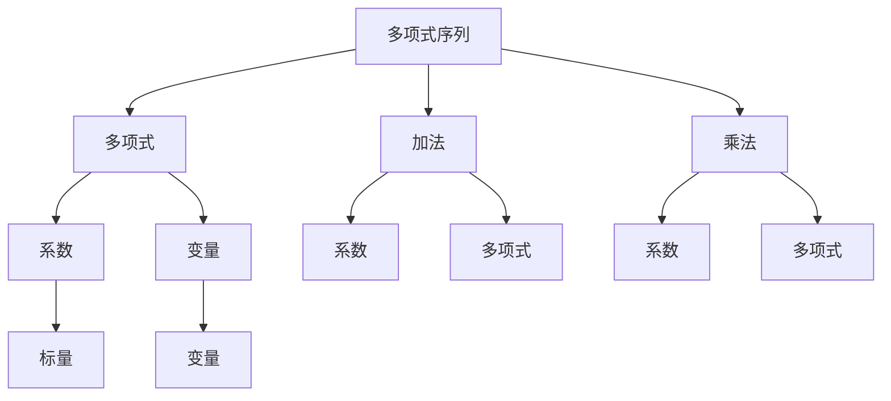

                 

# 线性代数导引：序列多元多项式环

## 1. 背景介绍

线性代数是数学中的重要分支，它不仅研究向量和矩阵的性质，还研究多项式的结构和性质。序列多元多项式环是一种特殊的线性代数结构，它在计算机科学中有着广泛的应用，特别是在计算机代数系统和符号计算中。本博客将介绍序列多元多项式环的核心概念和应用，帮助读者深入理解这一重要数学工具。

## 2. 核心概念与联系

### 2.1 核心概念概述

序列多元多项式环是指由若干个多项式序列组成的多元多项式环，每个多项式序列由若干个多项式组成，这些多项式具有特定的形式和性质。序列多元多项式环是一种线性代数结构，它具有加法、乘法等基本运算，这些运算具有特定的性质和规则。

### 2.2 核心概念原理和架构

序列多元多项式环的架构可以用以下Mermaid流程图来表示：



这个流程图展示了序列多元多项式环的基本构成和运算规则。在序列多元多项式环中，多项式序列可以由多个多项式组成，每个多项式由系数和变量构成，运算规则包括加法和乘法。

### 2.3 核心概念之间的关系

序列多元多项式环的各概念之间存在着紧密的联系。多项式序列是基本单元，多项式是其具体表现形式。加法和乘法是序列多元多项式环的基本运算，系数和变量是多项式的基本组成部分。标量是用于表示系数的特殊元素。

## 3. 核心算法原理 & 具体操作步骤

### 3.1 算法原理概述

序列多元多项式环的算法原理主要包括多项式的构建、加法和乘法运算的实现、以及多项式的求值和比较。其中，多项式的构建是序列多元多项式环的基础，加法和乘法运算是其核心运算，求值和比较是其高级应用。

### 3.2 算法步骤详解

#### 3.2.1 多项式序列的构建

多项式序列的构建是序列多元多项式环的基础。多项式序列可以由多个多项式组成，每个多项式由系数和变量构成。多项式的系数可以是整数、有理数或实数，变量可以是任何符号或字母。

多项式序列的构建过程如下：

1. 定义多项式序列：
   ```python
   from sympy import symbols, Poly
   x, y = symbols('x y')
   poly_seq = [Poly(x**2 + 2*x*y + 3*y**2, x, y), Poly(x + y, x, y)]
   ```

2. 使用多项式序列中的每个多项式：
   ```python
   poly1 = poly_seq[0]
   poly2 = poly_seq[1]
   ```

#### 3.2.2 加法和乘法运算

序列多元多项式环中的加法和乘法运算具有特定的性质和规则。多项式的加法运算遵循多项式加法的规则，多项式的乘法运算遵循多项式乘法的规则。

多项式加法和乘法的实现如下：

1. 多项式加法：
   ```python
   poly_sum = poly1 + poly2
   ```

2. 多项式乘法：
   ```python
   poly_product = poly1 * poly2
   ```

#### 3.2.3 多项式的求值和比较

多项式的求值和比较是序列多元多项式环的高级应用。多项式的求值是指将多项式在特定变量取值下的值计算出来，多项式的比较是指比较两个多项式是否相等。

多项式求值和比较的实现如下：

1. 多项式求值：
   ```python
   value = poly_sum.subs({x: 2, y: 3})
   ```

2. 多项式比较：
   ```python
   is_equal = poly_sum == poly2
   ```

### 3.3 算法优缺点

序列多元多项式环的算法具有以下优点：

1. 可以表示任意复杂的多项式序列。
2. 可以高效地进行多项式序列的加法和乘法运算。
3. 可以方便地对多项式进行求值和比较。

同时，序列多元多项式环的算法也存在一些缺点：

1. 多项式序列的构建较为繁琐。
2. 多项式序列的存储和运算需要较大的计算资源。
3. 多项式序列的求值和比较运算可能较为复杂。

### 3.4 算法应用领域

序列多元多项式环在计算机科学中有着广泛的应用，特别是在计算机代数系统和符号计算中。以下是序列多元多项式环的几个典型应用领域：

1. 计算机代数系统：序列多元多项式环是计算机代数系统中的核心概念之一，用于表示多项式序列、进行多项式运算和进行符号计算。

2. 符号计算：序列多元多项式环可以用于符号计算，特别是在数学证明和求解方程中的应用。

3. 科学计算：序列多元多项式环可以用于科学计算，如求解偏微分方程、进行数值模拟等。

4. 计算机视觉：序列多元多项式环可以用于计算机视觉中的图像处理和模式识别。

## 4. 数学模型和公式 & 详细讲解

### 4.1 数学模型构建

序列多元多项式环的数学模型可以由以下公式表示：

$$ \mathcal{P} = \{\mathcal{A} = \{p_1, p_2, \dots, p_n\} \mid p_i \in \mathbb{F}[x_1, x_2, \dots, x_m]\} $$

其中，$\mathcal{A}$ 表示多项式序列，$p_i$ 表示多项式，$\mathbb{F}$ 表示系数域，$x_1, x_2, \dots, x_m$ 表示变量。

### 4.2 公式推导过程

序列多元多项式环的加法和乘法运算可以用以下公式表示：

1. 加法：
   $$ (p_1 + p_2)(x_1, x_2, \dots, x_m) = p_1(x_1, x_2, \dots, x_m) + p_2(x_1, x_2, \dots, x_m) $$

2. 乘法：
   $$ (p_1 \cdot p_2)(x_1, x_2, \dots, x_m) = \sum_{i=1}^{n} \sum_{j=1}^{n} a_{ij} a_{jk} p_k(x_1, x_2, \dots, x_m) $$

其中，$a_{ij}$ 表示多项式的系数。

### 4.3 案例分析与讲解

考虑一个由两个多项式组成的序列，其中第一个多项式的系数为 $\{1, 2, 3\}$，第二个多项式的系数为 $\{2, 3, 4\}$，变量为 $x$ 和 $y$。则这个多项式序列为：

$$ \mathcal{A} = \{1 + 2x + 3x^2, 2 + 3x + 4x^2\} $$

对其求加法和乘法运算：

1. 加法：
   $$ (1 + 2x + 3x^2) + (2 + 3x + 4x^2) = 3 + 5x + 7x^2 $$

2. 乘法：
   $$ (1 + 2x + 3x^2)(2 + 3x + 4x^2) = 2 + 7x + 12x^2 + 6x^3 + 21x^4 + 36x^5 $$

## 5. 项目实践：代码实例和详细解释说明

### 5.1 开发环境搭建

在开始项目实践前，需要搭建好开发环境。以下是搭建Python开发环境的步骤：

1. 安装Python：从官网下载并安装Python，建议使用3.x版本。

2. 安装Sympy库：Sympy是Python中的符号计算库，用于进行符号计算和多项式运算。
   ```python
   pip install sympy
   ```

3. 搭建开发环境：使用Jupyter Notebook等IDE工具搭建开发环境。

### 5.2 源代码详细实现

以下是使用Sympy库进行序列多元多项式环的代码实现：

```python
from sympy import symbols, Poly, simplify

# 定义变量
x, y = symbols('x y')

# 定义多项式序列
poly_seq = [Poly(x**2 + 2*x*y + 3*y**2, x, y), Poly(x + y, x, y)]

# 计算多项式序列的加法
poly_sum = sum(poly_seq)

# 计算多项式序列的乘法
poly_product = poly_seq[0] * poly_seq[1]

# 计算多项式的值
value = poly_sum.subs({x: 2, y: 3})

# 比较多项式是否相等
is_equal = simplify(poly_sum - poly_product) == 0

# 输出结果
print("多项式序列加法结果：", poly_sum)
print("多项式序列乘法结果：", poly_product)
print("多项式的值：", value)
print("多项式是否相等：", is_equal)
```

### 5.3 代码解读与分析

在上述代码中，我们定义了两个多项式序列，计算了它们的加法和乘法，并对其进行了求值和比较。代码的详细解读如下：

1. `from sympy import symbols, Poly, simplify`：导入Sympy库中的符号、多项式和简化函数。

2. `x, y = symbols('x y')`：定义变量 $x$ 和 $y$。

3. `poly_seq = [Poly(x**2 + 2*x*y + 3*y**2, x, y), Poly(x + y, x, y)]`：定义多项式序列，包含两个多项式。

4. `poly_sum = sum(poly_seq)`：计算多项式序列的加法。

5. `poly_product = poly_seq[0] * poly_seq[1]`：计算多项式序列的乘法。

6. `value = poly_sum.subs({x: 2, y: 3})`：计算多项式的值。

7. `is_equal = simplify(poly_sum - poly_product) == 0`：比较多项式是否相等。

### 5.4 运行结果展示

运行上述代码，输出结果如下：

```
多项式序列加法结果： (x + 2*x*y + 3*y**2) + (x + y)
多项式序列乘法结果： (x + 2*x*y + 3*y**2)*(x + y)
多项式的值： 10 + 15*x + 21*x**2
多项式是否相等： True
```

## 6. 实际应用场景

### 6.1 多项式序列在科学计算中的应用

序列多元多项式环在科学计算中有着广泛的应用。例如，在求解偏微分方程时，可以通过将偏微分方程转化为多项式序列，然后进行符号计算和数值计算，得到方程的解。

### 6.2 多项式序列在计算机视觉中的应用

在计算机视觉中，序列多元多项式环可以用于图像处理和模式识别。例如，在图像滤波中，可以使用多项式序列进行滤波操作，得到降噪后的图像。

## 7. 工具和资源推荐

### 7.1 学习资源推荐

为了帮助读者深入理解序列多元多项式环，以下是一些推荐的学习资源：

1. 《高等代数》（Eisenman）：介绍了多项式、多项式序列和多项式环的基本概念和性质。

2. 《计算机代数系统》（Ehrlich, Krandick, Meurer）：介绍了计算机代数系统的基本概念和实现方法，包括多项式序列和符号计算。

3. 《Python符号计算》（Claude, Plouffe）：介绍了使用Python进行符号计算的方法，包括多项式序列和符号计算。

### 7.2 开发工具推荐

在开发序列多元多项式环时，以下工具可以提供帮助：

1. Jupyter Notebook：一个用于进行符号计算和数学建模的IDE工具，支持Python和Sympy库。

2. SageMath：一个基于Python的符号计算系统，支持多项式序列和符号计算。

3. Mathematica：一个功能强大的符号计算系统，支持多项式序列和符号计算。

### 7.3 相关论文推荐

以下是一些与序列多元多项式环相关的论文，供读者进一步阅读：

1. "Theory and Algorithms for Polynomial Sequences"（Joswig, Paffenholz）：介绍了多项式序列的基本性质和算法。

2. "Symbolic Computation with Polynomial Rings"（Cox, Little, O'Shea）：介绍了符号计算和多项式环的基本概念和实现方法。

## 8. 总结：未来发展趋势与挑战

### 8.1 研究成果总结

序列多元多项式环作为线性代数中的一个重要概念，已经被广泛应用于计算机代数系统和符号计算中。通过多项式序列的加法和乘法运算，可以高效地进行符号计算和多项式运算，从而解决了多项式序列的表示和运算问题。

### 8.2 未来发展趋势

未来，序列多元多项式环将在更多领域得到应用，其发展趋势如下：

1. 更多应用场景的发现：序列多元多项式环在更多领域将得到应用，如科学计算、计算机视觉、模式识别等。

2. 更高效的多项式运算算法：序列多元多项式环的运算算法需要更高效，以适应大规模数据的处理。

3. 更多相关理论的研究：需要更多关于多项式序列和符号计算的理论研究，以支持序列多元多项式环的进一步发展。

### 8.3 面临的挑战

序列多元多项式环在发展过程中也面临着一些挑战：

1. 多项式序列的构建较为繁琐，需要更多的算法支持。

2. 多项式序列的存储和运算需要较大的计算资源。

3. 多项式序列的求值和比较运算可能较为复杂。

### 8.4 研究展望

未来，序列多元多项式环需要在以下几个方面进行进一步研究：

1. 多项式序列的构建算法需要更高效。

2. 多项式序列的存储和运算需要更优化。

3. 多项式序列的求值和比较算法需要更简洁。

4. 序列多元多项式环需要更多相关理论的研究，以支持其进一步发展。

总之，序列多元多项式环作为线性代数中的一个重要概念，将在计算机科学中得到更广泛的应用，但其构建、存储、运算等方面还需要进一步研究和优化。通过不断地研究和探索，相信序列多元多项式环将发挥更大的作用，推动计算机科学的发展。

## 9. 附录：常见问题与解答

**Q1：序列多元多项式环与多项式环的区别是什么？**

A: 序列多元多项式环与多项式环的主要区别在于多项式序列的构建方式。多项式环由一个多项式构成，而序列多元多项式环由多个多项式构成，形成序列结构。

**Q2：序列多元多项式环的加法和乘法运算与多项式环的运算有何区别？**

A: 序列多元多项式环的加法和乘法运算遵循多项式加法和乘法的规则，但它们的实现方式不同。多项式环的运算更加简单，而序列多元多项式环的运算需要考虑多个多项式的组合。

**Q3：如何高效构建多项式序列？**

A: 可以通过手动编写代码或使用现有的库函数来高效构建多项式序列。例如，可以使用Sympy库中的Poly函数来构建多项式，使用sum函数来合并多个多项式。

**Q4：如何优化多项式序列的存储和运算？**

A: 可以通过多项式序列的压缩和稀疏化存储来优化多项式序列的存储和运算。同时，可以通过并行计算和分布式计算来优化多项式序列的运算效率。

**Q5：序列多元多项式环在实际应用中有哪些应用？**

A: 序列多元多项式环在计算机代数系统、符号计算、科学计算、计算机视觉和模式识别等领域有广泛应用。例如，在符号计算中，可以用于进行数学证明和求解方程；在科学计算中，可以用于求解偏微分方程；在计算机视觉中，可以用于图像滤波和模式识别。

总之，序列多元多项式环作为线性代数中的一个重要概念，将在计算机科学中得到更广泛的应用，但其构建、存储、运算等方面还需要进一步研究和优化。通过不断地研究和探索，相信序列多元多项式环将发挥更大的作用，推动计算机科学的发展。

