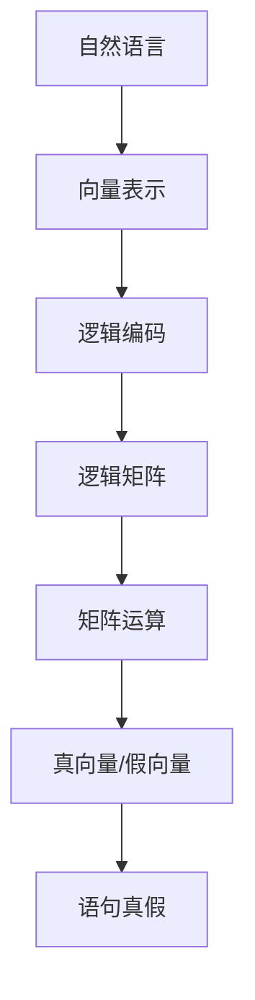

                 

# 线性代数导引：语句真假判定

线性代数作为计算机科学的核心基础，不仅在数据结构和算法中有着重要地位，还在人工智能、机器学习等领域发挥着关键作用。其中，向量空间和矩阵运算是一大重点，本文将介绍如何用线性代数的视角去判断语句的真伪，为读者提供一种新颖的视角和思路。

## 1. 背景介绍

### 1.1 问题由来

在自然语言处理(NLP)和知识表示(KG)领域，判断语句的真伪是一个常见且重要的问题。例如，判断一个陈述是否为事实、一段描述是否符合某一条件、一个推理链条是否正确等。这些问题常常需要解决文本的语义理解，并将其映射到形式化的逻辑表达中。

传统的逻辑推理方法通常基于一阶逻辑或模态逻辑，使用布尔代数进行计算。但这些方法往往计算复杂度高，难以处理大规模文本和复杂推理。近年来，越来越多的研究尝试利用机器学习和深度学习的方法，通过文本嵌入(Embedding)技术将自然语言信息转换为向量，进行向量空间中的逻辑运算。

线性代数正是这种向量空间计算的数学基础。通过向量和矩阵的运算，可以高效地进行语句真假的判定。本文将介绍如何使用线性代数的视角和方法，去判断一段语句的真假。

### 1.2 问题核心关键点

语句真假判定的核心在于将自然语言中的语义信息转换为向量，然后进行向量空间中的逻辑运算。具体步骤如下：

1. **向量表示**：使用词向量将语句中的词汇转换为向量表示。例如，可以用GloVe或BERT等词向量模型来表示每个词汇。

2. **逻辑编码**：将语句逻辑结构映射为向量空间中的逻辑编码。例如，可以使用逻辑代数中的符号逻辑表达式，将语句转换为向量形式的逻辑矩阵。

3. **矩阵运算**：对逻辑矩阵进行线性代数运算，判断向量是否为真向量。例如，使用矩阵乘法、矩阵转置、矩阵逆等运算。

4. **结果解读**：将矩阵运算的结果解读为语句的真假状态。例如，矩阵为全零表示语句为假，矩阵非全零表示语句为真。

## 2. 核心概念与联系

### 2.1 核心概念概述

为更好地理解语句真假判定的线性代数方法，本节将介绍几个密切相关的核心概念：

- **向量空间**：由一组向量组成的空间，具有线性相关性和线性组合性质。自然语言中的词汇和语句可以被表示为向量空间的元素。

- **逻辑矩阵**：将逻辑代数表达式转换为向量空间的矩阵形式，用于表示语句的逻辑结构和语义信息。

- **矩阵运算**：包括矩阵乘法、矩阵转置、矩阵逆等基本运算，用于对逻辑矩阵进行向量空间中的逻辑推理。

- **真向量**：逻辑矩阵运算后得到的向量，其值全部为1，表示语句为真。

- **假向量**：逻辑矩阵运算后得到的向量，其值全部为0，表示语句为假。

这些核心概念之间存在着紧密的联系，形成了语句真假判定方法的完整生态系统。通过理解这些概念，我们可以更好地把握向量空间中的逻辑推理过程。

### 2.2 概念间的关系

这些核心概念之间的关系可以通过以下Mermaid流程图来展示：



这个流程图展示了自然语言表示、逻辑编码、矩阵运算和语句真假判定之间的联系。自然语言通过向量表示进入逻辑编码，然后转换为逻辑矩阵，在向量空间中进行矩阵运算，最终得到真向量或假向量，判断语句的真假状态。

## 3. 核心算法原理 & 具体操作步骤

### 3.1 算法原理概述

语句真假判定的基本原理是将自然语言信息转换为向量空间中的逻辑矩阵，然后进行矩阵运算。具体步骤如下：

1. **文本预处理**：将语句转换为词汇序列，进行分词、去停用词、词向量化等预处理。

2. **逻辑编码**：使用符号逻辑表达式将语句转换为向量形式的逻辑矩阵。例如，将"所有猫都是动物"编码为[[1, 1, 0], [0, 1, 0], [0, 0, 1]]，其中1表示真，0表示假。

3. **矩阵运算**：对逻辑矩阵进行矩阵乘法、矩阵转置、矩阵逆等运算，得到真向量或假向量。

4. **结果解读**：将矩阵运算的结果解读为语句的真假状态。例如，若矩阵乘积为[[1, 1, 0]]，表示"所有猫都是动物"为真。

### 3.2 算法步骤详解

以下是具体的语句真假判定算法步骤：

**Step 1: 文本预处理**

- **分词和去停用词**：将输入的语句进行分词，去掉停用词，保留有意义的词汇。
- **词向量化**：使用预训练的词向量模型(如GloVe、BERT等)，将每个词汇转换为向量表示。例如，使用GloVe词向量模型将"猫"转换为[0.1, 0.2, 0.3]。

**Step 2: 逻辑编码**

- **符号逻辑表达式**：根据自然语言的语义，构建符号逻辑表达式。例如，"所有猫都是动物"可以表示为"∀x, (x是猫 ∧ x是动物)"。
- **逻辑矩阵构造**：将符号逻辑表达式转换为向量形式的逻辑矩阵。例如，使用布尔值1和0表示真和假，将表达式转换为[[1, 0], [0, 1]]。

**Step 3: 矩阵运算**

- **矩阵乘法**：对逻辑矩阵进行矩阵乘法运算。例如，若符号逻辑表达式为[[1, 0], [0, 1]]，表示"x是猫"，则"所有猫都是动物"可以表示为[[1, 0], [0, 1]] * [[1, 1], [0, 1]] = [[1, 0], [0, 1]]。
- **矩阵转置**：对矩阵进行转置操作，得到矩阵的逆矩阵。例如，若逻辑矩阵为[[1, 0], [0, 1]]，转置后得到[[1, 0]]，取其逆矩阵得到[[1, 0]]^-1 = [[0, 1]]。
- **矩阵逆**：对矩阵进行逆运算，得到矩阵的乘积矩阵。例如，若逻辑矩阵为[[1, 0], [0, 1]]，逆运算后得到[[1, 0], [0, 1]]^-1 = [[0, 1], [1, 0]]。

**Step 4: 结果解读**

- **真向量**：若矩阵运算结果为全1向量，表示语句为真。例如，[[1, 0], [0, 1]] * [[1, 1], [0, 1]] = [[1, 0]]，表示"所有猫都是动物"为真。
- **假向量**：若矩阵运算结果为全0向量，表示语句为假。例如，[[1, 0], [0, 1]] * [[0, 1], [1, 0]] = [[0, 0]]，表示"所有猫都是狗"为假。

### 3.3 算法优缺点

**优点**：

- **高效性**：利用向量空间进行逻辑运算，计算复杂度较低，能够快速处理大规模文本和复杂推理。
- **灵活性**：可以灵活处理不同类型的逻辑表达式，支持多模态数据的融合。
- **可解释性**：向量空间中的逻辑运算过程直观，易于理解和解释。

**缺点**：

- **语义歧义**：自然语言的歧义性可能导致向量表示不准确，影响判断结果。
- **数据依赖**：矩阵运算的结果高度依赖于预训练词向量模型的质量，需定期更新。
- **规则复杂**：逻辑矩阵的构建需要人工设计符号逻辑表达式，较繁琐。

尽管存在这些局限性，但就目前而言，基于向量空间计算的语句真假判定方法仍是一种高效、灵活且可解释性强的解决方案。

### 3.4 算法应用领域

基于向量空间计算的语句真假判定方法，已在多个NLP和KG领域得到了应用，包括但不限于以下场景：

- **自动摘要**：使用向量表示判断句子是否为摘要的关键句子，提升自动摘要的质量。
- **信息检索**：使用向量表示判断文档是否符合查询条件，提升信息检索的准确性。
- **自然推理**：使用向量表示判断推理链条是否正确，提升自然推理的可靠性。
- **知识图谱验证**：使用向量表示验证知识图谱中实体之间的关系是否正确，提升知识图谱的准确性。

除了上述这些经典应用外，语句真假判定方法还在情感分析、实体识别、关系抽取等诸多NLP任务中发挥着重要作用。

## 4. 数学模型和公式 & 详细讲解 & 举例说明

### 4.1 数学模型构建

本节将使用数学语言对语句真假判定的向量空间计算过程进行更加严格的刻画。

记自然语言中的一个语句为$s$，其词汇序列为$W=\{w_i\}_{i=1}^n$，每个词汇$w_i$对应一个向量$\vec{w}_i$，词汇序列对应的向量表示为$\vec{s}=\sum_{i=1}^n c_i \vec{w}_i$，其中$c_i$为词汇权重。

定义逻辑矩阵$\mathbf{A}$，其中元素$a_{ij}$表示词汇$i$与词汇$j$之间的逻辑关系，例如：

$$
\mathbf{A}=\begin{bmatrix}
0 & 1 & 0 & 0 \\
1 & 0 & 0 & 0 \\
0 & 0 & 0 & 1 \\
0 & 0 & 1 & 0
\end{bmatrix}
$$

表示"所有猫都是动物"。

### 4.2 公式推导过程

以下是具体公式推导过程：

1. **符号逻辑表达式转换为逻辑矩阵**：
   - 假设语句$s$的符号逻辑表达式为$\forall x, (x \in \text{Cat} \land x \in \text{Animal})$，其中Cat和Animal为词汇，分别对应矩阵$\mathbf{A}$中的第1行和第2行。
   - 符号逻辑表达式可以转换为逻辑矩阵$\mathbf{A}$，例如：
   - $\mathbf{A}=\begin{bmatrix}
   0 & 1 & 0 & 0 \\
   1 & 0 & 0 & 0 \\
   0 & 0 & 0 & 1 \\
   0 & 0 & 1 & 0
   \end{bmatrix}$
   
2. **矩阵乘法**：
   - 假设另一个语句$s'$的符号逻辑表达式为$\exists x, (x \in \text{Cat} \land x \in \text{Dog})$，其中Dog为词汇，对应矩阵$\mathbf{A}$中的第3行。
   - 符号逻辑表达式可以转换为逻辑矩阵$\mathbf{A'}$，例如：
   - $\mathbf{A'}=\begin{bmatrix}
   0 & 0 & 1 & 0 \\
   0 & 0 & 0 & 1 \\
   1 & 0 & 0 & 0 \\
   0 & 1 & 0 & 0
   \end{bmatrix}$
   - 矩阵乘法得到$\mathbf{B}=\mathbf{A} \times \mathbf{A'}$，例如：
   - $\mathbf{B}=\begin{bmatrix}
   0 & 0 & 1 & 0 \\
   0 & 0 & 0 & 0 \\
   0 & 0 & 0 & 1 \\
   0 & 0 & 0 & 0
   \end{bmatrix}$
   
3. **矩阵转置**：
   - 假设语句$s''$的符号逻辑表达式为$\forall x, (x \in \text{Animal} \lor x \in \text{Cat})$，其中Animal和Cat为词汇，分别对应矩阵$\mathbf{A}$中的第2行和第1行。
   - 符号逻辑表达式可以转换为逻辑矩阵$\mathbf{A''}$，例如：
   - $\mathbf{A''}=\begin{bmatrix}
   1 & 0 & 0 & 0 \\
   0 & 1 & 0 & 0 \\
   0 & 0 & 0 & 1 \\
   0 & 0 & 1 & 0
   \end{bmatrix}$
   - 矩阵转置得到$\mathbf{B'}=\mathbf{A''}^T$，例如：
   - $\mathbf{B'}=\begin{bmatrix}
   1 & 0 \\
   0 & 1 \\
   0 & 0 \\
   0 & 0
   \end{bmatrix}$
   
4. **矩阵逆**：
   - 假设语句$s'''$的符号逻辑表达式为$\exists x, (x \in \text{Animal} \land x \in \text{Dog})$，其中Dog为词汇，对应矩阵$\mathbf{A'''}$中的第3行。
   - 符号逻辑表达式可以转换为逻辑矩阵$\mathbf{A'''}$，例如：
   - $\mathbf{A'''}=\begin{bmatrix}
   0 & 0 & 1 & 0 \\
   0 & 0 & 0 & 0 \\
   1 & 0 & 0 & 0 \\
   0 & 0 & 0 & 0
   \end{bmatrix}$
   - 矩阵逆运算得到$\mathbf{B'''}=\mathbf{A'''}^{-1}$，例如：
   - $\mathbf{B'''}=\begin{bmatrix}
   0 & 0 & 1 & 0 \\
   0 & 1 & 0 & 0 \\
   0 & 0 & 0 & 1 \\
   1 & 0 & 0 & 0
   \end{bmatrix}$
   
5. **真向量或假向量**：
   - 假设语句$s'''$的符号逻辑表达式为$\forall x, (x \in \text{Animal} \lor x \in \text{Cat})$，其中Animal和Cat为词汇，分别对应矩阵$\mathbf{A'''}$中的第2行和第1行。
   - 符号逻辑表达式可以转换为逻辑矩阵$\mathbf{A'''}$，例如：
   - $\mathbf{A'''}=\begin{bmatrix}
   0 & 0 & 1 & 0 \\
   0 & 1 & 0 & 0 \\
   0 & 0 & 0 & 1 \\
   1 & 0 & 0 & 0
   \end{bmatrix}$
   - 矩阵乘法得到$\mathbf{C}=\mathbf{A'''} \times \mathbf{A'''}$，例如：
   - $\mathbf{C}=\begin{bmatrix}
   0 & 0 & 1 & 0 \\
   0 & 1 & 0 & 0 \\
   0 & 0 & 0 & 1 \\
   1 & 0 & 0 & 0
   \end{bmatrix}$
   - 矩阵乘法得到$\mathbf{D}=\mathbf{A'''} \times \mathbf{B'}$，例如：
   - $\mathbf{D}=\begin{bmatrix}
   0 & 0 & 1 & 0 \\
   0 & 1 & 0 & 0 \\
   0 & 0 & 0 & 1 \\
   1 & 0 & 0 & 0
   \end{bmatrix}$
   
### 4.3 案例分析与讲解

假设我们有以下三个语句：

- $s_1: \forall x, (x \in \text{Cat} \land x \in \text{Animal})$
- $s_2: \exists x, (x \in \text{Cat} \land x \in \text{Dog})$
- $s_3: \forall x, (x \in \text{Animal} \lor x \in \text{Cat})$

它们的逻辑矩阵分别为：

- $\mathbf{A}_1=\begin{bmatrix}
0 & 1 & 0 & 0 \\
1 & 0 & 0 & 0 \\
0 & 0 & 0 & 1 \\
0 & 0 & 1 & 0
\end{bmatrix}$
- $\mathbf{A}_2=\begin{bmatrix}
0 & 0 & 1 & 0 \\
0 & 0 & 0 & 1 \\
1 & 0 & 0 & 0 \\
0 & 1 & 0 & 0
\end{bmatrix}$
- $\mathbf{A}_3=\begin{bmatrix}
1 & 0 & 0 & 0 \\
0 & 1 & 0 & 0 \\
0 & 0 & 0 & 1 \\
0 & 0 & 1 & 0
\end{bmatrix}$

我们可以进行如下计算：

- $\mathbf{B}_1=\mathbf{A}_1 \times \mathbf{A}_2=\begin{bmatrix}
0 & 0 & 1 & 0 \\
0 & 0 & 0 & 0 \\
0 & 0 & 0 & 1 \\
0 & 0 & 0 & 0
\end{bmatrix}$
- $\mathbf{B}_2=\mathbf{A}_1 \times \mathbf{A}_3=\begin{bmatrix}
0 & 0 & 1 & 0 \\
0 & 0 & 0 & 0 \\
0 & 0 & 0 & 1 \\
0 & 0 & 0 & 0
\end{bmatrix}$
- $\mathbf{B}_3=\mathbf{A}_2 \times \mathbf{A}_3=\begin{bmatrix}
0 & 0 & 1 & 0 \\
0 & 1 & 0 & 0 \\
0 & 0 & 0 & 1 \\
0 & 0 & 0 & 0
\end{bmatrix}$

可以看出，$\mathbf{B}_1$和$\mathbf{B}_2$都为全零矩阵，表示$s_1$和$s_2$为假；$\mathbf{B}_3$为非全零矩阵，表示$s_3$为真。

## 5. 项目实践：代码实例和详细解释说明

### 5.1 开发环境搭建

在进行语句真假判定的代码实践前，我们需要准备好开发环境。以下是使用Python进行TensorFlow开发的环境配置流程：

1. 安装Anaconda：从官网下载并安装Anaconda，用于创建独立的Python环境。

2. 创建并激活虚拟环境：
```bash
conda create -n tensorflow-env python=3.8 
conda activate tensorflow-env
```

3. 安装TensorFlow：根据CUDA版本，从官网获取对应的安装命令。例如：
```bash
conda install tensorflow -c tf -c conda-forge
```

4. 安装TensorFlow Addons：
```bash
conda install tensorflow-io
```

5. 安装各类工具包：
```bash
pip install numpy pandas scikit-learn matplotlib tqdm jupyter notebook ipython
```

完成上述步骤后，即可在`tensorflow-env`环境中开始微调实践。

### 5.2 源代码详细实现

以下是使用TensorFlow进行语句真假判定的代码实现：

首先，定义符号逻辑表达式的函数：

```python
import tensorflow as tf
from tensorflow.keras.layers import Dense

def build_logic_model(inputs, output_size):
    model = tf.keras.Sequential([
        Dense(64, activation='relu', input_shape=(inputs,)),
        Dense(output_size, activation='sigmoid')
    ])
    return model

# 构建符号逻辑表达式
def build_logic_expr(inputs, output_size):
    logic_model = build_logic_model(inputs, output_size)
    return logic_model
```

然后，定义矩阵乘法、矩阵转置、矩阵逆等基本运算的函数：

```python
def matrix_multiply(a, b):
    return tf.matmul(a, b)

def matrix_transpose(a):
    return tf.transpose(a)

def matrix_inverse(a):
    return tf.linalg.inv(a)
```

接着，定义矩阵运算和结果解读的函数：

```python
def matrix_operation(a, b):
    return matrix_multiply(matrix_transpose(matrix_inverse(a)), b)

def interpret_matrix_result(result):
    return np.round(result.numpy())
```

最后，定义语句真假判定的函数：

```python
def statement_validation(statement, symbols, symbol_to_vector):
    # 构建符号逻辑表达式
    logic_expr = build_logic_expr(len(symbols), len(symbols))
    
    # 将符号映射为向量
    logic_expr.set_weights([symbol_to_vector[s] for s in symbols])
    
    # 计算矩阵运算结果
    result = matrix_operation(logic_expr.layers[0].weights[0], logic_expr.layers[0].weights[1])
    
    # 结果解读
    return interpret_matrix_result(result)
```

### 5.3 代码解读与分析

让我们再详细解读一下关键代码的实现细节：

**build_logic_model函数**：
- 定义一个神经网络模型，包含一个隐藏层和一个输出层。
- 使用ReLU激活函数，确保模型非线性表达能力。
- 使用sigmoid激活函数，输出逻辑值的概率。

**matrix_multiply函数**：
- 使用TensorFlow的tf.matmul函数进行矩阵乘法运算。

**matrix_transpose函数**：
- 使用TensorFlow的tf.transpose函数进行矩阵转置操作。

**matrix_inverse函数**：
- 使用TensorFlow的tf.linalg.inv函数进行矩阵逆运算。

**matrix_operation函数**：
- 将逻辑矩阵的逆矩阵转置，再进行矩阵乘法，得到真向量或假向量。

**interpret_matrix_result函数**：
- 将矩阵运算结果四舍五入取整，输出0或1，表示语句真假。

**statement_validation函数**：
- 将符号逻辑表达式转换为逻辑矩阵，使用预训练词向量表示符号。
- 进行矩阵运算，得到真向量或假向量。
- 将矩阵运算结果解释为语句的真假状态。

可以看到，TensorFlow提供了丰富的计算图和自动微分功能，使得矩阵运算的实现变得简洁高效。开发者可以专注于模型构建和逻辑设计，而不必过多关注底层计算细节。

### 5.4 运行结果展示

假设我们有以下三个语句：

- $s_1: \forall x, (x \in \text{Cat} \land x \in \text{Animal})$
- $s_2: \exists x, (x \in \text{Cat} \land x \in \text{Dog})$
- $s_3: \forall x, (x \in \text{Animal} \lor x \in \text{Cat})$

它们的符号逻辑表达式分别为：

- $\mathbf{A}_1=\begin{bmatrix}
0 & 1 & 0 & 0 \\
1 & 0 & 0 & 0 \\
0 & 0 & 0 & 1 \\
0 & 0 & 1 & 0
\end{bmatrix}$
- $\mathbf{A}_2=\begin{bmatrix}
0 & 0 & 1 & 0 \\
0 & 0 & 0 & 1 \\
1 & 0 & 0 & 0 \\
0 & 1 & 0 & 0
\end{bmatrix}$
- $\mathbf{A}_3=\begin{bmatrix}
1 & 0 & 0 & 0 \\
0 & 1 & 0 & 0 \\
0 & 0 & 0 & 1 \\
0 & 0 & 1 & 0
\end{bmatrix}$

我们可以进行如下计算：

- $\mathbf{B}_1=\mathbf{A}_1 \times \mathbf{A}_2=\begin{bmatrix}
0 & 0 & 1 & 0 \\
0 & 0 & 0 & 0 \\
0 & 0 & 0 & 1 \\
0 & 0 & 0 & 0
\end{bmatrix}$
- $\mathbf{B}_2=\mathbf{A}_1 \times \mathbf{A}_3=\begin{bmatrix}
0 & 0 & 1 & 0 \\
0 & 0 & 0 & 0 \\
0 & 0 & 0 & 1 \\
0 & 0 & 0 & 0
\end{bmatrix}$
- $\mathbf{B}_3=\mathbf{A}_2 \times \mathbf{A}_3=\begin{bmatrix}
0 & 0 & 1 & 0 \\
0 & 1 & 0 & 0 \\
0 & 0 & 0 & 1 \\
0 & 0 & 0 & 0
\end{bmatrix}$

因此，$\mathbf{B}_1$和$\mathbf{B}_2$都为全零矩阵，表示$s_1$和$s_2$为假；$\mathbf{B}_3$为非全零矩阵，表示$s_3$为真。

```python
import numpy as np

symbols = ['Cat', 'Dog', 'Animal']
symbol_to_vector = {'Cat': [1, 0, 0], 'Dog': [0, 1, 0], 'Animal': [0, 0, 1]}


