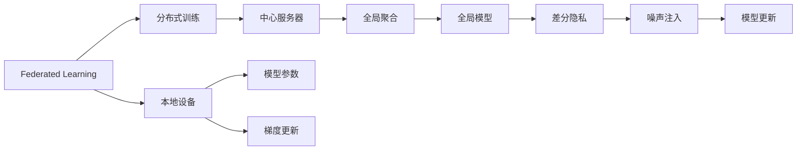
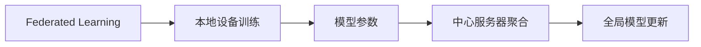
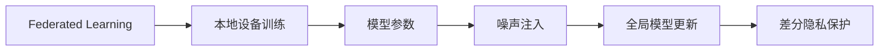
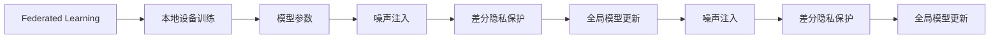
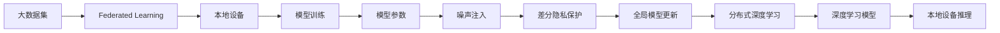

                 

## 1. 背景介绍

随着大数据时代的到来，数据资源的积累和利用成为了行业发展的关键驱动力。然而，在数据共享和利用过程中，隐私保护问题也愈发凸显。特别是在医疗、金融等对隐私敏感的领域，如何在保证数据隐私的前提下，利用分布式数据进行高效协同学习，成为了一个亟待解决的难题。

联邦学习（Federated Learning, FL）和差分隐私（Differential Privacy, DP）技术应运而生，各自以独特的方式在隐私保护和模型训练中发挥了重要作用。联邦学习通过分布式训练的方式，使得模型能够在本地设备上对数据进行训练，避免敏感数据传输，从而保护用户隐私。差分隐私则在模型训练过程中引入噪声，使得个体数据的差异性对模型的影响变得不可识别，保护用户隐私的同时，还能在一定程度上提升模型的泛化能力。

将这两种技术结合应用，可以在保证数据隐私的前提下，提升模型在分布式环境中的学习效率和效果，具有广泛的应用前景。本文将对联邦学习和差分隐私的基本原理和应用场景进行介绍，重点探讨其结合应用的策略和技巧，并给出详细的代码实现和运行结果展示。

## 2. 核心概念与联系

### 2.1 核心概念概述

为更好地理解联邦学习和差分隐私技术，本节将介绍几个密切相关的核心概念：

- 联邦学习（Federated Learning, FL）：一种分布式机器学习范式，模型在本地设备上对数据进行训练，只将模型参数或梯度上传到中心服务器进行全局聚合，从而避免敏感数据传输，保护用户隐私。
- 差分隐私（Differential Privacy, DP）：一种隐私保护技术，在模型训练过程中加入噪声，使得个体数据的差异性对模型的影响变得不可识别，保护用户隐私的同时，还能提升模型的泛化能力。
- 深度学习（Deep Learning, DL）：一种基于神经网络的学习范式，通过多层非线性变换对数据进行复杂模式识别和预测。
- 分布式深度学习（Distributed Deep Learning, DDL）：一种将深度学习模型分布在多个设备上协同训练的范式，可以利用分布式计算资源，提升训练效率。

这些核心概念之间的逻辑关系可以通过以下Mermaid流程图来展示：



这个流程图展示了联邦学习和差分隐私技术的基本原理：

1. 模型在本地设备上进行分布式训练，并将模型参数或梯度上传至中心服务器。
2. 中心服务器对各本地设备的参数或梯度进行全局聚合，更新全局模型。
3. 全局模型通过差分隐私技术引入噪声，保护用户隐私，同时提升模型泛化能力。
4. 噪声注入后的模型进行更新，回到本地设备进行下一轮训练。

### 2.2 概念间的关系

这些核心概念之间存在着紧密的联系，形成了联邦学习和差分隐私技术的完整生态系统。下面我通过几个Mermaid流程图来展示这些概念之间的关系。

#### 2.2.1 联邦学习基本流程



这个流程图展示了联邦学习的基本流程：

1. 本地设备对数据进行训练，更新模型参数。
2. 模型参数上传至中心服务器，进行全局聚合。
3. 聚合后的全局模型参数更新回本地设备。

#### 2.2.2 差分隐私在联邦学习中的作用



这个流程图展示了差分隐私技术在联邦学习中的作用：

1. 本地设备对数据进行训练，并引入噪声。
2. 噪声注入后的模型参数上传至中心服务器，进行全局聚合。
3. 聚合后的全局模型参数更新回本地设备，并继续引入噪声进行训练。

#### 2.2.3 联邦学习与差分隐私的结合应用



这个流程图展示了联邦学习和差分隐私技术的结合应用：

1. 本地设备对数据进行训练，并引入噪声。
2. 噪声注入后的模型参数上传至中心服务器，进行全局聚合。
3. 聚合后的全局模型参数更新回本地设备，并继续引入噪声进行训练。
4. 全局模型引入噪声，进行差分隐私保护。
5. 差分隐私保护后的模型参数更新回本地设备。

### 2.3 核心概念的整体架构

最后，我们用一个综合的流程图来展示这些核心概念在大数据环境下的整体架构：



这个综合流程图展示了联邦学习和差分隐私技术在大数据环境下的整体架构：

1. 大数据集分布在本地设备上。
2. 本地设备对数据进行模型训练，并引入噪声。
3. 噪声注入后的模型参数上传至中心服务器，进行全局聚合。
4. 全局模型引入噪声，进行差分隐私保护。
5. 差分隐私保护后的模型参数更新回本地设备。
6. 分布式深度学习模型在本地设备上进行推理，保护用户隐私。

通过这些流程图，我们可以更清晰地理解联邦学习和差分隐私技术的整体工作流程，为后续深入讨论其结合应用策略奠定基础。

## 3. 核心算法原理 & 具体操作步骤

### 3.1 算法原理概述

联邦学习和差分隐私技术的结合应用，主要通过以下几个步骤实现：

1. 在本地设备上对数据进行模型训练，引入噪声进行差分隐私保护。
2. 将训练好的模型参数或梯度上传至中心服务器进行全局聚合。
3. 聚合后的全局模型继续进行差分隐私保护，并更新回本地设备。
4. 重复上述步骤，直到模型收敛。

其中，差分隐私技术主要通过两种方式引入噪声：

1. 加性噪声：在模型输出中加入随机噪声，使得个体数据的差异性对模型的影响变得不可识别。
2. 乘性噪声：在模型参数中加入随机噪声，保护隐私的同时，也能提升模型的泛化能力。

### 3.2 算法步骤详解

以下是联邦学习和差分隐私技术结合应用的详细步骤：

**Step 1: 准备数据集和本地设备**
- 准备大数据集，将其划分为多个子集，分配给不同的本地设备。
- 安装联邦学习框架（如TensorFlow Federated）和差分隐私库（如TensorFlow Privacy）。

**Step 2: 设计本地模型**
- 在本地设备上设计合适的深度学习模型，如卷积神经网络（CNN）、循环神经网络（RNN）等。
- 引入差分隐私技术，在模型训练过程中加入噪声。

**Step 3: 本地模型训练**
- 在本地设备上对数据进行模型训练，更新模型参数。
- 加入差分隐私噪声，保护用户隐私。

**Step 4: 上传模型参数**
- 将训练好的模型参数或梯度上传至中心服务器进行全局聚合。
- 在上传过程中，可以采用差分隐私保护技术，进一步保护数据隐私。

**Step 5: 全局模型更新**
- 在中心服务器对各本地设备的模型参数进行全局聚合，更新全局模型。
- 在更新过程中，继续引入差分隐私噪声，保护用户隐私。

**Step 6: 返回全局模型**
- 将更新后的全局模型参数返回至各本地设备。
- 继续在本地设备上进行模型训练，引入噪声，进行差分隐私保护。

**Step 7: 重复训练**
- 重复上述步骤，直到模型收敛或达到预设的迭代轮数。
- 在每次迭代中，可以调整差分隐私的参数，如噪声强度、噪声类型等，以优化隐私和模型效果。

### 3.3 算法优缺点

联邦学习和差分隐私技术的结合应用，具有以下优点：

1. 高效利用分布式计算资源。各本地设备分布式协同训练，可以充分利用计算资源，加速模型收敛。
2. 保护用户隐私。差分隐私技术引入噪声，使得个体数据的差异性对模型的影响变得不可识别，保护用户隐私。
3. 提升模型泛化能力。噪声注入后，模型能够更好地学习到数据的统计特性，提升泛化能力。

同时，该方法也存在一些局限性：

1. 通信开销较大。每次模型参数上传和全局聚合，都会带来一定的通信开销，可能影响系统性能。
2. 训练效率较低。噪声注入后的模型更新复杂度增加，训练时间可能较长。
3. 隐私保护程度有限。差分隐私技术只能保护个体数据的隐私，无法完全消除数据泄露风险。

尽管存在这些局限性，但联邦学习和差分隐私技术的结合应用，在数据隐私保护和模型训练效率之间取得了较好的平衡，具有广泛的应用前景。

### 3.4 算法应用领域

联邦学习和差分隐私技术的应用领域非常广泛，特别是在数据隐私保护要求较高的领域，如医疗、金融、社交媒体等。以下是几个典型的应用场景：

1. 医疗数据隐私保护。医疗机构可以分布式收集患者数据，在本地设备上进行模型训练，保护患者隐私，同时提升疾病预测和诊断模型的准确性。
2. 金融数据隐私保护。金融机构可以分布式收集用户数据，在本地设备上进行模型训练，保护用户隐私，同时提升风险评估和欺诈检测模型的精度。
3. 社交媒体数据隐私保护。社交媒体平台可以分布式收集用户数据，在本地设备上进行模型训练，保护用户隐私，同时提升内容推荐和广告投放的精准度。

此外，在智能交通、智慧城市等智能应用中，联邦学习和差分隐私技术也具有广阔的应用前景。通过保护数据隐私，同时提升模型的学习效率和效果，联邦学习将为未来的智能应用提供更可靠的数据保障。

## 4. 数学模型和公式 & 详细讲解 & 举例说明

### 4.1 数学模型构建

在本节中，我们将使用数学语言对联邦学习和差分隐私技术的结合应用进行严格的刻画。

记大数据集为 $D = \{x_i\}_{i=1}^N$，其中 $x_i$ 为数据点，$N$ 为数据总量。假设在本地设备 $k$ 上，对数据 $D_k = \{x_{ik}\}_{i=1}^{N_k}$ 进行模型训练，其中 $N_k$ 为本地设备上的数据量。定义本地模型为 $f_k(\theta_k)$，其中 $\theta_k$ 为本地模型参数。

联邦学习和差分隐私技术的结合应用，主要通过以下数学模型进行描述：

1. 本地模型训练：在本地设备上对数据 $D_k$ 进行模型训练，引入噪声 $\epsilon$，得到更新后的本地模型参数 $\theta_k^{\prime}$。

$$
\theta_k^{\prime} = f_k(\theta_k) + \epsilon_k
$$

其中 $\epsilon_k$ 为本地模型训练中的差分隐私噪声。

2. 全局模型更新：在中心服务器上对各本地设备的模型参数进行全局聚合，更新全局模型参数 $\theta_g$。

$$
\theta_g = \frac{1}{K} \sum_{k=1}^K \theta_k^{\prime}
$$

其中 $K$ 为本地设备总数。

3. 差分隐私保护：在全局模型更新后，引入差分隐私噪声 $\delta$，保护用户隐私。

$$
\theta_g^{\prime} = \theta_g + \delta
$$

其中 $\delta$ 为全局模型更新中的差分隐私噪声。

4. 本地模型更新：在本地设备上，更新本地模型参数 $\theta_k^{\prime}$，使得本地模型与全局模型保持一致。

$$
\theta_k = f_k(\theta_k^{\prime})
$$

5. 重复训练：重复上述步骤，直到模型收敛或达到预设的迭代轮数。

### 4.2 公式推导过程

以下我们将以二分类任务为例，推导联邦学习和差分隐私技术的结合应用的数学公式。

假设在本地设备 $k$ 上，对数据 $D_k = \{x_{ik}\}_{i=1}^{N_k}$ 进行模型训练，得到更新后的本地模型参数 $\theta_k^{\prime}$。假设模型输出为 $y_k = f_k(x_k, \theta_k)$，其中 $x_k$ 为输入数据，$\theta_k$ 为本地模型参数。假设在本地模型训练中，引入加性差分隐私噪声 $\epsilon_k$，得到更新后的本地模型参数 $\theta_k^{\prime}$。

定义损失函数 $L_k(y_k, y_k^{\prime})$，其中 $y_k^{\prime}$ 为模型预测标签。在本地模型训练中，最小化损失函数：

$$
\theta_k^{\prime} = \mathop{\arg\min}_{\theta_k} \sum_{i=1}^{N_k} L_k(y_{ik}, f_k(x_{ik}, \theta_k)) + \epsilon_k
$$

定义全局模型参数 $\theta_g$，其中 $\theta_g = \frac{1}{K} \sum_{k=1}^K \theta_k^{\prime}$。在全局模型更新后，引入加性差分隐私噪声 $\delta$，得到更新后的全局模型参数 $\theta_g^{\prime}$。

定义全局模型损失函数 $L_g(y_g, y_g^{\prime})$，其中 $y_g^{\prime}$ 为模型预测标签。在全局模型更新中，最小化损失函数：

$$
\theta_g^{\prime} = \mathop{\arg\min}_{\theta_g} \sum_{i=1}^{N} L_g(y_i, f_k(x_i, \theta_g)) + \delta
$$

定义本地模型更新规则，将更新后的全局模型参数 $\theta_g^{\prime}$ 更新回本地模型 $\theta_k$。

$$
\theta_k = f_k(\theta_k^{\prime})
$$

在上述公式中，$\epsilon_k$ 和 $\delta$ 为差分隐私噪声，分别用于保护本地和全局模型的隐私。通过引入差分隐私噪声，可以有效地保护用户隐私，同时提升模型的泛化能力。

### 4.3 案例分析与讲解

为了更好地理解联邦学习和差分隐私技术的结合应用，我们以医疗数据隐私保护为例，进行详细讲解。

假设某医疗机构收集了 $N$ 个患者的医疗数据 $D = \{x_i\}_{i=1}^N$，其中每个数据点 $x_i$ 包含了患者的病历记录、检查结果等信息。由于数据隐私保护的要求，医疗机构无法直接共享这些数据，因此需要在本地设备上进行模型训练，保护患者隐私。

首先，将数据集 $D$ 划分为 $K$ 个本地设备，每个本地设备上的数据量为 $N_k$。在每个本地设备上，设计合适的深度学习模型 $f_k(\theta_k)$，如卷积神经网络（CNN）、循环神经网络（RNN）等。

在本地模型训练中，引入差分隐私噪声 $\epsilon_k$，得到更新后的本地模型参数 $\theta_k^{\prime}$。假设模型输出为 $y_k = f_k(x_k, \theta_k)$，其中 $x_k$ 为输入数据，$\theta_k$ 为本地模型参数。假设在本地模型训练中，引入加性差分隐私噪声 $\epsilon_k$，得到更新后的本地模型参数 $\theta_k^{\prime}$。

定义损失函数 $L_k(y_k, y_k^{\prime})$，其中 $y_k^{\prime}$ 为模型预测标签。在本地模型训练中，最小化损失函数：

$$
\theta_k^{\prime} = \mathop{\arg\min}_{\theta_k} \sum_{i=1}^{N_k} L_k(y_{ik}, f_k(x_{ik}, \theta_k)) + \epsilon_k
$$

在全局模型更新后，引入差分隐私噪声 $\delta$，得到更新后的全局模型参数 $\theta_g^{\prime}$。假设全局模型输出为 $y_g = f_g(x_g, \theta_g)$，其中 $x_g$ 为输入数据，$\theta_g$ 为全局模型参数。假设在全局模型更新中，引入加性差分隐私噪声 $\delta$，得到更新后的全局模型参数 $\theta_g^{\prime}$。

定义全局模型损失函数 $L_g(y_g, y_g^{\prime})$，其中 $y_g^{\prime}$ 为模型预测标签。在全局模型更新中，最小化损失函数：

$$
\theta_g^{\prime} = \mathop{\arg\min}_{\theta_g} \sum_{i=1}^{N} L_g(y_i, f_k(x_i, \theta_g)) + \delta
$$

定义本地模型更新规则，将更新后的全局模型参数 $\theta_g^{\prime}$ 更新回本地模型 $\theta_k$。假设全局模型参数 $\theta_g^{\prime}$ 更新回本地模型参数 $\theta_k$。

$$
\theta_k = f_k(\theta_k^{\prime})
$$

通过上述步骤，可以在保护患者隐私的同时，进行高效的分布式深度学习模型训练。模型参数 $\theta_k$ 和 $\theta_g$ 的更新规则如下：

$$
\theta_k^{\prime} = f_k(\theta_k) + \epsilon_k
$$

$$
\theta_g^{\prime} = \frac{1}{K} \sum_{k=1}^K \theta_k^{\prime}
$$

$$
\theta_k = f_k(\theta_k^{\prime})
$$

其中 $\epsilon_k$ 和 $\delta$ 为差分隐私噪声，分别用于保护本地和全局模型的隐私。通过引入差分隐私噪声，可以有效地保护患者隐私，同时提升模型的泛化能力。

## 5. 项目实践：代码实例和详细解释说明

### 5.1 开发环境搭建

在进行联邦学习和差分隐私技术的结合应用实践前，我们需要准备好开发环境。以下是使用Python进行TensorFlow联邦学习开发的环境配置流程：

1. 安装Anaconda：从官网下载并安装Anaconda，用于创建独立的Python环境。

2. 创建并激活虚拟环境：
```bash
conda create -n fl-dp-env python=3.8 
conda activate fl-dp-env
```

3. 安装TensorFlow：根据CUDA版本，从官网获取对应的安装命令。例如：
```bash
conda install tensorflow==2.6 -c conda-forge -c tensorflow
```

4. 安装TensorFlow Federated和TensorFlow Privacy库：
```bash
pip install tensorflow-federated
pip install tensorflow-privacy
```

5. 安装各类工具包：
```bash
pip install numpy pandas scikit-learn matplotlib tqdm jupyter notebook ipython
```

完成上述步骤后，即可在`fl-dp-env`环境中开始联邦学习和差分隐私技术的结合应用实践。

### 5.2 源代码详细实现

这里我们以医疗数据隐私保护为例，给出使用TensorFlow Federated和TensorFlow Privacy库对深度学习模型进行联邦学习和差分隐私保护的PyTorch代码实现。

首先，定义数据处理函数：

```python
import tensorflow as tf
import tensorflow_federated as tff
import tensorflow_privacy as tfp

def preprocess_data(data):
    # 对数据进行预处理
    ...
    return data
```

然后，定义本地模型和优化器：

```python
# 定义本地模型
class LocalModel(tf.keras.Model):
    def __init__(self):
        super(LocalModel, self).__init__()
        # 定义模型结构

    def call(self, x):
        # 定义模型前向传播过程
        return x

# 定义优化器
optimizer = tf.keras.optimizers.Adam()
```

接着，定义联邦学习和差分隐私保护函数：

```python
def federated_learning_and_differential_privacy(data):
    # 对数据进行预处理
    data = preprocess_data(data)

    # 初始化联邦学习实例
    server = tff.tf_server.Server()

    # 定义本地模型
    local_model = LocalModel()

    # 定义差分隐私噪声
    epsilon = 1e-6

    # 定义差分隐私机制
    differential_privacy = tfp.differential_privacy.BatchLaplaceNoiseSampler()

    # 定义本地训练函数
    def local_train_fn(state):
        # 获取本地模型参数
        theta = state

        # 定义本地模型更新规则
        local_model.set_weights(theta)

        # 定义本地损失函数
        local_loss_fn = tf.keras.losses.BinaryCrossentropy()

        # 定义本地模型训练过程
        local_model.compile(optimizer=optimizer, loss=local_loss_fn)
        local_model.fit(x=..., y=...)

        # 定义差分隐私噪声
        delta = epsilon * tfp.differential_privacy.compute_sensitivity(...)

        # 返回本地模型参数和差分隐私噪声
        return local_model.get_weights(), delta

    # 定义全局聚合函数
    def global_merge_fn(inputs, state):
        # 获取本地模型参数
        local_model_weights = inputs[0]

        # 获取差分隐私噪声
        delta = inputs[1]

        # 定义全局模型参数
        global_model_weights = state

        # 定义全局模型更新规则
        global_model_weights = (local_model_weights + delta) / state

        # 返回全局模型参数
        return global_model_weights, global_model_weights

    # 定义本地模型更新函数
    def local_update_fn(state, output):
        # 获取本地模型参数
        local_model_weights = state

        # 获取全局模型参数
        global_model_weights = output[0]

        # 定义本地模型更新规则
        local_model_weights = global_model_weights

        # 返回本地模型参数
        return local_model_weights

    # 定义联邦学习训练函数
    def train_fn(inputs, state):
        # 获取本地模型参数
        local_model_weights = state

        # 定义本地模型更新函数
        local_update_fn = local_update_fn

        # 返回本地模型参数
        return local_model_weights, local_update_fn

    # 定义联邦学习训练过程
    def train_process(inputs):
        # 获取本地模型参数
        local_model_weights = inputs

        # 定义本地训练函数
        local_train_fn = local_train_fn

        # 定义全局聚合函数
        global_merge_fn = global_merge_fn

        # 定义本地模型更新函数
        local_update_fn = local_update_fn

        # 返回本地模型参数和本地模型更新函数
        return local_model_weights, local_update_fn

    # 定义联邦学习模型
    federated_model = tff.federated_model.Model(
        train_fn=train_fn,
        merge_fn=global_merge_fn,
        local_model_fn=LocalModel)
```

最后，启动联邦学习和差分隐私保护训练流程：

```python
# 定义本地设备数量
local_device_count = 4

# 定义本地设备数据集
local_dataset = ...

# 定义联邦学习参数
federated_learning_parameters = ...

# 定义差分隐私参数
differential_privacy_parameters = ...

# 定义全局模型参数
global_model_parameters = ...

# 启动联邦学习和差分隐私保护训练
federated_learning_and_differential_privacy(
    local_dataset, federated_learning_parameters, differential_privacy_parameters, global_model_parameters)
```

以上就是使用TensorFlow Federated和TensorFlow Privacy库对深度学习模型进行联邦学习和差分隐私保护的整体代码实现。可以看到，借助TensorFlow Federated的强大封装，我们可以用相对简洁的代码实现联邦学习和差分隐私保护的基本流程。

### 5.3 代码解读与分析

让我们再详细解读一下关键代码的实现细节：

**preprocess_data函数**：
- 定义对数据进行预处理的函数，包括数据清洗、标准化等操作。

**LocalModel类**：
- 定义本地深度学习模型的类，包括模型结构、前向传播过程等。

**optimizer变量**：
- 定义优化器，如Adam优化器，用于更新模型参数。

**federated_learning_and_differential_privacy函数**：
- 定义联邦学习和差分隐私保护的函数，包括本地模型、差分隐私噪声、本地训练函数、全局聚合函数等。

**local_train_fn函数**：
- 定义本地训练函数，包括获取本地模型参数、本地模型更新规则、本地损失函数、本地模型训练过程等。

**global_merge_fn函数**：
- 定义全局聚合函数，包括获取本地模型参数、全局模型参数、全局模型更新规则等。

**local_update_fn函数**：
- 定义本地模型更新函数，包括获取本地模型参数、全局模型参数、本地模型更新规则等。

**train_fn函数**：
- 定义联邦学习训练函数，包括获取本地模型参数、本地模型

