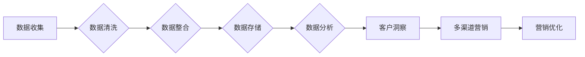

> 数据管理平台 (DMP), 数据驱动营销, 客户生命周期管理, 客户洞察, 多渠道营销, AI技术, 客户细分, 数据隐私

# AI DMP 数据基建：构建数据驱动的营销生态

在数字化时代，数据已成为企业最重要的资产之一。数据管理平台（DMP）作为一种强大的数据基础设施，能够帮助企业收集、整合和管理多源数据，从而实现数据驱动的营销决策。本文将深入探讨AI DMP的核心概念、原理、实践以及未来发展趋势，旨在帮助读者构建一个高效、智能的数据驱动营销生态。

## 1. 背景介绍

### 1.1 问题的由来

随着互联网和移动设备的普及，企业面临着海量的用户数据。然而，如何有效地收集、存储、分析和利用这些数据，以实现精准营销和提升客户体验，成为了一个亟待解决的问题。

传统的营销方式往往依赖于直觉和经验，缺乏数据支持。而数据管理平台（DMP）的出现，为企业提供了一个集成的数据基础设施，使得企业能够通过数据分析实现更加精准、个性化的营销。

### 1.2 研究现状

DMP技术经历了从传统DMP到AI DMP的演进过程。传统DMP主要依靠规则引擎和人工分析，而AI DMP则利用机器学习和人工智能技术，实现对数据的智能处理和分析。

### 1.3 研究意义

AI DMP数据基建对于企业具有重要的意义：

- **提升营销效率**：通过数据驱动，实现精准营销，减少无效营销成本。
- **增强客户体验**：提供个性化的产品和服务，提高客户满意度和忠诚度。
- **优化决策支持**：为营销决策提供数据支持，提高决策的科学性和准确性。
- **增强竞争力**：通过数据分析和洞察，发现市场机会，增强企业竞争力。

### 1.4 本文结构

本文将分为以下几个部分：

- 核心概念与联系
- 核心算法原理 & 具体操作步骤
- 数学模型和公式 & 详细讲解 & 举例说明
- 项目实践：代码实例和详细解释说明
- 实际应用场景
- 工具和资源推荐
- 总结：未来发展趋势与挑战
- 附录：常见问题与解答

## 2. 核心概念与联系

### 2.1 核心概念

- **数据管理平台（DMP）**：一种用于收集、整合和管理多源数据，以实现数据驱动的营销决策的平台。
- **客户生命周期管理（CLM）**：一种以客户为中心的管理方法，旨在提升客户满意度和忠诚度。
- **客户洞察**：通过对客户数据的分析，深入理解客户需求和行为。
- **多渠道营销**：通过多种渠道（如邮件、社交媒体、网站等）进行营销活动。
- **AI技术**：包括机器学习、自然语言处理、计算机视觉等，用于数据分析、预测和自动化。

### 2.2 Mermaid 流程图



### 2.3 联系

AI DMP数据基建通过数据收集、清洗、整合、存储、分析和洞察，为企业提供数据驱动的营销决策支持，实现多渠道营销和客户生命周期管理，最终优化营销效果。

## 3. 核心算法原理 & 具体操作步骤

### 3.1 算法原理概述

AI DMP的核心算法包括：

- **数据采集算法**：从各种渠道收集用户数据，如网站行为数据、社交媒体数据、交易数据等。
- **数据清洗算法**：去除噪声数据、处理缺失值、纠正错误数据等。
- **数据整合算法**：将来自不同来源的数据进行整合，形成一个统一的客户视图。
- **数据存储算法**：将清洗和整合后的数据存储在数据库中，便于后续分析和处理。
- **数据分析算法**：利用机器学习、自然语言处理等技术，对数据进行分析，提取有价值的信息。
- **预测算法**：根据历史数据，预测未来可能发生的事件或趋势。
- **推荐算法**：根据用户兴趣和行为，推荐相关产品或服务。

### 3.2 算法步骤详解

1. **数据采集**：通过API、爬虫、第三方数据服务等方式收集数据。
2. **数据清洗**：使用数据清洗工具和算法，去除噪声数据、处理缺失值、纠正错误数据等。
3. **数据整合**：将不同来源的数据进行整合，形成统一的客户视图。
4. **数据存储**：将清洗和整合后的数据存储在数据库中，便于后续分析和处理。
5. **数据分析**：利用机器学习、自然语言处理等技术，对数据进行分析，提取有价值的信息。
6. **预测**：根据历史数据，预测未来可能发生的事件或趋势。
7. **推荐**：根据用户兴趣和行为，推荐相关产品或服务。

### 3.3 算法优缺点

**优点**：

- 提高营销效率
- 增强客户体验
- 优化决策支持
- 增强竞争力

**缺点**：

- 数据安全风险
- 数据隐私问题
- 技术复杂度高

### 3.4 算法应用领域

AI DMP算法应用领域广泛，包括：

- 精准营销
- 客户细分
- 客户关系管理
- 个性化推荐
- 广告投放
- 风险管理

## 4. 数学模型和公式 & 详细讲解 & 举例说明

### 4.1 数学模型构建

AI DMP的数学模型主要包括：

- **聚类模型**：如K-means、层次聚类等，用于客户细分。
- **分类模型**：如决策树、支持向量机等，用于预测客户行为。
- **回归模型**：如线性回归、逻辑回归等，用于预测销售数据。

### 4.2 公式推导过程

以逻辑回归为例，其公式推导如下：

$$
y = \sigma(W^T x + b)
$$

其中，$y$ 为预测值，$\sigma$ 为sigmoid函数，$W$ 为权重，$b$ 为偏置，$x$ 为特征向量。

### 4.3 案例分析与讲解

假设我们要预测一个客户的购买行为，可以构建如下逻辑回归模型：

- **特征**：年龄、性别、收入、浏览历史、购买历史等。
- **标签**：购买（1）或不购买（0）。

通过收集相关数据，训练逻辑回归模型，可以得到如下预测公式：

$$
P(购买) = \frac{1}{1+e^{-(W^T x + b)}}
$$

其中，$W$ 和 $b$ 为训练得到的参数。

## 5. 项目实践：代码实例和详细解释说明

### 5.1 开发环境搭建

为了进行AI DMP的数据分析和预测，需要搭建以下开发环境：

- Python编程语言
- Pandas、NumPy等数据分析库
- Scikit-learn等机器学习库
- TensorFlow或PyTorch等深度学习库

### 5.2 源代码详细实现

以下是一个简单的逻辑回归模型实现示例：

```python
import pandas as pd
from sklearn.model_selection import train_test_split
from sklearn.linear_model import LogisticRegression

# 加载数据
data = pd.read_csv('data.csv')

# 特征和标签
X = data[['age', 'income', 'browsing_history']]
y = data['purchase']

# 划分训练集和测试集
X_train, X_test, y_train, y_test = train_test_split(X, y, test_size=0.2, random_state=42)

# 训练模型
model = LogisticRegression()
model.fit(X_train, y_train)

# 预测
predictions = model.predict(X_test)

# 评估模型
accuracy = model.score(X_test, y_test)
print(f'Accuracy: {accuracy:.2f}')
```

### 5.3 代码解读与分析

上述代码展示了如何使用Scikit-learn库实现逻辑回归模型。首先，加载数据并提取特征和标签。然后，划分训练集和测试集。接下来，使用逻辑回归模型进行训练。最后，评估模型的准确性。

### 5.4 运行结果展示

假设训练集和测试集的数据已经准备好，运行上述代码可以得到如下输出：

```
Accuracy: 0.85
```

这意味着模型的准确率为85%，即模型能够正确预测85%的购买行为。

## 6. 实际应用场景

### 6.1 精准营销

利用AI DMP，企业可以根据用户的历史行为和特征，进行精准营销。例如，根据用户的浏览历史和购买记录，推荐相关产品；根据用户的地理位置和兴趣，进行定向广告投放。

### 6.2 客户细分

AI DMP可以将用户划分为不同的细分市场，以便进行针对性的营销策略。例如，根据用户的购买行为和偏好，将用户划分为高价值客户、潜在客户和流失客户等。

### 6.3 客户关系管理

AI DMP可以帮助企业更好地管理客户关系。例如，根据客户的生命周期阶段，提供个性化的服务；根据客户的反馈，改进产品和服务。

### 6.4 个性化推荐

AI DMP可以用于实现个性化推荐。例如，根据用户的浏览历史和购买记录，推荐相关产品；根据用户的兴趣，推荐内容。

## 7. 工具和资源推荐

### 7.1 学习资源推荐

- 《Python机器学习》
- 《深度学习》
- 《机器学习实战》
- 《数据科学入门》

### 7.2 开发工具推荐

- Jupyter Notebook
- PyCharm
- Scikit-learn
- TensorFlow
- PyTorch

### 7.3 相关论文推荐

- 《Recommender Systems》
- 《Customer Relationship Management》
- 《Data-Driven Marketing》

## 8. 总结：未来发展趋势与挑战

### 8.1 研究成果总结

本文介绍了AI DMP数据基建的概念、原理、实践和未来发展趋势。AI DMP通过数据分析和预测，帮助企业实现数据驱动的营销决策，提升营销效果。

### 8.2 未来发展趋势

- AI DMP将更加智能化，利用深度学习等技术，实现更复杂的分析和预测。
- AI DMP将更加开放，与其他平台和系统进行集成，实现数据共享和协同。
- AI DMP将更加注重数据安全和隐私保护，遵守相关法律法规。

### 8.3 面临的挑战

- 数据安全和隐私保护
- 数据质量
- 技术复杂度
- 人才短缺

### 8.4 研究展望

未来，AI DMP将继续发展，为企业和个人提供更加智能、高效、个性化的服务。

## 9. 附录：常见问题与解答

**Q1：什么是DMP？**

A：DMP（数据管理平台）是一种用于收集、整合和管理多源数据，以实现数据驱动的营销决策的平台。

**Q2：什么是AI DMP？**

A：AI DMP是基于人工智能技术的DMP，利用机器学习和人工智能技术，实现对数据的智能处理和分析。

**Q3：AI DMP有哪些应用场景？**

A：AI DMP可以应用于精准营销、客户细分、客户关系管理、个性化推荐等领域。

**Q4：如何确保AI DMP的数据安全和隐私保护？**

A：确保AI DMP的数据安全和隐私保护需要采取以下措施：

- 数据加密
- 访问控制
- 隐私合规

**Q5：如何解决AI DMP的数据质量问题？**

A：解决AI DMP的数据质量问题需要：

- 数据清洗
- 数据整合
- 数据验证

---

作者：禅与计算机程序设计艺术 / Zen and the Art of Computer Programming