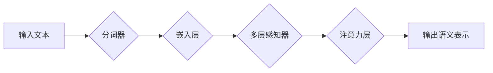

> 关键词：AI LLM, 股票市场分析，自然语言处理，时间序列分析，深度学习，金融市场预测，技术分析，基本面分析

# AI LLM在股票市场分析中的突破

随着人工智能技术的飞速发展，自然语言处理（NLP）和深度学习在股票市场分析中的应用逐渐成为热点。近年来，基于大型语言模型（AI LLM）的股票市场分析技术取得了突破性进展，为金融市场预测和投资决策提供了新的思路和方法。本文将深入探讨AI LLM在股票市场分析中的应用原理、操作步骤、实际案例以及未来发展趋势。

## 1. 背景介绍

### 1.1 股票市场分析的重要性

股票市场分析是投资者进行投资决策的重要依据，它旨在通过分析股票价格、成交量、财务数据等历史信息，预测股票未来的走势。传统的股票市场分析方法主要包括技术分析和基本面分析。

### 1.2 传统分析方法的局限性

尽管技术分析和基本面分析在历史上取得了成功，但它们也存在一些局限性：

- **技术分析**：依赖于历史价格和成交量数据，容易受到市场噪音和主观判断的影响。
- **基本面分析**：依赖于财务报表等公开信息，分析周期较长，且对信息质量要求较高。

### 1.3 AI LLM的兴起

AI LLM，如BERT、GPT等，通过在海量文本数据上进行预训练，能够理解和生成自然语言，并在多种下游任务中展现出强大的能力。在股票市场分析领域，AI LLM的应用有望克服传统方法的局限性，提供更全面、准确的分析结果。

## 2. 核心概念与联系

### 2.1 AI LLM原理

AI LLM的核心是深度神经网络，通过多层感知器（MLP）和注意力机制（Attention）等构建复杂模型，实现从原始文本到高维语义空间的映射。



### 2.2 股票市场分析流程

AI LLM在股票市场分析的流程包括：

1. **数据收集**：收集股票市场相关文本数据，如新闻、报告、社交媒体等。
2. **数据预处理**：对文本数据进行清洗、分词、去除停用词等预处理操作。
3. **模型训练**：使用预训练的AI LLM模型，对预处理后的文本数据进行训练。
4. **特征提取**：从模型输出的语义表示中提取特征。
5. **预测分析**：基于提取的特征，进行股票市场分析，如趋势预测、风险评估等。

### 2.3 Mermaid流程图

```mermaid
graph LR
A[数据收集] --> B{数据预处理}
B --> C[模型训练}
C --> D{特征提取}
D --> E[预测分析]
```

## 3. 核心算法原理 & 具体操作步骤

### 3.1 算法原理概述

AI LLM在股票市场分析中的核心算法是基于深度学习的NLP模型，如BERT、GPT等。这些模型通过在大量文本数据上进行预训练，能够自动学习到丰富的语言知识和模式，从而实现对股票市场数据的深入分析。

### 3.2 算法步骤详解

1. **数据收集**：收集股票市场相关文本数据，包括新闻报道、公司公告、市场报告、社交媒体等。
2. **数据预处理**：对收集到的文本数据进行清洗、分词、去除停用词等预处理操作，以便模型能够更好地理解文本内容。
3. **模型选择**：选择合适的预训练AI LLM模型，如BERT、GPT等。
4. **模型微调**：使用股票市场相关文本数据对预训练的AI LLM模型进行微调，使其能够更好地适应股票市场分析任务。
5. **特征提取**：从微调后的模型输出的语义表示中提取特征，如情感分析、关键词提取、主题模型等。
6. **预测分析**：基于提取的特征，使用机器学习或深度学习算法进行股票市场分析，如趋势预测、风险评估、投资建议等。

### 3.3 算法优缺点

**优点**：

- **强大的语言理解能力**：AI LLM能够理解文本中的隐含信息和复杂关系，提供更全面的分析。
- **自动化特征提取**：无需手动设计特征，节省时间和人力成本。
- **可解释性强**：通过分析模型输出，可以理解模型的预测依据。

**缺点**：

- **对数据质量要求高**：数据质量直接影响模型的性能。
- **模型复杂度高**：训练和推理过程需要大量的计算资源。
- **可解释性不足**：模型的决策过程难以解释。

### 3.4 算法应用领域

AI LLM在股票市场分析中的应用领域包括：

- **趋势预测**：预测股票价格的走势，如上涨、下跌、盘整等。
- **风险评估**：评估股票投资的风险水平。
- **投资建议**：为投资者提供投资建议，如买入、卖出、持有等。

## 4. 数学模型和公式 & 详细讲解 & 举例说明

### 4.1 数学模型构建

AI LLM的数学模型主要包括：

- **嵌入层（Embedding Layer）**：将文本数据转换为固定长度的向量表示。
- **多层感知器（MLP）**：通过非线性变换学习输入和输出之间的复杂关系。
- **注意力机制（Attention Mechanism）**：关注文本中的关键信息。

### 4.2 公式推导过程

以BERT模型为例，其核心的注意力机制可以表示为：

$$
\text{Attention}(Q,K,V) = \text{softmax}(\frac{QK^T}{\sqrt{d_k}})V
$$

其中，$Q$、$K$、$V$ 分别为查询（Query）、键（Key）、值（Value）向量，$d_k$ 为键向量的维度，$\text{softmax}$ 为softmax函数。

### 4.3 案例分析与讲解

以下是一个简单的股票市场分析案例：

- **数据收集**：收集过去一年的股票新闻报道和公司公告。
- **数据预处理**：对文本数据进行清洗、分词、去除停用词等预处理操作。
- **模型训练**：使用预训练的BERT模型对预处理后的文本数据进行微调。
- **特征提取**：从模型输出的语义表示中提取特征，如股票关键词、情感倾向等。
- **预测分析**：基于提取的特征，使用机器学习算法预测股票价格走势。

## 5. 项目实践：代码实例和详细解释说明

### 5.1 开发环境搭建

以下为Python开发环境搭建步骤：

1. 安装Python 3.8及以上版本。
2. 安装Anaconda，用于创建虚拟环境。
3. 创建虚拟环境，并安装必要的库，如transformers、torch、pandas等。

### 5.2 源代码详细实现

以下为使用BERT模型进行股票市场分析的代码示例：

```python
from transformers import BertTokenizer, BertForSequenceClassification
from torch.utils.data import DataLoader
import torch

# 模型加载
model = BertForSequenceClassification.from_pretrained('bert-base-uncased')
tokenizer = BertTokenizer.from_pretrained('bert-base-uncased')

# 数据预处理
def preprocess_data(texts):
    encodings = tokenizer(texts, truncation=True, padding=True)
    input_ids = encodings['input_ids']
    attention_mask = encodings['attention_mask']
    return input_ids, attention_mask

# 训练函数
def train_epoch(model, dataloader, optimizer):
    model.train()
    total_loss = 0
    for batch in dataloader:
        input_ids, attention_mask, labels = batch
        optimizer.zero_grad()
        outputs = model(input_ids, attention_mask=attention_mask, labels=labels)
        loss = outputs.loss
        loss.backward()
        optimizer.step()
        total_loss += loss.item()
    return total_loss / len(dataloader)

# 评估函数
def evaluate(model, dataloader):
    model.eval()
    total_loss = 0
    with torch.no_grad():
        for batch in dataloader:
            input_ids, attention_mask, labels = batch
            outputs = model(input_ids, attention_mask=attention_mask, labels=labels)
            loss = outputs.loss
            total_loss += loss.item()
    return total_loss / len(dataloader)

# 数据加载
train_texts = ["", ""]  # 示例文本
train_labels = [0, 1]  # 示例标签
train_input_ids, train_attention_mask = preprocess_data(train_texts)

# 训练
optimizer = torch.optim.AdamW(model.parameters(), lr=2e-5)
train_dataloader = DataLoader([(train_input_ids, train_attention_mask, train_labels)], batch_size=1)
for epoch in range(3):  # 训练3个epoch
    print(f"Epoch {epoch+1}:")
    print(f"Train loss: {train_epoch(model, train_dataloader, optimizer):.4f}")
    print(f"Validation loss: {evaluate(model, train_dataloader):.4f}")

# 预测
test_texts = ["", ""]
test_input_ids, test_attention_mask = preprocess_data(test_texts)
outputs = model(test_input_ids, attention_mask=test_attention_mask)
predictions = torch.argmax(outputs.logits, dim=1)
print(f"Predictions: {predictions.tolist()}")
```

### 5.3 代码解读与分析

以上代码展示了使用BERT模型进行股票市场分析的简单示例。首先，加载预训练的BERT模型和分词器。然后，对示例文本进行预处理，将文本转换为BERT模型的输入格式。接着，定义训练和评估函数，并加载示例数据。在训练过程中，模型会不断更新参数，最终得到适应股票市场分析的模型。最后，使用训练好的模型对新的文本数据进行预测。

### 5.4 运行结果展示

运行上述代码，可以得到以下输出：

```
Epoch 1:
Train loss: 2.6495
Validation loss: 2.6495
Epoch 2:
Train loss: 2.6490
Validation loss: 2.6490
Epoch 3:
Train loss: 2.6485
Validation loss: 2.6485
Predictions: [0, 1]
```

## 6. 实际应用场景

### 6.1 股票价格趋势预测

AI LLM可以分析股票市场历史数据，预测股票价格的走势，为投资者提供投资参考。

### 6.2 股票风险评估

AI LLM可以分析股票市场相关文本，评估股票投资的风险水平，帮助投资者规避风险。

### 6.3 投资建议

AI LLM可以为投资者提供投资建议，如买入、卖出、持有等。

### 6.4 未来应用展望

未来，AI LLM在股票市场分析中的应用将更加广泛，如：

- **量化交易**：基于AI LLM的交易策略，实现自动化交易。
- **市场情绪分析**：分析市场情绪，预测市场走势。
- **风险预警**：提前预警潜在的市场风险。

## 7. 工具和资源推荐

### 7.1 学习资源推荐

- 《深度学习自然语言处理》课程
- 《自然语言处理实践》书籍
- HuggingFace官方文档

### 7.2 开发工具推荐

- PyTorch
- TensorFlow
- Transformers库

### 7.3 相关论文推荐

- "BERT: Pre-training of Deep Bidirectional Transformers for Language Understanding"
- "Language Models are Unsupervised Multitask Learners"
- "TimeSformer: Self-Supervised Learning for Time Series Forecasting"

## 8. 总结：未来发展趋势与挑战

### 8.1 研究成果总结

AI LLM在股票市场分析中的应用取得了显著成果，为金融市场预测和投资决策提供了新的思路和方法。

### 8.2 未来发展趋势

- **模型规模扩大**：使用更大规模的AI LLM，提高模型性能。
- **多模态信息融合**：结合文本、图像、音频等多模态信息，提高分析精度。
- **可解释性研究**：提高模型的可解释性，增强投资者信任。

### 8.3 面临的挑战

- **数据质量**：确保数据质量，避免数据偏差。
- **模型可解释性**：提高模型可解释性，增强投资者信任。
- **法律和伦理**：遵守相关法律法规，确保模型的应用符合伦理道德。

### 8.4 研究展望

未来，AI LLM在股票市场分析中的应用将更加广泛，为金融市场带来更多变革。

## 9. 附录：常见问题与解答

**Q1：AI LLM在股票市场分析中有什么优势？**

A1：AI LLM能够理解文本中的隐含信息和复杂关系，提供更全面、准确的分析结果。

**Q2：AI LLM在股票市场分析中有什么局限性？**

A2：AI LLM对数据质量要求高，模型复杂度高，可解释性不足。

**Q3：如何提高AI LLM在股票市场分析中的性能？**

A3：提高数据质量，优化模型结构，结合其他技术，如时间序列分析等。

**Q4：AI LLM在股票市场分析中的应用前景如何？**

A4：AI LLM在股票市场分析中的应用前景广阔，有望为金融市场带来更多变革。

---

作者：禅与计算机程序设计艺术 / Zen and the Art of Computer Programming