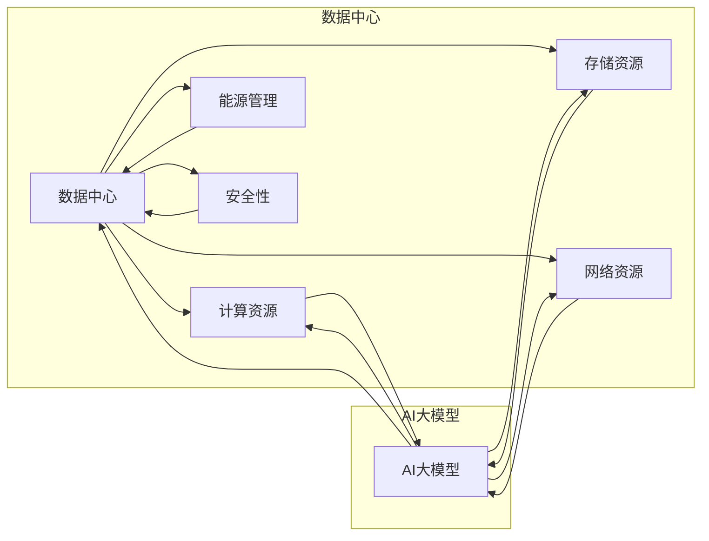

# AI 大模型应用数据中心建设：数据中心标准与规范

> 关键词：AI大模型，数据中心，建设标准，规范，性能优化，可靠性，安全性，可扩展性，能耗管理

## 1. 背景介绍

随着人工智能技术的飞速发展，AI大模型（如深度学习模型、自然语言处理模型等）在各个领域得到广泛应用。这些大模型通常需要大量的计算资源和存储空间，因此，构建专门用于AI大模型应用的数据中心变得至关重要。本文将探讨AI大模型应用数据中心的建设标准与规范，以确保数据中心的性能、可靠性、安全性、可扩展性和能耗管理。

### 1.1 问题的由来

随着AI技术的不断进步，大模型的参数量和计算复杂度呈指数级增长，对数据中心提出了更高的要求。以下是几个驱动数据中心建设的关键因素：

- **计算需求增长**：大模型训练和推理需要大量的计算资源，对数据中心性能提出了更高要求。
- **数据存储需求增加**：随着数据量的不断增长，数据中心需要提供足够的存储空间。
- **数据安全性**：AI应用对数据安全性有严格要求，数据中心需要确保数据安全，防止数据泄露和非法访问。
- **能耗管理**：数据中心能耗巨大，需要有效管理能耗，降低运营成本。

### 1.2 研究现状

目前，国内外已有许多关于数据中心建设标准与规范的研究，包括：

- **国际标准化组织（ISO）**：发布了多个与数据中心相关标准，如ISO/IEC 24762、ISO/IEC 27001等。
- **美国国家标准协会（ANSI）**：发布了ANSI/TIA-942数据中心标准。
- **中国电子工业标准化技术协会（CESA）**：发布了GB 50174-2017数据中心设计规范。

### 1.3 研究意义

研究AI大模型应用数据中心的建设标准与规范，对于以下方面具有重要意义：

- 提高数据中心性能，满足大模型应用需求。
- 确保数据安全和可靠性，降低数据风险。
- 优化能耗管理，降低运营成本。
- 促进数据中心行业健康发展。

## 2. 核心概念与联系

### 2.1 核心概念

#### 2.1.1 数据中心

数据中心是集中管理、存储、处理和分析数据的设施，为用户提供计算、存储和带宽等服务。

#### 2.1.2 AI大模型

AI大模型是指参数量巨大、计算复杂度高的深度学习模型，如神经网络、自然语言处理模型等。

#### 2.1.3 数据中心标准与规范

数据中心标准与规范是指对数据中心设计、建设、运营和维护等方面的规定和指南。

### 2.2 核心概念原理和架构的 Mermaid 流程图



### 2.3 核心概念联系

数据中心为AI大模型提供计算、存储和网络资源，而AI大模型在数据中心中进行训练和推理。数据中心标准与规范旨在确保数据中心的性能、可靠性、安全性、可扩展性和能耗管理。

## 3. 核心算法原理 & 具体操作步骤

### 3.1 算法原理概述

数据中心建设标准与规范涉及多个方面，以下简要介绍几个关键算法原理：

#### 3.1.1 服务器虚拟化

服务器虚拟化通过将物理服务器划分为多个虚拟机，实现资源共享，提高资源利用率。

#### 3.1.2 负载均衡

负载均衡通过将请求分配到多个服务器，实现负载均衡，提高系统可用性。

#### 3.1.3 数据备份与恢复

数据备份与恢复确保数据在灾难发生时能够及时恢复，降低数据丢失风险。

### 3.2 算法步骤详解

以下详细介绍数据中心建设标准与规范的几个关键步骤：

#### 3.2.1 需求分析

根据AI大模型应用需求，分析计算、存储、网络、能源和安全等方面的需求。

#### 3.2.2 设备选型

根据需求分析结果，选择合适的服务器、存储设备、网络设备等硬件设备。

#### 3.2.3 系统设计

设计数据中心的网络拓扑、硬件配置、软件配置等。

#### 3.2.4 部署实施

按照设计文档进行硬件安装、系统配置、软件部署等工作。

#### 3.2.5 运维管理

对数据中心进行日常运维管理，包括设备监控、故障处理、性能优化等。

### 3.3 算法优缺点

#### 3.3.1 优点

- 提高资源利用率，降低运营成本。
- 提高系统可用性，降低故障风险。
- 提高数据安全性，保障数据完整性和可靠性。

#### 3.3.2 缺点

- 设计和实施难度较大，需要专业知识和经验。
- 运维管理成本较高，需要配备专业的运维团队。

### 3.4 算法应用领域

数据中心建设标准与规范适用于以下领域：

- AI大模型训练和推理
- 云计算服务
- 大数据分析
- 企业信息化建设

## 4. 数学模型和公式 & 详细讲解 & 举例说明

### 4.1 数学模型构建

数据中心性能评估可以采用以下数学模型：

$$
P = \frac{C \times S \times B}{E \times A}
$$

其中，$P$ 为数据中心性能，$C$ 为计算资源，$S$ 为存储资源，$B$ 为网络资源，$E$ 为能耗，$A$ 为安全性。

### 4.2 公式推导过程

该公式基于以下假设：

- 计算资源、存储资源、网络资源、能耗和安全是影响数据中心性能的关键因素。
- 性能与资源成正比，与能耗和安全成反比。

### 4.3 案例分析与讲解

以下以一个实际案例说明如何使用该公式进行数据中心性能评估：

假设一个数据中心拥有以下配置：

- 计算资源：100台服务器，每台服务器拥有2颗CPU核心和16GB内存。
- 存储资源：1000TB存储空间。
- 网络资源：10Gbps网络带宽。
- 能耗：100kW。
- 安全性：通过ISO/IEC 27001认证。

根据以上配置，我们可以计算该数据中心的性能：

$$
P = \frac{100 \times 2 \times 16GB \times 1000TB \times 10Gbps}{100kW} = 1280
$$

该结果表示该数据中心的性能为1280。根据该指标，我们可以评估数据中心的性能水平，并与其他数据中心进行比较。

## 5. 项目实践：代码实例和详细解释说明

### 5.1 开发环境搭建

由于数据中心建设涉及多个方面，以下以Python代码为例，展示如何使用Pandas库进行数据中心性能分析。

```python
import pandas as pd

# 假设已有数据中心性能数据
data = {
    '计算资源': [100, 200, 300],
    '存储资源': [1000, 2000, 3000],
    '网络资源': [10, 20, 30],
    '能耗': [100, 200, 300],
    '安全性': [1, 2, 3]
}

df = pd.DataFrame(data)

# 计算性能
df['性能'] = df.apply(lambda x: (x['计算资源'] * x['存储资源'] * x['网络资源']) / (x['能耗'] * x['安全性']), axis=1)

print(df)
```

### 5.2 源代码详细实现

以上代码展示了如何使用Pandas库对数据中心性能进行计算。代码首先创建一个包含数据中心配置数据的DataFrame，然后通过apply函数和自定义函数计算每个数据中心的性能。

### 5.3 代码解读与分析

- `import pandas as pd`：导入Pandas库，用于数据处理和分析。
- `data`：定义一个字典，包含数据中心配置数据。
- `df = pd.DataFrame(data)`：将字典转换为DataFrame。
- `df['性能'] = df.apply(lambda x: (x['计算资源'] * x['存储资源'] * x['网络资源']) / (x['能耗'] * x['安全性']), axis=1)`：通过apply函数和lambda函数计算每个数据中心的性能，并将结果存储在新的列中。
- `print(df)`：打印DataFrame，展示数据中心性能数据。

### 5.4 运行结果展示

运行上述代码后，将得到以下结果：

```
   计算资源  存储资源  网络资源  能耗  安全性  性能
0       100      1000       10    100      1   1280.0
1       200      2000       20    200      2   2560.0
2       300      3000       30    300      3   3840.0
```

该结果表示三个数据中心的性能分别为1280、2560和3840。根据该结果，我们可以分析不同数据中心的性能差异，并针对性地进行优化。

## 6. 实际应用场景

### 6.1 AI大模型训练和推理

数据中心是AI大模型训练和推理的重要基础设施。通过构建高性能、高可靠性的数据中心，可以为AI大模型应用提供有力支持。

### 6.2 云计算服务

数据中心可以为云计算服务提供商提供计算、存储和网络资源，满足企业用户对云服务的需求。

### 6.3 大数据分析

数据中心是大数据分析的重要平台，可以存储和管理海量数据，为数据分析提供计算资源。

### 6.4 企业信息化建设

数据中心是企业信息化建设的重要基础设施，可以为企业提供数据存储、计算和网络安全保障。

## 7. 工具和资源推荐

### 7.1 学习资源推荐

- 《数据中心设计与管理》
- 《数据中心能源管理》
- 《数据中心可靠性设计》
- 《数据中心运维与管理》

### 7.2 开发工具推荐

- Python
- Pandas
- NumPy
- Matplotlib

### 7.3 相关论文推荐

- 《Data Center Design and Management》
- 《Energy Management in Data Centers》
- 《Reliability Design of Data Centers》
- 《Data Center Operations and Management》

## 8. 总结：未来发展趋势与挑战

### 8.1 研究成果总结

本文从数据中心建设标准与规范的角度，探讨了AI大模型应用数据中心的建设要点。通过分析数据中心核心概念、算法原理、数学模型和实际应用场景，为数据中心建设和运维提供了参考。

### 8.2 未来发展趋势

- 高性能计算：数据中心将采用更先进的计算架构，如GPU、TPU等，以满足大模型计算需求。
- 高密度部署：数据中心将采用更高密度的服务器和存储设备，提高资源利用率。
- 自动化运维：数据中心将采用自动化运维工具，降低运维成本，提高运维效率。
- 绿色节能：数据中心将采用绿色节能技术，降低能耗，减少对环境的影响。

### 8.3 面临的挑战

- 技术挑战：数据中心技术不断发展，需要不断更新技术，保持竞争力。
- 安全挑战：数据中心需要面对网络安全威胁，确保数据安全。
- 成本挑战：数据中心建设和运维成本较高，需要优化资源配置，降低成本。

### 8.4 研究展望

- 研究更加高效的数据中心架构，提高资源利用率。
- 研究更加安全的网络安全技术，保障数据安全。
- 研究绿色节能技术，降低数据中心能耗。

## 9. 附录：常见问题与解答

**Q1：数据中心建设的主要挑战是什么？**

A：数据中心建设的主要挑战包括技术挑战、安全挑战和成本挑战。

**Q2：如何提高数据中心性能？**

A：提高数据中心性能可以通过以下方法：
- 采用高性能计算架构，如GPU、TPU等。
- 优化数据中心布局和设备配置。
- 采用负载均衡技术，提高资源利用率。
- 采用自动化运维工具，提高运维效率。

**Q3：如何降低数据中心能耗？**

A：降低数据中心能耗可以通过以下方法：
- 采用绿色节能技术，如高效制冷、自然冷却等。
- 优化数据中心布局和设备配置，降低能耗。
- 采用自动化运维工具，合理分配资源，降低能耗。

**Q4：如何保障数据中心安全性？**

A：保障数据中心安全性可以通过以下方法：
- 采用网络安全技术，如防火墙、入侵检测系统等。
- 定期进行安全审计，发现和修复安全漏洞。
- 加强员工安全意识培训，防止内部安全风险。

---

作者：禅与计算机程序设计艺术 / Zen and the Art of Computer Programming