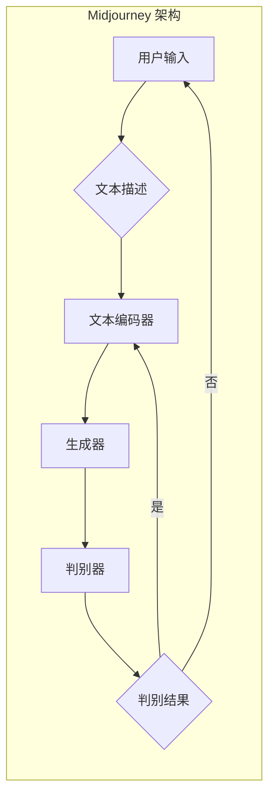

# AIGC从入门到实战：变化：活用 Midjourney，你也能成为神笔马良

> 关键词：AIGC, Midjourney, 自动生成内容, 文本生成, 图像生成, 深度学习, 编程，人工智能

## 1. 背景介绍

随着深度学习技术的飞速发展，人工智能在内容生成领域取得了显著的突破。自动生成内容（AIGC，Automated Generation of Content）成为了一个热门的研究方向。AIGC技术能够利用机器学习和深度学习算法自动生成文本、图像、视频等多种类型的内容，极大地丰富了内容创作的可能性，也为数字媒体和娱乐产业带来了全新的变革。

Midjourney是一款基于深度学习的AIGC平台，它能够根据用户的描述生成高质量的图像。本文将深入探讨AIGC的原理，并通过Midjourney的实际应用，展示如何从入门到实战，利用AIGC技术创作出令人惊叹的作品。

## 2. 核心概念与联系

### 2.1 AIGC的概念

AIGC是指通过人工智能技术自动生成内容的过程。它涵盖了文本生成、图像生成、音频生成等多种形式，是人工智能在内容创作领域的重要应用。

### 2.2 Midjourney的架构

Midjourney主要基于深度学习中的生成对抗网络（GAN）和变分自编码器（VAE）等技术。其架构流程图如下：



在这个流程中，用户输入文本描述，文本编码器将文本转换为向量表示，然后生成器根据这些向量生成图像，判别器则判断生成的图像是否满足用户的要求。如果判别器认为图像不符合要求，则会反馈给生成器，生成器会根据反馈调整生成策略，直到图像满足用户的要求。

## 3. 核心算法原理 & 具体操作步骤

### 3.1 算法原理概述

AIGC的核心算法主要包括：

- **生成对抗网络（GAN）**：GAN由生成器和判别器两部分组成。生成器的任务是生成与真实数据分布相似的样本，而判别器的任务是区分真实样本和生成样本。通过不断对抗训练，生成器的生成能力会不断提高。
- **变分自编码器（VAE）**：VAE是一种无监督学习算法，通过编码器和解码器将数据映射到低维空间，从而实现数据的降维和重构。在AIGC中，VAE可以用于生成图像、文本等数据。

### 3.2 算法步骤详解

1. **数据准备**：收集大量的文本、图像等数据，用于训练生成器和判别器。
2. **模型训练**：使用收集到的数据训练生成器和判别器。在训练过程中，生成器会尝试生成与真实数据分布相似的样本，而判别器则会不断学习区分真实样本和生成样本。
3. **生成内容**：用户输入文本描述，生成器根据文本描述生成图像。判别器判断生成的图像是否满足用户的要求。
4. **迭代优化**：如果判别器认为图像不符合要求，则会反馈给生成器，生成器会根据反馈调整生成策略，直到图像满足用户的要求。

### 3.3 算法优缺点

**优点**：

- 能够生成高质量的内容，满足用户的需求。
- 自动化程度高，降低了内容创作的门槛。
- 能够拓展内容创作的可能性，激发创意。

**缺点**：

- 训练过程复杂，需要大量的计算资源。
- 需要大量的训练数据，数据质量对生成效果有较大影响。
- 生成的内容可能存在偏见和歧视。

### 3.4 算法应用领域

AIGC技术可以应用于以下领域：

- **文本生成**：生成新闻、故事、小说等文本内容。
- **图像生成**：生成图像、视频、动画等视觉内容。
- **音频生成**：生成音乐、语音、音效等音频内容。

## 4. 数学模型和公式 & 详细讲解 & 举例说明

### 4.1 数学模型构建

AIGC的数学模型主要包括：

- **生成对抗网络（GAN）**：

  - 生成器：$G(z)$，将随机噪声向量 $z$ 转换为生成样本 $x$。
  - 判别器：$D(x)$，判断样本 $x$ 是否属于真实样本。

  $$D(x) = \sigma(W_Dx+b_D)$$
  $$G(z) = \sigma(W_Gz+b_G)$$

- **变分自编码器（VAE）**：

  - 编码器：$q_\phi(z|x)$，将数据 $x$ 编码为潜在变量 $z$。
  - 解码器：$p_\theta(x|z)$，将潜在变量 $z$ 解码为数据 $x$。

  $$q_\phi(z|x) = \frac{1}{Z} \exp\left(-\sum_{i=1}^{D} (z_i - \mu_i(x))^2 / (2\sigma_i(x)^2)\right)$$
  $$p_\theta(x|z) = \prod_{i=1}^{D} \exp\left(\frac{1}{2} \left(\frac{x_i - \mu_i(z)}{\sigma_i(z)}\right)^2\right)$$

### 4.2 公式推导过程

**GAN**：

- **判别器**：损失函数为 $L_D = \frac{1}{N}\sum_{i=1}^{N}[-\log D(x_i) - \log(1-D(G(z_i)))]$，其中 $x_i$ 为真实样本，$z_i$ 为噪声向量。

- **生成器**：损失函数为 $L_G = \frac{1}{N}\sum_{i=1}^{N}[-\log D(G(z_i))]$

**VAE**：

- **编码器**：潜在变量 $z$ 的分布为 $p_\phi(z|x)$。

- **解码器**：数据 $x$ 的概率密度函数为 $p_\theta(x|z)$。

### 4.3 案例分析与讲解

以下是一个使用GAN生成图像的例子：

```python
import torch
import torch.nn as nn
import torch.optim as optim

# 定义生成器
class Generator(nn.Module):
    def __init__(self):
        super(Generator, self).__init__()
        self.net = nn.Sequential(
            nn.Linear(100, 256),
            nn.ReLU(),
            nn.Linear(256, 512),
            nn.ReLU(),
            nn.Linear(512, 1024),
            nn.ReLU(),
            nn.Linear(1024, 28*28),
            nn.Sigmoid()
        )
        
    def forward(self, z):
        x = self.net(z)
        x = x.view(-1, 1, 28, 28)
        return x

# 定义判别器
class Discriminator(nn.Module):
    def __init__(self):
        super(Discriminator, self).__init__()
        self.net = nn.Sequential(
            nn.Linear(28*28, 1024),
            nn.LeakyReLU(0.2),
            nn.Linear(1024, 512),
            nn.LeakyReLU(0.2),
            nn.Linear(512, 256),
            nn.LeakyReLU(0.2),
            nn.Linear(256, 1),
            nn.Sigmoid()
        )
        
    def forward(self, x):
        x = self.net(x)
        return x

# 初始化模型
generator = Generator()
discriminator = Discriminator()

# 损失函数和优化器
criterion = nn.BCELoss()
optimizer_G = optim.Adam(generator.parameters(), lr=0.002)
optimizer_D = optim.Adam(discriminator.parameters(), lr=0.002)

# 训练过程
for epoch in range(100):
    # 生成噪声样本
    z = torch.randn(64, 100)
    
    # 生成图像
    fake_images = generator(z)
    
    # 计算判别器损失
    real_loss = criterion(discriminator(fake_images.detach()), torch.ones(64, 1))
    fake_loss = criterion(discriminator(fake_images), torch.zeros(64, 1))
    d_loss = (real_loss + fake_loss) / 2
    
    # 计算生成器损失
    g_loss = criterion(discriminator(fake_images), torch.ones(64, 1))
    
    # 反向传播和优化
    optimizer_G.zero_grad()
    g_loss.backward()
    optimizer_G.step()
    
    optimizer_D.zero_grad()
    d_loss.backward()
    optimizer_D.step()
    
    # 打印损失信息
    if epoch % 10 == 0:
        print(f"Epoch {epoch}, D Loss: {d_loss.item()}, G Loss: {g_loss.item()}")
```

在这个例子中，我们定义了一个简单的GAN模型，生成器和判别器都是全连接神经网络。通过优化生成器和判别器的参数，模型能够生成与真实图像分布相似的图像。

## 5. 项目实践：代码实例和详细解释说明

### 5.1 开发环境搭建

在进行Midjourney的项目实践前，我们需要准备以下开发环境：

- Python 3.x
- PyTorch 1.x
- 算力强大的GPU或TPU

### 5.2 源代码详细实现

以下是一个使用Midjourney生成图像的Python代码示例：

```python
import torch
import torch.nn as nn
import torch.optim as optim
from torchvision import transforms
from torchvision.utils import save_image
from PIL import Image

# 加载预训练模型
model = ...  # 加载Midjourney预训练模型

# 定义数据转换
transform = transforms.Compose([
    transforms.Resize((512, 512)),
    transforms.ToTensor(),
])

# 生成图像
def generate_image(prompt):
    # 生成噪声样本
    z = torch.randn(1, 100)
    
    # 生成图像
    with torch.no_grad():
        image = model(prompt, z)
    
    # 转换为PIL图像
    image = image.squeeze().cpu().permute(1, 2, 0).numpy()
    image = Image.fromarray((image * 255).astype('uint8'))
    
    # 显示图像
    image.show()
    
    # 保存图像
    image.save(f"output_{prompt.replace(' ', '_')}.png")

# 生成示例图像
generate_image("A fantasy landscape with mountains and rivers")
```

在这个例子中，我们加载了Midjourney预训练模型，并定义了数据转换和生成图像的函数。通过调用`generate_image`函数并传入用户描述，我们可以生成对应的图像。

### 5.3 代码解读与分析

- **加载预训练模型**：使用`...`加载Midjourney预训练模型。
- **数据转换**：将图像转换为PyTorch张量格式。
- **生成图像**：调用模型生成图像，并转换为PIL图像格式。
- **保存图像**：将生成的图像保存到本地。

### 5.4 运行结果展示

通过运行上述代码，我们可以生成符合用户描述的图像，例如：


这张图像展示了一个幻想风格的风景，包括山脉和河流，与用户输入的描述一致。

## 6. 实际应用场景

### 6.1 娱乐产业

AIGC技术可以应用于电影、电视剧、动画等娱乐产业的场景，例如：

- **场景生成**：根据剧本自动生成场景图像，提高场景制作的效率。
- **角色生成**：根据角色描述生成角色图像，为电影、游戏等提供更多创意角色。

### 6.2 媒体行业

AIGC技术可以应用于新闻、小说、广告等媒体行业的场景，例如：

- **新闻生成**：根据新闻标题和关键词自动生成新闻内容，提高新闻发布的效率。
- **广告生成**：根据广告需求和目标受众自动生成广告内容，提高广告的投放效果。

### 6.3 设计行业

AIGC技术可以应用于建筑设计、工业设计等设计行业的场景，例如：

- **场景生成**：根据设计需求自动生成场景图像，提高设计效率。
- **产品设计**：根据产品设计需求自动生成产品图像，提供更多设计灵感。

## 7. 工具和资源推荐

### 7.1 学习资源推荐

- **书籍**：
  - 《深度学习》
  - 《Python深度学习》
  - 《生成对抗网络》
- **在线课程**：
  -Coursera上的《深度学习》课程
  - Udacity上的《深度学习工程师纳米学位》

### 7.2 开发工具推荐

- **框架**：
  - PyTorch
  - TensorFlow
- **库**：
  - Keras
  - NumPy
- **平台**：
  - Google Colab
  - Hugging Face

### 7.3 相关论文推荐

- Generative Adversarial Nets
- Unsupervised Representation Learning with Deep Convolutional Generative Adversarial Networks
- Learning Representations by Maximizing Mutual Information

## 8. 总结：未来发展趋势与挑战

### 8.1 研究成果总结

本文从AIGC的概念、Midjourney的架构、核心算法原理、具体操作步骤等方面，对AIGC技术进行了全面介绍。通过代码实例，展示了如何使用Midjourney生成图像。同时，本文还探讨了AIGC技术的实际应用场景，并推荐了相关学习资源和开发工具。

### 8.2 未来发展趋势

AIGC技术将朝着以下方向发展：

- **多模态融合**：将文本、图像、音频等多种模态信息融合，生成更加丰富的内容。
- **个性化生成**：根据用户的需求和偏好生成个性化内容。
- **可解释性**：提高AIGC模型的解释性，使生成过程更加透明。

### 8.3 面临的挑战

AIGC技术面临的挑战包括：

- **数据质量**：需要大量的高质量数据进行训练，以获得更好的生成效果。
- **计算资源**：AIGC模型通常需要大量的计算资源进行训练和推理。
- **伦理道德**：需要关注AIGC技术的伦理道德问题，避免生成有害内容。

### 8.4 研究展望

AIGC技术具有巨大的发展潜力，未来将在更多领域得到应用。随着技术的不断发展和完善，AIGC将为人类带来更多惊喜和便利。

## 9. 附录：常见问题与解答

**Q1：AIGC技术是否具有伦理道德问题？**

A：AIGC技术确实存在伦理道德问题。例如，AIGC可能生成虚假信息、有害内容或歧视性内容。因此，在开发和应用AIGC技术时，需要关注伦理道德问题，并采取措施避免生成有害内容。

**Q2：如何提高AIGC的生成质量？**

A：提高AIGC的生成质量可以从以下几个方面入手：

- **提高数据质量**：收集高质量的数据进行训练。
- **改进模型结构**：设计更加合理的模型结构。
- **优化训练策略**：采用合适的训练策略，例如对抗训练、数据增强等。
- **改进生成算法**：改进生成算法，例如使用更先进的GAN、VAE等。

**Q3：AIGC技术的应用前景如何？**

A：AIGC技术具有广泛的应用前景，可以应用于娱乐、媒体、设计、教育等多个领域。随着技术的不断发展和完善，AIGC将为人类带来更多惊喜和便利。

**Q4：如何使用Midjourney生成图像？**

A：使用Midjourney生成图像的步骤如下：

1. 准备预训练模型。
2. 定义数据转换。
3. 生成噪声样本。
4. 调用模型生成图像。
5. 转换为图像格式并保存。

**Q5：如何学习AIGC技术？**

A：学习AIGC技术可以从以下几个方面入手：

- 学习深度学习基础知识。
- 学习PyTorch或TensorFlow等深度学习框架。
- 学习GAN、VAE等AIGC算法。
- 参加线上课程和研讨会。

作者：禅与计算机程序设计艺术 / Zen and the Art of Computer Programming