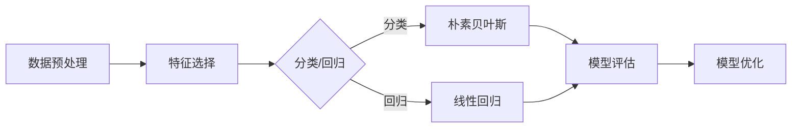

> 机器学习, 深度学习, 神经网络, 梯度下降, 反向传播, 优化算法, 朴素贝叶斯, 决策树, 随机森林, 支持向量机

# AI人工智能核心算法原理与代码实例讲解：算法实现

## 1. 背景介绍

人工智能（Artificial Intelligence, AI）作为计算机科学的一个分支，致力于研究、开发用于模拟、延伸和扩展人的智能的理论、方法、技术及应用系统。在过去的几十年里，随着计算能力的提升和数据量的爆炸式增长，人工智能取得了巨大的进步，尤其在机器学习（Machine Learning, ML）和深度学习（Deep Learning, DL）领域。本文将深入探讨AI领域的核心算法原理，并通过代码实例进行详细讲解。

## 2. 核心概念与联系

### 2.1 核心概念原理和架构的 Mermaid 流程图



### 2.2 核心概念解析

- **数据预处理**：在模型训练之前，需要对数据进行清洗、转换、标准化等操作，以提高数据质量和模型训练效率。
- **特征选择**：从大量特征中挑选出对模型预测任务最关键的少数特征，减少计算复杂度，提高模型性能。
- **分类/回归**：根据具体任务选择合适的分类算法或回归算法。
- **朴素贝叶斯**：基于贝叶斯定理和特征条件独立性假设的分类算法，适用于文本分类、情感分析等任务。
- **线性回归**：通过线性模型拟合特征与目标变量之间的关系，适用于数值预测任务。
- **模型评估**：使用准确率、召回率、F1分数等指标评估模型性能。
- **模型优化**：通过调整模型参数或采用不同的优化算法来提高模型性能。

## 3. 核心算法原理 & 具体操作步骤

### 3.1 算法原理概述

本节将介绍几种常见的AI核心算法的原理。

### 3.2 算法步骤详解

#### 3.2.1 朴素贝叶斯

朴素贝叶斯算法通过计算每个类别下每个特征的联合概率，并使用贝叶斯定理计算后验概率来进行分类。

1. 计算先验概率 $P(C)$ 和条件概率 $P(F|C)$。
2. 使用贝叶斯定理计算后验概率 $P(C|F)$。
3. 选择后验概率最大的类别作为预测类别。

#### 3.2.2 线性回归

线性回归通过最小化预测值与真实值之间的平方差来拟合特征与目标变量之间的关系。

1. 设定线性模型 $y = \beta_0 + \beta_1x_1 + \beta_2x_2 + \cdots + \beta_nx_n$。
2. 使用最小二乘法求解模型参数 $\beta_0, \beta_1, \beta_2, \cdots, \beta_n$。

### 3.3 算法优缺点

#### 3.3.1 朴素贝叶斯

**优点**：

- 理论基础简单，易于理解和实现。
- 对特征独立性的假设不严格，适用于一些实际场景。

**缺点**：

- 对缺失值敏感。
- 不适用于非线性关系。

#### 3.3.2 线性回归

**优点**：

- 理论基础成熟，易于理解和实现。
- 对线性关系拟合效果较好。

**缺点**：

- 不适用于非线性关系。
- 对异常值敏感。

### 3.4 算法应用领域

- **朴素贝叶斯**：文本分类、情感分析、垃圾邮件过滤等。
- **线性回归**：房价预测、股票价格预测、用户行为预测等。

## 4. 数学模型和公式 & 详细讲解 & 举例说明

### 4.1 数学模型构建

#### 4.1.1 朴素贝叶斯

$$
P(C|F_1, F_2, \cdots, F_n) = \frac{P(F_1, F_2, \cdots, F_n|C)P(C)}{P(F_1, F_2, \cdots, F_n)}
$$

#### 4.1.2 线性回归

$$
\beta = (X^TX)^{-1}X^TY
$$

### 4.2 公式推导过程

#### 4.2.1 朴素贝叶斯

根据贝叶斯定理：

$$
P(C|F_1, F_2, \cdots, F_n) = \frac{P(F_1, F_2, \cdots, F_n|C)P(C)}{P(F_1, F_2, \cdots, F_n)}
$$

根据特征条件独立性假设：

$$
P(F_1, F_2, \cdots, F_n|C) = P(F_1|C) \times P(F_2|C) \times \cdots \times P(F_n|C)
$$

根据全概率公式：

$$
P(F_1, F_2, \cdots, F_n) = \sum_{C}P(C)P(F_1, F_2, \cdots, F_n|C)
$$

将上述公式代入贝叶斯定理，得到：

$$
P(C|F_1, F_2, \cdots, F_n) = \frac{P(F_1|C) \times P(F_2|C) \times \cdots \times P(F_n|C) \times P(C)}{\sum_{C}P(F_1, F_2, \cdots, F_n|C)P(C)}
$$

#### 4.2.2 线性回归

根据最小二乘法：

$$
\beta = (X^TX)^{-1}X^TY
$$

其中，$X$ 为特征矩阵，$Y$ 为目标变量向量。

### 4.3 案例分析与讲解

#### 4.3.1 朴素贝叶斯

假设我们要预测一篇邮件是否为垃圾邮件，其中邮件文本为特征，邮件类别为标签。我们可以使用朴素贝叶斯算法进行分类。

#### 4.3.2 线性回归

假设我们要预测房价，其中房屋面积、房间数量、地理位置等特征与房价之间存在线性关系。我们可以使用线性回归算法进行预测。

## 5. 项目实践：代码实例和详细解释说明

### 5.1 开发环境搭建

使用Python编程语言和scikit-learn库实现朴素贝叶斯和线性回归算法。

### 5.2 源代码详细实现

```python
from sklearn.model_selection import train_test_split
from sklearn.naive_bayes import GaussianNB
from sklearn.linear_model import LinearRegression
from sklearn.metrics import accuracy_score, mean_squared_error

# 朴素贝叶斯
def naive_bayes_example():
    # 加载数据
    X, y = load_data()  # 加载数据
    # 划分训练集和测试集
    X_train, X_test, y_train, y_test = train_test_split(X, y, test_size=0.2, random_state=42)
    # 创建朴素贝叶斯模型
    nb_model = GaussianNB()
    # 训练模型
    nb_model.fit(X_train, y_train)
    # 预测测试集
    y_pred = nb_model.predict(X_test)
    # 评估模型
    print(f"Accuracy: {accuracy_score(y_test, y_pred)}")

# 线性回归
def linear_regression_example():
    # 加载数据
    X, y = load_data()  # 加载数据
    # 划分训练集和测试集
    X_train, X_test, y_train, y_test = train_test_split(X, y, test_size=0.2, random_state=42)
    # 创建线性回归模型
    lr_model = LinearRegression()
    # 训练模型
    lr_model.fit(X_train, y_train)
    # 预测测试集
    y_pred = lr_model.predict(X_test)
    # 评估模型
    print(f"MSE: {mean_squared_error(y_test, y_pred)}")

# 调用函数
naive_bayes_example()
linear_regression_example()
```

### 5.3 代码解读与分析

上述代码实现了朴素贝叶斯和线性回归算法的基本功能。首先，加载数据并划分训练集和测试集。然后，创建相应的模型，进行模型训练和预测。最后，评估模型性能。

### 5.4 运行结果展示

运行上述代码，可以得到朴素贝叶斯和线性回归模型的性能指标，如准确率或均方误差。

## 6. 实际应用场景

AI人工智能核心算法在各个领域都有广泛的应用，以下列举几个例子：

- **金融领域**：信用评估、风险控制、投资策略、智能投顾等。
- **医疗领域**：疾病诊断、药物研发、健康管理等。
- **工业领域**：故障预测、智能控制、生产优化等。
- **教育领域**：个性化推荐、智能辅导、考试评分等。

## 7. 工具和资源推荐

### 7.1 学习资源推荐

- 《机器学习》：周志华
- 《深度学习》：Ian Goodfellow、Yoshua Bengio、Aaron Courville
- 《Python机器学习》：Sebastian Raschka

### 7.2 开发工具推荐

- Python编程语言
- scikit-learn库
- TensorFlow
- PyTorch

### 7.3 相关论文推荐

- "A Few Useful Things to Know about Machine Learning" by Pedro Domingos
- "Deep Learning" by Ian Goodfellow、Yoshua Bengio、Aaron Courville
- "ImageNet Classification with Deep Convolutional Neural Networks" by Alex Krizhevsky、Ilya Sutskever、Geoffrey Hinton

## 8. 总结：未来发展趋势与挑战

### 8.1 研究成果总结

本文介绍了AI人工智能核心算法的原理和实现，并通过代码实例进行了详细讲解。这些算法在各个领域都有广泛的应用，推动了人工智能技术的发展。

### 8.2 未来发展趋势

- **算法的自动化和智能化**：开发更加自动化、智能化的算法，降低算法开发门槛，提高开发效率。
- **算法的可解释性和可解释性**：提高算法的可解释性和可解释性，增强用户对算法的信任度。
- **算法的鲁棒性和安全性**：提高算法的鲁棒性和安全性，避免算法在极端情况下出现错误。

### 8.3 面临的挑战

- **数据质量和数量**：提高数据质量和数量，为算法提供更好的训练素材。
- **算法性能和效率**：提高算法性能和效率，降低算法计算复杂度。
- **算法的可解释性和可解释性**：提高算法的可解释性和可解释性，增强用户对算法的信任度。

### 8.4 研究展望

未来，人工智能领域将继续快速发展，算法研究和应用将不断深入。以下是一些值得关注的趋势：

- **多模态学习**：融合图像、文本、语音等多模态信息，提高模型的智能水平。
- **强化学习**：将强化学习应用于实际场景，实现更加智能的决策和控制系统。
- **知识表示**：将知识表示技术应用于AI模型，提高模型的推理能力和智能水平。

## 9. 附录：常见问题与解答

### 9.1 机器学习与深度学习有何区别？

机器学习是人工智能的一个分支，它研究如何让计算机从数据中学习规律并应用于实际问题。深度学习是机器学习的一个子领域，它使用人工神经网络模拟人脑神经元之间的连接，通过学习大量数据来提取特征和模式。

### 9.2 如何选择合适的机器学习算法？

选择合适的机器学习算法需要考虑以下因素：

- 数据类型：如分类、回归、聚类等。
- 数据特征：如特征维度、特征分布等。
- 训练数据量：如数据量大小、数据分布等。
- 算法复杂度：如模型复杂度、计算复杂度等。

### 9.3 如何评估机器学习模型的性能？

评估机器学习模型的性能可以使用以下指标：

- 准确率：正确预测样本的比例。
- 召回率：被正确预测的负例比例。
- F1分数：准确率和召回率的调和平均数。
- AUC：ROC曲线下面积。

作者：禅与计算机程序设计艺术 / Zen and the Art of Computer Programming