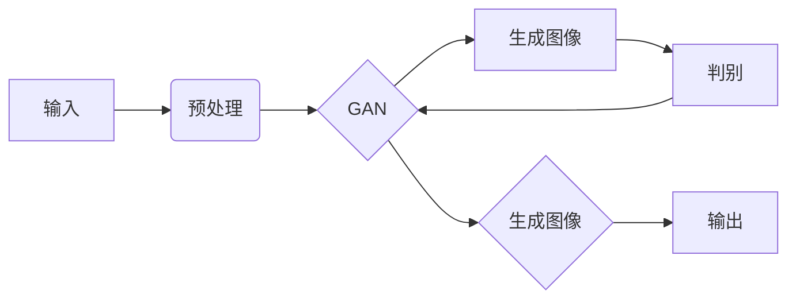

# AI图像生成对创意产业的影响

> 关键词：AI图像生成，创意产业，深度学习，生成对抗网络，艺术创作，商业应用，伦理挑战

## 1. 背景介绍

近年来，随着深度学习技术的飞速发展，AI图像生成技术逐渐从实验室走向实际应用，为创意产业带来了革命性的变化。AI图像生成技术能够根据文字描述、图像提示或数据驱动的方式，自动生成具有高度真实感的图像、视频和动画。这一技术不仅极大地丰富了创意产业的内容生产方式，也为艺术家、设计师、广告商等从业者提供了新的工具和灵感来源。本文将深入探讨AI图像生成技术对创意产业的影响，分析其原理、应用场景、潜在挑战以及未来发展趋势。

## 2. 核心概念与联系

### 2.1 核心概念

- **深度学习**：一种模拟人脑神经网络结构的学习方法，通过多层非线性变换来提取数据特征，并用于预测或分类。
- **生成对抗网络（GAN）**：一种由生成器和判别器组成的深度学习模型，生成器生成数据，判别器判断生成数据的真实性，两者相互竞争以提升生成质量。
- **风格迁移**：将一种艺术作品的风格应用到另一幅图像上，以生成具有特定风格的图像。
- **图像合成**：根据输入的图像和参数，生成新的图像或视频。

### 2.2 核心概念原理和架构的 Mermaid 流程图



### 2.3 核心概念联系

AI图像生成技术是深度学习的一个分支，其中GAN是最为核心的技术之一。GAN由生成器和判别器组成，生成器根据输入生成数据，判别器判断生成数据的真实性。通过不断的迭代优化，生成器能够生成越来越逼真的图像。此外，风格迁移和图像合成技术可以与GAN结合，实现更丰富的图像生成效果。

## 3. 核心算法原理 & 具体操作步骤

### 3.1 算法原理概述

AI图像生成算法的核心是深度学习中的生成对抗网络（GAN）。GAN由两个主要部分组成：生成器和判别器。生成器的目标是生成与真实数据分布相近的样本，而判别器的目标是区分真实样本和生成样本。两者在训练过程中相互对抗，不断优化，最终生成器能够生成高质量、难以区分的图像。

### 3.2 算法步骤详解

1. **数据预处理**：对输入数据（如图像、文字等）进行预处理，包括标准化、去噪等操作。
2. **生成器训练**：生成器根据输入数据生成图像，判别器评估图像的真实性。
3. **判别器训练**：判别器根据真实图像和生成图像评估其真实性，并对生成器进行反馈。
4. **迭代优化**：生成器和判别器交替训练，不断优化，直至生成器生成的图像质量达到预期。

### 3.3 算法优缺点

**优点**：

- 能够生成高质量、逼真的图像。
- 可以处理各种类型的图像生成任务，如图像合成、风格迁移等。
- 无需大量标注数据，适合无监督或半监督学习。

**缺点**：

- 训练过程不稳定，容易出现模式崩溃等问题。
- 模型难以解释，难以理解生成图像的生成机制。
- 对计算资源要求较高。

### 3.4 算法应用领域

AI图像生成技术在创意产业中具有广泛的应用领域，包括：

- **艺术创作**：艺术家可以使用AI图像生成技术进行创作，生成新的艺术作品。
- **广告设计**：设计师可以使用AI图像生成技术快速生成广告素材，提高工作效率。
- **游戏开发**：游戏开发者可以使用AI图像生成技术生成游戏场景、角色等元素。
- **虚拟现实**：虚拟现实应用中，可以使用AI图像生成技术生成逼真的虚拟环境。

## 4. 数学模型和公式 & 详细讲解 & 举例说明

### 4.1 数学模型构建

GAN的数学模型如下：

$$
G(z) = \mathcal{D}(z)
$$

其中，$G(z)$ 是生成器，$z$ 是输入噪声，$\mathcal{D}(x)$ 是判别器。

### 4.2 公式推导过程

GAN的训练过程可以理解为以下两个优化的组合：

1. **生成器优化**：最小化判别器损失函数 $\mathcal{L}_D(G(z))$，即生成器生成数据的真实性。
2. **判别器优化**：最大化判别器损失函数 $\mathcal{L}_D(G(z))$，即区分真实数据和生成数据的难度。

### 4.3 案例分析与讲解

以下是一个简单的AI图像生成案例：

假设我们有一个生成器 $G(z)$，输入噪声 $z$，判别器 $\mathcal{D}(x)$，真实图像数据集 $D$。我们的目标是使用GAN生成与数据集 $D$ 中图像风格相似的图像。

1. 初始化生成器 $G(z)$ 和判别器 $\mathcal{D}(x)$。
2. 随机生成噪声 $z$，通过生成器 $G(z)$ 生成图像 $G(z)$。
3. 判别器 $\mathcal{D}(x)$ 评估图像 $G(z)$ 和真实图像 $x$ 的真实性。
4. 根据判别器的反馈，更新生成器 $G(z)$ 和判别器 $\mathcal{D}(x)$ 的参数。
5. 重复步骤2-4，直至生成器生成的图像质量满足预期。

通过以上步骤，生成器 $G(z)$ 能够学习到如何生成与真实图像数据集 $D$ 中图像风格相似的图像。

## 5. 项目实践：代码实例和详细解释说明

### 5.1 开发环境搭建

以下是使用Python和PyTorch框架进行GAN图像生成项目的基本环境搭建步骤：

1. 安装PyTorch和torchvision库：
```bash
pip install torch torchvision
```

2. 安装必要的依赖库：
```bash
pip install matplotlib numpy torchvision
```

### 5.2 源代码详细实现

以下是一个简单的GAN图像生成项目示例代码：

```python
import torch
import torch.nn as nn
import torch.optim as optim
from torchvision import datasets, transforms
from torch.utils.data import DataLoader
import matplotlib.pyplot as plt

# 定义生成器
class Generator(nn.Module):
    def __init__(self):
        super(Generator, self).__init__()
        self.net = nn.Sequential(
            nn.Linear(100, 128),
            nn.ReLU(),
            nn.Linear(128, 256),
            nn.ReLU(),
            nn.Linear(256, 512),
            nn.ReLU(),
            nn.Linear(512, 1024),
            nn.ReLU(),
            nn.Linear(1024, 784),
            nn.Tanh()
        )

    def forward(self, x):
        return self.net(x)

# 定义判别器
class Discriminator(nn.Module):
    def __init__(self):
        super(Discriminator, self).__init__()
        self.net = nn.Sequential(
            nn.Linear(784, 512),
            nn.LeakyReLU(0.2),
            nn.Linear(512, 256),
            nn.LeakyReLU(0.2),
            nn.Linear(256, 128),
            nn.LeakyReLU(0.2),
            nn.Linear(128, 1),
            nn.Sigmoid()
        )

    def forward(self, x):
        return self.net(x).view(x.size(0), 1)

# 初始化生成器和判别器
gen = Generator().to(device)
dis = Discriminator().to(device)

# 定义损失函数和优化器
criterion = nn.BCELoss()
optimizer_g = optim.Adam(gen.parameters(), lr=0.0002)
optimizer_d = optim.Adam(dis.parameters(), lr=0.0002)

# 数据加载
transform = transforms.Compose([transforms.ToTensor(), transforms.Normalize((0.5,), (0.5,))])
dataset = datasets.MNIST(root='./data', train=True, download=True, transform=transform)
dataloader = DataLoader(dataset, batch_size=64, shuffle=True)

# 训练模型
for epoch in range(epochs):
    for i, data in enumerate(dataloader):
        real_images = data[0].to(device)
        real_labels = torch.ones(real_images.size(0), 1).to(device)

        # 训练判别器
        optimizer_d.zero_grad()
        dis_out_real = dis(real_images)
        dis_loss_real = criterion(dis_out_real, real_labels)
        dis_loss_real.backward()

        fake_images = gen(noise).to(device)
        fake_labels = torch.zeros(fake_images.size(0), 1).to(device)
        dis_out_fake = dis(fake_images.detach())
        dis_loss_fake = criterion(dis_out_fake, fake_labels)
        dis_loss_fake.backward()

        dis_loss = dis_loss_real + dis_loss_fake
        optimizer_d.step()

        # 训练生成器
        optimizer_g.zero_grad()
        fake_labels = torch.ones(fake_images.size(0), 1).to(device)
        gen_out_fake = dis(fake_images)
        gen_loss = criterion(gen_out_fake, fake_labels)
        gen_loss.backward()
        optimizer_g.step()

        # 绘制图像
        if i % 100 == 0:
            plt.imshow(real_images[0].cpu().reshape(28, 28), cmap='gray')
            plt.show()

# 保存生成器模型
torch.save(gen.state_dict(), 'generator.pth')
```

### 5.3 代码解读与分析

以上代码实现了一个简单的GAN图像生成项目。首先，定义了生成器和判别器的网络结构。然后，初始化了损失函数和优化器。接着，加载了MNIST数据集，并使用DataLoader进行批量加载。在训练过程中，交替训练生成器和判别器，直到模型收敛。最后，绘制了部分生成的图像，并保存了生成器模型。

## 6. 实际应用场景

### 6.1 艺术创作

AI图像生成技术为艺术家提供了新的创作工具。艺术家可以结合自己的创意，利用AI生成独特的艺术作品。例如，艺术家可以输入自己的绘画风格，让AI生成具有该风格的新作品；或者输入一系列主题，让AI创作一系列相关的画作。

### 6.2 广告设计

广告设计师可以利用AI图像生成技术快速生成广告素材。例如，设计师可以根据客户的需求，输入产品信息、品牌形象等关键元素，让AI生成符合要求的广告图片或视频。

### 6.3 游戏开发

游戏开发者可以使用AI图像生成技术生成游戏场景、角色等元素，提高游戏开发的效率和品质。例如，开发者可以根据游戏世界观，让AI生成各种地形、建筑、角色等，节省了大量的人工创作时间。

### 6.4 虚拟现实

虚拟现实应用中，可以使用AI图像生成技术生成逼真的虚拟环境。例如，开发者可以根据用户的需求，生成特定的虚拟场景，如办公空间、度假胜地等。

## 7. 工具和资源推荐

### 7.1 学习资源推荐

1. 《深度学习》（Ian Goodfellow等著）：介绍了深度学习的基本原理和应用，包括GAN等生成模型。
2. 《生成对抗网络：原理与实践》（郭嘉宁著）：详细介绍了GAN的原理、实现和应用。
3. fast.ai：提供了一系列免费在线课程，涵盖深度学习和GAN等前沿技术。

### 7.2 开发工具推荐

1. PyTorch：开源深度学习框架，支持GAN等生成模型。
2. TensorFlow：开源深度学习框架，支持GAN等生成模型。
3. Keras：Python深度学习库，可以方便地构建和训练GAN等生成模型。

### 7.3 相关论文推荐

1. Generative Adversarial Nets（Ian Goodfellow等，2014）：GAN的开创性论文，详细介绍了GAN的原理和实现。
2. Unsupervised Representation Learning with Deep Convolutional Generative Adversarial Networks（Alec Radford等，2015）：介绍了DCGAN，一种基于卷积神经网络的GAN。
3. Instance Normalization: The Missing Ingredient for Fast Stylization（Tero Karras等，2017）：介绍了Instance Normalization技术，提高了GAN的训练效率。

## 8. 总结：未来发展趋势与挑战

### 8.1 研究成果总结

AI图像生成技术在创意产业中具有广泛的应用前景。通过深度学习技术和GAN等生成模型，AI图像生成技术能够生成高质量、逼真的图像，为艺术家、设计师、广告商等从业者提供了新的工具和灵感来源。

### 8.2 未来发展趋势

1. **模型更复杂**：随着深度学习技术的不断发展，AI图像生成模型的复杂度将不断提高，生成图像的质量也将得到进一步提升。
2. **应用更广泛**：AI图像生成技术将在更多创意产业领域得到应用，如电影特效、建筑可视化、医学影像等。
3. **伦理和法规**：随着AI图像生成技术的应用，伦理和法规问题将逐渐凸显，如何确保AI图像生成的合理使用将成为重要议题。

### 8.3 面临的挑战

1. **计算资源**：AI图像生成技术对计算资源要求较高，需要不断优化算法和硬件，以满足大规模应用需求。
2. **伦理和法规**：如何确保AI图像生成的合理使用，避免滥用和误用，是亟待解决的问题。
3. **可解释性**：目前AI图像生成模型的可解释性较差，如何提高模型的可解释性，使其更容易被人类理解，是未来研究的重要方向。

### 8.4 研究展望

AI图像生成技术将在未来继续保持快速发展，为创意产业带来更多可能性。未来，AI图像生成技术将更加注重计算效率、伦理和可解释性，以满足更广泛的应用需求。

## 9. 附录：常见问题与解答

**Q1：AI图像生成技术是否能够替代人类艺术家？**

A：AI图像生成技术可以辅助人类艺术家进行创作，但无法完全替代人类艺术家。艺术家的创造力、情感表达和审美观念是AI无法复制的。

**Q2：AI图像生成技术是否可能被滥用？**

A：AI图像生成技术确实存在被滥用的风险。为了防止滥用，需要加强法律法规和伦理道德约束，确保AI图像生成技术的合理使用。

**Q3：AI图像生成技术的未来发展趋势是什么？**

A：AI图像生成技术将朝着更高质量、更广泛的应用、更高的计算效率、更强的可解释性等方向发展。

**Q4：如何学习AI图像生成技术？**

A：学习AI图像生成技术需要掌握深度学习、GAN等基础知识。可以参考相关书籍、在线课程和开源项目，逐步提升自己的技术水平。

作者：禅与计算机程序设计艺术 / Zen and the Art of Computer Programming