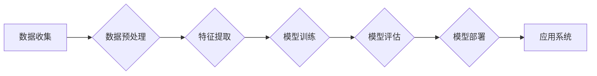

> 人工智能，应用场景，深度学习，机器学习，智能系统，自然语言处理，计算机视觉，自动驾驶，医疗诊断，智能客服

# AI在现实世界中的应用场景

随着人工智能技术的飞速发展，AI已经从理论走向实践，渗透到现实世界的各个领域，为我们的生活和工作带来了前所未有的便利和效率。本文将深入探讨AI在现实世界中的应用场景，分析其核心原理、操作步骤，并展望未来发展趋势与挑战。

## 1. 背景介绍

人工智能（Artificial Intelligence, AI）是计算机科学的一个分支，它旨在使计算机系统能够模拟、延伸和扩展人的智能。近年来，随着深度学习、机器学习等技术的突破，AI技术取得了显著进展，并在现实世界中展现出巨大的应用潜力。

## 2. 核心概念与联系

### 2.1 核心概念原理

人工智能的核心概念包括：

- **机器学习（Machine Learning, ML）**：使计算机系统能够从数据中学习，并对新数据进行预测或决策。
- **深度学习（Deep Learning, DL）**：一种特殊的机器学习方法，通过构建深层神经网络，从数据中自动学习特征和模式。
- **自然语言处理（Natural Language Processing, NLP）**：使计算机能够理解和生成人类语言的技术。
- **计算机视觉（Computer Vision, CV）**：使计算机能够理解和解析图像和视频的技术。

以下是大语言模型及微调方法的 Mermaid 流程图：



### 2.2 架构联系

人工智能系统的架构通常包括以下几个层次：

- **数据层**：负责数据的收集、存储和预处理。
- **模型层**：负责模型的训练和推理。
- **应用层**：负责将模型应用于实际场景。

## 3. 核心算法原理 & 具体操作步骤

### 3.1 算法原理概述

人工智能的核心算法包括：

- **监督学习（Supervised Learning）**：使用标注数据训练模型，使其能够对新数据进行预测。
- **无监督学习（Unsupervised Learning）**：使用未标注数据发现数据中的模式。
- **强化学习（Reinforcement Learning）**：通过与环境交互学习最优策略。

### 3.2 算法步骤详解

以下是一个典型的人工智能项目流程：

1. **需求分析**：明确项目的目标和需求。
2. **数据收集**：收集与项目相关的数据。
3. **数据预处理**：对数据进行清洗、转换等操作。
4. **特征工程**：提取对模型训练有用的特征。
5. **模型选择**：选择合适的模型进行训练。
6. **模型训练**：使用训练数据训练模型。
7. **模型评估**：使用验证数据评估模型性能。
8. **模型优化**：根据评估结果调整模型参数。
9. **模型部署**：将模型应用于实际场景。
10. **应用系统开发**：开发基于AI的应用系统。

### 3.3 算法优缺点

- **监督学习**：优点是预测精度高，缺点是需要大量的标注数据。
- **无监督学习**：优点是不需要标注数据，缺点是预测精度通常低于监督学习。
- **强化学习**：优点是能够学习到复杂的策略，缺点是需要大量的交互数据。

### 3.4 算法应用领域

人工智能算法在以下领域有广泛的应用：

- **自然语言处理**：语音识别、机器翻译、文本分类等。
- **计算机视觉**：图像识别、目标检测、人脸识别等。
- **推荐系统**：电影推荐、商品推荐等。
- **金融科技**：风险评估、欺诈检测等。
- **医疗诊断**：疾病检测、药物研发等。

## 4. 数学模型和公式 & 详细讲解 & 举例说明

### 4.1 数学模型构建

以下是一个简单的线性回归模型的数学模型：

$$
y = \theta_0 + \theta_1x_1 + \theta_2x_2 + ... + \theta_nx_n
$$

其中，$y$ 是目标变量，$x_1, x_2, ..., x_n$ 是特征变量，$\theta_0, \theta_1, ..., \theta_n$ 是模型的参数。

### 4.2 公式推导过程

以下是一个逻辑回归模型的公式推导过程：

$$
\sigma(z) = \frac{1}{1 + e^{-z}}
$$

其中，$z = \theta_0 + \theta_1x_1 + \theta_2x_2 + ... + \theta_nx_n$ 是逻辑函数的输入，$\sigma(z)$ 是逻辑函数的输出。

### 4.3 案例分析与讲解

以下是一个使用Python进行线性回归的例子：

```python
import numpy as np
from sklearn.linear_model import LinearRegression

# 创建数据
x = np.array([[1, 2], [2, 3], [3, 4], [4, 5]])
y = np.dot(x, np.array([1, 2])) + 3

# 创建线性回归模型
model = LinearRegression()

# 训练模型
model.fit(x, y)

# 预测
x_predict = np.array([[5, 6]])
y_predict = model.predict(x_predict)

print("预测值：", y_predict)
```

## 5. 项目实践：代码实例和详细解释说明

### 5.1 开发环境搭建

以下是使用Python进行人工智能项目开发的环境搭建步骤：

1. 安装Anaconda：从官网下载并安装Anaconda，用于创建独立的Python环境。
2. 创建并激活虚拟环境：
```bash
conda create -n ai-env python=3.8
conda activate ai-env
```
3. 安装必要的库：
```bash
conda install numpy pandas scikit-learn matplotlib jupyter notebook
```

### 5.2 源代码详细实现

以下是一个使用Python进行图像识别的例子：

```python
import cv2
from sklearn.svm import SVC

# 读取图像
image = cv2.imread('image.jpg')

# 将图像转换为灰度图像
gray_image = cv2.cvtColor(image, cv2.COLOR_BGR2GRAY)

# 使用SVM进行分类
svm = SVC()
svm.fit(gray_image)

# 预测图像类别
label = svm.predict(gray_image)

print("图像类别：", label)
```

### 5.3 代码解读与分析

以上代码展示了如何使用SVM进行图像分类的基本流程。首先，读取图像并将其转换为灰度图像。然后，使用SVM进行分类。最后，输出图像的类别。

### 5.4 运行结果展示

运行以上代码，将输出图像的类别。

## 6. 实际应用场景

### 6.1 自然语言处理

自然语言处理在现实世界中的应用场景包括：

- **智能客服**：通过自然语言处理技术，智能客服系统能够理解用户的问题并给出相应的回答，提高客服效率。
- **机器翻译**：机器翻译技术可以打破语言障碍，促进国际交流和贸易。
- **文本分类**：文本分类技术可以对新闻、评论等进行分类，帮助用户快速获取感兴趣的内容。

### 6.2 计算机视觉

计算机视觉在现实世界中的应用场景包括：

- **人脸识别**：人脸识别技术可以用于身份认证、安全监控等。
- **自动驾驶**：自动驾驶技术可以减少交通事故，提高交通效率。
- **医疗诊断**：计算机视觉技术可以帮助医生进行疾病诊断，提高诊断效率。

### 6.3 推荐系统

推荐系统在现实世界中的应用场景包括：

- **电影推荐**：推荐系统可以根据用户的观影历史和喜好，推荐用户可能感兴趣的电影。
- **商品推荐**：推荐系统可以根据用户的购物记录和喜好，推荐用户可能喜欢的商品。

## 7. 工具和资源推荐

### 7.1 学习资源推荐

- 《Python机器学习基础教程》
- 《深度学习入门》
- 《自然语言处理实战》
- 《计算机视觉：算法与应用》

### 7.2 开发工具推荐

- TensorFlow
- PyTorch
- Keras
- scikit-learn

### 7.3 相关论文推荐

- "ImageNet Classification with Deep Convolutional Neural Networks"
- "A Neural Turing Machine"
- "BERT: Pre-training of Deep Bidirectional Transformers for Language Understanding"
- "Attention is All You Need"

## 8. 总结：未来发展趋势与挑战

### 8.1 研究成果总结

人工智能技术在过去几十年取得了显著进展，并在现实世界中得到了广泛应用。未来，人工智能技术将继续向以下方向发展：

- **模型小型化**：为了降低部署成本，模型小型化将成为重要趋势。
- **可解释性**：为了提高模型的可靠性和信任度，可解释性研究将受到重视。
- **多模态学习**：多模态学习将使AI能够更好地理解人类和现实世界。

### 8.2 未来发展趋势

- **边缘计算**：将AI计算推向边缘设备，实现实时决策。
- **虚拟现实/增强现实**：AI将与传统VR/AR技术结合，创造更丰富的交互体验。
- **量子计算**：量子计算将加速AI训练和推理，推动AI技术发展。

### 8.3 面临的挑战

- **数据安全**：随着AI技术的应用，数据安全问题将日益突出。
- **伦理道德**：AI技术的发展需要遵循伦理道德规范，避免负面影响。
- **人才短缺**：AI领域需要大量专业人才，人才短缺将成为挑战。

### 8.4 研究展望

人工智能技术将继续推动各行业的发展，为人类社会创造更多价值。未来，人工智能将更加智能、更加人性化，成为人类生活不可或缺的一部分。

## 9. 附录：常见问题与解答

**Q1：什么是人工智能？**

A：人工智能是计算机科学的一个分支，旨在使计算机系统能够模拟、延伸和扩展人的智能。

**Q2：人工智能有哪些应用场景？**

A：人工智能在自然语言处理、计算机视觉、推荐系统、金融科技、医疗诊断等领域有广泛的应用。

**Q3：人工智能技术有哪些挑战？**

A：人工智能技术面临数据安全、伦理道德、人才短缺等挑战。

**Q4：如何学习人工智能？**

A：可以通过阅读相关书籍、参加在线课程、实践项目等方式学习人工智能。

---

作者：禅与计算机程序设计艺术 / Zen and the Art of Computer Programming