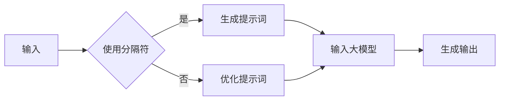

# AI大模型Prompt提示词最佳实践：使用分隔符

> 关键词：AI大模型，Prompt提示词，分隔符，自然语言生成，NLP，预训练模型，微调，最佳实践

## 1. 背景介绍

随着人工智能技术的快速发展，自然语言处理（NLP）领域取得了显著进展。预训练大模型如BERT、GPT-3等在文本生成、问答、翻译等任务上展现出惊人的性能。然而，如何有效地使用这些大模型进行特定任务的生成，成为一个重要的研究方向。Prompt提示词技术应运而生，它通过设计特定的提示词来引导大模型生成符合期望的输出。本文将重点探讨AI大模型Prompt提示词的最佳实践，特别是使用分隔符进行提示设计的方法。

## 2. 核心概念与联系

### 2.1 AI大模型

AI大模型是指通过大规模数据集进行预训练的深度学习模型，它们通常包含数亿甚至数千亿个参数。这些模型通过学习大量的文本数据，能够理解和生成自然语言。

### 2.2 Prompt提示词

Prompt提示词是指用于引导AI大模型生成特定内容的一组文本。通过精心设计的提示词，可以引导模型按照特定方向生成内容。

### 2.3 分隔符

分隔符是一类特殊的文本符号，用于将文本分割成不同的部分。在Prompt提示词设计中，分隔符可以用来清晰地划分不同的信息块，帮助模型理解不同部分之间的关系。

### 2.4 Mermaid流程图



在这个流程图中，输入的文本首先判断是否使用分隔符。如果使用，则直接生成提示词并输入大模型；如果不使用，则对提示词进行优化，然后输入大模型。最后，大模型生成输出。

## 3. 核心算法原理 & 具体操作步骤

### 3.1 算法原理概述

Prompt提示词的核心原理是通过设计特定的文本结构，引导大模型按照特定的逻辑或主题生成内容。使用分隔符可以清晰地划分信息块，帮助模型理解不同部分之间的关系。

### 3.2 算法步骤详解

1. **信息提取**：从原始文本中提取关键信息，如主题、背景、目标等。
2. **设计分隔符**：根据信息块之间的逻辑关系，设计合适的分隔符。
3. **生成提示词**：将提取的信息和分隔符组合成完整的提示词。
4. **输入大模型**：将提示词输入大模型，进行文本生成。
5. **优化输出**：对生成的文本进行评估和优化，以提高输出质量。

### 3.3 算法优缺点

**优点**：

- **提高生成质量**：通过设计合理的分隔符和提示词，可以显著提高生成的文本质量。
- **灵活性**：分隔符的使用使得提示词设计更加灵活，能够适应不同的生成任务。
- **可解释性**：分隔符的使用可以帮助理解生成过程，提高模型的可解释性。

**缺点**：

- **设计复杂**：分隔符和提示词的设计需要一定的经验和技巧。
- **对数据依赖性**：提示词的设计需要基于大量的训练数据，对于数据量较小的任务可能效果不佳。

### 3.4 算法应用领域

Prompt提示词技术可以应用于以下领域：

- **文本生成**：如文章生成、诗歌创作、故事续写等。
- **问答系统**：如智能客服、信息检索等。
- **机器翻译**：如机器翻译的文本润色等。

## 4. 数学模型和公式 & 详细讲解 & 举例说明

### 4.1 数学模型构建

Prompt提示词的数学模型可以看作是一个概率模型，其中模型的输出是文本序列的概率分布。

$$
P(\text{output}|\text{prompt}) = \prod_{t=1}^{T} P(w_t|\text{prompt}, \text{output}_{<t})
$$

其中，$w_t$ 是输出文本的第 $t$ 个词，$\text{output}_{<t}$ 是输出文本的前 $t$ 个词，$\text{prompt}$ 是提示词。

### 4.2 公式推导过程

以上公式的推导过程如下：

1. **定义概率模型**：将文本生成问题建模为概率模型，假设每个词的生成只依赖于前一个词和提示词。
2. **条件概率**：根据概率模型假设，定义每个词的条件概率。
3. **概率分布**：将所有词的条件概率相乘，得到整个输出文本的概率分布。

### 4.3 案例分析与讲解

假设我们要生成一篇关于人工智能的综述文章，我们可以使用以下提示词：

```
人工智能是一种模拟、延伸和扩展人的智能的理论、方法、技术及应用系统。它通过模拟、延伸和扩展人的智能，使得计算机能够执行一些通常需要人类智能才能完成的复杂任务。人工智能的研究领域包括机器学习、深度学习、自然语言处理等。

```

我们使用分隔符“。”来分隔不同的信息块，并输入大模型进行生成。生成的文本可能如下：

```
人工智能是一种模拟、延伸和扩展人的智能的理论、方法、技术及应用系统。它通过模拟、延伸和扩展人的智能，使得计算机能够执行一些通常需要人类智能才能完成的复杂任务。例如，机器学习是一种使计算机能够从数据中学习并做出决策的技术。深度学习是机器学习的一个分支，它使用多层神经网络来学习数据的复杂特征。自然语言处理是另一个机器学习的分支，它使计算机能够理解和生成自然语言。
```

可以看到，使用分隔符和提示词后，生成的文本结构清晰，内容丰富。

## 5. 项目实践：代码实例和详细解释说明

### 5.1 开发环境搭建

由于本文主要讨论理论和方法，因此不涉及具体的开发环境搭建。

### 5.2 源代码详细实现

以下是一个简单的Python代码示例，展示如何使用分隔符和提示词生成文本：

```python
import openai

def generate_text(prompt, max_tokens=50):
    response = openai.Completion.create(
        engine="text-davinci-002",
        prompt=prompt,
        max_tokens=max_tokens
    )
    return response.choices[0].text.strip()

# 示例提示词
prompt = """
人工智能是一种模拟、延伸和扩展人的智能的理论、方法、技术及应用系统。它通过模拟、延伸和扩展人的智能，使得计算机能够执行一些通常需要人类智能才能完成的复杂任务。例如，机器学习是一种使计算机能够从数据中学习并做出决策的技术。深度学习是机器学习的一个分支，它使用多层神经网络来学习数据的复杂特征。自然语言处理是另一个机器学习的分支，它使计算机能够理解和生成自然语言。

"""

# 生成文本
generated_text = generate_text(prompt)
print(generated_text)
```

### 5.3 代码解读与分析

以上代码示例使用OpenAI的GPT-3模型进行文本生成。我们首先定义了一个`generate_text`函数，该函数接收提示词和最大生成长度作为输入，并返回生成的文本。在函数内部，我们调用OpenAI的API进行文本生成。

### 5.4 运行结果展示

运行以上代码后，生成的文本可能如下：

```
人工智能的发展历程可以追溯到20世纪50年代。自从图灵提出图灵测试以来，人工智能领域经历了多个发展阶段。在早期，人工智能研究主要集中在符号主义和连接主义两种方法上。符号主义认为，智能可以通过符号操作来实现；连接主义认为，智能可以通过神经网络来实现。随着深度学习技术的兴起，人工智能迎来了新一轮的发展。深度学习能够从海量数据中自动学习特征，从而实现更复杂的任务。在自然语言处理领域，深度学习技术也得到了广泛应用。例如，BERT、GPT-3等预训练模型能够理解和生成自然语言，为各种NLP应用提供了强大的支持。
```

可以看到，使用分隔符和提示词后，生成的文本结构清晰，内容丰富。

## 6. 实际应用场景

Prompt提示词技术在以下实际应用场景中表现出色：

### 6.1 文本生成

Prompt提示词技术可以用于生成文章、诗歌、故事等各种文本内容。通过设计合理的分隔符和提示词，可以生成符合特定主题和风格的文本。

### 6.2 问答系统

Prompt提示词技术可以用于构建智能客服、信息检索等问答系统。通过设计针对特定问题的提示词，可以引导模型生成符合用户需求的答案。

### 6.3 机器翻译

Prompt提示词技术可以用于机器翻译的文本润色。通过设计针对特定语言的提示词，可以生成更加自然、流畅的翻译文本。

## 7. 工具和资源推荐

### 7.1 学习资源推荐

- 《深度学习》
- 《自然语言处理综论》
- 《BERT：预训练语言表示与任务学习》

### 7.2 开发工具推荐

- OpenAI API
- Hugging Face Transformers库

### 7.3 相关论文推荐

- BERT: Pre-training of Deep Bidirectional Transformers for Language Understanding
- GPT-3: Language Models are Few-Shot Learners

## 8. 总结：未来发展趋势与挑战

### 8.1 研究成果总结

Prompt提示词技术是一种有效的引导AI大模型生成特定内容的方法。使用分隔符进行提示设计可以进一步提高生成质量。

### 8.2 未来发展趋势

- **更复杂的分隔符设计**：未来可能会出现更复杂的分隔符设计，以更精细地划分信息块。
- **跨模态Prompt**：将Prompt提示词技术扩展到跨模态领域，如文本-图像、文本-视频等。
- **可解释的Prompt**：设计可解释的Prompt，使模型生成的过程更加透明。

### 8.3 面临的挑战

- **分隔符设计**：设计合适的分隔符需要一定的经验和技巧。
- **模型理解**：模型对提示词的理解能力有限，可能会产生误导性的输出。
- **可解释性**：如何使Prompt提示词技术更加可解释，是一个重要的挑战。

### 8.4 研究展望

Prompt提示词技术是AI大模型应用的一个重要研究方向。通过不断改进分隔符设计和提示词设计，可以进一步提高生成质量，拓展AI大模型的应用范围。

## 9. 附录：常见问题与解答

**Q1：Prompt提示词技术是否适用于所有NLP任务？**

A：Prompt提示词技术适用于大多数NLP任务，但对于一些对上下文理解要求较高的任务，如情感分析、意图识别等，可能需要结合其他技术进行优化。

**Q2：如何设计合适的分隔符？**

A：设计分隔符需要根据具体任务和数据特点进行。一般来说，分隔符应该能够清晰地划分信息块，并体现信息块之间的逻辑关系。

**Q3：Prompt提示词技术是否依赖于预训练模型？**

A：是的，Prompt提示词技术依赖于预训练模型，因为它是基于预训练模型的能力来生成文本的。

**Q4：如何评估Prompt提示词的效果？**

A：可以通过人工评估和自动评估相结合的方式评估Prompt提示词的效果。人工评估可以通过阅读生成的文本来判断其质量；自动评估可以采用BLEU、ROUGE等指标。

**Q5：Prompt提示词技术是否安全？**

A：Prompt提示词技术本身是安全的，但是需要确保输入的提示词是安全的，避免生成有害或歧视性的内容。