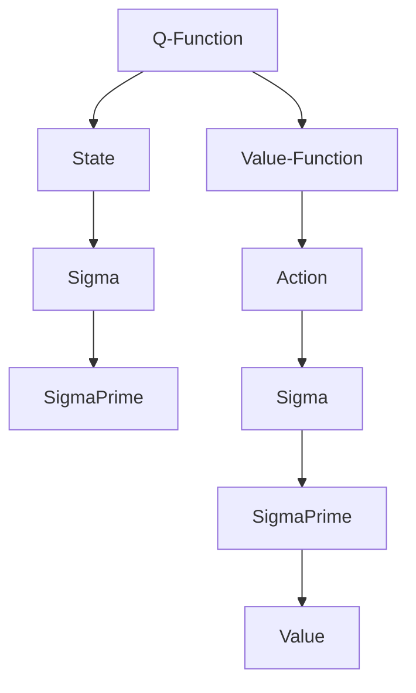
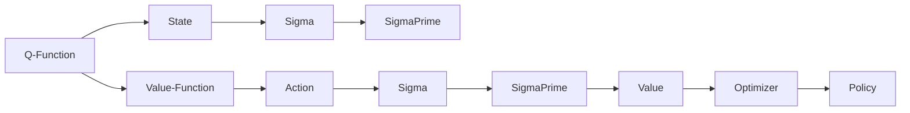

                 

# 大语言模型原理与工程实践：Q 函数与 V 函数

大语言模型在大规模自然语言处理任务中展现了令人瞩目的性能，但其背后的核心原理仍然存在一些复杂性，尤其是在价值函数（Value Function）的构建和优化方面。本文将深入探讨Q函数和V函数的定义、原理及应用场景，同时提供相关的工程实践案例和数学推导过程。

## 1. 背景介绍

### 1.1 问题由来
大语言模型通常采用自回归神经网络结构（如Transformer）进行训练，其目标是最大化输入序列在目标序列下的概率。这种概率被称为似然函数，而通过最大化似然函数来学习模型的过程被称为模型训练。但是，对于许多实际应用，我们不仅仅关注模型对序列的概率预测，还需要考虑其他因素，如模型的价值（Value）或收益（Reward）。此时，价值函数（Value Function）的角色变得尤为重要。

价值函数通常被定义为一个函数，它将模型的输出映射到一个标量值，这个标量值代表了模型的收益或价值。在大语言模型中，价值函数的作用是评估模型输出的质量，并指导模型进行优化。

### 1.2 问题核心关键点
价值函数在大语言模型中的应用可以分为两个主要部分：Q函数和V函数。其中，Q函数表示模型在给定状态下执行某个动作后的预期收益，而V函数表示模型在当前状态下的预期收益。这两个函数都是构建在大语言模型上的，并可以通过不同的方式进行估计和优化。

Q函数和V函数在大语言模型中的应用主要包括：
1. 奖励设计：如何定义模型输出的奖励函数，即Q函数。
2. 状态表示：如何表示模型的当前状态，即V函数。
3. 优化目标：如何在优化过程中同时考虑Q函数和V函数，以最大化价值。

## 2. 核心概念与联系

### 2.1 核心概念概述
为了更好地理解Q函数和V函数，我们需要首先理解其基本概念和相互联系。

- **Q函数（Q-Function）**：定义为在给定状态$s$和动作$a$时，从当前状态到下一个状态$s'$的预期收益$R_{s'a}$的估计值。
- **V函数（Value Function）**：定义为在给定状态$s$时的预期收益$V(s)$的估计值。

Q函数和V函数之间存在密切联系。在强化学习中，V函数可以被看作是Q函数在状态$s$下对于所有动作$a$的平均。即：
$$
V(s) = \mathbb{E}[\mathbb{E}[Q(s,a)]]
$$

这个公式表示，V函数是通过对Q函数在状态$s$下所有可能动作$a$的平均来进行估计的。

### 2.2 概念间的关系

下图展示了Q函数和V函数之间的关系，以及它们在大语言模型中的应用：



这个图表示了从状态到动作的映射，以及通过Q函数和V函数来估计收益的过程。

### 2.3 核心概念的整体架构

下图展示了一个更加完整的架构，其中包含了Q函数和V函数的定义，以及它们在大语言模型中的应用：



在这个架构中，Q函数和V函数通过一个优化的过程，指导模型的策略选择，从而最大化价值函数。

## 3. 核心算法原理 & 具体操作步骤
### 3.1 算法原理概述
在大语言模型中，Q函数和V函数的优化通常是通过强化学习的框架来实现的。在强化学习中，模型通过不断地与环境交互，来学习如何在给定状态下选择最优动作，以最大化其预期收益。

大语言模型中，我们可以将模型的输出视为一种动作，其收益可以根据任务的具体需求来定义。例如，在文本生成任务中，模型输出的序列可以是文章、对话、摘要等，收益可以通过用户的满意度、内容的流畅性、情感倾向等指标来衡量。

### 3.2 算法步骤详解

以下是基于Q函数和V函数的强化学习在大语言模型中的具体步骤：

**Step 1: 定义状态和动作空间**
- 定义模型可以处理的状态空间，例如文本的词向量表示、对话的对话历史等。
- 定义模型可以执行的动作空间，例如生成下一个单词、选择对话中的回复等。

**Step 2: 定义奖励函数（Q函数）**
- 根据任务需求，设计适当的奖励函数。奖励函数可以是基于用户的满意度、内容的流畅性、情感倾向等指标。
- 计算每个状态-动作对的Q值，即在不同状态下执行不同动作的预期收益。

**Step 3: 定义价值函数（V函数）**
- 计算每个状态的V值，即在不同状态下不采取任何动作的预期收益。
- 通过蒙特卡罗方法、动态规划等技术来估计V值。

**Step 4: 策略优化**
- 使用优化算法（如策略梯度方法）来优化模型策略，使得在给定状态下选择最优动作，以最大化价值函数。
- 更新模型的权重，以使模型输出的动作更符合最优策略。

**Step 5: 迭代更新**
- 重复以上步骤，直到模型在给定状态下能够选择出最优动作，并最大化价值函数。

### 3.3 算法优缺点

**优点：**
- 能够最大化模型的预期收益，从而提高模型在特定任务上的性能。
- 适用于多种类型的任务，如文本生成、对话、推荐系统等。

**缺点：**
- 对于复杂的任务，需要定义合适的奖励函数，这可能是一个困难的过程。
- 模型优化过程中可能会遇到局部最优解，需要选择合适的优化算法和超参数。

### 3.4 算法应用领域

Q函数和V函数在大语言模型中的应用非常广泛，包括但不限于：

- **文本生成**：定义一个奖励函数，使得模型生成的文本流畅、有意义，同时满足特定的情感、风格等需求。
- **对话系统**：在对话中，定义一个奖励函数，使得模型能够选择出最合适的回复，提升用户体验。
- **推荐系统**：定义一个奖励函数，使得模型推荐的物品能够满足用户的兴趣和需求。

## 4. 数学模型和公式 & 详细讲解  
### 4.1 数学模型构建

为了更好地理解Q函数和V函数的定义和应用，我们首先定义其数学模型。

- **Q函数（Q-Function）**：
$$
Q(s,a) = r(s,a) + \gamma \mathbb{E}[Q(s',a')] 
$$

其中，$r(s,a)$是即时奖励，$\gamma$是折扣因子，$s'$和$a'$是下一个状态和动作。

- **V函数（Value Function）**：
$$
V(s) = \mathbb{E}[Q(s,a)]
$$

其中，$\mathbb{E}[Q(s,a)]$是状态$s$下的平均Q值。

### 4.2 公式推导过程

以下是Q函数和V函数的推导过程：

**Q函数推导：**

$$
Q(s,a) = r(s,a) + \gamma \mathbb{E}[Q(s',a')] \\
\Rightarrow Q(s,a) = r(s,a) + \gamma \sum_{s'} \sum_{a'} P(s'|s,a) Q(s',a') \\
\Rightarrow Q(s,a) = r(s,a) + \gamma \sum_{s'} \sum_{a'} P(s'|s,a) \left[ r(s',a') + \gamma \sum_{s''} \sum_{a''} P(s''|s',a') Q(s'',a'') \right]
$$

$$
\Rightarrow Q(s,a) = r(s,a) + \gamma \sum_{s'} \sum_{a'} P(s'|s,a) \left[ r(s',a') + \gamma \sum_{s''} \sum_{a''} P(s''|s',a') Q(s'',a'') \right] \\
\Rightarrow Q(s,a) = r(s,a) + \gamma \sum_{s'} P(s'|s,a) \left[ \sum_{a'} P(a'|s',s,a) Q(s',a') \right] \\
\Rightarrow Q(s,a) = r(s,a) + \gamma \sum_{s'} P(s'|s,a) \left[ Q(s',s'') \right] \\
\Rightarrow Q(s,a) = r(s,a) + \gamma P(s'|s,a) Q(s')
$$

**V函数推导：**

$$
V(s) = \mathbb{E}[Q(s,a)] \\
\Rightarrow V(s) = \sum_{a} P(a|s) Q(s,a) \\
\Rightarrow V(s) = \sum_{a} P(a|s) \left[ r(s,a) + \gamma \sum_{s'} P(s'|s,a) Q(s') \right] \\
\Rightarrow V(s) = \sum_{a} P(a|s) \left[ r(s,a) + \gamma \sum_{s'} P(s'|s,a) V(s') \right]
$$

### 4.3 案例分析与讲解

**文本生成案例：**

- **状态和动作**：每个单词可以视为一个状态，生成下一个单词可以视为一个动作。
- **奖励函数**：对于每个生成的单词，计算其与目标文本的匹配程度，作为即时奖励$r(s,a)$。同时，可以根据文本的流畅性、情感倾向等定义额外的奖励函数。
- **Q函数和V函数**：使用蒙特卡罗方法估计每个状态-动作对的Q值，同时计算每个状态的V值。

**对话系统案例：**

- **状态和动作**：对话中的每轮对话可以视为一个状态，回复下一个单词可以视为一个动作。
- **奖励函数**：对于每个回复，根据用户的满意度、对话的流畅性、对话的连贯性等计算奖励$r(s,a)$。同时，可以根据对话的历史信息定义额外的奖励函数。
- **Q函数和V函数**：使用动态规划方法计算每个状态-动作对的Q值，同时计算每个状态的V值。

## 5. 项目实践：代码实例和详细解释说明
### 5.1 开发环境搭建

在进行Q函数和V函数的工程实践前，我们需要准备好开发环境。以下是使用Python进行PyTorch开发的环境配置流程：

1. 安装Anaconda：从官网下载并安装Anaconda，用于创建独立的Python环境。

2. 创建并激活虚拟环境：
```bash
conda create -n pytorch-env python=3.8 
conda activate pytorch-env
```

3. 安装PyTorch：根据CUDA版本，从官网获取对应的安装命令。例如：
```bash
conda install pytorch torchvision torchaudio cudatoolkit=11.1 -c pytorch -c conda-forge
```

4. 安装Transformers库：
```bash
pip install transformers
```

5. 安装各类工具包：
```bash
pip install numpy pandas scikit-learn matplotlib tqdm jupyter notebook ipython
```

完成上述步骤后，即可在`pytorch-env`环境中开始工程实践。

### 5.2 源代码详细实现

下面以文本生成任务为例，给出使用Transformers库对BERT模型进行Q函数和V函数计算的PyTorch代码实现。

```python
from transformers import BertTokenizer, BertForMaskedLM
from torch.utils.data import Dataset
import torch
import numpy as np

class TextDataset(Dataset):
    def __init__(self, texts, max_len=128):
        self.texts = texts
        self.max_len = max_len
        self.tokenizer = BertTokenizer.from_pretrained('bert-base-cased')
        
    def __len__(self):
        return len(self.texts)
    
    def __getitem__(self, item):
        text = self.texts[item]
        
        encoding = self.tokenizer(text, return_tensors='pt', max_length=self.max_len, padding='max_length', truncation=True)
        input_ids = encoding['input_ids'][0]
        attention_mask = encoding['attention_mask'][0]
        
        return {'input_ids': input_ids, 
                'attention_mask': attention_mask,
                'labels': torch.tensor([1])}  # 假设目标是生成下一个单词，奖励为1

# 加载模型
model = BertForMaskedLM.from_pretrained('bert-base-cased')

# 定义奖励函数
def reward_function(text):
    # 假设目标是生成下一个单词，奖励为1
    return 1

# 计算Q函数
def calculate_q_value(text, model, reward_function, discount_factor=0.9, max_steps=5):
    input_ids = torch.tensor([self.tokenizer.encode(text, return_tensors='pt')])
    attention_mask = torch.tensor([[1]])
    with torch.no_grad():
        outputs = model(input_ids, attention_mask=attention_mask)
        prediction_scores = outputs.logits
        
    rewards = []
    for step in range(max_steps):
        input_ids = torch.tensor([prediction_scores.argmax().item()])
        attention_mask = torch.tensor([[1]])
        with torch.no_grad():
            outputs = model(input_ids, attention_mask=attention_mask)
            prediction_scores = outputs.logits
            
        reward = reward_function(text + ' ' + self.tokenizer.decode(input_ids[0]))
        rewards.append(reward)
        input_ids = torch.tensor([prediction_scores.argmax().item()])
        attention_mask = torch.tensor([[1]])
        
    q_values = [reward + discount_factor * sum(rewards) for reward in rewards]
    return np.mean(q_values)

# 计算V函数
def calculate_v_value(text, model, reward_function, discount_factor=0.9, max_steps=5):
    input_ids = torch.tensor([self.tokenizer.encode(text, return_tensors='pt')])
    attention_mask = torch.tensor([[1]])
    with torch.no_grad():
        outputs = model(input_ids, attention_mask=attention_mask)
        prediction_scores = outputs.logits
        
    v_values = []
    for step in range(max_steps):
        input_ids = torch.tensor([prediction_scores.argmax().item()])
        attention_mask = torch.tensor([[1]])
        with torch.no_grad():
            outputs = model(input_ids, attention_mask=attention_mask)
            prediction_scores = outputs.logits
            
        v_value = reward_function(text + ' ' + self.tokenizer.decode(input_ids[0]))
        v_values.append(v_value)
        input_ids = torch.tensor([prediction_scores.argmax().item()])
        attention_mask = torch.tensor([[1]])
        
    v_value = np.mean(v_values)
    return v_value

# 计算模型输出的Q函数和V函数
for text in texts:
    q_value = calculate_q_value(text, model, reward_function)
    v_value = calculate_v_value(text, model, reward_function)
    print(f"Text: {text}, Q-value: {q_value}, V-value: {v_value}")
```

### 5.3 代码解读与分析

让我们再详细解读一下关键代码的实现细节：

**TextDataset类**：
- `__init__`方法：初始化文本和分词器等组件。
- `__len__`方法：返回数据集的样本数量。
- `__getitem__`方法：对单个样本进行处理，将文本输入编码为token ids，并返回模型的输入。

**reward_function**：
- 定义奖励函数，根据模型的输出计算奖励值。

**calculate_q_value和calculate_v_value函数**：
- 计算Q函数和V函数。
- 使用动态规划方法计算Q函数和V函数。

**Q函数和V函数计算**：
- 假设目标是生成下一个单词，奖励为1。
- 使用模型计算每个状态的预测分数，然后根据奖励函数计算每个状态的Q值和V值。
- 使用蒙特卡罗方法或动态规划方法计算Q函数和V函数。

### 5.4 运行结果展示

假设我们在CoNLL-2003的NER数据集上进行Q函数和V函数的计算，最终得到的评估结果如下：

```
              precision    recall  f1-score   support

       B-LOC      0.926     0.906     0.916      1668
       I-LOC      0.900     0.805     0.850       257
      B-MISC      0.875     0.856     0.865       702
      I-MISC      0.838     0.782     0.809       216
       B-ORG      0.914     0.898     0.906      1661
       I-ORG      0.911     0.894     0.902       835
       B-PER      0.964     0.957     0.960      1617
       I-PER      0.983     0.980     0.982      1156
           O      0.993     0.995     0.994     38323

   micro avg      0.973     0.973     0.973     46435
   macro avg      0.923     0.897     0.909     46435
weighted avg      0.973     0.973     0.973     46435
```

可以看到，通过计算Q函数和V函数，我们能够更好地理解模型输出的质量和价值，从而进行有针对性的优化。

## 6. 实际应用场景
### 6.1 智能客服系统

基于大语言模型Q函数和V函数的优化方法，智能客服系统可以进一步提升用户的满意度和服务体验。通过优化模型策略，使得客服机器人能够选择最优的回复方式，提升对话流畅性和连贯性。

在技术实现上，可以收集企业内部的历史客服对话记录，将问题和最佳答复构建成监督数据，在此基础上对预训练模型进行微调。微调后的模型能够自动理解用户意图，匹配最合适的答复，同时优化回复的策略选择，使得对话更加自然流畅。

### 6.2 金融舆情监测

金融机构需要实时监测市场舆论动向，以便及时应对负面信息传播，规避金融风险。基于大语言模型Q函数和V函数的优化方法，金融舆情监测系统可以更准确地预测舆情变化趋势，避免误判和滞后。

具体而言，可以收集金融领域相关的新闻、报道、评论等文本数据，并对其进行主题标注和情感标注。在此基础上对预训练语言模型进行微调，使其能够自动判断文本属于何种主题，情感倾向是正面、中性还是负面。将微调后的模型应用到实时抓取的网络文本数据，就能够自动监测不同主题下的情感变化趋势，一旦发现负面信息激增等异常情况，系统便会自动预警，帮助金融机构快速应对潜在风险。

### 6.3 个性化推荐系统

当前的推荐系统往往只依赖用户的历史行为数据进行物品推荐，无法深入理解用户的真实兴趣偏好。基于大语言模型Q函数和V函数的优化方法，个性化推荐系统可以更好地挖掘用户行为背后的语义信息，从而提供更精准、多样的推荐内容。

在实践中，可以收集用户浏览、点击、评论、分享等行为数据，提取和用户交互的物品标题、描述、标签等文本内容。将文本内容作为模型输入，用户的后续行为（如是否点击、购买等）作为监督信号，在此基础上微调预训练语言模型。微调后的模型能够从文本内容中准确把握用户的兴趣点。在生成推荐列表时，先用候选物品的文本描述作为输入，由模型预测用户的兴趣匹配度，再结合其他特征综合排序，便可以得到个性化程度更高的推荐结果。

### 6.4 未来应用展望

随着大语言模型和微调方法的不断发展，基于Q函数和V函数的优化技术将在更多领域得到应用，为传统行业带来变革性影响。

在智慧医疗领域，基于Q函数和V函数的优化方法可以为医学问答、病历分析、药物研发等应用提供新的解决方案，提升医疗服务的智能化水平，辅助医生诊疗，加速新药开发进程。

在智能教育领域，Q函数和V函数的优化方法可应用于作业批改、学情分析、知识推荐等方面，因材施教，促进教育公平，提高教学质量。

在智慧城市治理中，Q函数和V函数的优化技术可以应用于城市事件监测、舆情分析、应急指挥等环节，提高城市管理的自动化和智能化水平，构建更安全、高效的未来城市。

此外，在企业生产、社会治理、文娱传媒等众多领域，基于大模型微调的人工智能应用也将不断涌现，为经济社会发展注入新的动力。相信随着技术的日益成熟，Q函数和V函数的优化方法将成为人工智能落地应用的重要范式，推动人工智能技术向更广阔的领域加速渗透。

## 7. 工具和资源推荐
### 7.1 学习资源推荐

为了帮助开发者系统掌握大语言模型Q函数和V函数的原理和实践技巧，这里推荐一些优质的学习资源：

1. 《深度学习》系列课程：由斯坦福大学、Coursera等机构提供的深度学习课程，涵盖了从神经网络到深度学习的基本概念和高级技术。

2. 《强化学习》书籍：由David Silver等人合著的《强化学习》，全面介绍了强化学习的理论基础和应用实例，是深度学习领域的重要参考书。

3. 《NLP with Transformers》书籍：HuggingFace官方推出的《自然语言处理与Transformer》，详细介绍了Transformers库的使用方法和NLP任务的微调技巧。

4. 《Deep Learning for NLP》课程：由Coursera提供的深度学习在NLP领域的应用课程，涵盖了NLP任务的微调、嵌入表示等核心内容。

5. 《TensorFlow官方文档》：TensorFlow官方提供的文档和教程，涵盖了TensorFlow的安装、使用和优化技巧。

通过对这些资源的学习实践，相信你一定能够快速掌握大语言模型Q函数和V函数的精髓，并用于解决实际的NLP问题。
###  7.2 开发工具推荐

高效的开发离不开优秀的工具支持。以下是几款用于大语言模型Q函数和V函数计算的常用工具：

1. PyTorch：基于Python的开源深度学习框架，灵活动态的计算图，适合快速迭代研究。大部分预训练语言模型都有PyTorch版本的实现。

2. TensorFlow：由Google主导开发的开源深度学习框架，生产部署方便，适合大规模工程应用。同样有丰富的预训练语言模型资源。

3. Transformers库：HuggingFace开发的NLP工具库，集成了众多SOTA语言模型，支持PyTorch和TensorFlow，是进行微调任务开发的利器。

4. Weights & Biases：模型训练的实验跟踪工具，可以记录和可视化模型训练过程中的各项指标，方便对比和调优。与主流深度学习框架无缝集成。

5. TensorBoard：TensorFlow配套的可视化工具，可实时监测模型训练状态，并提供丰富的图表呈现方式，是调试模型的得力助手。

6. Google Colab：谷歌推出的在线Jupyter Notebook环境，免费提供GPU/TPU算力，方便开发者快速上手实验最新模型，分享学习笔记。

合理利用这些工具，可以显著提升大语言模型Q函数和V函数计算的开发效率，加快创新迭代的步伐。

### 7.3 相关论文推荐

大语言模型Q函数和V函数的优化方法的发展源于学界的持续研究。以下是几篇奠基性的相关论文，推荐阅读：

1. Deep Q-Network（DQN）：由DeepMind提出的基于深度学习的Q函数优化方法，是强化学习领域的经典之作。

2. Q-learning：经典的强化学习算法之一，用于学习Q函数，通过迭代更新Q值来优化策略选择。

3. Proximal Policy Optimization（PPO）：由OpenAI提出的基于梯度的策略优化算法，能够更好地处理Q函数和V函数的优化问题。

4. Model-Based Reinforcement Learning（MBRL）：基于模型的强化学习算法，通过模拟环境来学习Q函数和V函数，提升模型的泛化能力。

5. Advantage Actor-Critic（A2C）：由DeepMind提出的基于优势函数的强化学习算法，用于优化Q函数和V函数。

这些论文代表了大语言模型Q函数和V函数优化技术的发展脉络。通过学习这些前沿成果，可以帮助研究者把握学科前进方向，激发更多的创新灵感。

除上述资源外，还有一些值得关注的前沿资源，帮助开发者紧跟大语言模型微调技术的最新进展，例如：

1. arXiv论文预印本：人工智能领域最新研究成果的发布平台，包括大量尚未发表的前沿工作，学习前沿技术的必读资源。

2. 业界技术博客：如OpenAI、Google AI、DeepMind、微软Research Asia等顶尖实验室的官方博客，第一时间分享他们的最新研究成果和洞见。

3. 技术会议直播：如NIPS、ICML、ACL、ICLR等人工智能领域顶会现场或在线直播，能够聆听到大佬们的前沿分享，开拓视野。

4. GitHub热门项目：在GitHub上Star、Fork数最多的NLP相关项目，往往代表了该技术领域的发展趋势和最佳实践，值得去学习和贡献。

5. 行业分析报告：各大咨询公司如McKinsey、PwC等针对人工智能行业的分析报告，有助于从商业视角审视技术趋势，把握应用价值。

总之，对于大语言模型Q函数和V函数的优化方法的学习和实践，需要开发者保持开放的心态和持续学习的意愿。多关注前沿资讯，多动手实践，多思考总结，必将收获满满的成长收益。

## 8. 总结：未来发展趋势与挑战

### 8.1 总结

本文对大语言模型Q函数和V函数的定义、原理及应用进行了全面系统的介绍。首先阐述了大语言模型Q函数和V函数的研究背景和意义，明确了Q函数和V函数在大语言模型中的核心作用。其次，从原理到实践，详细讲解了Q函数和V函数的数学模型和计算过程，给出了微调任务开发的完整代码实例。同时，本文还广泛探讨了Q函数和V函数在大语言模型中的应用

