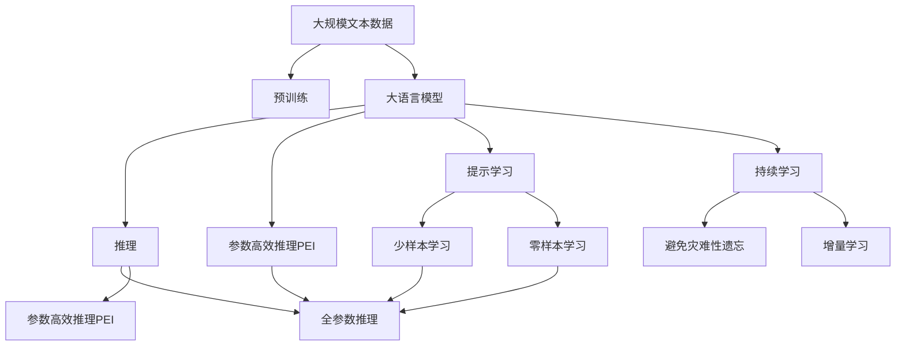
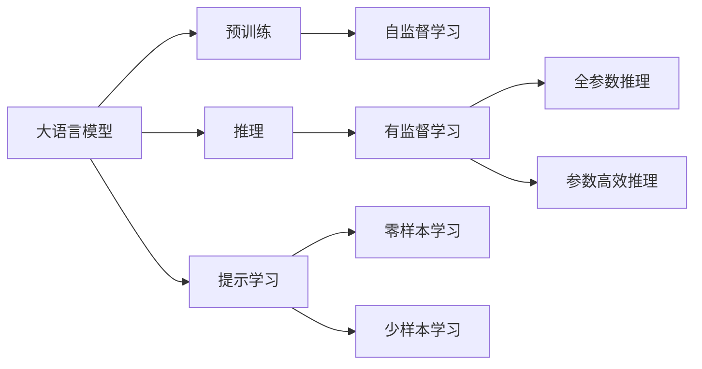
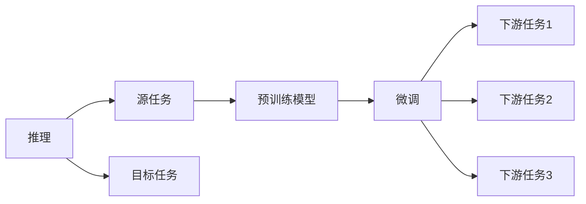
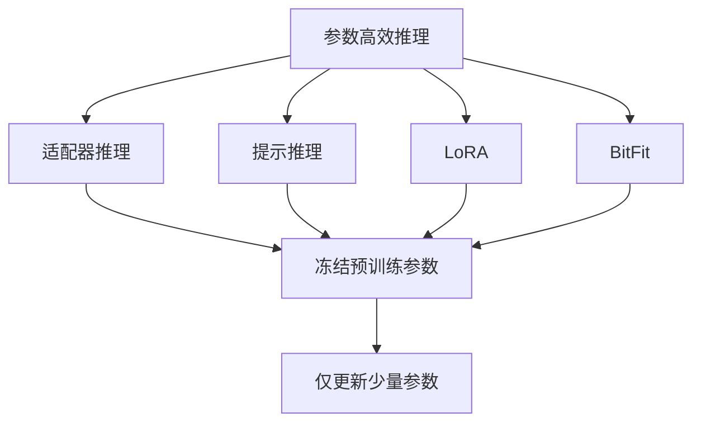
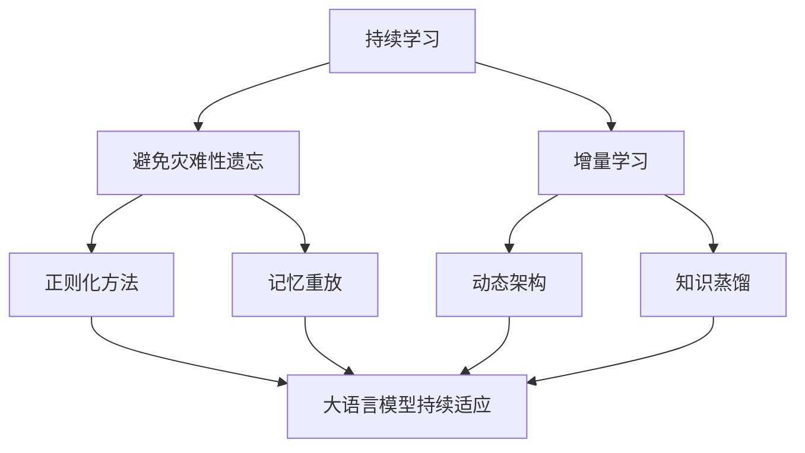
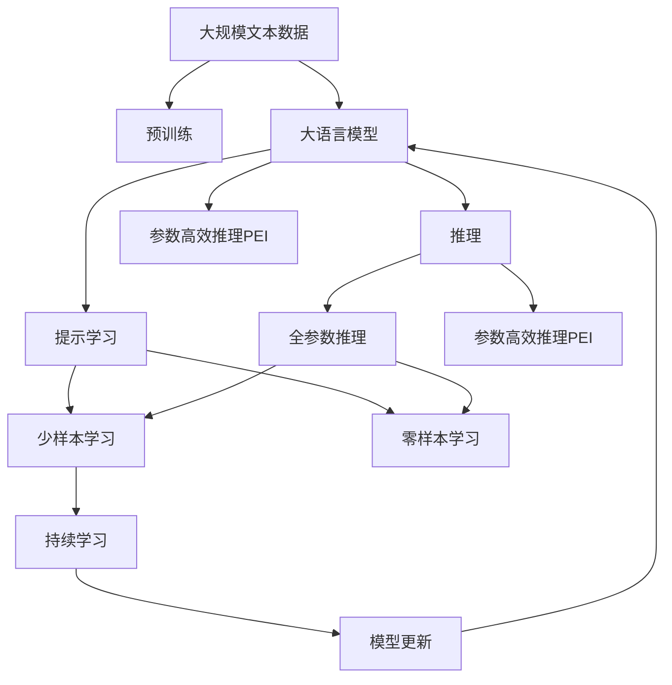

                 

# 大语言模型原理与工程实践：大语言模型推理工程综合实践

> 关键词：大语言模型,推理,工程实践,Transformer,BERT,深度学习,计算机视觉,自然语言处理(NLP)

## 1. 背景介绍

### 1.1 问题由来
近年来，随着深度学习技术的快速发展，大语言模型(Large Language Model, LLM)在自然语言处理(Natural Language Processing, NLP)领域取得了巨大的突破。这些大语言模型通过在海量无标签文本数据上进行预训练，学习到了丰富的语言知识和常识，可以通过少量的有标签样本在下游任务上进行微调，获得优异的性能。其中最具代表性的大语言模型包括OpenAI的GPT系列模型、Google的BERT、T5等。

然而，由于预训练语料的广泛性和泛化能力的不足，这些通用的大语言模型在特定领域应用时，效果往往难以达到实际应用的要求。因此，如何针对特定任务进行大模型微调，提升模型性能，成为了当前大语言模型研究和应用的一个热点问题。本文聚焦于大语言模型推理工程实践，但同时也会兼顾参数高效推理和提示学习等前沿技术，以期对大语言模型推理实践提供更全面的指导。

### 1.2 问题核心关键点
目前，大语言模型推理的主流范式是基于神经网络架构的推理，即通过预训练得到的模型参数，在输入数据上前向传播，输出预测结果。这种推理方法简单高效，可以显著提升模型在特定任务上的性能。

推理的核心在于如何优化模型的预测结果，同时最大程度发挥预训练模型学到的知识。目前主流的做法包括：
- 选择合适的神经网络架构。如Transformer、LSTM等，以适应不同任务需求。
- 优化推理过程。如应用梯度下降、正则化、Early Stopping等，防止过拟合。
- 使用预训练权重。在推理阶段只微调顶层，保留底层预训练权重不变，以提高推理效率。
- 数据增强。通过对输入数据进行改写、回译等方式丰富数据多样性。
- 对抗训练。加入对抗样本，提高模型鲁棒性。
- 提示学习。通过在输入文本中添加提示模板(Prompt Template)，引导模型按期望方式输出，减少推理参数。

目前，基于大模型推理的方法已经在问答、对话、摘要、翻译、情感分析等诸多NLP任务上取得了优异的效果，成为NLP技术落地应用的重要手段。

### 1.3 问题研究意义
研究大语言模型推理方法，对于拓展大模型的应用范围，提升下游任务的性能，加速NLP技术的产业化进程，具有重要意义：

1. 降低应用开发成本。基于成熟的大模型进行推理，可以显著减少从头开发所需的数据、计算和人力等成本投入。
2. 提升模型效果。推理使得通用大模型更好地适应特定任务，在应用场景中取得更优表现。
3. 加速开发进度。standing on the shoulders of giants，推理使得开发者可以更快地完成任务适配，缩短开发周期。
4. 带来技术创新。推理范式促进了对预训练-推理的深入研究，催生了提示学习、少样本学习等新的研究方向。
5. 赋能产业升级。推理使得NLP技术更容易被各行各业所采用，为传统行业数字化转型升级提供新的技术路径。

## 2. 核心概念与联系

### 2.1 核心概念概述

为更好地理解大语言模型推理工程实践，本节将介绍几个密切相关的核心概念：

- 大语言模型(Large Language Model, LLM)：以自回归(如GPT)或自编码(如BERT)模型为代表的大规模预训练语言模型。通过在大规模无标签文本语料上进行预训练，学习通用的语言表示，具备强大的语言理解和生成能力。

- 预训练(Pre-training)：指在大规模无标签文本语料上，通过自监督学习任务训练通用语言模型的过程。常见的预训练任务包括言语建模、遮挡语言模型等。预训练使得模型学习到语言的通用表示。

- 推理(Inference)：指将预训练模型应用于新的输入数据，通过前向传播计算得到输出结果的过程。与训练不同，推理不涉及模型参数的更新，仅依赖预训练权重。

- 参数高效推理(Parameter-Efficient Inference)：指在推理过程中，只更新少量的模型参数，而固定大部分预训练权重不变，以提高推理效率，避免过拟合的方法。

- 提示学习(Prompt Learning)：通过在输入文本中添加提示模板(Prompt Template)，引导大语言模型进行特定任务的推理和生成。可以在不更新模型参数的情况下，实现零样本或少样本学习。

- 少样本学习(Few-shot Learning)：指在只有少量标注样本的情况下，模型能够快速适应新任务的学习方法。在大语言模型中，通常通过在输入中提供少量示例来实现，无需更新模型参数。

- 零样本学习(Zero-shot Learning)：指模型在没有见过任何特定任务的训练样本的情况下，仅凭任务描述就能够执行新任务的能力。大语言模型通过预训练获得的广泛知识，使其能够理解任务指令并生成相应输出。

- 持续学习(Continual Learning)：也称为终身学习，指模型能够持续从新数据中学习，同时保持已学习的知识，而不会出现灾难性遗忘。这对于保持大语言模型的时效性和适应性至关重要。

这些核心概念之间的逻辑关系可以通过以下Mermaid流程图来展示：



这个流程图展示了大语言模型的核心概念及其之间的关系：

1. 大语言模型通过预训练获得基础能力。
2. 推理是对预训练模型进行任务特定的输出计算，可以分为全参数推理和参数高效推理两种方式。
3. 提示学习是一种不更新模型参数的方法，可以实现零样本和少样本学习。
4. 持续学习旨在使模型能够不断学习新知识，同时避免遗忘旧知识。

这些概念共同构成了大语言模型的学习和应用框架，使其能够在各种场景下发挥强大的语言理解和生成能力。通过理解这些核心概念，我们可以更好地把握大语言模型推理工程实践的精髓，为后续深入讨论具体的推理方法和技术奠定基础。

### 2.2 概念间的关系

这些核心概念之间存在着紧密的联系，形成了大语言模型推理的完整生态系统。下面我通过几个Mermaid流程图来展示这些概念之间的关系。

#### 2.2.1 大语言模型的学习范式



这个流程图展示了大语言模型的三种主要学习范式：预训练、推理和提示学习。推理主要采用神经网络架构进行前向传播，而提示学习可以实现零样本和少样本学习。推理可以分为全参数推理和参数高效推理两种方式。

#### 2.2.2 推理与微调的关系



这个流程图展示了推理与微调的基本原理。推理涉及源任务和目标任务，预训练模型在源任务上学习，然后通过微调适应各种下游任务（目标任务）。

#### 2.2.3 参数高效推理方法



这个流程图展示了几种常见的参数高效推理方法，包括适配器推理、提示推理、LoRA和BitFit。这些方法的共同特点是冻结大部分预训练参数，只更新少量参数，从而提高推理效率。

#### 2.2.4 持续学习在大语言模型中的应用



这个流程图展示了持续学习在大语言模型中的应用。持续学习的主要目标是避免灾难性遗忘和实现增量学习。通过正则化方法、记忆重放、动态架构和知识蒸馏等技术，可以使大语言模型持续适应新的任务和数据。

### 2.3 核心概念的整体架构

最后，我们用一个综合的流程图来展示这些核心概念在大语言模型推理过程中的整体架构：



这个综合流程图展示了从预训练到推理，再到持续学习的完整过程。大语言模型首先在大规模文本数据上进行预训练，然后通过推理（包括全参数推理和参数高效推理）或提示学习（包括零样本和少样本学习）来实现推理任务。最后，通过持续学习技术，模型可以不断更新和适应新的任务和数据。 通过这些流程图，我们可以更清晰地理解大语言模型推理工程实践的各个环节和概念之间的关系。

## 3. 核心算法原理 & 具体操作步骤
### 3.1 算法原理概述

大语言模型推理，本质上是通过神经网络架构在前向传播中计算得到输出结果的过程。其核心思想是：将预训练的大语言模型视作一个强大的"特征提取器"，通过推理模型（通常是线性分类器或解码器）输出预测结果。

形式化地，假设预训练模型为 $M_{\theta}$，其中 $\theta$ 为预训练得到的模型参数。给定推理任务的输入 $x$，推理模型的输出为 $\hat{y}=M_{\theta}(x) \in [0,1]$，表示样本属于正类的概率。真实标签 $y \in \{0,1\}$。则推理的损失函数为：

$$
\ell(M_{\theta}(x),y) = -[y\log \hat{y} + (1-y)\log (1-\hat{y})]
$$

推理模型的目标是最小化损失函数，即找到最优参数：

$$
\theta^* = \mathop{\arg\min}_{\theta} \mathcal{L}(\theta)
$$

通过梯度下降等优化算法，推理过程不断更新模型参数 $\theta$，最小化损失函数 $\mathcal{L}$，使得模型输出逼近真实标签。由于 $\theta$ 已经通过预训练获得了较好的初始化，因此推理通常比从头训练所需的计算资源更少。

### 3.2 算法步骤详解

大语言模型推理的一般流程包括以下几个关键步骤：

**Step 1: 准备预训练模型和数据集**
- 选择合适的预训练语言模型 $M_{\theta}$ 作为初始化参数，如 BERT、GPT 等。
- 准备推理任务的输入数据集 $D=\{x_i\}_{i=1}^N$，划分为训练集、验证集和测试集。

**Step 2: 添加推理适配层**
- 根据任务类型，在预训练模型顶层设计合适的输出层和损失函数。
- 对于分类任务，通常在顶层添加线性分类器和交叉熵损失函数。
- 对于生成任务，通常使用语言模型的解码器输出概率分布，并以负对数似然为损失函数。

**Step 3: 设置推理超参数**
- 选择合适的优化算法及其参数，如 AdamW、SGD 等，设置学习率、批大小、迭代轮数等。
- 设置正则化技术及强度，包括权重衰减、Dropout、Early Stopping 等。
- 确定冻结预训练参数的策略，如仅微调顶层，或全部参数都参与推理。

**Step 4: 执行推理过程**
- 将训练集数据分批次输入模型，前向传播计算损失函数。
- 反向传播计算参数梯度，根据设定的优化算法和学习率更新模型参数。
- 周期性在验证集上评估模型性能，根据性能指标决定是否触发 Early Stopping。
- 重复上述步骤直到满足预设的迭代轮数或 Early Stopping 条件。

**Step 5: 测试和部署**
- 在测试集上评估推理后模型 $M_{\hat{\theta}}$ 的性能，对比推理前后的精度提升。
- 使用推理后的模型对新样本进行推理预测，集成到实际的应用系统中。
- 持续收集新的数据，定期重新推理模型，以适应数据分布的变化。

以上是基于监督学习的大语言模型推理的一般流程。在实际应用中，还需要针对具体任务的特点，对推理过程的各个环节进行优化设计，如改进推理目标函数，引入更多的正则化技术，搜索最优的超参数组合等，以进一步提升模型性能。

### 3.3 算法优缺点

大语言模型推理方法具有以下优点：
1. 简单高效。推理通常只需要调整顶层参数，计算资源消耗较低。
2. 通用适用。适用于各种NLP下游任务，设计简单的推理适配层即可实现推理。
3. 参数高效。利用参数高效推理技术，在固定大部分预训练参数的情况下，仍可取得不错的效果。
4. 效果显著。在学术界和工业界的诸多任务上，基于推理的方法已经刷新了最先进的性能指标。

同时，该方法也存在一定的局限性：
1. 依赖标注数据。推理的效果很大程度上取决于输入数据的标签质量，获取高质量输入数据的成本较高。
2. 迁移能力有限。当目标任务与预训练数据的分布差异较大时，推理的性能提升有限。
3. 负面效果传递。预训练模型的固有偏见、有害信息等，可能通过推理传递到下游任务，造成负面影响。
4. 可解释性不足。推理模型的决策过程通常缺乏可解释性，难以对其推理逻辑进行分析和调试。

尽管存在这些局限性，但就目前而言，基于监督学习的推理方法仍是大语言模型推理的主流范式。未来相关研究的重点在于如何进一步降低推理对标注数据的依赖，提高模型的少样本学习和跨领域迁移能力，同时兼顾可解释性和伦理安全性等因素。

### 3.4 算法应用领域

基于大语言模型推理的方法在NLP领域已经得到了广泛的应用，覆盖了几乎所有常见任务，例如：

- 文本分类：如情感分析、主题分类、意图识别等。通过推理使得模型学习文本-标签映射。
- 命名实体识别：识别文本中的人名、地名、机构名等特定实体。通过推理使模型掌握实体边界和类型。
- 关系抽取：从文本中抽取实体之间的语义关系。通过推理使模型学习实体-关系三元组。
- 问答系统：对自然语言问题给出答案。将问题-答案对作为推理数据，训练模型学习匹配答案。
- 机器翻译：将源语言文本翻译成目标语言。通过推理使模型学习语言-语言映射。
- 文本摘要：将长文本压缩成简短摘要。将文章-摘要对作为推理数据，使模型学习抓取要点。
- 对话系统：使机器能够与人自然对话。将多轮对话历史作为上下文，推理模型进行回复生成。

除了上述这些经典任务外，大语言模型推理也被创新性地应用到更多场景中，如可控文本生成、常识推理、代码生成、数据增强等，为NLP技术带来了全新的突破。随着预训练模型和推理方法的不断进步，相信NLP技术将在更广阔的应用领域大放异彩。

## 4. 数学模型和公式 & 详细讲解  
### 4.1 数学模型构建

本节将使用数学语言对基于监督学习的大语言模型推理过程进行更加严格的刻画。

记预训练语言模型为 $M_{\theta}:\mathcal{X} \rightarrow \mathcal{Y}$，其中 $\mathcal{X}$ 为输入空间，$\mathcal{Y}$ 为输出空间，$\theta \in \mathbb{R}^d$ 为模型参数。假设推理任务的输入数据集为 $D=\{x_i\}_{i=1}^N$。

定义模型 $M_{\theta}$ 在输入 $x$ 上的输出为 $\hat{y}=M_{\theta}(x) \in [0,1]$，表示样本属于正类的概率。真实标签 $y \in \{0,1\}$。则推理的损失函数为：

$$
\ell(M_{\theta}(x),y) = -[y\log \hat{y} + (1-y)\log (1-\hat{y})]
$$

推理模型的目标是最小化损失函数，即找到最优参数：

$$
\theta^* = \mathop{\arg\min}_{\theta} \mathcal{L}(\theta)
$$

在实践中，我们通常使用基于梯度的优化算法（如SGD、Adam等）来近似求解上述最优化问题。设 $\eta$ 为学习率，$\lambda$ 为正则化系数，则参数的更新公式为：

$$
\theta \leftarrow \theta - \eta \nabla_{\theta}\mathcal{L}(\theta) - \eta\lambda\theta
$$

其中 $\nabla_{\theta}\mathcal{L}(\theta)$ 为损失函数对参数 $\theta$ 的梯度，可通过反向传播算法高效计算。

### 4.2 公式推导过程

以下我们以二分类任务为例，推导交叉熵损失函数及其梯度的计算公式。

假设模型 $M_{\theta}$ 在输入 $x$ 上的输出为 $\hat{y}=M_{\theta}(x) \in [0,1]$，表示样本属于正类的概率。真实标签 $y \in \{0,1\}$。则二分类交叉熵损失函数定义为：

$$
\ell(M_{\theta}(x),y) = -[y\log \hat{y} + (1-y)\log (1-\hat{y})]
$$

将其代入损失函数，得：

$$
\mathcal{L}(\theta) = -\frac{1}{N}\sum_{i=1}^N [y_i\log M_{\theta}(x_i)+(1-y_i)\log(1-M_{\theta}(x_i))]
$$

根据链式法则，损失函数对参数 $\theta_k$ 的梯度为：

$$
\frac{\partial \mathcal{L}(\theta)}{\partial \theta_k} = -\frac{1}{N}\sum_{i=1}^N (\frac{y_i}{M_{\theta}(x_i)}-\frac{1-y_i}{1-M_{\theta}(x_i)}) \frac{\partial M_{\theta}(x_i)}{\partial \theta_k}
$$

其中 $\frac{\partial M_{\theta}(x_i)}{\partial \theta_k}$ 可进一步递归展开，利用自动微分技术完成计算。

在得到损失函数的梯度后，即可带入参数更新公式，完成模型的迭代优化。重复上述过程直至收敛，最终得到适应推理任务的最优模型参数 $\theta^*$。

## 5. 项目实践：代码实例和详细解释说明
### 5.1 开发环境搭建

在进行推理实践前，我们需要准备好开发环境。以下是使用Python进行PyTorch开发的环境配置流程：

1. 安装Anaconda：从官网下载并安装Anaconda，用于创建独立的Python环境。

2. 创建并激活虚拟环境：
```bash
conda create -n pytorch-env python=3.8 
conda activate pytorch-env
```

3. 安装PyTorch：根据CUDA版本，从官网获取对应的安装命令。例如：
```bash
conda install pytorch torchvision torchaudio cudatoolkit=11.1 -c pytorch -c conda-forge
```

4. 安装Transformers库：
```bash
pip install transformers
```

5. 安装各类工具包：
```bash
pip install numpy pandas scikit-learn matplotlib tqdm jupyter notebook ipython
```

完成上述步骤后，即可在`pytorch-env`环境中开始推理实践。

### 5.2 源代码详细实现

下面我以命名实体识别(NER)任务为例，给出使用Transformers库对BERT模型进行推理的PyTorch代码实现。

首先，定义NER任务的数据处理函数：

```python
from transformers import BertTokenizer
from torch.utils.data import Dataset
import torch

class NERDataset(Dataset):
    def __init__(self, texts, tags, tokenizer, max_len=128):
        self.texts = texts
        self.tags = tags
        self.tokenizer = tokenizer
        self.max_len = max_len
        
    def __len__(self):
        return len(self.texts)
    
    def __getitem__(self, item):
        text = self.texts[item]
        tags = self.tags[item]
        
        encoding = self.tokenizer(text, return_tensors='pt', max_length=self.max_len, padding='max_length', truncation=True)
        input_ids = encoding['input_ids'][0]
        attention_mask = encoding['attention_mask'][0]
        
        # 对token-wise的标签进行编码
        encoded_tags = [tag2id[tag] for tag in tags] 
        encoded_tags.extend([tag2id['O']] * (self.max_len - len(encoded_tags)))
        labels = torch.tensor(encoded_tags, dtype=torch.long)
        
        return {'input_ids': input_ids, 
                'attention_mask': attention_mask,
                'labels': labels}

# 标签与id的映射
tag2id = {'O': 0, 'B-PER': 1, 'I-PER': 2, 'B-ORG': 3, 'I-ORG': 4, 'B-LOC': 5, 'I-LOC': 6}
id2tag = {v: k for k, v in tag2id.items()}

# 创建dataset
tokenizer = BertTokenizer.from_pretrained('bert-base-cased')

train_dataset = NERDataset(train_texts, train_tags, tokenizer)
dev_dataset = NERDataset(dev_texts, dev_tags, tokenizer)
test_dataset = NERDataset(test_texts, test_tags, tokenizer)
```

然后，定义模型和推理器：

```python
from transformers import BertForTokenClassification

model = BertForTokenClassification.from_pretrained('bert-base-cased', num_labels=len(tag2id))

inference_model = model.eval()
```

接着，定义推理函数：

```python
from torch.utils.data import DataLoader
from tqdm import tqdm
from sklearn.metrics import classification_report

device = torch.device('cuda') if torch.cuda.is_available() else torch.device('cpu')
inference_model.to(device)

def evaluate(inference_model, dataset, batch_size):
    dataloader = DataLoader(dataset, batch_size=batch_size)
    with torch.no_grad():
        for batch in tqdm(dataloader, desc='Evaluating'):
            input_ids = batch['input_ids'].to(device)
            attention_mask = batch['attention_mask'].to(device)
            batch_labels = batch['labels']
            outputs = inference_model(input_ids, attention_mask=attention_mask)
            batch_preds = outputs.logits.argmax(dim=2).to('cpu').tolist()
            batch_labels = batch_labels.to('cpu').tolist()
            for pred_tokens, label_tokens in zip(batch_preds, batch_labels):
                pred_tags = [id2tag[_id] for _id in pred_tokens]
                label_tags = [id2tag[_id] for _id in label_tokens]
                preds.append(pred_tags[:len(label_tags)])
                labels.append(label_tags)
                
    print(classification_report(labels, preds))
```

最后，启动推理流程并在测试集上评估：

```python
batch_size = 16

for batch in tqdm(dataloader, desc='Inference'):
    input_ids = batch['input_ids'].to(device)
    attention_mask = batch['attention_mask'].to(device)
    batch_labels = batch['labels']
    outputs = inference_model(input_ids, attention_mask=attention_mask)
    batch_preds = outputs.logits.argmax(dim=2).to('cpu').tolist()
    batch_labels = batch_labels.to('cpu').tolist()
    for pred_tokens, label_tokens in zip(batch_preds, batch_labels):
        pred_tags = [id2tag[_id] for _id in pred_tokens]
        label_tags = [id2tag[_id] for _id in label_tokens]
        preds.append(pred_tags[:len(label_tags)])
        labels.append(label_tags)
        
print(classification_report(labels, preds))
```

以上就是使用PyTorch对BERT进行命名实体识别任务推理的完整代码实现。可以看到，得益于Transformers库的强大封装，我们可以用相对简洁的代码完成

