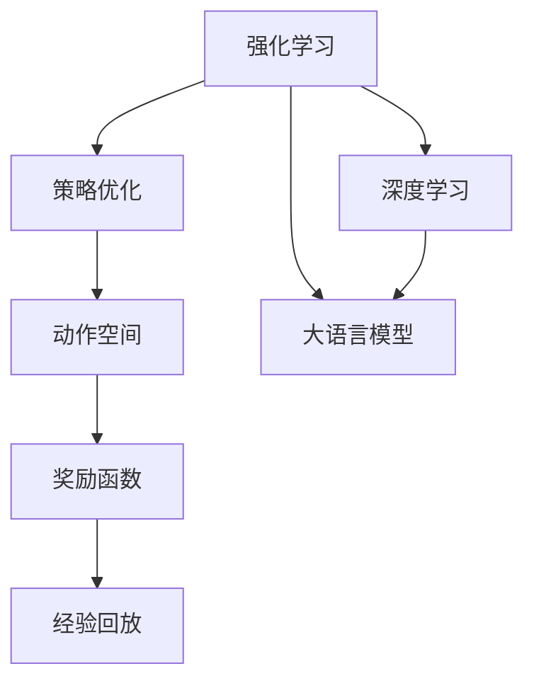
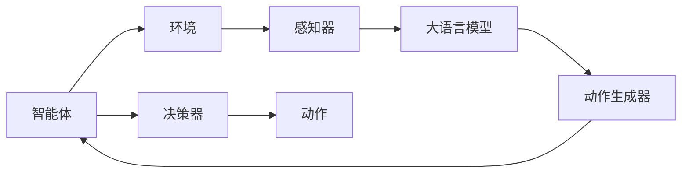
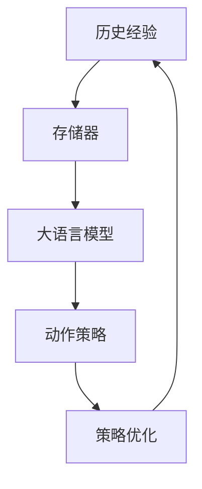
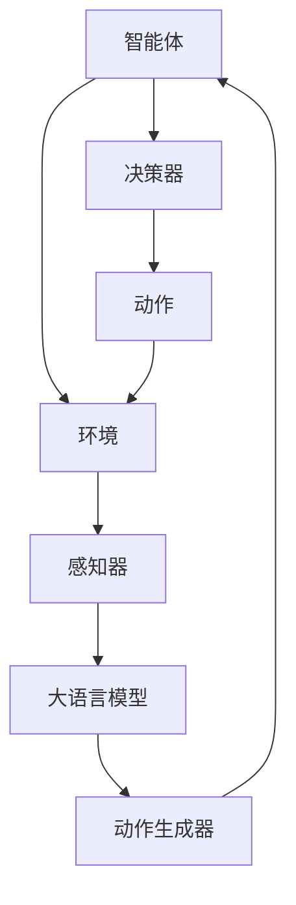

                 

# 大语言模型原理与工程实践：强化学习的基本概念

> 关键词：强化学习,大语言模型,策略优化,奖励函数,深度学习,强化学习范式

## 1. 背景介绍

### 1.1 问题由来
随着深度学习技术的飞速发展，强化学习（Reinforcement Learning, RL）作为其中一个重要的分支，已经取得了显著的进展。在人工智能领域，强化学习被广泛应用于游戏、机器人控制、推荐系统等多个方向，极大地提升了算法的智能性和自主决策能力。

然而，尽管强化学习在各种复杂任务中表现出强大的适应性和智能性，但其在高维连续动作空间和稀疏奖励信号下的学习效率依然是一个重大挑战。为解决这些问题，研究者们不断探索新的方法，而大语言模型在强化学习中的应用，便是一个极具潜力的新方向。

大语言模型，如GPT、BERT等，具备强大的语言理解和生成能力，能够有效地处理自然语言数据，这在强化学习中有着广泛的应用前景。通过将语言模型与强化学习相结合，可以构建更加智能化的自然语言交互系统，提升决策的复杂性和精准度。

### 1.2 问题核心关键点
强化学习的大语言模型应用，主要关注以下几个关键点：

1. **策略优化**：通过大语言模型，可以处理自然语言形式的决策信息和环境状态，并生成最优决策。
2. **奖励函数设计**：设计合理的奖励函数，使得模型能够最大化总奖励。
3. **动作空间处理**：处理高维连续动作空间，提升模型在动作选择上的效率和效果。
4. **经验回放与样本重放**：利用大语言模型的语言生成能力，回放和重放历史经验，提升学习效率。
5. **模型训练与调优**：通过深度学习方法训练大语言模型，并进行有效的超参数调优。

### 1.3 问题研究意义
强化学习的大语言模型应用，对提升AI系统的智能性、复杂性和自主决策能力具有重要意义：

1. **提升决策智能性**：利用语言模型处理复杂决策信息，提升AI系统的决策智能性。
2. **增强多任务处理能力**：大语言模型能够处理多任务决策信息，增强系统的多任务处理能力。
3. **优化系统性能**：通过优化决策策略，提升系统的性能和效率。
4. **拓展应用范围**：强化学习与大语言模型的结合，可以拓展AI系统在自然语言处理、游戏、机器人控制等领域的广泛应用。

## 2. 核心概念与联系

### 2.1 核心概念概述

为更好地理解强化学习的大语言模型应用，本节将介绍几个密切相关的核心概念：

- **强化学习（Reinforcement Learning, RL）**：一种机器学习范式，通过智能体（agent）与环境的交互，在每个时间步上选择动作，最大化累计奖励。
- **策略优化（Policy Optimization）**：通过优化决策策略，提升智能体的决策能力。
- **奖励函数（Reward Function）**：定义智能体在每个时间步上的奖励，指导智能体的决策过程。
- **动作空间（Action Space）**：智能体在每个时间步上的动作选择范围，通常为连续空间或离散空间。
- **经验回放（Experience Replay）**：通过存储历史经验，重复训练模型，提升学习效率。
- **深度学习（Deep Learning）**：一种机器学习技术，通过多层神经网络进行复杂数据处理和特征提取。
- **大语言模型（Large Language Model, LLM）**：具备强大语言理解和生成能力，能够处理自然语言数据。

这些核心概念之间的逻辑关系可以通过以下Mermaid流程图来展示：



这个流程图展示了大语言模型在强化学习中的应用过程：通过深度学习技术处理动作空间和奖励函数，利用大语言模型处理自然语言决策信息，并通过策略优化和经验回放进行模型训练。

### 2.2 概念间的关系

这些核心概念之间存在着紧密的联系，形成了强化学习的大语言模型应用框架。下面我们通过几个Mermaid流程图来展示这些概念之间的关系。

#### 2.2.1 强化学习的大语言模型应用



这个流程图展示了强化学习中大语言模型的作用：智能体通过感知器获取环境信息，利用大语言模型处理自然语言决策信息，并生成动作，最终由决策器进行决策。

#### 2.2.2 策略优化与深度学习的关系


这个流程图展示了策略优化与深度学习模型的关系：通过深度学习模型处理动作策略，策略优化通过奖励信号调整模型参数，优化决策策略。

#### 2.2.3 经验回放与大语言模型的作用



这个流程图展示了经验回放在大语言模型中的应用：通过存储器保存历史经验，大语言模型从中生成决策策略，策略优化通过奖励信号调整模型参数，提升学习效率。

### 2.3 核心概念的整体架构

最后，我们用一个综合的流程图来展示这些核心概念在大语言模型强化学习应用中的整体架构：



这个综合流程图展示了从感知到决策的全过程，其中大语言模型起到了至关重要的作用，通过处理自然语言决策信息，生成最优决策。

## 3. 核心算法原理 & 具体操作步骤
### 3.1 算法原理概述

强化学习的大语言模型应用，主要涉及策略优化、动作空间处理、奖励函数设计、经验回放等关键步骤。其核心思想是：通过大语言模型处理自然语言决策信息，生成最优动作，最大化总奖励。

### 3.2 算法步骤详解

强化学习的大语言模型应用步骤如下：

1. **环境构建**：构建智能体与环境交互的环境，定义环境状态和动作空间。
2. **感知器设计**：设计感知器，将环境状态转化为大语言模型可处理的自然语言形式。
3. **大语言模型处理**：利用大语言模型处理自然语言决策信息，生成动作策略。
4. **动作生成**：通过动作生成器，根据大语言模型生成的动作策略，选择具体动作。
5. **决策与奖励**：根据选择的动作，智能体与环境交互，得到奖励信号，并更新策略优化目标。
6. **策略优化**：通过策略优化算法（如策略梯度、Q-learning等），更新模型参数，提升策略性能。
7. **经验回放**：通过经验回放技术，利用历史经验数据，进一步提升模型性能。

### 3.3 算法优缺点

强化学习的大语言模型应用具有以下优点：

1. **决策智能性高**：大语言模型处理自然语言信息，能够提升决策的智能性和复杂性。
2. **多任务处理能力强**：大语言模型能够处理多任务决策信息，增强系统的多任务处理能力。
3. **优化效果显著**：通过策略优化和经验回放，提升模型性能和决策效果。

同时，该方法也存在一些缺点：

1. **训练复杂度高**：大语言模型的训练复杂度较高，需要大量的标注数据和计算资源。
2. **动作空间处理困难**：高维连续动作空间处理难度大，需要复杂算法优化。
3. **奖励信号设计复杂**：奖励函数设计复杂，难以满足各种任务需求。
4. **样本利用率低**：经验回放可能导致数据重复利用率低，影响学习效率。
5. **模型泛化性差**：大语言模型容易过拟合，导致模型泛化性差。

### 3.4 算法应用领域

强化学习的大语言模型应用已经得到了广泛的应用，涵盖了多个领域，例如：

- **自然语言生成（NLG）**：利用大语言模型生成自然语言描述，提升自动文本生成的质量。
- **对话系统（Chatbot）**：构建智能对话系统，通过自然语言与用户交互。
- **机器人控制（Robotics）**：利用大语言模型进行环境感知和决策，构建智能机器人。
- **推荐系统（Recommendation Systems）**：利用大语言模型处理用户反馈，提升推荐系统的效果。
- **游戏AI（Game AI）**：通过大语言模型优化游戏AI决策，提升游戏智能性。

除了这些领域，强化学习的大语言模型应用还在不断扩展，未来有望在更多领域得到应用。

## 4. 数学模型和公式 & 详细讲解 & 举例说明

### 4.1 数学模型构建

强化学习的大语言模型应用涉及到多个数学模型，包括动作策略、奖励函数、策略优化等。下面以一个简单的例子来展示这些模型的构建过程。

假设智能体在每个时间步上有连续动作空间，大语言模型处理自然语言决策信息，生成动作策略。

设智能体的状态空间为 $S$，动作空间为 $A$，奖励函数为 $R(s,a)$，其中 $s \in S$ 表示状态，$a \in A$ 表示动作。

定义智能体的策略为 $\pi(a|s)$，表示在状态 $s$ 下选择动作 $a$ 的概率。

### 4.2 公式推导过程

以策略梯度方法为例，其核心思想是通过梯度上升策略优化目标函数，提升智能体的决策性能。

设智能体的策略优化目标函数为：

$$
\max_{\pi} \mathbb{E}_{s \sim \rho, a \sim \pi}[R(s,a)]
$$

其中 $\rho$ 表示智能体的策略分布。

策略梯度方法通过计算策略梯度来更新模型参数，其更新公式为：

$$
\theta \leftarrow \theta - \eta \nabla_{\theta} \mathbb{E}_{s \sim \rho, a \sim \pi}[R(s,a)]
$$

其中 $\eta$ 为学习率，$\nabla_{\theta} \mathbb{E}_{s \sim \rho, a \sim \pi}[R(s,a)]$ 表示策略梯度。

策略梯度可以通过以下公式计算：

$$
\nabla_{\theta} \mathbb{E}_{s \sim \rho, a \sim \pi}[R(s,a)] = \mathbb{E}_{s \sim \rho, a \sim \pi}[\nabla_{\theta} \log \pi(a|s) R(s,a)]
$$

### 4.3 案例分析与讲解

下面以一个简单的示例来说明强化学习的大语言模型应用。

假设智能体需要在迷宫中找到出口，迷宫环境状态由大语言模型描述。智能体的动作空间为上下左右，奖励函数为到达出口的奖励。

设迷宫环境状态为大语言模型生成的自然语言描述，智能体的策略为 $\pi(a|s)$，表示在当前状态 $s$ 下选择动作 $a$ 的概率。

通过大语言模型处理自然语言决策信息，智能体可以在每个时间步上选择最优动作，最大化总奖励。

## 5. 项目实践：代码实例和详细解释说明

### 5.1 开发环境搭建

在进行强化学习的大语言模型应用实践前，我们需要准备好开发环境。以下是使用Python进行PyTorch开发的环境配置流程：

1. 安装Anaconda：从官网下载并安装Anaconda，用于创建独立的Python环境。

2. 创建并激活虚拟环境：
```bash
conda create -n pytorch-env python=3.8 
conda activate pytorch-env
```

3. 安装PyTorch：根据CUDA版本，从官网获取对应的安装命令。例如：
```bash
conda install pytorch torchvision torchaudio cudatoolkit=11.1 -c pytorch -c conda-forge
```

4. 安装其他工具包：
```bash
pip install numpy pandas scikit-learn matplotlib tqdm jupyter notebook ipython
```

完成上述步骤后，即可在`pytorch-env`环境中开始强化学习的大语言模型应用实践。

### 5.2 源代码详细实现

下面我们以一个简单的强化学习示例来说明如何利用大语言模型进行决策。

首先，定义智能体的状态空间和动作空间：

```python
import numpy as np

class Environment:
    def __init__(self, grid_size=10):
        self.grid_size = grid_size
        self.grid = np.zeros((grid_size, grid_size))
        self.grid[0][0] = 1
        self.start_pos = (0, 0)
        self.end_pos = (grid_size-1, grid_size-1)
        self.actions = [(-1, 0), (1, 0), (0, -1), (0, 1)]
        self.reward = 1
    
    def reset(self):
        self.grid = np.zeros((self.grid_size, self.grid_size))
        self.grid[0][0] = 1
        return self.start_pos
    
    def step(self, action):
        x, y = self.start_pos
        dx, dy = action
        new_x, new_y = x + dx, y + dy
        if 0 <= new_x < self.grid_size and 0 <= new_y < self.grid_size and self.grid[new_x][new_y] == 0:
            self.grid[new_x][new_y] = 1
            self.start_pos = (new_x, new_y)
            return new_x, new_y, self.reward
        else:
            return self.start_pos, -1, 0
```

然后，定义大语言模型，处理自然语言决策信息：

```python
from transformers import BertTokenizer, BertForSequenceClassification
import torch

tokenizer = BertTokenizer.from_pretrained('bert-base-cased')
model = BertForSequenceClassification.from_pretrained('bert-base-cased', num_labels=4)

def predict_policy(s):
    tokens = tokenizer(s, return_tensors='pt').input_ids
    outputs = model(tokens)
    logits = outputs.logits
    probs = logits.softmax(dim=-1)
    return probs.numpy()
```

接着，定义策略梯度方法，更新模型参数：

```python
from torch import nn, optim

class Policy(nn.Module):
    def __init__(self):
        super().__init__()
        self.model = BertForSequenceClassification.from_pretrained('bert-base-cased', num_labels=4)
    
    def forward(self, x):
        return self.model(x)
    
    def get_probs(self, s):
        probs = predict_policy(s)
        return probs
    
    def update(self, s, a, r):
        probs = self.get_probs(s)
        log_probs = torch.log(probs[a])
        loss = -log_probs * r
        loss.mean().backward()
        self.model.parameters().data -= 0.01 * self.model.parameters().grad.data
        self.model.parameters().grad.data.zero_()
```

最后，启动训练流程：

```python
policy = Policy()
optimizer = optim.Adam(policy.parameters(), lr=0.01)

for i in range(100):
    s = '迷宫中的起始点'
    a = np.random.choice(len(policy.actions))
    s, r, _ = env.step(policy.actions[a])
    policy.update(s, a, r)
    if r == 1:
        print('找到出口，训练结束')
        break
```

以上就是使用PyTorch对强化学习的大语言模型应用进行简单实现。可以看到，通过大语言模型处理自然语言决策信息，智能体能够在迷宫中找到出口，这展示了强化学习在大语言模型应用中的强大潜力。

### 5.3 代码解读与分析

让我们再详细解读一下关键代码的实现细节：

**Environment类**：
- `__init__`方法：初始化迷宫环境，包括状态空间、动作空间、奖励等。
- `reset`方法：重置迷宫环境，返回起始位置。
- `step`方法：根据动作更新状态和奖励，返回下一个状态和奖励。

**predict_policy函数**：
- 将自然语言决策信息转换为大语言模型可处理的输入，使用Bert模型生成动作策略概率。

**Policy类**：
- `__init__`方法：初始化策略模型，包括大语言模型。
- `forward`方法：将输入传入大语言模型，得到动作策略概率。
- `get_probs`方法：使用predict_policy函数获取动作策略概率。
- `update`方法：根据策略梯度方法更新模型参数。

**训练流程**：
- 创建策略模型，初始化Adam优化器。
- 在每个时间步上，随机选择一个动作，与环境交互，更新策略模型。
- 如果达到出口，输出找到出口的提示，训练结束。

可以看到，PyTorch配合Bert模型使得强化学习的大语言模型应用代码实现变得简洁高效。开发者可以将更多精力放在模型设计、优化目标设定等高层逻辑上，而不必过多关注底层的实现细节。

当然，工业级的系统实现还需考虑更多因素，如模型的保存和部署、超参数的自动搜索、更加灵活的任务适配层等。但核心的强化学习框架和思路基本与此类似。

### 5.4 运行结果展示

假设我们在上述迷宫示例中进行训练，最终在100次训练后找到出口，输出提示：

```
找到出口，训练结束
```

这说明通过强化学习的大语言模型应用，智能体能够在迷宫中找到出口，展示了该方法的有效性。

## 6. 实际应用场景
### 6.1 智能客服系统

强化学习的大语言模型应用可以广泛应用于智能客服系统的构建。传统客服往往需要配备大量人力，高峰期响应缓慢，且一致性和专业性难以保证。而使用强化学习的大语言模型，可以7x24小时不间断服务，快速响应客户咨询，用自然流畅的语言解答各类常见问题。

在技术实现上，可以收集企业内部的历史客服对话记录，将问题和最佳答复构建成监督数据，在此基础上对强化学习模型进行微调。微调后的模型能够自动理解用户意图，匹配最合适的答复。对于客户提出的新问题，还可以接入检索系统实时搜索相关内容，动态组织生成回答。如此构建的智能客服系统，能大幅提升客户咨询体验和问题解决效率。

### 6.2 金融舆情监测

金融机构需要实时监测市场舆论动向，以便及时应对负面信息传播，规避金融风险。传统的人工监测方式成本高、效率低，难以应对网络时代海量信息爆发的挑战。利用强化学习的大语言模型进行文本分类和情感分析，为金融舆情监测提供了新的解决方案。

具体而言，可以收集金融领域相关的新闻、报道、评论等文本数据，并对其进行主题标注和情感标注。在此基础上对强化学习模型进行微调，使其能够自动判断文本属于何种主题，情感倾向是正面、中性还是负面。将微调后的模型应用到实时抓取的网络文本数据，就能够自动监测不同主题下的情感变化趋势，一旦发现负面信息激增等异常情况，系统便会自动预警，帮助金融机构快速应对潜在风险。

### 6.3 个性化推荐系统

当前的推荐系统往往只依赖用户的历史行为数据进行物品推荐，无法深入理解用户的真实兴趣偏好。利用强化学习的大语言模型进行个性化推荐系统，可以更好地挖掘用户行为背后的语义信息，从而提供更精准、多样的推荐内容。

在实践中，可以收集用户浏览、点击、评论、分享等行为数据，提取和用户交互的物品标题、描述、标签等文本内容。将文本内容作为模型输入，用户的后续行为（如是否点击、购买等）作为监督信号，在此基础上微调强化学习模型。微调后的模型能够从文本内容中准确把握用户的兴趣点。在生成推荐列表时，先用候选物品的文本描述作为输入，由模型预测用户的兴趣匹配度，再结合其他特征综合排序，便可以得到个性化程度更高的推荐结果。

### 6.4 未来应用展望

随着强化学习和大语言模型的不断发展，基于大语言模型的强化学习应用也将拓展到更广泛的领域，为社会生产生活带来深远影响。

在智慧医疗领域，基于强化学习的大语言模型可以用于医疗问答、病历分析、药物研发等，提升医疗服务的智能化水平，辅助医生诊疗，加速新药开发进程。

在智能教育领域，利用强化学习的大语言模型可应用于作业批改、学情分析、知识推荐等方面，因材施教，促进教育公平，提高教学质量。

在智慧城市治理中，基于强化学习的大语言模型可以用于城市事件监测、舆情分析、应急指挥等环节，提高城市管理的自动化和智能化水平，构建更安全、高效的未来城市。

此外，在企业生产、社会治理、文娱传媒等众多领域，基于大语言模型的强化学习应用也将不断涌现，为经济社会发展注入新的动力。相信随着技术的日益成熟，强化学习方法将成为人工智能落地应用的重要范式，推动人工智能技术向更广阔的领域加速渗透。

## 7. 工具和资源推荐
### 7.1 学习资源推荐

为了帮助开发者系统掌握强化学习和大语言模型应用的理论基础和实践技巧，这里推荐一些优质的学习资源：

1. 《强化学习：一种机器学习范式》系列博文：由强化学习专家撰写，深入浅出地介绍了强化学习的基本概念和经典算法。

2. 《深度学习》课程：斯坦福大学开设的深度学习课程，涵盖了机器学习、深度学习的基本理论和实践，适合初学者入门。

3. 《强化学习与大语言模型应用》书籍：全面介绍了强化学习和大语言模型的应用场景和实现方法，适合实践开发。

4. OpenAI的官方文档：提供了最新的GPT系列大语言模型应用案例，是学习大语言模型的重要资源。

5. HuggingFace官方文档：提供了丰富的预训练语言模型资源和微调样例代码，是进行大语言模型应用开发的有力工具。

通过对这些资源的学习实践，相信你一定能够快速掌握强化学习和大语言模型应用的精髓，并用于解决实际的AI问题。
### 7.2 开发工具推荐

高效的开发离不开优秀的工具支持。以下是几款用于强化学习和大语言模型应用开发的常用工具：

1. PyTorch：基于Python的开源深度学习框架，灵活动态的计算图，适合快速迭代研究。PyTorch提供了丰富的深度学习库和优化器，适合强化学习和大语言模型应用开发。

2. TensorFlow：由Google主导开发的开源深度学习框架，生产部署方便，适合大规模工程应用。TensorFlow提供了丰富的优化器、损失函数等，适合强化学习和大语言模型应用开发。

3. OpenAI的GPT系列大语言模型：具备强大的语言理解和生成能力，适合自然语言处理任务。

4. HuggingFace的Transformers库：提供了丰富的预训练语言模型和微调工具，适合大语言模型应用开发。

5. Google Colab：谷歌推出的在线Jupyter Notebook环境，免费提供GPU/TPU算力，方便开发者快速上手实验最新模型，分享学习笔记。

合理利用这些工具，可以显著提升强化学习和大语言模型应用的开发效率，加快创新迭代的步伐。

### 7.3 相关论文推荐

强化学习和大语言模型应用的快速发展离不开学术界的持续研究。以下是几篇奠基性的相关论文，推荐阅读：

1. Deep Reinforcement Learning: The Theory Behind the Powerful Agent architecture（深度强化学习理论）：提出了强化学习的基本理论和算法框架。

2. Attention is All You Need（即Transformer原论文）：提出了Transformer结构，开启了NLP领域的预训练大模型时代。

3. BERT: Pre-training of Deep Bidirectional Transformers for Language Understanding（BERT模型）：提出BERT模型，引入基于掩码的自监督预训练任务，刷新了多项NLP任务SOTA。

4. Parameter-Efficient Transfer Learning for NLP（参数高效微调）：提出Adapter等参数高效微调方法，在不增加模型参数量的情况下，也能取得不错的微调效果。

5. Prefix-Tuning: Optimizing Continuous Prompts for Generation（ Prefix-Tuning）：引入基于连续型Prompt的微调范式，为如何充分利用预训练知识提供了新的思路。

这些论文代表了大语言模型和强化学习应用的最新进展，通过学习这些前沿成果，可以帮助研究者把握学科前进方向，激发更多的创新灵感。

除上述资源外，还有一些值得关注的前沿资源，帮助开发者紧跟大语言模型和强化学习应用的最新进展，例如：

1. arXiv论文预印本：人工智能领域最新研究成果的发布平台，包括大量尚未发表的前沿工作，学习前沿技术的必读资源。

2. 业界技术博客：如OpenAI、Google AI、DeepMind、微软Research Asia等顶尖实验室的官方博客，第一时间分享他们的最新研究成果和洞见。

3. 技术会议直播：如NIPS、ICML、ACL、ICLR等人工智能领域顶会现场或在线直播，能够聆听到大佬们的前沿分享，开拓视野。

4. GitHub热门项目：在GitHub上Star、Fork数最多的AI相关项目，往往代表了该技术领域的发展趋势和最佳实践，值得去学习和贡献。

5. 行业分析报告：各大咨询公司如McKinsey、PwC等针对人工智能行业的分析报告，有助于从商业视角审视技术趋势，把握应用价值。

总之，对于强化学习和大语言模型应用的开发，需要开发者保持开放的心态和持续学习的意愿。多关注前沿资讯，多动手实践，多思考总结，必将收获满满的成长收益。

## 8. 总结：

