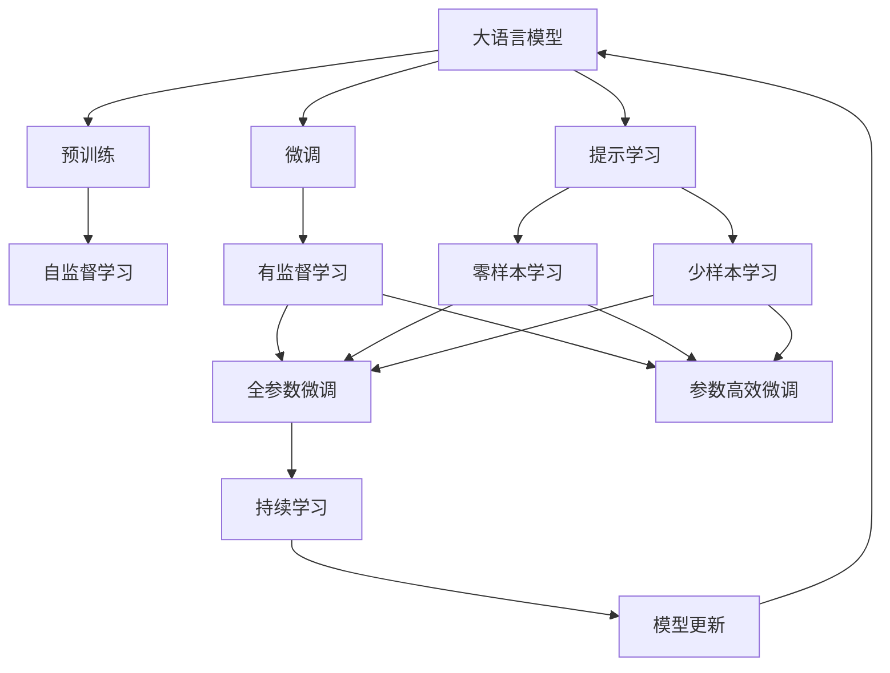
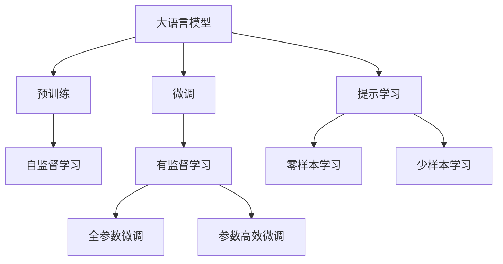
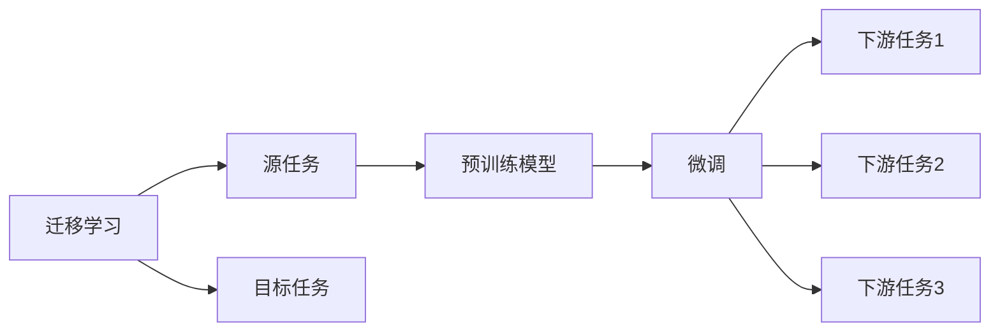
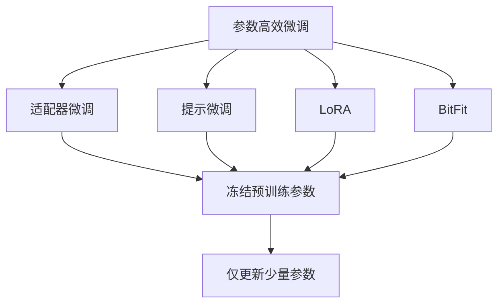
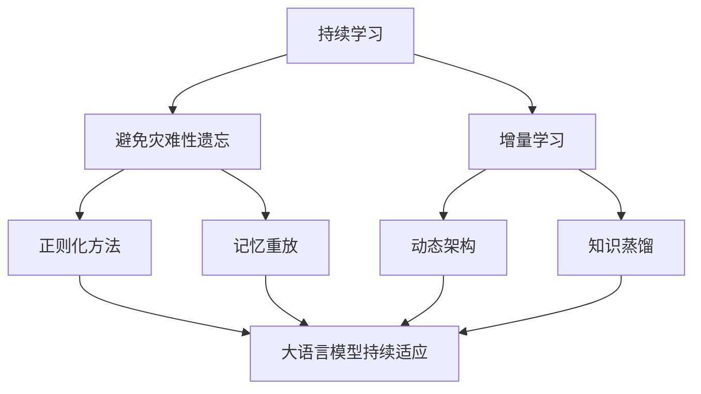
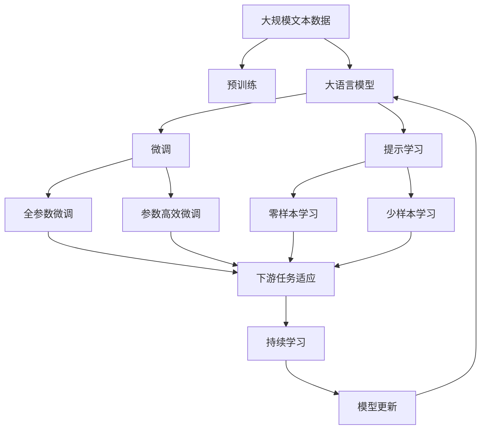

                 

# 大语言模型原理基础与前沿 图文联合训练

> 关键词：大语言模型,微调,监督学习,Transformer,BERT,预训练,图文联合训练

## 1. 背景介绍

### 1.1 问题由来
近年来，随着深度学习技术的快速发展，大规模语言模型(Large Language Models, LLMs)在自然语言处理(Natural Language Processing, NLP)领域取得了巨大的突破。这些大语言模型通过在大规模无标签文本语料上进行预训练，学习到了丰富的语言知识和常识，可以通过少量的有标签样本在下游任务上进行微调(Fine-Tuning)，获得优异的性能。其中最具代表性的大模型包括OpenAI的GPT系列模型、Google的BERT、T5等。

然而，由于预训练语料的广泛性和泛化能力的不足，这些通用的大语言模型在特定领域应用时，效果往往难以达到实际应用的要求。因此，如何针对特定任务进行大模型微调，提升模型性能，成为了当前大语言模型研究和应用的一个热点问题。本文聚焦于图文联合训练方法，探讨如何通过结合文本和图像信息，进一步提升语言模型的能力。

### 1.2 问题核心关键点
当前主流的大语言模型微调方法主要包括：

- 选择适当的预训练模型，如BERT、GPT等。
- 准备下游任务的标注数据集，划分为训练集、验证集和测试集。
- 添加任务适配层，定义损失函数和优化算法。
- 设置合适的学习率和正则化参数，防止过拟合。
- 使用数据增强和对抗训练提升模型鲁棒性。
- 使用提示学习或零样本学习，减少微调参数。

而图文联合训练方法则是在上述基础上，进一步将图像信息与文本信息结合，通过双向多模态学习提升语言模型的能力。

### 1.3 问题研究意义
研究图文联合训练方法，对于拓展大模型的应用范围，提升下游任务的性能，加速NLP技术的产业化进程，具有重要意义：

1. 降低应用开发成本。通过结合图像信息，可以更全面地理解任务背景，减少从头开发所需的数据、计算和人力等成本投入。
2. 提升模型效果。图文联合训练使得模型能够更好地利用图像信息，提升对自然语言文本的理解和生成能力。
3. 加速开发进度。standing on the shoulders of giants，图文联合训练方法使得开发者可以更快地完成任务适配，缩短开发周期。
4. 带来技术创新。图文联合训练范式促进了对预训练-微调的深入研究，催生了提示学习、少样本学习等新的研究方向。
5. 赋能产业升级。图文联合训练使得NLP技术更容易被各行各业所采用，为传统行业数字化转型升级提供新的技术路径。

## 2. 核心概念与联系

### 2.1 核心概念概述

为更好地理解图文联合训练方法，本节将介绍几个密切相关的核心概念：

- 大语言模型(Large Language Model, LLM)：以自回归(如GPT)或自编码(如BERT)模型为代表的大规模预训练语言模型。通过在大规模无标签文本语料上进行预训练，学习通用的语言表示，具备强大的语言理解和生成能力。

- 预训练(Pre-training)：指在大规模无标签文本语料上，通过自监督学习任务训练通用语言模型的过程。常见的预训练任务包括言语建模、遮挡语言模型等。

- 微调(Fine-tuning)：指在预训练模型的基础上，使用下游任务的少量标注数据，通过有监督地训练来优化模型在特定任务上的性能。通常只需要调整顶层分类器或解码器，并以较小的学习率更新全部或部分的模型参数。

- 图文联合训练：指在微调过程中，将文本和图像信息联合起来进行双向学习，以提升模型对任务的理解和生成能力。常见的图文联合训练方法包括CoAtT、ViLT等。

- 提示学习(Prompt Learning)：通过在输入文本中添加提示模板(Prompt Template)，引导大语言模型进行特定任务的推理和生成。可以在不更新模型参数的情况下，实现零样本或少样本学习。

- 少样本学习(Few-shot Learning)：指在只有少量标注样本的情况下，模型能够快速适应新任务的学习方法。在大语言模型中，通常通过在输入中提供少量示例来实现，无需更新模型参数。

- 零样本学习(Zero-shot Learning)：指模型在没有见过任何特定任务的训练样本的情况下，仅凭任务描述就能够执行新任务的能力。大语言模型通过预训练获得的广泛知识，使其能够理解任务指令并生成相应输出。

- 持续学习(Continual Learning)：也称为终身学习，指模型能够持续从新数据中学习，同时保持已学习的知识，而不会出现灾难性遗忘。这对于保持大语言模型的时效性和适应性至关重要。

这些核心概念之间的逻辑关系可以通过以下Mermaid流程图来展示：



这个流程图展示了大语言模型的核心概念及其之间的关系：

1. 大语言模型通过预训练获得基础能力。
2. 微调是对预训练模型进行任务特定的优化，可以分为全参数微调和参数高效微调（PEFT）。
3. 提示学习是一种不更新模型参数的方法，可以实现零样本和少样本学习。
4. 少样本学习是指模型在少量标注数据上的学习能力，可以提升模型适应性。
5. 零样本学习是指模型无需训练即可执行新任务，体现模型泛化能力。
6. 持续学习是模型保持学习和适应的能力，避免过时。
7. 图文联合训练是一种将图像和文本结合的双向学习方式，进一步提升模型性能。

这些概念共同构成了大语言模型的学习和应用框架，使其能够在各种场景下发挥强大的语言理解和生成能力。通过理解这些核心概念，我们可以更好地把握大语言模型的工作原理和优化方向。

### 2.2 概念间的关系

这些核心概念之间存在着紧密的联系，形成了大语言模型的完整生态系统。下面我通过几个Mermaid流程图来展示这些概念之间的关系。

#### 2.2.1 大语言模型的学习范式



这个流程图展示了大语言模型的三种主要学习范式：预训练、微调和提示学习。预训练主要采用自监督学习方法，而微调则是有监督学习的过程。提示学习可以实现零样本和少样本学习，即不更新模型参数的情况下，实现任务推理。

#### 2.2.2 迁移学习与微调的关系



这个流程图展示了迁移学习的基本原理，以及它与微调的关系。迁移学习涉及源任务和目标任务，预训练模型在源任务上学习，然后通过微调适应各种下游任务（目标任务）。

#### 2.2.3 参数高效微调方法



这个流程图展示了几种常见的参数高效微调方法，包括适配器微调、提示微调、LoRA和BitFit。这些方法的共同特点是冻结大部分预训练参数，只更新少量参数，从而提高微调效率。

#### 2.2.4 持续学习在大语言模型中的应用



这个流程图展示了持续学习在大语言模型中的应用。持续学习的主要目标是避免灾难性遗忘和实现增量学习。通过正则化方法、记忆重放、动态架构和知识蒸馏等技术，可以使大语言模型持续适应新的任务和数据。

### 2.3 核心概念的整体架构

最后，我们用一个综合的流程图来展示这些核心概念在大语言模型微调过程中的整体架构：



这个综合流程图展示了从预训练到微调，再到持续学习的完整过程。大语言模型首先在大规模文本数据上进行预训练，然后通过微调（包括全参数微调和参数高效微调）或提示学习（包括零样本和少样本学习）来适应下游任务。最后，通过持续学习技术，模型可以不断更新和适应新的任务和数据。 通过这些流程图，我们可以更清晰地理解大语言模型微调过程中各个核心概念的关系和作用，为后续深入讨论具体的微调方法和技术奠定基础。

## 3. 核心算法原理 & 具体操作步骤
### 3.1 算法原理概述

图文联合训练方法，本质上是一种基于监督学习的微调方法。其核心思想是：将预训练的大语言模型视作一个强大的"特征提取器"，通过在文本和图像联合标注数据上进行有监督的训练，使得模型输出能够匹配任务标签，从而获得针对特定任务优化的模型。

形式化地，假设预训练模型为 $M_{\theta}$，其中 $\theta$ 为预训练得到的模型参数。给定图文联合任务的标注数据集 $D=\{(x_i, y_i, z_i)\}_{i=1}^N$，图文联合训练的目标是找到新的模型参数 $\hat{\theta}$，使得：

$$
\hat{\theta}=\mathop{\arg\min}_{\theta} \mathcal{L}(M_{\theta},D)
$$

其中 $\mathcal{L}$ 为针对任务 $T$ 设计的损失函数，用于衡量模型预测输出与真实标签之间的差异。常见的损失函数包括交叉熵损失、均方误差损失等。

通过梯度下降等优化算法，联合训练过程不断更新模型参数 $\theta$，最小化损失函数 $\mathcal{L}$，使得模型输出逼近真实标签。由于 $\theta$ 已经通过预训练获得了较好的初始化，因此即便在图像和文本联合标注数据集上，也能较快收敛到理想的模型参数 $\hat{\theta}$。

### 3.2 算法步骤详解

图文联合训练的一般流程包括以下几个关键步骤：

**Step 1: 准备预训练模型和数据集**
- 选择合适的预训练语言模型 $M_{\theta}$ 作为初始化参数，如 BERT、GPT等。
- 准备图文联合任务的标注数据集 $D$，划分为训练集、验证集和测试集。一般要求标注数据与预训练数据的分布不要差异过大。

**Step 2: 添加任务适配层**
- 根据任务类型，在预训练模型顶层设计合适的输出层和损失函数。
- 对于分类任务，通常在顶层添加线性分类器和交叉熵损失函数。
- 对于生成任务，通常使用语言模型的解码器输出概率分布，并以负对数似然为损失函数。

**Step 3: 设置联合训练超参数**
- 选择合适的优化算法及其参数，如 AdamW、SGD 等，设置学习率、批大小、迭代轮数等。
- 设置正则化技术及强度，包括权重衰减、Dropout、Early Stopping等。
- 确定冻结预训练参数的策略，如仅微调顶层，或全部参数都参与微调。

**Step 4: 执行联合训练**
- 将联合训练集数据分批次输入模型，前向传播计算损失函数。
- 反向传播计算参数梯度，根据设定的优化算法和学习率更新模型参数。
- 周期性在验证集上评估模型性能，根据性能指标决定是否触发 Early Stopping。
- 重复上述步骤直到满足预设的迭代轮数或 Early Stopping 条件。

**Step 5: 测试和部署**
- 在测试集上评估联合训练后模型 $M_{\hat{\theta}}$ 的性能，对比微调前后的精度提升。
- 使用联合训练后的模型对新样本进行推理预测，集成到实际的应用系统中。
- 持续收集新的数据，定期重新联合训练模型，以适应数据分布的变化。

以上是图文联合训练的一般流程。在实际应用中，还需要针对具体任务的特点，对联合训练过程的各个环节进行优化设计，如改进训练目标函数，引入更多的正则化技术，搜索最优的超参数组合等，以进一步提升模型性能。

### 3.3 算法优缺点

图文联合训练方法具有以下优点：
1. 高效融合文本和图像信息。通过联合训练，模型能够同时学习文本和图像的特征，提升对任务的理解和生成能力。
2. 提升模型泛化能力。图像和文本的双向学习可以丰富模型的知识表示，提升模型对复杂任务的适应性。
3. 减少标注样本需求。图文联合训练方法可以减少对标注样本的依赖，提高模型在特定领域的应用效率。

同时，该方法也存在一定的局限性：
1. 数据获取难度较大。获取高质量的联合标注数据集是一个挑战，尤其是图像标注的成本较高。
2. 图像信息提取难度大。图像信息相对于文本信息更难以自动抽取和理解，需要额外的处理步骤。
3. 计算资源需求高。图文联合训练需要同时处理文本和图像，对计算资源的需求较大。
4. 模型复杂度增加。联合训练增加了模型的复杂度，可能导致过拟合风险增加。

尽管存在这些局限性，但图文联合训练方法在大规模数据和高质量标注数据的支持下，能够显著提升模型的性能，尤其在视觉理解和生成任务上，具有显著优势。

### 3.4 算法应用领域

图文联合训练方法在NLP领域已经得到了广泛的应用，覆盖了几乎所有常见任务，例如：

- 图文识别：识别文本中包含的图片内容，如人名、地点等。
- 视觉问答：回答关于图片内容的问题，如图片中的人物是谁、图片描述了什么场景等。
- 图像描述生成：生成对图片内容的自然语言描述，如图片中的物品名称、颜色、形状等。
- 视觉机器翻译：将源语言图片翻译成目标语言文本，如将图片中的英文翻译成中文。
- 图像摘要：对图片进行自动摘要，提取关键信息，并生成简短描述。
- 视觉推荐系统：根据用户对图片的反馈，推荐相关图片和文本信息。

除了上述这些经典任务外，图文联合训练还被创新性地应用到更多场景中，如可控文本生成、常识推理、代码生成、数据增强等，为NLP技术带来了全新的突破。随着预训练模型和联合训练方法的不断进步，相信NLP技术将在更广阔的应用领域大放异彩。

## 4. 数学模型和公式 & 详细讲解 & 举例说明

### 4.1 数学模型构建

本节将使用数学语言对图文联合训练过程进行更加严格的刻画。

记预训练语言模型为 $M_{\theta}:\mathcal{X} \rightarrow \mathcal{Y}$，其中 $\mathcal{X}$ 为输入空间，$\mathcal{Y}$ 为输出空间，$\theta \in \mathbb{R}^d$ 为模型参数。假设联合训练任务的训练集为 $D=\{(x_i, y_i, z_i)\}_{i=1}^N, x_i \in \mathcal{X}, y_i \in \mathcal{Y}, z_i \in \mathcal{Z}$，其中 $\mathcal{Z}$ 为图像空间。

定义模型 $M_{\theta}$ 在输入 $(x,z)$ 上的损失函数为 $\ell(M_{\theta}(x),y,z)$，则在数据集 $D$ 上的经验风险为：

$$
\mathcal{L}(\theta) = \frac{1}{N} \sum_{i=1}^N \ell(M_{\theta}(x_i),y_i,z_i)
$$

微调的优化目标是最小化经验风险，即找到最优参数：

$$
\theta^* = \mathop{\arg\min}_{\theta} \mathcal{L}(\theta)
$$

在实践中，我们通常使用基于梯度的优化算法（如SGD、Adam等）来近似求解上述最优化问题。设 $\eta$ 为学习率，$\lambda$ 为正则化系数，则参数的更新公式为：

$$
\theta \leftarrow \theta - \eta \nabla_{\theta}\mathcal{L}(\theta) - \eta\lambda\theta
$$

其中 $\nabla_{\theta}\mathcal{L}(\theta)$ 为损失函数对参数 $\theta$ 的梯度，可通过反向传播算法高效计算。

### 4.2 公式推导过程

以下我们以图像描述生成任务为例，推导交叉熵损失函数及其梯度的计算公式。

假设模型 $M_{\theta}$ 在输入 $(x,z)$ 上的输出为 $\hat{y}=M_{\theta}(x,z) \in [0,1]$，表示样本属于正类的概率。真实标签 $y \in \{0,1\}$。图像标注 $z$ 可以是一个固定长度的字符串，表示图片中包含的文本内容。

定义模型 $M_{\theta}$ 在图像标注 $z$ 上的损失函数为 $L(z)$，则联合训练的损失函数为：

$$
\ell(M_{\theta}(x),y,z) = -[y\log \hat{y} + (1-y)\log (1-\hat{y})] + \lambda L(z)
$$

其中 $\lambda$ 为联合训练中文本和图像损失的权重。

将上式代入经验风险公式，得：

$$
\mathcal{L}(\theta) = -\frac{1}{N}\sum_{i=1}^N [y_i\log M_{\theta}(x_i,z_i)+(1-y_i)\log(1-M_{\theta}(x_i,z_i)] + \lambda \frac{1}{N} \sum_{i=1}^N L(z_i)
$$

根据链式法则，损失函数对参数 $\theta_k$ 的梯度为：

$$
\frac{\partial \mathcal{L}(\theta)}{\partial \theta_k} = -\frac{1}{N}\sum_{i=1}^N (\frac{y_i}{M_{\theta}(x_i,z_i)}-\frac{1-y_i}{1-M_{\theta}(x_i,z_i)}) \frac{\partial M_{\theta}(x_i,z_i)}{\partial \theta_k} - \lambda \frac{\partial L(z_i)}{\partial \theta_k}
$$

其中 $\frac{\partial M_{\theta}(x_i,z_i)}{\partial \theta_k}$ 可进一步递归展开，利用自动微分技术完成计算。

在得到损失函数的梯度后，即可带入参数更新公式，完成模型的迭代优化。重复上述过程直至收敛，最终得到适应下游任务的最优模型参数 $\theta^*$。

### 4.3 案例分析与讲解

下面以图文识别任务为例，具体介绍图文联合训练的实现步骤：

1. 数据集准备：
   - 选择包含图像和文本的联合标注数据集，如Visual Genome、COCO Captions等。
   - 将数据集划分为训练集、验证集和测试集。
   - 对于图像数据，使用标准的预处理步骤，如缩放、归一化等。

2. 模型选择：
   - 选择预训练语言模型，如BERT、GPT等。
   - 选择图像特征提取器，如ResNet、Inception等。
   - 设计联合训练模型架构，如图文联合Transformer。

3. 任务适配：
   - 定义损失函数，如交叉熵损失、Focal Loss等。
   - 设计评估指标，如准确率、召回率等。
   - 设置联合训练超参数，如学习率、批大小、迭代轮数等。

4. 联合训练：
   - 将图像和文本输入模型，进行双向融合。
   - 计算损失函数，反向传播更新参数。
   - 周期性在验证集上评估模型性能。
   - 重复上述步骤直至模型收敛。

5. 测试和部署：
   - 在测试集上评估联合训练后模型 $M_{\hat{\theta}}$ 的性能。
   - 使用模型对新样本进行推理预测，集成到实际应用系统中。
   - 持续收集新数据，定期重新联合训练模型。

通过以上步骤，即可完成图文联合训练过程。需要注意的是，实际应用中还需要根据具体任务进行更多的优化和调试，以达到最佳效果。

## 5. 项目实践：代码实例和详细解释说明
### 5.1 开发环境搭建

在进行图文联合训练实践前，我们需要准备好开发环境。以下是使用Python进行PyTorch开发的环境配置流程：

1. 安装Anaconda：从官网下载并安装Anaconda，用于创建独立的Python环境。

2. 创建并激活虚拟环境：
```bash
conda create -n pytorch-env python=3.8 
conda activate pytorch-env
```

3. 安装PyTorch：根据CUDA版本，从官网获取对应的安装命令。例如：
```bash
conda install pytorch torchvision torchaudio cudatoolkit=11.1 -c pytorch -c conda-forge
```

4. 安装Transformers库：
```bash
pip install transformers
```

5. 安装各类工具包：
```bash
pip install numpy pandas scikit-learn matplotlib tqdm jupyter notebook ipython
```

完成上述步骤后，即可在`pytorch-env`环境中开始图文联合训练实践。

### 5.2 源代码详细实现

这里我们以视觉问答任务为例，给出使用Transformers库对BERT模型进行图文联合训练的PyTorch代码实现。

首先，定义联合训练任务的数据处理函数：

```python
from transformers import BertForTokenClassification, AdamW

class VisualQADataset(Dataset):
    def __init__(self, texts, labels, images, tokenizer):
        self.texts = texts
        self.labels = labels
        self.images = images
        self.tokenizer = tokenizer
        
    def __len__(self):
        return len(self.texts)
    
    def __getitem__(self, item):
        text = self.texts[item]
        label = self.labels[item]
        image = self.images[item]
        
        encoding = self.tokenizer(text, return_tensors='pt', max_length=128, padding='max_length', truncation=True)
        input_ids = encoding['input_ids'][0]
        attention_mask = encoding['attention_mask'][0]
        
        image = torchvision.transforms.ToTensor()(image).unsqueeze(0)
        return {
            'input_ids': input_ids,
            'attention_mask': attention_mask,
            'labels': label,
            'image': image
        }
```

然后，定义联合训练的模型和优化器：

```python
from transformers import BertForImageClassification, BertForTokenClassification, BertModel, AdamW

# 定义联合训练模型
model = BertForImageClassification(BertModel.from_pretrained('bert-base-uncased'), num_labels=2)

# 定义优化器
optimizer = AdamW(model.parameters(), lr=2e-5)
```

接着，定义训练和评估函数：

```python
from torch.utils.data import DataLoader
from tqdm import tqdm
from sklearn.metrics import accuracy_score

device = torch.device('cuda') if torch.cuda.is_available() else torch.device('cpu')
model.to(device)

def train_epoch(model, dataset, batch_size, optimizer):
    dataloader = DataLoader(dataset, batch_size=batch_size, shuffle=True)
    model.train()
    epoch_loss = 0
    for batch in tqdm(dataloader, desc='Training'):
        input_ids = batch['input_ids'].to(device)
        attention_mask = batch['attention_mask'].to(device)
        label = batch['labels'].to(device)
        image = batch['image'].to(device)
        model.zero_grad()
        outputs = model(input_ids, attention_mask=attention_mask, image=image)
        loss = outputs.loss
        epoch_loss += loss.item()
        loss.backward()
        optimizer.step()
    return epoch_loss / len(dataloader)

def evaluate(model, dataset, batch_size):
    dataloader = DataLoader(dataset

