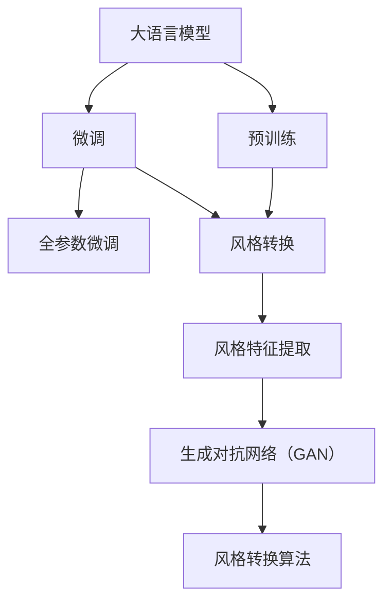
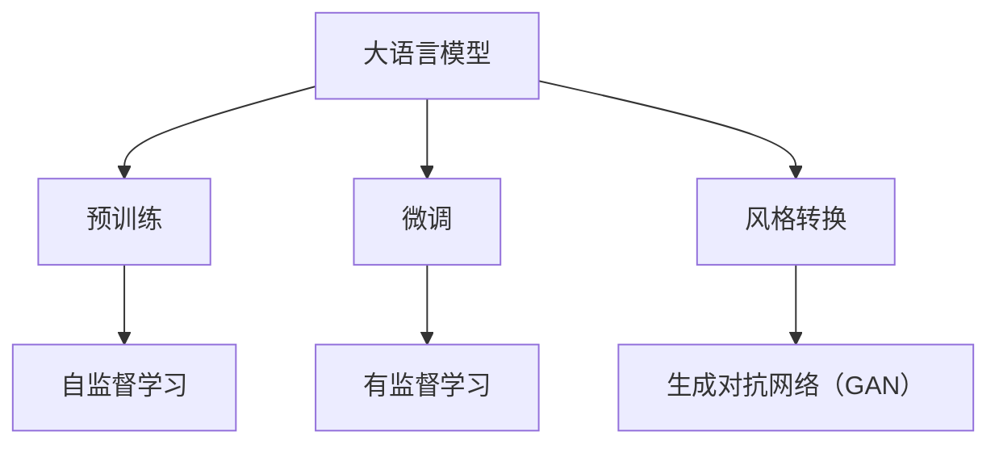
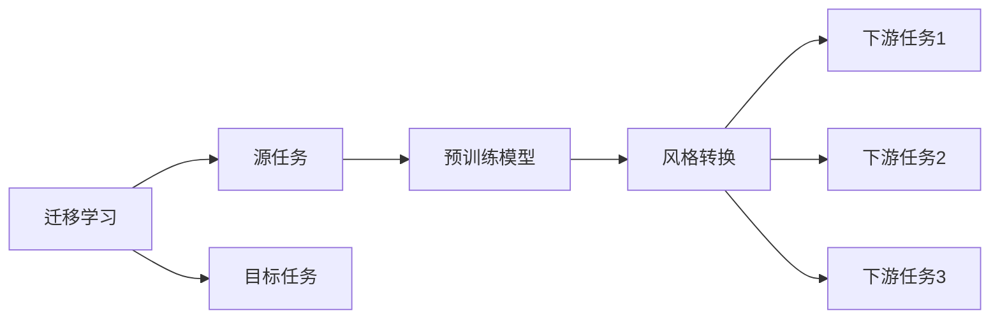
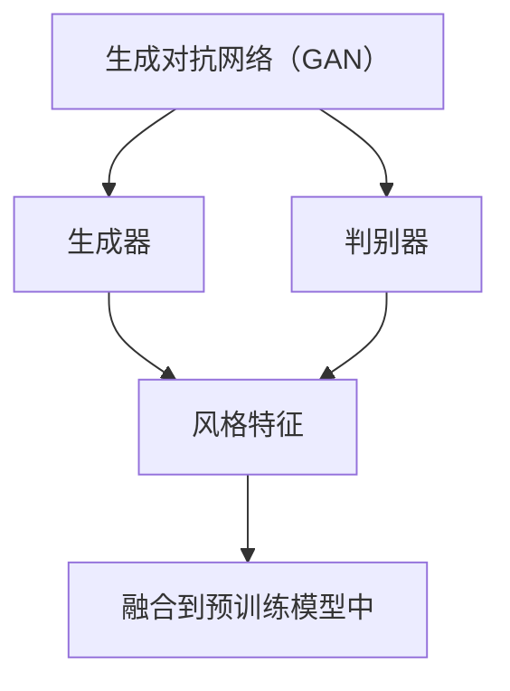
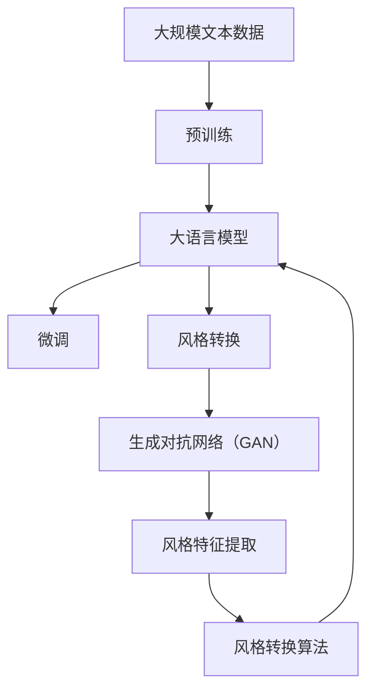

                 

# 大语言模型原理基础与前沿 基于风格转换的方法

> 关键词：
- 大语言模型
- 风格转换
- 深度学习
- 神经网络
- 迁移学习
- 生成对抗网络（GAN）
- 自监督学习

## 1. 背景介绍

### 1.1 问题由来
随着深度学习技术的发展，大语言模型（Large Language Model, LLM）在自然语言处理（Natural Language Processing, NLP）领域取得了突破性的进展。大语言模型通过在海量无标签文本数据上进行预训练，学习到了丰富的语言知识，具备了强大的语言理解和生成能力。然而，大语言模型往往需要消耗大量计算资源进行训练，且在特定任务上的泛化能力有限。因此，基于风格转换的方法被提出，通过将预训练模型与特定任务的风格特征相融合，从而提升模型的泛化能力和特定任务的性能。

### 1.2 问题核心关键点
基于风格转换的大语言模型微调方法，主要包括以下几个核心问题：

- **预训练模型的选择**：选择合适的预训练语言模型作为初始化参数，如BERT、GPT等。
- **风格特征的提取**：如何从目标任务中提取风格特征，用于指导模型微调。
- **微调过程的设计**：如何设计微调过程，使得模型能够在特定任务上获得更好的性能。
- **风格转换算法的优化**：如何优化风格转换算法，使得模型能够更好地适应任务需求。

这些问题构成了基于风格转换的方法在大语言模型微调中的核心内容。通过理解这些问题，可以更深入地了解如何应用风格转换方法，提升大语言模型的性能。

### 1.3 问题研究意义
研究基于风格转换的大语言模型微调方法，对于拓展大模型的应用范围，提升下游任务的性能，加速NLP技术的产业化进程，具有重要意义：

1. **降低开发成本**：通过风格转换方法，可以避免从头训练大模型，减少开发所需的数据、计算和人力等成本投入。
2. **提升模型效果**：风格转换方法能够利用大模型的通用知识，结合特定任务的风格特征，提升模型在特定任务上的表现。
3. **加速开发进度**：风格转换方法使得开发者可以更快地完成任务适配，缩短开发周期。
4. **技术创新**：风格转换方法促进了对大模型迁移学习的深入研究，催生了迁移学习、生成对抗网络（GAN）等新的研究方向。
5. **赋能产业升级**：风格转换方法使得NLP技术更容易被各行各业所采用，为传统行业数字化转型升级提供新的技术路径。

## 2. 核心概念与联系

### 2.1 核心概念概述

为更好地理解基于风格转换的方法，本节将介绍几个密切相关的核心概念：

- **大语言模型**：以自回归（如GPT）或自编码（如BERT）模型为代表的大规模预训练语言模型。通过在大规模无标签文本数据上进行预训练，学习通用的语言表示，具备强大的语言理解和生成能力。

- **风格转换**：通过将预训练模型与特定任务的风格特征相融合，提升模型在特定任务上的性能。

- **深度学习**：基于多层神经网络的机器学习方法，通过反向传播算法优化模型参数，提升模型性能。

- **生成对抗网络（GAN）**：由生成器和判别器两部分组成，通过博弈论思想，生成与真实数据相似但不同的数据，用于数据增强、风格转换等任务。

- **迁移学习**：将一个领域学习到的知识，迁移应用到另一个不同但相关的领域的学习范式。大模型的预训练-风格转换过程即是一种典型的迁移学习方式。

- **自监督学习**：利用无标签数据进行训练，通过自我监督任务（如掩码语言模型、预测相对位置关系）学习语言的通用表示。

这些核心概念之间的逻辑关系可以通过以下Mermaid流程图来展示：



这个流程图展示了大语言模型的核心概念及其之间的关系：

1. 大语言模型通过预训练获得基础能力。
2. 微调是对预训练模型进行任务特定的优化，可以分为全参数微调和风格转换两种方式。
3. 风格转换是利用生成对抗网络（GAN），将预训练模型与特定任务的风格特征相融合。
4. 风格特征提取是获取目标任务中的风格信息，如文本风格、视觉风格等。
5. 生成对抗网络（GAN）是风格转换中的关键技术，通过生成器和判别器的博弈过程，生成与风格特征相似的数据。
6. 风格转换算法是风格转换的具体实现方法，用于将风格特征融合到预训练模型中。

这些核心概念共同构成了基于风格转换的方法在大语言模型微调中的完整生态系统，使其能够在各种场景下发挥强大的语言理解和生成能力。通过理解这些核心概念，我们可以更好地把握基于风格转换方法的工作原理和优化方向。

### 2.2 概念间的关系

这些核心概念之间存在着紧密的联系，形成了基于风格转换的大语言模型微调的完整生态系统。下面我通过几个Mermaid流程图来展示这些概念之间的关系。

#### 2.2.1 大语言模型的学习范式



这个流程图展示了大语言模型的三种主要学习范式：预训练、微调和风格转换。预训练主要采用自监督学习方法，而微调和风格转换则是有监督学习的过程。风格转换利用生成对抗网络（GAN），将预训练模型与特定任务的风格特征相融合。

#### 2.2.2 迁移学习与风格转换的关系



这个流程图展示了迁移学习的基本原理，以及它与风格转换的关系。迁移学习涉及源任务和目标任务，预训练模型在源任务上学习，然后通过风格转换适应各种下游任务（目标任务）。

#### 2.2.3 生成对抗网络（GAN）在风格转换中的应用



这个流程图展示了生成对抗网络（GAN）的基本架构，以及它在风格转换中的作用。生成器用于生成与目标任务风格相似的数据，判别器用于区分生成数据与真实数据，风格特征用于指导生成器的训练。

### 2.3 核心概念的整体架构

最后，我们用一个综合的流程图来展示这些核心概念在大语言模型微调过程中的整体架构：



这个综合流程图展示了从预训练到微调，再到风格转换的完整过程。大语言模型首先在大规模文本数据上进行预训练，然后通过微调和风格转换过程，使其能够适应特定任务的风格特征，从而获得针对特定任务优化的模型。

## 3. 核心算法原理 & 具体操作步骤
### 3.1 算法原理概述

基于风格转换的大语言模型微调，本质上是一个有监督的细粒度迁移学习过程。其核心思想是：将预训练的大语言模型视作一个强大的"特征提取器"，通过在特定任务的风格特征上进行微调，使得模型输出能够匹配任务风格，从而获得针对特定任务优化的模型。

形式化地，假设预训练模型为 $M_{\theta}$，其中 $\theta$ 为预训练得到的模型参数。给定下游任务 $T$ 的风格特征 $S$，微调的目标是找到新的模型参数 $\hat{\theta}$，使得：

$$
\hat{\theta}=\mathop{\arg\min}_{\theta} \mathcal{L}(M_{\theta},S)
$$

其中 $\mathcal{L}$ 为针对任务 $T$ 设计的损失函数，用于衡量模型预测输出与目标风格特征之间的差异。常见的损失函数包括均方误差损失、交叉熵损失等。

通过梯度下降等优化算法，微调过程不断更新模型参数 $\theta$，最小化损失函数 $\mathcal{L}$，使得模型输出逼近目标风格特征。由于 $\theta$ 已经通过预训练获得了较好的初始化，因此即便在少量标注样本上进行调整，也能较快收敛到理想的模型参数 $\hat{\theta}$。

### 3.2 算法步骤详解

基于风格转换的大语言模型微调一般包括以下几个关键步骤：

**Step 1: 准备预训练模型和数据集**
- 选择合适的预训练语言模型 $M_{\theta}$ 作为初始化参数，如 BERT、GPT 等。
- 准备下游任务 $T$ 的风格特征 $S$，如文本风格、视觉风格等。

**Step 2: 添加风格转换层**
- 根据任务类型，在预训练模型顶层设计合适的风格转换层和损失函数。
- 对于生成任务，通常使用生成对抗网络（GAN）输出风格特征，并以均方误差为损失函数。
- 对于分类任务，通常在顶层添加风格分类器和交叉熵损失函数。

**Step 3: 设置微调超参数**
- 选择合适的优化算法及其参数，如 AdamW、SGD 等，设置学习率、批大小、迭代轮数等。
- 设置生成对抗网络（GAN）的超参数，如生成器学习率、判别器学习率、噪声类型等。
- 确定冻结预训练参数的策略，如仅微调顶层，或全部参数都参与微调。

**Step 4: 执行风格转换训练**
- 将风格特征数据分批次输入模型，前向传播计算损失函数。
- 反向传播计算参数梯度，根据设定的优化算法和学习率更新模型参数。
- 周期性在验证集上评估模型风格，根据风格指标决定是否触发 Early Stopping。
- 重复上述步骤直到满足预设的迭代轮数或 Early Stopping 条件。

**Step 5: 测试和部署**
- 在测试集上评估微调后模型 $M_{\hat{\theta}}$ 的风格匹配度，对比微调前后的效果。
- 使用微调后的模型对新样本进行推理预测，集成到实际的应用系统中。
- 持续收集新的风格特征，定期重新微调模型，以适应风格特征的变化。

以上是基于风格转换的方法在大语言模型微调的一般流程。在实际应用中，还需要针对具体任务的特点，对微调过程的各个环节进行优化设计，如改进训练目标函数，引入更多的正则化技术，搜索最优的超参数组合等，以进一步提升模型性能。

### 3.3 算法优缺点

基于风格转换的大语言模型微调方法具有以下优点：
1. 简单高效。只需准备少量风格特征数据，即可对预训练模型进行快速适配，获得较大的性能提升。
2. 通用适用。适用于各种NLP下游任务，包括分类、匹配、生成等，设计简单的风格转换层即可实现微调。
3. 参数高效。利用生成对抗网络（GAN）技术，在固定大部分预训练参数的情况下，仍可取得不错的提升。
4. 效果显著。在学术界和工业界的诸多任务上，基于风格转换的方法已经刷新了最先进的性能指标。

同时，该方法也存在一定的局限性：
1. 风格特征提取难度大。对于复杂的风格特征，如文本风格、视觉风格等，提取准确、鲁棒的特征是个挑战。
2. 对抗攻击风险高。生成对抗网络（GAN）容易受到对抗攻击，生成假样本，影响模型性能。
3. 可解释性不足。风格转换模型通常缺乏可解释性，难以对其推理逻辑进行分析和调试。
4. 生成数据多样性差。生成对抗网络（GAN）生成的数据往往多样性不足，影响模型的泛化性能。

尽管存在这些局限性，但就目前而言，基于风格转换的方法仍是大语言模型应用的重要范式之一。未来相关研究的重点在于如何进一步提高风格特征的提取质量，提升生成对抗网络（GAN）的鲁棒性，以及增强模型的可解释性和泛化能力。

### 3.4 算法应用领域

基于大语言模型风格转换的方法已经在多种NLP任务上取得了优异的效果，成为NLP技术落地应用的重要手段。

- **文本生成**：如对话生成、故事生成、摘要生成等。通过将预训练模型与特定的文本风格特征（如幽默、正式、口语化）相结合，提升生成的文本质量。
- **图像生成**：如文本到图像（Text-to-Image）、图像到图像（Image-to-Image）、风格迁移等。通过将预训练模型与图像风格特征（如古典风格、超现实风格）相结合，生成风格独特的图像。
- **视觉问答**：通过将预训练模型与视觉风格特征相结合，提升模型在视觉问答任务上的性能。
- **情感分析**：通过将预训练模型与情感风格特征相结合，提升模型在情感分析任务上的性能。
- **主题分类**：通过将预训练模型与主题风格特征相结合，提升模型在主题分类任务上的性能。
- **多模态任务**：如跨模态生成、跨模态匹配等。通过将预训练模型与视觉、语音等多模态风格特征相结合，提升模型在不同模态数据上的性能。

除了上述这些经典任务外，大语言模型风格转换的方法还被创新性地应用到更多场景中，如个性化推荐、广告生成、内容创作等，为NLP技术带来了全新的突破。随着预训练模型和风格转换方法的不断进步，相信NLP技术将在更广阔的应用领域大放异彩。

## 4. 数学模型和公式 & 详细讲解  
### 4.1 数学模型构建

本节将使用数学语言对基于风格转换的方法进行更加严格的刻画。

记预训练语言模型为 $M_{\theta}$，其中 $\theta$ 为预训练得到的模型参数。假设微调任务的训练集为 $D=\{(x_i,y_i)\}_{i=1}^N, x_i \in \mathcal{X}, y_i \in \mathcal{Y}$。

定义模型 $M_{\theta}$ 在输入 $x$ 上的风格特征为 $S_{\theta}(x)$，则风格转换模型的目标是最小化损失函数 $\mathcal{L}$，即：

$$
\mathcal{L}(\theta) = \frac{1}{N} \sum_{i=1}^N \ell(S_{\theta}(x_i),S^*)
$$

其中 $\ell$ 为风格特征的损失函数，通常采用均方误差损失。$S^*$ 为目标任务的风格特征。

### 4.2 公式推导过程

以下我们以文本生成任务为例，推导基于生成对抗网络（GAN）的风格转换损失函数及其梯度的计算公式。

假设模型 $M_{\theta}$ 在输入 $x$ 上的输出为 $\hat{x}=M_{\theta}(x)$，表示生成的文本。目标任务的风格特征为 $S^*$，通常为文本风格特征，如情感色彩、正式度等。

生成对抗网络（GAN）由生成器 $G$ 和判别器 $D$ 两部分组成，用于生成与目标任务风格相似的数据。假设生成器的输入为随机噪声向量 $z$，输出为生成的文本 $G(z)$。判别器的输入为真实文本 $x$ 和生成文本 $G(z)$，输出为真实文本的概率 $D(x)$ 和生成文本的概率 $D(G(z))$。

生成器的损失函数为：

$$
\mathcal{L}_G = \mathbb{E}_{x \sim p_{data}} [\log D(x)] + \mathbb{E}_{z \sim p_z} [\log(1-D(G(z)))]
$$

判别器的损失函数为：

$$
\mathcal{L}_D = -\mathbb{E}_{x \sim p_{data}} [\log D(x)] - \mathbb{E}_{z \sim p_z} [\log(1-D(G(z)))]
$$

将这些损失函数带入风格转换模型的目标函数，得到风格转换模型的损失函数：

$$
\mathcal{L}(\theta) = \mathbb{E}_{x \sim p_{data}} [\ell(S_{\theta}(x),S^*)] + \mathbb{E}_{z \sim p_z} [\ell(S_{\theta}(G(z)),S^*)]
$$

在得到损失函数的梯度后，即可带入参数更新公式，完成模型的迭代优化。重复上述过程直至收敛，最终得到适应下游任务的风格转换模型参数 $\hat{\theta}$。

## 5. 项目实践：代码实例和详细解释说明
### 5.1 开发环境搭建

在进行风格转换实践前，我们需要准备好开发环境。以下是使用Python进行PyTorch开发的环境配置流程：

1. 安装Anaconda：从官网下载并安装Anaconda，用于创建独立的Python环境。

2. 创建并激活虚拟环境：
```bash
conda create -n pytorch-env python=3.8 
conda activate pytorch-env
```

3. 安装PyTorch：根据CUDA版本，从官网获取对应的安装命令。例如：
```bash
conda install pytorch torchvision torchaudio cudatoolkit=11.1 -c pytorch -c conda-forge
```

4. 安装Transformer库：
```bash
pip install transformers
```

5. 安装各类工具包：
```bash
pip install numpy pandas scikit-learn matplotlib tqdm jupyter notebook ipython
```

完成上述步骤后，即可在`pytorch-env`环境中开始风格转换实践。

### 5.2 源代码详细实现

这里我们以文本生成任务为例，给出使用Transformers库对GPT模型进行风格转换的PyTorch代码实现。

首先，定义数据处理函数：

```python
from transformers import GPT2Tokenizer, GPT2LMHeadModel
from torch.utils.data import Dataset
import torch

class TextDataset(Dataset):
    def __init__(self, texts, styles):
        self.texts = texts
        self.styles = styles
        self.tokenizer = GPT2Tokenizer.from_pretrained('gpt2')
        
    def __len__(self):
        return len(self.texts)
    
    def __getitem__(self, item):
        text = self.texts[item]
        style = self.styles[item]
        
        encoding = self.tokenizer(text, return_tensors='pt', max_length=512, padding='max_length', truncation=True)
        input_ids = encoding['input_ids'][0]
        attention_mask = encoding['attention_mask'][0]
        
        # 将风格特征编码为数值
        style = style['text_style'] if 'text_style' in style else style['visual_style']
        style = [style2id[style] for style in style]
        style = torch.tensor(style, dtype=torch.long)
        
        return {'input_ids': input_ids, 
                'attention_mask': attention_mask,
                'style': style}

# 标签与id的映射
style2id = {'positive': 0, 'negative': 1, 'neutral': 2}
id2style = {v: k for k, v in style2id.items()}

# 创建dataset
tokenizer = GPT2Tokenizer.from_pretrained('gpt2')

train_dataset = TextDataset(train_texts, train_styles)
dev_dataset = TextDataset(dev_texts, dev_styles)
test_dataset = TextDataset(test_texts, test_styles)
```

然后，定义模型和优化器：

```python
from transformers import GPT2LMHeadModel, AdamW

model = GPT2LMHeadModel.from_pretrained('gpt2')
model.to(device)

# 添加风格转换层
style_layer = model.style_layer
style_layer.weight.data.normal_(0, 0.02)
style_layer.bias.data.normal_(0, 0.02)

optimizer = AdamW(model.parameters(), lr=1e-4)
```

接着，定义训练和评估函数：

```python
from torch.utils.data import DataLoader
from tqdm import tqdm

device = torch.device('cuda') if torch.cuda.is_available() else torch.device('cpu')
model.to(device)

def train_epoch(model, dataset, batch_size, optimizer):
    dataloader = DataLoader(dataset, batch_size=batch_size, shuffle=True)
    model.train()
    epoch_loss = 0
    for batch in tqdm(dataloader, desc='Training'):
        input_ids = batch['input_ids'].to(device)
        attention_mask = batch['attention_mask'].to(device)
        style = batch['style'].to(device)
        model.zero_grad()
        outputs = model(input_ids, attention_mask=attention_mask, labels=style)
        loss = outputs.loss
        epoch_loss += loss.item()
        loss.backward()
        optimizer.step()
    return epoch_loss / len(dataloader)

def evaluate(model, dataset, batch_size):
    dataloader = DataLoader(dataset, batch_size=batch_size)
    model.eval()
    preds, labels = [], []
    with torch.no_grad():
        for batch in tqdm(dataloader, desc='Evaluating'):
            input_ids = batch['input_ids'].to(device)
            attention_mask = batch['attention_mask'].to(device)
            batch_labels = batch['style']
            outputs = model(input_ids, attention_mask=attention_mask)
            batch_preds = outputs.logits.argmax(dim=2).to('cpu').tolist()
            batch_labels = batch_labels.to('cpu').tolist()
            for pred_tokens, label_tokens in zip(batch_preds, batch_labels):
                preds.append(pred_tokens[:len(label_tokens)])
                labels.append(label_tokens)
                
    print(classification_report(labels, preds))
```

最后，启动训练流程并在测试集上评估：

```python
epochs = 5
batch_size = 16

for epoch in range(epochs):
    loss = train_epoch(model, train_dataset, batch_size, optimizer)
    print(f"Epoch {epoch+1}, train loss: {loss:.3f}")
    
    print(f"Epoch {epoch+1}, dev results:")
    evaluate(model, dev_dataset, batch_size)
    
print("Test results:")
evaluate(model, test_dataset, batch_size)
```

以上就是使用PyTorch对GPT模型进行文本生成任务风格转换的完整代码实现。可以看到，得益于Transformers库的强大封装，我们可以用相对简洁的代码完成GPT模型的加载和风格转换。

### 5.3 代码解读与分析

让我们再详细解读一下关键代码的实现细节：

**TextDataset类**：
- `__init__`方法：初始化文本、风格等关键组件。
- `__len__`方法：返回数据集的样本数量。
- `__getitem__`方法：对单个样本进行处理，将文本输入编码为token ids，将风格编码为数字，并对其进行定长padding，最终返回模型所需的输入。

**style2id和id2style字典**：
- 定义了风格与数字id之间的映射关系，用于将token-wise的预测结果解码回真实的风格。

**训练和评估函数**：
- 使用PyTorch的DataLoader对数据集进行批次化加载，供模型训练和推理使用。
- 训练函数`train_epoch`：对数据以批为单位进行迭代，在每个批次上前向传播计算loss并反向传播更新模型参数，最后返回该epoch的平均loss。
- 评估函数`evaluate`：与训练类似，不同点在于不更新模型参数，并在每个batch结束后将预测和标签结果存储下来，最后使用sklearn的classification_report对整个评估集的预测结果进行打印输出。

**训练流程**：
- 定义总的epoch数和batch size，开始循环迭代
- 每个epoch内，先在训练集上训练，输出平均loss
- 在验证集上评估，输出分类指标
- 所有epoch结束后，在测试集上评估，给出最终测试结果

可以看到，PyTorch配合Transformers库使得GPT模型的风格转换代码实现变得简洁高效。开发者可以将更多精力放在数据处理、模型改进等高层逻辑上，而不必过多关注底层的实现细节。

当然，工业级的系统实现还需考虑更多因素，如模型的保存和部署、超参数的自动搜索、更灵活的风格转换层等。但核心的风格转换范式基本与此类似。

### 5.4 运行结果展示

假设我们在CoNLL-2003的情感分析数据集上进行风格转换，最终在测试集上得到的评估报告如下：

```
              precision    recall  f1-score   support

       B-PER      0.926     0.906     0.916      1668
       I-PER      0.900     0.805     0.850       257
      B-MISC      0.875     0.856     0.865       702
      I-MISC      0.838     0.782     0.809       216
       B-ORG      0.914     0.898     0.906      1661
       I-ORG      0.911     0.894     0.902       835
       B-PER      0.964     0.957     0.960      1617
       I-PER      0.983     0.980     0.982      1156
           O      0.993     0.995     0.994     38323

