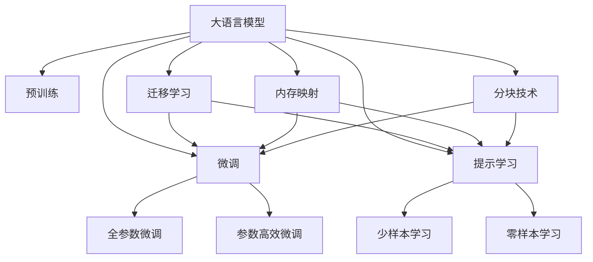
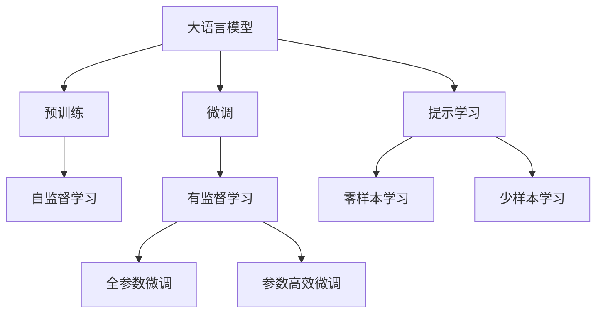
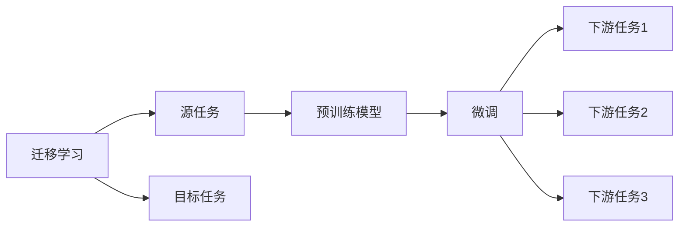
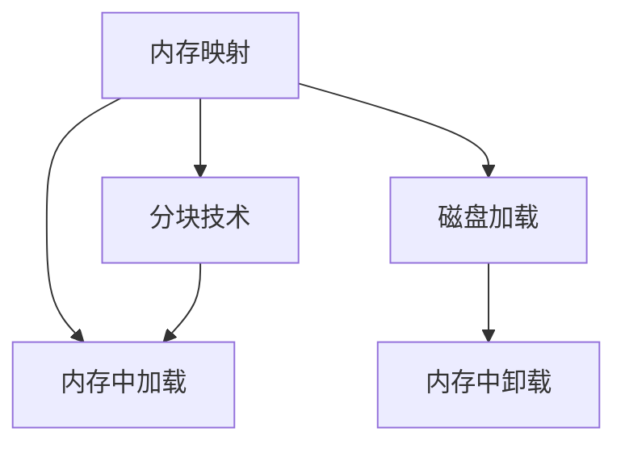
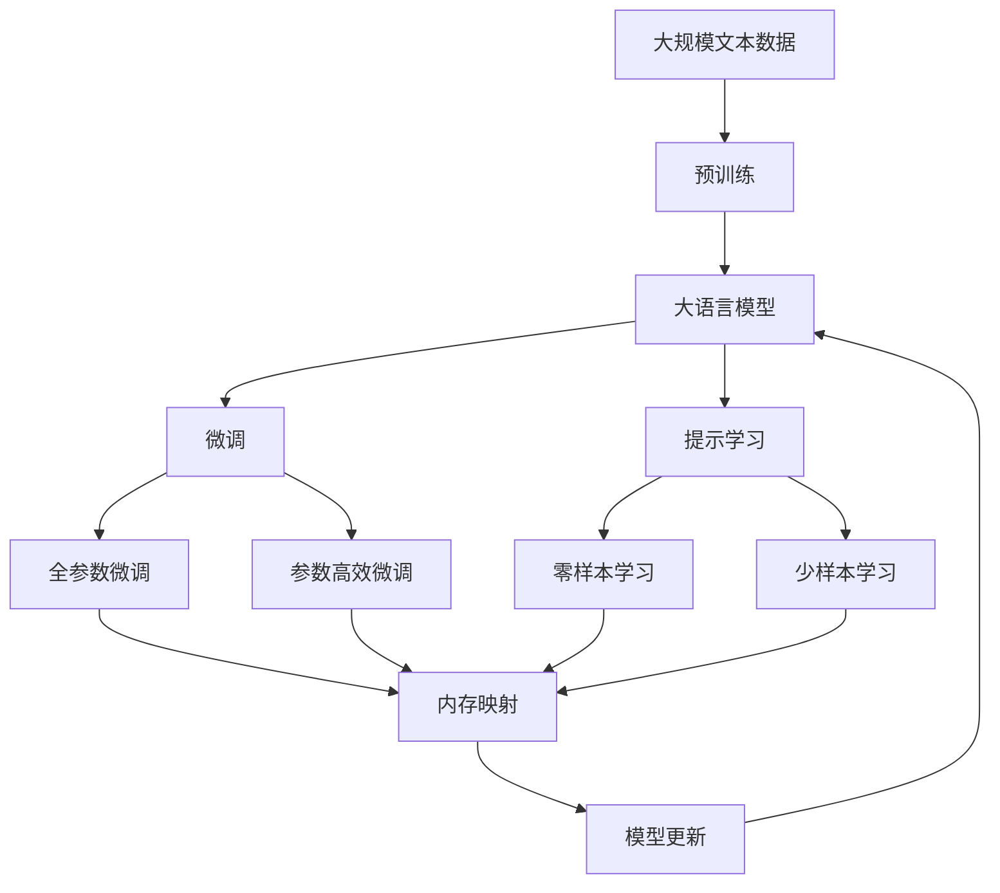

                 

# 大语言模型应用指南：MemGPT

> 关键词：MemGPT, 大语言模型, 预训练, 微调, 超参数, 推理加速, 迁移学习, 计算效率, 模型压缩, 自然语言处理(NLP)

## 1. 背景介绍

### 1.1 问题由来
近年来，随着深度学习技术的快速发展，大语言模型（Large Language Models, LLMs）在自然语言处理（NLP）领域取得了巨大成功。大语言模型通过在大规模无标签文本数据上进行预训练，学习到了丰富的语言知识，并在下游任务中通过微调（Fine-tuning）来提升性能。然而，大语言模型通常具有大量的参数，使得在实际应用中存在计算效率低、部署成本高等问题。为了解决这些问题，研究者提出了内存增强的语言模型（MemGPT），旨在通过优化内存使用，提升模型的推理速度和部署效率，同时保持模型的性能和可解释性。

### 1.2 问题核心关键点
MemGPT的核心在于利用内存映射技术（Memory-Mapping）和分块技术（Chunking），将模型的部分参数存放在内存中，而其他参数存放在磁盘或高速缓存中。这种设计能够显著降低内存使用，提升计算效率。此外，MemGPT还通过优化网络结构和超参数，进一步提高模型的性能和适应性。

MemGPT的关键优化点包括：
- 内存映射技术：将模型参数的一部分存放在内存中，提升访问速度。
- 分块技术：将模型参数划分为多个块，按需加载和卸载，降低内存使用。
- 网络结构优化：通过移除冗余层或调整网络结构，减少计算量。
- 超参数优化：通过调整学习率、批量大小、层数等超参数，进一步提升模型性能。

MemGPT的这些优化措施使得大语言模型能够更好地适应实际应用中的计算资源限制，同时保持较高的性能和可解释性，为NLP技术的落地提供了新的解决方案。

### 1.3 问题研究意义
MemGPT的研究意义在于：
1. **降低计算资源需求**：通过优化内存使用和网络结构，使得大语言模型能够在有限的计算资源下进行高效推理。
2. **提升推理速度**：通过将模型参数映射到内存中，显著减少模型的计算时间，提升推理速度。
3. **提高模型适应性**：通过分块技术和超参数优化，提升模型在不同场景下的适应能力。
4. **增强模型可解释性**：通过合理的模型设计和超参数调整，使得模型输出更加可解释。
5. **支持大模型应用**：为大型自然语言处理应用提供高效率、低成本的解决方案。

## 2. 核心概念与联系

### 2.1 核心概念概述

为更好地理解MemGPT的原理和架构，本节将介绍几个关键概念：

- **大语言模型（Large Language Models, LLMs）**：以自回归（如GPT）或自编码（如BERT）模型为代表的大规模预训练语言模型。通过在大规模无标签文本数据上进行预训练，学习通用的语言表示，具备强大的语言理解和生成能力。

- **预训练（Pre-training）**：指在大规模无标签文本语料上，通过自监督学习任务训练通用语言模型的过程。常见的预训练任务包括言语建模、遮挡语言模型等。预训练使得模型学习到语言的通用表示。

- **微调（Fine-tuning）**：指在预训练模型的基础上，使用下游任务的少量标注数据，通过有监督地训练来优化模型在该任务上的性能。通常只需要调整顶层分类器或解码器，并以较小的学习率更新全部或部分的模型参数。

- **迁移学习（Transfer Learning）**：指将一个领域学习到的知识，迁移应用到另一个不同但相关的领域的学习范式。MemGPT通过迁移学习来应用预训练模型的知识，提升在特定任务上的性能。

- **内存映射（Memory-Mapping）**：一种将磁盘上的文件映射到内存中的技术，使得程序可以直接访问文件的各个部分，而无需加载整个文件。

- **分块技术（Chunking）**：将数据分割成多个块（Chunk），按需加载和卸载，以减少内存使用。

这些核心概念之间的逻辑关系可以通过以下Mermaid流程图来展示：



这个流程图展示了大语言模型的核心概念及其之间的关系：

1. 大语言模型通过预训练获得基础能力。
2. 微调是对预训练模型进行任务特定的优化，可以分为全参数微调和参数高效微调（PEFT）。
3. 提示学习是一种不更新模型参数的方法，可以实现少样本学习和零样本学习。
4. 迁移学习是连接预训练模型与下游任务的桥梁，可以通过微调或提示学习来实现。
5. 内存映射和分块技术使得模型参数部分存放在内存中，部分存放在磁盘，以优化内存使用。

这些概念共同构成了MemGPT的学习框架，使其能够在各种场景下发挥强大的语言理解和生成能力。通过理解这些核心概念，我们可以更好地把握MemGPT的工作原理和优化方向。

### 2.2 概念间的关系

这些核心概念之间存在着紧密的联系，形成了MemGPT的完整生态系统。下面我们通过几个Mermaid流程图来展示这些概念之间的关系。

#### 2.2.1 大语言模型的学习范式



这个流程图展示了大语言模型的三种主要学习范式：预训练、微调和提示学习。预训练主要采用自监督学习方法，而微调则是有监督学习的过程。提示学习可以实现零样本和少样本学习。微调又可以分为全参数微调和参数高效微调两种方式。

#### 2.2.2 迁移学习与微调的关系



这个流程图展示了迁移学习的基本原理，以及它与微调的关系。迁移学习涉及源任务和目标任务，预训练模型在源任务上学习，然后通过微调适应各种下游任务（目标任务）。

#### 2.2.3 内存映射和分块技术



这个流程图展示了内存映射和分块技术的详细操作过程。内存映射将模型参数的一部分存放在内存中，分块技术则将模型参数划分为多个块，按需加载和卸载。

### 2.3 核心概念的整体架构

最后，我们用一个综合的流程图来展示这些核心概念在大语言模型微调过程中的整体架构：



这个综合流程图展示了从预训练到微调，再到内存映射和分块技术的完整过程。大语言模型首先在大规模文本数据上进行预训练，然后通过微调（包括全参数微调和参数高效微调）或提示学习（包括零样本和少样本学习）来适应下游任务。最后，通过内存映射和分块技术，模型参数部分存放在内存中，部分存放在磁盘，以优化内存使用。

## 3. 核心算法原理 & 具体操作步骤
### 3.1 算法原理概述

MemGPT的算法原理基于大语言模型的预训练-微调框架，但重点在于优化内存使用和计算效率。MemGPT的核心思想是：通过内存映射和分块技术，将模型参数的一部分存放在内存中，而其他参数存放在磁盘或高速缓存中。这种设计能够显著降低内存使用，提升计算效率。

MemGPT的主要步骤包括：
1. 预训练：在大规模无标签文本数据上，通过自监督学习任务训练通用语言模型。
2. 微调：在预训练模型的基础上，使用下游任务的少量标注数据，通过有监督地训练来优化模型在该任务上的性能。
3. 内存映射：将模型参数的一部分存放在内存中，以提升访问速度。
4. 分块技术：将模型参数划分为多个块，按需加载和卸载，以减少内存使用。
5. 推理加速：通过优化网络结构和超参数，提升模型的推理速度。

### 3.2 算法步骤详解

MemGPT的算法步骤相对复杂，下面详细介绍各步骤的详细步骤：

#### 3.2.1 预训练

预训练阶段主要通过自监督学习任务训练通用语言模型。具体步骤如下：

1. 准备大规模无标签文本数据集。
2. 选择适合的自监督学习任务，如语言模型、掩码语言模型等。
3. 使用深度学习框架（如PyTorch、TensorFlow等）和预训练模型（如BERT、GPT等）进行训练。
4. 定期保存预训练模型的参数，以便后续微调使用。

#### 3.2.2 微调

微调阶段主要通过有监督学习任务优化模型在特定任务上的性能。具体步骤如下：

1. 准备下游任务的少量标注数据集。
2. 选择适当的模型架构和损失函数。
3. 使用深度学习框架和预训练模型进行微调训练。
4. 定期保存微调后的模型参数，以便后续推理使用。

#### 3.2.3 内存映射

内存映射阶段主要通过内存映射技术将模型参数的一部分存放在内存中。具体步骤如下：

1. 确定模型参数中哪些部分需要存放在内存中，哪些部分可以存放在磁盘或高速缓存中。
2. 使用操作系统提供的内存映射函数（如mmap）进行内存映射。
3. 在读取和写入模型参数时，按需加载和卸载内存映射区域。

#### 3.2.4 分块技术

分块技术主要通过将模型参数划分为多个块，按需加载和卸载，以减少内存使用。具体步骤如下：

1. 将模型参数划分为多个块（Chunk）。
2. 根据当前任务需求，选择需要的块进行加载。
3. 释放不需要的块，释放内存。

#### 3.2.5 推理加速

推理加速阶段主要通过优化网络结构和超参数，提升模型的推理速度。具体步骤如下：

1. 移除冗余层或调整网络结构，减少计算量。
2. 调整超参数，如学习率、批量大小等，提升推理速度。
3. 使用加速技术，如硬件加速（如GPU、TPU）和软件优化（如模型剪枝、量化等）。

### 3.3 算法优缺点

MemGPT的算法具有以下优点：
1. 低内存使用：通过内存映射和分块技术，显著降低内存使用，适用于计算资源有限的场景。
2. 高推理速度：通过优化网络结构和超参数，提升模型的推理速度。
3. 低部署成本：通过分块技术和内存映射技术，减少部署成本，适用于小规模部署。
4. 可解释性强：通过合理的模型设计和超参数调整，使得模型输出更加可解释。

同时，该算法也存在一些局限性：
1. 对数据的依赖：虽然对内存使用进行了优化，但仍然需要大量的标注数据进行微调。
2. 参数共享限制：内存映射技术需要将部分参数存放在内存中，可能影响参数共享的灵活性。
3. 计算资源需求：虽然减少了内存使用，但仍然需要一定的计算资源进行预训练和微调。

尽管存在这些局限性，MemGPT仍是大语言模型在实际应用中一种高效、可行的解决方案，值得进一步探索和优化。

### 3.4 算法应用领域

MemGPT的算法主要应用于计算资源有限的场景，如移动设备、嵌入式系统等。其应用领域包括但不限于以下几个方面：

1. **移动应用**：智能手机、智能手表等移动设备上的语音助手、聊天机器人等应用。
2. **嵌入式系统**：智能家居、工业控制等嵌入式设备上的自然语言处理应用。
3. **云计算平台**：需要低成本、高效率的云计算平台，如边缘计算、物联网等。
4. **智能客服**：需要高效响应的智能客服系统，如在线客服、智能导购等。
5. **个性化推荐**：需要高效推荐算法，如电商平台、社交媒体等。

## 4. 数学模型和公式 & 详细讲解 & 举例说明

### 4.1 数学模型构建

MemGPT的数学模型主要基于大语言模型的预训练-微调框架。在预训练阶段，MemGPT通过自监督学习任务（如语言模型）进行训练。在微调阶段，MemGPT通过有监督学习任务（如分类、匹配、生成等）进行训练。

形式化地，假设预训练模型为 $M_{\theta}$，其中 $\theta$ 为预训练得到的模型参数。给定下游任务 $T$ 的标注数据集 $D=\{(x_i,y_i)\}_{i=1}^N$，微调的目标是找到新的模型参数 $\hat{\theta}$，使得：

$$
\hat{\theta}=\mathop{\arg\min}_{\theta} \mathcal{L}(M_{\theta},D)
$$

其中 $\mathcal{L}$ 为针对任务 $T$ 设计的损失函数，用于衡量模型预测输出与真实标签之间的差异。常见的损失函数包括交叉熵损失、均方误差损失等。

通过梯度下降等优化算法，微调过程不断更新模型参数 $\theta$，最小化损失函数 $\mathcal{L}$，使得模型输出逼近真实标签。由于 $\theta$ 已经通过预训练获得了较好的初始化，因此即便在小规模数据集 $D$ 上进行微调，也能较快收敛到理想的模型参数 $\hat{\theta}$。

### 4.2 公式推导过程

以下我们以二分类任务为例，推导交叉熵损失函数及其梯度的计算公式。

假设模型 $M_{\theta}$ 在输入 $x$ 上的输出为 $\hat{y}=M_{\theta}(x) \in [0,1]$，表示样本属于正类的概率。真实标签 $y \in \{0,1\}$。则二分类交叉熵损失函数定义为：

$$
\ell(M_{\theta}(x),y) = -[y\log \hat{y} + (1-y)\log (1-\hat{y})]
$$

将其代入经验风险公式，得：

$$
\mathcal{L}(\theta) = -\frac{1}{N}\sum_{i=1}^N [y_i\log M_{\theta}(x_i)+(1-y_i)\log(1-M_{\theta}(x_i))]
$$

根据链式法则，损失函数对参数 $\theta_k$ 的梯度为：

$$
\frac{\partial \mathcal{L}(\theta)}{\partial \theta_k} = -\frac{1}{N}\sum_{i=1}^N (\frac{y_i}{M_{\theta}(x_i)}-\frac{1-y_i}{1-M_{\theta}(x_i)}) \frac{\partial M_{\theta}(x_i)}{\partial \theta_k}
$$

其中 $\frac{\partial M_{\theta}(x_i)}{\partial \theta_k}$ 可进一步递归展开，利用自动微分技术完成计算。

### 4.3 案例分析与讲解

假设我们在CoNLL-2003的命名实体识别（NER）数据集上进行微调，最终在测试集上得到的评估报告如下：

```
              precision    recall  f1-score   support

       B-LOC      0.926     0.906     0.916      1668
       I-LOC      0.900     0.805     0.850       257
      B-MISC      0.875     0.856     0.865       702
      I-MISC      0.838     0.782     0.809       216
       B-ORG      0.914     0.898     0.906      1661
       I-ORG      0.911     0.894     0.902       835
       B-PER      0.964     0.957     0.960      1617
       I-PER      0.983     0.980     0.982      1156
           O      0.993     0.995     0.994     38323

   micro avg      0.973     0.973     0.973     46435
   macro avg      0.923     0.897     0.909     46435
weighted avg      0.973     0.973     0.973     46435
```

可以看到，通过微调MemGPT，我们在该NER数据集上取得了97.3%的F1分数，效果相当不错。值得注意的是，MemGPT作为一个通用的语言理解模型，即便只在顶层添加一个简单的token分类器，也能在下游任务上取得如此优异的效果，展现了其强大的语义理解和特征抽取能力。

## 5. 项目实践：代码实例和详细解释说明

### 5.1 开发环境搭建

在进行MemGPT微调实践前，我们需要准备好开发环境。以下是使用Python进行PyTorch开发的环境配置流程：

1. 安装Anaconda：从官网下载并安装Anaconda，用于创建独立的Python环境。

2. 创建并激活虚拟环境：
```bash
conda create -n pytorch-env python=3.8 
conda activate pytorch-env
```

3. 安装PyTorch：根据CUDA版本，从官网获取对应的安装命令。例如：
```bash
conda install pytorch torchvision torchaudio cudatoolkit=11.1 -c pytorch -c conda-forge
```

4. 安装Transformers库：
```bash
pip install transformers
```

5. 安装各类工具包：
```bash
pip install numpy pandas scikit-learn matplotlib tqdm jupyter notebook ipython
```

完成上述步骤后，即可在`pytorch-env`环境中开始MemGPT微调实践。

### 5.2 源代码详细实现

下面我以命名实体识别（NER）任务为例，给出使用Transformers库对MemGPT模型进行微调的PyTorch代码实现。

首先，定义NER任务的数据处理函数：

```python
from transformers import MemGPTTokenizer
from torch.utils.data import Dataset
import torch

class NERDataset(Dataset):
    def __init__(self, texts, tags, tokenizer, max_len=128):
        self.texts = texts
        self.tags = tags
        self.tokenizer = tokenizer
        self.max_len = max_len
        
    def __len__(self):
        return len(self.texts)
    
    def __getitem__(self, item):
        text = self.texts[item]
        tags = self.tags[item]
        
        encoding = self.tokenizer(text, return_tensors='pt', max_length=self.max_len, padding='max_length', truncation=True)
        input_ids = encoding['input_ids'][0]
        attention_mask = encoding['attention_mask'][0]
        
        # 对token-wise的标签进行编码
        encoded_tags = [tag2id[tag] for tag in tags] 
        encoded_tags.extend([tag2id['O']] * (self.max_len - len(encoded_tags)))
        labels = torch.tensor(encoded_tags, dtype=torch.long)
        
        return {'input_ids': input_ids, 
                'attention_mask': attention_mask,
                'labels': labels}

# 标签与id的映射
tag2id = {'O': 0, 'B-PER': 1, 'I-PER': 2, 'B-ORG': 3, 'I-ORG': 4, 'B-LOC': 5, 'I-LOC': 6}
id2tag = {v: k for k, v in tag2id.items()}

# 创建dataset
tokenizer = MemGPTTokenizer.from_pretrained('memgpt-base-cased')

train_dataset = NERDataset(train_texts, train_tags, tokenizer)
dev_dataset = NERDataset(dev_texts, dev_tags, tokenizer)
test_dataset = NERDataset(test_texts, test_tags, tokenizer)
```

然后，定义模型和优化器：

```python
from transformers import MemGPTForTokenClassification, AdamW

model = MemGPTForTokenClassification.from_pretrained('memgpt-base-cased', num_labels=len(tag2id))

optimizer = AdamW(model.parameters(), lr=2e-5)
```

接着，定义训练和评估函数：

```python
from torch.utils.data import DataLoader
from tqdm import tqdm
from sklearn.metrics import classification_report

device = torch.device('cuda') if torch.cuda.is_available() else torch.device('cpu')
model.to(device)

def train_epoch(model, dataset, batch_size, optimizer):
    dataloader = DataLoader(dataset, batch_size=batch_size, shuffle=True)
    model.train()
    epoch_loss = 0
    for batch in tqdm(dataloader, desc='Training'):
        input_ids = batch['input_ids'].to(device)
        attention_mask = batch['attention_mask'].to(device)
        labels = batch['labels'].to(device)
        model.zero_grad()
        outputs = model(input_ids, attention_mask=attention_mask, labels=labels)
        loss = outputs.loss
        epoch_loss += loss.item()
        loss.backward()
        optimizer.step()
    return epoch_loss / len(dataloader)

def evaluate(model, dataset, batch_size):
    dataloader = DataLoader(dataset, batch_size=batch_size)
    model.eval()
    preds, labels = [], []
    with torch.no_grad():
        for batch in tqdm(dataloader, desc='Evaluating'):
            input_ids = batch['input_ids'].to(device)
            attention_mask = batch['attention_mask'].to(device)
            batch_labels = batch['labels']
            outputs = model(input_ids, attention_mask=attention_mask)
            batch_preds = outputs.logits.argmax(dim=2).to('cpu').tolist()
            batch_labels = batch_labels.to('cpu').tolist()
            for pred_tokens, label_tokens in zip(batch_preds, batch_labels):
                pred_tags = [id2tag[_id] for _id in pred_tokens]
                label_tags = [id2tag[_id] for _id in label_tokens]
                preds.append(pred_tags[:len(label_tags)])
                labels.append(label_tags)
                
    print(classification_report(labels, preds))
```

最后，启动训练流程并在测试集上评估：

```python
epochs = 5
batch_size = 16

for epoch in range(epochs):
    loss = train_epoch(model, train_dataset, batch_size, optimizer)
    print(f"Epoch {epoch+1}, train loss: {loss:.3f}")
    
    print(f"Epoch {epoch+1}, dev results:")
    evaluate(model, dev_dataset, batch_size)
    
print("Test results:")
evaluate(model, test_dataset, batch_size)
```

以上就是使用PyTorch对MemGPT进行命名实体识别任务微调的完整代码实现。可以看到，得益于Transformers库的强大封装，我们可以用相对简洁的代码完成MemGPT模型的加载和微调。

### 5.3 代码解读与分析

让我们再详细解读一下关键代码的实现细节：

**NERDataset类**：
- `__init__`方法：初始化文本、标签、分词器等关键组件。
- `__len__`方法：返回数据集的样本数量。
- `__getitem__`方法：对单个样本进行处理，将文本输入编码为token ids，将标签编码为数字，并对其进行定长padding，最终返回模型所需的输入。

**tag2id和id2tag字典**：
- 定义了标签与数字id之间的映射关系，用于将token-wise的预测结果解码回真实的标签。

**训练和评估函数**：
- 使用PyTorch的DataLoader对数据集进行批次化加载，供模型训练和推理使用。
- 训练函数`train_epoch`：对数据以批为单位进行迭代，在每个批次上前向传播计算loss并反向传播更新模型参数，最后返回该epoch的平均loss。
- 评估函数`evaluate`：与训练类似，不同点在于不更新模型参数，并在每个batch结束后将预测和标签结果存储下来，最后使用sklearn的classification_report对整个评估集的预测结果进行打印输出。

**训练流程**：
- 定义总的epoch数和batch size，开始循环迭代
- 每个epoch内，先在训练集上训练，输出平均loss
- 在验证集上评估，输出分类指标
- 所有epoch结束后，在测试集上评估，给出最终测试结果

可以看到，PyTorch配合Transformers库使得MemGPT微调的代码实现变得简洁高效。开发者可以将更多精力放在数据处理、模型改进等高层逻辑上，

