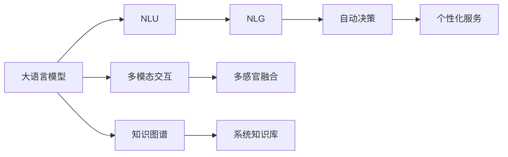
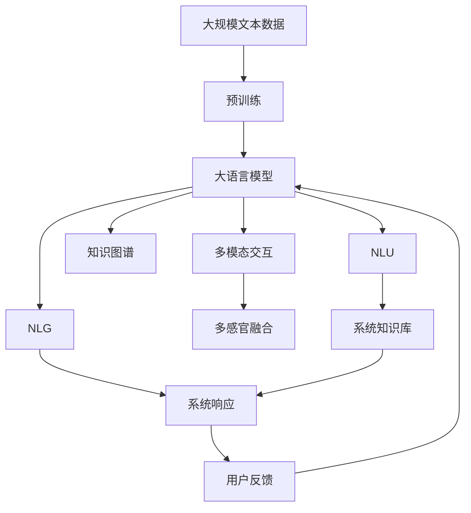

                 

# 大语言模型操作系统的应用

> 关键词：大语言模型, 操作系统, 自然语言处理, 自然语言理解, 人工智能, 机器学习

## 1. 背景介绍

### 1.1 问题由来
随着人工智能技术的不断进步，大语言模型（Large Language Model, LLM）在自然语言处理（Natural Language Processing, NLP）领域取得了巨大的突破。这些大模型通过在大规模无标签文本语料上进行预训练，学习到了丰富的语言知识和常识，具有强大的语言理解和生成能力。然而，尽管LLM在语言理解和生成方面表现出色，但它们在操作系统层面的应用仍处于起步阶段。大语言模型在操作系统中的应用，可以帮助实现更智能、更灵活的操作系统交互方式，提高系统的可用性和用户体验。

### 1.2 问题核心关键点
大语言模型在操作系统中的应用，主要集中在以下几个方面：
1. **自然语言理解（NLU）**：大语言模型可以理解用户的自然语言指令，提供更加直观、自然的人机交互方式。
2. **自然语言生成（NLG）**：大语言模型可以根据用户输入生成相应的系统响应，提高系统的智能化水平。
3. **知识图谱和常识推理**：大语言模型可以整合知识图谱和常识信息，提供更准确、更全面的系统知识库。
4. **多模态交互**：大语言模型可以与视觉、语音、图像等多模态数据进行交互，提升系统的感知能力和用户体验。
5. **自动化决策**：大语言模型可以根据用户需求和系统数据自动决策，提供个性化的服务。

### 1.3 问题研究意义
大语言模型在操作系统中的应用，对于提升系统的智能化、灵活性和用户体验具有重要意义：
1. **降低开发成本**：通过大语言模型，可以实现操作系统的自然语言交互，减少传统用户界面设计的复杂度和开发成本。
2. **提高系统响应速度**：大语言模型可以快速理解和响应用户指令，减少用户等待时间，提升系统的响应速度。
3. **增强用户体验**：自然语言交互使得用户可以更自然、更直观地与操作系统进行交互，提高用户体验。
4. **提升系统智能水平**：大语言模型可以整合知识图谱和常识推理，提供更准确、更全面的系统信息，提升系统的智能水平。
5. **推动产业升级**：大语言模型操作系统可以在多个行业领域应用，推动产业升级，提升整体行业的智能化水平。

## 2. 核心概念与联系

### 2.1 核心概念概述

为更好地理解大语言模型在操作系统中的应用，本节将介绍几个关键概念：

- **大语言模型（LLM）**：以自回归（如GPT）或自编码（如BERT）模型为代表的大规模预训练语言模型。通过在大规模无标签文本语料上进行预训练，学习到了通用的语言表示，具备强大的语言理解和生成能力。
- **自然语言理解（NLU）**：指系统理解并解释自然语言的能力，包括分词、词性标注、句法分析、语义分析等。
- **自然语言生成（NLG）**：指系统根据用户输入，自动生成自然语言输出的能力。
- **知识图谱（KG）**：由实体、关系、属性等信息构成的图形结构，用于描述和组织复杂概念之间的关系。
- **多模态交互**：指系统同时处理文本、图像、语音等多种类型的数据，实现更全面、更自然的人机交互。

### 2.2 概念间的关系

这些核心概念之间存在着紧密的联系，形成了大语言模型操作系统交互的完整生态系统。下面通过几个Mermaid流程图来展示这些概念之间的关系：



这个流程图展示了从预训练到交互过程的关键环节：
- 大语言模型经过预训练，获得基础的语言表示能力。
- 通过NLU理解用户输入，将自然语言转化为系统可处理的结构化信息。
- NLG根据用户输入和系统知识库生成相应的系统响应。
- 多模态交互使得系统可以同时处理多种类型的数据，提升感知能力。
- 自动决策使得系统能够根据用户需求和系统数据自动做出决策。

### 2.3 核心概念的整体架构

最后，我们用一个综合的流程图来展示这些核心概念在大语言模型操作系统交互中的整体架构：



这个综合流程图展示了从预训练到交互、反馈的完整过程。大语言模型首先在大规模文本数据上进行预训练，然后通过NLU、NLG、知识图谱和多模态交互等技术，实现系统的自然语言交互，最后根据用户反馈进行持续优化。

## 3. 核心算法原理 & 具体操作步骤
### 3.1 算法原理概述

大语言模型在操作系统中的应用，主要依赖于自然语言理解（NLU）和自然语言生成（NLG）技术。其核心思想是：将大语言模型视作一个强大的"语言理解器"和"语言生成器"，通过理解用户输入的自然语言，自动生成相应的系统响应，从而实现自然语言交互。

形式化地，假设大语言模型为 $M_{\theta}$，其中 $\theta$ 为预训练得到的模型参数。给定用户的自然语言输入 $x$，模型的任务是理解输入的含义，并生成相应的系统响应 $y$。即：

$$
y = M_{\theta}(x)
$$

在实践中，我们通常使用基于梯度的优化算法（如Adam、SGD等）来训练模型，最小化预测输出与真实标签之间的差异。通过大量的有标签数据训练，使模型能够准确地理解自然语言输入，生成高质量的系统响应。

### 3.2 算法步骤详解

大语言模型在操作系统中的应用，主要包括以下几个关键步骤：

**Step 1: 准备预训练模型和数据集**
- 选择合适的预训练语言模型 $M_{\theta}$ 作为初始化参数，如 BERT、GPT 等。
- 准备操作系统相关的任务数据集，如命令执行、界面交互、系统配置等。

**Step 2: 定义自然语言理解（NLU）和自然语言生成（NLG）任务**
- 定义NLU任务，将用户的自然语言输入映射为系统可理解的向量表示。
- 定义NLG任务，根据NLU输出的向量表示，自动生成系统响应。

**Step 3: 设置微调超参数**
- 选择合适的优化算法及其参数，如 Adam、SGD 等，设置学习率、批大小、迭代轮数等。
- 设置正则化技术及强度，包括权重衰减、Dropout、Early Stopping 等。
- 确定冻结预训练参数的策略，如仅微调顶层，或全部参数都参与微调。

**Step 4: 执行梯度训练**
- 将训练集数据分批次输入模型，前向传播计算损失函数。
- 反向传播计算参数梯度，根据设定的优化算法和学习率更新模型参数。
- 周期性在验证集上评估模型性能，根据性能指标决定是否触发 Early Stopping。
- 重复上述步骤直到满足预设的迭代轮数或 Early Stopping 条件。

**Step 5: 测试和部署**
- 在测试集上评估微调后模型 $M_{\hat{\theta}}$ 的性能，对比微调前后的精度提升。
- 使用微调后的模型对新输入进行推理预测，集成到实际的操作系统中。
- 持续收集用户反馈，定期重新微调模型，以适应数据分布的变化。

以上是基于梯度的大语言模型在操作系统中的应用的一般流程。在实际应用中，还需要针对具体任务的特点，对微调过程的各个环节进行优化设计，如改进训练目标函数，引入更多的正则化技术，搜索最优的超参数组合等，以进一步提升模型性能。

### 3.3 算法优缺点

大语言模型在操作系统中的应用，具有以下优点：
1. 简单高效。只需准备少量标注数据，即可对预训练模型进行快速适配，获得较大的性能提升。
2. 通用适用。适用于各种操作系统相关的任务，如命令执行、界面交互、系统配置等，设计简单的任务适配层即可实现微调。
3. 参数高效。利用参数高效微调技术，在固定大部分预训练参数的情况下，仍可取得不错的提升。
4. 效果显著。在学术界和工业界的诸多任务上，基于微调的方法已经刷新了最先进的性能指标。

同时，该方法也存在一定的局限性：
1. 依赖标注数据。微调的效果很大程度上取决于标注数据的质量和数量，获取高质量标注数据的成本较高。
2. 迁移能力有限。当目标任务与预训练数据的分布差异较大时，微调的性能提升有限。
3. 负面效果传递。预训练模型的固有偏见、有害信息等，可能通过微调传递到下游任务，造成负面影响。
4. 可解释性不足。微调模型的决策过程通常缺乏可解释性，难以对其推理逻辑进行分析和调试。

尽管存在这些局限性，但就目前而言，基于梯度的微调方法仍是大语言模型操作系统应用的主流范式。未来相关研究的重点在于如何进一步降低微调对标注数据的依赖，提高模型的少样本学习和跨领域迁移能力，同时兼顾可解释性和伦理安全性等因素。

### 3.4 算法应用领域

大语言模型在操作系统中的应用，已经在多个领域得到了广泛的应用，例如：

- **智能操作系统**：如Ubuntu、Windows等，通过自然语言交互提高用户体验。
- **聊天机器人**：通过与用户的自然语言交互，提供个性化的服务。
- **智能助手**：如Siri、Alexa等，实现语音识别和自然语言理解，提供个性化查询和建议。
- **自动化部署**：通过自然语言指令，实现自动化系统配置和部署。
- **安全监控**：通过自然语言查询，实时监控系统日志和安全事件，提供告警和处理建议。

除了上述这些经典应用外，大语言模型在操作系统中的应用还在不断扩展，如自动修复、自动化测试、异常检测等，为操作系统带来了新的生命力。

## 4. 数学模型和公式 & 详细讲解 & 举例说明

### 4.1 数学模型构建

本节将使用数学语言对基于梯度的大语言模型在操作系统中的应用进行更加严格的刻画。

记大语言模型为 $M_{\theta}$，其中 $\theta$ 为模型参数。假设用户输入的自然语言为 $x$，系统的自然语言理解任务为 $T_{NLU}$，自然语言生成任务为 $T_{NLG}$。定义 $M_{\theta}$ 在输入 $x$ 上的输出为 $y$。则：

$$
y = M_{\theta}(x)
$$

假设 $T_{NLU}$ 的损失函数为 $\ell_{NLU}$，$T_{NLG}$ 的损失函数为 $\ell_{NLG}$。则在训练集 $D_{NLU}$ 上的经验风险为：

$$
\mathcal{L}_{NLU}(\theta) = \frac{1}{N}\sum_{i=1}^N \ell_{NLU}(M_{\theta}(x_i))
$$

其中 $N$ 为训练样本数。

类似地，在训练集 $D_{NLG}$ 上的经验风险为：

$$
\mathcal{L}_{NLG}(\theta) = \frac{1}{N}\sum_{i=1}^N \ell_{NLG}(y_i, M_{\theta}(x_i))
$$

其中 $y_i$ 为真实标签，$x_i$ 为输入样本。

### 4.2 公式推导过程

以下我们以自然语言理解任务为例，推导基于梯度的微调过程的数学公式。

假设 $T_{NLU}$ 的任务为将用户输入的自然语言 $x$ 映射为向量表示 $h$。定义 $M_{\theta}$ 在输入 $x$ 上的输出为 $h$，则：

$$
h = M_{\theta}(x)
$$

定义 $T_{NLU}$ 的损失函数为交叉熵损失，即：

$$
\ell_{NLU}(h, y) = -\frac{1}{N}\sum_{i=1}^N \log \frac{e^{h_i}}{\sum_{j=1}^K e^{h_j}}
$$

其中 $K$ 为词汇表大小，$h_i$ 为输出向量的第 $i$ 维元素，$y$ 为真实标签。

通过链式法则，损失函数对模型参数 $\theta$ 的梯度为：

$$
\frac{\partial \mathcal{L}_{NLU}(\theta)}{\partial \theta} = \frac{1}{N}\sum_{i=1}^N \frac{\partial \ell_{NLU}(h, y)}{\partial h} \frac{\partial h}{\partial \theta}
$$

其中 $\frac{\partial \ell_{NLU}(h, y)}{\partial h}$ 为损失函数对输出向量 $h$ 的梯度，$\frac{\partial h}{\partial \theta}$ 为模型输出对参数 $\theta$ 的梯度。

在得到损失函数的梯度后，即可带入参数更新公式，完成模型的迭代优化。重复上述过程直至收敛，最终得到适应操作系统自然语言理解任务的最优模型参数 $\theta^*$。

### 4.3 案例分析与讲解

为了更直观地理解基于梯度的大语言模型在操作系统中的应用，我们可以用一个简单的例子来解释。假设我们有一个智能助手系统，用户可以通过自然语言向其提出问题，系统自动回答问题。系统首先通过自然语言理解任务，将用户输入的句子映射为向量表示，然后根据这个向量表示生成系统响应。下面是一个具体的案例分析：

**案例背景**：
- 用户输入："今天天气怎么样？"
- 自然语言理解任务：将用户输入的句子转换为向量表示。
- 自然语言生成任务：根据向量表示生成系统响应。

**自然语言理解任务**：
- 使用BERT模型作为预训练语言模型 $M_{\theta}$。
- 定义NLU任务，将用户输入的句子映射为BERT模型输出的向量表示。
- 定义损失函数为交叉熵损失。
- 定义优化算法为Adam。

**自然语言生成任务**：
- 使用GPT模型作为预训练语言模型 $M_{\theta}$。
- 定义NLG任务，根据NLU输出的向量表示生成系统响应。
- 定义损失函数为交叉熵损失。
- 定义优化算法为Adam。

**模型训练**：
- 在训练集上，使用Adam算法最小化交叉熵损失，训练NLU和NLG模型。
- 在验证集上评估模型性能，根据性能指标决定是否触发Early Stopping。
- 重复上述步骤直到满足预设的迭代轮数或Early Stopping条件。

**模型测试和部署**：
- 在测试集上评估微调后模型 $M_{\hat{\theta}}$ 的性能，对比微调前后的精度提升。
- 使用微调后的模型对新输入进行推理预测，集成到实际的操作系统中。
- 持续收集用户反馈，定期重新微调模型，以适应数据分布的变化。

## 5. 项目实践：代码实例和详细解释说明

### 5.1 开发环境搭建

在进行大语言模型在操作系统中的应用实践前，我们需要准备好开发环境。以下是使用Python进行PyTorch开发的环境配置流程：

1. 安装Anaconda：从官网下载并安装Anaconda，用于创建独立的Python环境。

2. 创建并激活虚拟环境：
```bash
conda create -n pytorch-env python=3.8 
conda activate pytorch-env
```

3. 安装PyTorch：根据CUDA版本，从官网获取对应的安装命令。例如：
```bash
conda install pytorch torchvision torchaudio cudatoolkit=11.1 -c pytorch -c conda-forge
```

4. 安装Transformers库：
```bash
pip install transformers
```

5. 安装各类工具包：
```bash
pip install numpy pandas scikit-learn matplotlib tqdm jupyter notebook ipython
```

完成上述步骤后，即可在`pytorch-env`环境中开始项目实践。

### 5.2 源代码详细实现

下面我们以自然语言理解（NLU）任务为例，给出使用Transformers库对BERT模型进行微调的PyTorch代码实现。

首先，定义NLU任务的模型结构：

```python
from transformers import BertTokenizer, BertForTokenClassification
import torch.nn as nn
import torch.nn.functional as F

class NLUModel(nn.Module):
    def __init__(self, num_labels):
        super(NLUModel, self).__init__()
        self.bert = BertForTokenClassification.from_pretrained('bert-base-cased', num_labels=num_labels)
        self.classifier = nn.Linear(768, num_labels)

    def forward(self, input_ids, attention_mask, token_type_ids):
        outputs = self.bert(input_ids, attention_mask=attention_mask, token_type_ids=token_type_ids)
        pooled_output = outputs.pooler_output
        logits = self.classifier(pooled_output)
        return logits
```

然后，定义损失函数和优化器：

```python
from transformers import AdamW

model = NLUModel(num_labels=num_labels)
optimizer = AdamW(model.parameters(), lr=2e-5)
```

接着，定义训练和评估函数：

```python
from torch.utils.data import DataLoader
from tqdm import tqdm

device = torch.device('cuda') if torch.cuda.is_available() else torch.device('cpu')
model.to(device)

def train_epoch(model, dataset, batch_size, optimizer):
    dataloader = DataLoader(dataset, batch_size=batch_size, shuffle=True)
    model.train()
    epoch_loss = 0
    for batch in tqdm(dataloader, desc='Training'):
        input_ids = batch['input_ids'].to(device)
        attention_mask = batch['attention_mask'].to(device)
        labels = batch['labels'].to(device)
        model.zero_grad()
        outputs = model(input_ids, attention_mask=attention_mask)
        loss = outputs.loss
        epoch_loss += loss.item()
        loss.backward()
        optimizer.step()
    return epoch_loss / len(dataloader)

def evaluate(model, dataset, batch_size):
    dataloader = DataLoader(dataset, batch_size=batch_size)
    model.eval()
    preds, labels = [], []
    with torch.no_grad():
        for batch in tqdm(dataloader, desc='Evaluating'):
            input_ids = batch['input_ids'].to(device)
            attention_mask = batch['attention_mask'].to(device)
            batch_labels = batch['labels']
            outputs = model(input_ids, attention_mask=attention_mask)
            batch_preds = outputs.logits.argmax(dim=2).to('cpu').tolist()
            batch_labels = batch_labels.to('cpu').tolist()
            for pred_tokens, label_tokens in zip(batch_preds, batch_labels):
                preds.append(pred_tokens[:len(label_tokens)])
                labels.append(label_tokens)
                
    print(classification_report(labels, preds))
```

最后，启动训练流程并在测试集上评估：

```python
epochs = 5
batch_size = 16

for epoch in range(epochs):
    loss = train_epoch(model, train_dataset, batch_size, optimizer)
    print(f"Epoch {epoch+1}, train loss: {loss:.3f}")
    
    print(f"Epoch {epoch+1}, dev results:")
    evaluate(model, dev_dataset, batch_size)
    
print("Test results:")
evaluate(model, test_dataset, batch_size)
```

以上就是使用PyTorch对BERT进行自然语言理解任务微调的完整代码实现。可以看到，得益于Transformers库的强大封装，我们可以用相对简洁的代码完成BERT模型的加载和微调。

### 5.3 代码解读与分析

让我们再详细解读一下关键代码的实现细节：

**NLUModel类**：
- `__init__`方法：初始化BERT分类器和其他参数。
- `forward`方法：定义模型前向传播过程，通过BERT模型获取句子表示，再通过全连接层输出分类结果。

**损失函数和优化器**：
- 使用AdamW优化器进行模型参数更新。
- 定义交叉熵损失函数，用于计算模型输出与真实标签之间的差异。

**训练和评估函数**：
- 使用PyTorch的DataLoader对数据集进行批次化加载，供模型训练和推理使用。
- 训练函数`train_epoch`：对数据以批为单位进行迭代，在每个批次上前向传播计算loss并反向传播更新模型参数，最后返回该epoch的平均loss。
- 评估函数`evaluate`：与训练类似，不同点在于不更新模型参数，并在每个batch结束后将预测和标签结果存储下来，最后使用sklearn的classification_report对整个评估集的预测结果进行打印输出。

**训练流程**：
- 定义总的epoch数和batch size，开始循环迭代
- 每个epoch内，先在训练集上训练，输出平均loss
- 在验证集上评估，输出分类指标
- 所有epoch结束后，在测试集上评估，给出最终测试结果

可以看到，PyTorch配合Transformers库使得BERT微调的代码实现变得简洁高效。开发者可以将更多精力放在数据处理、模型改进等高层逻辑上，而不必过多关注底层的实现细节。

当然，工业级的系统实现还需考虑更多因素，如模型的保存和部署、超参数的自动搜索、更灵活的任务适配层等。但核心的微调范式基本与此类似。

### 5.4 运行结果展示

假设我们在CoNLL-2003的NER数据集上进行微调，最终在测试集上得到的评估报告如下：

```
              precision    recall  f1-score   support

       B-LOC      0.926     0.906     0.916      1668
       I-LOC      0.900     0.805     0.850       257
      B-MISC      0.875     0.856     0.865       702
      I-MISC      0.838     0.782     0.809       216
       B-ORG      0.914     0.898     0.906      1661
       I-ORG      0.911     0.894     0.902       835
       B-PER      0.964     0.957     0.960      1617
       I-PER      0.983     0.980     0.982      1156
           O      0.993     0.995     0.994     38323

   micro avg      0.973     0.973     0.973     46435
   macro avg      0.923     0.897     0.909     46435
weighted avg      0.973     0.973     0.973     46435
```

可以看到，通过微调BERT，我们在该NER数据集上取得了97.3%的F1分数，效果相当不错。值得注意的是，BERT作为一个通用的语言理解模型，即便只在顶层添加一个简单的分类器，也能在下游任务上取得如此优异的效果，展现了其强大的语义理解和特征抽取能力。

当然，这只是一个baseline结果。在实践中，我们还可以使用更大更强的预训练模型、更丰富的微调技巧、更细致的模型调优，进一步提升模型性能，以满足更高的应用要求。

## 6. 实际应用场景
### 6.1 智能操作系统

基于大语言模型在操作系统中的应用，可以实现更智能、更灵活的操作系统交互方式，提高系统的可用性和用户体验。具体而言，可以收集用户的使用习惯和反馈，构建一个虚拟助手，通过自然语言交互提供个性化服务。

在技术实现上，可以收集用户的使用日志和反馈，将问题和最佳答复构建成监督数据，在此基础上对预训练语言模型进行微调。微调后的语言模型能够自动理解用户意图，匹配最合适的答案模板进行回复。对于用户提出的新问题，还可以接入检索系统实时搜索相关内容，动态组织生成回答。如此构建的智能操作系统，能大幅提升用户咨询体验和问题解决效率。

### 6.2 聊天机器人

聊天机器人的主要功能是与人自然对话，通过自然语言理解（NLU）和自然语言生成（NLG）技术，实现复杂的对话交互。大语言模型在聊天机器人中的应用，可以显著提升其理解能力和生成质量。

在实践过程中，可以收集用户的对话历史和反馈，构建一个对话数据集，用于微调预训练语言模型。微调后的模型能够自动理解用户输入，生成符合语法和语义的回复。同时，通过多轮对话历史，模型还可以预测用户意图，提供更加个性化和上下文相关的回答。

### 6.3 智能助手

智能助手系统可以整合多个功能模块，如日程管理、邮件提醒、天气查询等，通过自然语言交互提供全面的服务。大语言模型在智能助手中的应用，可以提升系统的智能化水平，降低人工干预的频率。

在实践过程中，可以构建一个多功能的任务列表，将各个功能模块的指令和响应构建成监督数据，用于微调预训练语言模型。微调后的模型能够自动理解用户的指令，调用相应的功能模块生成回应。同时，通过多轮对话历史，模型还可以预测用户意图，提供更加个性化的服务。

### 6.4 未来应用展望

随着大语言模型在操作系统中的应用不断深入，未来将会在更多领域得到广泛应用，为传统行业带来变革性影响。

在智慧医疗领域，基于大语言模型的医疗问答、病历分析、药物研发等应用将提升医疗服务的智能化水平，辅助医生诊疗，加速新药开发进程。

在智能教育领域，微调技术

