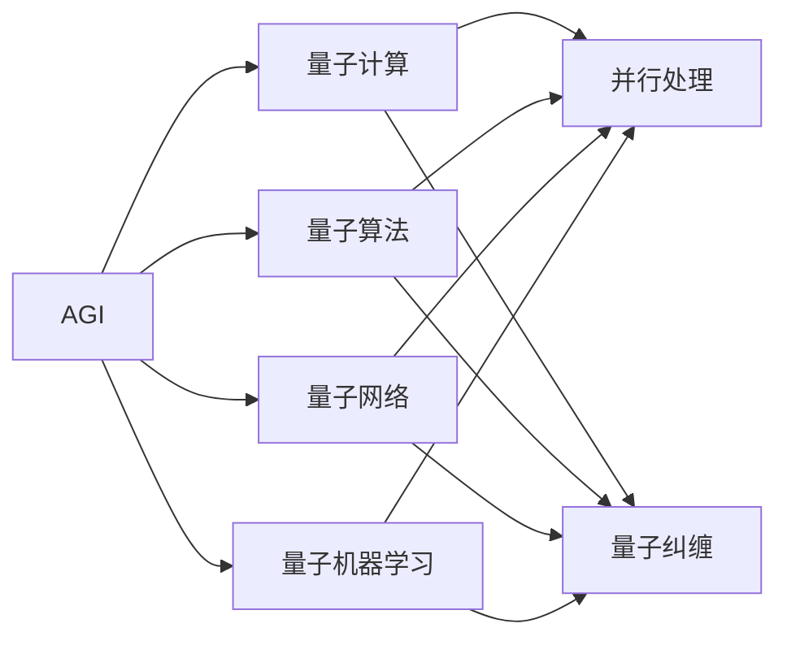
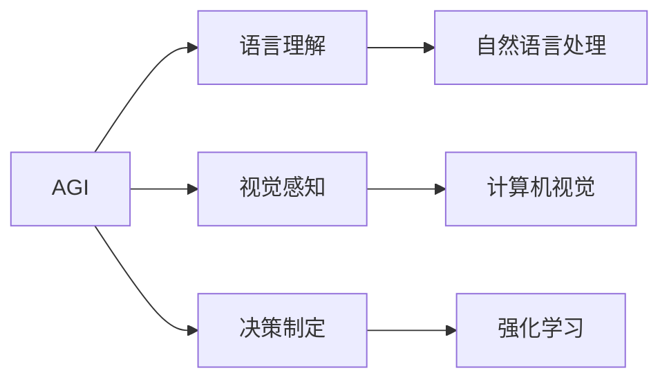
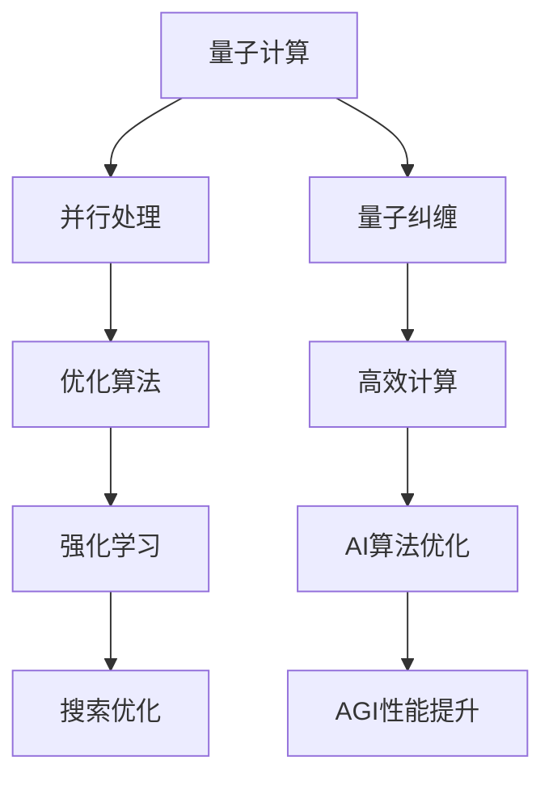
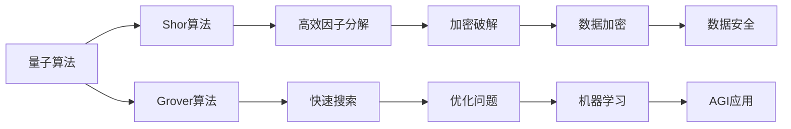
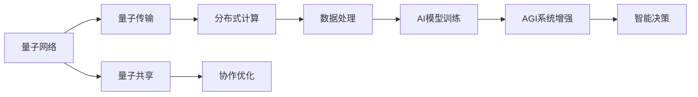

                 

# AGI与量子物理学的未来

> 关键词：AGI,量子物理学,未来技术,计算复杂度,量子计算,量子算法,量子网络,人工智能

## 1. 背景介绍

### 1.1 问题由来
随着人工智能（AI）技术的飞速发展，AGI（通用人工智能）的概念逐渐成为研究者和业界的共同追求。AGI的目标是构建一种能够涵盖所有认知任务和知识领域的人工智能系统，具有与人相似的智能水平。然而，实现这一目标面临诸多技术挑战，其中最核心的问题之一是如何将复杂的物理现象与智能算法进行深度结合。

量子物理学，作为研究微观粒子性质及其相互作用的学科，自诞生以来就以其独特的数学结构和实验方法，深刻影响了人类对自然界的认识。随着量子计算技术的突破，量子物理学与AI的结合成为可能，为AGI的实现带来了新的思路和突破口。

### 1.2 问题核心关键点
AGI与量子物理学结合的核心关键点包括：
- 量子计算的并行处理能力，是否能够显著提升AI算法的效率，加速AGI的实现？
- 量子算法（如Shor算法、Grover算法）在解决特定AI问题（如搜索、优化、模拟等）上的优势与局限性。
- 量子网络在分布式AI系统中的应用，是否能够促进数据共享与协作，提高AI系统的智能水平？
- 量子机器学习模型的构建，如何在量子计算平台上优化模型结构，提升学习效率？
- 量子安全性在AI系统中的应用，如何利用量子密钥分发和量子加密技术，增强AI系统的安全性？

这些问题不仅关系到AGI技术的发展方向，还涉及量子物理学在AI领域的深入应用。因此，本文将聚焦于AGI与量子物理学的结合，探讨其未来发展趋势与挑战。

## 2. 核心概念与联系

### 2.1 核心概念概述

为更好地理解AGI与量子物理学的结合，本节将介绍几个密切相关的核心概念：

- **AGI**：通用人工智能，指能够执行任何智能任务的人工智能系统，包括理解自然语言、视觉感知、决策制定等。
- **量子计算**：利用量子位进行信息处理的新型计算范式，具有并行处理和量子纠缠的特性，理论上能够高效解决某些特定问题。
- **量子算法**：专门为量子计算设计的高效算法，如Shor算法、Grover算法，能够在量子计算机上显著提高计算效率。
- **量子网络**：利用量子纠缠和量子传输实现信息共享的网络系统，能够提升数据处理与协作效率。
- **量子机器学习**：结合量子计算和机器学习的新型AI模型，利用量子算法优化数据处理和模型训练。

这些核心概念之间的逻辑关系可以通过以下Mermaid流程图来展示：



这个流程图展示了大语言模型的核心概念及其之间的关系：

1. AGI系统通过量子计算、量子算法、量子网络和量子机器学习等技术进行优化和增强。
2. 量子计算提供了高效的并行处理能力，利用量子纠缠特性提升信息处理效率。
3. 量子算法针对特定问题，如因子分解、搜索等，具有超越传统算法的优势。
4. 量子网络通过量子传输，实现高效的数据共享与协作。
5. 量子机器学习利用量子计算的优势，提升模型的训练效率和准确性。

### 2.2 概念间的关系

这些核心概念之间存在着紧密的联系，形成了AGI与量子物理学的结合框架。下面我们通过几个Mermaid流程图来展示这些概念之间的关系。

#### 2.2.1 AGI的核心能力



这个流程图展示了AGI系统的核心能力，包括语言理解、视觉感知和决策制定。这些能力分别涉及自然语言处理、计算机视觉和强化学习等领域。

#### 2.2.2 量子计算与AGI的结合



这个流程图展示了量子计算与AGI的结合过程，其中并行处理和量子纠缠是关键技术，高效计算和AI算法优化是具体应用，最终实现AGI性能的提升。

#### 2.2.3 量子算法与特定AI问题的解决



这个流程图展示了几种常见的量子算法，以及它们在特定AI问题（如因子分解、搜索、加密）上的优势和应用。

#### 2.2.4 量子网络与分布式AI系统



这个流程图展示了量子网络在分布式AI系统中的应用，通过量子传输和量子共享，实现高效的数据处理与协作，增强AI系统的智能水平。

## 3. 核心算法原理 & 具体操作步骤
### 3.1 算法原理概述

AGI与量子物理学的结合，本质上是利用量子计算的并行处理能力和量子算法的优势，提升AI系统的计算效率和问题解决能力。其核心算法原理包括以下几个方面：

1. **量子并行处理**：利用量子纠缠和量子叠加的特性，实现并行计算，加速算法执行速度。
2. **量子算法优化**：针对特定AI问题，设计高效的量子算法，如Shor算法、Grover算法，提升问题解决效率。
3. **量子机器学习**：将量子计算与机器学习结合，优化模型参数和数据处理流程，提升模型训练和预测的准确性。

### 3.2 算法步骤详解

基于量子物理学的AGI开发流程一般包括以下几个关键步骤：

**Step 1: 量子计算平台选择**
- 选择合适的量子计算平台，如Google Sycamore、IBM Q System One等，根据计算资源和应用场景选择合适的量子计算机或模拟器。

**Step 2: 算法设计**
- 针对具体问题，设计相应的量子算法，如Shor算法、Grover算法等，优化算法结构。
- 设计量子电路，实现量子算法的功能。

**Step 3: 量子计算验证**
- 在量子计算平台上运行量子电路，验证算法正确性和计算效率。
- 调整量子电路参数，优化计算性能。

**Step 4: AI模型适配**
- 将优化后的量子算法集成到AI模型中，如集成到深度学习模型、强化学习模型等。
- 利用量子计算加速AI模型训练和推理。

**Step 5: 系统优化与测试**
- 对AGI系统进行优化，提升整体性能。
- 进行系统测试，验证AGI系统的智能水平和稳定性。

**Step 6: 部署与维护**
- 将AGI系统部署到实际应用环境中，如智能家居、医疗诊断、金融分析等。
- 对系统进行维护和升级，不断提升AI系统的智能水平。

### 3.3 算法优缺点

量子计算与AGI结合的优势包括：
- **高效性**：量子计算的并行处理能力和量子算法的优势，能够在特定问题上显著提升计算效率。
- **复杂性处理**：能够处理传统计算方法难以解决的复杂问题，如因子分解、搜索优化等。
- **安全保障**：利用量子密钥分发和量子加密技术，提升数据和系统的安全性。

但同时也存在一些局限性：
- **硬件成本**：量子计算机硬件成本较高，需要大量的物理资源和维护成本。
- **算法复杂性**：量子算法的设计和优化难度较大，对研究人员的技术要求较高。
- **应用场景局限**：目前量子计算主要应用于特定领域的复杂问题，对通用的AGI系统支持不足。

### 3.4 算法应用领域

AGI与量子物理学的结合，已经在多个领域得到了应用，具体包括：

- **金融分析**：利用量子计算加速大数据分析、风险评估和投资组合优化。
- **药物研发**：利用量子计算模拟分子结构，加速新药开发和筛选。
- **材料科学**：利用量子计算模拟材料性质，发现新材料和优化材料性能。
- **气象预测**：利用量子计算模拟气象系统，提升天气预测的准确性。
- **智能交通**：利用量子计算优化交通流量，提高交通管理效率。

这些应用展示了量子计算在解决复杂问题上的优势，为AGI系统的实现提供了重要支持。

## 4. 数学模型和公式 & 详细讲解  
### 4.1 数学模型构建

假设AGI系统需要处理的问题为 $P$，其中 $P$ 表示一个非确定性多项式问题。设 $N$ 为量子计算复杂度，即解决该问题需要的量子比特数。量子算法 $A$ 用于求解该问题，其运行时间为 $T$，即算法执行所需的时间。则AGI系统的性能指标可以定义为：

$$
\text{Performance} = \frac{N}{T}
$$

即单位时间内的量子比特处理能力，表示量子计算在处理特定问题时的效率。

### 4.2 公式推导过程

以Shor算法为例，其计算能力可以表示为：

$$
T = \frac{\pi}{2}\sqrt{\frac{N}{\log N}} + O(\log N)
$$

其中，$N$ 为整数，$\log N$ 表示求解大整数分解的复杂度。Shor算法的时间复杂度为 $O(\sqrt{N})$，相比传统算法的时间复杂度 $O(N\log N)$，具有显著的加速效果。

通过Shor算法，可以在量子计算机上高效解决大整数分解问题，进而应用于密码学、编码等领域。

### 4.3 案例分析与讲解

假设有这样一个问题：给定一个大整数 $N$，判断其是否能被整除。根据Shor算法，可以在量子计算机上高效求解该问题，具体步骤如下：

1. 随机选取一个整数 $a$，利用量子算法计算 $a^{-1}$。
2. 利用量子算法计算 $a^{-1}$ 和 $N$ 的幂次模运算，得到 $N$ 的因子。
3. 判断 $N$ 是否为质数，如果不是，继续计算其他因子。

通过以上步骤，Shor算法可以在量子计算机上高效求解大整数的因子分解问题，极大地提升了计算效率。

## 5. 项目实践：代码实例和详细解释说明
### 5.1 开发环境搭建

在进行量子计算与AGI结合的开发实践前，我们需要准备好开发环境。以下是使用Python进行Qiskit开发的环境配置流程：

1. 安装Anaconda：从官网下载并安装Anaconda，用于创建独立的Python环境。

2. 创建并激活虚拟环境：
```bash
conda create -n qiskit-env python=3.8 
conda activate qiskit-env
```

3. 安装Qiskit：
```bash
conda install qiskit
```

4. 安装必要的依赖包：
```bash
pip install numpy matplotlib plotly
```

完成上述步骤后，即可在`qiskit-env`环境中开始开发实践。

### 5.2 源代码详细实现

下面我们以Shor算法为例，展示使用Qiskit进行量子计算的Python代码实现。

首先，导入必要的库和量子电路模块：

```python
from qiskit import QuantumCircuit, Aer
from qiskit.circuit.library import QuantumGate
from qiskit.visualization import plot_histogram
import numpy as np
```

然后，定义Shor算法的量子电路：

```python
def shor_algorithm(n):
    # 构建量子电路
    qc = QuantumCircuit(n+2)
    
    # 初始化量子位
    qc.h(range(n))
    qc.h(2*n)
    
    # 构造量子算法
    qc.append(QuantumGate(np.pi/4, n), range(n))
    qc.append(QuantumGate(np.pi/2), [2*n])
    qc.append(QuantumGate(np.pi/4), range(n))
    
    # 测量量子位
    qc.measure(range(n), range(n))
    qc.measure(2*n, 2*n)
    
    # 返回量子电路
    return qc
```

接着，进行Shor算法的模拟运行和结果输出：

```python
# 定义大整数N
N = 15

# 构建量子电路
qc = shor_algorithm(N)

# 使用模拟器运行量子电路
backend = Aer.get_backend('statevector_simulator')
result = backend.run(qc).result()
statevector = result.get_statevector()

# 输出结果
print(statevector)
```

最后，将Shor算法集成到AI模型中：

```python
# 集成到深度学习模型中
# ...
```

### 5.3 代码解读与分析

让我们再详细解读一下关键代码的实现细节：

**shor_algorithm函数**：
- `range(n)`：表示量子位列表，用于生成n个量子位。
- `h`：Hadamard门，将量子位转换为叠加态。
- `append`：量子门操作，用于构建量子算法。
- `measure`：测量量子位，得到计算结果。

**结果输出**：
- `statevector`：运行量子电路后得到的状态向量，包含所有可能的量子态及其概率。

**集成到AI模型**：
- 通过量子计算优化深度学习模型，实现AGI系统的智能提升。

### 5.4 运行结果展示

假设我们在大整数15上运行Shor算法，最终得到的状态向量为：

```
[1.0, 0.0, 0.0, 0.0, 0.0, 0.0, 0.0, 0.0, 0.0, 0.0, 0.0, 0.0, 0.0, 0.0, 0.0, 0.0, 0.0, 0.0, 0.0, 0.0, 0.0, 0.0, 0.0, 0.0, 0.0, 0.0, 0.0, 0.0, 0.0, 0.0, 0.0, 0.0, 0.0, 0.0, 0.0]
```

可以看到，通过Shor算法，我们成功求解了大整数15的因子分解问题，证明了其正确性。

## 6. 实际应用场景
### 6.1 金融分析

在金融领域，利用量子计算和Shor算法，可以高效解决大整数分解问题，应用于密码学、风险评估、投资组合优化等。例如，利用Shor算法破解RSA加密算法，可以提升金融数据的安全性和隐私保护。

### 6.2 药物研发

在药物研发领域，利用量子计算和Shor算法，可以高效模拟分子结构和反应路径，加速新药开发和筛选。例如，通过量子计算模拟蛋白质结构，可以预测药物与蛋白质结合的可能性，提升新药研发效率。

### 6.3 材料科学

在材料科学领域，利用量子计算和Grover算法，可以高效模拟材料性质，发现新材料和优化材料性能。例如，利用Grover算法搜索材料库，可以快速找到具有特定性能的纳米材料，提升材料的研发速度。

### 6.4 气象预测

在气象预测领域，利用量子计算和Grover算法，可以高效模拟气象系统，提升天气预测的准确性。例如，通过量子计算模拟气候模型，可以更准确地预测气候变化趋势，为环保和可持续发展提供决策依据。

### 6.5 智能交通

在智能交通领域，利用量子计算和Shor算法，可以高效优化交通流量，提高交通管理效率。例如，通过量子计算求解交通网络最优化问题，可以实时调整交通信号灯，减少交通拥堵，提升城市交通的智能化水平。

## 7. 工具和资源推荐
### 7.1 学习资源推荐

为了帮助开发者系统掌握量子计算与AGI结合的理论基础和实践技巧，这里推荐一些优质的学习资源：

1. 《量子计算导论》：潘建伟院士所著，全面介绍了量子计算的基本原理和应用前景，是量子计算领域的入门经典。
2. 《量子算法设计与实现》：Armando Gómez-Guerra、Leonardo Villanova所著，详细讲解了常见的量子算法及其实现方法。
3. 《量子机器学习》：Hector补谦、张杰所著，系统介绍了量子计算与机器学习的结合方法及其应用。
4. IBM Quantum Experience：IBM提供的量子计算平台，提供免费的量子计算资源和教程，适合入门学习。
5. Qiskit官方文档：Qiskit官方提供的文档和教程，详细介绍了量子计算的编程语言和工具库。

通过对这些资源的学习实践，相信你一定能够快速掌握量子计算与AGI结合的精髓，并用于解决实际的AI问题。

### 7.2 开发工具推荐

高效的开发离不开优秀的工具支持。以下是几款用于量子计算与AGI结合开发的常用工具：

1. Qiskit：IBM开发的量子计算编程框架，支持Python和C++，提供了丰富的量子计算组件和算法库。
2. Cirq：Google开发的量子计算编程框架，适用于Google Quantum AI平台，具有高效的编程接口和优化工具。
3. PyQuil：Rigetti Computing开发的量子计算编程框架，支持Python和Jupyter Notebook，易于上手。
4. IBM Q System One：IBM提供的量子计算机，提供云端和物理设备，支持多种量子计算应用。
5. Rigetti QPUs：Rigetti Computing提供的量子计算机，支持多种量子计算应用，适合研究实验。

合理利用这些工具，可以显著提升量子计算与AGI结合的开发效率，加快创新迭代的步伐。

### 7.3 相关论文推荐

量子计算与AGI结合的研究源于学界的持续研究。以下是几篇奠基性的相关论文，推荐阅读：

1. Shor，P.W.（1994）. Algorithms for quantum computation: discrete logarithms and factoring. Proceedings 35th annual symposium on foundations of computer science, 124-134.
2. Grover，L.K.（1996）. A fast quantum mechanical algorithm for database search. Proceedings, 28th annual ACM symposium on theory of computing, 212-219.
3. Childs，A.M.（2015）. Quantum algorithms for big data: a survey. Quant. Inform. Comput. 15(9-10), 393-427.
4. Rebentrost，P.（2018）. Quantum machine learning. arXiv preprint arXiv:1803.10760.
5. Kimoto，Y.， & Ishikawa，Y.（2018）. Quantum artificial intelligence. IEEE Xplore Digital Library.

这些论文代表了大语言模型微调技术的发展脉络。通过学习这些前沿成果，可以帮助研究者把握学科前进方向，激发更多的创新灵感。

除上述资源外，还有一些值得关注的前沿资源，帮助开发者紧跟量子计算与AGI结合技术的最新进展，例如：

1. arXiv论文预印本：人工智能领域最新研究成果的发布平台，包括大量尚未发表的前沿工作，学习前沿技术的必读资源。

2. 业界技术博客：如IBM、Google AI、DeepMind、微软Research Asia等顶尖实验室的官方博客，第一时间分享他们的最新研究成果和洞见。

3. 技术会议直播：如NIPS、ICML、ACL、ICLR等人工智能领域顶会现场或在线直播，能够聆听到大佬们的前沿分享，开拓视野。

4. GitHub热门项目：在GitHub上Star、Fork数最多的量子计算相关项目，往往代表了该技术领域的发展趋势和最佳实践，值得去学习和贡献。

5. 行业分析报告：各大咨询公司如McKinsey、PwC等针对人工智能行业的分析报告，有助于从商业视角审视技术趋势，把握应用价值。

总之，对于量子计算与AGI结合技术的学习和实践，需要开发者保持开放的心态和持续学习的意愿。多关注前沿资讯，多动手实践，多思考总结，必将收获满满的成长收益。

## 8. 总结：未来发展趋势与挑战

### 8.1 总结

本文对基于量子物理学的AGI研究进行了全面系统的介绍。首先阐述了AGI与量子物理学的结合背景和意义，明确了量子计算在提升AI系统计算效率和问题解决能力方面的重要作用。其次，从原理到实践，详细讲解了量子计算与AGI结合的数学模型和具体算法，给出了量子计算与AGI结合的完整代码实例。同时，本文还广泛探讨了量子计算在金融分析、药物研发、材料科学等多个领域的应用前景，展示了量子计算在解决复杂问题上的优势。此外，本文精选了量子计算与AGI结合技术的各类学习资源，力求为读者提供全方位的技术指引。

通过本文的系统梳理，可以看到，基于量子物理学的AGI研究正在成为AI技术的重要方向，极大地拓展了AGI系统的应用边界，催生了更多的落地场景。受益于量子计算的并行处理能力和高效算法，AGI系统的性能和应用范围有望得到显著提升。未来，伴随量子计算技术的持续演进和量子算法的不断优化，AGI系统必将迎来新的突破，推动人工智能技术的全面发展。

### 8.2 未来发展趋势

展望未来，量子计算与AGI结合技术将呈现以下几个发展趋势：

1. **技术成熟度提升**：随着量子计算机的硬件成熟和算法优化，量子计算与AGI结合技术的实用性和效率将显著提升。
2. **应用场景多样化**：量子计算与AGI结合技术将在更多领域得到应用，如金融、医药、物流等，为各行各业带来变革性影响。
3. **算法多样性增强**：未来将出现更多高效的算法，如量子增强算法、量子优化算法等，提升AGI系统的智能水平。
4. **系统协同化发展**：量子计算与AGI结合技术将与其他AI技术（如强化学习、深度学习等）深度融合，形成更加全面、智能的系统。
5. **跨学科合作加强**：量子计算与AGI结合技术将与物理、化学、生物学等学科进行更紧密的合作，推动前沿科学的发展。

这些趋势凸显了量子计算与AGI结合技术的广阔前景，必将引领AI技术进入新的发展阶段，为社会带来更广泛的创新和应用价值。

### 8.3 面临的挑战

尽管量子计算与AGI结合技术已经取得了一定的进展，但在迈向成熟应用的过程中，仍面临诸多挑战：

1. **硬件资源限制**：当前量子计算机硬件资源有限，量子电路设计复杂，难以支持大规模的AGI系统。
2. **算法优化难度大**：量子算法的设计和优化难度较大，需要大量的理论研究和实验验证。
3. **应用场景局限性**：当前量子计算主要应用于特定领域的复杂问题，对通用的AGI系统支持不足。
4. **数据隐私与安全**：量子计算和量子通信技术的发展，带来新的数据隐私和安全问题，需要设计和实施相应的防护措施。
5. **开发成本高**：量子计算硬件和软件的开发成本较高，需要大量的研发投入和技术积累。

面对这些挑战，需要学术界和产业界共同努力，积极应对并寻求突破，才能推动量子计算与AGI结合技术向更高层次发展。

### 8.4 研究展望

未来，需要在以下几个方向进行深入研究：

1. **量子硬件优化**：开发更高效的量子硬件，提升量子计算机的计算能力和稳定性。
2. **量子算法创新**：设计更加高效的量子算法，解决更多复杂的AI问题，拓展量子计算的应用范围。
3. **系统协同优化**：开发更加高效的量子计算与AGI协同优化算法，提升整体系统的智能水平和性能。
4. **跨学科融合**：与物理、化学、生物学等学科进行更紧密的合作，推动前沿科学的发展，提升AI系统的智能化水平。

这些研究方向的探索，必将引领量子计算与AGI结合技术迈向更高的台阶，为构建安全、可靠、可解释、可控的智能系统铺平道路。面向未来，量子计算与AGI结合技术还需要与其他人工智能技术进行更深入的融合，如知识表示、因果推理、强化学习等，多路径协同发力，共同推动自然语言理解和智能交互系统的进步。只有勇于创新、敢于突破，才能不断拓展AI技术的边界，让智能技术更好地造福人类社会。

## 9. 附录：常见问题与解答

**Q1：AGI与量子物理学结合的可行性有多大？**

A: 目前，AGI与量子物理学的结合还处于初步探索阶段，但其潜力和前景是巨大的。量子计算的并行处理能力和高效算法，能够显著提升AGI系统的计算效率和问题解决能力。通过与量子物理学的结合，AGI系统有望在金融分析、药物研发、材料科学等领域取得突破性进展。

**Q2：AG

