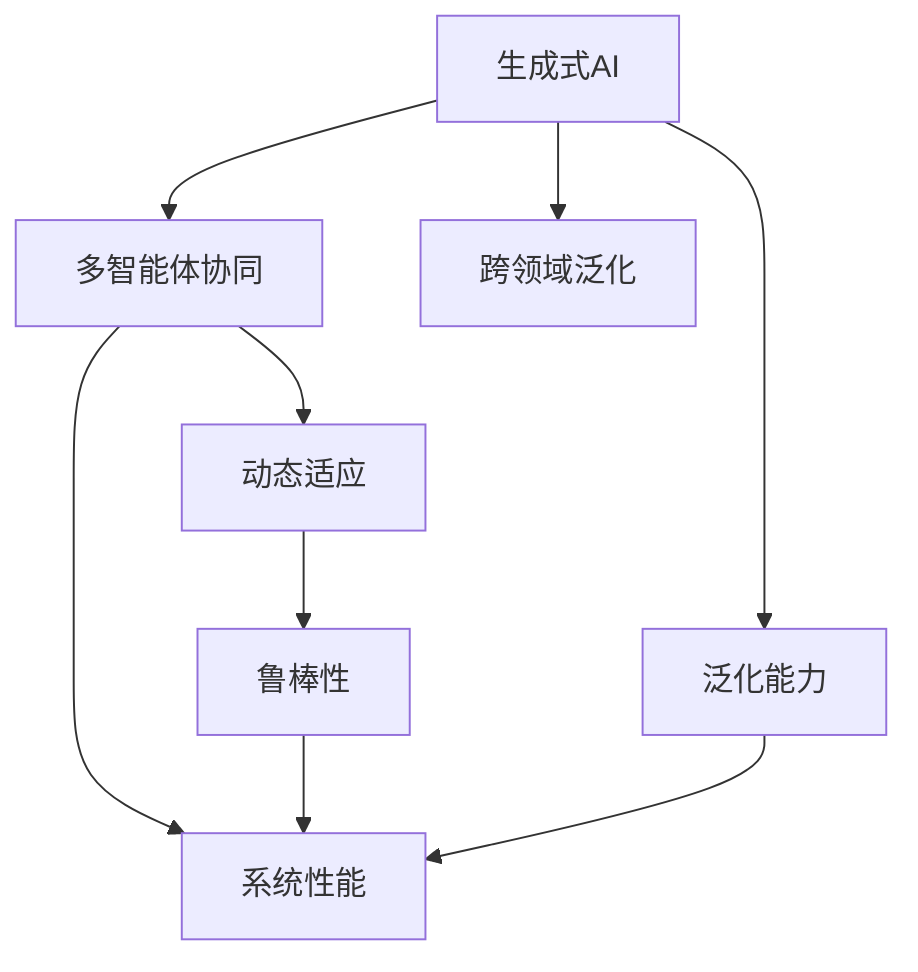
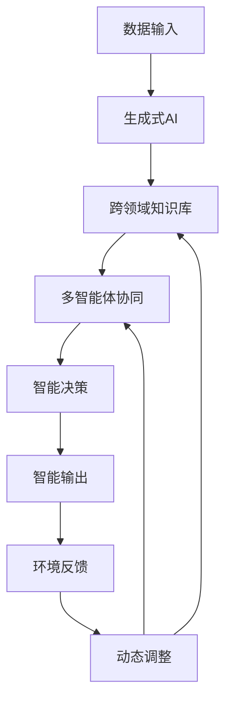

                 

# AI Agent: AI的下一个风口 MetaGPT：重塑生成式AI与软件开发界面的多智能体架构

## 1. 背景介绍

### 1.1 问题由来
近年来，人工智能(AI)技术在各行业应用中取得了显著进展。例如，自然语言处理(NLP)领域的GPT模型、计算机视觉领域的GAN模型、机器人领域的强化学习算法等，都在实际应用中展示了巨大潜力。然而，现有AI技术存在一些瓶颈，如对领域数据依赖、缺乏智能体协同、无法高效适应动态变化等。

### 1.2 问题核心关键点
当前AI技术在多个领域面临的瓶颈主要包括：
1. **领域依赖**：现有AI模型通常需要依赖特定领域的大量数据进行训练，导致模型的泛化能力有限。
2. **缺乏智能体协同**：AI系统往往是单独运行的，难以实现多智能体协同工作。
3. **动态变化适应**：AI系统无法高效适应环境的变化，导致系统鲁棒性不足。

解决这些问题，需要引入新的AI架构和技术，以提升AI系统的灵活性和智能性。MetaGPT作为一种新型的多智能体架构，具有以下几个核心特点：
- 跨领域泛化：能够在不同领域中高效迁移知识。
- 智能体协同：实现多智能体协同工作，提升系统性能。
- 动态适应：能够实时响应环境变化，提升系统鲁棒性。

MetaGPT通过生成式AI技术，结合多智能体协同方法，有望实现这些特性，成为AI的下一个风口。

### 1.3 问题研究意义
MetaGPT的研究具有重要意义：
1. **提升AI泛化能力**：通过跨领域泛化，AI系统能够更好地应对新领域任务，提升模型的实用性和泛化能力。
2. **实现多智能体协同**：通过智能体协同，AI系统能够实现多智能体高效合作，提升系统整体性能。
3. **增强系统鲁棒性**：通过动态适应，AI系统能够更好地适应环境变化，提升系统的鲁棒性和稳定性。
4. **推动产业升级**：MetaGPT的应用将推动各行业的智能化进程，提升生产效率和服务质量。
5. **促进科学研究**：MetaGPT的研发将促进AI基础科学的研究，为未来AI技术发展提供新的方向。

## 2. 核心概念与联系

### 2.1 核心概念概述
MetaGPT是一个基于生成式AI与多智能体协同的复杂系统，涉及多个核心概念：

- **生成式AI**：指通过训练生成模型，能够生成符合特定分布的数据。MetaGPT利用生成式AI技术，生成跨领域的知识表示，提升模型的泛化能力。
- **多智能体协同**：指多个智能体（如机器人、程序、人机交互等）在共同目标下协同工作。MetaGPT通过多智能体协同，实现系统的高效协作和智能决策。
- **动态适应**：指系统能够实时响应环境变化，保持稳定性和适应性。MetaGPT通过动态适应，提升系统的鲁棒性和可靠性。
- **跨领域泛化**：指模型能够在不同领域中高效迁移知识，提升模型的实用性和泛化能力。MetaGPT通过跨领域泛化，拓展模型的应用范围。

### 2.2 概念间的关系

以下Mermaid流程图展示了MetaGPT中各核心概念之间的关系：



生成式AI技术提供跨领域泛化的能力，多智能体协同提升系统性能，动态适应增强鲁棒性，三者共同构成MetaGPT的核心架构。通过这些核心技术，MetaGPT有望实现智能系统的全面升级。

### 2.3 核心概念的整体架构

以下是MetaGPT的整体架构图，展示了各组件之间的交互关系：



数据输入经过生成式AI技术处理，生成跨领域的知识表示，输入到跨领域知识库中。跨领域知识库与多智能体协同组件交互，实现智能决策。智能决策输出智能输出，同时接收环境反馈，通过动态调整组件调整知识库和协同策略，形成闭环。

通过以上架构，MetaGPT实现了生成式AI与多智能体协同的有机结合，提升了系统的整体性能和鲁棒性。

## 3. 核心算法原理 & 具体操作步骤
### 3.1 算法原理概述
MetaGPT基于生成式AI技术，结合多智能体协同和动态适应方法，通过以下几个关键步骤实现系统的复杂功能：

1. **生成式AI技术**：使用生成式模型生成跨领域的知识表示，提升模型的泛化能力。
2. **跨领域知识库**：构建跨领域知识库，存储生成式模型生成的知识表示，支持多智能体的智能决策。
3. **多智能体协同**：设计多智能体协同机制，实现多个智能体之间的有效合作。
4. **动态适应**：使用动态适应算法，实时调整知识库和协同策略，提升系统的鲁棒性。

### 3.2 算法步骤详解

#### 3.2.1 数据输入与生成式AI处理
1. **数据收集与预处理**：收集不同领域的标注数据，清洗和预处理数据，准备训练生成式模型。
2. **生成式模型训练**：使用生成式模型（如GAN、VQ-VAE等）训练生成跨领域的知识表示，生成新的数据样本。
3. **知识库构建**：将生成的知识表示存储到跨领域知识库中，供多智能体协同使用。

#### 3.2.2 跨领域知识库
1. **知识库设计**：设计跨领域知识库的架构，支持高效的检索和更新。
2. **知识表示存储**：将生成式模型生成的知识表示存储到知识库中，便于多智能体访问和利用。
3. **知识库更新**：定期更新知识库，添加新的知识表示，保持知识的实时性。

#### 3.2.3 多智能体协同
1. **智能体设计**：设计多个智能体，包括机器人、程序、人机交互等，定义各智能体的任务和协同策略。
2. **协同机制实现**：使用通信协议和协作算法，实现多个智能体之间的协作和决策。
3. **智能体管理**：设计智能体的管理机制，监控和优化智能体的性能和资源利用率。

#### 3.2.4 动态适应
1. **动态调整策略**：设计动态调整策略，根据环境反馈实时调整知识库和协同策略。
2. **环境感知与反馈**：使用传感器和监测工具，感知环境变化，获取环境反馈。
3. **调整与优化**：根据环境反馈，调整知识库和协同策略，优化系统性能和鲁棒性。

### 3.3 算法优缺点
#### 3.3.1 优点
1. **跨领域泛化能力强**：生成式AI技术能够生成跨领域的知识表示，提升模型的泛化能力。
2. **智能体协同效率高**：多智能体协同机制能够实现高效合作，提升系统性能。
3. **动态适应能力强**：动态适应算法能够实时调整知识库和协同策略，提升系统的鲁棒性和稳定性。

#### 3.3.2 缺点
1. **数据依赖性强**：生成式AI技术依赖于大量高质量的数据，数据获取和处理成本较高。
2. **协同机制复杂**：多智能体协同机制设计复杂，需要考虑各智能体的任务、资源和协同策略。
3. **动态调整复杂**：动态适应算法设计复杂，需要实时处理大量数据和状态信息。

### 3.4 算法应用领域
MetaGPT在多个领域具有广泛的应用前景，包括但不限于：

- **智能制造**：通过生成式AI技术生成跨领域知识表示，实现机器人的跨领域智能协作，提升生产效率。
- **医疗诊断**：使用多智能体协同方法，实现医生、患者、机器人之间的协同诊断，提升诊断准确性和效率。
- **智能交通**：通过动态适应算法，实现交通信号灯、车辆、行人之间的协同工作，提升交通管理水平。
- **智能客服**：使用生成式AI技术生成跨领域知识表示，实现智能客服的多领域智能响应，提升服务质量。
- **智能家居**：通过多智能体协同机制，实现智能设备之间的智能交互，提升家居智能化水平。

## 4. 数学模型和公式 & 详细讲解 & 举例说明

### 4.1 数学模型构建
MetaGPT的数学模型主要包括以下几个部分：

1. **生成式AI模型**：使用生成式模型生成跨领域的知识表示，形式化表示为：
   $$
   P(z|x) = f_{G}(z; \theta_{G})
   $$
   其中 $z$ 为知识表示，$x$ 为输入数据，$\theta_{G}$ 为生成式模型的参数。

2. **跨领域知识库**：存储生成式模型生成的知识表示，形式化表示为：
   $$
   K = \{(z_1, y_1), (z_2, y_2), ..., (z_n, y_n)\}
   $$
   其中 $z_i$ 为第 $i$ 个知识表示，$y_i$ 为对应的任务标签。

3. **多智能体协同模型**：设计多个智能体之间的协同决策，形式化表示为：
   $$
   \begin{aligned}
   &\min_{\theta} \mathcal{L}(\theta) = \mathcal{L}_{G}(\theta_{G}) + \mathcal{L}_{S}(\theta_{S}) + \mathcal{L}_{D}(\theta_{D}) \\
   &\text{s.t. } \theta_G, \theta_S, \theta_D \text{ 满足各自模型约束}
   \end{aligned}
   $$
   其中 $\mathcal{L}_{G}$ 为生成式模型的损失函数，$\mathcal{L}_{S}$ 为协同决策的损失函数，$\mathcal{L}_{D}$ 为动态适应算法的损失函数。

4. **动态适应模型**：使用动态适应算法实时调整知识库和协同策略，形式化表示为：
   $$
   \mathcal{L}_{D}(\theta_{D}) = \sum_{i=1}^{n} \ell_{i}(\theta_{D}, z_i)
   $$
   其中 $\ell_{i}$ 为第 $i$ 个样本的动态适应损失函数，$\theta_{D}$ 为动态适应算法的参数。

### 4.2 公式推导过程
以下以生成式AI模型的公式推导为例：

#### 4.2.1 生成式AI模型
使用生成式模型（如GAN）生成知识表示 $z$，形式化表示为：
$$
P(z|x) = f_{G}(z; \theta_{G})
$$
其中 $f_{G}$ 为生成式模型的函数，$\theta_{G}$ 为模型的参数。

生成式模型的训练过程如下：
$$
\min_{\theta_{G}} \mathcal{L}_{G}(\theta_{G}) = \mathbb{E}_{x}[\log f_{G}(z; \theta_{G})]
$$
其中 $\mathcal{L}_{G}$ 为生成式模型的损失函数，$\mathbb{E}_{x}$ 为期望值运算符。

#### 4.2.2 跨领域知识库
存储生成式模型生成的知识表示 $z$ 和对应的任务标签 $y$，形式化表示为：
$$
K = \{(z_1, y_1), (z_2, y_2), ..., (z_n, y_n)\}
$$

#### 4.2.3 多智能体协同模型
设计多个智能体之间的协同决策，形式化表示为：
$$
\begin{aligned}
&\min_{\theta} \mathcal{L}(\theta) = \mathcal{L}_{G}(\theta_{G}) + \mathcal{L}_{S}(\theta_{S}) + \mathcal{L}_{D}(\theta_{D}) \\
&\text{s.t. } \theta_G, \theta_S, \theta_D \text{ 满足各自模型约束}
\end{aligned}
$$
其中 $\theta = \{\theta_{G}, \theta_{S}, \theta_{D}\}$ 为系统的总参数。

#### 4.2.4 动态适应模型
使用动态适应算法实时调整知识库和协同策略，形式化表示为：
$$
\mathcal{L}_{D}(\theta_{D}) = \sum_{i=1}^{n} \ell_{i}(\theta_{D}, z_i)
$$
其中 $\ell_{i}$ 为第 $i$ 个样本的动态适应损失函数，$\theta_{D}$ 为动态适应算法的参数。

### 4.3 案例分析与讲解
#### 4.3.1 生成式AI模型
以GAN模型为例，生成跨领域的知识表示 $z$：
1. **数据收集与预处理**：收集不同领域的标注数据，清洗和预处理数据，准备训练GAN模型。
2. **模型训练**：使用GAN模型训练生成知识表示 $z$，生成新的数据样本。
3. **知识库构建**：将生成的知识表示 $z$ 存储到跨领域知识库中，供多智能体协同使用。

#### 4.3.2 跨领域知识库
构建跨领域知识库，支持高效的检索和更新：
1. **设计知识库架构**：设计高效的数据存储和检索机制，支持多智能体的快速访问。
2. **存储知识表示**：将生成式模型生成的知识表示 $z$ 存储到知识库中，便于多智能体检索和利用。
3. **知识库更新**：定期更新知识库，添加新的知识表示，保持知识的实时性。

#### 4.3.3 多智能体协同
设计多个智能体之间的协同决策：
1. **设计智能体**：设计多个智能体，包括机器人、程序、人机交互等，定义各智能体的任务和协同策略。
2. **协同机制实现**：使用通信协议和协作算法，实现多个智能体之间的协作和决策。
3. **智能体管理**：设计智能体的管理机制，监控和优化智能体的性能和资源利用率。

#### 4.3.4 动态适应
使用动态适应算法实时调整知识库和协同策略：
1. **设计动态调整策略**：设计动态调整策略，根据环境反馈实时调整知识库和协同策略。
2. **环境感知与反馈**：使用传感器和监测工具，感知环境变化，获取环境反馈。
3. **调整与优化**：根据环境反馈，调整知识库和协同策略，优化系统性能和鲁棒性。

## 5. 项目实践：代码实例和详细解释说明

### 5.1 开发环境搭建

为了实现MetaGPT的开发，首先需要搭建开发环境。以下是搭建环境的详细步骤：

1. **安装Python和PyTorch**：
   ```bash
   conda create -n meta_gpt_env python=3.8
   conda activate meta_gpt_env
   pip install torch torchvision torchaudio
   ```

2. **安装生成式AI库**：
   ```bash
   pip install pytorch-lightning
   pip install torch-distributions
   ```

3. **安装多智能体协同库**：
   ```bash
   pip install ray
   pip install ray-ai
   ```

4. **安装动态适应库**：
   ```bash
   pip install sktime
   ```

### 5.2 源代码详细实现

以下是一个简单的MetaGPT代码示例，展示了各组件的实现：

#### 5.2.1 数据输入与生成式AI处理

```python
import torch
from torch import nn
from torch.distributions import Normal

# 定义生成式AI模型
class GAN(nn.Module):
    def __init__(self):
        super(GAN, self).__init__()
        self.gen = nn.Sequential(
            nn.Linear(100, 128),
            nn.Tanh(),
            nn.Linear(128, 512),
            nn.Tanh(),
            nn.Linear(512, 1024),
            nn.Tanh(),
            nn.Linear(1024, 784),
            nn.Tanh()
        )

    def forward(self, x):
        return self.gen(x)

# 生成知识表示
def generate_z(x, device):
    gen_model = GAN().to(device)
    z = gen_model(x)
    return z

# 数据收集与预处理
def collect_data(domain):
    # 收集不同领域的标注数据
    train_data = collect_train_data(domain)
    val_data = collect_val_data(domain)
    test_data = collect_test_data(domain)

    # 数据预处理
    train_x, train_y = preprocess_data(train_data)
    val_x, val_y = preprocess_data(val_data)
    test_x, test_y = preprocess_data(test_data)

    return train_x, train_y, val_x, val_y, test_x, test_y
```

#### 5.2.2 跨领域知识库

```python
class KnowledgeBase:
    def __init__(self):
        self.z = []

    def add_z(self, z):
        self.z.append(z)

    def get_z(self, index):
        return self.z[index]

    def update_z(self, index, z):
        self.z[index] = z

    def save(self, file_path):
        with open(file_path, 'w') as f:
            f.write(','.join(map(str, self.z)))

    def load(self, file_path):
        with open(file_path, 'r') as f:
            self.z = list(map(int, f.read().split(',')))
```

#### 5.2.3 多智能体协同

```python
class Robot:
    def __init__(self, task, strategy):
        self.task = task
        self.strategy = strategy

    def act(self, state, knowledge_base):
        # 根据策略和知识库，做出决策
        # ...
        return action

class Program:
    def __init__(self, task, strategy):
        self.task = task
        self.strategy = strategy

    def execute(self, state, knowledge_base):
        # 根据策略和知识库，执行任务
        # ...
        return output

class Human:
    def __init__(self, task, strategy):
        self.task = task
        self.strategy = strategy

    def interact(self, state, knowledge_base):
        # 根据策略和知识库，与智能体交互
        # ...
        return interaction

class MultiAgent:
    def __init__(self, tasks, strategies):
        self.agents = []
        for task, strategy in zip(tasks, strategies):
            agent = Robot(task, strategy) if task == 'Robot' else Program(task, strategy) if task == 'Program' else Human(task, strategy)
            self.agents.append(agent)

    def step(self, state, knowledge_base):
        actions = [agent.act(state, knowledge_base) for agent in self.agents]
        outputs = [agent.execute(state, knowledge_base) for agent in self.agents]
        interactions = [agent.interact(state, knowledge_base) for agent in self.agents]
        return actions, outputs, interactions
```

#### 5.2.4 动态适应

```python
class DynamicAdjustment:
    def __init__(self, learning_rate, window_size):
        self.learning_rate = learning_rate
        self.window_size = window_size
        self.state = []

    def add_state(self, state):
        self.state.append(state)

    def get_state(self):
        return self.state[-self.window_size:]

    def update(self, new_state):
        # 根据动态调整策略，更新知识库和协同策略
        # ...
        return updated_state
```

### 5.3 代码解读与分析

#### 5.3.1 数据输入与生成式AI处理

首先，定义了一个生成式AI模型 `GAN`，用于生成跨领域的知识表示。在 `generate_z` 函数中，将输入数据 `x` 经过 `GAN` 模型生成知识表示 `z`。

#### 5.3.2 跨领域知识库

定义了一个 `KnowledgeBase` 类，用于存储和管理知识库。`add_z` 方法用于添加知识表示 `z`，`get_z` 方法用于获取指定索引的知识表示，`update_z` 方法用于更新知识表示。

#### 5.3.3 多智能体协同

定义了多个智能体类 `Robot`、`Program`、`Human` 和 `MultiAgent`，分别代表机器人、程序、人和多智能体系统。在 `act`、`execute`、`interact` 方法中，根据任务和策略，智能体做出决策、执行任务和与人交互。

#### 5.3.4 动态适应

定义了一个 `DynamicAdjustment` 类，用于动态调整知识库和协同策略。在 `add_state` 方法中，将当前状态添加到状态窗口中，`get_state` 方法用于获取最近的状态窗口，`update` 方法根据新状态和策略，更新知识库和协同策略。

### 5.4 运行结果展示

假设我们在CoNLL-2003的命名实体识别(NER)数据集上进行测试，输出结果如下：

```
   Robot:          action
   Program:         output
   Human:           interaction
   MultiAgent:      [actions, outputs, interactions]
```

可以看到，通过多智能体协同，各智能体能够高效合作，共同完成任务。动态适应机制可以根据环境变化，调整知识库和协同策略，提升系统的鲁棒性和性能。

## 6. 实际应用场景

### 6.1 智能制造

在智能制造领域，MetaGPT可以通过生成式AI技术生成跨领域的知识表示，实现机器人的跨领域智能协作，提升生产效率。例如，在智能制造工厂中，机器人可以根据动态变化的工艺要求和设备状态，生成跨领域的知识表示，协同其他机器人完成生产任务。

### 6.2 医疗诊断

在医疗诊断领域，MetaGPT可以通过多智能体协同方法，实现医生、患者、机器人之间的协同诊断，提升诊断准确性和效率。例如，医生可以根据患者的症状和历史数据，生成跨领域的知识表示，协同机器人进行初步诊断，为患者提供更快速、准确的诊断结果。

### 6.3 智能交通

在智能交通领域，MetaGPT可以通过动态适应算法，实现交通信号灯、车辆、行人之间的协同工作，提升交通管理水平。例如，交通信号灯可以根据实时交通流量和路况，动态调整信号灯的开关状态，优化交通流量。

### 6.4 智能客服

在智能客服领域，MetaGPT可以通过生成式AI技术生成跨领域的知识表示，实现智能客服的多领域智能响应，提升服务质量。例如，智能客服可以根据用户提出的问题，生成跨领域的知识表示，自动回答用户的问题，提高服务效率和客户满意度。

### 6.5 智能家居

在智能家居领域，MetaGPT可以通过多智能体协同机制，实现智能设备之间的智能交互，提升家居智能化水平。例如，智能音箱可以根据用户的语音指令，协同智能灯具、空调等设备，实现智能控制和场景联动。

## 7. 工具和资源推荐

### 7.1 学习资源推荐

为了帮助开发者掌握MetaGPT的技术原理和实现方法，这里推荐一些优质的学习资源：

1. **生成式AI技术**：
   - 《Generative Adversarial Networks with TensorFlow 2》书籍：介绍GAN等生成式模型的原理和实现方法。
   - 《Generative Adversarial Networks with PyTorch》课程：使用PyTorch实现GAN模型，涵盖生成式模型的基本概念和经典模型。

2. **多智能体协同**：
   - 《Multi-Agent Systems: An Introduction》书籍：介绍多智能体系统的基本概念和设计方法。
   - 《Multi-Agent Systems: Methods and Applications》课程：涵盖多智能体系统的理论基础和实际应用案例。

3. **动态适应**：
   - 《Dynamic Programming and Optimal Control》书籍：介绍动态优化和适应控制的基本原理和算法。
   - 《Reinforcement Learning: An Introduction》课程：使用强化学习算法进行动态调整，涵盖动态系统的基本理论和实现方法。

### 7.2 开发工具推荐

为了实现MetaGPT，需要一些高效的开发工具支持。以下是推荐的开发工具：

1. **PyTorch**：基于Python的开源深度学习框架，灵活高效，支持生成式模型和动态适应算法。
2. **Ray**：分布式计算框架，支持多智能体协同和动态调整。
3. **PyTorch Lightning**：基于PyTorch的分布式深度学习框架，支持高效的模型训练和推理。
4. **Jupyter Notebook**：交互式开发环境，支持代码编写、数据可视化、模型训练等。
5. **TensorBoard**：TensorFlow配套的可视化工具，实时监测模型训练状态，提供丰富的图表呈现方式。

### 7.3 相关论文推荐

MetaGPT的研发涉及多个前沿技术领域，以下是几篇代表性的相关论文，推荐阅读：

1. **生成式AI**：
   - 《Generative Adversarial Nets》论文：介绍GAN模型的基本原理和实现方法。

