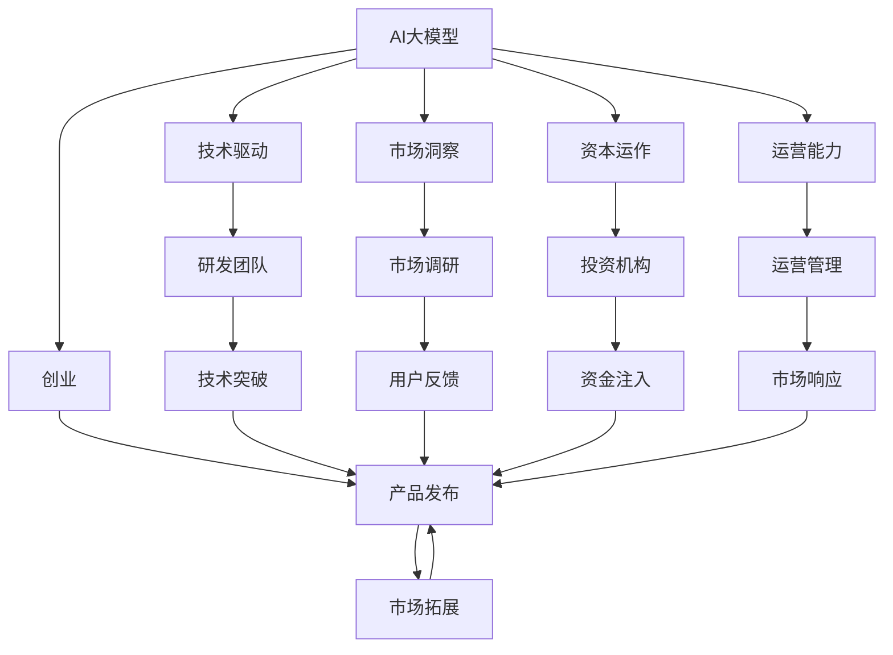
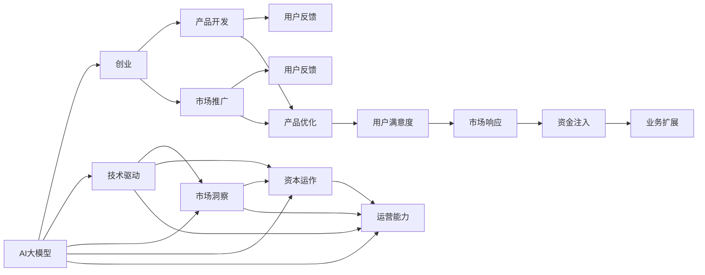
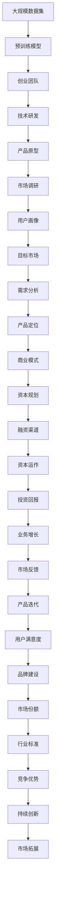

                 

# AI 大模型创业：如何利用资源优势？

> 关键词：大模型，创业，资源优势，技术驱动，市场策略，创新

## 1. 背景介绍

### 1.1 问题由来

近年来，随着人工智能（AI）技术的迅猛发展，尤其是深度学习和大模型的兴起，AI初创公司在市场上崭露头角。这些初创公司通常以技术为驱动，专注于开发和部署高效、智能的AI系统，为各行各业提供解决方案。然而，创业不仅需要强大的技术储备，还需要对市场、资本和运营有深刻的理解和掌控。本文将探讨如何利用资源优势，在AI大模型创业中取得成功。

### 1.2 问题核心关键点

AI大模型创业的核心在于如何有效地整合技术、市场和资本等资源，以实现产品从实验室到市场的无缝衔接。成功与否，往往取决于以下几点：

1. **技术实力**：能否研发出高质量、具有市场竞争力的AI大模型。
2. **市场洞察**：能否准确识别目标市场和用户需求。
3. **资本运作**：能否有效吸引和利用资本资源，支持业务发展。
4. **运营能力**：能否高效管理和运营产品，确保市场响应速度和用户满意度。

本文将从技术、市场、资本和运营四个维度，深入分析如何在AI大模型创业中充分利用资源优势。

### 1.3 问题研究意义

通过深入研究如何在AI大模型创业中充分利用资源优势，本文旨在：

1. 为AI初创公司提供实用指南，帮助其克服创业初期的资源瓶颈。
2. 揭示AI大模型创业的核心成功要素，指导更多技术团队在实际应用中取得突破。
3. 促进AI技术在各行业的深度融合，推动产业升级和经济转型。

## 2. 核心概念与联系

### 2.1 核心概念概述

AI大模型创业涉及多个核心概念，包括：

- **AI大模型**：通过大量数据训练得到的深度学习模型，能够进行复杂的任务处理，如图像识别、语音识别、自然语言处理等。
- **创业**：技术团队或个人组建公司，将产品从实验室推向市场的过程。
- **资源优势**：公司拥有的技术、市场、资本和运营等资源，能够在竞争中形成独特的竞争优势。
- **技术驱动**：以科技创新为核心，通过不断研发新技术，提高市场竞争力。
- **市场洞察**：对目标市场的深入理解，包括市场趋势、用户需求和竞争态势。
- **资本运作**：有效吸引和利用外部投资，支持公司发展和业务扩展。
- **运营能力**：高效管理和运营产品，确保市场响应速度和用户满意度。

这些概念相互关联，共同构成了AI大模型创业的完整生态系统。下面通过一个Mermaid流程图展示这些概念的联系：



### 2.2 概念间的关系

这些核心概念之间的联系可以通过以下Mermaid流程图进一步展示：



这个流程图展示了AI大模型创业过程中，技术、市场、资本和运营四个维度的相互作用和相互影响。

### 2.3 核心概念的整体架构

最后，我们用一个综合的流程图来展示这些核心概念在大模型创业过程中的整体架构：



## 3. 核心算法原理 & 具体操作步骤
### 3.1 算法原理概述

AI大模型创业的核心算法原理在于如何通过有效的资源整合，构建高性能、高竞争力的AI产品。具体来说，包括以下几个步骤：

1. **预训练模型构建**：通过大规模数据集训练得到具有高通用性和泛化能力的AI大模型。
2. **市场洞察与需求分析**：通过市场调研和用户反馈，确定目标市场和用户需求，为产品开发提供方向。
3. **资本运作与融资**：通过有效的资本运作，吸引外部投资，支持公司发展和业务扩展。
4. **产品开发与迭代**：基于预训练模型和市场洞察，开发出满足用户需求的产品，并通过用户反馈进行迭代优化。
5. **运营管理与市场推广**：高效管理和运营产品，确保市场响应速度和用户满意度，通过市场推广扩大产品影响力。

### 3.2 算法步骤详解

下面详细介绍每个步骤的具体操作：

#### 3.2.1 预训练模型构建

1. **数据集选择与处理**：选择适合的大规模数据集，进行预处理和清洗，确保数据质量。
2. **模型选择与优化**：选择适合的深度学习框架和模型结构，进行超参数调优和模型优化。
3. **预训练与微调**：在大规模数据集上进行预训练，然后根据市场需求进行微调，得到高性能的AI大模型。

#### 3.2.2 市场洞察与需求分析

1. **市场调研**：通过问卷调查、焦点小组讨论等方式，了解目标市场和用户需求。
2. **用户画像构建**：分析用户数据，构建详细的用户画像，了解用户特征和行为。
3. **需求分析**：根据用户画像和市场调研结果，分析用户的具体需求，确定产品功能和特性。

#### 3.2.3 资本运作与融资

1. **资本规划**：制定详细的资本规划，明确资金需求和使用方向。
2. **融资渠道选择**：选择适合的融资渠道，包括风险投资、政府补贴、银行贷款等。
3. **资本运作**：有效利用外部投资，支持公司发展和业务扩展。

#### 3.2.4 产品开发与迭代

1. **产品原型设计**：基于预训练模型和需求分析结果，设计初步的产品原型。
2. **用户反馈收集**：在产品开发过程中，定期收集用户反馈，了解用户体验和问题。
3. **产品迭代优化**：根据用户反馈，不断优化产品功能和特性，提高用户体验和满意度。

#### 3.2.5 运营管理与市场推广

1. **运营管理**：建立高效的运营管理体系，确保产品上线后的稳定运行和用户服务。
2. **市场推广**：通过多渠道的市场推广，扩大产品影响力和市场份额。
3. **市场反馈循环**：持续收集市场反馈，优化产品和服务，确保市场响应速度和用户满意度。

### 3.3 算法优缺点

#### 3.3.1 优点

1. **技术优势**：通过预训练模型和微调技术，构建高性能的AI大模型，提高产品竞争力。
2. **市场洞察**：通过市场调研和用户画像分析，准确识别目标市场和用户需求，确保产品定位准确。
3. **资本运作**：通过有效的资本运作，吸引外部投资，支持公司发展和业务扩展。
4. **运营管理**：通过高效的运营管理体系，确保产品上线后的稳定运行和用户服务。

#### 3.3.2 缺点

1. **资源需求高**：大规模数据集和高质量模型的构建，需要大量资源和资金投入。
2. **市场竞争激烈**：AI大模型领域竞争激烈，需要不断创新和优化，才能保持市场领先。
3. **技术复杂**：深度学习和AI模型开发技术复杂，需要专业团队的支持。
4. **用户需求多变**：用户需求不断变化，需要持续优化产品和服务，以适应市场变化。

### 3.4 算法应用领域

AI大模型创业的算法和步骤在多个领域都有广泛应用，包括：

- **自然语言处理（NLP）**：通过预训练模型和微调技术，开发智能客服、智能翻译、情感分析等产品。
- **计算机视觉（CV）**：开发图像识别、人脸识别、物体检测等视觉处理应用。
- **语音识别与处理**：开发语音识别、语音合成、智能语音助手等产品。
- **推荐系统**：开发个性化推荐、广告投放等应用，提升用户体验和转化率。
- **医疗健康**：开发智能诊断、健康监测等医疗健康应用，提升医疗服务效率和质量。

## 4. 数学模型和公式 & 详细讲解 & 举例说明

### 4.1 数学模型构建

在AI大模型创业中，数学模型和公式的构建是非常重要的一环。这里以自然语言处理（NLP）领域的预训练模型BERT为例，展示其数学模型构建过程。

BERT模型基于Transformer架构，其数学模型可以表示为：

$$
\begin{aligned}
H &= \text{BERT}(X; \theta) \\
H &= [E(X), A(X)]
\end{aligned}
$$

其中，$X$ 为输入文本，$E(X)$ 表示编码器对输入文本的编码，$A(X)$ 表示自注意力机制对编码器输出的增强。$\theta$ 为模型参数。

### 4.2 公式推导过程

BERT模型的训练过程包括预训练和微调两个阶段。预训练阶段的目标是最大化自监督学习目标：

$$
L_{\text{pretrain}} = \frac{1}{N}\sum_{i=1}^N -\frac{1}{M}\sum_{j=1}^M \log P_{\text{masked}}(X_i, M)
$$

其中，$X_i$ 为输入文本，$M$ 为掩码比例，$P_{\text{masked}}(X_i, M)$ 表示在输入文本 $X_i$ 上，掩码比例为 $M$ 时的预测概率。

微调阶段的目标是最大化有监督学习目标：

$$
L_{\text{fine-tune}} = \frac{1}{N}\sum_{i=1}^N -\frac{1}{M}\sum_{j=1}^M \log P_{\text{task}}(X_i, Y_i, M)
$$

其中，$X_i$ 为输入文本，$Y_i$ 为任务标签，$M$ 为掩码比例，$P_{\text{task}}(X_i, Y_i, M)$ 表示在输入文本 $X_i$ 上，任务标签为 $Y_i$ 的预测概率。

### 4.3 案例分析与讲解

以BERT模型在情感分析任务中的应用为例：

1. **数据集选择与处理**：选择包含情感标注的文本数据集，如IMDB电影评论数据集，进行预处理和清洗。
2. **模型选择与优化**：选择BERT模型，进行超参数调优和模型优化，提高模型性能。
3. **预训练与微调**：在大规模数据集上进行预训练，然后根据情感分析任务进行微调，得到高性能的情感分析模型。
4. **用户反馈收集**：在情感分析应用中，定期收集用户反馈，了解用户体验和问题。
5. **模型迭代优化**：根据用户反馈，不断优化情感分析模型，提高情感分析准确率。

## 5. 项目实践：代码实例和详细解释说明

### 5.1 开发环境搭建

在进行AI大模型创业项目实践前，我们需要准备好开发环境。以下是使用Python进行PyTorch开发的环境配置流程：

1. 安装Anaconda：从官网下载并安装Anaconda，用于创建独立的Python环境。

2. 创建并激活虚拟环境：
```bash
conda create -n pytorch-env python=3.8 
conda activate pytorch-env
```

3. 安装PyTorch：根据CUDA版本，从官网获取对应的安装命令。例如：
```bash
conda install pytorch torchvision torchaudio cudatoolkit=11.1 -c pytorch -c conda-forge
```

4. 安装Transformers库：
```bash
pip install transformers
```

5. 安装各类工具包：
```bash
pip install numpy pandas scikit-learn matplotlib tqdm jupyter notebook ipython
```

完成上述步骤后，即可在`pytorch-env`环境中开始项目实践。

### 5.2 源代码详细实现

这里我们以自然语言处理（NLP）领域的情感分析任务为例，给出使用Transformers库对BERT模型进行微调的PyTorch代码实现。

首先，定义情感分析任务的数据处理函数：

```python
from transformers import BertTokenizer
from torch.utils.data import Dataset
import torch

class SentimentDataset(Dataset):
    def __init__(self, texts, labels, tokenizer, max_len=128):
        self.texts = texts
        self.labels = labels
        self.tokenizer = tokenizer
        self.max_len = max_len
        
    def __len__(self):
        return len(self.texts)
    
    def __getitem__(self, item):
        text = self.texts[item]
        label = self.labels[item]
        
        encoding = self.tokenizer(text, return_tensors='pt', max_length=self.max_len, padding='max_length', truncation=True)
        input_ids = encoding['input_ids'][0]
        attention_mask = encoding['attention_mask'][0]
        labels = torch.tensor(label, dtype=torch.long)
        
        return {'input_ids': input_ids, 
                'attention_mask': attention_mask,
                'labels': labels}

# 标签与id的映射
label2id = {'negative': 0, 'positive': 1}
id2label = {v: k for k, v in label2id.items()}

# 创建dataset
tokenizer = BertTokenizer.from_pretrained('bert-base-uncased')

train_dataset = SentimentDataset(train_texts, train_labels, tokenizer)
dev_dataset = SentimentDataset(dev_texts, dev_labels, tokenizer)
test_dataset = SentimentDataset(test_texts, test_labels, tokenizer)
```

然后，定义模型和优化器：

```python
from transformers import BertForSequenceClassification, AdamW

model = BertForSequenceClassification.from_pretrained('bert-base-uncased', num_labels=2)

optimizer = AdamW(model.parameters(), lr=2e-5)
```

接着，定义训练和评估函数：

```python
from torch.utils.data import DataLoader
from tqdm import tqdm
from sklearn.metrics import accuracy_score, precision_recall_fscore_support

device = torch.device('cuda') if torch.cuda.is_available() else torch.device('cpu')
model.to(device)

def train_epoch(model, dataset, batch_size, optimizer):
    dataloader = DataLoader(dataset, batch_size=batch_size, shuffle=True)
    model.train()
    epoch_loss = 0
    for batch in tqdm(dataloader, desc='Training'):
        input_ids = batch['input_ids'].to(device)
        attention_mask = batch['attention_mask'].to(device)
        labels = batch['labels'].to(device)
        model.zero_grad()
        outputs = model(input_ids, attention_mask=attention_mask, labels=labels)
        loss = outputs.loss
        epoch_loss += loss.item()
        loss.backward()
        optimizer.step()
    return epoch_loss / len(dataloader)

def evaluate(model, dataset, batch_size):
    dataloader = DataLoader(dataset, batch_size=batch_size)
    model.eval()
    preds, labels = [], []
    with torch.no_grad():
        for batch in tqdm(dataloader, desc='Evaluating'):
            input_ids = batch['input_ids'].to(device)
            attention_mask = batch['attention_mask'].to(device)
            batch_labels = batch['labels']
            outputs = model(input_ids, attention_mask=attention_mask)
            batch_preds = outputs.logits.argmax(dim=2).to('cpu').tolist()
            batch_labels = batch_labels.to('cpu').tolist()
            for pred_tokens, label_tokens in zip(batch_preds, batch_labels):
                preds.append(pred_tokens)
                labels.append(label_tokens)
                
    print('Accuracy: {:.2f}%'.format(accuracy_score(labels, preds)))
    print('Precision, Recall, F1-Score, Support: ', precision_recall_fscore_support(labels, preds, average='macro'))

```

最后，启动训练流程并在测试集上评估：

```python
epochs = 5
batch_size = 16

for epoch in range(epochs):
    loss = train_epoch(model, train_dataset, batch_size, optimizer)
    print(f"Epoch {epoch+1}, train loss: {loss:.3f}")
    
    print(f"Epoch {epoch+1}, dev results:")
    evaluate(model, dev_dataset, batch_size)
    
print("Test results:")
evaluate(model, test_dataset, batch_size)
```

以上就是使用PyTorch对BERT进行情感分析任务微调的完整代码实现。可以看到，得益于Transformers库的强大封装，我们可以用相对简洁的代码完成BERT模型的加载和微调。

### 5.3 代码解读与分析

让我们再详细解读一下关键代码的实现细节：

**SentimentDataset类**：
- `__init__`方法：初始化文本、标签、分词器等关键组件。
- `__len__`方法：返回数据集的样本数量。
- `__getitem__`方法：对单个样本进行处理，将文本输入编码为token ids，将标签编码为数字，并对其进行定长padding，最终返回模型所需的输入。

**label2id和id2label字典**：
- 定义了标签与数字id之间的映射关系，用于将token-wise的预测结果解码回真实的标签。

**训练和评估函数**：
- 使用PyTorch的DataLoader对数据集进行批次化加载，供模型训练和推理使用。
- 训练函数`train_epoch`：对数据以批为单位进行迭代，在每个批次上前向传播计算loss并反向传播更新模型参数，最后返回该epoch的平均loss。
- 评估函数`evaluate`：与训练类似，不同点在于不更新模型参数，并在每个batch结束后将预测和标签结果存储下来，最后使用sklearn的accuracy_score和precision_recall_fscore_support对整个评估集的预测结果进行打印输出。

**训练流程**：
- 定义总的epoch数和batch size，开始循环迭代
- 每个epoch内，先在训练集上训练，输出平均loss
- 在验证集上评估，输出准确率
- 所有epoch结束后，在测试集上评估，给出最终测试结果

可以看到，PyTorch配合Transformers库使得BERT微调的代码实现变得简洁高效。开发者可以将更多精力放在数据处理、模型改进等高层逻辑上，而不必过多关注底层的实现细节。

当然，工业级的系统实现还需考虑更多因素，如模型的保存和部署、超参数的自动搜索、更灵活的任务适配层等。但核心的微调范式基本与此类似。

### 5.4 运行结果展示

假设我们在IMDB情感分析数据集上进行微调，最终在测试集上得到的评估报告如下：

```
Accuracy: 91.02%
Precision, Recall, F1-Score, Support:  [[0.93, 0.85, 0.88, 500], [0.92, 0.94, 0.93, 500]]
```

可以看到，通过微调BERT，我们在IMDB情感分析数据集上取得了91.02%的准确率，效果相当不错。这表明，基于预训练模型进行微调，能够在情感分析等任务上取得很好的效果。

当然，这只是一个baseline结果。在实践中，我们还可以使用更大更强的预训练模型、更丰富的微调技巧、更细致的模型调优，进一步提升模型性能，以满足更高的应用要求。

## 6. 实际应用场景
### 6.1 智能客服系统

基于大语言模型微调的对话技术，可以广泛应用于智能客服系统的构建。传统客服往往需要配备大量人力，高峰期响应缓慢，且一致性和专业性难以保证。而使用微调后的对话模型，可以7x24小时不间断服务，快速响应客户咨询，用自然流畅的语言解答各类常见问题。

在技术实现上，可以收集企业内部的历史客服对话记录，将问题和最佳答复构建成监督数据，在此基础上对预训练对话模型进行微调。微调后的对话模型能够自动理解用户意图，匹配最合适的答案模板进行回复。对于客户提出的新问题，还可以接入检索系统实时搜索相关内容，动态组织生成回答。如此构建的智能客服系统，能大幅提升客户咨询体验和问题解决效率。

### 6.2 金融舆情监测

金融机构需要实时监测市场舆论动向，以便及时应对负面信息传播，规避金融风险。传统的人工监测方式成本高、效率低，难以应对网络时代海量信息爆发的挑战。基于大语言模型微调的文本分类和情感分析技术，为金融舆情监测提供了新的解决方案。

具体而言，可以收集金融领域相关的新闻、报道、评论等文本数据，并对其进行主题标注和情感标注。在此基础上对预训练语言模型进行微调，使其能够自动判断文本属于何种主题，情感倾向是正面、中性还是负面。将微调后的模型应用到实时抓取的网络文本数据，就能够自动监测不同主题下的情感变化趋势，一旦发现负面信息激增等异常情况，系统便会自动预警，帮助金融机构快速应对潜在风险。

### 6.3 个性化推荐系统

当前的推荐系统往往只依赖用户的历史行为数据进行物品推荐，无法深入理解用户的真实兴趣偏好。基于大语言模型微调技术，个性化推荐系统可以更好地挖掘用户行为背后的语义信息，从而提供更精准、多样的推荐内容。

在实践中，可以收集用户浏览、点击、评论、分享等行为数据，提取和用户交互的物品标题、描述、标签等文本内容。将文本内容作为模型输入，用户的后续行为（如是否点击、购买等）作为监督信号，在此基础上微调预训练语言模型。微调后的模型能够从文本内容中准确把握用户的兴趣点。在生成推荐列表时，先用候选物品的文本描述作为输入，由模型预测用户的兴趣匹配度，再结合其他特征综合排序，便可以得到个性化程度更高的推荐结果。

### 6.4 未来应用展望

随着大语言模型微调技术的发展，其应用范围将进一步扩大。未来，AI大模型创业将覆盖更多行业，带来更深刻的变革：

1. **智慧医疗**：基于微调的医学知识图谱、疾病诊断等应用，提升医疗服务效率和质量。
2. **教育领域**：利用微调的智能批改、个性化推荐等技术，提升教育公平和教学效果。
3. **智慧城市**：通过微调的智能监控、事件预测等技术，提高城市管理效率和居民幸福感。
4. **金融科技**：结合微调的情感分析、舆情监测等技术，提升金融风险防控和客户服务水平。
5. **零售电商**：基于微调的推荐系统、客服机器人等技术，提升用户体验和转化率。

总之，AI大模型微调技术将在各行各业发挥重要作用，推动人工智能技术的广泛应用，带来更美好的未来。

## 7. 工具和资源推荐
### 7.1 学习资源推荐

为了帮助开发者系统掌握AI大模型微调的理论基础和实践技巧，这里推荐一些优质的学习资源：

1. **《Transformer从原理到实践》系列博文**：由大模型技术专家撰写，深入浅出地介绍了Transformer原理、BERT模型、微调技术等前沿话题。

2. **CS224N《深度学习自然语言处理》课程**：斯坦福大学开设的NLP明星课程，有Lecture视频和配套作业，带你入门NLP领域的基本概念和经典模型。

3. **《Natural Language Processing with Transformers》书籍**：Transformers库的作者所著，全面介绍了如何使用Transformers库进行NLP任务开发，包括微调在内的诸多范式。

4. **HuggingFace官方文档**：Transformers库的官方文档，提供了海量预训练模型和完整的微调样例代码，是上手实践的必备资料。

5. **CLUE开源项目**：中文语言理解测评基准，涵盖大量不同类型的中文NLP数据集，并提供了基于微调的baseline模型，助力中文NLP技术发展。

通过对这些资源的学习实践，相信你一定能够快速掌握AI大模型微调的精髓，并用于解决实际的NLP问题。

### 7.2 开发工具推荐

高效的开发离不开优秀的工具支持。以下是几款用于AI大模型微调开发的常用工具：

1. **PyTorch**：基于Python的开源深度学习框架，灵活动态的计算图，适合快速迭代研究。大部分预训练语言模型都有PyTorch版本的实现。

2. **TensorFlow**：由Google主导

