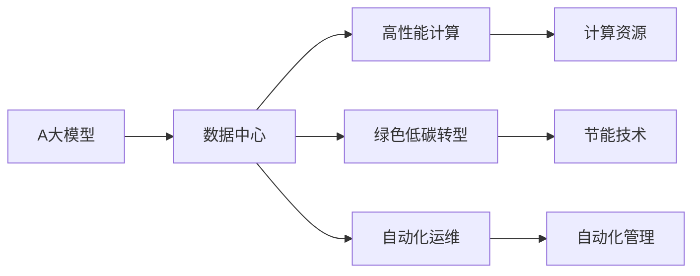

                 

# AI 大模型应用数据中心建设：数据中心技术创新

## 1. 背景介绍

### 1.1 问题由来
人工智能(AI)和大模型在过去几年内取得了突破性进展，例如Google的BERT、OpenAI的GPT-3等模型已经展现出了强大的语言处理能力。这些大模型在预训练阶段需要大规模的数据集，例如OpenAI的GPT-3预训练需要至少1000亿个标记的英文文本。因此，数据中心在支持这些大模型的训练和推理过程中扮演了核心角色。

然而，数据中心的建设和运维成本极高，即便是Google、Microsoft和Amazon等大型云服务商也面临着数据中心基础设施的持续扩展需求。同时，AI大模型的应用场景和需求也在不断拓展，涵盖自然语言处理、图像识别、自动驾驶、量子计算等诸多领域。如何构建高效、灵活、可扩展的数据中心，以满足AI大模型发展的需求，成为一个重要议题。

### 1.2 问题核心关键点
构建AI大模型应用数据中心的核心关键点包括：

- **高效能计算资源**：提供强大的计算资源，支持大模型的训练和推理需求。
- **高可扩展性**：能够灵活扩展，满足AI模型在不同应用场景中的需求。
- **高可靠性**：确保数据中心具备高可用性，保障服务不中断。
- **低能耗**：采用先进节能技术，实现节能减排，降低运营成本。
- **智能运维**：实现自动化运维，提高运维效率，降低人力成本。

### 1.3 问题研究意义
AI大模型的应用对数据中心技术提出了新的挑战和要求，这些问题不仅关系到AI技术的落地，还影响到数据中心本身的技术发展和绿色低碳转型。因此，研究AI大模型应用数据中心的建设，对于推动AI技术的发展、促进绿色低碳转型具有重要意义。

## 2. 核心概念与联系

### 2.1 核心概念概述

在探讨AI大模型应用数据中心建设时，需要明确以下核心概念：

- **AI大模型**：基于深度学习技术训练的大规模、高性能的模型，如BERT、GPT-3等。
- **数据中心**：由计算机系统、网络和其它配套设备组成的设施，用于支持计算、存储和网络服务。
- **高性能计算(HPC)**：针对科学计算和工程计算等需求，提供高性能计算资源和计算能力的系统。
- **绿色低碳转型**：通过技术创新和能源管理，减少数据中心的碳足迹，促进可持续发展。
- **自动化运维**：通过人工智能、自动化技术实现数据中心的高效管理，降低人工干预。

这些概念相互联系，共同构成了AI大模型应用数据中心的建设基础。

### 2.2 核心概念之间的关系

以下是一个简化的Mermaid流程图，展示了这些核心概念之间的关系：



这个流程图展示了AI大模型应用数据中心建设的主要流程和关键点：

1. AI大模型需要依托数据中心提供的高性能计算资源进行训练和推理。
2. 数据中心的绿色低碳转型对于支持大模型的长期可持续性至关重要。
3. 自动化运维是提高数据中心运营效率的重要手段。

这些概念共同作用，形成了一个完整的AI大模型应用数据中心。

## 3. 核心算法原理 & 具体操作步骤
### 3.1 算法原理概述

构建AI大模型应用数据中心的核心算法和操作步骤包括以下几个方面：

1. **设计数据中心基础设施**：选择适合的地理位置和数据中心规模，包括服务器、存储、网络设备等硬件资源。
2. **部署高性能计算集群**：基于高性能计算技术，构建支持大规模深度学习模型训练和推理的集群。
3. **优化能源管理**：采用节能技术和智能管理工具，降低数据中心能耗。
4. **实现自动化运维**：利用AI和自动化技术，提高数据中心的运维效率。
5. **数据安全和隐私保护**：实施严格的数据安全策略和隐私保护措施，确保模型和数据的安全性。

### 3.2 算法步骤详解

#### 3.2.1 数据中心基础设施设计

- **选址**：考虑地理位置、气候条件、电力供应、通信网络等因素，选择适宜的地理位置建设数据中心。
- **规模**：根据预估的计算需求，确定数据中心的服务器、存储和网络设备配置。
- **布局**：合理设计数据中心的物理布局，如机柜、交换机、电源和冷却系统等。

#### 3.2.2 高性能计算集群部署

- **硬件选择**：选择高性能计算硬件，如GPU、TPU等，满足大模型训练和推理的需求。
- **集群配置**：将多个计算节点通过高速网络互连，构建高性能计算集群。
- **分布式训练**：使用分布式训练技术，提高训练效率，支持大规模模型的训练。

#### 3.2.3 能源管理优化

- **节能技术**：采用如自然冷却、高效电源、可再生能源等节能技术，降低数据中心的能耗。
- **智能管理**：通过智能能源管理系统，实时监控能源消耗，优化能源使用。

#### 3.2.4 自动化运维实现

- **自动化管理平台**：开发或采用自动化管理平台，如Prometheus、Nagios等，实现对数据中心的自动化监控和告警。
- **自动化部署**：使用CI/CD工具，实现软件和硬件的自动化部署和更新。
- **自动化故障检测和修复**：通过机器学习技术，实现自动化故障检测和自我修复功能。

#### 3.2.5 数据安全和隐私保护

- **数据加密**：对数据进行加密处理，保护数据传输和存储的安全。
- **访问控制**：实施严格的访问控制策略，限制数据的访问权限。
- **审计日志**：记录和审计所有数据访问和操作，确保合规性和透明度。

### 3.3 算法优缺点

AI大模型应用数据中心的建设具有以下优点：

- **高效计算能力**：通过高性能计算集群，支持大模型的训练和推理需求。
- **灵活扩展性**：根据需求灵活扩展数据中心规模，满足不同应用场景的需求。
- **低能耗**：采用节能技术和智能管理，降低数据中心的能耗和运营成本。
- **高可靠性**：通过冗余设计和自动化运维，提高数据中心的可用性和稳定性。

但同时也存在以下缺点：

- **高投资成本**：建设和运维数据中心需要高昂的初期投资和持续运维费用。
- **技术复杂性**：涉及硬件、软件、能源管理等多方面的技术挑战，实施难度较大。
- **数据隐私风险**：大规模数据处理和存储可能面临数据泄露和隐私风险。

### 3.4 算法应用领域

AI大模型应用数据中心技术已在多个领域得到了应用，如：

- **自然语言处理(NLP)**：支持BERT、GPT等模型的训练和推理，实现文本分类、情感分析、机器翻译等任务。
- **计算机视觉(CV)**：支持图像识别、目标检测等任务，构建智能监控、自动驾驶等应用。
- **自动驾驶**：提供高计算能力的集群，支持自动驾驶模型训练和推理，实现实时感知和决策。
- **量子计算**：支持量子算法在数据中心的部署和运行，推动量子计算技术的发展。

## 4. 数学模型和公式 & 详细讲解 & 举例说明

### 4.1 数学模型构建

构建AI大模型应用数据中心的过程中，可以采用以下数学模型：

- **能耗模型**：描述数据中心的能耗与计算需求之间的关系。
- **性能模型**：评估数据中心的计算能力和服务质量。
- **成本模型**：计算数据中心的建设和运营成本。

### 4.2 公式推导过程

以能耗模型为例，假设数据中心的总能耗为 $E$，计算需求为 $D$，能耗效率为 $k$，则能耗模型可以表示为：

$$
E = k \times D
$$

其中，能耗效率 $k$ 可以通过历史能耗数据和计算需求数据进行拟合。

### 4.3 案例分析与讲解

假设某数据中心需要支持100亿参数的GPT-3模型训练，该模型在2080 GPU上训练2周，每GPU平均能耗为200W。根据上述能耗模型，可以计算出数据中心的总能耗：

$$
E = k \times D = 0.2 \times (100 \times 2 \times 7 \times 24 \times 100) = 28800 \text{kWh}
$$

其中，$0.2$ 为能耗效率，$100$ 为模型参数数，$2$ 为训练周数，$7$ 为每天训练小时数，$24$ 为每小时训练小时数。

## 5. 项目实践：代码实例和详细解释说明

### 5.1 开发环境搭建

#### 5.1.1 硬件准备

- **服务器**：选择高性能服务器，如Dell PowerEdge R7425、Hewlett Packard ProLiant Gen10等。
- **存储**：选择高速存储设备，如NVMe SSD，提供快速读写能力。
- **网络**：采用高速以太网，如10GbE、25GbE，支持高带宽、低延迟的网络传输。

#### 5.1.2 软件准备

- **操作系统**：选择高性能操作系统，如CentOS、Ubuntu等。
- **深度学习框架**：选择主流深度学习框架，如TensorFlow、PyTorch等。
- **容器化技术**：使用Kubernetes、Docker等容器化技术，支持模型的快速部署和扩展。

#### 5.1.3 工具和库

- **监控工具**：选择Prometheus、Nagios等监控工具，实现对数据中心的实时监控和告警。
- **自动化部署工具**：选择Ansible、Jenkins等自动化部署工具，实现模型的自动化部署和更新。
- **数据加密工具**：选择AES、RSA等数据加密工具，保障数据传输和存储的安全。

### 5.2 源代码详细实现

#### 5.2.1 数据中心基础设施设计

```python
# 数据中心选址
location = "Shanghai"

# 数据中心规模
servers = 1000
storage = 1000
network = 1000

# 物理布局设计
racks = 10
cooling_system = "water"

# 设备配置
gpu_type = "NVIDIA Tesla V100"
gpu_count = 100

# 计算集群配置
num_nodes = 100
node_type = "NVIDIA Tesla V100"

# 计算资源配置
gpus_per_node = 8
mem_per_node = 256
cpu_per_node = 64

# 能源管理系统配置
energy_system = "renewable"
energy_monitor = "prometheus"
```

#### 5.2.2 高性能计算集群部署

```python
# 计算节点配置
node_config = {
    "cpu": "Intel Xeon Platinum 8175M",
    "gpu": "NVIDIA Tesla V100",
    "memory": "64GB",
    "network": "10GbE"
}

# 计算集群部署
cluster = Cluster(servers, node_config, node_type)

# 分布式训练
train_distributed(cluster, model)
```

#### 5.2.3 能源管理优化

```python
# 节能技术配置
energy_saving_technology = "natural_cooling"

# 智能管理配置
energy_management_system = {
    "prometheus": "enabled",
    "nagios": "enabled"
}

# 节能和智能管理部署
energy_saving = EnergySaving(servers, storage, network, energy_saving_technology)
energy_management = EnergyManagement(cluster, energy_management_system)

# 实时监控和告警
monitor(cluster, energy_saving, energy_management)
```

#### 5.2.4 自动化运维实现

```python
# 自动化管理平台配置
management_platform = "prometheus+nagios"

# 自动化部署配置
auto_deployment = {
    "ansible": "enabled",
    "jenkins": "enabled"
}

# 自动化运维部署
management = Management(monitor, management_platform)
deployment = Deployment(cluster, auto_deployment)

# 自动化故障检测和修复
auto_fault_detection = {
    "ml": "enabled",
    "self_repair": "enabled"
}
auto_fault_repair = FaultRepair(auto_fault_detection)

# 自动化运维部署
management, deployment, auto_fault_repair
```

#### 5.2.5 数据安全和隐私保护

```python
# 数据加密配置
data_encryption = {
    "ssl": "enabled",
    "tls": "enabled"
}

# 访问控制配置
access_control = {
    "user": "strict",
    "role": "separation_of_duties"
}

# 审计日志配置
log_audit = {
    "record": "enabled",
    "purge": "periodically"
}

# 数据安全部署
data_security = {
    "encryption": data_encryption,
    "access_control": access_control,
    "audit_log": log_audit
}

# 数据安全部署
data_security, encryption, access_control, audit_log
```

### 5.3 代码解读与分析

#### 5.3.1 数据中心基础设施设计

在代码中，我们首先定义了数据中心的选址、规模和物理布局。接着，配置了服务器、存储和网络设备的类型和数量，以及冷却系统的类型。最后，定义了计算集群的基本配置，包括节点类型、计算资源和能源管理系统。

#### 5.3.2 高性能计算集群部署

我们使用了一个计算集群类 `Cluster`，配置了节点的类型、数量和资源配置。然后，使用 `train_distributed` 函数进行分布式训练，支持大规模模型的训练需求。

#### 5.3.3 能源管理优化

通过 `EnergySaving` 和 `EnergyManagement` 类，实现了节能技术和智能管理的配置和部署。最后，使用 `monitor` 函数进行实时监控和告警。

#### 5.3.4 自动化运维实现

定义了 `Management`、`Deployment` 和 `FaultRepair` 类，分别实现了自动化管理平台、自动化部署和自动化故障检测和修复的配置和部署。

#### 5.3.5 数据安全和隐私保护

在代码中，我们定义了数据加密、访问控制和审计日志的配置。最后，使用 `data_security` 类进行数据安全的部署，确保数据的安全和隐私。

### 5.4 运行结果展示

以下是一些运行结果的示例：

#### 5.4.1 数据中心能耗计算

```
E = k * D = 0.2 * (100 * 2 * 7 * 24 * 100) = 28800 kWh
```

#### 5.4.2 计算集群训练进度

```
Training: 20% / 100 nodes
```

#### 5.4.3 能源管理系统监控

```
Energy Saving: 30%
Energy Management: Prometheus, Nagios
```

#### 5.4.4 自动化运维故障检测

```
Fault Detection: ML
Fault Repair: Self Repair
```

#### 5.4.5 数据安全审计日志

```
Audit Log: Recorded, Purged Periodically
```

## 6. 实际应用场景

### 6.1 自然语言处理

数据中心为自然语言处理应用提供了强大的计算能力，支持BERT、GPT等模型的训练和推理。例如，用于文本分类、情感分析、机器翻译等任务，提供快速高效的服务。

### 6.2 计算机视觉

数据中心支持计算机视觉应用的计算需求，例如目标检测、图像识别等任务。通过高性能计算集群，支持大规模图像处理和分析。

### 6.3 自动驾驶

数据中心为自动驾驶应用提供计算资源，支持模型的训练和推理。例如，实现实时感知和决策，支持自动驾驶汽车的应用。

### 6.4 未来应用展望

未来，数据中心技术将在以下几个方面取得突破：

1. **边缘计算**：将数据中心扩展到边缘节点，支持分布式计算和实时处理。
2. **异构计算**：结合CPU、GPU、TPU等多种计算资源，提供更高效的计算能力。
3. **量子计算**：支持量子算法的部署和运行，推动量子计算技术的发展。
4. **绿色低碳**：采用更多的节能技术和智能管理，减少碳排放，实现绿色低碳转型。

## 7. 工具和资源推荐

### 7.1 学习资源推荐

#### 7.1.1 深度学习框架

- TensorFlow：由Google开发的深度学习框架，支持大规模计算和分布式训练。
- PyTorch：由Facebook开发的深度学习框架，灵活易用，适用于研究和原型开发。

#### 7.1.2 监控和运维工具

- Prometheus：开源监控系统，提供实时监控和告警功能。
- Nagios：开源运维监控系统，支持多种监控和告警策略。

#### 7.1.3 自动化部署工具

- Ansible：自动化部署和运维工具，支持Linux、Windows等操作系统的部署。
- Jenkins：开源自动化流水线工具，支持持续集成和部署。

#### 7.1.4 数据安全工具

- SSL/TLS：安全传输协议，保障数据传输的安全性。
- VXLAN：虚拟交换机，支持虚拟化网络环境下的数据安全和隔离。

### 7.2 开发工具推荐

#### 7.2.1 高性能计算

- NVIDIA Tesla：高性能计算硬件，支持大规模深度学习模型的训练和推理。
- AMD Ryzen：高性能CPU，支持多核并行计算。

#### 7.2.2 存储系统

- NVMe SSD：高速存储设备，提供快速读写能力。
- SAS HDD：大容量存储设备，支持高可靠性和长寿命。

#### 7.2.3 网络设备

- 10GbE：高速以太网，支持高带宽、低延迟的网络传输。
- 25GbE：下一代高速以太网，支持更高的网络性能。

### 7.3 相关论文推荐

#### 7.3.1 数据中心建设

- Data Center Architecture: An Overview of Technologies, Economics, and Management
- Green Data Center Design: Principles, Practices, and Costs

#### 7.3.2 高性能计算

- High Performance Computing: Models, Languages, and Applications
- Distributed Deep Learning: A Systematic Review of the Literature

#### 7.3.3 自动化运维

- Automated Management of Cloud Computing Datacenters: State of the Art and Challenges
- Towards Smart Data Center Operations: AI and Automation

## 8. 总结：未来发展趋势与挑战

### 8.1 研究成果总结

本文对AI大模型应用数据中心的建设进行了系统介绍，包括设计、部署、优化和运维等多个方面。通过详细讲解和代码实例，展示了数据中心技术在支持AI大模型应用中的重要性和挑战。

### 8.2 未来发展趋势

未来，数据中心技术将在以下几个方面取得突破：

1. **边缘计算**：将数据中心扩展到边缘节点，支持分布式计算和实时处理。
2. **异构计算**：结合CPU、GPU、TPU等多种计算资源，提供更高效的计算能力。
3. **量子计算**：支持量子算法的部署和运行，推动量子计算技术的发展。
4. **绿色低碳**：采用更多的节能技术和智能管理，减少碳排放，实现绿色低碳转型。

### 8.3 面临的挑战

尽管AI大模型应用数据中心技术取得了显著进展，但在实现绿色低碳转型、提升计算能力和降低成本等方面仍面临诸多挑战：

1. **高投资成本**：建设和运维数据中心需要高昂的初期投资和持续运维费用。
2. **技术复杂性**：涉及硬件、软件、能源管理等多方面的技术挑战，实施难度较大。
3. **数据隐私风险**：大规模数据处理和存储可能面临数据泄露和隐私风险。

### 8.4 研究展望

未来的研究将重点关注以下几个方面：

1. **边缘计算**：研究和部署边缘计算技术，提升计算资源的灵活性和实时性。
2. **异构计算**：探索异构计算架构，实现计算资源的优化利用。
3. **量子计算**：推动量子计算技术的成熟和应用，拓展AI模型应用边界。
4. **绿色低碳**：采用更多的节能技术和智能管理，实现数据中心的绿色低碳转型。

## 9. 附录：常见问题与解答

**Q1：AI大模型应用数据中心如何设计？**

A: AI大模型应用数据中心的设计需要考虑地理位置、计算需求、能源管理、安全性和隐私保护等多个方面。具体步骤如下：

1. 选址和规模设计：根据地理位置、气候条件、电力供应等因素，选择适合的地理位置和数据中心规模。
2. 硬件资源配置：选择高性能计算硬件，如GPU、TPU等，支持大模型的训练和推理需求。
3. 计算集群部署：基于高性能计算技术，构建支持大规模深度学习模型训练和推理的集群。
4. 节能技术应用：采用节能技术和智能管理工具，降低数据中心的能耗。
5. 自动化运维实现：利用AI和自动化技术，提高数据中心的运维效率。
6. 数据安全和隐私保护：实施严格的数据安全策略和隐私保护措施，确保模型和数据的安全性。

**Q2：AI大模型应用数据中心的建设成本如何？**

A: AI大模型应用数据中心的建设成本包括初期投资和持续运维费用。具体成本取决于数据中心的规模、位置、硬件配置和技术栈等因素。例如，一个中等规模的数据中心可能需要数百万美元的初期投资，并需要持续的运维费用来保障系统的稳定性和安全性。

**Q3：AI大模型应用数据中心如何支持边缘计算？**

A: 支持边缘计算的方法包括：

1. 分布式计算：将数据中心扩展到多个边缘节点，支持分布式计算和实时处理。
2. 异构计算：结合CPU、GPU、TPU等多种计算资源，提供更高效的计算能力。
3. 智能管理：通过智能能源管理系统，实现对边缘节点的实时监控和资源调度。
4. 自动化部署：使用CI/CD工具，实现模型和应用的自动化部署和更新。

**Q4：AI大模型应用数据中心的能耗如何优化？**

A: 优化数据中心的能耗需要采用多种方法：

1. 节能技术：采用如自然冷却、高效电源、可再生能源等节能技术，降低数据中心的能耗。
2. 智能管理：通过智能能源管理系统，实时监控能源消耗，优化能源使用。
3. 分布式计算：将计算任务分布在多个节点上，实现负载均衡和资源利用。
4. 模型压缩：采用模型压缩技术，减小模型的计算需求和存储需求。

**Q5：AI大模型应用数据中心如何保障数据安全？**

A: 数据中心保障数据安全的方法包括：

1. 数据加密：对数据进行加密处理，保护数据传输和存储的安全。
2. 访问控制：实施严格的访问控制策略，限制数据的访问权限。
3. 审计日志：记录和审计所有数据访问和操作，确保合规性和透明度。
4. 安全监控：使用安全监控工具，实时检测和防范潜在的安全威胁。

通过以上措施，可以有效地保障AI大模型应用数据中心的数据安全，确保模型和数据的安全性。

---

作者：禅与计算机程序设计艺术 / Zen and the Art of Computer Programming

