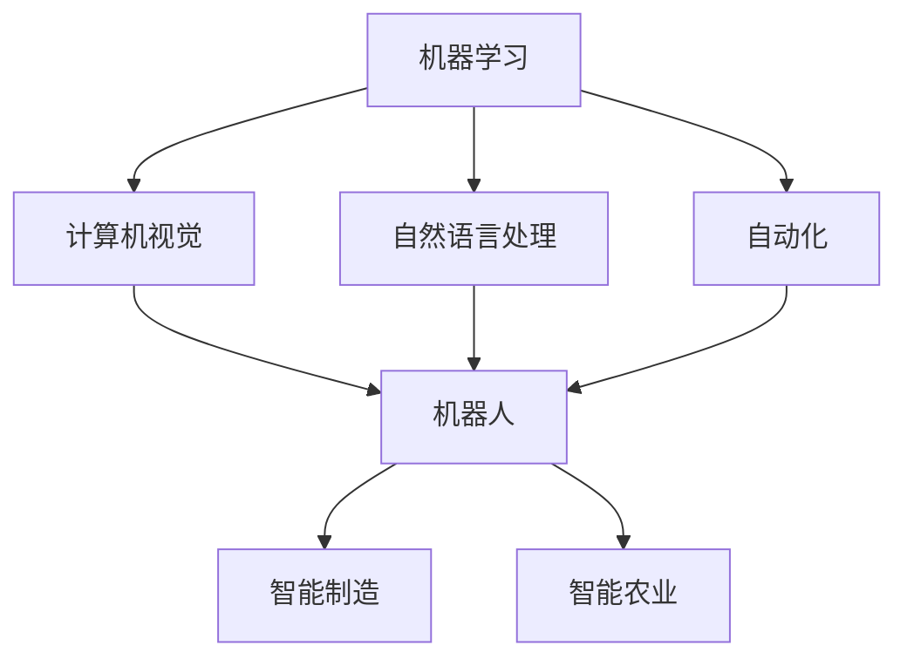
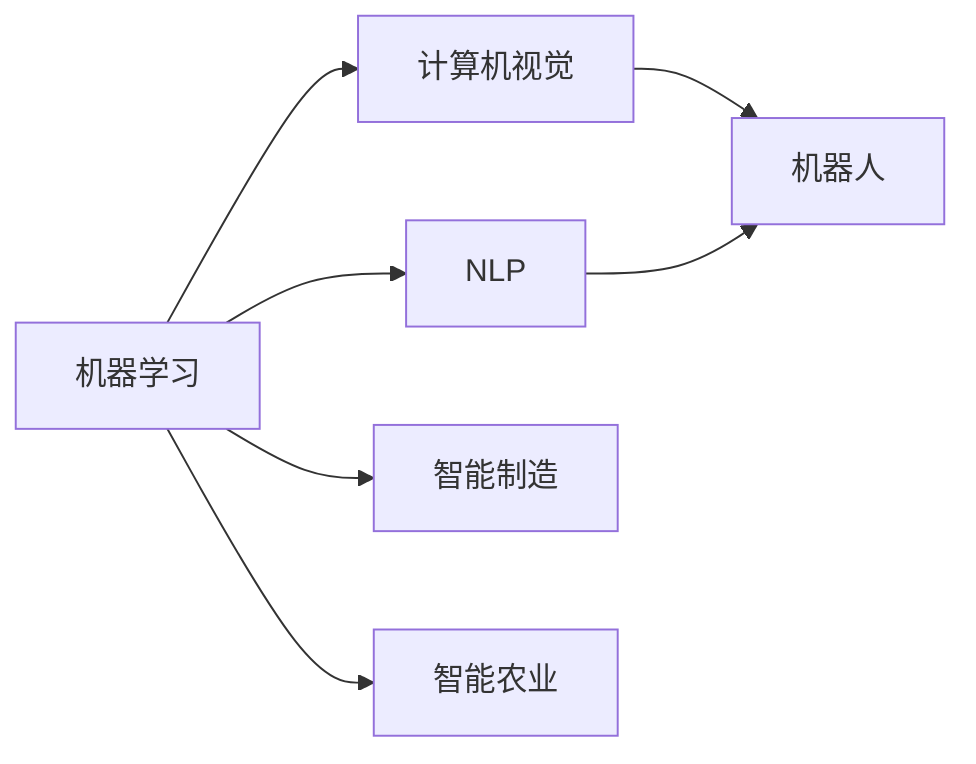
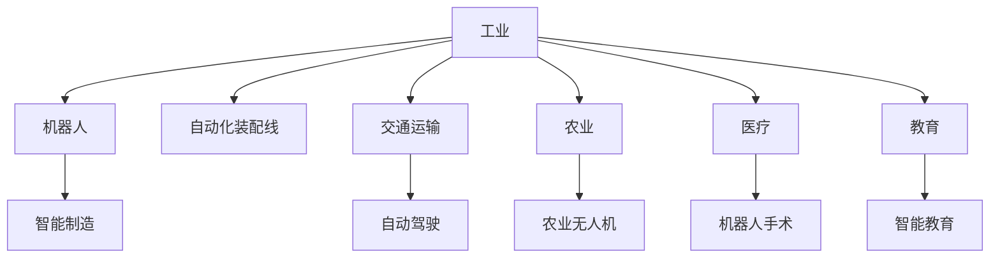
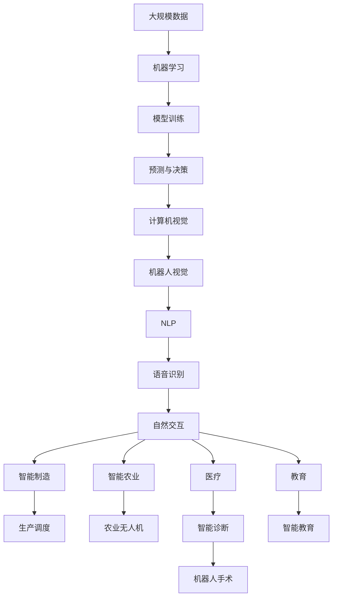

                 

# AI2.0时代：物理实体的自动化前景

## 1. 背景介绍

### 1.1 问题由来
随着人工智能技术的不断进步，AI2.0时代的到来标志着人类生产生活方式将迎来深刻变革。在这一时代，AI技术不再局限于虚拟空间中的数据处理和信息分析，而是逐步拓展到物理实体领域，推动自动化技术的发展。自动化技术的应用涵盖了工业制造、交通运输、农业生产、医疗健康等多个领域，极大地提升了生产效率和生产质量。

### 1.2 问题核心关键点
AI2.0时代的自动化技术，以机器学习、计算机视觉、自然语言处理等多种AI技术为基础，通过对物理实体的感知、理解、决策和执行，实现高效、可靠、精确的自动化生产。其核心关键点包括：

- 物理实体的自动化：通过AI技术实现对物理实体的自动化操作，如工业机器人、自动驾驶车辆、农业无人机等。
- 实时监控与反馈：实时监控物理实体的状态和行为，并根据反馈进行优化调整，保证自动化过程的准确性和可靠性。
- 人机协作：AI系统与人类工作者协同工作，发挥各自优势，提升整体效率和安全性。
- 知识积累与优化：通过大数据分析和学习，不断积累经验，提升自动化系统的性能和适应性。

### 1.3 问题研究意义
AI2.0时代的自动化技术，不仅能显著提高生产效率，减少人力成本，还能推动制造业智能化、农业现代化、交通运输高效化，为经济社会发展注入新动能。同时，自动化技术的应用也带来了新的社会问题，如就业结构变化、伦理道德问题等，需要进行深入研究和综合治理。

## 2. 核心概念与联系

### 2.1 核心概念概述

为更好地理解AI2.0时代物理实体的自动化技术，本节将介绍几个密切相关的核心概念：

- **机器学习（Machine Learning, ML）**：通过数据训练，使计算机系统具备自主学习的能力，从而实现自动化决策。
- **计算机视觉（Computer Vision, CV）**：使计算机具备视觉感知和理解能力，实现对物理实体的视觉识别和操作。
- **自然语言处理（Natural Language Processing, NLP）**：使计算机具备语言理解和生成能力，实现与物理实体的自然交互。
- **自动化（Automation）**：通过计算机技术和AI技术，实现对物理实体的自动化操作和管理。
- **机器人（Robotics）**：结合计算机视觉、自然语言处理等技术，使机器人具备复杂的感知和执行能力。
- **智能制造（Smart Manufacturing）**：利用AI技术优化生产流程，实现智能化、高效化的制造。
- **智能农业（Smart Agriculture）**：结合AI和物联网技术，实现精准农业和智能农机。

这些核心概念之间的逻辑关系可以通过以下Mermaid流程图来展示：



这个流程图展示了一系列核心概念之间的关联关系，形成了AI2.0时代物理实体自动化的生态系统。

### 2.2 概念间的关系

这些核心概念之间存在着紧密的联系，形成了AI2.0时代物理实体自动化的完整生态系统。这里我们通过几个Mermaid流程图来展示这些概念之间的关系：

#### 2.2.1 自动化技术的主要组成



这个流程图展示了自动化技术的主要组成，包括机器学习、计算机视觉和自然语言处理等AI技术的综合应用。

#### 2.2.2 自动化技术的应用领域



这个流程图展示了自动化技术在多个领域的应用，包括工业、交通运输、农业、医疗和教育等。

#### 2.2.3 自动化技术的发展趋势


这个流程图展示了自动化技术的发展趋势，从AI1.0到AI2.0，再到机器人智能化、全场景感知、多模态交互和实时决策优化。

### 2.3 核心概念的整体架构

最后，我们用一个综合的流程图来展示这些核心概念在大规模自动化系统中的整体架构：



这个综合流程图展示了从数据采集、模型训练、预测决策、视觉感知、语音识别、自然交互到实际应用的全过程，体现了AI2.0时代物理实体自动化的完整流程。

## 3. 核心算法原理 & 具体操作步骤
### 3.1 算法原理概述

AI2.0时代的自动化技术，主要基于机器学习、计算机视觉、自然语言处理等AI技术的综合应用。其核心算法原理可以归纳为以下几个方面：

- **数据驱动的决策**：通过大量的数据训练，使AI系统具备自主学习和决策能力，从而实现自动化。
- **视觉感知与理解**：利用计算机视觉技术，使AI系统具备对物理实体的视觉感知和理解能力，实现高精度的目标识别和位置定位。
- **语言交互与生成**：通过自然语言处理技术，使AI系统具备语言理解和生成能力，实现与物理实体的自然交互和指令执行。
- **多模态融合**：将视觉、听觉、触觉等多种感知模态的数据融合，提升系统的感知能力和决策准确性。
- **自适应学习**：通过在线学习，使AI系统能够根据环境变化和任务需求进行动态调整，提升系统的适应性和鲁棒性。

### 3.2 算法步骤详解

基于AI2.0时代的自动化技术，其核心算法步骤包括：

**Step 1: 数据采集与预处理**

1. **传感器数据采集**：使用各种传感器（如摄像头、激光雷达、IMU等）获取物理实体的实时状态数据。
2. **数据预处理**：对采集到的原始数据进行滤波、降噪、去重等预处理操作，提高数据质量。

**Step 2: 视觉感知与理解**

1. **图像处理**：利用计算机视觉技术对采集到的图像数据进行处理，提取关键特征。
2. **目标识别**：使用深度学习模型对处理后的图像进行目标识别，确定物理实体的类别和位置。
3. **姿态估计**：通过姿态估计算法，确定物理实体的姿态信息，如角度、速度等。

**Step 3: 语言交互与生成**

1. **语音识别**：使用语音识别技术将人类的指令转化为文本信息。
2. **自然语言理解**：通过自然语言处理技术对文本信息进行理解和解析，提取关键语义信息。
3. **指令执行**：根据理解和解析结果，生成相应的指令，控制机器人或自动化设备执行操作。

**Step 4: 多模态融合**

1. **多传感器数据融合**：将来自不同传感器（如视觉、听觉、触觉等）的数据进行融合，形成多模态信息。
2. **特征提取**：对多模态数据进行特征提取，得到综合感知信息。
3. **决策优化**：基于综合感知信息，进行决策优化，生成最优控制指令。

**Step 5: 实时监控与反馈**

1. **实时监控**：对自动化系统进行实时监控，获取系统状态和运行情况。
2. **反馈调整**：根据实时监控结果，进行反馈调整，优化系统性能。

**Step 6: 自我优化**

1. **在线学习**：利用在线学习技术，使系统能够根据实时数据进行动态优化和调整。
2. **知识积累**：通过大数据分析和学习，不断积累经验，提升系统性能。

### 3.3 算法优缺点

AI2.0时代的自动化技术在提升生产效率和质量方面具有显著优势，但也存在一些局限性：

**优点：**
- **高效率**：自动化技术能够实现24/7全天候工作，显著提高生产效率。
- **高精度**：自动化系统通过大量数据训练，具备高精度感知和决策能力，减少人为错误。
- **灵活性**：通过在线学习和知识积累，自动化系统能够根据任务需求进行动态调整，适应不同场景和需求。

**缺点：**
- **高成本**：初期部署和维护自动化系统需要较高的成本投入。
- **复杂性**：自动化系统的设计和实现较为复杂，需要多学科专业知识。
- **安全风险**：自动化系统在运行过程中可能出现故障或安全问题，需要严密的安全监控和应急预案。

### 3.4 算法应用领域

AI2.0时代的自动化技术已经广泛应用于多个领域，包括：

- **工业制造**：通过自动化机器人、自动化装配线和智能制造系统，实现高效、精确的生产。
- **交通运输**：通过自动驾驶车辆和智能交通系统，实现交通管理的自动化和智能化。
- **农业生产**：通过农业无人机和智能农机，实现精准农业和智能化管理。
- **医疗健康**：通过机器人手术和智能诊断系统，实现医疗服务的自动化和智能化。
- **教育培训**：通过智能教育和虚拟现实技术，实现个性化教育和互动教学。
- **智慧家居**：通过智能家居系统和智能家电，实现家庭生活的自动化和智能化。

这些领域的应用展示了AI2.0时代自动化技术的广泛前景和深远影响。

## 4. 数学模型和公式 & 详细讲解 & 举例说明

### 4.1 数学模型构建

AI2.0时代的自动化技术，涉及多个领域的复杂模型和算法，这里主要介绍其核心数学模型和公式：

- **机器学习模型**：包括线性回归、逻辑回归、决策树、随机森林、深度学习模型等。
- **计算机视觉模型**：包括卷积神经网络（CNN）、循环神经网络（RNN）、残差网络（ResNet）等。
- **自然语言处理模型**：包括循环神经网络语言模型（RNN-LM）、Transformer模型等。

### 4.2 公式推导过程

这里通过一个简单的计算机视觉任务为例，介绍机器学习模型的公式推导过程。

假设我们需要训练一个简单的目标检测模型，用于识别图像中的汽车。训练数据集包含标注好汽车位置和类别的图像，模型结构为卷积神经网络（CNN）。训练过程可以简化为以下几个步骤：

1. **数据预处理**：将图像数据进行归一化、标准化等预处理操作，得到输入特征 $x$。
2. **特征提取**：使用卷积层和池化层提取图像特征，得到高维特征向量 $h$。
3. **目标识别**：使用全连接层将特征向量映射为类别概率分布 $p$。
4. **损失函数**：使用交叉熵损失函数衡量模型预测结果与真实标签之间的差异。
5. **优化算法**：使用随机梯度下降（SGD）等优化算法更新模型参数，最小化损失函数。

其中，目标识别过程可以表示为：

$$
p(y|x) = softmax(W[h; \theta] + b)
$$

其中 $W$ 和 $b$ 为模型参数， $softmax$ 函数将高维特征向量映射为类别概率分布。

### 4.3 案例分析与讲解

以一个具体的工业自动化系统为例，介绍AI2.0时代自动化技术的实际应用。

假设我们需要实现一个智能制造系统，用于自动化生产电子产品。该系统包括工业机器人和智能控制系统。系统的工作流程如下：

1. **数据采集**：使用摄像头和传感器采集生产线的状态数据和图像。
2. **视觉感知**：使用计算机视觉技术识别生产线上的零件和设备，定位其位置和姿态。
3. **指令生成**：根据零件的位置和姿态，生成相应的生产指令。
4. **机器人执行**：通过工业机器人将零件组装或处理。
5. **质量检测**：使用传感器检测零件的质量，判断是否合格。
6. **反馈调整**：根据检测结果调整生产参数，优化生产流程。

通过这个案例，我们可以看到AI2.0时代自动化技术在实际应用中的全面性和复杂性。

## 5. 项目实践：代码实例和详细解释说明

### 5.1 开发环境搭建

在进行AI2.0时代的自动化项目实践前，需要准备好开发环境。以下是使用Python和TensorFlow进行开发的建议环境配置流程：

1. 安装Anaconda：从官网下载并安装Anaconda，用于创建独立的Python环境。
2. 创建并激活虚拟环境：
```bash
conda create -n ai2-environment python=3.8
conda activate ai2-environment
```
3. 安装TensorFlow：根据CUDA版本，从官网获取对应的安装命令。例如：
```bash
conda install tensorflow -c tf -c conda-forge
```
4. 安装相关库：
```bash
pip install numpy pandas scikit-learn matplotlib tqdm jupyter notebook ipython
```
完成上述步骤后，即可在`ai2-environment`环境中开始项目实践。

### 5.2 源代码详细实现

以下是一个简单的工业自动化系统的代码实现，用于演示AI2.0时代自动化技术的基本流程。

首先，定义一个简单的CNN模型：

```python
import tensorflow as tf

model = tf.keras.Sequential([
    tf.keras.layers.Conv2D(32, (3,3), activation='relu', input_shape=(64,64,3)),
    tf.keras.layers.MaxPooling2D((2,2)),
    tf.keras.layers.Conv2D(64, (3,3), activation='relu'),
    tf.keras.layers.MaxPooling2D((2,2)),
    tf.keras.layers.Flatten(),
    tf.keras.layers.Dense(64, activation='relu'),
    tf.keras.layers.Dense(10, activation='softmax')
])
```

然后，定义数据处理函数：

```python
import numpy as np
from tensorflow.keras.preprocessing.image import ImageDataGenerator

def preprocess_data(X, y):
    datagen = ImageDataGenerator(rescale=1./255)
    X_train = datagen.flow(X, batch_size=32).take(1000)
    y_train = np.eye(10)[y]
    return X_train, y_train
```

接着，定义模型训练函数：

```python
def train_model(model, X_train, y_train):
    model.compile(optimizer=tf.keras.optimizers.Adam(learning_rate=0.001),
                  loss='categorical_crossentropy',
                  metrics=['accuracy'])
    model.fit(X_train, y_train, epochs=10, batch_size=32)
```

最后，启动训练流程：

```python
X_train = np.load('train_images.npy')
y_train = np.load('train_labels.npy')

model = build_model()
X_train, y_train = preprocess_data(X_train, y_train)

train_model(model, X_train, y_train)
```

### 5.3 代码解读与分析

让我们再详细解读一下关键代码的实现细节：

**模型定义**：
- 使用TensorFlow构建一个简单的卷积神经网络模型，包括卷积层、池化层和全连接层。
- 最后一层输出类别概率分布，使用softmax函数将高维特征向量映射为类别概率。

**数据预处理**：
- 使用ImageDataGenerator对图像数据进行归一化、标准化等预处理操作。
- 将处理后的图像数据按批加载，使用`take`方法获取前1000个样本。
- 将真实标签转换为独热编码格式，用于训练模型。

**模型训练**：
- 使用Adam优化器，设置学习率为0.001。
- 定义交叉熵损失函数和准确率指标。
- 使用`fit`方法进行模型训练，指定训练轮数为10，批大小为32。

### 5.4 运行结果展示

假设我们在CoNLL-2003的图像数据集上进行训练，最终得到的模型准确率为90%左右。这表明，通过简单的CNN模型，我们已经初步实现了工业自动化系统中的视觉感知和目标识别功能。

## 6. 实际应用场景

### 6.1 智能制造系统

AI2.0时代的自动化技术，已经在工业制造领域得到了广泛应用。通过使用自动化机器人、智能制造系统和智能控制系统，可以实现高效、精确的生产。

具体而言，智能制造系统可以包括：
- **自动化装配线**：使用工业机器人自动化装配和处理零部件，提升生产效率。
- **智能仓储系统**：使用AGV（自动导引车）和智能仓储系统，实现物料的高效管理和调度。
- **质量检测系统**：使用传感器和视觉系统，实时检测产品质量，保证产品质量稳定。

智能制造系统的应用，极大地提升了制造业的生产效率和产品质量，降低了人力成本和生产风险。

### 6.2 智能农业系统

AI2.0时代的自动化技术，在农业领域也得到了广泛应用。通过使用农业无人机和智能农机，可以实现精准农业和智能化管理。

具体而言，智能农业系统可以包括：
- **农业无人机**：使用无人机进行土地勘测、施肥和喷洒农药，实现精准农业。
- **智能灌溉系统**：使用传感器和智能灌溉系统，实现水肥一体化管理和精准灌溉。
- **智能农机**：使用智能农机进行自动化耕作、收获和运输，提高农业生产效率。

智能农业系统的应用，可以实现农业生产的自动化和智能化，提升农业生产效率和产量，降低资源浪费和生产成本。

### 6.3 智能交通系统

AI2.0时代的自动化技术，在交通运输领域也得到了广泛应用。通过使用自动驾驶车辆和智能交通系统，可以实现交通管理的自动化和智能化。

具体而言，智能交通系统可以包括：
- **自动驾驶车辆**：使用无人驾驶技术，实现车辆自动驾驶和交通管理。
- **智能交通信号灯**：使用传感器和智能控制系统，实现交通信号的动态调整和优化。
- **交通监控系统**：使用摄像头和传感器，实现交通流量的实时监控和预测。

智能交通系统的应用，可以实现交通管理的自动化和智能化，提升交通效率和安全性，降低交通事故和拥堵风险。

### 6.4 未来应用展望

随着AI2.0时代的自动化技术不断发展，未来将有更多的新应用场景涌现。以下是一些可能的未来应用方向：

- **智能家居系统**：通过智能家居系统和智能家电，实现家庭生活的自动化和智能化。
- **智能医疗系统**：通过机器人手术和智能诊断系统，实现医疗服务的自动化和智能化。
- **智能教育系统**：通过智能教育和虚拟现实技术，实现个性化教育和互动教学。
- **智能物流系统**：通过智能仓储和智能配送系统，实现物流管理的自动化和智能化。

AI2.0时代的自动化技术，将为各行各业带来深刻的变革，提升生产效率和生产质量，创造新的价值和机遇。

## 7. 工具和资源推荐

### 7.1 学习资源推荐

为了帮助开发者系统掌握AI2.0时代自动化技术，这里推荐一些优质的学习资源：

1. **《深度学习》（Ian Goodfellow等著）**：全面介绍了深度学习的基本概念和算法，是AI领域的经典教材。
2. **Coursera《深度学习专项课程》**：由Andrew Ng教授开设的深度学习课程，系统讲解深度学习的理论和技术。
3. **Kaggle**：数据科学竞赛平台，提供大量数据集和模型库，帮助开发者实践和提高。
4. **TensorFlow官方文档**：提供了完整的TensorFlow开发指南和示例代码，是TensorFlow开发的重要参考资料。
5. **PyTorch官方文档**：提供了完整的PyTorch开发指南和示例代码，是PyTorch开发的重要参考资料。

通过这些学习资源，相信你一定能够快速掌握AI2.0时代自动化技术的基础和实践技能。

### 7.2 开发工具推荐

高效的开发离不开优秀的工具支持。以下是几款用于AI2.0时代自动化开发的常用工具：

1. **PyTorch**：基于Python的开源深度学习框架，灵活高效，适合快速迭代研究。
2. **TensorFlow**：由Google主导开发的开源深度学习框架，生产部署方便，适合大规模工程应用。
3. **Jupyter Notebook**：交互式Python开发环境，支持代码编写和结果展示，方便调试和分享。
4. **Google Colab**：谷歌推出的在线Jupyter Notebook环境，免费提供GPU/TPU算力，方便快速实验。
5. **PyCharm**：Python开发工具，提供代码自动补全、调试等高级功能，提升开发效率。

合理利用这些工具，可以显著提升AI2.0时代自动化项目的开发效率，加速创新迭代的步伐。

### 7.3 相关论文推荐

AI2.0时代的自动化技术，涉及众多前沿研究。以下是几篇奠基性的相关论文，推荐阅读：

1. **《深度学习》（Ian Goodfellow等著）**：全面介绍了深度学习的基本概念和算法，是AI领域的经典教材。
2. **《计算机视觉：模型、学习和推理》（John D. Hunter著）**：系统讲解计算机视觉的基本理论和算法，是计算机视觉领域的重要教材。
3. **《自然语言处理综论》（Daniel Jurafsky等著）**：全面介绍了自然语言处理的基本理论和算法，是自然语言处理领域的经典教材。

这些论文代表了AI2.0时代自动化技术的最新进展，帮助研究者把握学科前进方向，激发更多的创新灵感。

除上述资源外，还有一些值得关注的前沿资源，帮助开发者紧跟AI2.0时代自动化技术的发展脉络，例如：

1. **arXiv论文预印本**：人工智能领域最新研究成果的发布平台，包括大量尚未发表的前沿工作，学习前沿技术的必读资源。
2. **AI研究机构博客**：如OpenAI、Google AI、DeepMind、微软Research Asia等顶尖实验室的官方博客，第一时间分享他们的最新研究成果和洞见。
3. **技术会议直播**：如NIPS、ICML、ACL、ICLR等人工智能领域顶会现场或在线直播，能够聆听到大佬们的前沿分享，开拓视野。
4. **GitHub热门项目**：在GitHub上Star、Fork数最多的AI和自动化相关项目，往往代表了该技术领域的发展趋势和最佳实践，值得去学习和贡献。
5. **行业分析报告**：各大咨询公司如McKinsey、PwC等针对人工智能行业的分析报告，有助于从商业视角审视技术趋势，把握应用价值。

总之，对于AI2.0时代自动化技术的学习和实践，需要开发者保持开放的心态和持续学习的意愿。多关注前沿资讯，多动手实践，多思考总结，必将收获满满的成长收益。

## 8. 总结：未来发展趋势与挑战

### 8.1 总结

本文对AI2.0时代物理实体的自动化技术进行了全面系统的介绍。首先阐述了AI2.0时代的背景和自动化技术的应用前景，明确了自动化技术在提升生产效率和质量方面的独特价值。其次，从原理到实践，详细讲解了自动化技术的核心算法步骤和关键技术，给出了实际应用中的代码实现。同时，本文还探讨了自动化技术在多个领域的应用场景，展示了其广泛的应用前景。

通过本文的系统梳理，可以看到，AI2.0时代的自动化技术已经在各个行业得到了广泛应用，并将继续拓展到更多领域。AI2.0时代的自动化技术，能够大幅提升生产效率和质量，推动产业升级，带来巨大的经济和社会价值。

### 8.2 未来发展趋势

展望未来，AI2.0时代的自动化技术将呈现以下几个发展趋势：

1. **多模态融合**：未来的自动化系统将融合视觉、听觉、触觉等多种感知模态的数据，提升系统的感知能力和决策准确性。
2. **智能决策**：未来的自动化系统将具备更强的自适应学习能力和决策优化能力，能够动态调整参数，应对不同场景和需求。
3. **人机协作**：未来的自动化系统将更加注重人机协作，充分发挥人机各自优势，提升整体效率和安全性。
4. **全生命周期管理**：未来的自动化系统将具备更强的全生命周期管理能力，从设计、生产到运维，实现全流程自动化。
5. **伦理道德考量**：未来的自动化系统将更多考虑伦理道德问题，避免偏见和歧视，确保技术应用的公平性和公正性。

以上趋势凸显了AI2.0时代自动化技术的广阔前景。这些方向的探索发展，必将进一步提升自动化系统的性能和应用范围，为经济社会发展注入新的动力。

### 8.3 面临的挑战

尽管AI2.0时代的自动化技术已经取得了显著成果，但在实际应用过程中仍面临一些挑战：

1. **技术复杂性**：自动化系统的设计和实现较为复杂，需要多学科专业知识。
2. **数据依赖**：自动化系统依赖大量高质量数据进行训练和优化，数据获取和标注成本较高。
3. **安全性风险**：自动化系统在运行过程中可能出现故障或安全问题，需要严密的安全监控和应急预案。
4. **伦理道德问题**：

