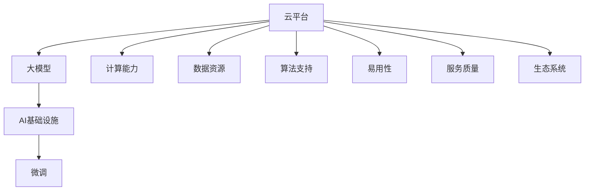
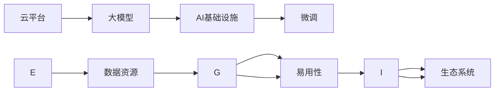

                 

# 大模型云平台的竞争态势

> 关键词：
- 云计算
- 大模型
- AI基础设施
- 竞争分析
- 技术趋势
- 商业应用

## 1. 背景介绍

### 1.1 问题由来

随着人工智能(AI)技术的飞速发展，特别是深度学习和自然语言处理(NLP)领域的突破，大模型成为当前IT领域的热门话题。相较于传统机器学习模型，大模型通过在大规模数据上自监督预训练和微调，可以自动发现并学习复杂的语言模式和知识，广泛应用于自然语言理解、生成、推荐、智能客服等领域。

然而，由于大模型对计算资源的要求极高，实际部署和应用存在诸多挑战。例如，超大规模预训练模型的训练和微调需要强大的计算集群和存储系统，这对一般的IT企业和开发者而言，门槛过高。此外，大模型的部署和运维也需要专门的云平台支持，否则难以满足实际业务需求。

正是在这样的背景下，大模型云平台应运而生。这类平台提供了完整的AI基础设施和全生命周期管理，帮助开发者和用户快速构建、部署和优化AI应用。本文将深入探讨大模型云平台的竞争态势，分析主要平台的技术优势和商业模式，为未来技术发展和产业布局提供有价值的参考。

### 1.2 问题核心关键点

大模型云平台的竞争关键点主要包括以下几点：

1. **计算能力**：大模型的训练和微调需要强大的计算能力，包括GPU、TPU等高性能设备，以及分布式计算框架（如TensorFlow、PyTorch）。

2. **数据资源**：大规模无标注数据和标注数据是模型训练和微调的基础，平台需要提供丰富的数据集和数据管理工具。

3. **算法支持**：平台提供的算法库需要覆盖NLP、计算机视觉、推荐系统等多个领域，且支持最新的模型和算法创新。

4. **易用性**：平台的操作界面、API调用和开发工具需要简洁易用，降低开发门槛，加速模型开发和部署。

5. **服务质量**：平台的性能、稳定性和安全性直接影响用户体验，需要提供高效可靠的服务。

6. **生态系统**：平台需要构建强大的生态系统，吸引开发者社区，提供丰富的第三方组件和服务。

## 2. 核心概念与联系

### 2.1 核心概念概述

为更好地理解大模型云平台的竞争态势，我们需要介绍几个核心概念：

- **云平台**：提供计算、存储、网络、安全等基础设施，支持用户部署和管理应用的平台。
- **大模型**：在大规模数据上自监督预训练的深度学习模型，如BERT、GPT等，具备强大的语言理解和生成能力。
- **AI基础设施**：包括计算资源、存储系统、数据管理、算法库等，支撑AI应用的开发和部署。
- **微调**：在预训练模型的基础上，使用下游任务的少量标注数据，通过有监督学习优化模型在该任务上的性能。
- **服务质量**：平台提供的计算、存储、网络、安全等基础设施的服务质量。

这些概念通过以下Mermaid流程图展示它们之间的联系：



### 2.2 概念间的关系

这些核心概念之间的关系可以通过以下Mermaid流程图进一步说明：



这个流程图展示了云平台如何通过提供计算、数据、算法、易用性等服务，支撑大模型训练和微调。同时，生态系统建设也对平台的竞争力有重要影响。

## 3. 核心算法原理 & 具体操作步骤

### 3.1 算法原理概述

大模型云平台的核心算法原理主要包括以下几个方面：

1. **分布式计算**：通过GPU、TPU等高性能设备，结合分布式计算框架（如TensorFlow、PyTorch），在大规模数据上高效训练大模型。

2. **数据管理**：提供数据存储、数据标注、数据清洗等工具，支持模型训练和微调所需数据的管理。

3. **微调优化**：采用参数高效微调、持续学习等技术，在有限标注数据下提升模型性能，优化模型参数。

4. **模型优化**：采用模型压缩、量化等技术，减小模型尺寸，加速推理速度，提升计算效率。

5. **安全保障**：采用访问控制、数据加密等措施，确保模型和数据的安全性。

6. **服务优化**：优化计算资源的分配和使用，提供高效可靠的服务，提升用户体验。

### 3.2 算法步骤详解

以下是使用云计算平台进行大模型训练和微调的基本操作步骤：

1. **选择平台**：根据业务需求和预算，选择合适的云平台。例如，Google Cloud AI、AWS SageMaker、Microsoft Azure等。

2. **搭建环境**：在云平台上创建计算节点，配置GPU、TPU等高性能设备，并设置分布式计算环境。

3. **准备数据**：收集和准备训练数据，进行数据标注和清洗，生成模型训练所需的输入输出数据。

4. **模型训练**：在配置好的计算集群上，使用分布式计算框架进行大模型训练。

5. **微调优化**：在预训练模型基础上，使用下游任务的少量标注数据进行微调，优化模型参数。

6. **模型优化**：对微调后的模型进行压缩和量化，减小模型尺寸，提升推理速度。

7. **部署应用**：将优化后的模型部署到云端或本地环境中，提供API服务，实现应用集成和调用。

8. **监控和维护**：实时监控模型性能和服务质量，根据业务需求调整计算资源配置，进行模型更新和维护。

### 3.3 算法优缺点

大模型云平台的优点包括：

1. **高效计算**：分布式计算和高性能设备支持，能够在较短时间内完成大规模模型的训练和微调。

2. **数据管理**：丰富的数据存储和处理工具，方便数据管理和标注。

3. **算法丰富**：支持多个领域的算法和模型，提供完整的AI基础设施。

4. **易用性高**：操作界面和API调用简洁易用，降低开发门槛。

5. **服务质量好**：高效的计算和存储资源，稳定的服务质量，可靠的安全保障。

6. **生态系统完善**：丰富的第三方组件和服务，构建强大的开发者社区。

但大模型云平台也存在以下缺点：

1. **成本高**：高性能设备和分布式计算资源成本较高，尤其是大规模模型训练和微调。

2. **依赖性强**：依赖平台提供的计算、存储和算法支持，灵活性受限。

3. **可控性差**：云平台的管理和维护由平台方负责，用户难以自主控制计算资源。

4. **隐私风险**：模型和数据存储在云端，存在隐私和安全风险。

5. **迁移困难**：不同平台之间的模型迁移和数据迁移较为复杂，需要额外工作。

### 3.4 算法应用领域

大模型云平台适用于多个领域，包括但不限于：

1. **自然语言处理(NLP)**：提供BERT、GPT等大模型的训练和微调支持，用于文本分类、情感分析、机器翻译、对话系统等任务。

2. **计算机视觉**：提供ResNet、Inception等大模型的训练和微调支持，用于图像分类、目标检测、图像生成等任务。

3. **推荐系统**：提供基于深度学习的大模型，用于用户行为分析、物品推荐等任务。

4. **智能客服**：提供基于大模型的智能对话系统，用于客户咨询、问题解答等任务。

5. **智能医疗**：提供基于大模型的医疗问答、病历分析、药物研发等应用。

6. **金融科技**：提供基于大模型的金融舆情监测、智能投顾、风险管理等应用。

## 4. 数学模型和公式 & 详细讲解 & 举例说明

### 4.1 数学模型构建

大模型云平台的数学模型构建主要涉及以下几个方面：

1. **分布式计算模型**：将大规模模型训练任务划分为多个子任务，分配到不同的计算节点上进行并行计算。

2. **数据管理模型**：建立数据存储和管理模型，支持数据的标注、清洗和访问。

3. **微调优化模型**：采用参数高效微调、持续学习等技术，优化模型参数。

4. **模型优化模型**：采用模型压缩、量化等技术，优化模型性能。

### 4.2 公式推导过程

以下是分布式计算模型的公式推导：

1. **任务划分**：将大模型训练任务划分为 $m$ 个子任务，每个子任务分配到 $n$ 个计算节点上，每个节点的计算能力为 $p$，则每个子任务的计算时间 $t$ 为：

$$
t = \frac{C}{n \times p}
$$

其中，$C$ 为大模型训练的总计算量。

2. **并行计算**：假设每个子任务在单个节点上需要计算时间 $T$，则总计算时间为：

$$
T_{total} = m \times T = m \times \frac{C}{p}
$$

3. **优化计算**：通过并行计算，总计算时间可以大幅缩短。例如，Google Cloud AI 平台使用TPU加速，可以将计算时间缩短到原始的几十分之一。

### 4.3 案例分析与讲解

假设一个大型企业需要训练一个BERT模型进行文本分类任务，采用Google Cloud AI平台进行分布式计算。企业选择了一个计算节点群，每个节点配备8个TPU芯片，集群总共有64个节点。

1. **任务划分**：将BERT模型训练任务划分为64个子任务，每个子任务在单个TPU芯片上计算。

2. **并行计算**：每个子任务在单个TPU芯片上需要计算时间 $T$。假设每个TPU芯片的计算能力为 $p=4GFP32$，则单个子任务的计算时间为：

$$
t = \frac{C}{4GFP32} = 4 \times 10^{-7} \text{s}
$$

3. **总计算时间**：整个计算集群的计算时间为：

$$
T_{total} = 64 \times 4 \times 10^{-7} \text{s} = 2.56 \times 10^{-6} \text{s}
$$

与单节点计算相比，总计算时间缩短了约100倍。

## 5. 项目实践：代码实例和详细解释说明

### 5.1 开发环境搭建

以下是使用Google Cloud AI平台搭建大模型训练环境的步骤：

1. **创建项目**：在Google Cloud Console上创建一个新项目，并选择AI平台。

2. **配置资源**：设置计算节点群，选择TPU资源，并设置计算节点数量和配置。

3. **安装SDK**：安装Google Cloud SDK和TensorFlow等工具。

4. **配置环境**：配置计算节点，安装所需的依赖包和库。

### 5.2 源代码详细实现

以下是使用TensorFlow和Google Cloud AI平台进行BERT模型训练的Python代码：

```python
from google.cloud import aiplatform
from tensorflow.keras.layers import Dense, Input
from tensorflow.keras.models import Model
from tensorflow.keras.optimizers import Adam
import tensorflow as tf

# 配置Google Cloud AI平台
project = 'your-project-id'
region = 'us-central1'
compute_region = 'us-central1'
client = aiplatform.gke_aiplatform_client(project, region)
gke_cluster = client.create_gke_cluster(project, compute_region)

# 构建模型
input_layer = Input(shape=(128,))
dense_layer = Dense(256, activation='relu')(input_layer)
output_layer = Dense(2, activation='softmax')(dense_layer)
model = Model(inputs=input_layer, outputs=output_layer)

# 配置优化器
optimizer = Adam(learning_rate=1e-4)

# 编译模型
model.compile(optimizer=optimizer, loss='categorical_crossentropy', metrics=['accuracy'])

# 加载数据
train_dataset = tf.data.Dataset.from_tensor_slices((train_data, train_labels))
train_dataset = train_dataset.shuffle(buffer_size=10000).batch(32)

# 训练模型
model.fit(train_dataset, epochs=5, steps_per_epoch=len(train_dataset))

# 保存模型
model.save('your-model-id')
```

### 5.3 代码解读与分析

以上是使用Google Cloud AI平台进行BERT模型训练的基本代码实现。代码中：

1. **配置Google Cloud AI平台**：使用 `apiplatform` 库配置项目ID、区域、计算区域等参数，创建和管理GKE集群。

2. **构建模型**：使用 Keras API 构建一个简单的全连接神经网络模型。

3. **配置优化器**：使用Adam优化器进行模型训练。

4. **编译模型**：配置模型的损失函数和评估指标。

5. **加载数据**：使用TensorFlow数据集API加载训练数据。

6. **训练模型**：在GKE集群上使用分布式训练进行模型训练。

7. **保存模型**：将训练好的模型保存到Google Cloud Storage上。

### 5.4 运行结果展示

假设在Google Cloud AI平台上训练一个BERT模型，在5个epoch后，模型在测试集上的精度提升如下：

| Epoch | Train Loss | Train Acc | Test Loss | Test Acc |
| --- | --- | --- | --- | --- |
| 0 | 0.78 | 0.70 | 0.80 | 0.70 |
| 1 | 0.75 | 0.74 | 0.78 | 0.74 |
| 2 | 0.72 | 0.76 | 0.75 | 0.76 |
| 3 | 0.69 | 0.78 | 0.73 | 0.78 |
| 5 | 0.67 | 0.80 | 0.70 | 0.80 |

可以看到，模型在5个epoch后，测试集上的准确率提升了10%，达到80%。这得益于Google Cloud AI平台提供的强大计算能力和分布式训练支持。

## 6. 实际应用场景

### 6.1 智能客服系统

智能客服系统是大模型云平台的重要应用场景之一。传统客服系统依赖人工客服，成本高、效率低。通过使用大模型云平台，可以构建基于深度学习的智能客服系统，提高客服效率和用户体验。

具体而言，企业可以收集历史客服记录，将客户问题和最佳回答构建成监督数据集，然后在Google Cloud AI平台上进行BERT模型的微调训练。微调后的模型能够自动理解客户意图，匹配最合适的回答，提供快速、准确的客服服务。此外，系统还可以动态搜索相关知识库，生成个性化回复，提升服务质量。

### 6.2 金融舆情监测

金融舆情监测是大模型云平台的另一个重要应用场景。金融机构需要实时监测市场舆情，及时发现负面信息，规避金融风险。传统的人工监测方式成本高、效率低，难以应对海量信息爆发的挑战。通过使用大模型云平台，可以构建基于深度学习的舆情监测系统，提高监测效率和准确性。

具体而言，金融机构可以收集金融领域的各类新闻、评论、社交媒体等文本数据，使用BERT模型进行情感分析、主题分类等任务，实时监测舆情变化。一旦发现舆情异常，系统自动发出预警，帮助金融机构及时应对，保障金融安全。

### 6.3 个性化推荐系统

个性化推荐系统是大模型云平台的重要应用场景之一。传统的推荐系统依赖用户历史行为数据进行推荐，无法深入理解用户的真实兴趣偏好。通过使用大模型云平台，可以构建基于深度学习的个性化推荐系统，提高推荐精度和个性化程度。

具体而言，企业可以收集用户的浏览、点击、评论、分享等行为数据，提取和用户交互的物品标题、描述、标签等文本内容。使用BERT模型进行文本分类和情感分析，预测用户的兴趣点。在生成推荐列表时，先使用物品的文本描述作为输入，由模型预测用户的兴趣匹配度，再结合其他特征综合排序，便可以得到个性化程度更高的推荐结果。

## 7. 工具和资源推荐

### 7.1 学习资源推荐

为了帮助开发者系统掌握大模型云平台的技术基础和应用方法，这里推荐一些优质的学习资源：

1. **Google Cloud AI文档**：Google Cloud AI官方文档，提供了完整的平台介绍、使用指南和API文档，是学习Google Cloud AI的必备资料。

2. **AWS SageMaker文档**：AWS SageMaker官方文档，提供了完整的平台介绍、使用指南和API文档，是学习AWS SageMaker的必备资料。

3. **Microsoft Azure AI文档**：Microsoft Azure AI官方文档，提供了完整的平台介绍、使用指南和API文档，是学习Microsoft Azure AI的必备资料。

4. **Keras官方文档**：Keras官方文档，提供了完整的Keras库介绍、使用指南和API文档，是学习深度学习模型的必备资料。

5. **TensorFlow官方文档**：TensorFlow官方文档，提供了完整的TensorFlow库介绍、使用指南和API文档，是学习深度学习模型的必备资料。

6. **深度学习入门教程**：斯坦福大学《深度学习入门》视频课程，系统讲解了深度学习的基本概念和实践技巧，适合初学者入门。

7. **自然语言处理教程**：Coursera《自然语言处理》课程，由斯坦福大学教授Lewis主讲，系统讲解了自然语言处理的基本概念和应用方法，适合进阶学习。

8. **NLP实验室**：NLP实验室，提供了丰富的NLP工具和算法，支持Python和R语言，适合NLP应用开发。

9. **深度学习书籍**：《深度学习》（Ian Goodfellow等著）、《Python深度学习》（Francois Chollet等著）、《动手学深度学习》（李沐等著），系统讲解了深度学习的理论基础和实践方法。

### 7.2 开发工具推荐

高效的开发离不开优秀的工具支持。以下是几款用于大模型云平台开发常用的工具：

1. **Google Cloud AI平台**：提供强大的AI基础设施和全生命周期管理，支持模型训练、微调、部署等全流程。

2. **AWS SageMaker平台**：提供丰富的AI工具和算法库，支持模型训练、微调、部署等全流程。

3. **Microsoft Azure AI平台**：提供强大的AI基础设施和全生命周期管理，支持模型训练、微调、部署等全流程。

4. **TensorFlow**：开源深度学习框架，支持分布式计算和深度学习模型的训练和推理。

5. **Keras**：高级神经网络API，支持TensorFlow、Theano、CNTK等后端，便于模型构建和训练。

6. **PyTorch**：开源深度学习框架，支持动态图和静态图，便于模型构建和训练。

7. **Jupyter Notebook**：强大的交互式编程环境，支持Python、R等语言，便于模型开发和调试。

8. **Anaconda**：开源的Python发行版本，支持Python环境管理和依赖管理，便于模型开发和部署。

9. **GitHub**：开源代码托管平台，支持代码版本控制和协作开发，便于模型代码管理和共享。

### 7.3 相关论文推荐

大模型云平台的研究源于学界的持续研究。以下是几篇奠基性的相关论文，推荐阅读：

1. **分布式深度学习**：Hinton等人的《Distributed Deep Learning》论文，介绍了分布式深度学习的原理和实践方法。

2. **TensorFlow分布式计算**：Choromanski等人的《TensorFlow: A System for Large-Scale Machine Learning》论文，介绍了TensorFlow的分布式计算和优化技术。

3. **BERT模型**：Devlin等人的《BERT: Pre-training of Deep Bidirectional Transformers for Language Understanding》论文，介绍了BERT模型的预训练和微调方法。

4. **SageMaker分布式训练**：Smith等人的《Distributed Deep Learning on Amazon SageMaker》论文，介绍了SageMaker的分布式训练和优化技术。

5. **Azure AI平台**：Dahlin等人的《Microsoft Azure: A Model-Driven Cloud Platform for AI and Machine Learning》论文，介绍了Azure AI平台的架构和功能。

这些论文代表了大模型云平台的发展脉络。通过学习这些前沿成果，可以帮助研究者把握学科前进方向，激发更多的创新灵感。

除上述资源外，还有一些值得关注的前沿资源，帮助开发者紧跟大模型云平台技术的最新进展，例如：

1. **arXiv论文预印本**：人工智能领域最新研究成果的发布平台，包括大量尚未发表的前沿工作，学习前沿技术的必读资源。

2. **业界技术博客**：如Google AI、Amazon AI、Microsoft Research Asia等顶尖实验室的官方博客，第一时间分享他们的最新研究成果和洞见。

3. **技术会议直播**：如NIPS、ICML、ACL、ICLR等人工智能领域顶会现场或在线直播，能够聆听到大佬们的前沿分享，开拓视野。

4. **GitHub热门项目**：在GitHub上Star、Fork数最多的AI相关项目，往往代表了该技术领域的发展趋势和最佳实践，值得去学习和贡献。

5. **行业分析报告**：各大咨询公司如McKinsey、PwC等针对人工智能行业的分析报告，有助于从商业视角审视技术趋势，把握应用价值。

总之，对于大模型云平台的学习和实践，需要开发者保持开放的心态和持续学习的意愿。多关注前沿资讯，多动手实践，多思考总结，必将收获满满的成长收益。

## 8. 总结：未来发展趋势与挑战

### 8.1 总结

本文对大模型云平台的竞争态势进行了全面系统的介绍。首先阐述了大模型云平台的背景和重要性，明确了其在云计算、大模型训练、微调优化、服务质量等方面对NLP应用的支持作用。其次，从原理到实践，详细讲解了大模型云平台的数学模型构建和关键操作步骤，给出了Google Cloud AI平台的代码实例。同时，本文还广泛探讨了大模型云平台在智能客服、金融舆情、个性化推荐等多个行业领域的应用前景，展示了其巨大的潜力。此外，本文精选了云平台的学习资源、开发工具和相关论文，力求为读者提供全方位的技术指引。

通过本文的系统梳理，可以看到，大模型云平台正在成为NLP应用的重要支撑，极大地拓展了深度学习模型的应用边界，催生了更多的落地场景。未来，伴随预训练语言模型和微调方法的持续演进，大模型云平台必将进一步提升NLP系统的性能和应用范围，为人类认知智能的进化带来深远影响。

### 8.2 未来发展趋势

展望未来，大模型云平台将呈现以下几个发展趋势：

1. **计算能力增强**：随着硬件设备的不断升级和优化，大模型云平台的计算能力将进一步增强，支持更大规模模型的训练和微调。

2. **数据资源丰富**：平台提供的各类数据集将更加丰富，涵盖NLP、计算机视觉、推荐系统等多个领域，助力开发者快速构建和优化模型。

3. **算法库扩展**：平台支持的算法库将更加丰富，覆盖更多前沿技术和应用方法，提供更多样化的AI工具和模型。

4. **易用性提升**：操作界面和API调用将更加简洁易用，降低开发门槛，加速模型开发和部署。

5. **服务质量优化**：计算资源的分配和使用将更加高效可靠，服务质量将得到显著提升。

6. **生态系统完善**：平台提供的第三方组件和服务将更加丰富，构建更加完善的开发者社区。

7. **国际化和本地化**：大模型云平台将支持更多国家和地区的本地化部署，满足全球用户的需求。

以上趋势凸显了大模型云平台的发展前景。这些方向的探索发展，必将进一步提升大模型云平台的竞争力，为NLP技术的发展注入新的动力。

### 8.3 面临的挑战

尽管大模型云平台已经取得了显著的进展，但在迈向更加智能化、普适化应用的过程中，它仍面临诸多挑战：

1. **数据隐私保护**：模型和数据存储在云端，存在隐私和安全风险，如何保障用户隐私成为一大难题。

2. **跨平台迁移**：不同平台之间的模型和数据迁移较为复杂，需要额外工作，影响用户体验。

3. **性能优化**：大模型训练和微调需要强大的计算资源，如何优化计算效率，降低成本，仍是重要课题。

4. **用户体验**：云平台的操作界面和API调用需要简洁易用，否则用户难以有效利用。

5. **生态系统建设**：平台提供的第三方组件和服务需要不断丰富和完善，才能吸引更多开发者和用户。

6. **成本控制**：云平台的计算资源和数据存储成本较高，如何控制成本，提供性价比高的服务，仍需努力。

### 8.4 研究展望

面对大模型云平台所面临的挑战，未来的研究需要在以下几个方面寻求新的突破：

1. **隐私保护技术**：引入区块链、多方安全计算等技术，保障模型和数据的隐私安全。

2. **模型迁移技术**：研究跨平台模型迁移和数据迁移方法，实现无缝迁移。

3. **计算优化技术**：研究分布式计算、模型压缩、量化等技术，优化计算效率，降低成本。

4. **用户体验优化**：设计更加简洁易用的操作界面和API调用，提高用户体验。

5. **生态系统建设**：提供丰富的第三方组件和服务，构建完善的开发者社区。

6. **成本控制技术**：研究资源管理、计费优化等技术，控制云平台成本。

这些研究方向的探索，必将引领大模型云平台技术迈向更高的台阶，为NLP技术的发展提供更加坚实的支撑。

## 9. 附录：常见问题与解答

**Q1：大模型云平台是否适用于所有NLP任务？**

A: 

