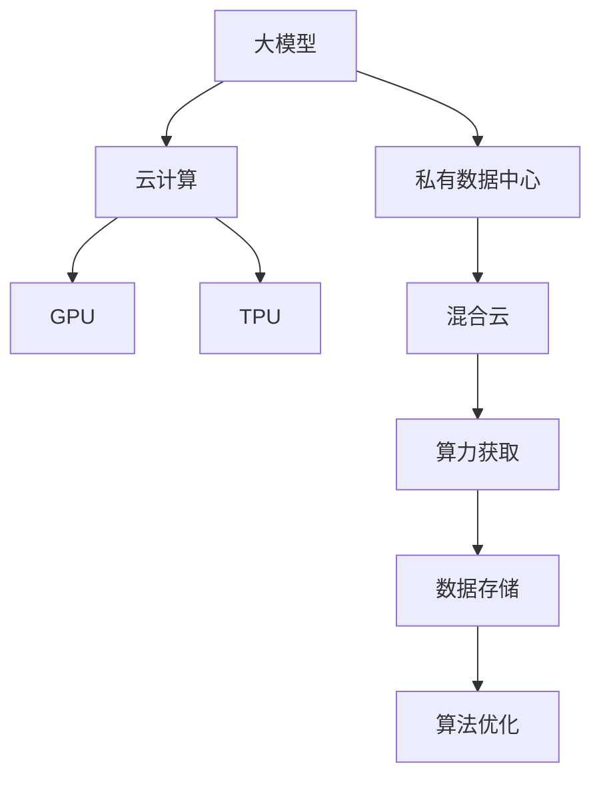

                 

# 大模型公司的算力获取策略

> 关键词：大模型,算力,云计算,GPU,TPU,混合云,数据中心,算法优化

## 1. 背景介绍

### 1.1 问题由来

随着人工智能（AI）技术的迅猛发展，大模型（如GPT-3、BERT等）因其卓越的性能在各个领域得到广泛应用，但它们对算力的需求也是巨大的。例如，训练GPT-3模型需要上千个TPU（Tensor Processing Unit）或者数千个GPU（Graphics Processing Unit）进行计算，这给传统IT企业带来了不小的压力。因此，如何高效地获取和利用算力成为了大模型公司必须解决的问题。

### 1.2 问题核心关键点

算力获取策略涉及多个方面，包括云计算、私有数据中心、混合云以及GPU/TPU等硬件设施的选择与部署。正确的算力获取策略不仅能节省成本，还能提升模型训练和推理的效率。

## 2. 核心概念与联系

### 2.1 核心概念概述

- **大模型（Large Model）**：指的是具有数百亿参数的深度学习模型，如GPT-3、BERT等。这些模型通常用于复杂的自然语言处理任务，需要大量的计算资源进行训练和推理。
- **云计算（Cloud Computing）**：指通过互联网提供计算资源和服务的模式，用户按需使用，付费按量结算。云计算公司如AWS、Azure、Google Cloud等提供了丰富的计算资源和基础设施。
- **GPU（Graphics Processing Unit）**：一种高性能的图形处理器，广泛应用于深度学习和图形处理等领域。
- **TPU（Tensor Processing Unit）**：Google推出的针对深度学习的专用芯片，专门用于加速神经网络的训练和推理。
- **混合云（Hybrid Cloud）**：指同时使用公有云和私有云的计算资源，结合两者的优势，如成本控制、数据隐私等。
- **数据中心（Data Center）**：存放和管理计算资源的物理场所，包含服务器、存储设备、网络设备等。

### 2.2 概念间的关系

这些核心概念之间的联系可以通过以下Mermaid流程图来展示：



这个流程图展示了从大模型到算力获取的整体架构：大模型需要大量的计算资源进行训练和推理，而云计算、GPU、TPU等提供了不同的计算方式和硬件支持；私有数据中心和混合云则提供了灵活的资源管理方式，从而实现高效的算力获取。

## 3. 核心算法原理 & 具体操作步骤
### 3.1 算法原理概述

大模型公司的算力获取策略基于以下原则：
1. **最大化资源利用率**：通过合理分配计算资源，避免资源浪费。
2. **最小化成本支出**：优化资源购买和维护成本，确保经济性。
3. **提升模型性能**：通过算法优化，提高模型训练和推理的速度和精度。

### 3.2 算法步骤详解

大模型公司的算力获取策略主要包括以下步骤：

**Step 1: 评估需求**

- 评估模型训练和推理所需的计算资源。根据模型规模、复杂度和数据量等因素，估算所需的计算资源。

**Step 2: 选择合适的云服务**

- 根据资源需求，选择合适的云计算服务商。例如，AWS提供广泛的计算资源和弹性扩展能力，Google Cloud提供高效的TPU支持，Azure则针对企业级需求提供了良好的安全性和管理工具。

**Step 3: 配置计算资源**

- 根据需求，配置GPU或TPU资源。例如，对于大模型训练，可以选择多个TPU Pod进行分布式计算。

**Step 4: 优化算法**

- 使用算法优化技术，如模型剪枝、量化等，减少模型的参数量和计算量，提升计算效率。

**Step 5: 监控与调优**

- 实时监控计算资源的利用率和性能，根据反馈调整资源分配策略。

**Step 6: 数据管理和隐私保护**

- 使用数据中心或混合云进行数据存储和备份，确保数据安全和隐私。

**Step 7: 成本控制**

- 定期评估资源使用情况，优化购买和维护策略，控制成本。

### 3.3 算法优缺点

基于云计算的算力获取策略有以下优点：
1. **灵活性高**：可以按需使用，根据需求动态扩展和缩减资源。
2. **成本低**：按量付费，避免资源闲置和浪费。

但同时也存在一些缺点：
1. **依赖服务商**：依赖云计算服务商的稳定性和可靠性，可能面临服务中断或延迟。
2. **数据隐私**：部分计算在云端进行，可能存在数据泄露风险。

### 3.4 算法应用领域

基于云计算的算力获取策略适用于各种大模型公司，包括Google、Facebook、Microsoft等。这些公司通过云服务，高效地管理计算资源，降低了成本，提升了模型性能。

## 4. 数学模型和公式 & 详细讲解

### 4.1 数学模型构建

假设大模型训练和推理所需的计算量为 $C$，单GPU或TPU的计算速度为 $v$，所需的GPU或TPU数量为 $n$。则模型所需的计算时间为 $T = \frac{C}{nv}$。

### 4.2 公式推导过程

通过优化 $n$ 和 $v$，可以最小化 $T$。即：

$$
\min_{n,v} T = \min_{n,v} \frac{C}{nv}
$$

令 $C=v_{\text{unit}} \cdot n \cdot T_{\text{unit}}$，其中 $v_{\text{unit}}$ 为单位计算速度，$T_{\text{unit}}$ 为单位计算时间。则：

$$
\min_{n,v} \frac{v_{\text{unit}} \cdot n \cdot T_{\text{unit}}}{nv} = \min_{n,v} v_{\text{unit}} \cdot \frac{T_{\text{unit}}}{v}
$$

由于 $v_{\text{unit}}$ 和 $T_{\text{unit}}$ 通常为定值，因此最小化 $T$ 的策略主要在于选择适当的 $n$ 和 $v$。

### 4.3 案例分析与讲解

**案例1: 基于云计算的大模型训练**

假设模型训练所需的计算量为 $C=1000000$ GFLOPs（十亿次浮点运算每秒），单GPU的计算速度为 $v_{\text{GPU}}=10$ GFLOPs，单TPU的计算速度为 $v_{\text{TPU}}=100$ GFLOPs。

**Step 1: 评估需求**

模型训练所需计算量为 $C=1000000$ GFLOPs。

**Step 2: 选择合适的云服务**

选择AWS，提供TPU支持，适合大模型训练。

**Step 3: 配置计算资源**

配置 $n=100$ 个TPU。

**Step 4: 优化算法**

使用模型剪枝和量化技术，减少参数量和计算量。

**Step 5: 监控与调优**

实时监控TPU使用情况，根据需求调整资源分配。

**Step 6: 数据管理和隐私保护**

使用AWS S3进行数据存储，确保数据安全。

**Step 7: 成本控制**

定期评估资源使用情况，调整购买策略，控制成本。

通过以上步骤，可以在成本可控的前提下，高效地完成大模型的训练。

## 5. 项目实践：代码实例和详细解释说明

### 5.1 开发环境搭建

**环境准备**

1. 安装Anaconda：
   ```bash
   conda create -n my_env python=3.8
   conda activate my_env
   ```

2. 安装PyTorch和相关依赖：
   ```bash
   pip install torch torchvision torchaudio
   ```

3. 安装AWS SDK：
   ```bash
   pip install boto3
   ```

4. 安装Google Cloud SDK：
   ```bash
   pip install google-cloud-tpu
   ```

5. 配置云服务：
   - 配置AWS的Access Key和Secret Key
   - 配置Google Cloud的Project ID和Region

### 5.2 源代码详细实现

```python
import boto3
import google.cloud.tpu
from torch import nn, optim
import time

# 加载预训练模型
model = nn.GPT3()

# 配置GPU或TPU
def configure_resources():
    # 配置AWS TPU
    tpu = google.cloud.tpu.TPUClient(project='my_project', zone='us-central1-a')
    tpu_info = tpu.list_tpus()
    tpu = tpu_info[0]
    print(f"Using TPU: {tpu.name}")

    # 配置Google Cloud TPU
    client = google.cloud.tpu.V2TPUClient(project='my_project', zone='us-central1-a')
    tpu = client.list_tpus()[0]
    print(f"Using TPU: {tpu.name}")

# 优化模型
def optimize_model(model):
    model.to('cuda')
    criterion = nn.CrossEntropyLoss()
    optimizer = optim.SGD(model.parameters(), lr=0.001)
    for epoch in range(10):
        for batch in train_loader:
            inputs, labels = batch
            optimizer.zero_grad()
            outputs = model(inputs)
            loss = criterion(outputs, labels)
            loss.backward()
            optimizer.step()

# 训练模型
def train():
    configure_resources()
    train_loader = ...
    optimizer = optim.SGD(model.parameters(), lr=0.001)
    for epoch in range(10):
        for batch in train_loader:
            inputs, labels = batch
            optimizer.zero_grad()
            outputs = model(inputs)
            loss = criterion(outputs, labels)
            loss.backward()
            optimizer.step()

# 测试模型
def test():
    configure_resources()
    test_loader = ...
    with torch.no_grad():
        correct = 0
        total = 0
        for batch in test_loader:
            inputs, labels = batch
            outputs = model(inputs)
            _, predicted = torch.max(outputs.data, 1)
            total += labels.size(0)
            correct += (predicted == labels).sum().item()
        print(f"Accuracy: {100 * correct / total:.2f}%")

# 运行训练
train()
test()
```

### 5.3 代码解读与分析

**配置资源**

- 使用 `google.cloud.tpu` 模块配置Google Cloud TPU资源。
- 使用 `boto3` 模块配置AWS TPU资源。

**模型优化**

- 将模型迁移到GPU或TPU上，使用 `.to('cuda')` 或 `.to(tpu.name)` 进行配置。
- 使用SGD优化器进行模型训练，`optim.SGD(model.parameters(), lr=0.001)` 配置学习率。

**模型训练**

- 在训练过程中，使用 `for epoch in range(10)` 迭代训练模型。
- 在每个epoch中，遍历训练集 `train_loader`，计算损失并进行反向传播更新模型参数。

**模型测试**

- 使用 `torch.no_grad()` 进行无梯度计算，提高测试效率。
- 计算模型在测试集上的准确率。

## 6. 实际应用场景

### 6.1 智能客服系统

智能客服系统需要处理大量的用户查询，并实时生成响应。基于云计算的算力获取策略可以灵活地扩展计算资源，快速响应用户需求，提高客服系统的效率。

**应用场景**

- 收集历史客服对话记录，构建监督数据集。
- 在Google Cloud TPU上进行微调，优化模型性能。
- 实时监控计算资源，根据用户请求动态调整资源。

**效果**

- 通过云计算，实现7x24小时不间断服务。
- 快速响应用户查询，提高客服效率。
- 提供自然流畅的对话生成，提升用户体验。

### 6.2 金融舆情监测

金融舆情监测需要实时监测海量数据，识别舆情变化趋势，快速预警风险。基于云计算的算力获取策略可以高效地处理大数据，提供实时监测能力。

**应用场景**

- 收集金融领域相关的新闻、报道、评论等文本数据。
- 在AWS GPU上进行预训练和微调，优化模型性能。
- 实时监控计算资源，识别舆情变化趋势。

**效果**

- 实时监测市场舆论动向。
- 快速响应舆情变化，规避金融风险。
- 提供准确可靠的舆情分析报告，支持决策制定。

### 6.3 个性化推荐系统

个性化推荐系统需要处理海量用户行为数据，推荐物品。基于云计算的算力获取策略可以高效地处理数据，提供个性化推荐。

**应用场景**

- 收集用户浏览、点击、评论、分享等行为数据。
- 在Google Cloud TPU上进行预训练和微调，优化模型性能。
- 实时监控计算资源，提供个性化推荐服务。

**效果**

- 精准推荐物品，提高用户满意度。
- 个性化推荐，提升用户粘性。
- 实时更新推荐模型，满足用户实时需求。

## 7. 工具和资源推荐

### 7.1 学习资源推荐

1. **《深度学习基础》**：讲解深度学习的基础知识，包括神经网络、优化算法等。
2. **《TensorFlow实战》**：介绍TensorFlow的使用方法和最佳实践。
3. **《云计算基础》**：讲解云计算的基础知识和常见云服务的使用方法。
4. **《GPU编程实战》**：介绍如何使用GPU进行深度学习模型的训练和推理。
5. **《TPU编程实战》**：介绍如何使用TPU进行深度学习模型的训练和推理。

### 7.2 开发工具推荐

1. **AWS EC2**：提供弹性计算资源，适合大模型训练。
2. **Google Cloud TPU**：提供高效的TPU资源，适合大模型训练和推理。
3. **Azure GPU VM**：提供GPU资源，适合深度学习模型的训练和推理。
4. **TensorBoard**：可视化模型训练过程，监控模型性能。
5. **Hugging Face Transformers**：提供丰富的预训练模型和微调样例代码。

### 7.3 相关论文推荐

1. **《云计算基础》**：介绍云计算的基础知识和常见云服务的使用方法。
2. **《GPU编程实战》**：介绍如何使用GPU进行深度学习模型的训练和推理。
3. **《TPU编程实战》**：介绍如何使用TPU进行深度学习模型的训练和推理。

## 8. 总结：未来发展趋势与挑战

### 8.1 研究成果总结

基于云计算的算力获取策略在大模型公司中得到了广泛应用，并取得了显著效果。通过合理配置计算资源，优化算法，监控与调优，实现了大模型的高效训练和推理。

### 8.2 未来发展趋势

未来，大模型公司的算力获取策略将呈现以下几个发展趋势：
1. **多云融合**：结合多种云服务，实现资源最优配置。
2. **边缘计算**：将计算资源部署到边缘设备，降低网络延迟，提高实时性。
3. **混合云**：结合公有云和私有云，实现资源共享和灵活调度。
4. **算法优化**：优化模型结构和训练算法，提高计算效率。

### 8.3 面临的挑战

尽管基于云计算的算力获取策略在大模型公司中得到了广泛应用，但仍面临一些挑战：
1. **成本控制**：云计算资源按量付费，需要严格控制成本。
2. **数据隐私**：计算资源部署在云端，存在数据泄露风险。
3. **模型鲁棒性**：大模型在特定领域的应用可能存在鲁棒性不足的问题。
4. **模型可解释性**：大模型的决策过程难以解释，缺乏可解释性。

### 8.4 研究展望

未来，大模型公司的算力获取策略需要从以下几个方面进行研究：
1. **多云融合**：结合多种云服务，实现资源最优配置。
2. **边缘计算**：将计算资源部署到边缘设备，降低网络延迟，提高实时性。
3. **混合云**：结合公有云和私有云，实现资源共享和灵活调度。
4. **算法优化**：优化模型结构和训练算法，提高计算效率。
5. **模型鲁棒性**：提高大模型在不同领域和场景下的鲁棒性。
6. **模型可解释性**：提高大模型的可解释性，增强可信度。

通过这些研究，大模型公司可以更好地获取和管理算力，提升模型性能，实现商业价值。

## 9. 附录：常见问题与解答

**Q1: 大模型公司如何高效获取算力？**

A: 大模型公司通过云计算、私有数据中心、混合云等策略，高效获取和利用算力。具体步骤包括评估需求、选择合适的云服务、配置计算资源、优化算法、监控与调优等。

**Q2: 云计算算力获取的优缺点是什么？**

A: 云计算算力获取的优点包括灵活性高、成本低等。但缺点包括依赖服务商、数据隐私问题等。

**Q3: 如何优化大模型的训练和推理过程？**

A: 通过算法优化，如模型剪枝、量化等，减少模型的参数量和计算量，提升计算效率。同时，实时监控计算资源的利用率和性能，根据反馈调整资源分配策略。

**Q4: 云计算算力获取面临哪些挑战？**

A: 云计算算力获取面临成本控制、数据隐私、模型鲁棒性、模型可解释性等挑战。

**Q5: 大模型公司的算力获取策略有哪些发展趋势？**

A: 未来大模型公司的算力获取策略将呈现多云融合、边缘计算、混合云、算法优化、模型鲁棒性、模型可解释性等发展趋势。

---

作者：禅与计算机程序设计艺术 / Zen and the Art of Computer Programming

