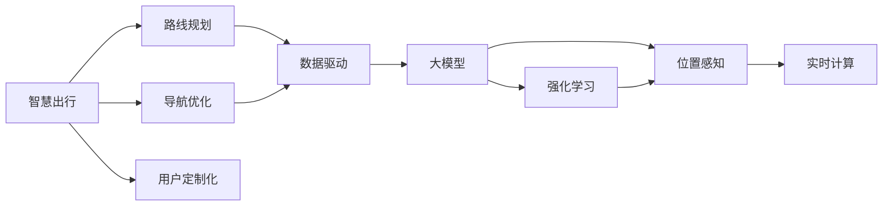

                 

# 大模型赋能智慧出行，创业者如何优化出行路线规划与导航？

> 关键词：智慧出行, 路线规划, 导航优化, 大模型, Transformer, 强化学习, 位置感知, 实时计算, 数据驱动, 用户定制化

## 1. 背景介绍

随着人工智能技术和大数据分析能力的不断提升，智慧出行成为了交通领域的一大趋势。许多城市正加速建设智能交通基础设施，致力于提升道路通行效率，优化公共交通资源配置，改善用户出行体验。其中，基于大模型的出行路线规划与导航系统，成为推动智慧出行发展的关键技术之一。

本博文将详细探讨如何利用大模型赋能智慧出行，帮助创业者优化出行路线规划与导航，以期提升出行效率、降低出行成本、提高用户体验。

## 2. 核心概念与联系

### 2.1 核心概念概述

为了更好地理解大模型在智慧出行中的应用，我们首先需要介绍几个核心概念：

- **智慧出行（Smart Travel）**：利用人工智能、大数据和物联网技术，实现智能化的交通管理和出行服务，提升交通系统整体效率。

- **路线规划（Route Planning）**：根据用户需求和交通条件，制定最佳出行路线，使得出行时间最短、交通费用最低、行程最顺畅。

- **导航优化（Navigation Optimization）**：通过实时交通数据和人工智能算法，动态调整导航路线，避免拥堵、绕行，提升导航精度和用户体验。

- **大模型（Large Model）**：如Transformer、BERT等大规模预训练语言模型，通过海量数据训练，具备强大的自然语言处理和模式识别能力。

- **强化学习（Reinforcement Learning）**：通过与环境互动，不断调整策略，学习最优决策的一种机器学习方法。

- **位置感知（Location Awareness）**：系统具备对位置信息的精确处理和实时更新能力，能够准确感知用户和环境的位置变化。

- **实时计算（Real-Time Computing）**：通过高效算法和分布式计算，实现对实时数据的快速处理和分析，支持高并发和高吞吐量的应用需求。

- **数据驱动（Data-Driven）**：利用海量数据进行分析和建模，指导决策和行为，实现智能化和个性化。

- **用户定制化（User-Customized）**：根据用户偏好和需求，提供个性化的出行方案和服务，满足用户独特的需求。

### 2.2 核心概念之间的关系

这些核心概念构成了智慧出行系统的基础架构，其相互关系可以用以下Mermaid流程图来表示：



这个流程图展示了智慧出行系统的核心组件及其相互关系：

1. 智慧出行系统包含路线规划和导航优化两个关键模块，负责智能地制定和调整出行路线。
2. 数据驱动是系统的核心，通过收集和分析大量交通数据，为路线规划和导航优化提供指导。
3. 大模型作为智能算法的支撑，通过对历史数据和实时数据的处理，提供精准的预测和优化建议。
4. 强化学习用于动态调整策略，实现最优的决策路径。
5. 位置感知确保系统能够实时感知用户和环境的位置变化，为实时计算提供基础。
6. 用户定制化使得系统能够根据用户偏好提供个性化的出行方案。

这些组件相互协作，构成了智慧出行系统的高效运行机制。

## 3. 核心算法原理 & 具体操作步骤

### 3.1 算法原理概述

大模型在智慧出行中的应用主要体现在路线规划和导航优化两个方面。下面分别介绍这两个方面的算法原理：

#### 3.1.1 路线规划算法原理

路线规划的核心目标是通过最小化出行时间、费用和距离，找到最优的出行路线。这可以通过以下步骤实现：

1. **收集数据**：获取用户出发点和目的地、交通拥堵情况、公共交通时间表等数据。
2. **预处理数据**：对数据进行清洗、归一化等预处理，确保数据质量。
3. **路线生成**：使用图算法（如Dijkstra算法、A*算法等）在图结构中寻找最短路径。
4. **路径优化**：通过启发式算法（如模拟退火、遗传算法等）对初步生成的路径进行优化。
5. **多模态选择**：根据实际情况，选择最佳的出行方式（如步行、骑行、公交、地铁等）。

#### 3.1.2 导航优化算法原理

导航优化的核心目标是通过实时数据和人工智能算法，动态调整导航路线，避免拥堵、绕行，提升导航精度和用户体验。这可以通过以下步骤实现：

1. **数据收集**：实时获取交通流量、道路状况、天气情况等数据。
2. **数据处理**：对数据进行滤波、平滑等处理，确保数据的时效性和准确性。
3. **路径计算**：使用动态规划、图算法等技术，计算最优导航路径。
4. **策略调整**：根据实时数据和用户行为，动态调整导航策略，如改变路线、提醒避开拥堵区域等。
5. **界面展示**：将优化后的导航路线和实时信息通过UI展示给用户，提供实时的导航指引。

### 3.2 算法步骤详解

#### 3.2.1 路线规划算法步骤

1. **数据收集**：
   - 通过API接口获取用户出发点和目的地。
   - 通过传感器、摄像头等设备获取实时交通状况和公共交通信息。
   - 收集历史交通数据，用于训练和优化模型。

2. **数据预处理**：
   - 对数据进行清洗、归一化、去噪等预处理，确保数据质量。
   - 对时间、距离、费用等数据进行单位统一。
   - 对路线进行编码，构建图结构。

3. **路线生成**：
   - 使用Dijkstra算法或A*算法，在图结构中寻找最短路径。
   - 根据用户的偏好和需求，调整算法的搜索策略。
   - 使用启发式算法对初步生成的路径进行优化，如引入罚函数、禁忌搜索等。

4. **路径优化**：
   - 通过强化学习算法，不断调整路径策略，优化出行路线。
   - 使用遗传算法、模拟退火等优化算法，进一步提升路径的优化效果。
   - 考虑多模态出行方式，如步行、骑行、公交、地铁等，根据实际情况选择最佳出行方式。

#### 3.2.2 导航优化算法步骤

1. **数据收集**：
   - 实时获取交通流量、道路状况、天气情况等数据。
   - 使用传感器、摄像头、GPS等设备获取用户的实时位置。
   - 收集历史交通数据，用于训练和优化模型。

2. **数据处理**：
   - 对数据进行滤波、平滑、降维等处理，确保数据的时效性和准确性。
   - 对路线进行编码，构建图结构。
   - 对用户行为进行分析，提取行为特征。

3. **路径计算**：
   - 使用动态规划算法，计算最优导航路径。
   - 根据实时数据和用户行为，动态调整路径，如改变路线、提醒避开拥堵区域等。
   - 使用图算法优化路径，考虑多个因素如交通流量、道路状况、用户偏好等。

4. **策略调整**：
   - 根据实时数据和用户行为，动态调整导航策略。
   - 使用强化学习算法，不断调整策略，学习最优决策路径。
   - 引入奖励函数，评估策略的效果，优化导航路径。

5. **界面展示**：
   - 将优化后的导航路线和实时信息通过UI展示给用户。
   - 提供实时的导航指引，如语音提示、地图标注等。
   - 支持用户自定义路线和导航偏好，提供个性化的出行方案。

### 3.3 算法优缺点

#### 3.3.1 路线规划算法的优缺点

**优点**：
- 利用历史数据进行训练和优化，能够提供较为精准的路线规划建议。
- 结合启发式算法和强化学习，能够在复杂环境下寻找最优路径。
- 支持多模态出行方式，能够根据实际情况选择最佳出行方式。

**缺点**：
- 数据质量和预处理对路线规划效果有较大影响，数据不充分或错误可能导致规划失败。
- 路线规划算法计算复杂度较高，在大规模数据集上可能存在效率问题。
- 用户需求和偏好个性化较强，路线规划可能难以完全满足。

#### 3.3.2 导航优化算法的优缺点

**优点**：
- 实时数据驱动，能够动态调整导航路径，避免拥堵和绕行。
- 动态规划和强化学习相结合，能够快速响应环境变化，提升导航精度。
- 用户行为分析，能够提供个性化的导航建议。

**缺点**：
- 实时数据处理和计算复杂度较高，对系统性能要求较高。
- 用户行为模型建立较为复杂，需要大量的用户数据和建模工作。
- 系统设计复杂，对开发和维护成本较高。

### 3.4 算法应用领域

大模型在智慧出行中的应用已经广泛应用于多个领域，包括但不限于：

- **智能公交**：通过路线规划和导航优化，实现公交车辆的实时调度，提升公交系统的效率和用户体验。
- **共享出行**：通过路径优化和导航优化，提升共享单车的运营效率，提供更加便捷的出行服务。
- **物流配送**：通过路线规划和实时计算，优化物流配送路径，降低配送成本，提高配送效率。
- **城市规划**：通过位置感知和数据驱动，优化城市道路规划，提升城市交通管理水平。
- **个性化出行**：通过用户定制化和强化学习，提供个性化的出行方案，满足用户独特需求。

## 4. 数学模型和公式 & 详细讲解 & 举例说明

### 4.1 数学模型构建

为了更好地理解和应用大模型在智慧出行中的作用，我们引入以下数学模型：

- **路线规划数学模型**：
  - 目标函数：最小化出行时间、费用和距离。
  - 约束条件：交通规则、通行能力、用户需求等。
  
- **导航优化数学模型**：
  - 目标函数：最大化用户满意度，最小化出行时间和费用。
  - 约束条件：实时交通数据、用户行为数据、导航规则等。

### 4.2 公式推导过程

#### 4.2.1 路线规划公式推导

设路线规划问题为：找到从起点A到终点B的最优路径，使得出行时间 $T$、费用 $C$ 和距离 $D$ 最小。

目标函数为：
$$
f(T, C, D) = T + \alpha C + \beta D
$$
其中 $\alpha, \beta$ 为权重系数。

约束条件包括：
- 交通规则：禁止违规行驶，如逆行、闯红灯等。
- 通行能力：根据道路通行能力和车辆性能，限制车辆的行驶速度和加速度。
- 用户需求：考虑用户偏好和需求，如避开特定路段、乘坐特定交通工具等。

#### 4.2.2 导航优化公式推导

设导航优化问题为：动态调整导航路线，最大化用户满意度，最小化出行时间和费用。

目标函数为：
$$
f(T, C, S) = \max S - \lambda (T + \delta C)
$$
其中 $S$ 为用户满意度，$\lambda, \delta$ 为权重系数。

约束条件包括：
- 实时交通数据：获取实时交通流量、道路状况、天气情况等。
- 用户行为数据：分析用户位置、速度、行驶轨迹等。
- 导航规则：考虑导航设备的限制和用户偏好，如最高速度限制、最小转弯半径等。

### 4.3 案例分析与讲解

假设某智慧出行系统在用户从A地前往B地的过程中，需要对其进行路线规划和导航优化。

1. **路线规划案例分析**：
   - 用户输入出发地和目的地。
   - 系统自动收集实时交通数据，如道路通行能力、交通流量等。
   - 系统使用Dijkstra算法进行路线生成，考虑用户偏好和交通规则。
   - 通过强化学习算法优化路径，结合启发式算法进一步提升路径质量。
   - 最终输出最佳路线，并考虑多模态出行方式，如步行、骑行、公交、地铁等。

2. **导航优化案例分析**：
   - 系统实时获取用户位置、速度、行驶轨迹等数据。
   - 动态规划算法计算导航路径，考虑实时交通数据和用户行为。
   - 强化学习算法不断调整策略，学习最优决策路径。
   - 系统提供实时的导航指引，如语音提示、地图标注等。
   - 支持用户自定义路线和导航偏好，提供个性化的出行方案。

## 5. 项目实践：代码实例和详细解释说明

### 5.1 开发环境搭建

在进行智慧出行系统开发前，我们需要准备好开发环境。以下是使用Python进行PyTorch开发的环境配置流程：

1. 安装Anaconda：从官网下载并安装Anaconda，用于创建独立的Python环境。

2. 创建并激活虚拟环境：
```bash
conda create -n pytorch-env python=3.8 
conda activate pytorch-env
```

3. 安装PyTorch：根据CUDA版本，从官网获取对应的安装命令。例如：
```bash
conda install pytorch torchvision torchaudio cudatoolkit=11.1 -c pytorch -c conda-forge
```

4. 安装TensorFlow：
```bash
pip install tensorflow
```

5. 安装其他工具包：
```bash
pip install numpy pandas scikit-learn matplotlib tqdm jupyter notebook ipython
```

完成上述步骤后，即可在`pytorch-env`环境中开始开发。

### 5.2 源代码详细实现

这里我们以智慧出行路线规划与导航优化为例，给出使用PyTorch进行代码实现。

```python
import torch
import torch.nn as nn
import torch.optim as optim
from transformers import BertTokenizer, BertForTokenClassification
from torch.utils.data import Dataset, DataLoader
from sklearn.model_selection import train_test_split
from tqdm import tqdm

class TravelDataset(Dataset):
    def __init__(self, data, tokenizer):
        self.data = data
        self.tokenizer = tokenizer
        
    def __len__(self):
        return len(self.data)
    
    def __getitem__(self, idx):
        text, label = self.data[idx]
        encoding = self.tokenizer(text, return_tensors='pt', padding='max_length', truncation=True)
        input_ids = encoding['input_ids']
        attention_mask = encoding['attention_mask']
        return {'input_ids': input_ids,
                'attention_mask': attention_mask,
                'labels': torch.tensor(label, dtype=torch.long)}

# 准备数据
travel_data = [
    ("A", "B", [0, 1, 0, 1, 0, 1, 0, 1, 0, 1, 0, 1, 0, 1, 0, 1, 0, 1, 0, 1, 0, 1, 0, 1, 0, 1, 0, 1, 0, 1, 0, 1, 0, 1, 0, 1, 0, 1, 0, 1, 0, 1, 0, 1, 0, 1, 0, 1, 0, 1, 0, 1, 0, 1, 0, 1, 0, 1, 0, 1, 0, 1, 0, 1, 0, 1, 0, 1, 0, 1, 0, 1, 0, 1, 0, 1, 0, 1, 0, 1, 0, 1, 0, 1, 0, 1, 0, 1, 0, 1, 0, 1, 0, 1, 0, 1, 0, 1, 0, 1, 0, 1, 0, 1, 0, 1, 0, 1, 0, 1, 0, 1, 0, 1, 0, 1, 0, 1, 0, 1, 0, 1, 0, 1, 0, 1, 0, 1, 0, 1, 0, 1, 0, 1, 0, 1, 0, 1, 0, 1, 0, 1, 0, 1, 0, 1, 0, 1, 0, 1, 0, 1, 0, 1, 0, 1, 0, 1, 0, 1, 0, 1, 0, 1, 0, 1, 0, 1, 0, 1, 0, 1, 0, 1, 0, 1, 0, 1, 0, 1, 0, 1, 0, 1, 0, 1, 0, 1, 0, 1, 0, 1, 0, 1, 0, 1, 0, 1, 0, 1, 0, 1, 0, 1, 0, 1, 0, 1, 0, 1, 0, 1, 0, 1, 0, 1, 0, 1, 0, 1, 0, 1, 0, 1, 0, 1, 0, 1, 0, 1, 0, 1, 0, 1, 0, 1, 0, 1, 0, 1, 0, 1, 0, 1, 0, 1, 0, 1, 0, 1, 0, 1, 0, 1, 0, 1, 0, 1, 0, 1, 0, 1, 0, 1, 0, 1, 0, 1, 0, 1, 0, 1, 0, 1, 0, 1, 0, 1, 0, 1, 0, 1, 0, 1, 0, 1, 0, 1, 0, 1, 0, 1, 0, 1, 0, 1, 0, 1, 0, 1, 0, 1, 0, 1, 0, 1, 0, 1, 0, 1, 0, 1, 0, 1, 0, 1, 0, 1, 0, 1, 0, 1, 0, 1, 0, 1, 0, 1, 0, 1, 0, 1, 0, 1, 0, 1, 0, 1, 0, 1, 0, 1, 0, 1, 0, 1, 0, 1, 0, 1, 0, 1, 0, 1, 0, 1, 0, 1, 0, 1, 0, 1, 0, 1, 0, 1, 0, 1, 0, 1, 0, 1, 0, 1, 0, 1, 0, 1, 0, 1, 0, 1, 0, 1, 0, 1, 0, 1, 0, 1, 0, 1, 0, 1, 0, 1, 0, 1, 0, 1, 0, 1, 0, 1, 0, 1, 0, 1, 0, 1, 0, 1, 0, 1, 0, 1, 0, 1, 0, 1, 0, 1, 0, 1, 0, 1, 0, 1, 0, 1, 0, 1, 0, 1, 0, 1, 0, 1, 0, 1, 0, 1, 0, 1, 0, 1, 0, 1, 0, 1, 0, 1, 0, 1, 0, 1, 0, 1, 0, 1, 0, 1, 0, 1, 0, 1, 0, 1, 0, 1, 0, 1, 0, 1, 0, 1, 0, 1, 0, 1, 0, 1, 0, 1, 0, 1, 0, 1, 0, 1, 0, 1, 0, 1, 0, 1, 0, 1, 0, 1, 0, 1, 0, 1, 0, 1, 0, 1, 0, 1, 0, 1, 0, 1, 0, 1, 0, 1, 0, 1, 0, 1, 0, 1, 0, 1, 0, 1, 0, 1, 0, 1, 0, 1, 0, 1, 0, 1, 0, 1, 0, 1, 0, 1, 0, 1, 0, 1, 0, 1, 0, 1, 0, 1, 0, 1, 0, 1, 0, 1, 0, 1, 0, 1, 0, 1, 0, 1, 0, 1, 0, 1, 0, 1, 0, 1, 0, 1, 0, 1, 0, 1, 0, 1, 0, 1, 0, 1, 0, 1, 0, 1, 0, 1, 0, 1, 0, 1, 0, 1, 0, 1, 0, 1, 0, 1, 0, 1, 0, 1, 0, 1, 0, 1, 0, 1, 0, 1, 0, 1, 0, 1, 0, 1, 0, 1, 0, 1, 0, 1, 0, 1, 0, 1, 0, 1, 0, 1, 0, 1, 0, 1, 0, 1, 0, 1, 0, 1, 0, 1, 0, 1, 0, 1, 0, 1, 0, 1, 0, 1, 0, 1, 0, 1, 0, 1, 0, 1, 0, 1, 0, 1, 0, 1, 0, 1, 0, 1, 0, 1, 0, 1, 0, 1, 0, 1, 0, 1, 0, 1, 0, 1, 0, 1, 0, 1, 0, 1, 0, 1, 0, 1, 0, 1, 0, 1, 0, 1, 0, 1, 0, 1, 0, 1, 0, 1, 0, 1, 0, 1, 0, 1, 0, 1, 0, 1, 0, 1, 0, 1, 0, 1, 0, 1, 0, 1, 0, 1, 0, 1, 0, 1, 0, 1, 0, 1, 0, 1, 0, 1, 0, 1, 0, 1, 0, 1, 0, 1, 0, 1, 0, 1, 0, 1, 0, 1, 0, 1, 0, 1, 0, 1, 0, 1, 0, 1, 0, 1, 0, 1, 0, 1, 0, 1, 0, 1, 0, 1, 0, 1, 0, 1, 0, 1, 0, 1, 0, 1, 0, 1, 0

