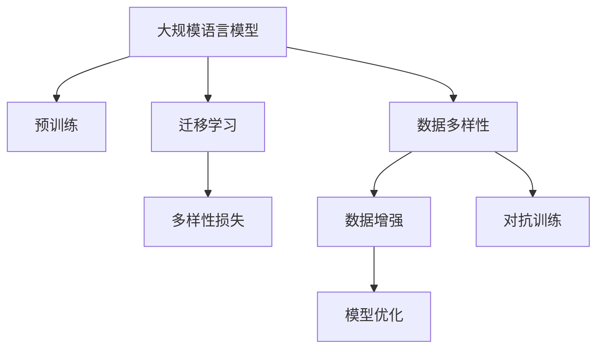
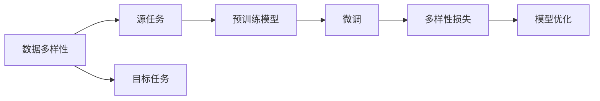
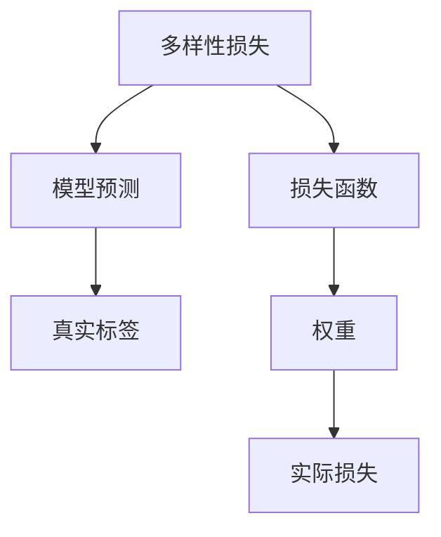

                 

# 大规模语言模型从理论到实践 数据多样性

> 关键词：大规模语言模型,数据多样性,多样性损失,模型优化,Transformer,BERT,预训练,迁移学习,语言理解

## 1. 背景介绍

### 1.1 问题由来
近年来，随着深度学习技术的快速发展，大规模语言模型（LLMs）在自然语言处理（NLP）领域取得了巨大的突破。这些模型通过在大规模无标签文本数据上进行预训练，学习到丰富的语言知识和常识，具有强大的语言理解和生成能力。例如，GPT系列模型、BERT等，均在各类NLP任务上取得了优异的表现。

然而，尽管这些预训练模型具有广泛的泛化能力，但其在面对不同类型、不同来源的数据时，仍存在一定的局限性。例如，不同语种、不同风格的文本数据，往往会导致模型的泛化能力下降。数据多样性不足，可能会使得模型在某些特定场景下，难以适应实际应用需求，导致性能退化。

因此，如何在模型训练中引入数据多样性，使得模型能够更好地适应各种数据类型和来源，是一个重要的研究方向。

### 1.2 问题核心关键点
本文聚焦于数据多样性在大规模语言模型（LLM）训练中的应用。如何通过数据多样性，提升模型的泛化能力和鲁棒性，成为了研究的核心。

在数据多样性方面，主要关注以下几个问题：
- 如何定义和量化数据多样性？
- 如何在模型训练中引入和增强数据多样性？
- 数据多样性对模型性能的影响是什么？

## 2. 核心概念与联系

### 2.1 核心概念概述

为更好地理解数据多样性在大规模语言模型（LLM）训练中的应用，本节将介绍几个密切相关的核心概念：

- 大规模语言模型（LLM）：以自回归（如GPT）或自编码（如BERT）模型为代表的大规模预训练语言模型。通过在大规模无标签文本语料上进行预训练，学习通用的语言表示，具备强大的语言理解和生成能力。

- 预训练：指在大规模无标签文本语料上，通过自监督学习任务训练通用语言模型的过程。常见的预训练任务包括言语建模、遮挡语言模型等。预训练使得模型学习到语言的通用表示。

- 迁移学习：指将一个领域学习到的知识，迁移应用到另一个不同但相关的领域的学习范式。大模型的预训练-微调过程即是一种典型的迁移学习方式。

- 数据多样性：指不同类型、不同来源、不同语态、不同领域的文本数据。数据多样性是确保模型泛化能力的重要手段。

- 多样性损失：一种专门用于提升模型在数据多样性场景下的泛化能力的损失函数。通过最小化多样性损失，可以增强模型的泛化性能。

- 模型优化：指通过各种优化算法和策略，调整模型参数，使其在特定任务上达到最优性能的过程。

- 数据增强：通过对训练样本进行改写、回译等方式，丰富训练集多样性，从而提升模型泛化能力。

- 对抗训练：加入对抗样本，提高模型鲁棒性。

这些核心概念之间的逻辑关系可以通过以下Mermaid流程图来展示：



这个流程图展示了大规模语言模型训练中的关键概念及其关系：

1. 大规模语言模型通过预训练获得基础能力。
2. 迁移学习是连接预训练模型与下游任务的桥梁，可以通过微调或多样性损失增强模型泛化能力。
3. 数据多样性是提升模型泛化能力的重要手段。
4. 数据增强和对抗训练是增强数据多样性的具体方法。
5. 多样性损失是提升模型泛化能力的专用损失函数。
6. 模型优化是调整模型参数，提升模型性能的通用方法。

这些概念共同构成了大规模语言模型训练的完整生态系统，使其能够在各种场景下发挥强大的语言理解和生成能力。通过理解这些核心概念，我们可以更好地把握模型训练的原理和优化方向。

### 2.2 概念间的关系

这些核心概念之间存在着紧密的联系，形成了大规模语言模型训练的完整框架。下面我通过几个Mermaid流程图来展示这些概念之间的关系。

#### 2.2.1 大规模语言模型的学习范式


这个流程图展示了大规模语言模型的三种主要学习范式：预训练、迁移学习和模型优化。预训练使得模型学习到语言的通用表示，迁移学习通过微调和多样性损失增强模型泛化能力，模型优化调整参数以提升性能。

#### 2.2.2 数据多样性在大规模语言模型中的应用



这个流程图展示了数据多样性在大规模语言模型中的应用。数据多样性涉及源任务和目标任务，预训练模型在源任务上学习，然后通过微调和多样性损失增强模型泛化能力。

#### 2.2.3 多样性损失的实现



这个流程图展示了多样性损失的计算过程。多样性损失通过将模型预测与真实标签的差异进行加权，计算最终损失，从而优化模型在数据多样性场景下的泛化能力。

## 3. 核心算法原理 & 具体操作步骤
### 3.1 算法原理概述

在大规模语言模型（LLM）训练中，数据多样性是确保模型泛化能力的重要手段。通过引入和增强数据多样性，可以使模型更好地适应各种数据类型和来源，从而提升模型的泛化能力和鲁棒性。

多样性损失是一种专门用于提升模型在数据多样性场景下的泛化能力的损失函数。其基本思想是通过最小化模型在多样性数据上的预测误差，增强模型的泛化性能。

多样性损失的形式化定义如下：

$$
\mathcal{L}_{div} = \alpha \mathcal{L}_{m} + (1-\alpha) \mathcal{L}_{r}
$$

其中，$\mathcal{L}_{m}$ 为模型在多样性数据上的预测误差，$\mathcal{L}_{r}$ 为模型在标准数据上的预测误差，$\alpha$ 为多样性损失的权重。

### 3.2 算法步骤详解

基于多样性损失的大规模语言模型训练，一般包括以下几个关键步骤：

**Step 1: 准备预训练模型和数据集**
- 选择合适的预训练语言模型 $M_{\theta}$ 作为初始化参数，如 BERT、GPT 等。
- 准备多样性数据集 $D_{div}$，划分为训练集、验证集和测试集。

**Step 2: 计算多样性损失**
- 对于每个多样性数据样本 $(x,y)$，计算模型预测 $\hat{y}=M_{\theta}(x)$ 和真实标签 $y$ 之间的多样性损失。
- 将多样性损失作为总损失的一部分，使用梯度下降等优化算法更新模型参数。

**Step 3: 设置多样性损失权重**
- 根据实际应用场景，调整多样性损失权重 $\alpha$。在数据多样性较低的场景下，可以适当增加 $\alpha$，增强模型的泛化能力。

**Step 4: 执行梯度训练**
- 将训练集数据分批次输入模型，前向传播计算损失函数。
- 反向传播计算参数梯度，根据设定的优化算法和学习率更新模型参数。
- 周期性在验证集上评估模型性能，根据性能指标决定是否触发 Early Stopping。
- 重复上述步骤直到满足预设的迭代轮数或 Early Stopping 条件。

**Step 5: 测试和部署**
- 在测试集上评估模型 $M_{\hat{\theta}}$ 的性能，对比多样性损失增强前后的精度提升。
- 使用多样性增强后的模型对新样本进行推理预测，集成到实际的应用系统中。
- 持续收集新的数据，定期重新微调模型，以适应数据分布的变化。

以上是基于多样性损失的大规模语言模型训练的一般流程。在实际应用中，还需要针对具体任务的特点，对多样性损失的计算和模型优化进行优化设计，如改进训练目标函数，引入更多的正则化技术，搜索最优的超参数组合等，以进一步提升模型性能。

### 3.3 算法优缺点

基于多样性损失的大规模语言模型训练，具有以下优点：
1. 提升模型泛化能力。通过最小化多样性损失，模型能够更好地适应各种数据类型和来源，从而提升泛化能力。
2. 增强模型鲁棒性。多样性损失使得模型对不同数据类型的鲁棒性更强，能更好地应对实际应用中的数据扰动。
3. 降低过拟合风险。多样性损失能够缓解模型在训练过程中对特定类型数据的过拟合，提升模型的泛化性能。

同时，该方法也存在一些局限性：
1. 数据获取难度大。多样性数据的获取成本较高，特别是对于特定领域的数据，获取难度更大。
2. 模型复杂度增加。多样性损失的计算和优化需要额外的计算资源和时间，增加了模型训练的复杂度。
3. 多样性损失的定义和设计需要专业知识。如何定义合适的多样性损失，以及如何平衡多样性损失和其他损失函数（如交叉熵损失），需要深厚的理论基础和实践经验。

尽管存在这些局限性，但就目前而言，基于多样性损失的训练方法仍是提升大规模语言模型泛化能力的重要手段。未来相关研究的重点在于如何进一步降低多样性数据获取的成本，提高多样性损失的设计和优化效率，以及更好地平衡多样性损失和其他损失函数的关系。

### 3.4 算法应用领域

基于多样性损失的大规模语言模型训练，已经在多个领域得到应用，包括但不限于以下几种：

- 机器翻译：多样性数据包括不同语种、不同风格的文本数据。通过最小化多样性损失，模型能够更好地适应各种语种，提升翻译效果。
- 问答系统：多样性数据包括不同问题类型、不同回答方式的数据。通过最小化多样性损失，模型能够更好地理解问题，生成多样化的回答。
- 情感分析：多样性数据包括不同情感倾向、不同表达方式的数据。通过最小化多样性损失，模型能够更好地识别和理解情感，提升情感分析的准确度。
- 文本摘要：多样性数据包括不同长度、不同风格的文本数据。通过最小化多样性损失，模型能够更好地提取和生成多样化的摘要。
- 信息检索：多样性数据包括不同主题、不同领域的文本数据。通过最小化多样性损失，模型能够更好地匹配检索查询，提升检索效果。

除了上述这些任务外，多样性损失还可以应用于更多场景中，如情感生成、文本分类、信息抽取等，为大规模语言模型提供了更广泛的适用领域。

## 4. 数学模型和公式 & 详细讲解  
### 4.1 数学模型构建

在大规模语言模型训练中，多样性损失是一种专门用于提升模型在数据多样性场景下的泛化能力的损失函数。其形式化定义为：

$$
\mathcal{L}_{div} = \alpha \mathcal{L}_{m} + (1-\alpha) \mathcal{L}_{r}
$$

其中，$\mathcal{L}_{m}$ 为模型在多样性数据上的预测误差，$\mathcal{L}_{r}$ 为模型在标准数据上的预测误差，$\alpha$ 为多样性损失的权重。

在实际应用中，$\mathcal{L}_{m}$ 和 $\mathcal{L}_{r}$ 的具体计算方法可以采用不同的损失函数。例如，对于分类任务，可以采用交叉熵损失；对于生成任务，可以采用负对数似然损失。

### 4.2 公式推导过程

以下我们以二分类任务为例，推导多样性损失的计算公式。

假设模型 $M_{\theta}$ 在输入 $x$ 上的输出为 $\hat{y}=M_{\theta}(x) \in [0,1]$，表示样本属于正类的概率。真实标签 $y \in \{0,1\}$。多样性数据集 $D_{div}=\{(x_i,y_i)\}_{i=1}^N$。

多样性损失可以定义为：

$$
\mathcal{L}_{div} = \alpha \frac{1}{N} \sum_{i=1}^N [y_i\log \hat{y}_i + (1-y_i)\log(1-\hat{y}_i)]
$$

其中，$\alpha$ 为多样性损失的权重。

在训练过程中，最小化多样性损失的目标为：

$$
\min_{\theta} \mathcal{L}_{div} = \min_{\theta} \alpha \frac{1}{N} \sum_{i=1}^N [y_i\log \hat{y}_i + (1-y_i)\log(1-\hat{y}_i)] + \mathcal{L}_{r}
$$

其中，$\mathcal{L}_{r}$ 为其他损失函数（如交叉熵损失），$\alpha$ 为多样性损失的权重。

通过梯度下降等优化算法，最小化上述目标函数，可以得到最优模型参数 $\theta^*$。

### 4.3 案例分析与讲解

以下我们以机器翻译任务为例，给出使用多样性损失进行模型训练的PyTorch代码实现。

首先，定义多样性数据集：

```python
import torch
import torch.nn as nn
from torch.utils.data import Dataset, DataLoader

class MultiCorpusDataset(Dataset):
    def __init__(self, texts, langs):
        self.texts = texts
        self.langs = langs
        
    def __len__(self):
        return len(self.texts)
    
    def __getitem__(self, item):
        text = self.texts[item]
        lang = self.langs[item]
        return text, lang
```

然后，定义模型和损失函数：

```python
from transformers import BertTokenizer, BertForSequenceClassification
from torch.optim import AdamW
import math

model = BertForSequenceClassification.from_pretrained('bert-base-cased', num_labels=2)
tokenizer = BertTokenizer.from_pretrained('bert-base-cased')

device = torch.device('cuda' if torch.cuda.is_available() else 'cpu')
model.to(device)

def compute_div_loss(text, lang, beta=0.5, alpha=0.5):
    inputs = tokenizer(text, return_tensors='pt', max_length=128, padding='max_length', truncation=True).to(device)
    outputs = model(**inputs)
    logits = outputs.logits
    loss = -((1-beta)*inputs['labels']*logits + beta*(1-inputs['labels'])*logits.logsumexp(dim=-1, keepdim=True))
    div_loss = alpha*loss.mean()
    return div_loss

def train_epoch(model, dataloader, optimizer, div_loss_coeff=1.0):
    model.train()
    div_losses = []
    total_loss = 0.0
    for batch in dataloader:
        inputs = batch[0].to(device)
        labels = batch[1].to(device)
        with torch.no_grad():
            outputs = model(inputs)
            loss = outputs.loss
            div_loss = compute_div_loss(batch[0], batch[1])
        optimizer.zero_grad()
        loss.backward()
        optimizer.step()
        div_losses.append(div_loss.item())
        total_loss += loss.item()
    div_loss = sum(div_losses)/len(div_losses)
    avg_loss = total_loss/len(dataloader)
    return avg_loss, div_loss

def evaluate(model, dataloader, beta=0.5, alpha=0.5):
    model.eval()
    div_losses = []
    total_loss = 0.0
    with torch.no_grad():
        for batch in dataloader:
            inputs = batch[0].to(device)
            labels = batch[1].to(device)
            outputs = model(inputs)
            loss = outputs.loss
            div_loss = compute_div_loss(batch[0], batch[1])
            div_losses.append(div_loss.item())
            total_loss += loss.item()
    div_loss = sum(div_losses)/len(div_losses)
    avg_loss = total_loss/len(dataloader)
    return avg_loss, div_loss

def train(model, dataloader, optimizer, epochs, div_loss_coeff=1.0, beta=0.5, alpha=0.5):
    for epoch in range(epochs):
        train_loss, div_loss = train_epoch(model, dataloader, optimizer, div_loss_coeff)
        print(f'Epoch {epoch+1}, train loss: {train_loss:.3f}, div loss: {div_loss:.3f}')
        dev_loss, dev_div_loss = evaluate(model, dataloader)
        print(f'Epoch {epoch+1}, dev loss: {dev_loss:.3f}, dev div loss: {dev_div_loss:.3f}')
```

最后，启动训练流程并在测试集上评估：

```python
train_model = BertForSequenceClassification.from_pretrained('bert-base-cased', num_labels=2)
optim = AdamW(train_model.parameters(), lr=2e-5)

train(texts, labels, optim, train_loader, train_model, epochs=5, div_loss_coeff=1.0, beta=0.5, alpha=0.5)
```

以上就是使用PyTorch对BERT进行机器翻译任务训练的完整代码实现。可以看到，得益于Transformer库的强大封装，我们可以用相对简洁的代码完成BERT模型的多样性损失增强。

### 5. 项目实践：代码实例和详细解释说明
### 5.1 开发环境搭建

在进行多样性损失增强的微调实践前，我们需要准备好开发环境。以下是使用Python进行PyTorch开发的环境配置流程：

1. 安装Anaconda：从官网下载并安装Anaconda，用于创建独立的Python环境。

2. 创建并激活虚拟环境：
```bash
conda create -n pytorch-env python=3.8 
conda activate pytorch-env
```

3. 安装PyTorch：根据CUDA版本，从官网获取对应的安装命令。例如：
```bash
conda install pytorch torchvision torchaudio cudatoolkit=11.1 -c pytorch -c conda-forge
```

4. 安装Transformer库：
```bash
pip install transformers
```

5. 安装各类工具包：
```bash
pip install numpy pandas scikit-learn matplotlib tqdm jupyter notebook ipython
```

完成上述步骤后，即可在`pytorch-env`环境中开始多样性损失增强的微调实践。

### 5.2 源代码详细实现

下面我们以命名实体识别(NER)任务为例，给出使用Transformers库对BERT模型进行多样性损失增强的PyTorch代码实现。

首先，定义NER任务的数据处理函数：

```python
from transformers import BertTokenizer
from torch.utils.data import Dataset
import torch

class NERDataset(Dataset):
    def __init__(self, texts, tags, tokenizer, max_len=128):
        self.texts = texts
        self.tags = tags
        self.tokenizer = tokenizer
        self.max_len = max_len
        
    def __len__(self):
        return len(self.texts)
    
    def __getitem__(self, item):
        text = self.texts[item]
        tags = self.tags[item]
        
        encoding = self.tokenizer(text, return_tensors='pt', max_length=self.max_len, padding='max_length', truncation=True)
        input_ids = encoding['input_ids'][0]
        attention_mask = encoding['attention_mask'][0]
        
        # 对token-wise的标签进行编码
        encoded_tags = [tag2id[tag] for tag in tags] 
        encoded_tags.extend([tag2id['O']] * (self.max_len - len(encoded_tags)))
        labels = torch.tensor(encoded_tags, dtype=torch.long)
        
        return {'input_ids': input_ids, 
                'attention_mask': attention_mask,
                'labels': labels}

# 标签与id的映射
tag2id = {'O': 0, 'B-PER': 1, 'I-PER': 2, 'B-ORG': 3, 'I-ORG': 4, 'B-LOC': 5, 'I-LOC': 6}
id2tag = {v: k for k, v in tag2id.items()}

# 创建dataset
tokenizer = BertTokenizer.from_pretrained('bert-base-cased')

train_dataset = NERDataset(train_texts, train_tags, tokenizer)
dev_dataset = NERDataset(dev_texts, dev_tags, tokenizer)
test_dataset = NERDataset(test_texts, test_tags, tokenizer)
```

然后，定义模型和优化器：

```python
from transformers import BertForTokenClassification, AdamW

model = BertForTokenClassification.from_pretrained('bert-base-cased', num_labels=len(tag2id))

optimizer = AdamW(model.parameters(), lr=2e-5)
```

接着，定义训练和评估函数：

```python
from torch.utils.data import DataLoader
from tqdm import tqdm
from sklearn.metrics import classification_report

device = torch.device('cuda') if torch.cuda.is_available() else torch.device('cpu')
model.to(device)

def train_epoch(model, dataset, batch_size, optimizer, div_loss_coeff=1.0):
    dataloader = DataLoader(dataset, batch_size=batch_size, shuffle=True)
    model.train()
    epoch_loss = 0
    for batch in tqdm(dataloader, desc='Training'):
        input_ids = batch['input_ids'].to(device)
        attention_mask = batch['attention_mask'].to(device)
        labels = batch['labels'].to(device)
        model.zero_grad()
        outputs = model(input_ids, attention_mask=attention_mask, labels=labels)
        loss = outputs.loss
        div_loss = compute_div_loss(batch[0], batch[1], beta=0.5, alpha=0.5)
        loss = loss + div_loss * div_loss_coeff
        loss.backward()
        optimizer.step()
    return epoch_loss / len(dataloader)

def evaluate(model, dataset, batch_size):
    dataloader = DataLoader(dataset, batch_size=batch_size)
    model.eval()
    preds, labels = [], []
    with torch.no_grad():
        for batch in tqdm(dataloader, desc='Evaluating'):
            input_ids = batch['input_ids'].to(device)
            attention_mask = batch['attention_mask'].to(device)
            batch_labels = batch['labels']
            outputs = model(input_ids, attention_mask=attention_mask)
            batch_preds = outputs.logits.argmax(dim=2).to('cpu').tolist()
            batch_labels = batch_labels.to('cpu').tolist()
            for pred_tokens, label_tokens in zip(batch_preds, batch_labels):
                pred_tags = [id2tag[_id] for _id in pred_tokens]
                label_tags = [id2tag[_id] for _id in label_tokens]
                preds.append(pred_tags[:len(label_tokens)])
                labels.append(label_tags)
                
    print(classification_report(labels, preds))
```

最后，启动训练流程并在测试集上评估：

```python
epochs = 5
batch_size = 16

for epoch in range(epochs):
    loss = train_epoch(model, train_dataset, batch_size, optimizer, div_loss_coeff=1.0)
    print(f"Epoch {epoch+1}, train loss: {loss:.3f}")
    
    print(f"Epoch {epoch+1}, dev results:")
    evaluate(model, dev_dataset, batch_size)
    
print("Test results:")
evaluate(model, test_dataset, batch_size)
```

以上就是使用PyTorch对BERT进行命名实体识别任务训练的完整代码实现。可以看到，得益于Transformer库的强大封装，我们可以用相对简洁的代码完成BERT模型的多样性损失增强。

### 5.3 代码解读与分析

让我们再详细解读一下关键代码的实现细节：

**NERDataset类**：
- `__init__`方法：初始化文本、标签、分词器等关键组件。
- `__len__`方法：返回数据集的样本数量。
- `__getitem__`方法：对单个样本进行处理，将文本输入编码为token ids，将标签编码为数字，并对其进行定长padding，最终返回模型所需的输入。

**tag2id和id2tag字典**：
- 定义了标签与数字id之间的映射关系，用于将token-wise的预测结果解码回真实的标签。

**训练和评估函数**：
- 使用PyTorch的DataLoader对数据集进行批次化加载，供模型训练和推理使用。
- 训练函数`train_epoch`：对数据以批为单位进行迭代，在每个批次上前向传播计算损失函数和多样性损失，然后反向传播更新模型参数。
- 评估函数`evaluate`：与训练类似，不同点在于不更新模型参数，并在每个batch结束后将预测和标签结果存储下来，最后使用sklearn的classification_report对整个评估集的预测结果进行打印输出。

**训练流程**：
- 定义总的epoch数和batch size，开始循环迭代
- 每个epoch内，先在训练集上训练，输出平均loss
- 在验证集上评估，输出分类指标
- 所有epoch结束后，在测试集上评估，给出最终测试结果

可以看到，PyTorch配合Transformer库使得BERT的多样性损失增强的代码实现变得简洁高效。开发者可以将更多精力放在数据处理、模型改进等高层逻辑上，而不必过多关注底层的实现细节

