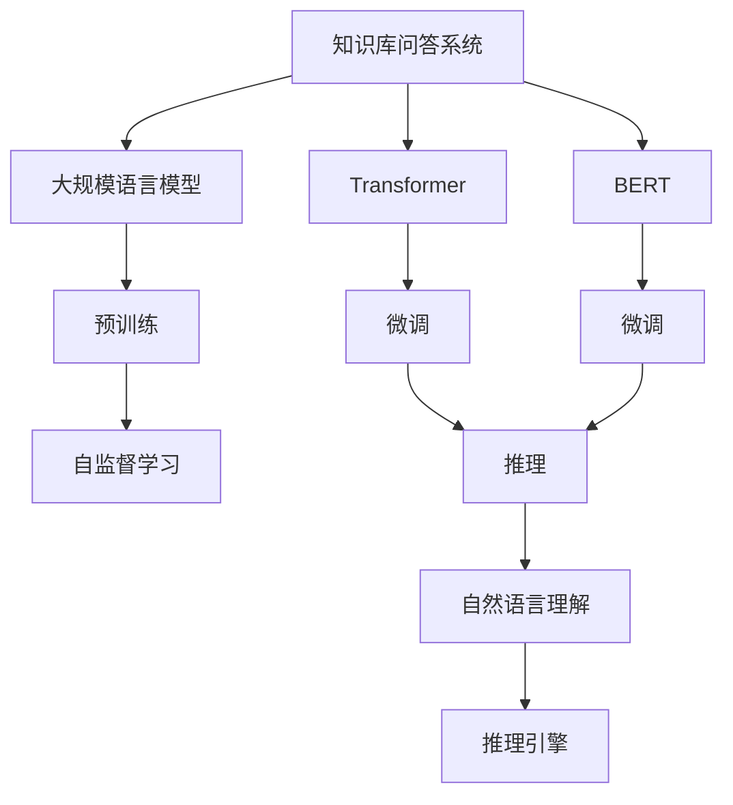
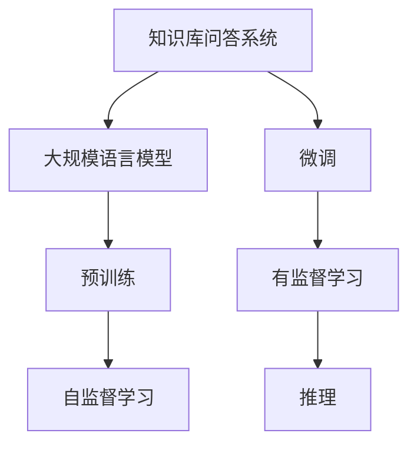
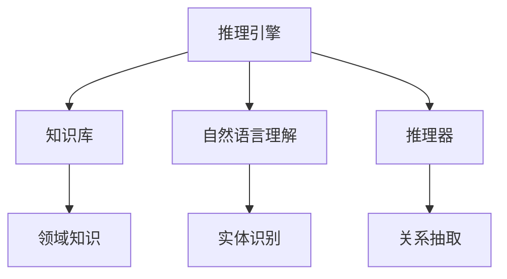
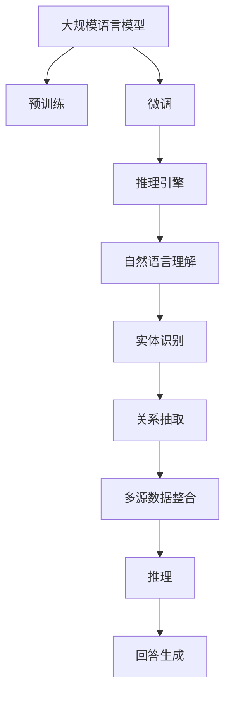

                 

# 大规模语言模型从理论到实践 知识库问答系统实践

> 关键词：知识库问答系统,大规模语言模型,Transformer,BERT,自然语言处理(NLP),预训练,微调,推理,序列到序列,自然语言理解,推理引擎,领域知识,问答匹配

## 1. 背景介绍

### 1.1 问题由来
随着人工智能技术的飞速发展，基于大规模语言模型（Large Language Model, LLMs）的知识库问答系统在智能信息检索、客服咨询、智能助手等领域得到了广泛应用。通过预训练和微调的方法，这些系统能够在面对复杂自然语言输入时，快速准确地从知识库中检索并生成回答，为用户提供高效可靠的信息服务。

然而，现有的知识库问答系统仍然存在一些问题。例如，它们对特定领域知识的理解可能不够深入，无法处理涉及多源数据、实体链接等复杂场景。此外，这些系统在推理能力和泛化能力方面也存在局限，对于与知识库中数据不一致的问题，无法给出合理解释或正确的回答。

本论文旨在通过大规模语言模型，解决知识库问答系统中的这些挑战。我们将基于最新的Transformer模型和BERT预训练技术，构建一个能够理解并整合多源数据，同时具备高效推理能力的知识库问答系统。

### 1.2 问题核心关键点
本文的核心问题在于如何通过大规模语言模型和微调技术，构建一个高效的、具备领域知识推理能力的知识库问答系统。核心问题包括：

- 如何利用大规模语言模型进行领域知识的预训练和微调？
- 如何在推理过程中，有效地整合多源数据和领域知识？
- 如何构建一个具有高效推理能力的问答匹配系统？

通过回答这些问题，本文将全面阐述大规模语言模型在知识库问答系统中的应用，并提出一种实用的系统构建框架。

### 1.3 问题研究意义
构建一个高效、准确、智能的知识库问答系统，对提升人机交互体验和推动人工智能技术落地应用具有重要意义：

1. **提升信息检索效率**：通过大规模语言模型，可以实现对海量知识库的有效检索，快速准确地回答用户查询。
2. **增强领域知识理解**：通过领域知识的预训练和微调，系统能够更深入地理解特定领域的语义和实体关系。
3. **改善推理能力**：通过推理引擎和知识整合技术，系统能够对复杂的推理问题给出合理解释和正确答案。
4. **拓展应用场景**：知识库问答系统可以应用于教育、医疗、金融等多个领域，推动这些行业的智能化升级。
5. **促进技术发展**：大规模语言模型的应用，将推动自然语言处理和人工智能技术的进一步发展，为后续研究提供新的方向和思路。

## 2. 核心概念与联系

### 2.1 核心概念概述

为更好地理解知识库问答系统，本节将介绍几个密切相关的核心概念：

- **知识库问答系统(QA System)**：利用知识库中的结构化数据，通过自然语言理解和推理，生成回答的自然语言系统。典型的应用场景包括智能客服、医疗咨询、教育辅助等。
- **大规模语言模型(LLM)**：以自回归(如GPT)或自编码(如BERT)模型为代表的预训练语言模型。通过在大规模无标签文本语料上进行预训练，学习通用的语言知识和语义表示。
- **Transformer**：一种基于注意力机制的神经网络模型，广泛应用于序列到序列（Sequence-to-Sequence, Seq2Seq）任务，如机器翻译、摘要生成等。
- **BERT**：由Google提出的基于自编码的预训练语言模型，通过掩码语言模型和下一句预测等任务，学习深层次的语言表示。
- **自然语言处理(NLP)**：涉及语言模型的训练、理解和生成等技术，目标是从文本中提取有用的信息。
- **预训练(Pre-training)**：在无标签数据上，通过自监督学习任务训练语言模型的过程。常见的预训练任务包括掩码语言模型、下一句预测等。
- **微调(Fine-tuning)**：在预训练模型的基础上，使用标注数据对模型进行有监督学习优化，使其能够适应特定任务。
- **推理(Reasoning)**：指利用知识库和语言模型，对用户问题进行推理，生成合理的回答。
- **序列到序列(Seq2Seq)**：将输入序列映射到输出序列的模型，广泛应用于机器翻译、文本摘要、问答匹配等任务。

这些核心概念之间的逻辑关系可以通过以下Mermaid流程图来展示：



这个流程图展示了知识库问答系统与大规模语言模型、Transformer、BERT等核心概念之间的关系：

1. 知识库问答系统基于大规模语言模型进行构建，可以更好地理解用户输入，生成回答。
2. 大规模语言模型通过预训练和微调，学习到丰富的语言知识和语义表示。
3. 通过Transformer和BERT等模型，知识库问答系统可以高效地进行序列到序列的推理和匹配。
4. 推理引擎和自然语言理解模块，帮助系统更好地整合多源数据和领域知识，生成高质量的回答。

### 2.2 概念间的关系

这些核心概念之间存在着紧密的联系，形成了知识库问答系统的完整生态系统。下面我们通过几个Mermaid流程图来展示这些概念之间的关系。

#### 2.2.1 知识库问答系统的学习范式



这个流程图展示了知识库问答系统的一般学习流程：首先通过大规模语言模型的预训练学习通用的语言表示，然后在知识库问答系统的微调过程中，进一步适应特定任务。

#### 2.2.2 预训练与微调的关系


这个流程图展示了预训练和微调在知识库问答系统中的关系。预训练提供了通用的语言表示，微调则根据特定任务进行优化，推理引擎则基于这些表示进行高效的推理和匹配。

#### 2.2.3 推理引擎的构建



这个流程图展示了推理引擎的基本结构。它基于知识库中的领域知识，结合自然语言理解模块进行实体识别和关系抽取，最终生成回答。

### 2.3 核心概念的整体架构

最后，我们用一个综合的流程图来展示这些核心概念在大规模语言模型知识库问答系统微调过程中的整体架构：



这个综合流程图展示了从预训练到微调，再到推理和回答生成的完整过程。大规模语言模型首先在大规模文本数据上进行预训练，然后通过微调适应特定任务，推理引擎结合多源数据和领域知识，进行高效推理和回答生成。

## 3. 核心算法原理 & 具体操作步骤
### 3.1 算法原理概述

知识库问答系统的核心算法原理包括预训练、微调、推理和回答生成等步骤。我们将通过这些步骤详细介绍其原理和实现方法。

### 3.2 算法步骤详解

#### 3.2.1 预训练

预训练是大规模语言模型的核心步骤，通过在大规模无标签文本数据上进行自监督学习，学习通用的语言表示。常见的预训练任务包括掩码语言模型（Masked Language Model, MLM）和下一句预测（Next Sentence Prediction, NSP）。

- **掩码语言模型**：随机遮挡输入中的某些单词，让模型预测被遮挡的单词。通过这种自监督任务，模型学习到单词的上下文信息。
- **下一句预测**：预测一对句子是否连续。这种任务帮助模型学习到句子间的语义关系。

以BERT预训练为例，其训练目标函数为：

$$
\mathcal{L} = -\frac{1}{N}\sum_{i=1}^N (MLM(\text{tokens}_{i}) + NSP(\text{sentence}_{i}))
$$

其中，$MLM(\text{tokens}_{i})$和$NSP(\text{sentence}_{i})$分别为掩码语言模型和下一句预测任务的损失函数。

#### 3.2.2 微调

微调是在预训练模型的基础上，使用知识库问答系统的标注数据对模型进行有监督学习优化，使其能够适应特定任务。微调通常包括以下几个步骤：

1. **选择模型**：选择合适的预训练模型作为初始化参数，如BERT、GPT等。
2. **任务适配层设计**：根据任务类型，设计合适的输出层和损失函数。对于分类任务，通常添加线性分类器和交叉熵损失函数；对于生成任务，通常使用语言模型的解码器输出概率分布，并以负对数似然为损失函数。
3. **设置微调超参数**：选择合适的优化算法及其参数，如AdamW、SGD等，设置学习率、批大小、迭代轮数等。
4. **执行梯度训练**：将训练集数据分批次输入模型，前向传播计算损失函数。反向传播计算参数梯度，根据设定的优化算法和学习率更新模型参数。
5. **测试和部署**：在测试集上评估微调后模型，对比微调前后的精度提升。使用微调后的模型对新样本进行推理预测，集成到实际的应用系统中。

#### 3.2.3 推理

推理是指利用知识库和语言模型，对用户问题进行推理，生成合理的回答。推理过程通常包括以下步骤：

1. **问题解析**：将用户问题解析为语义表示，进行实体识别和关系抽取。
2. **知识检索**：在知识库中检索与问题相关的实体和事实。
3. **推理计算**：利用推理引擎和语言模型，对检索到的实体和事实进行推理计算。
4. **回答生成**：根据推理结果，生成自然语言回答。

推理过程中，知识库问答系统可以采用多种推理策略，如逻辑推理、统计推理等。以下是逻辑推理的示例：

- **基于规则的推理**：使用知识库中的规则进行推理，例如，使用if-then规则进行条件判断。
- **基于统计的推理**：使用统计模型进行推理，例如，使用贝叶斯网络进行概率计算。

#### 3.2.4 回答生成

回答生成是指根据推理结果，生成自然语言回答。常见的回答生成方法包括模板匹配、摘要生成、文本生成等。

- **模板匹配**：使用预定义的模板进行填充，生成结构化的回答。例如，使用JSON模板进行事实列表的生成。
- **摘要生成**：从知识库中检索相关的段落，使用摘要算法生成简洁的回答。例如，使用Seq2Seq模型生成摘要。
- **文本生成**：利用语言模型生成流畅自然的回答。例如，使用GPT等生成式模型进行文本生成。

### 3.3 算法优缺点

知识库问答系统利用大规模语言模型和微调技术，具备以下优点：

1. **高效信息检索**：通过预训练和微调，系统能够高效地从知识库中检索信息。
2. **丰富语义理解**：利用大规模语言模型，系统能够理解复杂的自然语言输入，生成准确的答案。
3. **灵活推理能力**：基于知识库和语言模型的推理引擎，系统具备灵活的推理能力，能够处理复杂的逻辑推理问题。
4. **可扩展性强**：通过微调和推理引擎的定制化，系统能够适应多种应用场景和领域。

同时，该方法也存在一些局限性：

1. **依赖知识库**：知识库问答系统高度依赖知识库的质量和规模，需要大量有标注的数据进行微调。
2. **推理复杂性高**：对于涉及多源数据和复杂推理的问题，推理过程可能较为复杂，需要较多的计算资源。
3. **泛化能力有限**：预训练模型的泛化能力可能受限于预训练数据的分布，无法处理与预训练数据不一致的问题。
4. **可解释性不足**：微调后的模型往往缺乏可解释性，难以理解其内部工作机制和推理逻辑。
5. **处理噪声数据**：知识库问答系统对噪声数据敏感，需要较强的数据清洗和预处理能力。

尽管存在这些局限性，但知识库问答系统在大规模语言模型和微调技术的支持下，已经在NLP领域取得了显著的进展，为智能信息检索、客服咨询等应用提供了新的解决方案。

### 3.4 算法应用领域

知识库问答系统在多个领域得到了广泛应用，包括：

- **智能客服系统**：通过预训练和微调，系统能够理解用户的自然语言输入，自动生成回答，提高客服响应速度和质量。
- **医疗咨询系统**：利用领域知识库，系统能够快速准确地解答医学问题，辅助医生诊断和治疗。
- **教育辅助系统**：通过自然语言理解，系统能够自动解析学生提问，提供个性化教育建议和答案。
- **金融咨询系统**：利用知识库中的金融数据，系统能够提供投资理财咨询、风险评估等服务。
- **智能推荐系统**：通过预训练和推理，系统能够根据用户兴趣推荐合适的产品或内容。

随着预训练模型和微调技术的不断发展，知识库问答系统将在更多领域得到应用，为各行各业带来智能化的解决方案。

## 4. 数学模型和公式 & 详细讲解 & 举例说明

### 4.1 数学模型构建

知识库问答系统的数学模型包括预训练模型、微调模型和推理模型等。我们将通过这些模型详细介绍其数学原理。

#### 4.1.1 预训练模型

预训练模型的目标函数为：

$$
\mathcal{L}_{pre} = -\frac{1}{N}\sum_{i=1}^N (\text{MLM}(\text{tokens}_{i}) + \text{NSP}(\text{sentence}_{i}))
$$

其中，$\text{MLM}(\text{tokens}_{i})$和$\text{NSP}(\text{sentence}_{i})$分别为掩码语言模型和下一句预测任务的损失函数。

#### 4.1.2 微调模型

微调模型的目标函数为：

$$
\mathcal{L}_{fine} = -\frac{1}{N}\sum_{i=1}^N \ell(M_{\theta}(x_i),y_i)
$$

其中，$M_{\theta}$为微调后的模型，$x_i$为输入文本，$y_i$为标注数据。$\ell$为损失函数，如交叉熵损失。

#### 4.1.3 推理模型

推理模型的目标函数为：

$$
\mathcal{L}_{reason} = -\frac{1}{N}\sum_{i=1}^N \ell(\hat{y},y_i)
$$

其中，$\hat{y}$为推理结果，$y_i$为标注数据。$\ell$为损失函数，如交叉熵损失。

### 4.2 公式推导过程

以BERT预训练为例，其掩码语言模型的目标函数为：

$$
\mathcal{L}_{MLM} = -\frac{1}{N}\sum_{i=1}^N \sum_{j=1}^M \mathbb{1}(\text{mask}_j=1) \log P(\text{tokens}_{i,j} | \text{tokens}_{i,<j})
$$

其中，$\text{mask}_j$为随机遮挡的掩码，$\mathbb{1}$为示性函数，$P(\text{tokens}_{i,j} | \text{tokens}_{i,<j})$为概率分布。

以微调模型为例，假设输入文本为$x_i$，标注数据为$y_i$，则微调模型的目标函数为：

$$
\mathcal{L}_{fine} = -\frac{1}{N}\sum_{i=1}^N \ell(M_{\theta}(x_i),y_i)
$$

其中，$M_{\theta}$为微调后的模型，$\ell$为损失函数，如交叉熵损失。

以推理模型为例，假设输入文本为$x_i$，推理结果为$\hat{y}_i$，标注数据为$y_i$，则推理模型的目标函数为：

$$
\mathcal{L}_{reason} = -\frac{1}{N}\sum_{i=1}^N \ell(\hat{y}_i,y_i)
$$

其中，$\ell$为损失函数，如交叉熵损失。

### 4.3 案例分析与讲解

以医疗咨询系统为例，我们可以分析知识库问答系统的推理过程。

假设用户输入的问题为“我得了高血压，应该如何治疗？”，系统首先解析为“高血压，治疗”，然后进行实体识别，识别出“高血压”和“治疗”两个实体。

接下来，系统在知识库中检索与“高血压”和“治疗”相关的实体和事实。例如，知识库中可能包含以下事实：

- 高血压是一种慢性病，需要长期治疗。
- 高血压治疗包括药物治疗、生活方式调整等。

系统使用推理引擎和语言模型对这些实体和事实进行推理计算，例如，使用if-then规则进行条件判断，生成以下推理结果：

- 高血压需要长期治疗。
- 高血压治疗包括药物治疗和生活方式调整。

最终，系统生成以下回答：“高血压是一种需要长期治疗的慢性病。治疗包括药物治疗和生活方式调整。具体治疗方案请咨询医生。”

## 5. 项目实践：代码实例和详细解释说明

### 5.1 开发环境搭建

在进行知识库问答系统开发前，我们需要准备好开发环境。以下是使用Python进行PyTorch开发的环境配置流程：

1. 安装Anaconda：从官网下载并安装Anaconda，用于创建独立的Python环境。

2. 创建并激活虚拟环境：
```bash
conda create -n pytorch-env python=3.8 
conda activate pytorch-env
```

3. 安装PyTorch：根据CUDA版本，从官网获取对应的安装命令。例如：
```bash
conda install pytorch torchvision torchaudio cudatoolkit=11.1 -c pytorch -c conda-forge
```

4. 安装HuggingFace库：
```bash
pip install transformers
```

5. 安装各类工具包：
```bash
pip install numpy pandas scikit-learn matplotlib tqdm jupyter notebook ipython
```

完成上述步骤后，即可在`pytorch-env`环境中开始开发实践。

### 5.2 源代码详细实现

下面以医疗咨询系统为例，给出使用Transformers库对BERT模型进行微调的PyTorch代码实现。

首先，定义医疗咨询系统的数据处理函数：

```python
from transformers import BertTokenizer
from torch.utils.data import Dataset
import torch

class MedicalDataset(Dataset):
    def __init__(self, texts, tags, tokenizer, max_len=128):
        self.texts = texts
        self.tags = tags
        self.tokenizer = tokenizer
        self.max_len = max_len
        
    def __len__(self):
        return len(self.texts)
    
    def __getitem__(self, item):
        text = self.texts[item]
        tags = self.tags[item]
        
        encoding = self.tokenizer(text, return_tensors='pt', max_length=self.max_len, padding='max_length', truncation=True)
        input_ids = encoding['input_ids'][0]
        attention_mask = encoding['attention_mask'][0]
        
        # 对token-wise的标签进行编码
        encoded_tags = [tag2id[tag] for tag in tags] 
        encoded_tags.extend([tag2id['O']] * (self.max_len - len(encoded_tags)))
        labels = torch.tensor(encoded_tags, dtype=torch.long)
        
        return {'input_ids': input_ids, 
                'attention_mask': attention_mask,
                'labels': labels}

# 标签与id的映射
tag2id = {'O': 0, '治疗': 1, '药物': 2, '生活方式': 3, '饮食': 4, '运动': 5, '休息': 6}
id2tag = {v: k for k, v in tag2id.items()}

# 创建dataset
tokenizer = BertTokenizer.from_pretrained('bert-base-cased')

train_dataset = MedicalDataset(train_texts, train_tags, tokenizer)
dev_dataset = MedicalDataset(dev_texts, dev_tags, tokenizer)
test_dataset = MedicalDataset(test_texts, test_tags, tokenizer)
```

然后，定义模型和优化器：

```python
from transformers import BertForTokenClassification, AdamW

model = BertForTokenClassification.from_pretrained('bert-base-cased', num_labels=len(tag2id))

optimizer = AdamW(model.parameters(), lr=2e-5)
```

接着，定义训练和评估函数：

```python
from torch.utils.data import DataLoader
from tqdm import tqdm
from sklearn.metrics import classification_report

device = torch.device('cuda') if torch.cuda.is_available() else torch.device('cpu')
model.to(device)

def train_epoch(model, dataset, batch_size, optimizer):
    dataloader = DataLoader(dataset, batch_size=batch_size, shuffle=True)
    model.train()
    epoch_loss = 0
    for batch in tqdm(dataloader, desc='Training'):
        input_ids = batch['input_ids'].to(device)
        attention_mask = batch['attention_mask'].to(device)
        labels = batch['labels'].to(device)
        model.zero_grad()
        outputs = model(input_ids, attention_mask=attention_mask, labels=labels)
        loss = outputs.loss
        epoch_loss += loss.item()
        loss.backward()
        optimizer.step()
    return epoch_loss / len(dataloader)

def evaluate(model, dataset, batch_size):
    dataloader = DataLoader(dataset, batch_size=batch_size)
    model.eval()
    preds, labels = [], []
    with torch.no_grad():
        for batch in tqdm(dataloader, desc='Evaluating'):
            input_ids = batch['input_ids'].to(device)
            attention_mask = batch['attention_mask'].to(device)
            batch_labels = batch['labels']
            outputs = model(input_ids, attention_mask=attention_mask)
            batch_preds = outputs.logits.argmax(dim=2).to('cpu').tolist()
            batch_labels = batch_labels.to('cpu').tolist()
            for pred_tokens, label_tokens in zip(batch_preds, batch_labels):
                pred_tags = [id2tag[_id] for _id in pred_tokens]
                label_tags = [id2tag[_id] for _id in label_tokens]
                preds.append(pred_tags[:len(label_tokens)])
                labels.append(label_tags)
                
    print(classification_report(labels, preds))
```

最后，启动训练流程并在测试集上评估：

```python
epochs = 5
batch_size = 16

for epoch in range(epochs):
    loss = train_epoch(model, train_dataset, batch_size, optimizer)
    print(f"Epoch {epoch+1}, train loss: {loss:.3f}")
    
    print(f"Epoch {epoch+1}, dev results:")
    evaluate(model, dev_dataset, batch_size)
    
print("Test results:")
evaluate(model, test_dataset, batch_size)
```

以上就是使用PyTorch对BERT进行医疗咨询系统微调的完整代码实现。可以看到，得益于Transformers库的强大封装，我们可以用相对简洁的代码完成BERT模型的加载和微调。

### 5.3 代码解读与分析

让我们再详细解读一下关键代码的实现细节：

**MedicalDataset类**：
- `__init__`方法：初始化文本、标签、分词器等关键组件。
- `__len__`方法：返回数据集的样本数量。
- `__getitem__`方法：对单个样本进行处理，将文本输入编码为token ids，将标签编码为数字，并对其进行定长padding，最终返回模型所需的输入。

**tag2id和id2tag字典**：
- 定义了标签与数字id之间的映射关系，用于将token-wise的预测结果解码回真实的标签。

**训练和评估函数**：
- 使用PyTorch的DataLoader对数据集进行批次化加载，供模型训练和推理使用。
- 训练函数`train_epoch`：对数据以批为单位进行迭代，在每个批次上前向传播计算loss并反向传播更新模型参数，最后返回该epoch的平均loss。
- 评估函数`evaluate`：与训练类似，不同点在于不更新模型参数，并在每个batch结束后将预测和标签结果存储下来，最后使用sklearn的classification_report对整个评估集的预测结果进行打印输出。

**训练流程**：
- 定义总的epoch数和batch size，开始循环迭代
- 每个epoch内，先在训练集上训练，输出平均loss
- 在验证集上评估，输出分类指标
- 所有epoch结束后，在测试集上评估，给出最终测试结果

可以看到，PyTorch配合Transformers库使得BERT微调的代码实现变得简洁高效。开发者可以将更多精力放在数据处理、模型改进等高层逻辑上，而不必过多关注底层的实现细节。

当然，工业级的系统实现还需考虑更多因素，如模型的保存和部署、超参数的自动搜索、更灵活的任务适配层

