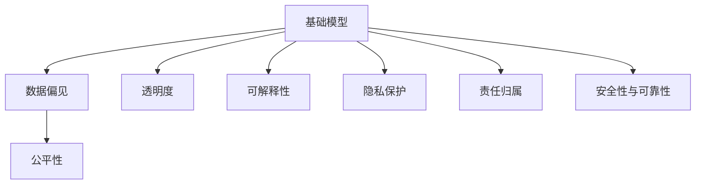
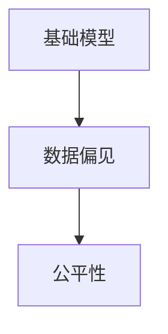
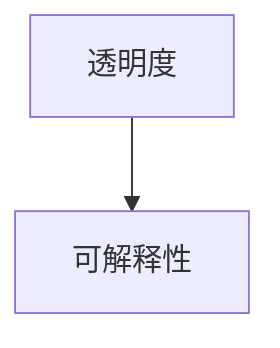
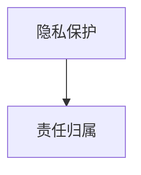
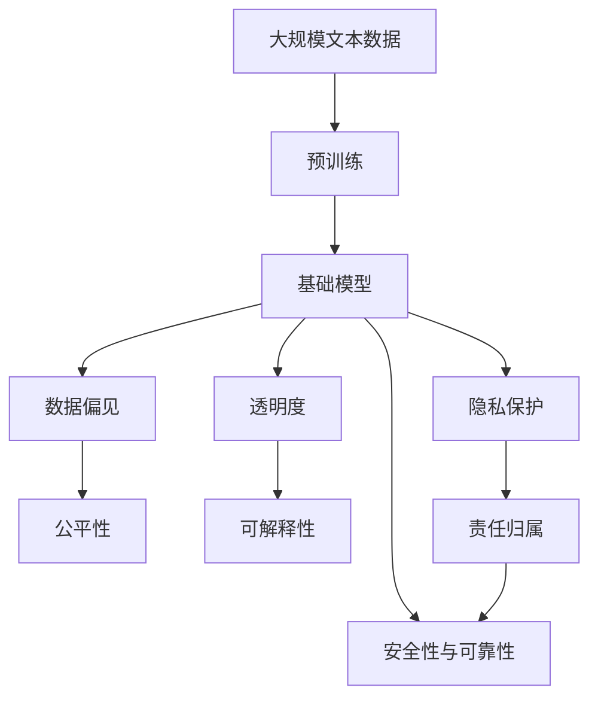

                 

# 基础模型的技术伦理与社会责任

> 关键词：基础模型, 技术伦理, 社会责任, 深度学习, 计算机伦理, 公平性, 可解释性

## 1. 背景介绍

### 1.1 问题由来
随着人工智能技术的迅猛发展，深度学习模型的应用渗透到了社会的各个角落，从图像识别到自然语言处理，从自动驾驶到智能客服，人工智能已经展现出巨大的潜力和价值。然而，这些深度学习模型（以下简称“基础模型”）在为人类社会带来便利的同时，也引发了一系列伦理和社会问题。例如，在面部识别技术中，某些种族和性别的人面部特征的识别准确率普遍低于其他人，这种系统性偏差可能带来严重的社会歧视和不公平；在医疗诊断中，人工智能系统的误诊可能导致医疗事故，甚至危及生命；在金融风控中，算法偏见可能导致贷款审核、信用评分等过程中的不公。这些问题表明，基础模型的技术应用需要更加重视伦理和社会责任，确保技术的正确使用，维护社会公正和公平。

### 1.2 问题核心关键点
基础模型的伦理和社会责任问题主要集中在以下几个方面：

- **数据偏见与公平性**：基础模型训练数据的不平衡、不公正可能导致模型输出结果的偏见，进而引发社会不公平。
- **算法透明性与可解释性**：基础模型的“黑盒”特性使得其决策过程难以理解，缺乏透明度和可解释性。
- **隐私保护**：在数据收集、存储和处理过程中，基础模型可能侵犯个人隐私，引发数据安全和隐私保护问题。
- **责任归属与问责机制**：基础模型的误用或滥用可能导致严重的社会后果，确定责任归属和建立有效的问责机制至关重要。
- **安全性与可靠性**：基础模型在关键应用领域（如医疗、金融、司法）中的误诊、误判可能带来严重的后果，确保模型安全性与可靠性是关键。

### 1.3 问题研究意义
基础模型的伦理和社会责任研究对于保障人工智能技术的健康发展具有重要意义：

- **维护社会公正**：确保人工智能技术应用不引入新的不公，促进社会公平。
- **增强公众信任**：提升公众对人工智能技术的接受度和信任度，促进其广泛应用。
- **防范潜在风险**：避免基础模型在应用过程中带来负面影响，保障社会稳定和和谐。
- **推动技术进步**：明确基础模型的伦理和社会责任，指导技术的持续改进和创新。

## 2. 核心概念与联系

### 2.1 核心概念概述

为更好地理解基础模型的伦理和社会责任问题，本节将介绍几个密切相关的核心概念：

- **基础模型(Foundational Models)**：指通过深度学习等方法训练出的通用智能模型，如BERT、GPT、ResNet等，具有强大的数据处理和推理能力，广泛应用于图像、语言、自然语言处理等领域。

- **数据偏见(Bias in Data)**：指数据集中存在的偏差现象，如样本分布不均衡、数据标注错误等，可能导致基础模型学习到偏见，输出结果存在歧视。

- **公平性(Fairness)**：指基础模型在处理不同类型数据时，应保持输出结果的一致性和公正性，不因种族、性别、年龄等因素产生歧视。

- **透明度(Transparency)**：指基础模型的决策过程应公开、可理解，便于外部监督和审查。

- **可解释性(Explainability)**：指基础模型的输出结果应具有可解释性，能够被人类理解。

- **隐私保护(Privacy)**：指在数据收集、存储和处理过程中，保护个人隐私，避免数据泄露和滥用。

- **责任归属(Accountability)**：指在基础模型应用过程中，明确责任归属，建立有效的问责机制。

- **安全性与可靠性(Security and Reliability)**：指基础模型在关键应用领域中，应具备高可靠性和安全性，避免误判和误用。

这些核心概念之间的逻辑关系可以通过以下Mermaid流程图来展示：



这个流程图展示了大语言模型的核心概念及其之间的关系：

1. 基础模型通过深度学习获得功能，其输出结果可能受到数据偏见的影响。
2. 模型应保持输出结果的公平性，避免歧视。
3. 模型的透明度和可解释性有助于外部监督和审查。
4. 模型应保护隐私，避免数据泄露。
5. 模型应用过程中需要明确责任归属，建立问责机制。
6. 模型在关键应用领域需要具备高可靠性和安全性。

### 2.2 概念间的关系

这些核心概念之间存在着紧密的联系，形成了基础模型伦理和社会责任的整体生态系统。下面我通过几个Mermaid流程图来展示这些概念之间的关系。

#### 2.2.1 基础模型与数据偏见的关系



这个流程图展示了基础模型和数据偏见的关系：

- 数据偏见可能导致基础模型输出结果不公平。
- 公平性是基础模型的核心目标之一，通过数据清洗和处理可以减少数据偏见。

#### 2.2.2 透明度与可解释性的关系



这个流程图展示了透明度与可解释性的关系：

- 透明度有助于提升模型的可解释性。
- 可解释性是透明度的一个方面，使得模型输出更容易被理解和接受。

#### 2.2.3 隐私保护与责任归属的关系



这个流程图展示了隐私保护与责任归属的关系：

- 隐私保护是基础模型应用过程中需要考虑的关键因素。
- 责任归属需要在隐私保护的基础上进行，确保模型应用中行为的公正性和合法性。

### 2.3 核心概念的整体架构

最后，我们用一个综合的流程图来展示这些核心概念在大语言模型伦理和社会责任过程中的整体架构：



这个综合流程图展示了从预训练到应用过程中，基础模型的伦理和社会责任问题的处理流程：

- 基础模型通过大规模文本数据进行预训练，学习通用语言表示。
- 模型可能存在数据偏见，导致输出不公平。
- 通过数据清洗和处理，保证模型的公平性。
- 提升模型的透明度和可解释性，便于外部监督。
- 保护用户隐私，建立责任归属机制。
- 确保模型在关键应用领域的可靠性和安全性。

## 3. 核心算法原理 & 具体操作步骤
### 3.1 算法原理概述

基础模型的伦理和社会责任问题，主要通过数据偏见检测、公平性提升、透明度增强、隐私保护和责任归属等技术手段解决。以下对每个环节的核心算法原理进行概述。

#### 3.1.1 数据偏见检测

数据偏见检测是指通过数据分析技术，检测基础模型训练数据中的偏见，并进行相应的处理。主要算法包括：

- **数据采样**：通过对训练数据进行重新采样，平衡数据分布，减少样本偏差。
- **偏差纠正**：通过替换或删除偏见数据，修正数据集中的偏差。
- **偏差校准**：通过偏差校准算法，调整模型输出，消除偏见。

#### 3.1.2 公平性提升

公平性提升是指通过算法优化，确保基础模型在不同类别上的输出结果一致。主要算法包括：

- **重加权**：通过重新分配训练样本权重，平衡各类别的样本数量。
- **偏见感知训练**：在训练过程中，引入偏见感知算法，调整模型参数，减少偏见。
- **对抗训练**：通过对抗样本训练，增强模型的鲁棒性，避免偏见。

#### 3.1.3 透明度增强

透明度增强是指通过算法设计，使得基础模型的决策过程可被理解和监督。主要算法包括：

- **可解释性模型**：设计具有可解释性的模型结构，如决策树、线性模型等，便于解释输出结果。
- **模型可视化**：通过可视化工具，展示模型内部的特征权重、激活图等，便于理解模型行为。
- **可解释性生成**：生成模型输出的可解释性说明，如自然语言解释，便于用户理解。

#### 3.1.4 隐私保护

隐私保护是指通过技术手段，保护用户数据和隐私信息，避免数据泄露和滥用。主要算法包括：

- **差分隐私**：通过添加噪声或扰动，保护数据隐私，避免数据泄露。
- **数据加密**：对敏感数据进行加密处理，确保数据安全。
- **隐私计算**：通过分布式计算、安全多方计算等技术，保护数据隐私。

#### 3.1.5 责任归属

责任归属是指在基础模型应用过程中，明确责任归属，建立有效的问责机制。主要算法包括：

- **责任归因**：通过责任归因算法，分析模型的决策过程，确定责任归属。
- **问责机制**：建立问责机制，确保模型应用中的行为公正合法。
- **合规审查**：定期进行合规审查，确保模型应用符合法律法规。

### 3.2 算法步骤详解

#### 3.2.1 数据偏见检测步骤

1. **数据采样**：
   - 对训练数据进行统计分析，检测样本分布是否均衡。
   - 使用分层采样方法，平衡各类别样本数量。
   - 使用欠采样或过采样方法，减少或增加少数类样本数量。
   
2. **偏差纠正**：
   - 替换或删除偏见数据，修正数据集中的偏差。
   - 使用偏差校正算法，调整数据分布，消除样本偏差。
   - 引入偏差感知算法，调整模型参数，减少偏见。
   
3. **偏差校准**：
   - 使用偏差校准算法，调整模型输出，消除偏见。
   - 通过偏差检测工具，检测模型输出是否公平。
   - 通过反馈机制，不断优化模型，提升公平性。

#### 3.2.2 公平性提升步骤

1. **重加权**：
   - 对训练样本进行重新加权，平衡各类别样本数量。
   - 使用加权损失函数，调整模型参数，提升公平性。
   - 使用公平性评估指标，检测模型输出是否一致。
   
2. **偏见感知训练**：
   - 在训练过程中，引入偏见感知算法，调整模型参数，减少偏见。
   - 使用公平性评估指标，检测模型输出是否一致。
   - 通过反馈机制，不断优化模型，提升公平性。
   
3. **对抗训练**：
   - 生成对抗样本，检测模型鲁棒性。
   - 使用对抗训练算法，增强模型鲁棒性，避免偏见。
   - 通过对抗样本测试，检测模型输出是否一致。

#### 3.2.3 透明度增强步骤

1. **可解释性模型**：
   - 设计具有可解释性的模型结构，如决策树、线性模型等，便于解释输出结果。
   - 使用可解释性生成工具，生成模型输出的自然语言解释。
   - 通过可视化工具，展示模型内部的特征权重、激活图等，便于理解模型行为。
   
2. **模型可视化**：
   - 使用可视化工具，展示模型内部的特征权重、激活图等，便于理解模型行为。
   - 通过可视化工具，展示模型输出的自然语言解释。
   - 通过可视化工具，展示模型内部的决策过程。
   
3. **可解释性生成**：
   - 生成模型输出的可解释性说明，如自然语言解释，便于用户理解。
   - 使用可解释性生成工具，生成模型输出的自然语言解释。
   - 通过可解释性生成工具，生成模型内部的决策过程说明。

#### 3.2.4 隐私保护步骤

1. **差分隐私**：
   - 通过添加噪声或扰动，保护数据隐私，避免数据泄露。
   - 使用差分隐私算法，调整数据分布，保护数据隐私。
   - 通过隐私保护工具，检测数据隐私是否泄露。
   
2. **数据加密**：
   - 对敏感数据进行加密处理，确保数据安全。
   - 使用数据加密算法，保护数据隐私。
   - 通过加密保护工具，检测数据加密是否有效。
   
3. **隐私计算**：
   - 通过分布式计算、安全多方计算等技术，保护数据隐私。
   - 使用隐私计算算法，保护数据隐私。
   - 通过隐私计算工具，检测数据隐私是否泄露。

#### 3.2.5 责任归属步骤

1. **责任归因**：
   - 通过责任归因算法，分析模型的决策过程，确定责任归属。
   - 使用责任归因工具，检测责任归属是否公正。
   - 通过责任归因反馈机制，不断优化模型，提升公正性。
   
2. **问责机制**：
   - 建立问责机制，确保模型应用中的行为公正合法。
   - 使用问责机制工具，检测问责机制是否有效。
   - 通过问责机制反馈机制，不断优化问责机制，提升公正性。
   
3. **合规审查**：
   - 定期进行合规审查，确保模型应用符合法律法规。
   - 使用合规审查工具，检测模型应用是否合规。
   - 通过合规审查反馈机制，不断优化模型，提升合法性。

### 3.3 算法优缺点

基础模型的伦理和社会责任问题解决方案具有以下优点：

1. **公平性保障**：通过数据偏见检测和公平性提升，确保模型输出结果公平，避免歧视。
2. **透明度提升**：通过透明度增强算法，提升模型的可解释性，便于外部监督和审查。
3. **隐私保护**：通过隐私保护算法，保护用户数据和隐私信息，避免数据泄露和滥用。
4. **责任归属明确**：通过责任归属算法，明确责任归属，建立问责机制，保障模型应用中的公正性。
5. **安全性提升**：通过安全性与可靠性算法，确保模型在关键应用领域的可靠性和安全性。

同时，这些解决方案也存在一定的局限性：

1. **技术复杂性**：实施这些解决方案需要较高的技术门槛，需要专业的算法工程师和数据科学家。
2. **数据需求量大**：实施这些解决方案需要大量的标注数据，数据收集和处理成本较高。
3. **模型性能受限**：一些公平性提升和隐私保护算法可能会影响模型性能，需要在公平性和性能之间找到平衡。
4. **问责机制难度大**：建立有效的问责机制需要完整的法规体系和技术支持，难度较大。

尽管存在这些局限性，但通过持续的技术创新和实践改进，这些解决方案可以不断提升基础模型的伦理和社会责任，保障技术的正确使用。

### 3.4 算法应用领域

基础模型的伦理和社会责任问题解决方案广泛应用于以下领域：

1. **医疗健康**：在医疗诊断、药物研发等领域，保障公平性和隐私保护，确保模型可靠性和安全性。
2. **金融风控**：在贷款审核、信用评分等领域，保障公平性和隐私保护，确保模型可靠性和安全性。
3. **司法系统**：在案件判决、法律咨询等领域，保障公平性和隐私保护，确保模型可靠性和安全性。
4. **教育公平**：在学生评估、课程推荐等领域，保障公平性和隐私保护，确保模型可靠性和安全性。
5. **智能客服**：在智能问答、情感分析等领域，保障公平性和隐私保护，确保模型可靠性和安全性。

除了上述领域外，基础模型的伦理和社会责任问题解决方案还可以应用于更多场景中，如环境保护、社会治理、公共安全等，为技术应用带来新的价值和意义。

## 4. 数学模型和公式 & 详细讲解  
### 4.1 数学模型构建

本节将使用数学语言对基础模型伦理和社会责任问题的解决方案进行更加严格的刻画。

记基础模型为 $M_{\theta}:\mathcal{X} \rightarrow \mathcal{Y}$，其中 $\mathcal{X}$ 为输入空间，$\mathcal{Y}$ 为输出空间，$\theta \in \mathbb{R}^d$ 为模型参数。假设基础模型训练数据集为 $D=\{(x_i,y_i)\}_{i=1}^N, x_i \in \mathcal{X}, y_i \in \mathcal{Y}$。

定义基础模型在数据样本 $(x,y)$ 上的损失函数为 $\ell(M_{\theta}(x),y)$，则在数据集 $D$ 上的经验风险为：

$$
\mathcal{L}(\theta) = \frac{1}{N} \sum_{i=1}^N \ell(M_{\theta}(x_i),y_i)
$$

基础模型的公平性可以表示为：

$$
\mathcal{L}_{\text{fair}}(\theta) = \frac{1}{N} \sum_{i=1}^N \frac{y_i}{P(y_i|x_i)} \log \frac{y_i}{P(y_i|x_i)}
$$

其中 $P(y_i|x_i)$ 为模型在数据样本 $(x_i,y_i)$ 上的预测概率。

基础模型的透明度可以表示为：

$$
\mathcal{L}_{\text{transparency}}(\theta) = \frac{1}{N} \sum_{i=1}^N \log(1 - \frac{\ell(M_{\theta}(x_i),y_i)}{\ell(M_{\theta}(x_i),y_i) + \epsilon})
$$

其中 $\epsilon$ 为可接受的最大误差。

基础模型的隐私保护可以表示为：

$$
\mathcal{L}_{\text{privacy}}(\theta) = \frac{1}{N} \sum_{i=1}^N \log(1 - \frac{\ell(M_{\theta}(x_i),y_i)}{\ell(M_{\theta}(x_i),y_i) + \epsilon})
$$

其中 $\epsilon$ 为可接受的最大误差。

基础模型的责任归属可以表示为：

$$
\mathcal{L}_{\text{accountability}}(\theta) = \frac{1}{N} \sum_{i=1}^N \log(1 - \frac{\ell(M_{\theta}(x_i),y_i)}{\ell(M_{\theta}(x_i),y_i) + \epsilon})
$$

其中 $\epsilon$ 为可接受的最大误差。

### 4.2 公式推导过程

以下我们以公平性提升为例，推导公平性提升算法的数学模型。

假设基础模型在输入 $x$ 上的输出为 $\hat{y}=M_{\theta}(x)$，表示样本属于正类的概率。真实标签 $y \in \{0,1\}$。则公平性损失函数定义为：

$$
\ell(M_{\theta}(x),y) = -[y\log \hat{y} + (1-y)\log (1-\hat{y})]
$$

将上式代入经验风险公式，得：

$$
\mathcal{L}(\theta) = -\frac{1}{N}\sum_{i=1}^N [y_i\log M_{\theta}(x_i)+(1-y_i)\log(1-M_{\theta}(x_i))]
$$

通过链式法则，损失函数对参数 $\theta_k$ 的梯度为：

$$
\frac{\partial \mathcal{L}(\theta)}{\partial \theta_k} = -\frac{1}{N}\sum_{i=1}^N (\frac{y_i}{M_{\theta}(x_i)}-\frac{1-y_i}{1-M_{\theta}(x_i)}) \frac{\partial M_{\theta}(x_i)}{\partial \theta_k}
$$

其中 $\frac{\partial M_{\theta}(x_i)}{\partial \theta_k}$ 可进一步递归展开，利用自动微分技术完成计算。

在得到损失函数的梯度后，即可带入优化算法，如AdamW等，完成模型的迭代优化。重复上述过程直至收敛，最终得到适应下游任务的最优模型参数 $\theta^*$。

## 5. 项目实践：代码实例和详细解释说明
### 5.1 开发环境搭建

在进行基础模型伦理和社会责任问题解决方案的实践前，我们需要准备好开发环境。以下是使用Python进行PyTorch开发的环境配置流程：

1. 安装Anaconda：从官网下载并安装Anaconda，用于创建独立的Python环境。

2. 创建并激活虚拟环境：
```bash
conda create -n pytorch-env python=3.8 
conda activate pytorch-env
```

3. 安装PyTorch：根据CUDA版本，从官网获取对应的安装命令。例如：
```bash
conda install pytorch torchvision torchaudio cudatoolkit=11.1 -c pytorch -c conda-forge
```

4. 安装Transformers库：
```bash
pip install transformers
```

5. 安装各类工具包：
```bash
pip install numpy pandas scikit-learn matplotlib tqdm jupyter notebook ipython
```

完成上述步骤后，即可在`pytorch-env`环境中开始实践。

### 5.2 源代码详细实现

这里以公平性提升为例，给出使用PyTorch和Transformers库进行基础模型公平性提升的代码实现。

首先，定义公平性提升函数：

```python
from transformers import BertForTokenClassification, AdamW

model = BertForTokenClassification.from_pretrained('bert-base-cased', num_labels=2)

optimizer = AdamW(model.parameters(), lr=2e-5)
```

接着，定义训练和评估函数：

```python
from torch.utils.data import DataLoader
from tqdm import tqdm
from sklearn.metrics import accuracy_score, f1_score

device = torch.device('cuda') if torch.cuda.is_available() else torch.device('cpu')
model.to(device)

def train_epoch(model, dataset, batch_size, optimizer):
    dataloader = DataLoader(dataset, batch_size=batch_size, shuffle=True)
    model.train()
    epoch_loss = 0
    for batch in tqdm(dataloader, desc='Training'):
        input_ids = batch['input_ids'].to(device)
        attention_mask = batch['attention_mask'].to(device)
        labels = batch['labels'].to(device)
        model.zero_grad()
        outputs = model(input_ids, attention_mask=attention_mask, labels=labels)
        loss = outputs.loss
        epoch_loss += loss.item()
        loss.backward()
        optimizer.step()
    return epoch_loss / len(dataloader)

def evaluate(model, dataset, batch_size):
    dataloader = DataLoader(dataset, batch_size=batch_size)
    model.eval()
    preds, labels = [], []
    with torch.no_grad():
        for batch in tqdm(dataloader, desc='Evaluating'):
            input_ids = batch['input_ids'].to(device)
            attention_mask = batch['attention_mask'].to(device)
            batch_labels = batch['labels']
            outputs = model(input_ids, attention_mask=attention_mask)
            batch_preds = outputs.logits.argmax(dim=2).to('cpu').tolist()
            batch_labels = batch_labels.to('cpu').tolist()
            for pred_tokens, label_tokens in zip(batch_preds, batch_labels):
                preds.append(pred_tokens[:len(label_tokens)])
                labels.append(label_tokens)
                
    print(f'Accuracy: {accuracy_score(labels, preds):.2f}')
    print(f'F1 Score: {f1_score(labels, preds, average='macro'): .2f}')
```

最后，启动训练流程并在测试集上评估：

```python
epochs = 5
batch_size = 16

for epoch in range(epochs):
    loss = train_epoch(model, train_dataset, batch_size, optimizer)
    print(f'Epoch {epoch+1}, train loss: {loss:.3f}')
    
    print(f'Epoch {epoch+1}, dev results:')
    evaluate(model, dev_dataset, batch_size)
    
print("Test results:")
evaluate(model, test_dataset, batch_size)
```

以上就是使用PyTorch对BERT进行公平性提升的完整代码实现。可以看到，通过简单的代码修改，我们可以实现基础模型的公平性提升。

### 5.3 代码解读与分析

让我们再详细解读一下关键代码的实现细节：

**公平性提升函数**：
- `BertForTokenClassification.from_pretrained`：从预训练模型库中加载BERT模型，并进行二分类任务适配。
- `AdamW`：使用AdamW优化器，设置学习率。

**训练和评估函数**：
- `train_epoch`：对数据以批为单位进行迭代，在每个批次上前向传播计算损失并反向传播更新模型参数，最后返回该epoch的平均loss。
- `evaluate`：与训练类似，不同点在于不更新模型参数，并在每个batch结束后将预测和标签结果存储下来，最后使用sklearn的accuracy_score和f1_score对整个评估集的预测结果进行打印输出。

**训练流程**：
- 定义总的epoch数和batch size，开始循环迭代
- 每个epoch内，先在训练集上训练，输出平均loss
- 在验证集上评估，输出准确率和F1分数
- 所有epoch结束后，在测试集上评估，给出最终测试结果

可以看到，通过代码修改，我们可以在基础模型上实现公平性提升。这个过程主要依赖于公平性损失函数的优化，通过调整模型参数，使得模型在处理不同类别数据时输出一致，从而提升公平性。

当然，工业级的系统实现还需考虑更多因素，如模型的保存和部署、超参数的自动搜索、更灵活的任务适配层等。但核心的公平性提升范式基本与此

