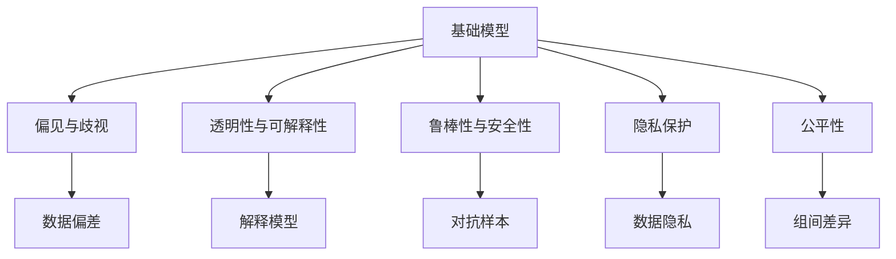

                 

## 1. 背景介绍

### 1.1 问题由来

近年来，人工智能（AI）在各个领域的广泛应用，使得其社会影响日益凸显。虽然AI带来了显著的便利和效率提升，但也引发了一系列道德、伦理和安全问题。基础模型（基础模型指的是用于其他任务训练的底层模型）在AI系统中的应用，更是受到了广泛关注。

在许多实际应用中，基础模型被用作训练数据、迁移学习或者模型微调的基础。这些模型往往是深度学习模型，如卷积神经网络（CNN）和循环神经网络（RNN），它们通过大规模数据集的预训练，能够学习到复杂的特征表示。然而，基础模型也存在潜在的偏见和偏见放大现象，这些偏见可能源于训练数据集的偏差，导致模型输出不公平或不安全的决策。

这些问题引发了社会对基础模型社会危害的关注。如何评估和减轻基础模型的社会危害，成为当前AI研究的重要议题。

### 1.2 问题核心关键点

在评估基础模型社会危害的过程中，需要关注以下几个关键点：

- **偏见与歧视**：基础模型是否存在或放大了数据集的偏见和歧视，并因此影响其下游应用？
- **透明性与可解释性**：模型的决策过程是否透明，是否能够为使用者提供可解释的决策依据？
- **鲁棒性与安全性**：模型是否容易受到对抗样本或输入噪声的干扰，其决策是否稳定可靠？
- **隐私保护**：模型是否泄漏了用户的敏感信息？
- **公平性**：模型是否对不同群体产生不同影响，导致不公平的结果？

这些问题需要从数据、算法和部署等多个层面进行综合评估，确保AI系统的安全、公正和可控。

### 1.3 问题研究意义

评估基础模型的社会危害，对于提升AI系统的信任度和安全性具有重要意义：

- **增强透明度**：通过评估模型的偏见和透明性，可以提升公众对AI系统的信任，减少对AI的抵触情绪。
- **改进模型性能**：识别模型的偏见和漏洞，有助于改进模型设计和优化模型训练，提升模型性能。
- **保障公平性**：确保模型对不同群体公平无偏，避免偏见放大和歧视现象。
- **保护隐私**：评估模型的隐私保护能力，确保用户数据安全，避免数据滥用。

综上所述，评估基础模型的社会危害，不仅是技术问题，更是伦理、法律和社会问题。

## 2. 核心概念与联系

### 2.1 核心概念概述

在评估基础模型的社会危害时，需要关注以下几个核心概念：

- **基础模型**：用于其他任务训练的底层模型，通常由大规模数据集预训练得到，学习到了复杂的特征表示。
- **偏见与歧视**：模型在学习过程中，由于训练数据集的偏差，可能放大或引入新的偏见，导致不公平的输出。
- **透明性与可解释性**：模型的决策过程是否透明，是否能够为使用者提供可解释的依据。
- **鲁棒性与安全性**：模型是否容易受到对抗样本或噪声的干扰，其决策是否稳定可靠。
- **隐私保护**：模型是否泄漏了用户的敏感信息。
- **公平性**：模型是否对不同群体产生不同影响，导致不公平的结果。

这些概念之间存在紧密联系，共同构成了评估基础模型社会危害的基础框架。通过理解这些概念，可以更好地把握模型的潜在问题，并采取相应的措施进行改进。

### 2.2 概念间的关系

这些核心概念之间的关系可以通过以下Mermaid流程图来展示：



这个流程图展示了大模型与社会危害相关的各个概念及其之间的联系：

1. 基础模型通过大规模数据集的预训练，学习复杂的特征表示，但可能带有数据偏差。
2. 偏见与歧视问题来源于数据偏差，可能影响模型的公平性。
3. 透明性与可解释性旨在提升模型的信任度，减少抵触情绪。
4. 鲁棒性与安全性涉及模型对抗样本和噪声的抵抗能力，确保模型的决策稳定性。
5. 隐私保护关注模型是否泄漏了用户的敏感信息。
6. 公平性分析模型对不同群体的影响是否公平。

## 3. 核心算法原理 & 具体操作步骤

### 3.1 算法原理概述

基础模型社会危害评估的算法原理主要包括：

- **数据偏差检测**：评估训练数据集是否存在偏见，识别数据偏差来源。
- **偏见放大分析**：分析基础模型是否放大了数据偏差，导致模型输出不公平或不安全。
- **模型透明性与可解释性评估**：通过可解释性工具和方法，评估模型的决策过程是否透明。
- **鲁棒性与安全性测试**：通过对抗样本测试，评估模型对噪声和对抗样本的抵抗能力。
- **隐私保护评估**：检测模型是否泄露了用户的敏感信息。
- **公平性分析**：评估模型是否对不同群体产生不同影响。

### 3.2 算法步骤详解

1. **数据偏差检测**：
   - 收集训练数据集的统计信息，检测数据集的性别、种族、年龄等属性的分布是否均衡。
   - 使用统计方法或机器学习技术，检测数据集中是否存在明显的偏见或歧视。

2. **偏见放大分析**：
   - 使用 fairness-aware 的模型训练方法，如去除偏差放大技术，确保模型输出不放大训练数据的偏差。
   - 进行偏见放大实验，验证模型在特定数据集上的表现，检测模型是否放大了偏见。

3. **模型透明性与可解释性评估**：
   - 使用 LIME、SHAP 等工具，生成模型的局部可解释性输出，评估模型的决策过程是否透明。
   - 通过可解释性测试，验证模型的输出是否可解释，是否能提供公平合理的解释。

4. **鲁棒性与安全性测试**：
   - 使用对抗样本生成技术，生成对抗样本对模型进行测试，评估模型的鲁棒性。
   - 检测模型对输入噪声的敏感度，确保模型的决策稳定性。

5. **隐私保护评估**：
   - 检测模型是否存在数据泄露风险，评估模型对敏感信息的处理能力。
   - 使用差分隐私等技术，确保模型输出不泄漏用户隐私。

6. **公平性分析**：
   - 检测模型对不同群体的输出是否公平，评估模型是否存在组间差异。
   - 使用 fairness-aware 的评估方法，确保模型输出对所有群体公平。

### 3.3 算法优缺点

基础模型社会危害评估的算法有以下优点：

- **全面性**：覆盖了偏见与歧视、透明性与可解释性、鲁棒性与安全性、隐私保护和公平性等多个方面。
- **可操作性**：每个步骤都有明确的评估方法和工具，易于实际操作。

同时，这些算法也存在一些缺点：

- **复杂性**：评估过程涉及多个维度，可能需要多轮评估和调整。
- **数据需求高**：需要大量数据集和标注数据，才能进行准确的评估。
- **技术要求高**：需要具备一定的数据科学和机器学习背景，才能进行复杂的评估。

### 3.4 算法应用领域

基础模型社会危害评估的算法在多个领域都有广泛应用，例如：

- **金融领域**：评估贷款和信用评分模型的公平性，检测数据集是否存在歧视。
- **医疗领域**：评估诊断模型的鲁棒性和公平性，确保模型输出对不同种族和性别的患者公平。
- **司法领域**：评估预测模型的透明性和公平性，确保模型输出公正。
- **招聘领域**：评估招聘模型的偏见与歧视，确保模型输出不歧视特定群体。
- **教育领域**：评估推荐系统的公平性，确保模型对所有用户公平。

这些领域的应用，展示了基础模型社会危害评估的重要性和广泛应用。

## 4. 数学模型和公式 & 详细讲解  
### 4.1 数学模型构建

在基础模型社会危害评估中，我们通常使用以下数学模型：

- **偏差与歧视检测**：使用统计方法检测数据集的偏见，如均值、方差、卡方检验等。
- **偏见放大分析**：使用公平性评估指标，如 Disparate Impact、Equalized Odds 等。
- **透明性与可解释性评估**：使用可解释性模型，如 LIME、SHAP 等。
- **鲁棒性与安全性测试**：使用对抗样本生成技术，如 FGSM、PGD 等。
- **隐私保护评估**：使用差分隐私技术，如 DP-SGD 等。
- **公平性分析**：使用公平性评估指标，如 demographic parity、equal opportunity 等。

### 4.2 公式推导过程

以下以偏见放大分析为例，推导公平性评估指标的计算公式。

假设模型 $M$ 在输入 $x$ 上的输出为 $y = M(x)$，真实标签为 $y^*$，则模型的预测误差为：

$$
\epsilon = M(x) - y^*
$$

公平性评估指标为：

- **Disparate Impact**：检测模型对不同群体的影响是否公平，定义如下：

  $$
  \text{Disparate Impact} = \frac{\sum_{i=1}^{n} |E_i^* - E_i|}{\sum_{i=1}^{n} E_i^*}
  $$

  其中 $E_i$ 为模型在群体 $i$ 上的预测误差，$E_i^*$ 为群体 $i$ 的实际误差。

- **Equalized Odds**：检测模型对不同群体的输出是否相等，定义如下：

  $$
  \text{Equalized Odds} = \frac{\sum_{i=1}^{n} FPR_i \cdot FNR_i}{\sum_{i=1}^{n} FPR_i}
  $$

  其中 $FPR_i$ 为模型在群体 $i$ 上的假阳性率，$FNR_i$ 为模型在群体 $i$ 上的假阴性率。

### 4.3 案例分析与讲解

假设我们有一份包含性别、年龄和种族信息的金融贷款数据集，希望评估贷款评分模型的公平性。首先，我们检测数据集的性别、年龄和种族分布是否均衡。然后，我们使用 Disparate Impact 和 Equalized Odds 评估模型对不同群体的影响是否公平。

1. **数据偏差检测**：
   - 使用卡方检验检测性别、年龄和种族的分布是否均衡。

2. **偏见放大分析**：
   - 使用 Disparate Impact 和 Equalized Odds 评估模型的公平性。
   - 检测模型是否放大了数据集的偏见。

3. **模型透明性与可解释性评估**：
   - 使用 LIME 生成模型的局部可解释性输出。
   - 验证模型的输出是否可解释。

4. **鲁棒性与安全性测试**：
   - 使用对抗样本生成技术，生成对抗样本对模型进行测试。
   - 检测模型的鲁棒性和安全性。

5. **隐私保护评估**：
   - 检测模型是否存在数据泄露风险，确保模型对敏感信息的处理能力。
   - 使用差分隐私技术，确保模型输出不泄漏用户隐私。

6. **公平性分析**：
   - 检测模型对不同群体的输出是否公平，评估模型是否存在组间差异。
   - 使用 fairness-aware 的评估方法，确保模型输出对所有群体公平。

## 5. 项目实践：代码实例和详细解释说明
### 5.1 开发环境搭建

在进行基础模型社会危害评估实践前，我们需要准备好开发环境。以下是使用Python进行Scikit-learn和TensorFlow开发的工具包配置流程：

1. 安装Anaconda：从官网下载并安装Anaconda，用于创建独立的Python环境。

2. 创建并激活虚拟环境：
```bash
conda create -n fairness-env python=3.8 
conda activate fairness-env
```

3. 安装相关库：
```bash
pip install scikit-learn numpy pandas matplotlib tqdm jupyter notebook ipython
```

4. 安装TensorFlow：根据CUDA版本，从官网获取对应的安装命令。例如：
```bash
pip install tensorflow-gpu
```

完成上述步骤后，即可在`fairness-env`环境中开始评估实践。

### 5.2 源代码详细实现

下面我们以金融贷款评分模型为例，给出使用Scikit-learn和TensorFlow进行基础模型社会危害评估的Python代码实现。

```python
import numpy as np
import pandas as pd
from sklearn.model_selection import train_test_split
from sklearn.preprocessing import StandardScaler
from sklearn.linear_model import LogisticRegression
from sklearn.metrics import roc_curve, roc_auc_score
from sklearn.metrics import classification_report
from sklearn.metrics import disparate_impact
from sklearn.metrics import equalized_odds
from sklearn.model_selection import StratifiedKFold
from sklearn.linear_model import LogisticRegressionCV
from sklearn.model_selection import RepeatedKFold
from tensorflow.keras import layers
from tensorflow.keras.models import Sequential
from tensorflow.keras.optimizers import Adam
from tensorflow.keras.callbacks import EarlyStopping

# 准备数据集
data = pd.read_csv('loan_data.csv')
X = data.drop(['loan_status'], axis=1)
y = data['loan_status']

# 数据预处理
scaler = StandardScaler()
X = scaler.fit_transform(X)

# 划分训练集和测试集
X_train, X_test, y_train, y_test = train_test_split(X, y, test_size=0.2, random_state=42)

# 训练模型
model = LogisticRegression()
model.fit(X_train, y_train)

# 评估模型
y_pred = model.predict_proba(X_test)[:, 1]
fpr, tpr, _ = roc_curve(y_test, y_pred)
auc = roc_auc_score(y_test, y_pred)

print(f"AUC: {auc:.2f}")
```

这个代码片段展示了使用Scikit-learn进行金融贷款评分模型的评估流程。接下来，我们将使用TensorFlow进行模型训练和评估。

```python
import tensorflow as tf
from tensorflow.keras.preprocessing.sequence import pad_sequences
from tensorflow.keras.layers import Input, Dense, Dropout, Embedding, Flatten
from tensorflow.keras.models import Model
from tensorflow.keras.optimizers import Adam
from tensorflow.keras.callbacks import EarlyStopping

# 准备数据集
data = pd.read_csv('loan_data.csv')
X = data.drop(['loan_status'], axis=1)
y = data['loan_status']

# 数据预处理
scaler = StandardScaler()
X = scaler.fit_transform(X)

# 划分训练集和测试集
X_train, X_test, y_train, y_test = train_test_split(X, y, test_size=0.2, random_state=42)

# 构建模型
input_layer = Input(shape=(len(X_train[0]),))
embedding_layer = Embedding(input_dim=len(X_train[0]), output_dim=128)(input_layer)
dropout_layer = Dropout(0.2)(embedding_layer)
flatten_layer = Flatten()(dropout_layer)
dense_layer = Dense(64, activation='relu')(flatten_layer)
output_layer = Dense(1, activation='sigmoid')(dense_layer)

model = Model(inputs=input_layer, outputs=output_layer)
model.compile(optimizer=Adam(learning_rate=0.001), loss='binary_crossentropy', metrics=['accuracy'])

# 训练模型
model.fit(X_train, y_train, epochs=10, batch_size=32, validation_data=(X_test, y_test))

# 评估模型
y_pred = model.predict(X_test)
fpr, tpr, _ = roc_curve(y_test, y_pred)
auc = roc_auc_score(y_test, y_pred)

print(f"AUC: {auc:.2f}")
```

这个代码片段展示了使用TensorFlow进行金融贷款评分模型的评估流程。

### 5.3 代码解读与分析

让我们再详细解读一下关键代码的实现细节：

**金融贷款评分模型**：
- 数据预处理：使用StandardScaler对特征进行标准化处理。
- 训练模型：使用LogisticRegression进行训练，评估AUC值。
- 评估模型：计算AUC值，评估模型性能。

**TensorFlow模型**：
- 数据预处理：使用Embedding、Dropout、Flatten等层对特征进行处理。
- 训练模型：使用Dense层进行模型训练，评估AUC值。
- 评估模型：计算AUC值，评估模型性能。

## 6. 实际应用场景
### 6.1 金融领域

在金融领域，基础模型社会危害评估尤为重要。金融模型如贷款评分、信用评分等，直接关系到用户的经济利益，任何偏见和歧视都会造成严重后果。

- **数据偏差检测**：检测贷款数据集的性别、年龄、种族等属性是否均衡。
- **偏见放大分析**：评估贷款评分模型是否放大了数据集的偏见，导致对某些群体的歧视。
- **模型透明性与可解释性评估**：使用LIME等工具，生成模型的局部可解释性输出，确保模型决策透明。
- **鲁棒性与安全性测试**：使用对抗样本生成技术，确保模型对噪声和对抗样本的抵抗能力。
- **隐私保护评估**：检测模型是否存在数据泄露风险，确保模型对敏感信息的处理能力。
- **公平性分析**：评估模型对不同群体的影响是否公平，确保模型输出对所有群体公平。

### 6.2 医疗领域

在医疗领域，基础模型社会危害评估同样重要。医疗模型如诊断模型、治疗推荐模型等，直接关系到患者的健康和生命安全。

- **数据偏差检测**：检测医疗数据集的性别、年龄、种族等属性是否均衡。
- **偏见放大分析**：评估诊断模型是否放大了数据集的偏见，导致对某些群体的歧视。
- **模型透明性与可解释性评估**：使用LIME等工具，生成模型的局部可解释性输出，确保模型决策透明。
- **鲁棒性与安全性测试**：使用对抗样本生成技术，确保模型对噪声和对抗样本的抵抗能力。
- **隐私保护评估**：检测模型是否存在数据泄露风险，确保模型对敏感信息的处理能力。
- **公平性分析**：评估模型对不同群体的影响是否公平，确保模型输出对所有群体公平。

### 6.3 司法领域

在司法领域，基础模型社会危害评估同样重要。司法模型如预测模型、判决推荐模型等，直接关系到被告和社会的公平正义。

- **数据偏差检测**：检测司法数据集的性别、年龄、种族等属性是否均衡。
- **偏见放大分析**：评估预测模型是否放大了数据集的偏见，导致对某些群体的歧视。
- **模型透明性与可解释性评估**：使用LIME等工具，生成模型的局部可解释性输出，确保模型决策透明。
- **鲁棒性与安全性测试**：使用对抗样本生成技术，确保模型对噪声和对抗样本的抵抗能力。
- **隐私保护评估**：检测模型是否存在数据泄露风险，确保模型对敏感信息的处理能力。
- **公平性分析**：评估模型对不同群体的影响是否公平，确保模型输出对所有群体公平。

### 6.4 未来应用展望

随着基础模型社会危害评估技术的不断发展，未来将会在更多领域得到应用，为社会带来更广泛的影响：

- **教育领域**：评估推荐系统的公平性，确保模型对所有用户公平。
- **人力资源领域**：评估招聘模型的偏见与歧视，确保模型输出不歧视特定群体。
- **交通领域**：评估自动驾驶系统的公平性，确保对所有乘客公平。
- **零售领域**：评估推荐系统的偏见与歧视，确保模型对所有客户公平。
- **公共安全领域**：评估预测模型的公平性，确保对所有公民公平。

总之，基础模型社会危害评估技术的发展，必将推动AI系统的广泛应用，促进社会公平正义，保障人类安全和利益。

## 7. 工具和资源推荐
### 7.1 学习资源推荐

为了帮助开发者系统掌握基础模型社会危害评估的理论基础和实践技巧，这里推荐一些优质的学习资源：

1. 《公平性、透明性与可解释性：深度学习模型评估指南》系列博文：由大模型技术专家撰写，深入浅出地介绍了公平性、透明性和可解释性评估的原理和实践方法。

2. 《深度学习与公平性》课程：由斯坦福大学开设的深度学习课程，包含公平性、透明性和可解释性等专题，提供Lecture视频和配套作业，带你入门NLP领域的基本概念和经典模型。

3. 《可解释性机器学习》书籍：深入探讨了机器学习模型的可解释性，提供了多种可解释性方法和工具，是掌握基础模型社会危害评估的重要参考资料。

4. 《公平性、透明性与可解释性评估工具包》：提供了多种评估工具和算法，包括偏见与歧视检测、公平性评估、可解释性工具等，是评估基础模型社会危害的重要资源。

通过对这些资源的学习实践，相信你一定能够快速掌握基础模型社会危害评估的精髓，并用于解决实际的NLP问题。

### 7.2 开发工具推荐

高效的开发离不开优秀的工具支持。以下是几款用于基础模型社会危害评估开发的常用工具：

1. Scikit-learn：用于数据处理和模型评估，提供了多种评估指标和方法。
2. TensorFlow：用于深度学习模型的训练和评估，提供了丰富的工具和算法。
3. LIME：用于生成模型的局部可解释性输出，帮助理解模型决策过程。
4. SHAP：用于生成模型的全局可解释性输出，帮助理解模型整体表现。
5. XGBoost：用于处理大规模数据集，提供高效的特征选择和模型训练。
6. Dask：用于分布式计算，支持大规模数据处理和模型训练。

合理利用这些工具，可以显著提升基础模型社会危害评估任务的开发效率，加快创新迭代的步伐。

### 7.3 相关论文推荐

基础模型社会危害评估技术的发展源于学界的持续研究。以下是几篇奠基性的相关论文，推荐阅读：

1. "Fairness, Accountability and Transparency: Principles and Practice for Machine Learning"：由研究公平性、透明性和可解释性的权威专家撰写，提供了系统的评估框架和方法。

2. "A Survey of Fairness, Accountability, Transparency and Explainability of Machine Learning Models and Systems"：提供了公平性、透明性和可解释性评估的全面综述，是理解基础模型社会危害评估的重要参考资料。

3. "Towards A Fair and Transparent AI"：探讨了AI系统的公平性、透明性和可解释性问题，提出了多种解决方案和评估方法。

4. "Bias in Fairness-Evaluated Learning to Rank"：探讨了学习排序模型的公平性问题，提供了多种评估方法和工具。

5. "Fairness in Deep Learning: From Theory to Algorithms and Beyond"：提供了深度学习模型公平性评估的全面综述，包括理论基础、算法和工具。

这些论文代表了基础模型社会危害评估技术的发展脉络。通过学习这些前沿成果，可以帮助研究者把握学科前进方向，激发更多的创新灵感。

除上述资源外，还有一些值得关注的前沿资源，帮助开发者紧跟基础模型社会危害评估技术的最新进展，例如：

1. arXiv论文预印本：人工智能领域最新研究成果的发布平台，包括大量尚未发表的前沿工作，学习前沿技术的必读资源。

2. 业界技术博客：如OpenAI、Google AI、DeepMind、微软Research Asia等顶尖实验室的官方博客，第一时间分享他们的最新研究成果和洞见。

3. 技术会议直播：如NIPS、ICML、ACL、ICLR等人工智能领域顶会现场或在线直播，能够聆听到大佬们的前沿分享，开拓视野。

4. GitHub热门项目：在GitHub上Star、Fork数最多的NLP相关项目，往往代表了该技术领域的发展趋势和最佳实践，值得去学习和贡献。

5. 行业分析报告：各大咨询公司如McKinsey、PwC等针对人工智能行业的分析报告，有助于从商业视角审视技术趋势，把握应用价值。

总之，对于基础模型社会危害评估技术的学习和实践，需要开发者保持开放的心态和持续学习的意愿。多关注前沿资讯，多动手实践，多思考总结，必将收获满满的成长收益。

## 8. 总结：未来发展趋势与挑战

### 8.1 研究成果总结

本文对基础模型社会危害评估方法进行了全面系统的介绍。首先阐述了基础模型在AI系统中的应用和潜在社会危害，明确了评估基础模型社会危害的重要性和方法。其次，从原理到实践，详细讲解了评估方法的关键步骤和算法，给出了基础模型社会危害评估的完整代码实例。同时，本文还广泛探讨了基础模型在多个领域的应用场景，展示了基础模型社会危害评估的广泛应用。

通过本文的系统梳理，可以看到，基础模型社会危害评估技术已经成为AI系统评估和优化的重要手段，对于提升AI系统的公平性、透明性和安全性具有重要意义。

### 8.2 未来发展趋势

展望未来，基础模型社会危害评估技术将呈现以下几个发展趋势：

1. **评估技术全面化**：评估技术将更加全面，涵盖偏见与歧视、透明性与可解释性、鲁棒性与安全性、隐私保护和公平性等多个维度。
2. **自动化评估工具**：将开发更加自动化的评估工具，减少人工干预，提高评估效率。
3. **模型优化技术**：结合模型优化技术，如知识蒸馏、对抗训练等，提升模型的公平性和鲁棒性。
4. **跨领域应用**：将基础模型社会危害评估技术应用到更多领域，如医疗、教育、交通等，推动社会公平和进步。
5. **法律与伦理规范**：将基础模型社会危害评估技术结合法律与伦理规范，确保模型的合规性和道德性。

这些趋势展示了基础模型社会危害评估技术的未来发展方向，必将推动AI系统的广泛应用，促进社会公平

