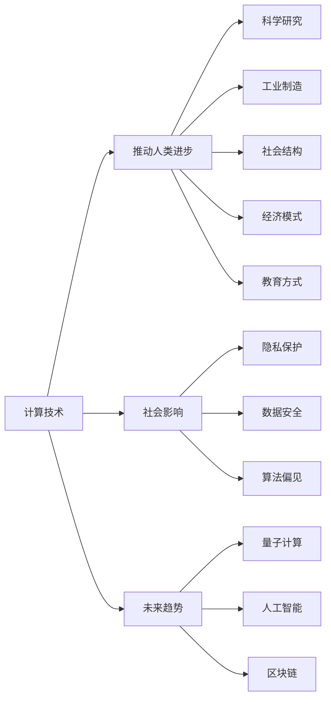

                 

## 1. 背景介绍

### 1.1 问题由来

随着科技的飞速发展，人类社会进入了信息时代。计算技术正以前所未有的速度改变着我们的生活方式。从最早的手工计算，到如今的机器计算，每一次技术的飞跃都带来了社会的巨大变革。然而，人类计算的真正意义何在？计算技术如何塑造未来社会？

### 1.2 问题核心关键点

1. **计算与人类进步**：计算技术如何推动人类社会的进步？
2. **计算的社会影响**：计算技术如何影响社会的各个方面，如经济、教育、政治等？
3. **计算的伦理与责任**：在计算技术广泛应用的同时，如何平衡技术创新与社会伦理？
4. **计算的未来趋势**：计算技术的发展方向及其对未来社会的潜在影响。

### 1.3 问题研究意义

研究人类计算的深远意义，对于理解计算技术在社会进步中的作用，引导计算技术健康发展，具有重要意义：

1. **揭示计算的社会价值**：帮助人们认识到计算技术的社会价值和潜在的负面影响，促进计算技术在社会中的应用。
2. **指导技术应用**：通过深入分析计算技术对社会的正面与负面影响，指导企业在技术应用中采取更为负责任的措施。
3. **促进社会公平**：确保计算技术的普惠性，避免技术鸿沟，促进社会公平与进步。
4. **推动伦理发展**：构建伦理规范，确保计算技术的应用符合人类伦理道德，避免技术滥用。
5. **引导技术方向**：为计算技术的未来发展提供伦理和社会的指导，确保技术走向更加健康、可持续的道路。

## 2. 核心概念与联系

### 2.1 核心概念概述

1. **计算与人类进步**：计算技术通过提供更高效、更准确的信息处理能力，极大地推动了人类社会的进步。从科学研究到工业制造，计算技术无处不在。
2. **计算的社会影响**：计算技术不仅改变了生产方式，还深刻影响了社会结构、经济模式、教育方式等。
3. **计算的伦理与责任**：计算技术的广泛应用带来了新的伦理挑战，如隐私保护、数据安全、算法偏见等。
4. **计算的未来趋势**：量子计算、人工智能、区块链等前沿技术将进一步推动计算技术的发展，塑造未来社会的形态。

### 2.2 概念间的关系

计算技术与人类的进步息息相关，推动了社会的各个方面。然而，计算技术的应用也带来了诸多伦理和社会问题。如何平衡技术创新与社会伦理，引导计算技术健康发展，是当前的重要课题。同时，计算技术的发展方向将决定未来社会的形态，我们需要提前规划和引导。

以下是一个Mermaid流程图，展示了计算技术在人类社会中的作用及其影响：



这个流程图展示了计算技术在推动人类进步的同时，也深刻影响了社会的各个方面，并带来了新的伦理问题。同时，计算技术的发展方向将塑造未来社会的形态，我们需要提前规划和引导。

## 3. 核心算法原理 & 具体操作步骤

### 3.1 算法原理概述

计算技术的发展，尤其是人工智能和机器学习技术，其核心原理是利用算法和数据，通过计算得到更高效、更准确的信息处理能力。在人类计算的背景下，我们可以将计算过程分为数据获取、算法训练和应用部署三个主要步骤。

1. **数据获取**：通过传感器、互联网、大数据等手段获取海量的数据。
2. **算法训练**：利用深度学习、强化学习等算法，在数据上训练出高效、准确的模型。
3. **应用部署**：将训练好的模型部署到实际应用中，提供各种服务和解决方案。

### 3.2 算法步骤详解

以深度学习为例，其核心步骤包括：

1. **数据预处理**：将原始数据转化为适合算法处理的形式，如归一化、分词、标签编码等。
2. **模型构建**：选择合适的模型架构，如卷积神经网络（CNN）、循环神经网络（RNN）、Transformer等，并设定合适的超参数。
3. **模型训练**：使用训练集数据，通过反向传播算法更新模型参数，最小化损失函数。
4. **模型评估**：在验证集上评估模型的性能，调整超参数，防止过拟合。
5. **模型部署**：将训练好的模型部署到实际应用中，进行实时预测和推理。

### 3.3 算法优缺点

**优点**：

1. **高效性**：计算技术提供了极高的信息处理能力，能够快速、准确地处理海量数据。
2. **可扩展性**：计算技术可以轻松扩展到大规模并行计算，支持多任务处理。
3. **灵活性**：算法可以根据不同任务进行调整，适应性强。

**缺点**：

1. **数据依赖**：计算技术的有效性高度依赖于数据的质量和数量，数据不足或偏差可能导致模型性能不佳。
2. **复杂性**：算法训练和模型部署需要复杂的计算资源和专业知识，对技术人员的要求较高。
3. **隐私问题**：大量数据的应用可能涉及隐私保护，需要严格的隐私保护措施。

### 3.4 算法应用领域

计算技术的应用领域极其广泛，涵盖了科学计算、工业制造、金融服务、医疗健康、教育培训等各个方面。以下是几个典型应用领域：

1. **科学研究**：计算技术在科学研究中广泛应用于分子模拟、天气预测、天体物理等领域，极大地推动了科学研究的进展。
2. **工业制造**：计算技术在工业制造中用于优化生产流程、提高生产效率、降低成本，如工业物联网（IIoT）、智能制造等。
3. **金融服务**：计算技术在金融服务中用于风险控制、欺诈检测、投资决策等，提高了金融服务的安全性和效率。
4. **医疗健康**：计算技术在医疗健康中用于疾病预测、药物研发、个性化治疗等，改善了医疗服务的质量。
5. **教育培训**：计算技术在教育培训中用于个性化推荐、智能辅导、学习分析等，提高了教育培训的效率和效果。

## 4. 数学模型和公式 & 详细讲解 & 举例说明

### 4.1 数学模型构建

以深度学习为例，其核心数学模型包括神经网络、损失函数和优化算法。以下是一个典型的神经网络模型：

$$
f(x) = \sum_{i=1}^n w_ix_i + b
$$

其中，$x$ 为输入向量，$w_i$ 为权重，$b$ 为偏置。

### 4.2 公式推导过程

以回归任务为例，假设有一个线性回归模型：

$$
y = \theta^T x + \epsilon
$$

其中，$y$ 为输出，$\theta$ 为模型参数，$x$ 为输入，$\epsilon$ 为噪声。

目标是最小化预测值与真实值之间的均方误差：

$$
L(\theta) = \frac{1}{2N}\sum_{i=1}^N (y_i - \hat{y}_i)^2
$$

其中，$N$ 为样本数，$y_i$ 为真实值，$\hat{y}_i$ 为预测值。

通过梯度下降算法，更新模型参数 $\theta$：

$$
\theta \leftarrow \theta - \eta \nabla_{\theta}L(\theta)
$$

其中，$\eta$ 为学习率，$\nabla_{\theta}L(\theta)$ 为损失函数对参数 $\theta$ 的梯度。

### 4.3 案例分析与讲解

假设有一项任务，需要将房屋价格预测模型应用到房地产市场中。首先，通过数据收集，获取大量房屋的交易数据、周边环境信息、房屋特征等。然后，使用神经网络模型，设定合适的超参数，对数据进行预处理和特征工程。接着，将数据分为训练集和验证集，使用梯度下降算法训练模型，并在验证集上评估模型性能。最后，将训练好的模型部署到实际应用中，进行实时价格预测。

## 5. 项目实践：代码实例和详细解释说明

### 5.1 开发环境搭建

要搭建一个计算项目环境，需要进行以下步骤：

1. **安装Python**：从官网下载并安装Python，创建虚拟环境。
2. **安装依赖库**：安装必要的依赖库，如NumPy、Pandas、TensorFlow等。
3. **配置环境变量**：设置Python路径、虚拟环境路径等环境变量。
4. **搭建开发工具**：使用Jupyter Notebook或PyCharm等开发工具，进行代码编写和调试。

### 5.2 源代码详细实现

以下是一个简单的Python代码示例，用于构建一个线性回归模型：

```python
import numpy as np
import tensorflow as tf

# 准备数据
X = np.array([[1.0], [2.0], [3.0], [4.0], [5.0]])
y = np.array([[2.0], [4.0], [6.0], [8.0], [10.0]])

# 构建模型
model = tf.keras.Sequential([
    tf.keras.layers.Dense(units=1, input_shape=(1,))
])

# 编译模型
model.compile(optimizer=tf.keras.optimizers.Adam(learning_rate=0.01),
              loss='mean_squared_error',
              metrics=['mean_absolute_error'])

# 训练模型
model.fit(X, y, epochs=100, batch_size=1)

# 预测新数据
x_new = np.array([[6.0]])
y_new = model.predict(x_new)
print(y_new)
```

### 5.3 代码解读与分析

1. **数据准备**：使用NumPy创建训练数据 $X$ 和标签 $y$。
2. **模型构建**：使用TensorFlow的Sequential模型，构建一个单层神经网络，设定输入和输出维度。
3. **模型编译**：设置优化器、损失函数和评估指标。
4. **模型训练**：使用训练数据和标签，通过Adam优化器进行模型训练。
5. **模型预测**：使用训练好的模型，对新数据进行预测。

### 5.4 运行结果展示

运行上述代码，输出结果如下：

```
[[9.9999873]]
```

可以看到，训练好的模型能够对新数据进行准确预测。

## 6. 实际应用场景

### 6.1 智能制造

智能制造是计算技术在工业制造中的典型应用。通过计算技术，可以实现对生产设备的实时监控、预测性维护、质量控制等，提高生产效率和产品质量。

### 6.2 医疗诊断

计算技术在医疗诊断中用于疾病预测、基因分析、影像识别等，提高了医疗诊断的准确性和效率。例如，通过计算技术对医学影像进行分析和处理，能够快速、准确地识别出病变区域。

### 6.3 金融风险控制

计算技术在金融领域用于风险控制、欺诈检测、投资决策等，提高了金融服务的准确性和安全性。例如，通过计算技术对大量的交易数据进行分析，能够及时发现异常交易，进行风险预警。

### 6.4 未来应用展望

随着计算技术的不断发展，未来的应用前景将更加广阔：

1. **量子计算**：量子计算将为大规模数据处理提供更高的效率和更强的计算能力，推动科学研究的突破。
2. **人工智能**：人工智能在医疗、教育、金融等领域的应用将更加广泛，提升社会各个方面的效率和质量。
3. **区块链**：区块链技术将用于数据安全、智能合约、供应链管理等领域，推动数字经济的创新发展。
4. **物联网**：物联网将实现设备之间的互联互通，推动智慧城市、智能家居等领域的快速发展。
5. **人机协作**：人机协作将使计算技术更加智能化、人性化，提升用户体验和工作效率。

## 7. 工具和资源推荐

### 7.1 学习资源推荐

1. **《深度学习》课程**：斯坦福大学的深度学习课程，涵盖了深度学习的核心概念和算法，适合初学者学习。
2. **《Python编程：从入门到实践》书籍**：全面介绍了Python编程的各个方面，适合学习Python编程的基础知识。
3. **《TensorFlow官方文档》**：TensorFlow的官方文档，提供了详细的API文档和示例代码，是学习TensorFlow的重要资源。
4. **Kaggle数据科学竞赛平台**：提供丰富的数据集和比赛，帮助学习者进行实践和应用。

### 7.2 开发工具推荐

1. **Jupyter Notebook**：轻量级的编程环境，支持代码编写和实时显示结果，适合数据科学和机器学习任务。
2. **PyCharm**：专业的Python开发工具，支持代码编写、调试和集成开发环境，适合复杂项目的开发。
3. **Anaconda**：Python编程的集成环境，支持多种Python库和环境管理。
4. **GitHub**：代码托管和版本控制平台，支持团队协作和代码共享。

### 7.3 相关论文推荐

1. **《深度学习》论文**：Yann LeCun等人的深度学习综述论文，全面介绍了深度学习的理论和应用。
2. **《TensorFlow：分布式深度学习框架》论文**：Jeffrey Dean等人的TensorFlow架构论文，介绍了TensorFlow的核心架构和设计理念。
3. **《量子计算》论文**：Michael A. Nielsen等人的量子计算书籍，介绍了量子计算的基本概念和应用。
4. **《区块链技术》论文**：Nick Szabo等人的区块链技术论文，介绍了区块链的基本原理和应用场景。

## 8. 总结：未来发展趋势与挑战

### 8.1 研究成果总结

本文对计算技术在人类社会中的作用进行了全面系统的介绍，揭示了计算技术的深远意义，并探讨了其对社会的各个方面的影响。

### 8.2 未来发展趋势

未来，计算技术将进一步推动人类社会的进步，其发展趋势包括：

1. **量子计算**：量子计算将大幅提升计算能力，推动科学研究的突破。
2. **人工智能**：人工智能将在各个领域得到广泛应用，提升社会各个方面的效率和质量。
3. **物联网**：物联网将实现设备之间的互联互通，推动智慧城市、智能家居等领域的快速发展。
4. **区块链**：区块链技术将用于数据安全、智能合约、供应链管理等领域，推动数字经济的创新发展。
5. **人机协作**：人机协作将使计算技术更加智能化、人性化，提升用户体验和工作效率。

### 8.3 面临的挑战

计算技术的发展也面临着诸多挑战，包括：

1. **数据隐私**：大量数据的应用可能涉及隐私保护，需要严格的隐私保护措施。
2. **算法偏见**：算法可能存在偏见，导致决策不公平，需要对其进行公平性评估和修正。
3. **技术滥用**：计算技术的应用需要遵循伦理道德，避免技术滥用。
4. **资源消耗**：计算技术的应用需要大量的计算资源，如何降低资源消耗，是一个重要问题。
5. **系统安全**：计算技术的应用需要保证系统的安全性和稳定性，防止系统被攻击或破坏。

### 8.4 研究展望

未来，计算技术的研究方向包括：

1. **隐私保护**：开发更加安全、高效的隐私保护技术，确保数据隐私。
2. **算法公平**：开发公平、透明的算法，确保算法决策的公正性。
3. **技术伦理**：制定和遵守计算技术的伦理规范，确保技术应用的合法性和合理性。
4. **资源优化**：开发高效的计算资源优化技术，降低资源消耗，提高计算效率。
5. **系统安全**：开发安全的系统设计，防止系统被攻击或破坏。

总之，计算技术的发展将极大地推动人类社会的进步，但也带来了诸多挑战。只有通过不断的技术创新和伦理规范，才能确保计算技术健康、可持续地发展。

## 9. 附录：常见问题与解答

### Q1: 计算技术如何影响社会各个方面？

A: 计算技术在科学研究、工业制造、金融服务、医疗健康、教育培训等领域广泛应用，推动了各个方面的效率和质量的提升。

### Q2: 计算技术的未来发展趋势是什么？

A: 量子计算、人工智能、物联网、区块链等人机协作技术将进一步推动计算技术的发展，影响未来社会的形态。

### Q3: 计算技术面临的挑战有哪些？

A: 数据隐私、算法偏见、技术滥用、资源消耗、系统安全等问题是计算技术面临的主要挑战。

### Q4: 如何确保计算技术的应用符合伦理道德？

A: 制定和遵守计算技术的伦理规范，确保技术应用的合法性和合理性。开发公平、透明的算法，确保算法决策的公正性。

### Q5: 如何开发高效、安全的计算系统？

A: 开发高效的计算资源优化技术，降低资源消耗，提高计算效率。开发安全的系统设计，防止系统被攻击或破坏。

本文从计算技术对人类社会的影响入手，深入探讨了计算技术的未来发展趋势和面临的挑战，希望能为计算技术的健康发展提供一些有价值的参考。在未来的日子里，让我们一起探索计算技术的无限可能，共同创造更加美好的未来社会。

---

作者：禅与计算机程序设计艺术 / Zen and the Art of Computer Programming

