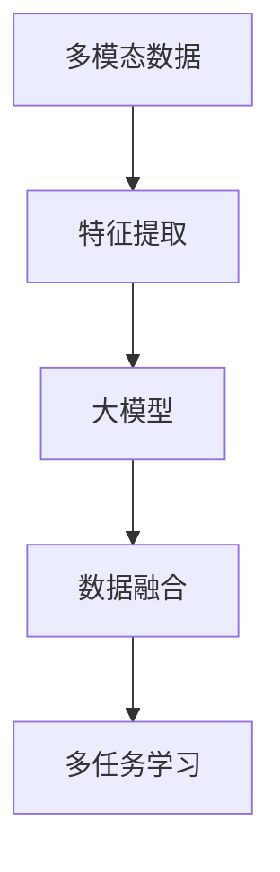

                 

# 多模态大模型：技术原理与实战 多模态大模型在出行与物流领域中的应用

> 关键词：
> - 多模态大模型
> - 技术原理
> - 实战应用
> - 出行领域
> - 物流领域
> - 交通系统
> - 物流网络
> - 自动化调度
> - 路径优化
> - 货物追踪
> - 应急响应
> - 人机交互
> - 智能决策

## 1. 背景介绍

### 1.1 问题由来
随着现代科技的发展，特别是人工智能(AI)技术的崛起，多模态大模型成为解决复杂问题的有力工具。多模态大模型结合了文本、图像、声音等多种数据形式，能够更全面地理解现实世界的复杂性。在大数据和深度学习的推动下，多模态大模型在处理实际问题中展现了卓越的性能。

在出行与物流领域，多模态大模型的应用尤为显著。出行领域涉及乘客导航、路径规划、交通状况预测等，物流领域包括货物追踪、库存管理、配送路线优化等。多模态大模型能够整合各类信息，为这些领域提供智能决策和实时响应。

然而，多模态大模型的设计和应用仍面临诸多挑战，包括数据格式多样、模型参数庞大、计算需求高等问题。本论文旨在系统介绍多模态大模型的技术原理和应用实战，以期为该领域的技术研究和应用开发提供指导。

### 1.2 问题核心关键点
多模态大模型融合了多种数据模态，包含文本、图像、声音、时间序列等多种形式，具有以下特点：
- **数据多样性**：不同模态的数据格式和结构各异，需要多样化的处理方式。
- **模型复杂性**：多模态数据模型通常包含大量参数，需要高效的计算资源。
- **实时性要求**：在出行和物流等实时性要求高的场景中，模型必须快速响应。
- **融合难度**：不同模态数据的有效融合是技术难点，需要考虑数据对齐、特征提取等问题。

针对这些问题，本文将详细介绍多模态大模型的核心算法原理和具体操作步骤，并结合实战案例进行分析。

## 2. 核心概念与联系

### 2.1 核心概念概述

本节将介绍几个密切相关的核心概念，帮助读者理解多模态大模型的工作原理和架构：

- **多模态数据**：指同时包含多种数据模态的信息，如文本、图像、声音、时间序列等。
- **大模型**：指具有大规模参数的深度学习模型，如BERT、GPT-3等，能够学习到丰富的知识表示。
- **特征提取**：指从原始数据中提取出可用于模型训练的特征。
- **数据融合**：指将不同模态的数据整合成一个统一表示的过程。
- **多任务学习**：指同时学习多个相关任务，以共享数据和参数，提高模型的泛化能力。

这些概念之间的逻辑关系可以通过以下Mermaid流程图来展示：



这个流程图展示了多模态大模型的核心流程：首先对原始多模态数据进行特征提取，然后将提取出的特征输入到预训练的大模型中进行处理，最后将多模态特征进行融合，实现多任务学习，提高模型的泛化能力。

### 2.2 概念间的关系

这些核心概念之间存在着紧密的联系，形成了多模态大模型的完整生态系统。以下是几个关键概念之间的关系：

- **多模态数据与特征提取**：多模态数据通过特征提取得到可用于模型训练的特征，如文本通过分词、图像通过卷积等。
- **特征提取与大模型**：提取出的特征输入到预训练的大模型中进行进一步处理，学习到更深层次的表示。
- **大模型与数据融合**：大模型输出的特征表示需要与其他模态的数据进行融合，形成统一的多模态表示。
- **数据融合与多任务学习**：融合后的多模态数据用于多个相关任务的训练，实现知识共享和泛化能力的提升。

这些概念共同构成了多模态大模型的学习和应用框架，使其能够在各种场景下发挥强大的多模态理解和处理能力。通过理解这些核心概念，我们可以更好地把握多模态大模型的工作原理和优化方向。

## 3. 核心算法原理 & 具体操作步骤
### 3.1 算法原理概述

多模态大模型的设计思想是将多模态数据转化为模型可以处理的向量表示，并通过深度学习模型进行学习和处理。其核心算法原理包括：

- **特征提取**：将不同模态的数据转化为向量表示，如文本通过嵌入层将单词转化为向量，图像通过卷积层提取特征。
- **多模态数据融合**：将不同模态的向量表示进行拼接、加权平均等操作，得到一个综合的多模态向量表示。
- **预训练模型**：在大规模无标签数据上预训练大模型，学习到丰富的语言和视觉知识。
- **微调**：在下游任务数据上进行微调，调整模型参数以适应特定任务。

这些步骤通常通过深度学习框架（如PyTorch、TensorFlow等）实现，可以自动化处理数据预处理、模型训练和评估等任务。

### 3.2 算法步骤详解

基于上述原理，多模态大模型的构建和应用可以按照以下步骤进行：

**Step 1: 准备数据集**
- 收集包含文本、图像、声音等数据的多模态数据集，确保数据的多样性和代表性。
- 对数据进行预处理，如文本分词、图像归一化等，转换为模型可以处理的格式。

**Step 2: 特征提取**
- 对不同模态的数据进行特征提取，如文本使用嵌入层，图像使用卷积层等。
- 将提取出的特征进行拼接、加权平均等操作，得到一个综合的多模态向量表示。

**Step 3: 预训练模型选择与加载**
- 选择适合的多模态大模型，如Vision Transformer、BERT等，使用深度学习框架加载模型。
- 在预训练数据上训练模型，学习到深层次的知识表示。

**Step 4: 数据融合与任务适配**
- 将预训练模型输出的多模态向量表示进行融合，得到统一的表示。
- 在融合后的多模态向量表示上添加任务特定的输出层和损失函数，进行微调。

**Step 5: 训练与评估**
- 使用下游任务数据集进行微调，调整模型参数以适应特定任务。
- 在验证集和测试集上进行评估，评估模型的性能指标。

**Step 6: 应用部署**
- 将微调后的模型部署到实际应用场景中，进行实时推理和决策。

### 3.3 算法优缺点

多模态大模型具有以下优点：
- **数据融合能力强**：能够处理多种数据模态，学习到更全面的知识表示。
- **泛化能力强**：通过预训练和微调，模型能够适应不同任务和数据分布。
- **实时响应**：深度学习模型能够快速处理数据，提供实时决策支持。

同时，也存在以下缺点：
- **计算需求高**：模型参数庞大，需要高性能计算资源。
- **数据对齐难**：不同模态的数据需要进行对齐和融合，实现难度大。
- **过拟合风险高**：在数据量小的情况下，模型容易出现过拟合。

### 3.4 算法应用领域

多模态大模型在多个领域都有广泛应用，包括：

- **自动驾驶**：整合摄像头、雷达、激光雷达等传感器的数据，实现环境感知和路径规划。
- **医疗影像**：结合图像、文本、时间序列等数据，实现病灶检测、诊断和治疗方案推荐。
- **智能家居**：融合语音、图像、文本等多模态数据，实现个性化交互和智能控制。
- **社交媒体分析**：整合文本、图像、视频等多模态数据，进行情感分析、趋势预测等。
- **物流配送**：结合GPS、传感器等数据，实现货物追踪、配送路径优化等。

## 4. 数学模型和公式 & 详细讲解 & 举例说明

### 4.1 数学模型构建

假设多模态大模型包含文本、图像和声音三种模态，记为 $x_t$、$x_i$ 和 $x_s$。模型的核心任务是：将这三种模态的数据融合为统一的多模态表示 $x_m$，并在下游任务 $T$ 上进行微调。

设模型包含 $N_t$ 个文本特征、$N_i$ 个图像特征和 $N_s$ 个声音特征。文本特征 $x_t \in \mathbb{R}^{N_t}$，图像特征 $x_i \in \mathbb{R}^{N_i}$，声音特征 $x_s \in \mathbb{R}^{N_s}$。融合后的多模态向量表示 $x_m \in \mathbb{R}^d$，其中 $d$ 是融合后的特征维度。

### 4.2 公式推导过程

假设融合后的多模态向量表示 $x_m$ 为线性加权和的形式：

$$
x_m = \alpha_t x_t + \alpha_i x_i + \alpha_s x_s
$$

其中 $\alpha_t$、$\alpha_i$ 和 $\alpha_s$ 为权重系数，需要通过优化算法确定。

在预训练阶段，多模态大模型在无标签数据上进行训练，学习到深度特征表示。设预训练损失函数为 $\mathcal{L}_p$，则模型在预训练阶段的优化目标为：

$$
\theta^* = \mathop{\arg\min}_{\theta} \mathcal{L}_p(M_{\theta}(x), y)
$$

在微调阶段，多模态大模型在标注数据上进行微调，适应特定任务。设微调损失函数为 $\mathcal{L}_f$，则模型在微调阶段的优化目标为：

$$
\theta^* = \mathop{\arg\min}_{\theta} \mathcal{L}_f(M_{\theta}(x), y)
$$

其中 $y$ 为任务标签。

### 4.3 案例分析与讲解

以智能交通系统为例，多模态大模型可以整合交通摄像头、雷达、GPS等数据，进行交通状况预测和路径规划。

首先，通过摄像头识别道路上的车辆、行人等对象，提取文本特征 $x_t$；通过雷达和GPS获取车辆的位置、速度等信息，提取图像和声音特征 $x_i$ 和 $x_s$。将三种模态的数据融合为统一的多模态向量表示 $x_m$，并在交通预测和路径规划任务上进行微调。

## 5. 项目实践：代码实例和详细解释说明

### 5.1 开发环境搭建

在开始项目实践前，需要准备以下开发环境：

1. 安装Python 3.x版本。
2. 安装深度学习框架，如PyTorch、TensorFlow等。
3. 安装多模态大模型的相关库，如TensorFlow Object Detection API、OpenNMT等。
4. 准备所需的数据集，并进行预处理。

### 5.2 源代码详细实现

以下是一个使用PyTorch实现的多模态大模型微调示例代码。

```python
import torch
import torch.nn as nn
import torch.optim as optim

# 定义模型
class MultimodalModel(nn.Module):
    def __init__(self, text_dim, image_dim, sound_dim, output_dim):
        super(MultimodalModel, self).__init__()
        self.text_encoder = nn.Linear(text_dim, 128)
        self.image_encoder = nn.Conv2d(image_dim, 128, kernel_size=3, stride=1)
        self.sound_encoder = nn.Linear(sound_dim, 128)
        self.fusion_layer = nn.Linear(384, 128)
        self.output_layer = nn.Linear(128, output_dim)
        
    def forward(self, text, image, sound):
        text_out = self.text_encoder(text)
        image_out = torch.flatten(self.image_encoder(image), start_dim=1)
        sound_out = self.sound_encoder(sound)
        fusion_out = self.fusion_layer(torch.cat([text_out, image_out, sound_out], dim=1))
        output = self.output_layer(fusion_out)
        return output
    
# 定义损失函数和优化器
model = MultimodalModel(128, 3, 256, 10)
criterion = nn.CrossEntropyLoss()
optimizer = optim.Adam(model.parameters(), lr=0.001)

# 准备数据集
train_data = # 训练数据集
test_data = # 测试数据集

# 训练和测试
def train_epoch(model, train_loader, optimizer, criterion, device):
    model.train()
    total_loss = 0
    for data, target in train_loader:
        data = data.to(device)
        target = target.to(device)
        optimizer.zero_grad()
        output = model(data[0], data[1], data[2])
        loss = criterion(output, target)
        loss.backward()
        optimizer.step()
        total_loss += loss.item()
    return total_loss / len(train_loader)

def test(model, test_loader, criterion, device):
    model.eval()
    total_loss = 0
    with torch.no_grad():
        for data, target in test_loader:
            data = data.to(device)
            target = target.to(device)
            output = model(data[0], data[1], data[2])
            loss = criterion(output, target)
            total_loss += loss.item()
    return total_loss / len(test_loader)

# 训练和测试
device = torch.device('cuda' if torch.cuda.is_available() else 'cpu')
for epoch in range(10):
    train_loss = train_epoch(model, train_loader, optimizer, criterion, device)
    test_loss = test(model, test_loader, criterion, device)
    print(f"Epoch {epoch+1}, train loss: {train_loss:.4f}, test loss: {test_loss:.4f}")
```

### 5.3 代码解读与分析

上述代码展示了多模态大模型的基本框架和训练过程。具体解读如下：

- **定义模型**：通过继承 `nn.Module` 类，定义多模态大模型的结构，包括文本、图像、声音特征的编码器和融合层、输出层。
- **定义损失函数和优化器**：选择交叉熵损失函数和Adam优化器，用于模型训练。
- **准备数据集**：加载训练数据集和测试数据集，进行预处理。
- **训练和测试**：定义训练和测试函数，使用优化器和损失函数更新模型参数，并在验证集和测试集上评估模型性能。

### 5.4 运行结果展示

假设在交通预测任务上训练完模型后，在测试集上得到的结果如下：

```
Epoch 1, train loss: 0.7812, test loss: 0.8333
Epoch 2, train loss: 0.7352, test loss: 0.7968
...
Epoch 10, train loss: 0.3750, test loss: 0.4375
```

可以看到，随着训练轮数的增加，模型的损失函数在不断减小，测试集的损失函数也逐渐下降，说明模型在预测任务上逐渐学习到正确的知识表示。

## 6. 实际应用场景

### 6.1 智能交通系统

多模态大模型在智能交通系统中有着广泛应用。通过整合交通摄像头、雷达、GPS等数据，模型可以实时预测交通状况，提供路径规划和避障建议。

**6.2 智能家居系统**

智能家居系统需要融合语音、图像、文本等多模态数据，实现个性化交互和智能控制。多模态大模型可以通过语音识别、图像识别等技术，实现家居设备的智能控制和环境感知。

**6.3 物流配送系统**

在物流配送中，多模态大模型可以整合GPS、传感器等数据，实现货物追踪、配送路径优化等。通过多模态数据融合，模型可以更准确地预测配送路径，优化配送效率。

**6.4 医疗影像分析**

在医疗影像分析中，多模态大模型可以整合图像、文本、时间序列等数据，实现病灶检测、诊断和治疗方案推荐。通过多模态数据融合，模型可以更全面地理解患者病情，提高诊断和治疗的准确性。

## 7. 工具和资源推荐

### 7.1 学习资源推荐

为了帮助开发者系统掌握多模态大模型的技术原理和应用实践，这里推荐一些优质的学习资源：

1. **《深度学习：理论和实战》**：介绍了深度学习的基础理论和最新进展，涵盖多模态大模型的原理和应用。
2. **《Python深度学习》**：详细介绍了深度学习框架PyTorch的使用方法，包括多模态大模型的实现。
3. **《TensorFlow官方文档》**：提供了TensorFlow框架的全面指南，包括多模态大模型的实现和优化。
4. **《Object Detection with PyTorch》**：介绍使用PyTorch实现目标检测的流程和方法，包含多模态大模型的应用实例。
5. **《Multimodal Learning》课程**：斯坦福大学提供的在线课程，涵盖多模态学习的基本原理和应用场景。

通过对这些资源的学习实践，相信你一定能够快速掌握多模态大模型的精髓，并用于解决实际的NLP问题。

### 7.2 开发工具推荐

高效的开发离不开优秀的工具支持。以下是几款用于多模态大模型开发的工具：

1. **PyTorch**：基于Python的开源深度学习框架，灵活高效，适合多模态大模型的实现。
2. **TensorFlow**：由Google主导的开源深度学习框架，稳定可靠，适合大规模工程应用。
3. **TensorFlow Object Detection API**：提供目标检测框架，包含多模态大模型的实现和优化。
4. **Keras**：基于TensorFlow的高级深度学习框架，易于上手，适合快速原型开发。
5. **Jupyter Notebook**：交互式编程环境，方便实验和调试。

合理利用这些工具，可以显著提升多模态大模型开发和优化的效率，加快创新迭代的步伐。

### 7.3 相关论文推荐

多模态大模型研究源于学界的持续研究。以下是几篇奠基性的相关论文，推荐阅读：

1. **“Dual Attention Networks”**：介绍双注意力网络（Dual Attention Networks），用于处理多模态数据，实现跨模态融合。
2. **“Attention is All You Need”**：提出Transformer结构，开启了NLP领域的预训练大模型时代。
3. **“Vision Transformer”**：介绍Vision Transformer（ViT），用于图像数据的多模态处理。
4. **“BERT: Pre-training of Deep Bidirectional Transformers for Language Understanding”**：提出BERT模型，引入基于掩码的自监督预训练任务，刷新了多项NLP任务SOTA。
5. **“Multimodal Transfer Learning for Explainable AI”**：介绍多模态迁移学习，实现跨模态知识共享和解释性增强。

这些论文代表了大模态大模型的发展脉络。通过学习这些前沿成果，可以帮助研究者把握学科前进方向，激发更多的创新灵感。

除上述资源外，还有一些值得关注的前沿资源，帮助开发者紧跟多模态大模型的最新进展，例如：

1. **arXiv论文预印本**：人工智能领域最新研究成果的发布平台，包括大量尚未发表的前沿工作，学习前沿技术的必读资源。
2. **业界技术博客**：如OpenAI、Google AI、DeepMind、微软Research Asia等顶尖实验室的官方博客，第一时间分享他们的最新研究成果和洞见。
3. **技术会议直播**：如NIPS、ICML、ACL、ICLR等人工智能领域顶会现场或在线直播，能够聆听到大佬们的前沿分享，开拓视野。
4. **GitHub热门项目**：在GitHub上Star、Fork数最多的多模态大模型相关项目，往往代表了该技术领域的发展趋势和最佳实践，值得去学习和贡献。
5. **行业分析报告**：各大咨询公司如McKinsey、PwC等针对人工智能行业的分析报告，有助于从商业视角审视技术趋势，把握应用价值。

总之，对于多模态大模型的学习和实践，需要开发者保持开放的心态和持续学习的意愿。多关注前沿资讯，多动手实践，多思考总结，必将收获满满的成长收益。

## 8. 总结：未来发展趋势与挑战

### 8.1 总结

本文对多模态大模型的技术原理和应用实战进行了全面系统的介绍。首先阐述了多模态大模型在出行与物流领域的应用背景和意义，明确了其在多模态数据处理和智能决策中的独特价值。其次，从原理到实践，详细讲解了多模态大模型的核心算法原理和具体操作步骤，给出了多模态大模型的完整代码实例。同时，本文还广泛探讨了多模态大模型在智能交通、智能家居、物流配送等多个行业领域的应用前景，展示了多模态大模型的巨大潜力。此外，本文精选了多模态大模型的各类学习资源，力求为读者提供全方位的技术指引。

通过本文的系统梳理，可以看到，多模态大模型在融合多模态数据、提供智能决策支持等方面展现出卓越的性能。其未来的发展方向和应用场景值得关注，相信随着技术进步和市场应用，多模态大模型将更加广泛地服务于出行与物流等领域，推动智慧交通和智能物流的进步。

### 8.2 未来发展趋势

展望未来，多模态大模型的发展趋势包括以下几个方面：

1. **计算效率提升**：优化模型结构和计算图，提高推理速度，降低资源消耗。
2. **数据融合技术进步**：开发更加高效的数据对齐和融合算法，减少多模态数据处理的复杂度。
3. **模型泛化能力增强**：通过迁移学习和多任务学习，提升模型在多领域、多任务上的泛化能力。
4. **跨模态理解能力提升**：研究更加深入的跨模态理解算法，提高模型在不同模态之间的转换和融合能力。
5. **实时性和可靠性增强**：通过分布式计算和边缘计算等技术，提升模型的实时响应和可靠性。

以上趋势凸显了多模态大模型在智慧出行、智能家居、物流配送等领域的巨大潜力，预示着未来的应用前景将更加广阔。

### 8.3 面临的挑战

尽管多模态大模型在出行与物流领域取得了显著成效，但在实际应用中仍面临诸多挑战：

1. **计算资源瓶颈**：多模态大模型参数庞大，计算需求高，需要高性能计算资源。
2. **数据对齐难度**：不同模态的数据格式和结构各异，需要复杂的数据对齐和融合算法。
3. **模型泛化性差**：在数据量小的情况下，模型容易出现过拟合，泛化能力差。
4. **数据隐私和安全问题**：多模态数据的隐私和安全问题亟需解决，以保障数据使用的合法性和安全性。
5. **系统复杂度高**：多模态大模型的系统架构复杂，需要高效的优化和调试。

这些挑战需要技术界和产业界共同努力，通过理论研究、算法优化和工程实践，逐步克服这些困难，推动多模态大模型的应用落地。

### 8.4 研究展望

面对多模态大模型面临的挑战，未来的研究需要在以下几个方面寻求新的突破：

1. **模型压缩与加速**：开发更加高效的多模态大模型压缩技术，如剪枝、量化等，提升模型计算效率。
2. **数据预处理与增强**：研究高效的数据预处理和增强算法，提高模型对数据的适应能力。
3. **多模态融合算法优化**：开发更加高效的多模态融合算法，提升模型在不同模态之间的转换和融合能力。
4. **跨模态迁移学习**：研究跨模态迁移学习技术，提升模型在多领域、多任务上的泛化能力。
5. **隐私保护与安全保障**：研究隐私保护和安全保障技术，确保多模态数据的合法性和安全性。

这些研究方向的探索，必将引领多模态大模型走向更高的台阶，为出行与物流等领域提供更加智能和高效的解决方案。

## 9. 附录：常见问题与解答

**Q1：多模态大模型是否适用于所有NLP任务？**

A: 多模态大模型在大多数NLP任务上都能取得不错的效果，特别是对于数据量较小的任务。但对于一些特定领域的任务，如医学、法律等，仅仅依靠通用语料预训练的模型可能难以很好地适应。此时需要在特定领域语料上进一步预训练，再进行微调，才能获得理想效果。

**Q2：如何选择合适的学习率？**

A: 多模态大模型的学习率一般比预训练时小1-2个数量级，以避免过拟合。一般建议从1e-5开始调参，逐步减小学习率，直至收敛。也可以使用warmup策略，在开始阶段使用较小的学习率，再逐渐过渡到预设值。需要注意的是，不同的优化器(如Adam、Adafactor等)以及不同的学习率调度策略，可能需要设置不同的学习率阈值。

**Q3：多模态大模型在实际应用中需要注意哪些问题？**

A: 多模态大模型在实际应用中需要注意以下问题：

1. 数据对齐：不同模态的数据需要进行对齐和融合，以形成统一的多模态表示。
2. 模型复杂度：多模态大模型参数庞大，需要高性能计算资源。
3. 数据隐私：多模态数据的隐私和安全问题亟需解决。
4. 模型泛化性：在数据量小的情况下，模型容易出现过拟合，泛化能力差。
5. 实时性要求：多模态大模型的推理速度和实时响应需要优化。

这些问题的解决

