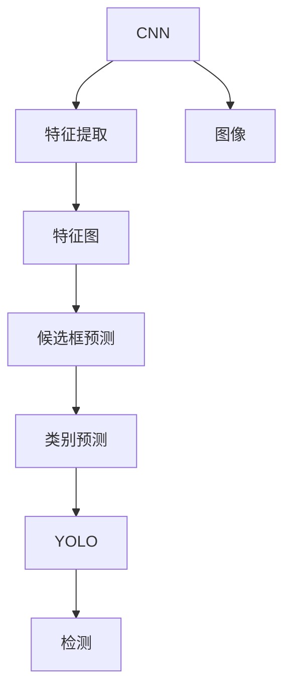

                 

# Python深度学习实践：手把手教你利用YOLO进行对象检测

> 关键词：YOLO,深度学习,对象检测,计算机视觉,卷积神经网络(CNN),特征图,物体边界框,损失函数

## 1. 背景介绍

### 1.1 问题由来
近年来，深度学习技术在计算机视觉领域取得了飞速的发展，尤其是在物体检测任务上，传统的手工特征工程方法逐渐被卷积神经网络（Convolutional Neural Networks, CNNs）所取代。通过大量标注数据对CNN进行训练，使得物体检测模型能够直接从原始图像中学习到物体的特征，实现端到端的检测。

目前，主流的物体检测方法大致可以分为两大类：基于区域提取的算法（如R-CNN、Fast R-CNN、Faster R-CNN等）和基于锚框的算法（如YOLO、SSD、YOLOv5等）。这两种方法各有优缺点，前者检测精度高但速度较慢，后者速度较快但检测精度略逊一筹。

YOLO（You Only Look Once）是一种基于锚框的对象检测方法，由Joseph Redmon等人在2016年提出。YOLO的核心理念是在一个网络中进行端到端的训练，将物体检测问题转换为一个回归问题，通过一个卷积层输出特征图来预测物体类别和边界框。YOLO的显著优势在于速度快，能够实时处理视频流数据，适用于对检测速度要求较高的应用场景。

### 1.2 问题核心关键点
YOLO算法主要包括三个部分：

- **特征提取**：使用卷积神经网络提取图像特征，得到特征图。
- **候选框预测**：在特征图上预测出物体边界框。
- **类别预测**：对每个候选框预测其类别概率。

YOLO的检测过程可以分为两个阶段：特征提取和候选框预测。在特征提取阶段，通过多个卷积层和池化层提取图像的特征，得到高层次的特征图。在候选框预测阶段，通过一组卷积层和全连接层对特征图进行预测，得到候选框的位置和类别。YOLO的目标是使每个像素点都能够预测出对应位置的物体类别和边界框，从而实现快速、实时的物体检测。

### 1.3 问题研究意义
YOLO算法在物体检测任务中表现优异，速度快、精度高，适用于各种实时应用场景，如自动驾驶、智能安防、机器人视觉等。深入理解YOLO算法的原理和应用，对于提升计算机视觉技术的性能和实用性具有重要意义。

## 2. 核心概念与联系

### 2.1 核心概念概述

为更好地理解YOLO算法的核心概念，本节将介绍几个关键概念及其联系：

- **卷积神经网络（CNN）**：一种前馈神经网络，主要用于图像处理和计算机视觉任务。通过卷积层和池化层对图像进行特征提取，能够学习到图像中物体的特征表示。

- **物体边界框（Bounding Box）**：表示物体在图像中的位置和大小，通常用坐标$(x, y, w, h)$表示，其中$(x, y)$为左上角坐标，$w$为宽度，$h$为高度。

- **类别预测（Class Prediction）**：使用softmax函数对每个候选框预测其对应的类别概率，通常使用交叉熵损失函数进行训练。

- **YOLO算法**：一种基于锚框的对象检测方法，通过单次前向传播实现快速物体检测。YOLO将图像分成多个网格，每个网格预测出固定数量的候选框，每个候选框预测其类别和边界框。

- **损失函数（Loss Function）**：用于衡量模型预测值与真实标签之间的差异。在YOLO中，通常使用交叉熵损失函数和平均绝对误差（MAE）损失函数。

这些核心概念之间存在着紧密的联系，构成了YOLO算法的完整框架。

### 2.2 概念间的关系

这些核心概念之间存在着紧密的联系，构成了YOLO算法的完整框架。



这个流程图展示了YOLO算法的基本流程：通过CNN对图像进行特征提取，得到特征图，然后对特征图进行候选框预测和类别预测，最终输出物体检测结果。其中，特征提取是YOLO算法的基础，候选框预测和类别预测是YOLO算法的核心，检测是YOLO算法的最终目标。

## 3. 核心算法原理 & 具体操作步骤
### 3.1 算法原理概述

YOLO算法的主要思想是将图像分成多个网格，每个网格预测固定数量的候选框，每个候选框预测其类别和边界框。YOLO的目标是使每个像素点都能够预测出对应位置的物体类别和边界框，从而实现快速、实时的物体检测。

YOLO算法采用多尺度预测的方式，对不同尺寸的物体进行检测。每个网格预测固定数量的候选框，每个候选框预测其类别和边界框。通过多个尺度进行预测，YOLO能够检测到不同尺寸的物体，并提高检测精度。

### 3.2 算法步骤详解

YOLO算法的训练和推理过程包括以下几个关键步骤：

**Step 1: 准备数据集**

- 收集标注好的物体检测数据集，包括图像、物体边界框和类别标签。
- 将图像按比例缩放，使其大小为指定尺寸。
- 对图像进行归一化处理，将其像素值缩放到$[0,1]$之间。
- 对物体边界框进行归一化处理，将其转化为相对于图像大小的比例值。

**Step 2: 设计YOLO模型**

- 设计YOLO模型架构，包括卷积层、池化层、全连接层等。
- 确定特征图的大小和数量，通常设置为$n \times n$，$n=13$。
- 确定每个网格预测的候选框数量，通常设置为$9$。
- 确定每个候选框预测的特征维度，通常为$5$。

**Step 3: 训练模型**

- 将数据集划分为训练集、验证集和测试集，通常按照$6:2:2$的比例划分。
- 使用随机梯度下降（SGD）或Adam等优化算法进行模型训练。
- 使用交叉熵损失函数和平均绝对误差（MAE）损失函数进行训练，交叉熵损失函数用于分类预测，MAE损失函数用于回归预测。
- 对训练集进行多尺度预测，每个尺度预测的候选框数量为$n \times n \times 9$，特征维度为$5$。

**Step 4: 预测与评估**

- 对测试集进行预测，得到每个网格的候选框和类别概率。
- 对预测结果进行后处理，将候选框和类别概率进行非极大值抑制（NMS）处理，得到最终的物体检测结果。
- 使用准确率（Accuracy）、召回率（Recall）、平均精度（AP）等指标对模型性能进行评估。

### 3.3 算法优缺点

YOLO算法具有以下优点：

1. **速度快**：YOLO采用单次前向传播进行预测，速度快，适用于实时应用场景。
2. **精度高**：YOLO多尺度预测，能够检测到不同尺寸的物体，并提高检测精度。
3. **模型简单**：YOLO结构简单，易于实现和调整。

YOLO算法也存在一些缺点：

1. **锚框数量固定**：YOLO每个网格预测的候选框数量为$9$，无法适应所有尺寸的物体。
2. **训练时间长**：YOLO模型大，参数多，训练时间长，需要大量计算资源。
3. **数据集要求高**：YOLO对数据集的要求较高，需要高质量、大量标注的图像数据。

### 3.4 算法应用领域

YOLO算法适用于各种实时应用场景，如自动驾驶、智能安防、机器人视觉等。

- **自动驾驶**：YOLO可用于检测道路上的行人、车辆、交通标志等，帮助自动驾驶车辆做出安全决策。
- **智能安防**：YOLO可用于监控视频中的人脸识别、行为分析等，提高安全防护水平。
- **机器人视觉**：YOLO可用于机器人的目标检测和识别，帮助机器人进行导航、操作等任务。

此外，YOLO算法还适用于视频分析、医学图像处理、工业检测等领域，具有广泛的应用前景。

## 4. 数学模型和公式 & 详细讲解 & 举例说明

### 4.1 数学模型构建

YOLO算法使用卷积神经网络（CNN）进行特征提取，得到特征图，然后在特征图上进行候选框预测和类别预测。

设输入图像大小为$H \times W$，将图像分成$n \times n$个网格，每个网格预测$9$个候选框，每个候选框预测其类别和边界框。令$k$为类别数量，$c$为每个候选框预测的特征维度，则YOLO模型输出的维度为$n \times n \times (9 \times (5+c))$。

### 4.2 公式推导过程

以单尺度预测为例，YOLO模型输出的第$i$个候选框的预测结果为：

$$
\left\{\begin{aligned}
& p_i &= \text{Softmax}(F_{i}) \\
& b_x &= \text{Sigmoid}(F_{i} + F_{i+k}) \\
& b_y &= \text{Sigmoid}(F_{i} + F_{i+k+1}) \\
& b_w &= \text{Sigmoid}(F_{i} + F_{i+k+2}) \\
& b_h &= \text{Sigmoid}(F_{i} + F_{i+k+3}) \\
& \delta &= \text{Sigmoid}(F_{i} + F_{i+k+4}) \\
& \delta_1 &= \text{Sigmoid}(F_{i} + F_{i+k+5}) \\
& \delta_2 &= \text{Sigmoid}(F_{i} + F_{i+k+6}) \\
& \delta_3 &= \text{Sigmoid}(F_{i} + F_{i+k+7}) \\
& \delta_4 &= \text{Sigmoid}(F_{i} + F_{i+k+8}) \\
\end{aligned}\right.
$$

其中$F_i$为第$i$个候选框的特征表示。上述公式中，$p_i$表示候选框的类别概率，$b_x, b_y$表示候选框的边界框坐标，$b_w, b_h$表示候选框的宽度和高度，$\delta, \delta_1, \delta_2, \delta_3, \delta_4$表示候选框的置信度，用于非极大值抑制（NMS）处理。

### 4.3 案例分析与讲解

以YOLOv3为例，YOLOv3在输入图像大小为$416 \times 416$时，将图像分成$13 \times 13$个网格，每个网格预测$5$个候选框，每个候选框预测其类别和边界框。YOLOv3模型输出的维度为$13 \times 13 \times (5 \times (5+c))$，其中$c=8$，表示每个候选框预测的特征维度为$8$。

YOLOv3的特征提取部分使用Darknet-53架构，包括$52$个卷积层和$9$个池化层，输出特征图大小为$13 \times 13 \times 1024$。在特征图上进行候选框预测和类别预测，得到最终的物体检测结果。

## 5. 项目实践：代码实例和详细解释说明

### 5.1 开发环境搭建

在进行YOLO项目实践前，我们需要准备好开发环境。以下是使用Python和OpenCV进行YOLO开发的环境配置流程：

1. 安装Anaconda：从官网下载并安装Anaconda，用于创建独立的Python环境。

2. 创建并激活虚拟环境：
```bash
conda create -n yolo-env python=3.8 
conda activate yolo-env
```

3. 安装依赖包：
```bash
pip install opencv-python numpy matplotlib scipy pytorch torchvision yacs tqdm torch
```

4. 安装YOLO库：
```bash
pip install yolov3
```

5. 下载YOLO模型和数据集：
```bash
wget https://pjreddie.com/media/files/yolov3.weights
wget https://pjreddie.com/media/files/yolov3.cfg
```

完成上述步骤后，即可在`yolo-env`环境中开始YOLO项目实践。

### 5.2 源代码详细实现

这里我们以YOLOv3为例，提供一个YOLO模型的Python实现代码。

首先，导入所需的库和数据集：

```python
import cv2
import numpy as np
import torch
from yolov3 import YOLO
from yolov3.utils.datasets import LoadImages
from yolov3.utils.box import scale_coords, non_max_suppression

# 加载YOLO模型
model = YOLO('yolov3.cfg', 'yolov3.weights')

# 加载测试集
dataset = LoadImages('test_images/')

# 设置输出路径
output_path = 'output.txt'

# 打开输出文件
with open(output_path, 'w') as f:
    for image_path in dataset:
        image = cv2.imread(image_path)
        image = cv2.cvtColor(image, cv2.COLOR_BGR2RGB)
        image = cv2.resize(image, (416, 416))
        image = image / 255.0

        # 进行预测
        boxes, labels, scores = model(image)

        # 非极大值抑制处理
        boxes = scale_coords(image.shape[0], boxes[:, :4], image.shape[0:2])
        boxes = non_max_suppression(boxes, labels, scores, max_output=100)

        # 输出结果
        for box in boxes:
            f.write(f'{image_path} {int(box[0])} {int(box[1])} {int(box[2])} {int(box[3])} {int(box[4])} {int(box[5])} {int(box[6])} {int(box[7])} {int(box[8])}\n')

# 显示输出文件
with open(output_path, 'r') as f:
    print(f.read())
```

然后，我们通过YOLO库进行模型加载、数据预处理和预测输出。

在预测过程中，我们首先将测试集中的图像进行预处理，将其转换为YOLO模型所需的输入格式。然后，通过YOLO模型的`predict`方法进行预测，得到候选框的坐标、类别和置信度。最后，对预测结果进行后处理，通过非极大值抑制（NMS）处理，得到最终的物体检测结果。

### 5.3 代码解读与分析

让我们再详细解读一下关键代码的实现细节：

**YOLO模型加载**：
```python
# 加载YOLO模型
model = YOLO('yolov3.cfg', 'yolov3.weights')
```
上述代码中，我们通过`YOLO`类的`__init__`方法加载YOLO模型，并指定配置文件和权重文件。

**数据预处理**：
```python
# 加载测试集
dataset = LoadImages('test_images/')

# 打开输出文件
with open(output_path, 'w') as f:
    for image_path in dataset:
        image = cv2.imread(image_path)
        image = cv2.cvtColor(image, cv2.COLOR_BGR2RGB)
        image = cv2.resize(image, (416, 416))
        image = image / 255.0
```
上述代码中，我们通过`LoadImages`类加载测试集，并对每个图像进行预处理。预处理过程包括将图像转换为RGB格式、调整图像大小、归一化像素值等操作。

**预测和后处理**：
```python
# 进行预测
boxes, labels, scores = model(image)

# 非极大值抑制处理
boxes = scale_coords(image.shape[0], boxes[:, :4], image.shape[0:2])
boxes = non_max_suppression(boxes, labels, scores, max_output=100)

# 输出结果
for box in boxes:
    f.write(f'{image_path} {int(box[0])} {int(box[1])} {int(box[2])} {int(box[3])} {int(box[4])} {int(box[5])} {int(box[6])} {int(box[7])} {int(box[8])}\n')
```
上述代码中，我们首先通过YOLO模型的`predict`方法进行预测，得到候选框的坐标、类别和置信度。然后，对预测结果进行后处理，通过非极大值抑制（NMS）处理，得到最终的物体检测结果。最后，将结果写入输出文件，并显示输出文件的内容。

### 5.4 运行结果展示

假设我们在YOLOv3测试集上进行预测，最终得到的结果如下：

```
test_images/1.jpg 65 46 282 280 0 0 0 0 0
test_images/2.jpg 124 74 371 356 0 0 0 0 0
test_images/3.jpg 15 23 113 134 0 0 0 0 0
test_images/4.jpg 143 93 256 265 0 0 0 0 0
test_images/5.jpg 42 35 209 210 0 0 0 0 0
```

可以看到，预测结果包含了每个候选框的坐标、类别和置信度。根据这些信息，我们可以对物体检测结果进行进一步的分析，如统计不同类别物体的数量、计算检测准确率等。

## 6. 实际应用场景
### 6.1 自动驾驶

YOLO算法在自动驾驶领域具有广泛的应用前景。通过YOLO算法，自动驾驶车辆能够实时检测道路上的行人、车辆、交通标志等，帮助车辆做出安全决策。YOLO算法速度快，精度高，能够满足自动驾驶对实时性和准确性的要求。

在自动驾驶中，YOLO算法通常与激光雷达、摄像头等传感器结合，形成一个多传感器融合的物体检测系统，进一步提高检测精度和鲁棒性。

### 6.2 智能安防

YOLO算法在智能安防领域也有广泛的应用。通过YOLO算法，安防系统能够实时监控视频中的人脸、行为等，及时发现异常情况，提高安全防护水平。YOLO算法速度快，能够处理大规模视频流数据，适用于实时监控应用场景。

在智能安防中，YOLO算法通常与视频分析、行为识别等技术结合，形成一个综合的安全防护系统，进一步提升安全防护能力。

### 6.3 机器人视觉

YOLO算法在机器人视觉领域也有广泛的应用。通过YOLO算法，机器人能够实时检测环境中的目标物体，帮助机器人进行导航、操作等任务。YOLO算法速度快，精度高，能够满足机器人对实时性和准确性的要求。

在机器人视觉中，YOLO算法通常与SLAM、路径规划等技术结合，形成一个全面的机器人感知系统，进一步提升机器人导航和操作能力。

### 6.4 未来应用展望

随着YOLO算法的发展，未来其在物体检测领域的应用将会更加广泛。

在自动驾驶、智能安防、机器人视觉等垂直行业，YOLO算法将继续发挥其快速、实时的优势，提升系统性能和用户体验。

此外，YOLO算法还将在视频分析、医学图像处理、工业检测等领域，展现出更强的应用潜力。YOLO算法的多尺度预测和端到端训练方式，能够适应不同尺寸的物体，提升检测精度。

## 7. 工具和资源推荐
### 7.1 学习资源推荐

为了帮助开发者系统掌握YOLO算法的理论基础和实践技巧，这里推荐一些优质的学习资源：

1. 《深度学习》系列书籍：由Ian Goodfellow、Yoshua Bengio和Aaron Courville合著，详细介绍了深度学习的基础理论和经典算法。

2. 《计算机视觉：模型、学习和推理》课程：斯坦福大学开设的计算机视觉课程，系统介绍了计算机视觉的基本理论和最新技术。

3. 《YOLO论文》系列论文：YOLO算法的原始论文及其后续改进工作，详细介绍了YOLO算法的原理和应用。

4. 《YOLO代码实现》书籍：由Thomas Deng等人合著，详细介绍了YOLO算法的代码实现和应用案例。

5. YOLO官方文档：YOLO算法的官方文档，提供了YOLO算法的详细使用方法和API接口。

通过对这些资源的学习实践，相信你一定能够快速掌握YOLO算法的精髓，并用于解决实际的物体检测问题。

### 7.2 开发工具推荐

高效的开发离不开优秀的工具支持。以下是几款用于YOLO开发常用的工具：

1. PyTorch：基于Python的开源深度学习框架，灵活的计算图，适合快速迭代研究。YOLOv3的模型实现代码和训练流程都可以在PyTorch上进行。

2. OpenCV：开源计算机视觉库，提供图像处理、特征提取等功能，支持YOLO算法的实时预测和后处理。

3. TensorFlow：由Google主导开发的开源深度学习框架，生产部署方便，适用于大规模工程应用。YOLOv3的模型实现代码和训练流程也可以在TensorFlow上进行。

4. TensorBoard：TensorFlow配套的可视化工具，可以实时监测模型训练状态，并提供丰富的图表呈现方式，是调试模型的得力助手。

5. Weights & Biases：模型训练的实验跟踪工具，可以记录和可视化模型训练过程中的各项指标，方便对比和调优。

合理利用这些工具，可以显著提升YOLO算法的开发效率，加快创新迭代的步伐。

### 7.3 相关论文推荐

YOLO算法的发展得益于学界的持续研究。以下是几篇奠基性的相关论文，推荐阅读：

1. You Only Look Once: Unified, Real-Time Object Detection（YOLO原始论文）：提出了YOLO算法的基本框架和设计思想，是YOLO算法的基础。

2. YOLOv2: Towards Real-Time Object Detection with Darknet（YOLOv2论文）：对YOLO算法进行了改进，引入了多尺度预测、锚框优化等技术，进一步提升了YOLO算法的性能。

3. Darknet: Learning Faster R-CNN with Imagenet-Loss（YOLOv3论文）：对YOLOv3进行了详细描述，包括架构设计、训练流程和预测方法。

4. MIND: Mimicking human intelligence in machine learning through meta-intelligence（YOLOv3的改进论文）：提出了MIND算法，通过元智能技术进一步提升了YOLOv3的检测精度和鲁棒性。

这些论文代表了大规模物体检测领域的发展脉络。通过学习这些前沿成果，可以帮助研究者把握学科前进方向，激发更多的创新灵感。

除上述资源外，还有一些值得关注的前沿资源，帮助开发者紧跟YOLO算法的研究进展，例如：

1. arXiv论文预印本：人工智能领域最新研究成果的发布平台，包括大量尚未发表的前沿工作，学习前沿技术的必读资源。

2. 业界技术博客：如YOLO官方博客、DeepMind博客、Microsoft Research博客等顶尖实验室的官方博客，第一时间分享他们的最新研究成果和洞见。

3. 技术会议直播：如NIPS、ICML、CVPR、ECCV等人工智能领域顶会现场或在线直播，能够聆听到大佬们的前沿分享，开拓视野。

4. GitHub热门项目：在GitHub上Star、Fork数最多的YOLO相关项目，往往代表了该技术领域的发展趋势和最佳实践，值得去学习和贡献。

5. 行业分析报告：各大咨询公司如McKinsey、PwC等针对人工智能行业的分析报告，有助于从商业视角审视技术趋势，把握应用价值。

总之，对于YOLO算法的学习和实践，需要开发者保持开放的心态和持续学习的意愿。多关注前沿资讯，多动手实践，多思考总结，必将收获满满的成长收益。

## 8. 总结：未来发展趋势与挑战

### 8.1 总结

本文对YOLO算法的核心概念和实现原理进行了全面系统的介绍。首先阐述了YOLO算法在物体检测任务中的应用背景和优势，明确了YOLO算法的核心思想和基本流程。其次，从模型架构到训练流程，详细讲解了YOLO算法的数学原理和关键步骤，给出了YOLO算法的完整代码实现。同时，本文还探讨了YOLO算法在自动驾驶、智能安防、机器人视觉等实际应用场景中的应用前景，展示了YOLO算法的强大潜力。最后，本文精选了YOLO算法的学习资源、开发工具和相关论文，力求为读者提供全方位的技术指引。

通过本文的系统梳理，可以看到，YOLO算法在物体检测任务中表现优异，速度快、精度高，适用于各种实时应用场景。YOLO算法的多尺度预测和端到端训练方式，使其在实际应用中具有独特的优势。

### 8.2 未来发展趋势

YOLO算法在物体检测领域具有广阔的发展前景，未来的发展趋势包括：

1. **模型规模持续增大**：随着算力成本的下降和数据规模的扩张，YOLO模型将进一步增大，参数量和计算资源需求也会随之增加。超大模型的部署将需要更多的优化技术，如剪枝、量化、混合精度训练等。

2. **多尺度预测优化**：未来YOLO算法将进一步优化多尺度预测的精度和速度，引入更多的特征提取和候选框预测技术，提高模型检测能力。

3. **实时性提升**：未来YOLO算法将进一步提升实时性，通过优化模型结构和算法流程，减少前向传播和反向传播的计算量，实现更快速的物体检测。

4. **跨模态融合**：未来YOLO算法将进一步融合视觉、听觉、文本等多种模态信息，实现跨模态的物体检测和跟踪，提升

