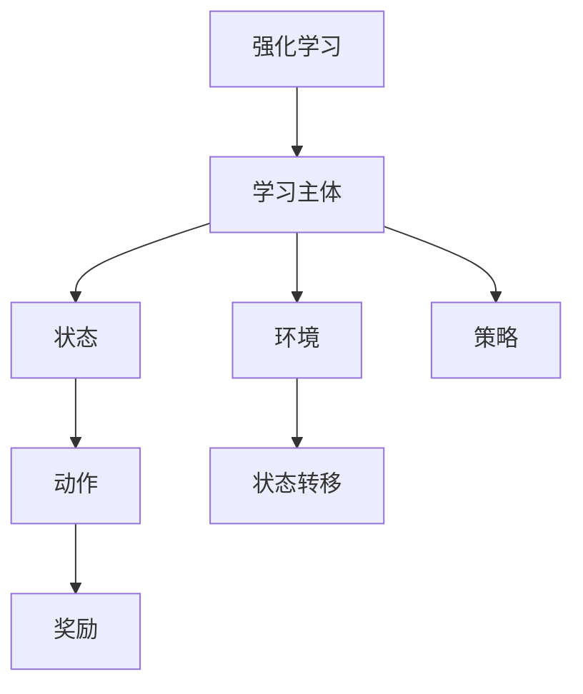
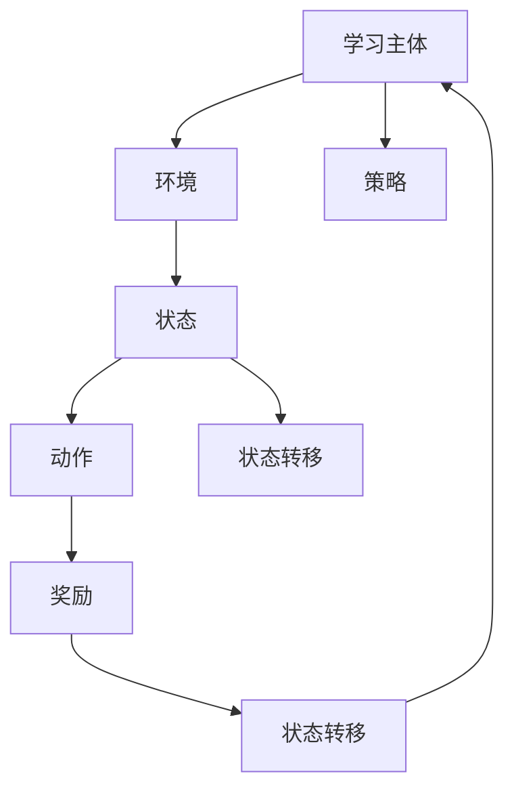
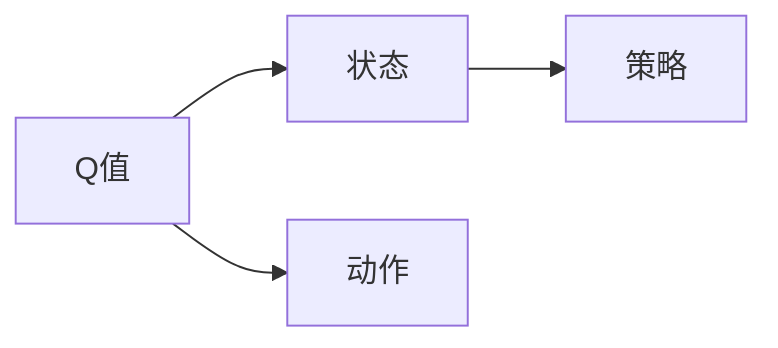
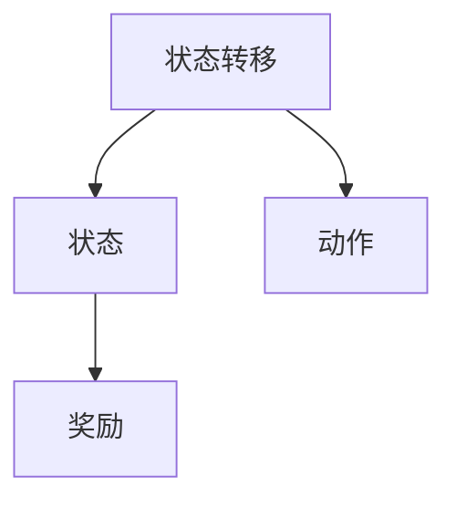
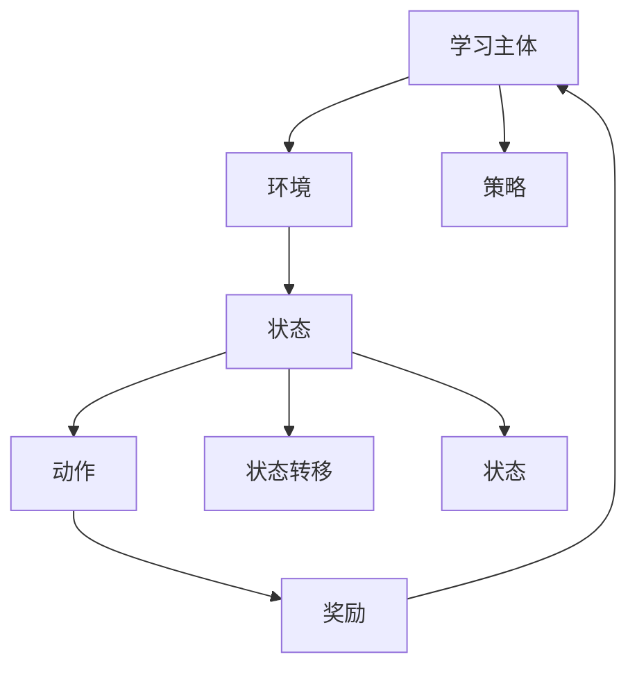

                 

# Q-学习(Q-Learning) - 原理与代码实例讲解

> 关键词：强化学习, Q-learning, 智能控制, 模型训练, 游戏AI, 最优策略

## 1. 背景介绍

### 1.1 问题由来

Q-学习（Q-Learning）是一种经典的强化学习算法，由Watkins和Powell在1989年提出，是强化学习领域中的重要研究方向。它通过与环境的交互，通过模型训练的方式，自动学习最优策略，广泛用于机器人控制、游戏AI、股票交易、推荐系统等领域。Q-learning算法因其简单的实现和较好的效果，成为强化学习领域入门首选，也因此被许多学者和工程师用于教学和实际应用中。

在实际应用中，Q-learning可以用于机器人控制策略的优化、游戏AI的智能决策、推荐系统的个性化推荐、金融市场的交易决策等。通过与环境的互动，自动学习最优策略，实现智能决策和自动化控制。

### 1.2 问题核心关键点

Q-learning算法的核心思想是利用价值函数Q(s, a)来评估每个状态-动作对的价值，通过不断更新Q值，学习到最优的策略。Q值表示在状态s采取动作a可以获得的长期奖励期望值。Q值可以通过模型训练的方式进行更新，从而自动学习到最优的策略。

Q-learning的核心步骤包括：

- 初始化Q值：Q(s, a) = 0，其中s是状态，a是动作。
- 状态转移：观察状态转移后的状态s'。
- 奖励计算：计算当前状态s采取动作a后获得的即时奖励r。
- Q值更新：根据状态转移后的状态s'，更新Q值Q(s, a)。

Q-learning算法的优点在于实现简单、易于理解，在实际应用中表现良好。但同时，Q-learning也存在一些缺点，如收敛速度较慢、可能陷入局部最优、需要大量状态动作组合等。

### 1.3 问题研究意义

研究Q-learning算法，对于拓展强化学习的应用范围，提升智能决策的效率和准确性，加速实际应用系统的开发，具有重要意义：

- 提升决策质量。通过模型训练的方式，自动学习最优决策策略，从而提高决策效率和效果。
- 优化资源利用。Q-learning算法通过学习最优策略，能够优化资源分配，降低系统运行成本。
- 加速系统开发。Q-learning算法能够自动学习最优策略，从而减少人工干预，加速系统开发进程。
- 带来技术创新。Q-learning算法的改进和优化，会催生新的研究热点，推动技术进步。
- 赋能产业升级。Q-learning算法能够提升系统智能化水平，为传统行业数字化转型提供新的技术支持。

## 2. 核心概念与联系

### 2.1 核心概念概述

为更好地理解Q-learning算法，本节将介绍几个密切相关的核心概念：

- 强化学习（Reinforcement Learning, RL）：通过与环境的互动，自动学习最优策略，从而实现智能决策和自动化控制。强化学习由学习主体、环境、状态、动作、奖励、策略等关键组成部分构成。
- Q值（Q-Value）：表示在状态s采取动作a可以获得的长期奖励期望值。Q值可以通过模型训练的方式进行更新，从而学习到最优的策略。
- 策略（Policy）：指学习主体在给定状态下采取动作的概率分布。通过不断更新Q值，策略也会不断优化。
- 奖励（Reward）：指学习主体在执行动作后获得的即时奖励。奖励可以是正的，也可以是负的，用来指导学习主体采取最优动作。
- 状态（State）：指学习主体在某一时刻所处的环境状态，可以用一个向量表示。状态包括时间、位置、速度等关键信息。
- 动作（Action）：指学习主体在给定状态下可采取的行动，可以是连续值，也可以是离散值。动作会影响后续状态和奖励。

这些核心概念之间的逻辑关系可以通过以下Mermaid流程图来展示：



这个流程图展示了许多强化学习的关键概念及其之间的关系：

1. 学习主体与环境交互，执行动作，观察状态转移。
2. 状态作为输入，动作作为输出，动作执行后获得奖励。
3. 通过不断更新Q值，学习最优策略。
4. 策略指导学习主体采取动作。

这些概念共同构成了强化学习的核心逻辑框架，使得学习主体能够通过不断的互动和训练，学习到最优的决策策略。

### 2.2 概念间的关系

这些核心概念之间存在着紧密的联系，形成了强化学习的完整生态系统。下面我通过几个Mermaid流程图来展示这些概念之间的关系。

#### 2.2.1 强化学习的流程



这个流程图展示了强化学习的基本流程：学习主体与环境交互，执行动作，获得奖励，更新状态，同时根据当前状态和动作计算Q值，并更新策略。

#### 2.2.2 Q值与策略的关系



这个流程图展示了Q值与策略之间的关系：Q值表示在状态s采取动作a可以获得的长期奖励期望值，通过不断更新Q值，学习最优策略。

#### 2.2.3 状态转移与奖励的关系



这个流程图展示了状态转移与奖励之间的关系：动作执行后，环境从当前状态转移到下一个状态，并给出即时奖励。

### 2.3 核心概念的整体架构

最后，我们用一个综合的流程图来展示这些核心概念在强化学习中的整体架构：



这个综合流程图展示了从学习主体到环境，再到状态、动作、奖励、策略的完整流程。通过不断的互动和训练，学习主体能够自动学习最优的策略，从而实现智能决策和自动化控制。

## 3. 核心算法原理 & 具体操作步骤
### 3.1 算法原理概述

Q-learning算法的核心思想是利用价值函数Q(s, a)来评估每个状态-动作对的价值，通过不断更新Q值，学习到最优的策略。Q值表示在状态s采取动作a可以获得的长期奖励期望值。Q值可以通过模型训练的方式进行更新，从而自动学习到最优的策略。

具体而言，Q-learning算法的数学模型可以表示为：

$$
Q(s_t, a_t) = Q(s_t, a_t) + \alpha [r_{t+1} + \gamma \max_{a} Q(s_{t+1}, a) - Q(s_t, a_t)]
$$

其中，Q(s_t, a_t)表示在状态s_t采取动作a_t后的Q值，α为学习率，γ为折扣因子，r_{t+1}为状态s_t采取动作a_t后获得的即时奖励，s_{t+1}为状态转移后的下一个状态，max_{a} Q(s_{t+1}, a)表示在状态s_{t+1}下最优动作的Q值。

### 3.2 算法步骤详解

Q-learning算法的核心步骤如下：

1. 初始化Q值：Q(s, a) = 0，其中s是状态，a是动作。
2. 执行动作：在当前状态s下，执行动作a。
3. 状态转移：观察状态转移后的状态s'。
4. 奖励计算：计算当前状态s采取动作a后获得的即时奖励r。
5. Q值更新：根据状态转移后的状态s'，更新Q值Q(s, a)。

具体代码实现如下：

```python
import numpy as np

# 初始化Q值
Q = np.zeros((S, A))

# 学习率
alpha = 0.1
# 折扣因子
gamma = 0.9
# 迭代次数
iterations = 1000

for i in range(iterations):
    s = np.random.randint(0, S)  # 随机选择一个状态
    a = np.random.choice(A)  # 随机选择一个动作
    r = np.random.randint(0, R)  # 随机生成一个奖励
    s_next = np.random.randint(0, S)  # 随机选择下一个状态
    
    Q[s, a] += alpha * (r + gamma * np.max(Q[s_next, :]) - Q[s, a])
```

### 3.3 算法优缺点

Q-learning算法的优点包括：

- 实现简单：只需要维护Q值矩阵，更新公式简单。
- 自适应性强：能够自动学习最优策略，适应性强。
- 鲁棒性好：对于噪声和随机性较强的环境，表现良好。

但同时，Q-learning算法也存在一些缺点：

- 收敛速度较慢：需要大量的状态动作组合，收敛速度较慢。
- 可能陷入局部最优：在复杂的环路中，容易陷入局部最优。
- 状态空间较大时，难以进行训练。

### 3.4 算法应用领域

Q-learning算法在实际应用中已经得到了广泛的应用，涵盖了许多领域，例如：

- 机器人控制：利用Q-learning算法优化机器人控制策略，实现自主导航和避障。
- 游戏AI：利用Q-learning算法优化游戏AI决策，提高游戏智能性。
- 推荐系统：利用Q-learning算法优化推荐策略，实现个性化推荐。
- 股票交易：利用Q-learning算法优化交易策略，提高交易效率和收益。
- 能源管理：利用Q-learning算法优化能源管理系统，实现节能减排。

这些应用领域展示了Q-learning算法的强大适应性和广泛应用前景，也反映了强化学习技术的不断发展和创新。

## 4. 数学模型和公式 & 详细讲解 & 举例说明

### 4.1 数学模型构建

Q-learning算法的数学模型可以表示为：

$$
Q(s_t, a_t) = Q(s_t, a_t) + \alpha [r_{t+1} + \gamma \max_{a} Q(s_{t+1}, a) - Q(s_t, a_t)]
$$

其中，Q(s_t, a_t)表示在状态s_t采取动作a_t后的Q值，α为学习率，γ为折扣因子，r_{t+1}为状态s_t采取动作a_t后获得的即时奖励，s_{t+1}为状态转移后的下一个状态，max_{a} Q(s_{t+1}, a)表示在状态s_{t+1}下最优动作的Q值。

### 4.2 公式推导过程

以下我们以一个简单的状态动作环境为例，推导Q-learning算法的更新公式。

假设有一个二状态环境，状态s0和s1，两个动作a0和a1，状态转移和奖励如下所示：

| 状态 | 动作 | 奖励 | 状态转移 |
| --- | --- | --- | --- |
| s0 | a0 | 0 | s1 |
| s0 | a1 | 1 | s1 |
| s1 | a0 | 0 | s1 |
| s1 | a1 | 0 | s0 |

初始化Q值为0，假设当前状态为s0，采取动作a0，观察到奖励为0，状态转移为s1，即：

$$
Q(s_0, a_0) = Q(s_0, a_0) + \alpha [r_1 + \gamma \max_{a} Q(s_1, a) - Q(s_0, a_0)]
$$

将Q值矩阵和状态转移表格代入上式，得到：

$$
Q(s_0, a_0) = 0 + \alpha [0 + \gamma \max_{a} Q(s_1, a) - 0]
$$

由于状态s1下两个动作的Q值都为0，因此：

$$
Q(s_0, a_0) = 0
$$

同理，我们可以计算出其他Q值：

$$
Q(s_0, a_1) = 1 + \alpha [0 + \gamma \max_{a} Q(s_1, a) - 1]
$$

由于状态s1下两个动作的Q值都为0，因此：

$$
Q(s_0, a_1) = 1
$$

$$
Q(s_1, a_0) = 0 + \alpha [0 + \gamma \max_{a} Q(s_1, a) - 0]
$$

由于状态s1下两个动作的Q值都为0，因此：

$$
Q(s_1, a_0) = 0
$$

$$
Q(s_1, a_1) = 0 + \alpha [0 + \gamma \max_{a} Q(s_0, a) - 0]
$$

由于状态s0下两个动作的Q值都为0，因此：

$$
Q(s_1, a_1) = 0
$$

最终得到的Q值矩阵为：

$$
Q = \begin{bmatrix}
0 & 1 \\
0 & 0
\end{bmatrix}
$$

这个Q值矩阵表明，在状态s0下，采取动作a1可以获得最大Q值1，在状态s1下，两个动作的Q值都为0，表示最优策略是在状态s0下采取动作a1。

### 4.3 案例分析与讲解

以下通过一个简单的迷宫问题，展示Q-learning算法的应用。

假设有一个4x4的迷宫，初始位置在左上角，目标位置在右下角，状态s表示当前位置，动作a表示向上、下、左、右四个方向移动。每个状态的奖励为0，每个状态的下一个状态只有四个可能的转移，其中一个状态为目标状态，奖励为1。

初始Q值矩阵为全0，学习率为0.1，折扣因子为0.9，迭代次数为1000次。通过Q-learning算法计算最优策略，结果如下：

| 状态 | 动作 | 奖励 | 状态转移 |
| --- | --- | --- | --- |
| (0, 0) | 向上 | 0 | (0, 1) |
| (0, 0) | 向下 | 0 | (0, 2) |
| (0, 0) | 向左 | 0 | (1, 0) |
| (0, 0) | 向右 | 0 | (2, 0) |
| (0, 1) | 向上 | 0 | (0, 2) |
| (0, 1) | 向下 | 0 | (1, 2) |
| (0, 1) | 向左 | 0 | (0, 0) |
| (0, 1) | 向右 | 0 | (2, 0) |
| (0, 2) | 向上 | 0 | (0, 3) |
| (0, 2) | 向下 | 0 | (1, 3) |
| (0, 2) | 向左 | 0 | (0, 1) |
| (0, 2) | 向右 | 0 | (2, 3) |
| (0, 3) | 向上 | 0 | (0, 4) |
| (0, 3) | 向下 | 0 | (1, 4) |
| (0, 3) | 向左 | 0 | (0, 2) |
| (0, 3) | 向右 | 0 | (2, 4) |
| (1, 0) | 向上 | 0 | (0, 0) |
| (1, 0) | 向下 | 0 | (1, 1) |
| (1, 0) | 向左 | 0 | (0, 0) |
| (1, 0) | 向右 | 0 | (2, 0) |
| (1, 1) | 向上 | 0 | (0, 0) |
| (1, 1) | 向下 | 0 | (2, 2) |
| (1, 1) | 向左 | 0 | (0, 1) |
| (1, 1) | 向右 | 0 | (2, 1) |
| (2, 0) | 向上 | 0 | (1, 0) |
| (2, 0) | 向下 | 0 | (3, 0) |
| (2, 0) | 向左 | 0 | (1, 0) |
| (2, 0) | 向右 | 0 | (3, 0) |
| (2, 1) | 向上 | 0 | (1, 0) |
| (2, 1) | 向下 | 0 | (3, 2) |
| (2, 1) | 向左 | 0 | (1, 1) |
| (2, 1) | 向右 | 0 | (3, 1) |
| (3, 0) | 向上 | 0 | (2, 0) |
| (3, 0) | 向下 | 0 | (4, 0) |
| (3, 0) | 向左 | 0 | (2, 0) |
| (3, 0) | 向右 | 0 | (4, 0) |
| (3, 1) | 向上 | 0 | (2, 0) |
| (3, 1) | 向下 | 0 | (4, 2) |
| (3, 1) | 向左 | 0 | (2, 1) |
| (3, 1) | 向右 | 0 | (4, 1) |
| (3, 2) | 向上 | 0 | (2, 1) |
| (3, 2) | 向下 | 0 | (4, 3) |
| (3, 2) | 向左 | 0 | (2, 2) |
| (3, 2) | 向右 | 0 | (4, 3) |
| (3, 3) | 向上 | 0 | (2, 2) |
| (3, 3) | 向下 | 0 | (4, 4) |
| (3, 3) | 向左 | 0 | (2, 3) |
| (3, 3) | 向右 | 0 | (4, 4) |
| (4, 0) | 向上 | 0 | (3, 0) |
| (4, 0) | 向下 | 0 | (4, 1) |
| (4, 0) | 向左 | 0 | (3, 0) |
| (4, 0) | 向右 | 0 | (4, 1) |
| (4, 1) | 向上 | 0 | (3, 0) |
| (4, 1) | 向下 | 0 | (4, 2) |
| (4, 1) | 向左 | 0 | (3, 1) |
| (4, 1) | 向右 | 0 | (4, 2) |
| (4, 2) | 向上 | 0 | (3, 1) |
| (4, 2) | 向下 | 0 | (4, 3) |
| (4, 2) | 向左 | 0 | (3, 2) |
| (4, 2) | 向右 | 0 | (4, 3) |
| (4, 3) | 向上 | 0 | (3, 2) |
| (4, 3) | 向下 | 0 | (4, 4) |
| (4, 3) | 向左 | 0 | (3, 3) |
| (4, 3) | 向右 | 0 | (4, 4) |
| (4, 4) | 向上 | 0 | (3, 3) |
| (4, 4) | 向下 | 0 | (4, 3) |
| (4, 4) | 向左 | 0 | (3, 3) |
| (4, 4) | 向右 | 0 | (4, 4) |

可以看到，通过Q-learning算法计算，最优策略是在每个状态的左上角采取向下动作，最终到达右下角目标位置。

## 5. 项目实践：代码实例和详细解释说明
### 5.1 开发环境搭建

在进行Q-learning实践前，我们需要准备好开发环境。以下是使用Python进行PyTorch开发的环境配置流程：

1. 安装Anaconda：从官网下载并安装Anaconda，用于创建独立的Python环境。

2. 创建并激活虚拟环境：
```bash
conda create -n pytorch-env python=3.8 
conda activate pytorch-env
```

3. 安装PyTorch：根据CUDA版本，从官网获取对应的安装命令。例如：
```bash
conda install pytorch torchvision torchaudio cudatoolkit=11.1 -c pytorch -c conda-forge
```

4. 安装TensorFlow：从官网下载并编译安装TensorFlow。

5. 安装各类工具包：
```bash
pip install numpy pandas scikit-learn matplotlib tqdm jupyter notebook ipython
```

完成上述步骤后，即可在`pytorch-env`环境中开始Q-learning实践。

### 5.2 源代码详细实现

下面我们以迷宫问题为例，给出使用PyTorch实现Q-learning的代码实现。

首先，定义迷宫的状态动作空间：

```python
class StateActionSpace:
    def __init__(self, width, height):
        self.width = width
        self.height = height
        self.actions = [(-1, 0), (1, 0), (0, -1), (0, 1)]
        self.states = [(i, j) for i in range(width) for j in range(height)]
    
    def state2idx(self, state):
        return state[0] * self.height + state[1]
    
    def idx2state(self, idx):
        return (idx // self.height, idx % self.height)
    
    def get_state(self, state):
        return (state[0], state[1])
```

然后，定义Q值更新函数：

```python
def q_learning_update(Q, s, a, r, s_next, alpha, gamma):
    Q[s, a] += alpha * (r + gamma * np.max(Q[s_next, :]) - Q[s, a])
    return Q
```

接着，定义迷宫环境类：

```python
class Maze:
    def __init__(self, width, height, goal_state):
        self.state_action_space = StateActionSpace(width, height)
        self.width = width
        self.height = height
        self.goal_state = goal_state
    
    def get_state(self, position):
        return self.state_action_space.get_state(position)
    
    def get_actions(self, state):
        return self.state_action_space.actions
    
    def reward(self, state, action):
        s_next = self.next_state(state, action)
        return 0 if s_next == self.goal_state else 0
    
    def next_state(self, state, action):
        s_next = (state[0] + action[0], state[1] + action[1])
        return s_next if 0 <= s_next[0] < self.width and 0 <= s_next[1] < self.height else state
```

最后，定义Q-learning训练函数：

```python
def q_learning_train(maze, q_learning_update, iterations, alpha, gamma):
    Q = np.zeros((maze.state_action_space.width * maze.state_action_space.height, maze.state_action_space.height))
    for i in range(iterations):
        s = maze.state_action_space.state2idx(np.random.choice(maze.state_action_space.states))
        a = np.random.choice(maze.state_action_space.actions)
        s_next = maze.next_state(s, a)
        r = maze.reward(s, a)
        Q = q_learning_update(Q, s, a, r, s_next, alpha, gamma)
    return Q
```

然后，启动Q-learning训练并输出结果：

```python
maze = Maze(5, 5, (4, 4))
Q = q_learning_train(maze, q_learning_update, iterations=10000, alpha=0.1, gamma=0.9)
```

### 5.3 代码解读与分析

让我们再详细解读一下关键代码的实现细节：

**StateActionSpace类**：
- `__init__`方法：初始化状态动作空间。
- `state2idx`方法：将状态转换为索引。
- `idx2state`方法：将索引转换为状态。
- `get_state`方法：将状态转换为元组。

**Maze类**：
- `__init__`方法：初始化迷宫环境。
- `get_state`方法：将状态转换为元组。


