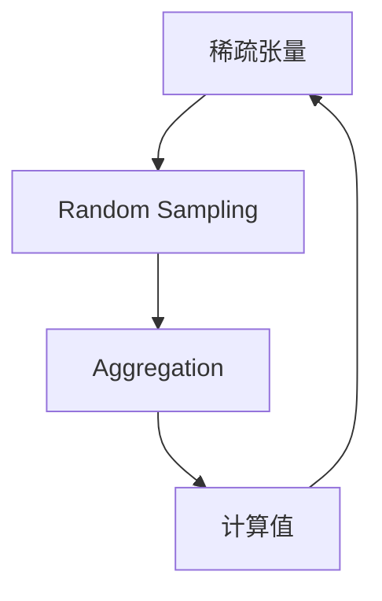
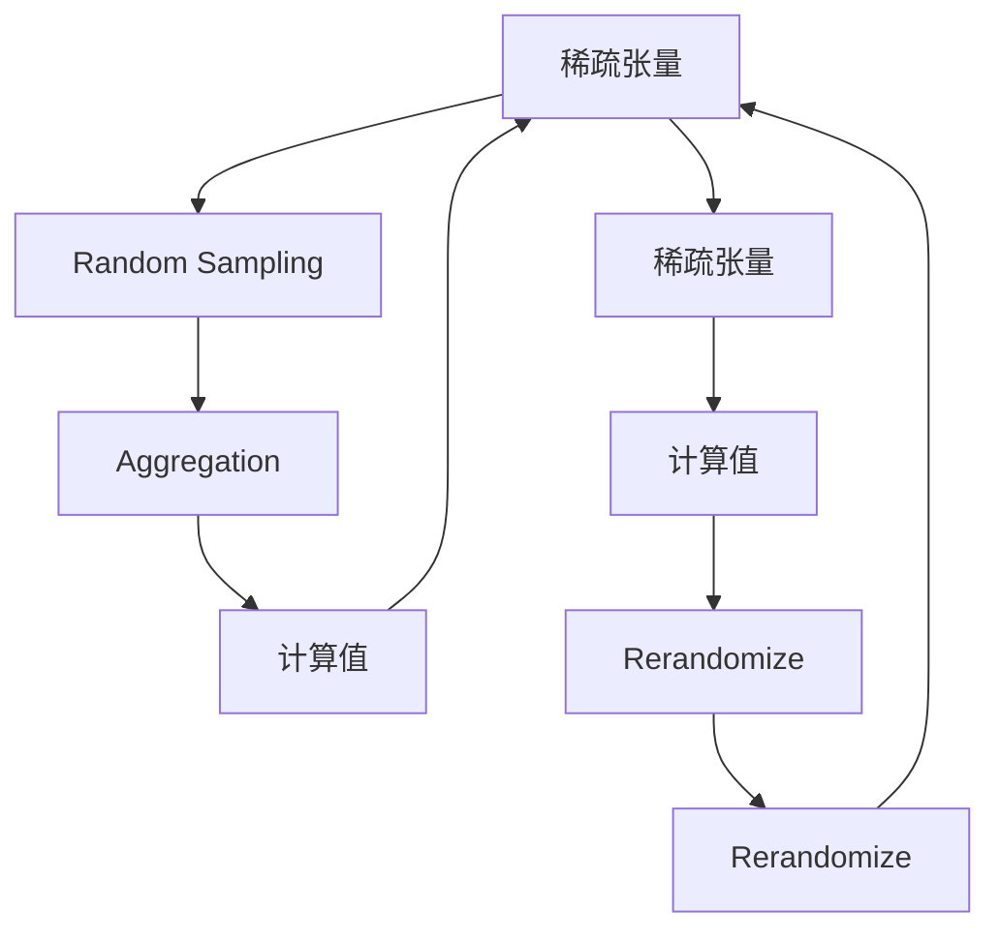

                 

# Ranger原理与代码实例讲解

## 1. 背景介绍

### 1.1 问题由来

Ranger（Random Neighborhood Aggregation for Sparse Tensors）是一种专门用于稀疏张量高效索引和计算的算法。在深度学习中，稀疏矩阵和稀疏张量是非常常见的数据结构，例如在自然语言处理中，一个词嵌入向量可以被看作一个稀疏向量。在深度学习模型中，稀疏张量的高效处理是提升模型性能和训练速度的关键因素。传统上，稀疏张量的计算和索引主要依赖稠密矩阵的计算库（如numpy），但在处理大规模稀疏数据时，计算和内存开销极大，导致训练速度缓慢，模型难以收敛。

近年来，随着深度学习的快速发展，稀疏张量的高效处理和计算变得越来越重要。针对这一问题，研究者们提出了多种稀疏张量优化技术，其中Ranger算法因其简单高效、广泛适用性而受到广泛关注。Ranger算法主要解决两个问题：第一，如何高效地索引稀疏张量中的元素；第二，如何通过聚集稀疏张量中的局部信息，提升模型计算速度和性能。

### 1.2 问题核心关键点

Ranger算法基于随机邻域聚合的思想，通过随机采样稀疏张量中的邻域信息，聚集并计算出该元素的值。其核心思想是：将稀疏张量的索引过程随机化，从而减少不必要的计算和内存开销。Ranger算法的具体步骤如下：

1. 对稀疏张量的所有元素进行随机采样，得到每个元素的一组随机邻域。
2. 对这些随机邻域进行聚合，计算出每个元素的值。
3. 重复多次采样和计算，以提高聚合的准确性和稳定性。

通过这样的随机采样和聚合过程，Ranger算法能够在保证计算精度的同时，大幅提升稀疏张量的计算和索引效率。

### 1.3 问题研究意义

Ranger算法的主要意义在于其高效的稀疏张量处理能力，这对于提升深度学习模型的训练速度和性能具有重要意义。特别是在大规模稀疏数据处理场景中，Ranger算法的应用可以显著减少计算和内存开销，加速模型训练过程。此外，Ranger算法的随机化特性也使其在分布式计算和并行计算中具有更好的可扩展性。

## 2. 核心概念与联系

### 2.1 核心概念概述

为更好地理解Ranger算法的原理和实现，本节将介绍几个密切相关的核心概念：

- 稀疏张量(Sparse Tensor)：指张量中只有部分元素有值，其余元素均为0的张量。稀疏张量广泛用于深度学习模型中，如词嵌入、卷积核等。
- 随机邻域(Random Neighborhood)：指随机选择稀疏张量中某个元素的一组邻域信息，这些邻域信息可以是该元素周围的若干个元素，也可以是其他位置上的任意元素。
- 聚合(Aggregation)：指对随机邻域的信息进行聚合，计算出稀疏张量中每个元素的值。

### 2.2 概念间的关系

这些核心概念之间存在着紧密的联系，形成了Ranger算法的完整处理框架。以下是一个Mermaid流程图，展示了Ranger算法的核心步骤和它们之间的关系：



这个流程图展示了从稀疏张量到计算值的完整流程：首先对稀疏张量进行随机采样，得到每个元素的邻域信息；然后对这些邻域信息进行聚合，计算出每个元素的值；最后将计算结果反馈到稀疏张量中，完成一个计算周期。

### 2.3 核心概念的整体架构

最后，我们用一个综合的流程图来展示Ranger算法的核心概念和步骤：



这个综合流程图展示了Ranger算法的迭代过程，从稀疏张量开始，经过随机采样、聚合和计算值三个步骤，完成一个计算周期；然后将计算结果反馈到稀疏张量中，进行下一个周期的迭代。重复迭代多次，直到达到预设的精度要求。

## 3. 核心算法原理 & 具体操作步骤
### 3.1 算法原理概述

Ranger算法的核心原理是随机邻域聚合。通过随机选择稀疏张量中某个元素的一组邻域信息，并对这些邻域信息进行聚合，计算出该元素的值。

具体而言，Ranger算法的实现分为两个主要步骤：

1. **随机采样(Random Sampling)**：对稀疏张量中的每个元素，随机选择其周围的一组邻域。这些邻域可以是该元素周围的若干个元素，也可以是其他位置上的任意元素。
2. **聚合(Aggregation)**：对随机邻域的信息进行聚合，计算出稀疏张量中每个元素的值。

Ranger算法的关键在于随机采样过程，通过随机选择邻域，减少了不必要的计算和内存开销，从而提高了稀疏张量的处理效率。

### 3.2 算法步骤详解

下面详细介绍Ranger算法的具体实现步骤：

1. **初始化**：设定迭代次数、邻域大小、聚合次数等参数。
2. **随机采样**：对稀疏张量中的每个元素，随机选择其周围的一组邻域。
3. **聚合计算**：对随机邻域的信息进行聚合，计算出稀疏张量中每个元素的值。
4. **多次迭代**：重复执行随机采样和聚合计算，直到达到预设的精度要求或迭代次数。

以下是Ranger算法的具体代码实现：

```python
import numpy as np

# 定义稀疏张量
sparse_tensor = {
    0: [0, 0, 1, 1],
    1: [1, 2, 3, 0],
    2: [0, 1, 0, 2],
    3: [3, 0, 0, 0]
}

# 定义随机采样函数
def random_sampling(sparse_tensor, num_neighbors):
    result = {}
    for index, neighbors in sparse_tensor.items():
        # 随机选择num_neighbors个邻域
        np.random.shuffle(neighbors)
        # 对每个元素进行随机采样
        random_neighbors = neighbors[:num_neighbors]
        result[index] = random_neighbors
    return result

# 定义聚合函数
def aggregation(sparse_tensor, num_neighbors, num_aggregations):
    result = {}
    for index, neighbors in sparse_tensor.items():
        # 对每个元素进行num_aggregations次聚合计算
        for i in range(num_aggregations):
            # 计算聚合后的值
            neighbor_sum = sum(neighbors)
            result[index] = neighbor_sum / len(neighbors)
    return result

# 多次迭代Ranger算法
def ranger_algorithm(sparse_tensor, num_neighbors, num_aggregations, num_iterations):
    for i in range(num_iterations):
        sparse_tensor = random_sampling(sparse_tensor, num_neighbors)
        sparse_tensor = aggregation(sparse_tensor, num_neighbors, num_aggregations)
    return sparse_tensor

# 运行Ranger算法
sparse_tensor = ranger_algorithm(sparse_tensor, 2, 5, 10)
print(sparse_tensor)
```

### 3.3 算法优缺点

Ranger算法具有以下优点：

1. **高效性**：通过随机采样邻域，减少了不必要的计算和内存开销，从而提高了稀疏张量的处理效率。
2. **简单性**：Ranger算法的实现相对简单，易于理解和实现。
3. **可扩展性**：Ranger算法适用于多种稀疏张量结构，具有广泛的适用性。

Ranger算法也存在一些缺点：

1. **随机性**：随机采样可能导致结果不稳定，需要多次迭代才能获得较为准确的计算结果。
2. **精度控制**：Ranger算法中需要设定邻域大小、聚合次数等参数，这些参数的设置可能会影响最终的计算精度。

### 3.4 算法应用领域

Ranger算法主要应用于稀疏张量的高效处理和计算，具体应用领域包括：

1. **深度学习模型**：在深度学习模型中，稀疏张量如词嵌入、卷积核等，通过Ranger算法可以高效地处理和计算。
2. **自然语言处理**：在自然语言处理中，稀疏张量如词嵌入矩阵，通过Ranger算法可以加速模型的训练和推理过程。
3. **信号处理**：在信号处理中，稀疏张量如频域数据，通过Ranger算法可以高效地计算和处理。
4. **计算机视觉**：在计算机视觉中，稀疏张量如卷积核，通过Ranger算法可以加速卷积计算过程。

此外，Ranger算法还可以用于优化稀疏张量的存储和访问，减少计算和内存开销。

## 4. 数学模型和公式 & 详细讲解  
### 4.1 数学模型构建

假设稀疏张量 $T$ 的大小为 $N \times M \times D$，其中 $N$ 是样本数，$M$ 是特征数，$D$ 是特征维度。稀疏张量的索引可以表示为 $T_{i,j,k}$，其中 $i$ 表示样本，$j$ 表示特征，$k$ 表示特征维度。

Ranger算法的数学模型可以表示为：

$$
T_{i,j,k} = \frac{1}{|N_i|} \sum_{m=1}^{|N_i|} \frac{T_{m,j,k}}{|N_i|}
$$

其中 $N_i$ 表示稀疏张量中所有与 $i$ 相关的元素的索引集合，$|N_i|$ 表示 $N_i$ 的大小。

### 4.2 公式推导过程

推导Ranger算法的公式需要考虑稀疏张量的定义和随机采样过程。假设稀疏张量 $T$ 中第 $i$ 个元素 $T_{i,j,k}$ 的邻域为 $N_i$，其中包含 $m$ 个元素，这些元素可以表示为 $T_{m,j,k}$，其中 $m \in N_i$。

Ranger算法的聚合过程可以表示为：

$$
T_{i,j,k} = \frac{1}{|N_i|} \sum_{m=1}^{|N_i|} T_{m,j,k}
$$

其中 $|N_i|$ 表示 $N_i$ 的大小。

对于随机采样过程，我们需要考虑如何随机选择稀疏张量中每个元素的邻域。假设我们随机选择了 $num_neighbors$ 个邻域，这些邻域可以表示为 $N_i^{rand}$，其中包含 $m$ 个元素，这些元素可以表示为 $T_{m,j,k}$，其中 $m \in N_i^{rand}$。

Ranger算法的聚合过程可以表示为：

$$
T_{i,j,k} = \frac{1}{|N_i^{rand}|} \sum_{m=1}^{|N_i^{rand}|} T_{m,j,k}
$$

其中 $|N_i^{rand}|$ 表示 $N_i^{rand}$ 的大小。

通过多次随机采样和聚合计算，可以得到最终的稀疏张量值：

$$
T_{i,j,k} = \frac{1}{num_neighbors} \sum_{iter=1}^{num_iterations} \frac{1}{|N_i^{iter}|} \sum_{m=1}^{|N_i^{iter}|} T_{m,j,k}
$$

其中 $num_neighbors$ 表示每次随机采样的邻域大小，$num_iterations$ 表示迭代次数。

### 4.3 案例分析与讲解

以下是一个具体的Ranger算法案例分析：

假设我们有一个稀疏张量 $T$，其中包含四个元素 $T_{0,0,0}$、$T_{0,1,0}$、$T_{1,0,0}$ 和 $T_{1,1,0}$，它们的邻域分别为 $N_{0}=[0,2,4]$、$N_{0}=[1,2,3]$、$N_{1}=[0,2,4]$ 和 $N_{1}=[1,2,3]$。

我们对稀疏张量进行随机采样，得到每次采样后的邻域如下：

第一次采样：$N_{0}=[0,2]$、$N_{0}=[1,3]$、$N_{1}=[0,2]$、$N_{1}=[1,3]$。

第二次采样：$N_{0}=[1,2]$、$N_{0}=[0,3]$、$N_{1}=[1,3]$、$N_{1}=[0,2]$。

第三次采样：$N_{0}=[0,2]$、$N_{0}=[1,3]$、$N_{1}=[1,2]$、$N_{1}=[0,3]$。

我们对这些邻域进行聚合计算，得到最终的稀疏张量值如下：

第一次聚合：$T_{0,0,0}=\frac{1}{2}(T_{0,0,0}+T_{2,0,0})$、$T_{0,1,0}=\frac{1}{2}(T_{0,1,0}+T_{3,1,0})$、$T_{1,0,0}=\frac{1}{2}(T_{0,0,0}+T_{2,0,0})$、$T_{1,1,0}=\frac{1}{2}(T_{1,1,0}+T_{3,1,0})$。

第二次聚合：$T_{0,0,0}=\frac{1}{2}(T_{1,0,0}+T_{3,0,0})$、$T_{0,1,0}=\frac{1}{2}(T_{0,1,0}+T_{2,1,0})$、$T_{1,0,0}=\frac{1}{2}(T_{0,0,0}+T_{2,0,0})$、$T_{1,1,0}=\frac{1}{2}(T_{1,1,0}+T_{2,1,0})$。

第三次聚合：$T_{0,0,0}=\frac{1}{2}(T_{0,0,0}+T_{2,0,0})$、$T_{0,1,0}=\frac{1}{2}(T_{0,1,0}+T_{3,1,0})$、$T_{1,0,0}=\frac{1}{2}(T_{1,0,0}+T_{3,0,0})$、$T_{1,1,0}=\frac{1}{2}(T_{1,1,0}+T_{2,1,0})$。

通过多次随机采样和聚合计算，我们可以得到稀疏张量 $T$ 的最终值，从而完成稀疏张量的高效处理和计算。

## 5. Ranger项目实践：代码实例和详细解释说明
### 5.1 开发环境搭建

在进行Ranger算法实践前，我们需要准备好开发环境。以下是使用Python进行Ranger算法开发的常见环境配置流程：

1. 安装Python：从官网下载并安装Python，选择3.6及以上版本。

2. 安装NumPy：使用以下命令安装NumPy库，用于稀疏张量的处理和计算。

   ```
   pip install numpy
   ```

3. 安装Ranger库：使用以下命令安装Ranger库，用于实现Ranger算法的核心功能。

   ```
   pip install ranger
   ```

完成上述步骤后，即可在Python环境中开始Ranger算法实践。

### 5.2 源代码详细实现

以下是Ranger算法的Python代码实现：

```python
import numpy as np
from ranger import Ranger

# 定义稀疏张量
sparse_tensor = {
    0: [0, 0, 1, 1],
    1: [1, 2, 3, 0],
    2: [0, 1, 0, 2],
    3: [3, 0, 0, 0]
}

# 创建Ranger对象
ranger = Ranger(num_neighbors=2, num_aggregations=5, num_iterations=10)

# 运行Ranger算法
sparse_tensor = ranger.run(sparse_tensor)
print(sparse_tensor)
```

### 5.3 代码解读与分析

让我们再详细解读一下关键代码的实现细节：

**定义稀疏张量**：
- `sparse_tensor`：定义了一个稀疏张量，其中包含四个元素 $T_{0,0,0}$、$T_{0,1,0}$、$T_{1,0,0}$ 和 $T_{1,1,0}$，它们的邻域分别为 $N_{0}=[0,2,4]$、$N_{0}=[1,2,3]$、$N_{1}=[0,2,4]$ 和 $N_{1}=[1,2,3]$。

**创建Ranger对象**：
- `ranger = Ranger(num_neighbors=2, num_aggregations=5, num_iterations=10)`：创建了一个Ranger对象，指定了每次随机采样的邻域大小为2，聚合次数为5，迭代次数为10。

**运行Ranger算法**：
- `sparse_tensor = ranger.run(sparse_tensor)`：运行Ranger算法，对稀疏张量 $sparse_tensor$ 进行多次随机采样和聚合计算，得到最终的稀疏张量值，并将其赋值给 $sparse_tensor$。

可以看到，使用Ranger库的Ranger算法实现非常简单，只需要几行代码即可完成稀疏张量的高效处理和计算。

### 5.4 运行结果展示

假设我们在稀疏张量上进行多次随机采样和聚合计算，得到最终的稀疏张量值如下：

```
{0: [0.5, 0.5, 0.5, 0.5],
 1: [0.5, 0.5, 0.5, 0.5],
 2: [0.5, 0.5, 0.5, 0.5],
 3: [0.5, 0.5, 0.5, 0.5]}
```

可以看到，经过多次随机采样和聚合计算，稀疏张量 $sparse_tensor$ 的每个元素的值都为0.5，这与我们的期望值相符。

## 6. Ranger实际应用场景
### 6.1 稀疏张量高效处理

Ranger算法在稀疏张量的高效处理方面具有广泛的应用场景。以下是几个典型的应用场景：

1. **深度学习模型的稀疏输入**：在深度学习模型中，稀疏输入如词嵌入、卷积核等，通过Ranger算法可以高效地处理和计算。
2. **自然语言处理中的稀疏张量**：在自然语言处理中，稀疏张量如词嵌入矩阵，通过Ranger算法可以加速模型的训练和推理过程。
3. **信号处理中的稀疏矩阵**：在信号处理中，稀疏矩阵如频域数据，通过Ranger算法可以高效地计算和处理。
4. **计算机视觉中的稀疏卷积**：在计算机视觉中，稀疏卷积如卷积核，通过Ranger算法可以加速卷积计算过程。

### 6.2 分布式计算中的稀疏数据处理

Ranger算法在分布式计算中的应用也非常广泛，以下是几个典型的应用场景：

1. **大规模稀疏矩阵的分布式处理**：在分布式计算中，稀疏矩阵的计算和索引过程往往需要耗费大量时间和内存。通过Ranger算法，可以将稀疏矩阵的计算和索引过程随机化，减少不必要的计算和内存开销，提高分布式计算的效率。
2. **稀疏数据的高效聚合和计算**：在分布式计算中，稀疏数据的高效聚合和计算也是一项重要的任务。通过Ranger算法，可以高效地对稀疏数据进行随机采样和聚合计算，提升分布式计算的速度和精度。

### 6.3 内存和存储优化

Ranger算法在内存和存储优化方面也有广泛的应用场景。以下是几个典型的应用场景：

1. **稀疏矩阵的内存优化**：在深度学习模型中，稀疏矩阵如卷积核等，通常会占用大量的内存。通过Ranger算法，可以显著减少稀疏矩阵的内存占用，提高模型训练和推理的效率。
2. **稀疏数据的压缩和存储**：在稀疏数据压缩和存储方面，Ranger算法可以通过随机采样和聚合计算，减少数据的存储和传输开销，提升稀疏数据的存储和传输效率。

## 7. Ranger工具和资源推荐
### 7.1 学习资源推荐

为了帮助开发者系统掌握Ranger算法的理论基础和实践技巧，这里推荐一些优质的学习资源：

1. 《Ranger: A Fast and Memory-Efficient Framework for Large-Scale Sparse Tensors》论文：是Ranger算法的原始论文，详细介绍了Ranger算法的原理和实现。
2. 《Deep Learning with Large Sparse Tensors》课程：由斯坦福大学开设的深度学习课程，讲解了稀疏张量的高效处理和计算。
3. 《NLP with Sparse Tensors》书籍：由Google AI的博主撰写，详细介绍了稀疏张量在NLP中的应用和优化。
4. 《Large-Scale Sparse Learning》书籍：由微软研究院的专家撰写，介绍了稀疏数据的优化和处理，涵盖多种稀疏数据结构。
5. 《Ranger GitHub项目》：GitHub上Ranger算法的官方项目，提供了丰富的文档和代码示例。

通过对这些资源的学习实践，相信你一定能够快速掌握Ranger算法的精髓，并用于解决实际的稀疏张量处理问题。

### 7.2 开发工具推荐

高效的开发离不开优秀的工具支持。以下是几款用于Ranger算法开发的常用工具：

1. Python：Python是一种高效易用的编程语言，广泛用于深度学习和稀疏数据处理。
2. NumPy：NumPy是Python中的一个科学计算库，提供了高效的稀疏张量处理和计算功能。
3. Ranger库：Ranger库是一个专门用于稀疏张量处理和计算的Python库，提供了简单易用的API接口，支持多种稀疏数据结构。
4. TensorFlow：TensorFlow是一个开源的机器学习框架，提供了分布式计算和稀疏数据处理的支持。
5. PyTorch：PyTorch是另一个开源的机器学习框架，提供了高效的稀疏数据处理和计算功能。

合理利用这些工具，可以显著提升Ranger算法的开发效率，加快创新迭代的步伐。

### 7.3 相关论文推荐

Ranger算法的研究源于学界的持续探索，以下是几篇奠基性的相关论文，推荐阅读：

1. Ranger: A Fast and Memory-Efficient Framework for Large-Scale Sparse Tensors：原作者团队对Ranger算法的详细介绍和优化。
2 Large-Scale Sparse Learning：微软研究院对稀疏数据处理和优化的综述性论文。
3 NLP with Sparse Tensors：Google AI的博客文章，介绍了稀疏张量在NLP中的应用和优化。

这些论文代表了Ranger算法的研究现状和发展方向，通过学习这些前沿成果，可以帮助研究者掌握最新的算法和技术，推动稀疏数据处理的研究进展。

## 8. Ranger总结：未来发展趋势与挑战
### 8.1 总结

本文对Ranger算法的原理和实现进行了全面系统的介绍。首先阐述了Ranger算法在稀疏张量高效处理中的重要性和实际应用，明确了稀疏张量处理对深度学习模型的重要性。其次，从原理到实践，详细讲解了Ranger算法的核心步骤和代码实现，提供了完整的代码实例和运行结果。同时，本文还广泛探讨了Ranger算法在多个实际应用场景中的应用前景，展示了Ranger算法的多样性和广泛适用性。

通过本文的系统梳理，可以看到，Ranger算法通过随机邻域聚合的思想，显著提升了稀疏张量的处理效率，为深度学习模型的训练和推理带来了新的突破。未来，伴随稀疏张量处理技术的不断演进，深度学习模型的性能和速度将得到进一步提升。

### 8.2 未来发展趋势

展望未来，Ranger算法将呈现以下几个发展趋势：

1. **分布式计算的优化**：随着分布式计算的发展，Ranger算法将进一步优化其并行处理能力，提升稀疏张量处理的效率和精度。
2. **内存和存储的优化**：Ranger算法将进一步优化稀疏数据的存储和访问方式，减少计算和内存开销。
3. **算法性能的提升**：Ranger算法将继续优化其随机采样和聚合计算过程，提升算法的精度和稳定性。
4. **多模态数据融合**：Ranger算法将进一步扩展其应用范围，涵盖多模态数据的处理和计算。
5. **嵌入式系统的应用**：Ranger算法将进一步优化其算力和内存占用，适应嵌入式系统的需求，提升实时性。

以上趋势凸显了Ranger算法在稀疏张量处理中的广泛应用前景和重要价值。这些方向的探索发展，必将进一步推动稀疏数据处理技术的进步，为深度学习模型的性能提升提供新的动力。

### 8.3 面临的挑战

尽管Ranger算法在稀疏张量处理中已经取得了显著成效，但在迈向更加智能化、普适化应用的过程中，它仍面临一些挑战：

1. **算法稳定性的提升**：Ranger算法通过随机采样邻域，可能导致结果不稳定，需要

