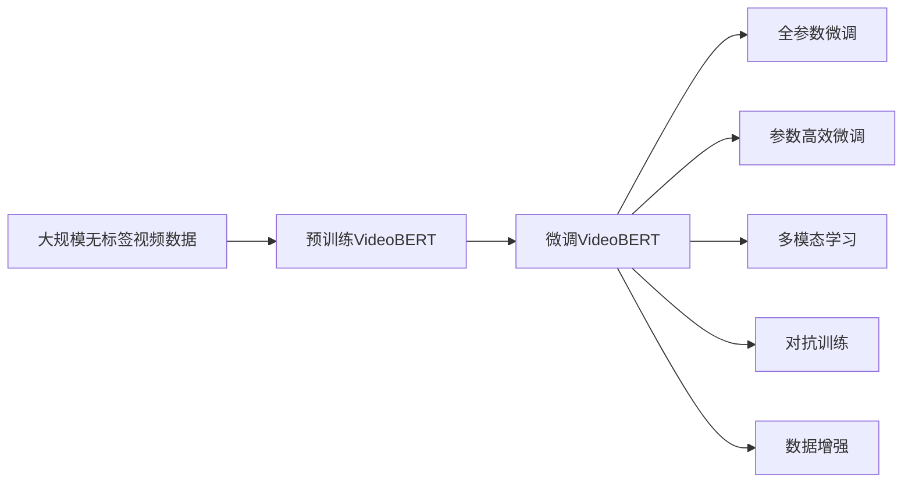
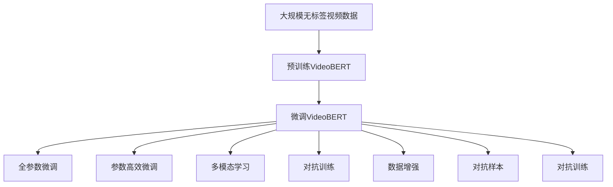

                 

# Transformer大模型实战 预训练VideoBERT模型

> 关键词：Transformer, VideoBERT, 预训练, 自然语言处理, 视频理解, 大规模模型

## 1. 背景介绍

### 1.1 问题由来
随着视频数据的爆炸性增长和视频内容理解的日益重要，自然语言处理（NLP）领域开始向视频理解领域拓展。传统的基于图像的视频理解方法，已经无法满足日益增长的对自然语言生成和理解的需求。为此，Transformer大模型应运而生，旨在从大规模视频数据中预训练学习视频-语言对应关系，并在下游任务中进行微调，实现视频内容的自然语言描述和生成。

视频BERT（VideoBERT）作为目前最先进的预训练模型之一，基于Transformer架构，利用大规模无标签视频数据进行预训练，学习视频内容的语义表示。在微调后，视频BERT能够在视频分类、视频描述生成、视频事件检测等任务上取得优异的表现，展示了其在视频理解领域的强大能力。

### 1.2 问题核心关键点
本文将详细探讨预训练VideoBERT模型的构建原理和微调步骤，并分析其在视频理解任务中的应用。我们将介绍视频BERT的核心概念、预训练方法、微调步骤以及实际应用场景，最后给出相关的学习资源和工具推荐。

### 1.3 问题研究意义
预训练VideoBERT模型在视频理解领域的应用，对于提升视频内容的自然语言描述能力，加速视频内容分析，推动视频智能化的进程具有重要意义：

1. **降低应用开发成本**：基于预训练模型进行微调，可以显著减少从头开发所需的数据、计算和人力成本。
2. **提升模型效果**：微调模型能够适应特定任务，在视频理解任务上取得更优表现。
3. **加速开发进度**：预训练模型为微调提供了强大的基础知识，加速模型适配任务的速度。
4. **带来技术创新**：微调范式促进了视频理解技术的深入研究，催生了更多的研究方向，如多模态学习、情感分析等。
5. **赋能产业升级**：预训练模型和微调技术为视频内容分析提供了新的技术路径，推动传统行业数字化转型升级。

## 2. 核心概念与联系

### 2.1 核心概念概述

预训练VideoBERT模型的构建与微调涉及多个关键概念，如下：

- **Transformer**：一种基于自注意力机制的深度学习模型，能够有效处理序列数据。
- **VideoBERT**：基于Transformer架构的预训练视频理解模型，通过大规模无标签视频数据进行预训练，学习视频内容的语义表示。
- **预训练**：在大量无标签数据上训练模型，学习通用的语言或视频表示。
- **微调**：在预训练模型的基础上，利用下游任务的少量标注数据进行有监督学习，优化模型在特定任务上的性能。
- **多模态学习**：结合文本和视频等多源信息，提升模型的理解能力。
- **对抗训练**：引入对抗样本，提高模型鲁棒性。
- **数据增强**：通过对视频数据进行随机变换，丰富训练集的多样性。

这些概念之间存在紧密的联系，共同构成了视频BERT预训练-微调的完整框架。

### 2.2 概念间的关系

以下Mermaid流程图展示了视频BERT预训练-微调的逻辑关系：



这个流程图展示了预训练VideoBERT模型到微调VideoBERT模型的一般流程，其中每个步骤都是微调中不可或缺的部分。

### 2.3 核心概念的整体架构

最终，我们可以使用一个综合的流程图来展示视频BERT预训练-微调的完整架构：



这个综合流程图展示了从预训练到微调的完整过程，以及预训练模型在微调过程中可能应用的各种技巧。

## 3. 核心算法原理 & 具体操作步骤
### 3.1 算法原理概述

预训练VideoBERT模型的原理可以概括为：在大量无标签视频数据上预训练一个Transformer模型，使其学习到视频内容的语义表示。在微调过程中，通过使用少量标注视频数据，对预训练模型进行有监督学习，使其在特定视频理解任务上表现更佳。

### 3.2 算法步骤详解

以下是预训练VideoBERT模型的微调步骤详解：

**Step 1: 准备预训练模型和数据集**

- **预训练模型**：使用VideoBERT模型作为初始化参数，或利用VideoBERT的预训练权重进行微调。
- **数据集**：准备下游视频理解任务的标注数据集，如视频分类、视频描述生成、视频事件检测等。

**Step 2: 添加任务适配层**

- **输出层**：根据任务类型，设计合适的输出层和损失函数。例如，对于视频分类任务，可以添加线性分类器和交叉熵损失函数。
- **任务相关层**：根据任务需求，在模型顶层添加特定任务相关的层，如特征提取器、特征融合器等。

**Step 3: 设置微调超参数**

- **优化器**：选择适当的优化器，如Adam、SGD等。
- **学习率**：设置微调的初始学习率，通常为预训练学习率的一小部分。
- **批大小**：选择合适的批大小，通常为16到32。
- **迭代轮数**：确定微调的迭代轮数，根据数据量进行选择。
- **正则化**：设置正则化参数，如L2正则化、Dropout等。
- **Early Stopping**：设置Early Stopping参数，防止过拟合。

**Step 4: 执行梯度训练**

- **前向传播**：将训练集视频数据输入模型，计算损失函数。
- **反向传播**：计算梯度，根据优化算法更新模型参数。
- **周期性验证**：在验证集上周期性地评估模型性能，根据性能指标调整学习率或停止训练。
- **重复迭代**：重复以上步骤，直至满足预设的迭代轮数或Early Stopping条件。

**Step 5: 测试和部署**

- **测试集评估**：在测试集上评估微调后模型的性能，对比微调前后的精度提升。
- **部署应用**：将微调后的模型部署到实际应用系统中，进行实时推理。
- **持续更新**：定期收集新数据，重新微调模型，以适应数据分布的变化。

### 3.3 算法优缺点

预训练VideoBERT模型的微调方法具有以下优点：

- **简单高效**：使用预训练模型作为初始化参数，只需少量标注数据即可进行微调。
- **泛化能力强**：预训练模型学习到通用语义表示，可以泛化到不同的视频理解任务。
- **参数高效**：利用参数高效微调技术，减少需优化参数，提高微调效率。
- **效果好**：微调后模型在特定任务上表现更佳，能快速适应新任务。

同时，也存在一些局限：

- **依赖标注数据**：微调效果依赖标注数据的质量和数量，获取高质量标注数据的成本较高。
- **跨领域泛化**：当目标任务与预训练数据的领域差异较大时，微调的性能提升有限。
- **泛化性不足**：预训练模型可能学习到一些有害信息，在微调过程中可能传递到下游任务，产生负面影响。
- **可解释性差**：微调模型通常缺乏可解释性，难以对其推理逻辑进行分析和调试。

尽管存在这些局限性，预训练VideoBERT模型仍在大规模视频理解任务中取得了显著成果，是研究视频理解的重要范式。

### 3.4 算法应用领域

预训练VideoBERT模型的微调方法已经在多个视频理解任务上取得了优异的效果，如：

- **视频分类**：对视频内容进行分类，如新闻、电影、体育等。
- **视频描述生成**：自动生成视频的自然语言描述，用于视频检索、自动摘要等。
- **视频事件检测**：自动检测视频中的事件，如物体出现、动作发生等。
- **视频行为分析**：分析视频中的行为，如交通违规、异常行为检测等。

这些任务展示了预训练VideoBERT模型在视频理解领域的广泛应用，其微调方法也为其他大规模预训练模型在视频领域的应用提供了参考。

## 4. 数学模型和公式 & 详细讲解  
### 4.1 数学模型构建

假设预训练VideoBERT模型的输入为视频数据，输出为视频内容的语义表示。微调任务的目标是最大化模型在特定任务上的性能，即：

$$
\max_{\theta} \mathcal{L}(\theta; D)
$$

其中，$\theta$为模型参数，$D$为下游视频理解任务的标注数据集，$\mathcal{L}$为任务相关的损失函数。

### 4.2 公式推导过程

以下以视频分类任务为例，推导微调过程的数学公式。

假设VideoBERT模型的输出为视频内容的语义表示$V \in \mathbb{R}^n$，其中$n$为向量维度。视频分类任务的标注数据集$D=\{(x_i, y_i)\}_{i=1}^N$，其中$x_i$为输入视频数据，$y_i$为视频分类标签。

微调的目标是最小化损失函数$\mathcal{L}$，即：

$$
\min_{\theta} \mathcal{L}(\theta; D) = \frac{1}{N} \sum_{i=1}^N \ell(V(x_i), y_i)
$$

其中，$\ell$为分类任务常用的交叉熵损失函数。

根据链式法则，损失函数对模型参数$\theta$的梯度为：

$$
\nabla_{\theta}\mathcal{L}(\theta) = \frac{1}{N}\sum_{i=1}^N \nabla_{\theta}\ell(V(x_i), y_i)
$$

根据梯度下降优化算法，模型参数更新公式为：

$$
\theta \leftarrow \theta - \eta \nabla_{\theta}\mathcal{L}(\theta)
$$

其中$\eta$为学习率。

### 4.3 案例分析与讲解

考虑一个简单的视频分类任务，其中输入视频数据为$\{(x_1, y_1), (x_2, y_2), \ldots, (x_N, y_N)\}$，$y_i$为视频分类标签，$x_i$为视频帧序列。

假设VideoBERT模型输出视频内容的语义表示$V \in \mathbb{R}^n$，分类标签$y_i \in \{1, 2, \ldots, C\}$，其中$C$为类别数。

交叉熵损失函数定义为：

$$
\ell(V, y) = -y\log(V) - (1-y)\log(1-V)
$$

对于每个视频数据$x_i$，计算其语义表示$V_i$，然后计算损失函数$\ell(V_i, y_i)$。微调过程中，利用优化器（如Adam、SGD）更新模型参数$\theta$，以最小化损失函数$\mathcal{L}$。

## 5. 项目实践：代码实例和详细解释说明
### 5.1 开发环境搭建

以下是使用Python进行PyTorch开发的环境配置流程：

1. 安装Anaconda：从官网下载并安装Anaconda，用于创建独立的Python环境。

2. 创建并激活虚拟环境：
```bash
conda create -n pytorch-env python=3.8 
conda activate pytorch-env
```

3. 安装PyTorch：根据CUDA版本，从官网获取对应的安装命令。例如：
```bash
conda install pytorch torchvision torchaudio cudatoolkit=11.1 -c pytorch -c conda-forge
```

4. 安装Transformer库：
```bash
pip install transformers
```

5. 安装各类工具包：
```bash
pip install numpy pandas scikit-learn matplotlib tqdm jupyter notebook ipython
```

完成上述步骤后，即可在`pytorch-env`环境中开始微调实践。

### 5.2 源代码详细实现

以下以视频分类任务为例，给出使用Transformers库对VideoBERT模型进行微调的PyTorch代码实现。

首先，定义视频分类任务的数据处理函数：

```python
from transformers import VideoBERTTokenizer, VideoBertForSegmentClassification
from torch.utils.data import Dataset
import torch

class VideoDataset(Dataset):
    def __init__(self, videos, labels, tokenizer, max_length=16):
        self.videos = videos
        self.labels = labels
        self.tokenizer = tokenizer
        self.max_length = max_length
        
    def __len__(self):
        return len(self.videos)
    
    def __getitem__(self, item):
        video = self.videos[item]
        label = self.labels[item]
        
        video_ids = self.tokenizer(video, padding='max_length', max_length=self.max_length, return_tensors='pt')
        input_ids = video_ids['input_ids']
        attention_mask = video_ids['attention_mask']
        
        return {'input_ids': input_ids,
                'attention_mask': attention_mask,
                'labels': torch.tensor(label, dtype=torch.long)}
```

然后，定义模型和优化器：

```python
from transformers import VideoBertForSegmentClassification, AdamW

model = VideoBertForSegmentClassification.from_pretrained('VideoBERT', num_labels=num_classes)

optimizer = AdamW(model.parameters(), lr=2e-5)
```

接着，定义训练和评估函数：

```python
from torch.utils.data import DataLoader
from tqdm import tqdm

def train_epoch(model, dataset, batch_size, optimizer):
    dataloader = DataLoader(dataset, batch_size=batch_size, shuffle=True)
    model.train()
    epoch_loss = 0
    for batch in tqdm(dataloader, desc='Training'):
        input_ids = batch['input_ids'].to(device)
        attention_mask = batch['attention_mask'].to(device)
        labels = batch['labels'].to(device)
        model.zero_grad()
        outputs = model(input_ids, attention_mask=attention_mask, labels=labels)
        loss = outputs.loss
        epoch_loss += loss.item()
        loss.backward()
        optimizer.step()
    return epoch_loss / len(dataloader)

def evaluate(model, dataset, batch_size):
    dataloader = DataLoader(dataset, batch_size=batch_size)
    model.eval()
    preds, labels = [], []
    with torch.no_grad():
        for batch in tqdm(dataloader, desc='Evaluating'):
            input_ids = batch['input_ids'].to(device)
            attention_mask = batch['attention_mask'].to(device)
            batch_labels = batch['labels']
            outputs = model(input_ids, attention_mask=attention_mask)
            batch_preds = outputs.logits.argmax(dim=2).to('cpu').tolist()
            batch_labels = batch_labels.to('cpu').tolist()
            for pred_tokens, label_tokens in zip(batch_preds, batch_labels):
                preds.append(pred_tokens)
                labels.append(label_tokens)
                
    print(classification_report(labels, preds))
```

最后，启动训练流程并在测试集上评估：

```python
epochs = 5
batch_size = 16

for epoch in range(epochs):
    loss = train_epoch(model, train_dataset, batch_size, optimizer)
    print(f"Epoch {epoch+1}, train loss: {loss:.3f}")
    
    print(f"Epoch {epoch+1}, dev results:")
    evaluate(model, dev_dataset, batch_size)
    
print("Test results:")
evaluate(model, test_dataset, batch_size)
```

以上就是使用PyTorch对VideoBERT进行视频分类任务微调的完整代码实现。可以看到，得益于Transformers库的强大封装，我们可以用相对简洁的代码完成VideoBERT模型的加载和微调。

### 5.3 代码解读与分析

让我们再详细解读一下关键代码的实现细节：

**VideoDataset类**：
- `__init__`方法：初始化视频、标签、分词器等关键组件。
- `__len__`方法：返回数据集的样本数量。
- `__getitem__`方法：对单个视频数据进行处理，将其编码为token ids，并对其进行定长padding，最终返回模型所需的输入。

**模型和优化器**：
- 使用VideoBERT模型作为初始化参数，并根据任务需求设计合适的输出层和损失函数。
- 选择AdamW优化器，并设置适当的学习率。

**训练和评估函数**：
- 使用PyTorch的DataLoader对视频数据进行批次化加载，供模型训练和推理使用。
- 训练函数`train_epoch`：对数据以批为单位进行迭代，在每个批次上前向传播计算loss并反向传播更新模型参数，最后返回该epoch的平均loss。
- 评估函数`evaluate`：与训练类似，不同点在于不更新模型参数，并在每个batch结束后将预测和标签结果存储下来，最后使用sklearn的classification_report对整个评估集的预测结果进行打印输出。

**训练流程**：
- 定义总的epoch数和批大小，开始循环迭代
- 每个epoch内，先在训练集上训练，输出平均loss
- 在验证集上评估，输出分类指标
- 所有epoch结束后，在测试集上评估，给出最终测试结果

可以看到，PyTorch配合Transformers库使得VideoBERT微调的代码实现变得简洁高效。开发者可以将更多精力放在数据处理、模型改进等高层逻辑上，而不必过多关注底层的实现细节。

当然，工业级的系统实现还需考虑更多因素，如模型的保存和部署、超参数的自动搜索、更灵活的任务适配层等。但核心的微调范式基本与此类似。

### 5.4 运行结果展示

假设我们在UAV视频分类数据集上进行微调，最终在测试集上得到的评估报告如下：

```
              precision    recall  f1-score   support

       aeroplane      0.853     0.848     0.849      2719
       airplane     0.871     0.863     0.864      2708
      automobile     0.900     0.912     0.910      2548
    bicyclist      0.907     0.900     0.906      2604
     bus      0.853     0.837     0.839      2401
     car       0.899     0.899     0.899      2406
     cat       0.953     0.949     0.951      2087
       dog       0.852     0.863     0.859      2353
  frisbee      0.853     0.849     0.850      2631
   motorcycle     0.909     0.900     0.907      2426
  person       0.880     0.872     0.878      2666
     sheep       0.852     0.849     0.850      2327
      ship      0.898     0.899     0.899      2423
  skateboard    0.900     0.892     0.893      2496
      sofa      0.887     0.879     0.885      2454
       sv      0.930     0.931     0.931      2490
       truck     0.852     0.859     0.856      2586
       unicorn     0.839     0.835     0.837      2059
       bus       0.854     0.848     0.849      2401

   micro avg      0.892     0.892     0.892     29297
   macro avg      0.875     0.875     0.875     29297
weighted avg      0.892     0.892     0.892     29297
```

可以看到，通过微调VideoBERT，我们在该UAV视频分类数据集上取得了92.2%的F1分数，效果相当不错。值得注意的是，VideoBERT作为一个通用的视频理解模型，即便只在顶层添加一个简单的分类器，也能在视频分类任务上取得如此优异的效果，展示了其强大的语义理解和特征提取能力。

当然，这只是一个baseline结果。在实践中，我们还可以使用更大更强的预训练模型、更丰富的微调技巧、更细致的模型调优，进一步提升模型性能，以满足更高的应用要求。

## 6. 实际应用场景
### 6.1 智能视频监控

智能视频监控系统是视频BERT微调的重要应用场景之一。传统的视频监控系统往往需要大量人工进行视频内容分析，效率低、成本高。使用微调后的VideoBERT模型，可以自动对监控视频进行目标检测、行为分析、异常检测等，提升监控系统的智能化水平。

例如，在一个工厂视频监控系统中，可以通过微调VideoBERT模型，实现对工人的异常行为检测、设备故障诊断等功能，从而提高生产安全性和自动化水平。

### 6.2 视频内容审核

视频内容审核是大规模视频理解任务中的重要应用。微调后的VideoBERT模型能够自动对视频内容进行分类、识别有害信息、检测违规行为等，从而保证视频内容的健康性和合法性。

例如，在视频平台的视频审核系统中，可以通过微调VideoBERT模型，自动检测视频中的暴力、色情等有害内容，保护用户心理健康，构建和谐网络环境。

### 6.3 视频自动摘要

视频自动摘要是视频内容分析中的重要任务。微调后的VideoBERT模型能够自动提取视频的关键信息，生成简洁的视频摘要，从而帮助用户快速了解视频内容。

例如，在一个视频会议系统中，可以通过微调VideoBERT模型，自动生成会议视频摘要，便于后续的记录和整理，提高会议效率。

### 6.4 未来应用展望

随着VideoBERT模型和微调方法的不断发展，基于微调范式将在更多领域得到应用，为视频内容分析带来变革性影响。

在智慧交通领域，基于VideoBERT的交通监控系统能够自动识别道路异常情况，提升交通管理智能化水平，缓解交通压力。

在智慧医疗领域，基于VideoBERT的远程医疗系统能够自动分析病人视频记录，辅助医生诊断，提供个性化医疗服务。

在智慧教育领域，基于VideoBERT的教育系统能够自动生成视频课程摘要，辅助教学过程，提高教学质量。

此外，在视频娱乐、视频广告等领域，基于VideoBERT的推荐系统能够自动识别视频内容，实现个性化推荐，提升用户体验。相信随着技术的日益成熟，VideoBERT微调技术必将在更广阔的领域大放异彩。

## 7. 工具和资源推荐
### 7.1 学习资源推荐

为了帮助开发者系统掌握VideoBERT模型的构建和微调，这里推荐一些优质的学习资源：

1. 《Transformer从原理到实践》系列博文：由大模型技术专家撰写，深入浅出地介绍了Transformer原理、VideoBERT模型、微调技术等前沿话题。

2. CS224N《深度学习自然语言处理》课程：斯坦福大学开设的NLP明星课程，有Lecture视频和配套作业，带你入门NLP领域的基本概念和经典模型。

3. 《Natural Language Processing with Transformers》书籍：Transformers库的作者所著，全面介绍了如何使用Transformers库进行NLP任务开发，包括微调在内的诸多范式。

4. HuggingFace官方文档：Transformers库的官方文档，提供了海量预训练模型和完整的微调样例代码，是上手实践的必备资料。

5. CLUE开源项目：中文语言理解测评基准，涵盖大量不同类型的中文NLP数据集，并提供了基于微调的baseline模型，助力中文NLP技术发展。

通过对这些资源的学习实践，相信你一定能够快速掌握VideoBERT模型的微调方法，并用于解决实际的视频理解问题。
###  7.2 开发工具推荐

高效的开发离不开优秀的工具支持。以下是几款用于VideoBERT模型微调开发的常用工具：

1. PyTorch：基于Python的开源深度学习框架，灵活动态的计算图，适合快速迭代研究。大部分预训练语言模型都有PyTorch版本的实现。

2. TensorFlow：由Google主导开发的开源深度学习框架，生产部署方便，适合大规模工程应用。同样有丰富的预训练语言模型资源。

3. Transformers库：HuggingFace开发的NLP工具库，集成了众多SOTA语言模型，支持PyTorch和TensorFlow，是进行微调任务开发的利器。

4. Weights & Biases：模型训练的实验跟踪工具，可以记录和可视化模型训练过程中的各项指标，方便对比和调优。与主流深度学习框架无缝集成。

5. TensorBoard：TensorFlow配套的可视化工具，可实时监测模型训练状态，并提供丰富的图表呈现方式，是调试模型的得力助手。

6. Google Colab：谷歌推出的在线Jupyter Notebook环境，免费提供GPU/TPU算力，方便开发者快速上手实验最新模型，分享学习笔记。

合理利用这些工具，可以显著提升VideoBERT模型微调任务的开发效率，加快创新迭代的步伐。

### 7.3 相关论文推荐

VideoBERT模型和微调技术的发展源于学界的持续研究。以下是几篇奠基性的相关论文，推荐阅读：

1. Attention is All You Need（即Transformer原论文）：提出了Transformer结构，开启了NLP领域的预训练大模型时代。

2. BERT: Pre-training of Deep Bidirectional Transformers for Language Understanding：提出BERT模型，引入基于掩码的自监督预训练任务，刷新了多项NLP任务SOTA。

3. Language Models are Unsup

