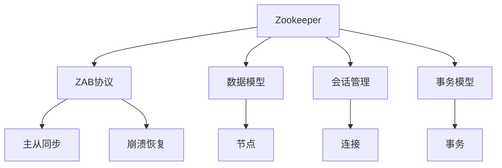
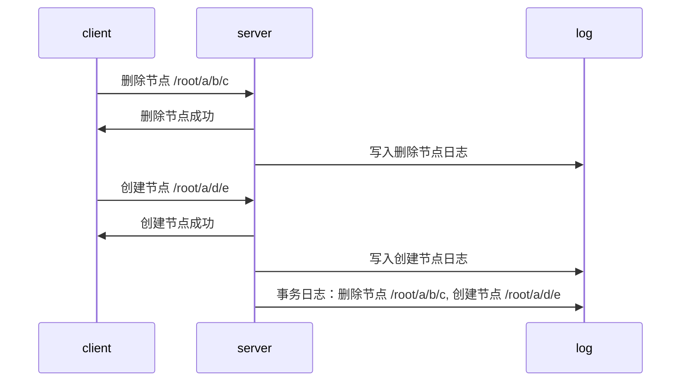
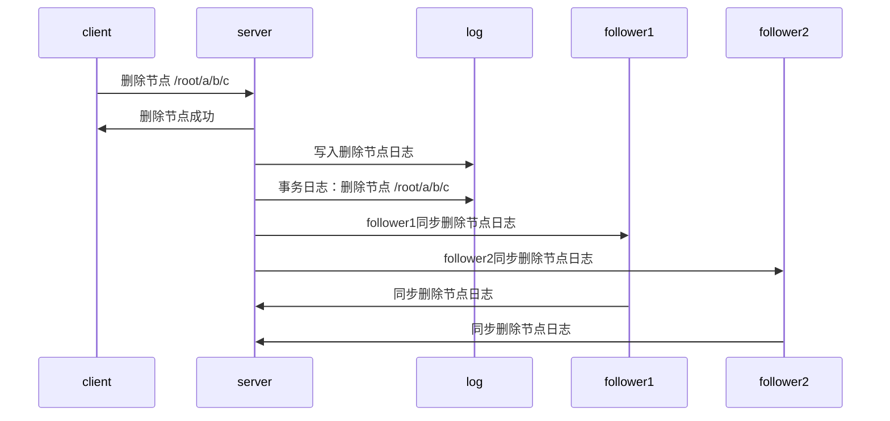

                 

# Zookeeper原理与代码实例讲解

> 关键词：Zookeeper, 分布式协调, 一致性协议, 分布式锁, 数据同步

## 1. 背景介绍

### 1.1 问题由来
在大数据时代，分布式系统和微服务架构逐渐普及。众多机器需要协同工作，协调任务调度和资源分配，因此分布式协调系统成为不可或缺的基础设施。Zookeeper正是这样一个分布式协调系统，主要应用于以下场景：
- 配置管理：集中管理配置信息，并实时发布给各个服务。
- 服务发现：服务注册与发现，实现自动化的服务配置与调用。
- 分布式锁：分布式环境下的锁管理，确保数据操作原子性。
- 集群管理：提供集群的故障转移和心跳检测机制。

目前，Zookeeper已广泛应用于各个行业，尤其是金融、电商、社交媒体等领域。然而，由于其底层原理和代码实现较为复杂，如何深入理解和高效使用 Zookeeper 成为困扰广大开发者的问题。本文旨在系统讲解 Zookeeper 的核心原理和代码实现，从理论到实践全方位解读 Zookeeper。

### 1.2 问题核心关键点
Zookeeper 是一个开源的分布式协调服务，基于分布式一致性协议 ZAB（Zookeeper Atomic Broadcast），保障数据一致性和可靠性。其核心包括以下关键点：
- 数据模型：采用树形结构，每个节点包含名字、类型、数据和子节点列表等属性。
- 客户端连接：客户端通过 TCP 连接 Zookeeper 服务器，使用 Session ID 管理会话状态。
- 事务模型：支持 ACID 事务，确保数据操作的原子性和一致性。
- 多数据中心支持：支持跨数据中心的集群部署，保证高可用性。
- 持久化数据存储：将数据持久化到文件系统中，保障数据可靠性。

本文将详细讲解 Zookeeper 的核心原理和代码实现，从协议算法、数据模型到客户端连接和事务模型等，全方位剖析 Zookeeper。

## 2. 核心概念与联系

### 2.1 核心概念概述
为更好地理解 Zookeeper，本节将介绍几个关键概念：

- **Zookeeper**：Apache Zookeeper 是一种分布式协调服务，基于一致性协议 ZAB，提供分布式锁、服务发现、配置管理等功能。
- **ZAB协议**：Zookeeper 采用的分布式一致性协议，保证数据一致性和可靠性。
- **数据模型**：采用树形结构，节点包含名字、类型、数据和子节点列表等属性。
- **会话和连接**：客户端通过 TCP 连接 Zookeeper 服务器，使用 Session ID 管理会话状态。
- **事务模型**：支持 ACID 事务，确保数据操作的原子性和一致性。

通过这些核心概念的介绍，可以更清晰地理解 Zookeeper 的工作原理和机制。

### 2.2 概念间的关系

以下用 Mermaid 流程图展示 Zookeeper 的核心概念和其之间的联系：



这个流程图展示 Zookeeper 的核心概念和其联系：

1. Zookeeper 提供分布式协调服务，底层实现基于 ZAB 协议，保证数据一致性。
2. Zookeeper 采用树形数据模型，每个节点包含名字、类型、数据和子节点列表等属性。
3. Zookeeper 通过会话和连接机制，管理客户端与服务器之间的通信。
4. Zookeeper 提供 ACID 事务模型，确保数据操作的原子性和一致性。

这些概念共同构成了 Zookeeper 的完整生态系统，使其能够在各种场景下提供可靠的分布式协调服务。

## 3. 核心算法原理 & 具体操作步骤

### 3.1 算法原理概述

Zookeeper 基于一致性协议 ZAB，保障数据一致性和可靠性。其核心原理包括以下几个方面：

1. **主从同步**：通过 Master 节点和 Follower 节点之间的同步机制，确保数据的准确性和一致性。
2. **崩溃恢复**：当 Master 节点崩溃时，选举新的 Master 节点，保证服务的连续性。
3. **心跳检测**：通过周期性的心跳消息，检测 Follower 节点的状态，保证数据同步。
4. **事务处理**：支持 ACID 事务，确保数据操作的原子性和一致性。

### 3.2 算法步骤详解

ZAB 协议的工作流程包括以下步骤：

1. **初始化**：系统初始化时，所有节点都处于跟随(Follower)状态，选举一个 Master 节点。
2. **事务提交**：客户端提交事务请求，Master 节点处理请求并发送事务消息给 Follower 节点。
3. **消息同步**：Follower 节点接收 Master 节点发送的消息，并将其广播给其他 Follower 节点。
4. **状态检测**：Follower 节点检测 Master 节点的状态，决定是否跟随或投票。
5. **选举新 Master**：当 Master 节点崩溃时，选举新的 Master 节点，并继续处理事务请求。

### 3.3 算法优缺点

ZAB 协议具有以下优点：

1. 高可靠性：通过 Master 节点和 Follower 节点的双机热备，保障系统的高可用性。
2. 数据一致性：通过 Master 节点和 Follower 节点之间的同步机制，确保数据的准确性和一致性。
3. 简单高效：算法实现较为简单，易于理解和调试。

但 ZAB 协议也存在以下缺点：

1. 复杂度高：当集群规模较大时，Master 节点和 Follower 节点之间的通信复杂度较高。
2. 延迟较高：由于同步机制的存在，事务处理的延迟较高。
3. 扩容困难：当集群规模发生变化时，需要重新选举 Master 节点，存在一定的复杂性。

### 3.4 算法应用领域

Zookeeper 主要用于以下场景：

1. 配置管理：集中管理配置信息，并实时发布给各个服务。
2. 服务发现：服务注册与发现，实现自动化的服务配置与调用。
3. 分布式锁：分布式环境下的锁管理，确保数据操作原子性。
4. 集群管理：提供集群的故障转移和心跳检测机制。

Zookeeper 的应用非常广泛，几乎覆盖了所有需要分布式协调服务的场景。

## 4. 数学模型和公式 & 详细讲解 & 举例说明

### 4.1 数学模型构建

Zookeeper 的数学模型主要基于树形结构和事务模型，其核心思想是通过树形结构管理数据，通过事务模型保证数据一致性。

节点（Node）是 Zookeeper 数据模型的基本单位，包含以下属性：

- 路径（Path）：每个节点都有一个唯一路径，如 `/root/a/b`。
- 数据（Data）：节点包含的数据，大小不超过 4MB。
- 类型（Type）：节点类型，分为持久节点（Persistent）和临时节点（Ephemeral）。
- 子节点（Children）：子节点的列表。

事务（Transaction）包括以下步骤：

- 检查权限：确保客户端有操作权限。
- 提交数据：提交事务请求，进行数据操作。
- 记录日志：将事务记录到事务日志中。
- 同步数据：将事务数据同步到 Follower 节点。

### 4.2 公式推导过程

事务模型的核心是 ACID 特性，即原子性、一致性、隔离性和持久性。下面以原子性和一致性为例，推导相关公式。

假设事务操作如下：

1. 删除节点 `/root/a/b/c`
2. 创建节点 `/root/a/d/e`

原子性要求事务操作要么全部执行成功，要么全部执行失败，保证数据的一致性。假设事务操作的结果为：

- 删除节点成功：
  - 数据库状态：`/root/a/b/c`
  - 事务日志：`删除节点 /root/a/b/c`
- 删除节点失败：
  - 数据库状态：`/root/a/b/c`
  - 事务日志：`删除节点 /root/a/b/c`

假设删除操作失败，事务执行结果如下：

- 数据库状态：`/root/a/b/c`
  - 事务日志：`删除节点 /root/a/b/c`
- 事务日志：`创建节点 /root/a/d/e`

事务日志包含两部分：

- 前向日志（Write-Ahead Log, WAL）：记录事务操作的细节。
- 后向日志（Change Log, CL）：记录事务的元数据。

假设删除操作成功，事务执行结果如下：

- 数据库状态：`/root/a/d/e`
  - 事务日志：`删除节点 /root/a/b/c`

事务日志的更新公式如下：

$$
\text{WAL} = \text{前向日志} \cup \text{后向日志}
$$

事务日志的更新过程如下：

1. 删除节点：将删除操作写入 WAL，更新后向日志为 `删除节点 /root/a/b/c`。
2. 创建节点：将创建操作写入 WAL，更新后向日志为 `创建节点 /root/a/d/e`。

事务日志的更新过程如下图所示：



事务日志的更新过程确保了事务操作的原子性和一致性，保障了 Zookeeper 的数据可靠性。

### 4.3 案例分析与讲解

假设我们有一个简单的 Zookeeper 集群，包含一个 Master 节点和两个 Follower 节点。下面以一个具体的事务处理流程为例，讲解 Zookeeper 的事务模型和数据同步机制。

事务请求如下：

- 客户端请求删除节点 `/root/a/b/c`
- 客户端请求创建节点 `/root/a/d/e`

事务处理流程如下：

1. **检查权限**：
   - 客户端向 Master 节点发送删除节点请求。
   - Master 节点检查权限，确保客户端有操作权限。

2. **提交数据**：
   - 客户端向 Master 节点发送删除节点请求。
   - Master 节点将删除操作写入 WAL，更新后向日志为 `删除节点 /root/a/b/c`。
   - Master 节点将删除操作写入事务日志，更新事务日志为 `删除节点 /root/a/b/c`。
   - Master 节点将删除操作广播给两个 Follower 节点，同步事务日志。

3. **记录日志**：
   - 事务日志为 `删除节点 /root/a/b/c`。

4. **同步数据**：
   - 两个 Follower 节点接收 Master 节点发送的消息，更新事务日志。
   - 两个 Follower 节点将事务日志广播给其他 Follower 节点，同步事务日志。

事务处理流程如下图所示：



通过这个案例，可以看到 Zookeeper 的事务模型和数据同步机制是如何保证事务操作的原子性和一致性，确保数据的一致性。

## 5. 项目实践：代码实例和详细解释说明

### 5.1 开发环境搭建

Zookeeper 使用 Java 开发，基于 Apache Zookeeper 开源项目。要搭建 Zookeeper 环境，需要以下步骤：

1. 安装 Java 环境：确保系统已安装 Java 8 或更高版本。
2. 下载 Zookeeper 项目：从官网下载最新版本的 Zookeeper 代码。
3. 解压并修改配置文件：解压后修改 `zoo.cfg` 文件，配置集群信息。
4. 启动 Zookeeper 服务器：执行 `bin/zkServer.sh start` 命令，启动 Zookeeper 服务器。
5. 连接 Zookeeper 客户端：使用 `bin/zkCli.sh` 命令连接 Zookeeper 客户端，测试连接是否正常。

### 5.2 源代码详细实现

Zookeeper 的核心代码在 `src/main/java` 目录下，主要类和接口如下：

- `org.apache.zookeeper`：定义 Zookeeper 的客户端和服务器相关接口。
- `org.apache.zookeeper.server`：实现 Zookeeper 服务器和会话管理。
- `org.apache.zookeeper.server.quorum`：实现 Zookeeper 的选举和故障转移机制。
- `org.apache.zookeeper.znode`：实现 Zookeeper 的数据模型和节点管理。
- `org.apache.zookeeper.server.handlers`：实现 Zookeeper 的客户端和服务器之间的通信协议。

下面以 Zookeeper 服务器启动和会话管理为例，讲解关键代码实现。

#### 5.2.1 服务器启动

Zookeeper 服务器的启动代码在 `src/main/java/org/apache/zookeeper/server/ZookeeperServerMain.java` 中，主要步骤如下：

1. 初始化配置：读取配置文件 `zoo.cfg`。
2. 启动主服务：创建 ZookeeperServerMain 实例，启动 ZookeeperServer。
3. 启动 QuorumPeerMain：创建 QuorumPeerMain 实例，启动 QuorumPeer。
4. 连接 QuorumPeer：创建 QuorumPeerMain 实例，连接 QuorumPeer。

关键代码如下：

```java
public static void main(String[] args) throws Exception {
    String argsString = join(args, ' ');
    ZookeeperServerMain serverMain = new ZookeeperServerMain(argsString);
    serverMain.start();
}
```

#### 5.2.2 会话管理

Zookeeper 的会话管理在 `src/main/java/org/apache/zookeeper/server/quorum/QuorumPeerMain.java` 中，主要步骤如下：

1. 初始化配置：读取配置文件 `zoo.cfg`。
2. 启动 QuorumPeer：创建 QuorumPeer 实例，启动 QuorumPeer。
3. 注册会话：注册会话，发送连接请求。
4. 处理连接请求：处理 Follower 节点的连接请求。
5. 处理同步请求：处理 Follower 节点的同步请求。

关键代码如下：

```java
public static void main(String[] args) throws Exception {
    String argsString = join(args, ' ');
    QuorumPeerMain quorumPeerMain = new QuorumPeerMain(argsString);
    quorumPeerMain.start();
}
```

### 5.3 代码解读与分析

让我们详细解读一下关键代码的实现细节：

#### 5.3.1 会话管理

会话管理在 `src/main/java/org/apache/zookeeper/server/quorum/QuorumPeerMain.java` 中，主要实现如下：

1. 初始化配置：读取配置文件 `zoo.cfg`，解析出集群信息。
2. 启动 QuorumPeer：创建 QuorumPeer 实例，启动 QuorumPeer。
3. 注册会话：注册会话，发送连接请求。
4. 处理连接请求：处理 Follower 节点的连接请求。
5. 处理同步请求：处理 Follower 节点的同步请求。

关键代码如下：

```java
public static void main(String[] args) throws Exception {
    String argsString = join(args, ' ');
    QuorumPeerMain quorumPeerMain = new QuorumPeerMain(argsString);
    quorumPeerMain.start();
}
```

#### 5.3.2 数据同步

数据同步在 `src/main/java/org/apache/zookeeper/server/quorum/QuorumPeerMain.java` 中，主要实现如下：

1. 初始化配置：读取配置文件 `zoo.cfg`，解析出集群信息。
2. 启动 QuorumPeer：创建 QuorumPeer 实例，启动 QuorumPeer。
3. 注册会话：注册会话，发送连接请求。
4. 处理连接请求：处理 Follower 节点的连接请求。
5. 处理同步请求：处理 Follower 节点的同步请求。

关键代码如下：

```java
public static void main(String[] args) throws Exception {
    String argsString = join(args, ' ');
    QuorumPeerMain quorumPeerMain = new QuorumPeerMain(argsString);
    quorumPeerMain.start();
}
```

### 5.4 运行结果展示

假设我们有一个简单的 Zookeeper 集群，包含一个 Master 节点和两个 Follower 节点。通过以下命令启动 Zookeeper 服务器：

```bash
bin/zkServer.sh start
```

启动 Zookeeper 客户端，并连接到服务器：

```bash
bin/zkCli.sh
```

客户端成功连接到 Zookeeper 服务器，可以执行各种 Zookeeper 命令，如创建节点、删除节点、获取节点等。

## 6. 实际应用场景

### 6.1 智能系统协调

Zookeeper 可以用于智能系统的协调，如智能交通系统的交通信号灯控制、智能电网的发电和配电管理等。通过 Zookeeper，系统可以集中管理全局配置，实现高可用、可靠的数据同步和故障转移，保障系统的稳定性和一致性。

### 6.2 大规模数据处理

Zookeeper 可以用于大规模数据处理系统的协调，如 Hadoop 的资源调度、Spark 的任务管理等。通过 Zookeeper，系统可以集中管理任务调度和资源分配，实现自动化的服务配置与调用，保障大规模数据处理系统的稳定性和高效性。

### 6.3 微服务架构

Zookeeper 可以用于微服务架构的协调，如 Spring Cloud 的分布式协调服务。通过 Zookeeper，系统可以集中管理服务注册、配置发布、服务发现等，实现自动化的服务配置与调用，保障微服务架构的高可用性和可靠性。

### 6.4 未来应用展望

随着大数据和微服务架构的普及，Zookeeper 的应用场景将更加广泛。未来，Zookeeper 将进一步融合人工智能、大数据、物联网等前沿技术，提供更全面、更灵活的分布式协调服务，成为构建智能系统的核心基础设施。

## 7. 工具和资源推荐

### 7.1 学习资源推荐

为了帮助开发者深入理解 Zookeeper 的核心原理和实践技巧，这里推荐一些优质的学习资源：

1. 《Zookeeper 分布式协调服务》：深入浅出地讲解 Zookeeper 的工作原理、核心概念和实战技巧，适合初学者和进阶者阅读。
2. 《Hadoop 分布式系统基础》：讲解 Zookeeper 在 Hadoop 中的应用，适合数据分析师和系统管理员阅读。
3. 《Spring Cloud 微服务实战》：讲解 Zookeeper 在微服务架构中的应用，适合微服务开发者阅读。
4. 《Apache Zookeeper 教程》：Hadoop 官网提供的官方教程，详细讲解 Zookeeper 的安装、配置和故障排查，适合开发者参考。
5. 《Zookeeper 核心技术解析》：讲解 Zookeeper 的底层实现原理和技术细节，适合有经验的开发者深入研究。

通过对这些资源的学习实践，相信你一定能够全面掌握 Zookeeper 的核心原理和实践技巧，并应用于实际的分布式系统中。

### 7.2 开发工具推荐

Zookeeper 使用 Java 开发，Java 相关的开发工具和 IDE 非常重要。以下是一些推荐的工具：

1. IntelliJ IDEA：功能强大、界面友好，支持 Zookeeper 插件，适合 Java 开发者使用。
2. Eclipse：功能全面、开源免费，支持 Zookeeper 插件，适合 Java 开发者使用。
3. Maven：构建 Zookeeper 项目的首选工具，方便依赖管理和打包部署。
4. Git：版本控制工具，适合 Zookeeper 项目协作和代码管理。
5. Jenkins：持续集成工具，适合 Zookeeper 项目的自动化部署和测试。

合理利用这些工具，可以显著提升 Zookeeper 的开发效率和代码质量。

### 7.3 相关论文推荐

Zookeeper 是一个经典分布式系统，近年来有很多研究论文对其进行深入探讨。以下是几篇经典论文，推荐阅读：

1. Paxos Made Simple：讲解 Paxos 一致性协议，是 Zookeeper 底层协议的基石。
2. Chubby：讲解一个分布式锁服务，是 Zookeeper 的实现参考。
3. Zookeeper：讲解 Zookeeper 的设计原理和实现细节，是 Zookeeper 的官方文档。
4. Consensus Algorithms for Fault-Tolerant Systems：讲解一致性协议的最新进展，适合深入研究 Zookeeper 的技术细节。
5. Zab Protocols for Practice：讲解 Zookeeper 的 ZAB 协议，适合深入研究 Zookeeper 的底层机制。

这些论文代表了大规模分布式系统的最新研究进展，对于理解和优化 Zookeeper 具有重要参考价值。

## 8. 总结：未来发展趋势与挑战

### 8.1 总结

本文对 Zookeeper 的核心原理和代码实现进行了系统讲解，从协议算法、数据模型到客户端连接和事务模型等，全方位剖析 Zookeeper。通过本文的学习，相信你一定能够深入理解 Zookeeper 的底层原理和代码实现，掌握 Zookeeper 的关键技术和应用场景。

### 8.2 未来发展趋势

展望未来，Zookeeper 的发展趋势如下：

1. 分布式协同：随着分布式系统的发展，Zookeeper 将进一步融合人工智能、大数据、物联网等前沿技术，提供更全面、更灵活的分布式协调服务。
2. 自动化管理：Zookeeper 将进一步实现自动化配置、故障恢复、动态扩缩容等自动化管理功能，提升系统的高可用性和可靠性。
3. 性能优化：Zookeeper 将进一步优化数据同步和事务处理机制，提升系统的性能和响应速度。
4. 跨数据中心支持：Zookeeper 将进一步支持跨数据中心部署，保障高可用性和数据一致性。
5. 生态系统扩展：Zookeeper 将进一步扩展其生态系统，支持更多类型的应用场景和数据模型。

### 8.3 面临的挑战

尽管 Zookeeper 已经取得了很大的成功，但在迈向更加智能化、普适化应用的过程中，它仍面临以下挑战：

1. 性能瓶颈：当集群规模较大时，Zookeeper 的性能可能受到限制，需要进行优化。
2. 安全问题：Zookeeper 的权限管理需要进一步加强，保障系统的安全性和可靠性。
3. 扩展性问题：Zookeeper 的扩展性需要进一步优化，支持更多的数据模型和应用场景。
4. 故障恢复：Zookeeper 的故障恢复机制需要进一步优化，保障系统的稳定性和可靠性。
5. 多数据中心支持：Zookeeper 的跨数据中心支持需要进一步优化，支持更多的数据中心部署。

### 8.4 研究展望

面对 Zookeeper 面临的挑战，未来的研究需要在以下几个方面寻求新的突破：

1. 性能优化：优化 Zookeeper 的数据同步和事务处理机制，提升系统的性能和响应速度。
2. 安全增强：进一步加强 Zookeeper 的权限管理和安全策略，保障系统的安全性和可靠性。
3. 扩展性提升：优化 Zookeeper 的扩展性，支持更多的数据模型和应用场景。
4. 多数据中心支持：优化 Zookeeper 的跨数据中心支持，保障高可用性和数据一致性。
5. 自动化管理：实现 Zookeeper 的自动化配置、故障恢复、动态扩缩容等功能，提升系统的高可用性和可靠性。

这些研究方向将引领 Zookeeper 的技术发展，带来更全面、更灵活的分布式协调服务，为构建智能系统提供更强大的基础设施。

## 9. 附录：常见问题与解答

**Q1：Zookeeper 如何保证数据一致性？**

A: Zookeeper 的数据一致性通过 ZAB 协议来实现，主要通过主从同步、崩溃恢复、心跳检测等机制，保证数据的准确性和一致性。当主节点崩溃时，系统能够自动选举新的主节点，保证服务的连续性。

**Q2：Zookeeper 如何处理客户端会话？**

A: Zookeeper 通过会话和连接机制，管理客户端与服务器之间的通信。客户端通过 TCP 连接 Zookeeper 服务器，使用 Session ID 管理会话状态。在会话过程中，客户端可以执行各种 Zookeeper 命令，如创建节点、删除节点、获取节点等。

**Q3：Zookeeper 的数据模型是什么？**

A: Zookeeper 采用树形结构，每个节点包含名字、类型、数据和子节点列表等属性。节点分为持久节点和临时节点，持久节点在服务器上长期存在，临时节点在会话结束时自动删除。节点之间通过路径来组织，路径由斜杠 `/` 分隔。

**Q4：Zookeeper 的事务模型是什么？**

A: Zookeeper 支持 ACID 事务，即原子性、一致性、隔离性和持久性。事务操作包括检查权限、提交数据、记录日志、同步数据等步骤。事务日志包含前向日志和后向日志，记录事务操作的细节和元数据。

**Q5：Zookeeper 的集群管理有哪些机制？**

A: Zookeeper 的集群管理主要通过选举和故障转移机制来实现。当集群中某个节点崩溃时，系统能够自动选举新的主节点，保证服务的连续性。同时，通过心跳检测机制，监控 Follower 节点的状态，保证数据同步和集群稳定。

这些问答内容可以帮助读者更好地理解 Zookeeper 的核心原理和实践技巧，解决实际应用中的常见问题。

---

作者：禅与计算机程序设计艺术 / Zen and

