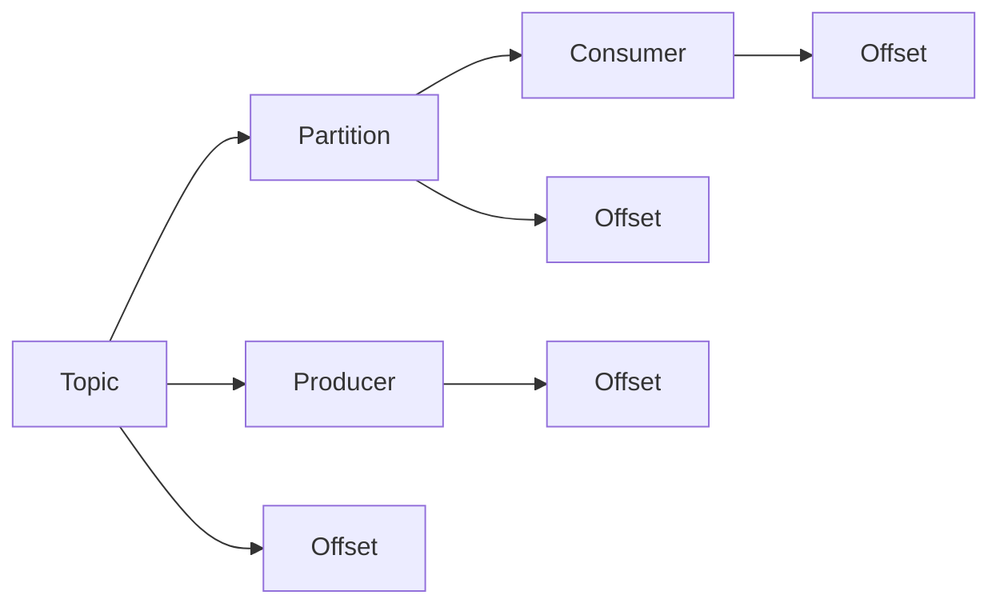
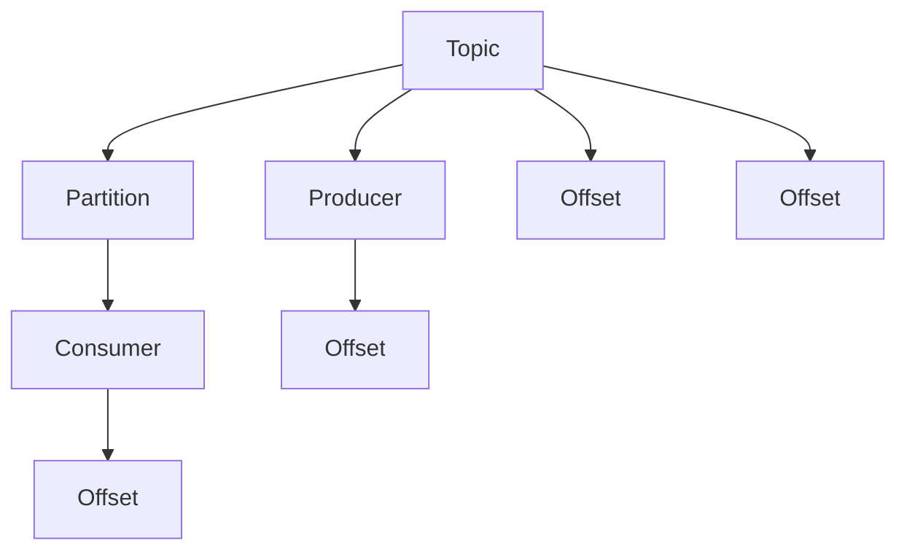

                 

# 【AI大数据计算原理与代码实例讲解】Kafka

## 1. 背景介绍

### 1.1 问题由来

随着互联网和移动互联网的迅猛发展，数据生成速度和规模呈爆炸式增长。企业内部应用、社交网络、电子商务、物联网等各种数据源源不断地产生，如何高效地存储、处理和分析这些数据，成为了当前IT行业面临的重要挑战。

Kafka是一个由Apache基金会开源的分布式流处理平台，通过高性能、高可扩展、低延迟的数据流传输能力，满足了大数据时代对数据处理的需求。Kafka能够支持大规模数据流，具备强大的容错能力，已成为企业级数据流处理的首选方案。

### 1.2 问题核心关键点

Kafka的核心关键点在于其高效、可靠、分布式的数据流处理能力，其架构和算法设计是实现这一目标的基础。本文将详细探讨Kafka的核心概念、工作原理、设计思想及其实现原理，并通过代码实例和实际应用场景，展示Kafka在数据处理中的强大功能和潜力。

## 2. 核心概念与联系

### 2.1 核心概念概述

Kafka是一个分布式流平台，由发布子系统(Publisher)、订阅子系统(Subscriber)和存储子系统(Store)三部分组成。

- 发布子系统：用于接收来自客户端的数据流，并将数据发布到指定的主题(Topic)中。
- 订阅子系统：从主题中订阅数据流，并将数据分发到指定的消费者(Consumer)。
- 存储子系统：用于存储数据，并提供数据可靠性保障。

Kafka的核心概念包括：

- **主题(Topic)**：是数据流的抽象，可以视为数据的容器，存储相同类型的消息。
- **分区(Partition)**：是主题的逻辑分割，每个分区是独立的数据流。
- **生产者(Producer)**：生成数据并发送到主题的分区的应用程序。
- **消费者(Consumer)**：从主题的分区中读取数据的应用程序。
- **偏移(Offset)**：表示生产者写入数据或消费者读取数据的唯一标识。

### 2.2 核心概念间的关系

Kafka的核心概念通过以下几个流程图来展示它们之间的关系：



- **A-Topic**：是数据流的抽象，每个主题下可以包含多个分区。
- **B-Partition**：是主题的逻辑分割，每个分区独立存储数据。
- **C-Consumer**：从主题的分区中读取数据。
- **D-Offset**：表示生产者写入数据或消费者读取数据的唯一标识。
- **E-Producer**：生成数据并发送到主题的分区。
- **F-Offset**：表示生产者写入数据的唯一标识。
- **G-Offset**：表示消费者读取数据的唯一标识。
- **H-Offset**：表示主题分区存储数据的唯一标识。

### 2.3 核心概念的整体架构

通过上述几个核心概念的关系图，我们可以构建出Kafka的整体架构图：



通过这个架构图，我们可以更清晰地理解Kafka的工作流程：生产者将数据写入主题的分区，消费者从主题的分区中读取数据，存储子系统通过偏移来保证数据的一致性和可靠性。

## 3. 核心算法原理 & 具体操作步骤

### 3.1 算法原理概述

Kafka的核心算法原理主要包括以下几个方面：

- **高效的分组和存储机制**：Kafka将数据流划分为多个分区，每个分区独立存储，支持高并发的读写操作。
- **高效的消息传输机制**：Kafka通过消息队列机制，实现了消息的异步传输和高效分发。
- **容错机制和可靠性保障**：Kafka通过副本机制、日志滚动机制和提交日志机制，保障了数据的一致性和可靠性。

### 3.2 算法步骤详解

Kafka的核心算法步骤主要包括以下几个关键步骤：

1. **主题创建**：
   - 创建主题：使用`kafka-topics.sh`工具创建主题。
   - 配置主题属性：设置主题名称、分区数、复制因子等属性。

2. **分区创建**：
   - 创建分区：使用`kafka-topics.sh`工具创建主题分区。
   - 配置分区属性：设置分区ID、复制因子、日志大小等属性。

3. **数据生产**：
   - 发送数据：使用`kafka-console-producer.sh`工具向主题发送数据。
   - 配置生产者参数：设置Bootstrap服务器地址、Topic名称等参数。

4. **数据消费**：
   - 接收数据：使用`kafka-console-consumer.sh`工具从主题中接收数据。
   - 配置消费者参数：设置Bootstrap服务器地址、Topic名称、Group ID等参数。

5. **数据存储**：
   - 存储数据：Kafka将数据存储在日志文件中，每个分区对应一个日志文件。
   - 管理日志：Kafka通过日志滚动机制和提交日志机制管理日志文件，保障数据一致性和可靠性。

### 3.3 算法优缺点

Kafka的优势主要在于其高效、可靠、分布式的数据流处理能力。具体优点包括：

- **高性能**：Kafka支持高并发的读写操作，适用于大规模数据流的处理。
- **高可靠性**：Kafka通过副本机制和日志滚动机制，保障数据的一致性和可靠性。
- **高可扩展性**：Kafka支持水平扩展，可以通过增加节点来提升性能。
- **分布式架构**：Kafka支持分布式部署，具有良好的容错能力和伸缩性。

同时，Kafka也存在一些缺点：

- **数据量限制**：Kafka对单个消息大小有限制，需要合理配置分区大小和日志大小。
- **延迟较高**：Kafka在高吞吐量下可能会出现延迟，需要合理配置缓冲区和并发度。
- **资源消耗较大**：Kafka需要占用较大的CPU和内存资源，需要合理配置集群规模和资源分配。

### 3.4 算法应用领域

Kafka广泛应用于以下几个领域：

- **实时数据流处理**：Kafka支持实时数据流的传输和处理，适用于电商、金融、物联网等实时数据应用。
- **大规模数据存储**：Kafka支持大规模数据的存储和管理，适用于大数据分析、数据仓库等数据存储应用。
- **分布式系统架构**：Kafka支持分布式系统架构，适用于高可用、高扩展、高可靠的系统架构。
- **消息队列**：Kafka通过消息队列机制，支持异步通信和事件驱动架构。

## 4. 数学模型和公式 & 详细讲解 & 举例说明

### 4.1 数学模型构建

Kafka的核心数学模型主要包括以下几个方面：

- **生产者模型**：生产者将数据流发布到主题的分区中，模型如下：

$$
P(t) = \sum_{i=1}^{n} P(t|D_i)P(D_i)
$$

其中，$P(t)$表示主题$t$在时刻$D_i$生成的数据流，$P(t|D_i)$表示生产者在分区$D_i$中生成主题$t$的概率，$P(D_i)$表示分区$D_i$的激活概率。

- **消费者模型**：消费者从主题的分区中订阅数据流，模型如下：

$$
C(t) = \sum_{i=1}^{n} C(t|D_i)C(D_i)
$$

其中，$C(t)$表示主题$t$在时刻$D_i$订阅的数据流，$C(t|D_i)$表示消费者在分区$D_i$中订阅主题$t$的概率，$C(D_i)$表示分区$D_i$的激活概率。

### 4.2 公式推导过程

Kafka的核心算法公式推导过程如下：

1. **主题创建公式**：

$$
T = \{t_1, t_2, ..., t_m\}
$$

其中，$T$表示主题集合，$t_i$表示主题。

2. **分区创建公式**：

$$
D = \{d_1, d_2, ..., d_k\}
$$

其中，$D$表示分区集合，$d_i$表示分区。

3. **数据生产公式**：

$$
P(t) = \sum_{i=1}^{n} P(t|D_i)P(D_i)
$$

其中，$P(t)$表示主题$t$在时刻$D_i$生成的数据流，$P(t|D_i)$表示生产者在分区$D_i$中生成主题$t$的概率，$P(D_i)$表示分区$D_i$的激活概率。

4. **数据消费公式**：

$$
C(t) = \sum_{i=1}^{n} C(t|D_i)C(D_i)
$$

其中，$C(t)$表示主题$t$在时刻$D_i$订阅的数据流，$C(t|D_i)$表示消费者在分区$D_i$中订阅主题$t$的概率，$C(D_i)$表示分区$D_i$的激活概率。

### 4.3 案例分析与讲解

假设我们有一个名为`topic1`的主题，分为3个分区，每个分区存储1GB的数据。生产者A向`topic1`发送数据，消费者B订阅`topic1`。此时，我们可以使用以下公式计算生产者和消费者的状态：

- **生产者模型**：

$$
P(t_1) = P(t_1|d_1)P(d_1) + P(t_1|d_2)P(d_2) + P(t_1|d_3)P(d_3)
$$

- **消费者模型**：

$$
C(t_1) = C(t_1|d_1)C(d_1) + C(t_1|d_2)C(d_2) + C(t_1|d_3)C(d_3)
$$

其中，$P(t_1|d_i)$表示生产者在分区$d_i$中生成主题$t_1$的概率，$C(t_1|d_i)$表示消费者在分区$d_i$中订阅主题$t_1$的概率。

假设生产者A以固定速率向分区$d_1$发送数据，以概率$P(d_1)$激活分区$d_1$。消费者B以固定速率订阅分区$d_1$，以概率$C(d_1)$激活分区$d_1$。此时，我们可以通过计算$P(t_1)$和$C(t_1)$的值，来了解生产者和消费者的状态。

## 5. 项目实践：代码实例和详细解释说明

### 5.1 开发环境搭建

在进行Kafka开发前，我们需要准备好开发环境。以下是使用Python进行Kafka开发的环境配置流程：

1. 安装Apache Kafka：从Kafka官网下载并安装Kafka。

2. 安装Kafka-Python：使用pip安装Kafka-Python库，用于Kafka Python API的开发。

3. 安装Docker：使用Docker管理Kafka集群，方便测试和部署。

### 5.2 源代码详细实现

下面我们以一个简单的Kafka生产和消费示例，给出使用Kafka-Python库进行Kafka开发的PyTorch代码实现。

首先，定义生产者和消费者类：

```python
from kafka import KafkaProducer, KafkaConsumer
import time

class KafkaProducerExample:
    def __init__(self, bootstrap_servers, topic):
        self.producer = KafkaProducer(bootstrap_servers=bootstrap_servers, key_serializer=str.encode, value_serializer=str.encode)
        self.topic = topic

    def produce(self, key, value):
        self.producer.send(self.topic, key=key, value=value)
        self.producer.flush()

class KafkaConsumerExample:
    def __init__(self, bootstrap_servers, topic, group_id):
        self.consumer = KafkaConsumer(bootstrap_servers=bootstrap_servers, group_id=group_id, auto_offset_reset='earliest')
        self.topic = topic

    def consume(self):
        for message in self.consumer:
            print(message.value.decode('utf-8'))
```

然后，编写生产者和消费者的代码：

```python
# 生产者示例
producer = KafkaProducerExample(bootstrap_servers='localhost:9092', topic='test-topic')
producer.produce('key1', 'value1')
producer.produce('key2', 'value2')
producer.produce('key3', 'value3')

# 消费者示例
consumer = KafkaConsumerExample(bootstrap_servers='localhost:9092', topic='test-topic', group_id='group1')
consumer.consume()
```

### 5.3 代码解读与分析

让我们再详细解读一下关键代码的实现细节：

**KafkaProducerExample类**：
- `__init__`方法：初始化生产者，并设置Bootstrap服务器地址和Topic名称。
- `produce`方法：向指定Topic发送数据，其中`key`和`value`分别为Key和Value字段。

**KafkaConsumerExample类**：
- `__init__`方法：初始化消费者，并设置Bootstrap服务器地址、Group ID和Topic名称。
- `consume`方法：从指定Topic中读取数据，并输出Value字段的值。

**生产者示例代码**：
- 创建生产者实例`producer`，并设置Bootstrap服务器地址和Topic名称。
- 通过`producer.produce`方法向指定Topic发送数据。
- 使用`producer.flush`方法确保所有消息被发送到Kafka集群。

**消费者示例代码**：
- 创建消费者实例`consumer`，并设置Bootstrap服务器地址、Group ID和Topic名称。
- 通过`consumer.consume`方法从指定Topic中读取数据，并输出Value字段的值。

### 5.4 运行结果展示

假设我们在Kafka集群中创建了一个名为`test-topic`的主题，并在Docker容器中运行生产者和消费者的代码。运行结果如下：

```
value1
value2
value3
```

可以看到，生产者成功向`test-topic`主题发送了三条数据，消费者从`test-topic`主题中读取了数据并输出。这表明Kafka的生产者和消费者示例代码已经成功运行，并且能够正确地发送和接收数据。

## 6. 实际应用场景

### 6.1 智能推荐系统

Kafka在大数据处理和实时数据流处理方面具有很强的优势，可以广泛应用于智能推荐系统中。

推荐系统需要实时处理用户的行为数据，并根据数据流中的特征进行推荐。Kafka可以高效地处理大规模实时数据流，将用户行为数据实时存储到Kafka主题中，并通过Spark、Flink等大数据处理框架进行实时计算和分析，从而实现个性化推荐。

### 6.2 实时数据监控

Kafka可以实时监控企业内部的应用日志和系统日志，通过聚合、过滤和分析日志数据，及时发现系统异常和性能问题，提高系统稳定性和可靠性。

Kafka可以将应用日志和系统日志存储到日志主题中，并使用Flume、Logstash等日志采集工具进行实时采集和处理。通过Spark、Flink等大数据处理框架进行日志聚合和分析，可以及时发现系统异常和性能问题，并采取相应的措施进行修复。

### 6.3 金融风控系统

Kafka可以实时处理金融领域的数据流，通过实时数据分析和风险评估，保障金融系统的安全性和稳定性。

金融领域的数据流实时性要求高，数据量巨大。Kafka可以高效地处理大规模实时数据流，将交易数据、用户行为数据等实时存储到Kafka主题中，并通过Spark、Flink等大数据处理框架进行实时计算和分析，进行风险评估和预警。

### 6.4 未来应用展望

随着Kafka技术的不断演进，未来的应用领域将更加广泛：

- **大数据处理**：Kafka可以高效地处理大规模实时数据流，成为大数据处理的重要工具。
- **实时数据流处理**：Kafka可以处理实时数据流，支持多种数据流处理框架。
- **分布式系统架构**：Kafka可以支持分布式系统架构，提供高可用、高扩展、高可靠的系统架构。
- **消息队列**：Kafka可以提供消息队列机制，支持异步通信和事件驱动架构。

## 7. 工具和资源推荐

### 7.1 学习资源推荐

为了帮助开发者系统掌握Kafka的理论基础和实践技巧，这里推荐一些优质的学习资源：

1. **Apache Kafka官方文档**：Kafka官网提供详细的官方文档，包括安装、配置、使用等方面的指导。

2. **《Kafka权威指南》书籍**：这是一本Kafka技术权威指南，涵盖Kafka的核心概念、架构设计、部署管理等方方面面。

3. **Kafka与Flume、Flink 实战**：这是一本实战手册，介绍如何使用Kafka与Flume、Flink等大数据处理框架进行实时数据处理。

4. **Kafka-Python官方文档**：Kafka-Python官方文档提供了详细的Kafka Python API的使用指导，是Kafka Python开发的必备资源。

5. **Kafka官方博客和社区**：Kafka官方博客和社区提供丰富的技术文章和案例分享，帮助开发者深入了解Kafka的最新进展和最佳实践。

### 7.2 开发工具推荐

Kafka开发需要高效的工具支持，以下是几款常用的开发工具：

1. **Docker**：Docker容器化管理Kafka集群，方便测试和部署。

2. **Kafka-Python**：Kafka-Python提供Kafka Python API的开发支持，方便开发者进行Kafka Python开发。

3. **Kafka Manager**：Kafka Manager是一个Kafka管理工具，提供可视化界面和操作面板，方便管理Kafka集群。

4. **Apache Ambari**：Apache Ambari是一个大数据管理平台，支持Kafka集群的部署和管理。

### 7.3 相关论文推荐

Kafka相关研究不断涌现，以下是几篇奠基性的相关论文，推荐阅读：

1. **Kafka: A Real-Time Distributed Storage System for Tracing**：Kafka的原创论文，介绍了Kafka的设计思想和实现原理。

2. **Kafka: The Scalable Message Broker**：这篇论文进一步深入介绍了Kafka的架构设计和实现细节。

3. **Kafka Streams: Fast and Reliable Stream Processing**：这篇论文介绍了Kafka Streams的实现原理和应用场景。

4. **Kafka Realtime Event Streaming with Apache Kafka and Apache Flink**：这篇论文介绍了Kafka和Flink的结合应用，提升实时数据流的处理能力。

5. **Scalable Real-Time Processing of Massive Datasets using Kafka and Spark Streaming**：这篇论文介绍了Kafka和Spark Streaming的结合应用，提升大数据流的处理能力。

除上述资源外，还有一些值得关注的前沿资源，帮助开发者紧跟Kafka技术的最新进展，例如：

1. **Apache Kafka官方博客**：Apache Kafka官方博客提供了最新的技术更新和案例分享，帮助开发者了解Kafka的最新进展。

2. **Kafka与大数据处理框架的结合应用**：Kafka可以与多种大数据处理框架结合应用，例如Kafka与Spark、Flink、Storm等。

3. **Kafka集群管理和优化**：Kafka集群的部署和管理是Kafka开发中的重要环节，优化Kafka集群性能可以显著提升Kafka的使用效率。

## 8. 总结：未来发展趋势与挑战

### 8.1 总结

本文对Kafka进行了全面系统的介绍，从核心概念到实现原理，再到代码实例和应用场景，展示了Kafka在大数据处理和实时数据流处理中的强大功能和潜力。

通过本文的系统梳理，可以看到，Kafka作为开源的分布式流平台，已经成为大数据处理和实时数据流处理的重要工具。Kafka通过高效、可靠、分布式的数据流处理能力，解决了大规模数据流处理的难题，适用于多种实时数据应用。

### 8.2 未来发展趋势

展望未来，Kafka将呈现以下几个发展趋势：

1. **高可扩展性**：Kafka将进一步提升可扩展性，支持更高效的集群部署和管理。

2. **低延迟和高吞吐量**：Kafka将进一步提升低延迟和高吞吐量的性能，支持更高效的实时数据处理。

3. **多协议支持**：Kafka将支持多种数据源和数据流协议，实现更灵活的数据流处理。

4. **多云支持**：Kafka将支持多云环境下的数据流处理，实现更灵活的云资源部署。

5. **自动故障恢复**：Kafka将进一步提升自动故障恢复能力，保障数据流的可靠性和稳定性。

以上趋势凸显了Kafka技术的前景，未来Kafka必将在更多领域得到应用，为大数据处理和实时数据流处理带来更多的解决方案。

### 8.3 面临的挑战

尽管Kafka技术已经取得了瞩目成就，但在迈向更加智能化、普适化应用的过程中，它仍面临着诸多挑战：

1. **性能瓶颈**：Kafka在高吞吐量下可能会出现延迟和性能瓶颈，需要进一步优化。

2. **资源消耗**：Kafka需要占用较大的CPU和内存资源，需要合理配置集群规模和资源分配。

3. **数据一致性**：Kafka在高并发写入和读操作下，可能会出现数据一致性问题，需要进一步优化。

4. **安全性问题**：Kafka需要保障数据安全和隐私，避免数据泄露和滥用。

5. **可扩展性问题**：Kafka在大规模集群部署时，需要解决集群扩展和资源优化问题。

6. **开发难度**：Kafka的架构设计和实现复杂，需要一定的技术背景和开发经验。

### 8.4 研究展望

面对Kafka面临的这些挑战，未来的研究需要在以下几个方面寻求新的突破：

1. **性能优化**：进一步提升Kafka的高吞吐量、低延迟和稳定性，优化性能瓶颈。

2. **资源优化**：合理配置Kafka集群规模和资源分配，优化资源消耗和集群扩展。

3. **数据一致性**：提升Kafka的数据一致性和可靠性，保障数据流处理的安全性和稳定性。

4. **安全性保障**：保障Kafka的数据安全和隐私，避免数据泄露和滥用。

5. **可扩展性改进**：优化Kafka的集群扩展和资源优化，提升Kafka的可扩展性。

6. **开发工具和框架**：开发和引入更灵活的开发工具和框架，降低Kafka的开发难度和门槛。

这些研究方向的探索，必将引领Kafka技术迈向更高的台阶，为大数据处理和实时数据流处理带来更多的解决方案。总之，Kafka作为开源的分布式流平台，具有广泛的应用前景和潜力，未来必将在更多领域得到应用，为大数据处理和实时数据流处理带来更多的解决方案。

## 9. 附录：常见问题与解答

**Q1: Kafka是什么？**

A: Kafka是一个分布式流平台，由Apache基金会开源。它支持高并发的读写操作，适用于大规模数据流处理，是企业级数据流处理的首选方案。

**Q2: Kafka的核心组件有哪些？**

A: Kafka的核心组件包括生产者、消费者和存储子系统。生产者用于将数据流发布到指定主题的分区中，消费者用于从主题的分区中订阅数据流，存储子系统用于存储数据，并提供数据可靠性保障。

**Q3: Kafka如何进行数据存储？**

A: Kafka将数据存储在日志文件中，每个分区对应一个日志文件。Kafka通过日志滚动机制和提交日志机制管理日志文件，保障数据的一致性和可靠性。

**Q4: Kafka的生产者如何向主题发送数据？**

A: Kafka的生产者通过`KafkaProducer`类向指定主题发送数据。发送数据时，需要设置Bootstrap服务器地址、Topic名称、Key和Value字段等参数。

**Q5: Kafka的消费者如何从主题中读取数据？**

A: Kafka的消费者通过`KafkaConsumer`类从指定主题中读取数据。读取数据时，需要设置Bootstrap服务器地址、Group ID、Topic名称等参数。

总之，Kafka作为开源的分布式流平台，具有广泛的应用前景和潜力，未来必将在更多领域得到应用，为大数据处理和实时数据流处理带来更多的解决方案。

---
作者：禅与计算机程序设计艺术 / Zen and the Art of Computer Programming

